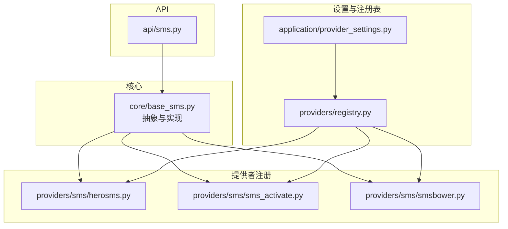
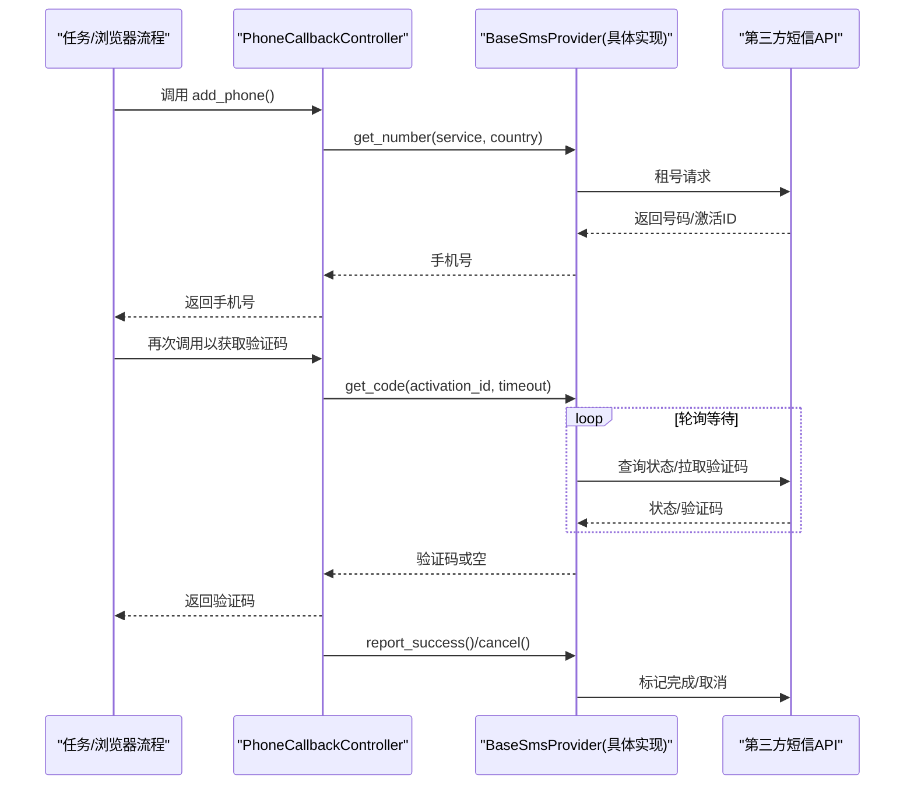
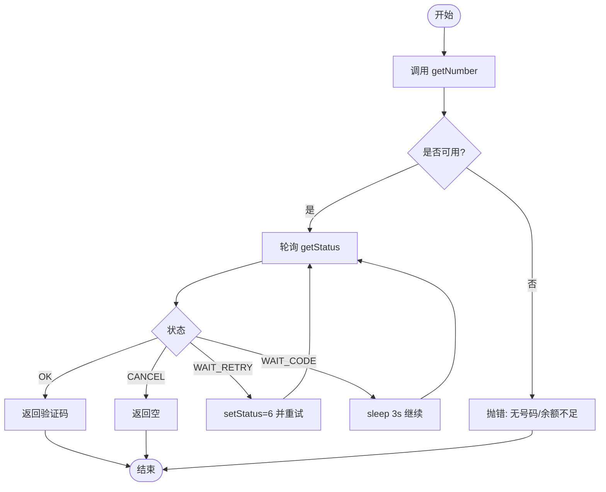
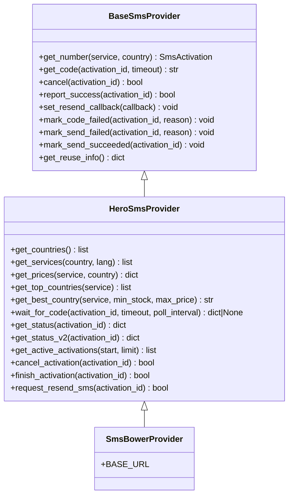
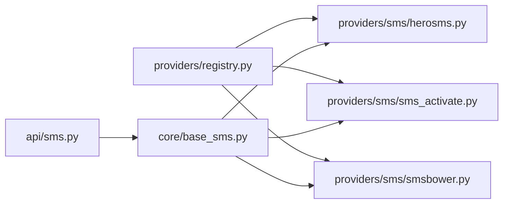

# 短信服务提供商

<cite>
**本文引用的文件**
- [core/base_sms.py](file://core/base_sms.py)
- [providers/sms/herosms.py](file://providers/sms/herosms.py)
- [providers/sms/sms_activate.py](file://providers/sms/sms_activate.py)
- [providers/sms/smsbower.py](file://providers/sms/smsbower.py)
- [api/sms.py](file://api/sms.py)
- [application/provider_settings.py](file://application/provider_settings.py)
- [providers/registry.py](file://providers/registry.py)
- [tests/test_herosms_api.py](file://tests/test_herosms_api.py)
- [tests/test_sms_provider.py](file://tests/test_sms_provider.py)
</cite>

## 目录
1. [简介](#简介)
2. [项目结构](#项目结构)
3. [核心组件](#核心组件)
4. [架构总览](#架构总览)
5. [详细组件分析](#详细组件分析)
6. [依赖关系分析](#依赖关系分析)
7. [性能与优化](#性能与优化)
8. [故障排查指南](#故障排查指南)
9. [结论](#结论)
10. [附录：配置示例与自定义开发](#附录：配置示例与自定义开发)

## 简介
本仓库实现了统一的短信接码服务抽象，并提供了对多种第三方短信提供商的集成能力，包括 HeroSMS、SMS Activate、SMSBower。系统通过基类统一了“租号—等码—取消/完成”的生命周期，封装了不同服务商的 API 差异（如接口地址、参数格式、状态码），并提供自动国家选择、号码复用、去重、重试、回调通知等高级能力。同时提供 REST API 用于查询余额、国家、服务、价格以及智能选国。

## 项目结构
围绕短信能力的核心代码集中在以下位置：
- 抽象与实现：core/base_sms.py（定义 BaseSmsProvider、各 Provider 实现、工厂与回调控制器）
- 注册入口：providers/sms/*.py（将具体 Provider 注册到统一注册表）
- 运行时 API：api/sms.py（暴露 /sms/* 查询与工具接口）
- 设置管理：application/provider_settings.py（持久化 provider 配置）
- 注册表：providers/registry.py（统一发现与创建 provider）
- 测试：tests/test_*（覆盖关键流程与边界条件）

图表来源
- [core/base_sms.py:28-71](file://core/base_sms.py#L28-L71)
- [providers/sms/herosms.py:10-18](file://providers/sms/herosms.py#L10-L18)
- [providers/sms/sms_activate.py:7-10](file://providers/sms/sms_activate.py#L7-L10)
- [providers/sms/smsbower.py:6-9](file://providers/sms/smsbower.py#L6-L9)
- [api/sms.py:1-45](file://api/sms.py#L1-L45)
- [application/provider_settings.py:7-43](file://application/provider_settings.py#L7-L43)
- [providers/registry.py:28-91](file://providers/registry.py#L28-L91)

章节来源
- [core/base_sms.py:28-71](file://core/base_sms.py#L28-L71)
- [providers/registry.py:28-91](file://providers/registry.py#L28-L91)

## 核心组件
- BaseSmsProvider：抽象出 get_number/get_code/cancel/report_success 等通用方法，以及可选的重试/失败标记钩子。
- SmsActivateProvider：对接 SMS-Activate 的 getNumber/getStatus/setStatus 等文本协议。
- HeroSmsProvider：对接 HeroSMS，支持 V2 JSON 响应、活跃激活列表轮询、验证码去重、短生命周期号码复用、自动国家选择、请求重发等。
- SmsBowerProvider：继承 HeroSmsProvider，仅改变 BASE_URL，并对需要鉴权的接口强制携带 api_key。
- PhoneCallbackController：封装 add_phone 调用流程（先租号再等码），处理生命周期、锁、日志与清理。
- create_sms_provider：根据 provider_key 从配置构造具体 Provider。
- API 路由：/sms/herosms/* 和 /sms/smsbower/* 暴露余额、国家、服务、价格、智能选国等能力。

章节来源
- [core/base_sms.py:28-71](file://core/base_sms.py#L28-L71)
- [core/base_sms.py:108-182](file://core/base_sms.py#L108-L182)
- [core/base_sms.py:328-1025](file://core/base_sms.py#L328-L1025)
- [core/base_sms.py:1028-1040](file://core/base_sms.py#L1028-L1040)
- [core/base_sms.py:1103-1266](file://core/base_sms.py#L1103-L1266)
- [api/sms.py:48-147](file://api/sms.py#L48-L147)
- [api/sms.py:169-214](file://api/sms.py#L169-L214)

## 架构总览
下图展示了从上层任务到短信提供商的调用链，以及内部的状态流转。

图表来源
- [core/base_sms.py:1103-1266](file://core/base_sms.py#L1103-L1266)
- [core/base_sms.py:108-182](file://core/base_sms.py#L108-L182)
- [core/base_sms.py:328-1025](file://core/base_sms.py#L328-L1025)

## 详细组件分析

### SMS Activate 集成
- 认证方式：通过 api_key 作为请求参数传递。
- 主要流程：
  - 租号：getNumber(service=服务代码, country=国家ID)
  - 等码：getStatus(id)，循环直到 STATUS_OK/STATUS_WAIT_RETRY/STATUS_CANCEL
  - 取消/成功：setStatus(status=8/6)
- 错误处理：当返回 NO_NUMBERS 或 NO_BALANCE 时抛出异常；其他未知状态直接报错。
- 超时与重试：_request 使用固定超时；轮询间隔固定为 3 秒；遇到 WAIT_RETRY 会主动 setStatus 后继续等待。

图表来源
- [core/base_sms.py:108-182](file://core/base_sms.py#L108-L182)

章节来源
- [core/base_sms.py:77-182](file://core/base_sms.py#L77-L182)
- [tests/test_sms_provider.py:17-40](file://tests/test_sms_provider.py#L17-L40)
- [tests/test_sms_provider.py:295-312](file://tests/test_sms_provider.py#L295-L312)

### HeroSMS 集成
- 认证方式：api_key 作为请求参数；部分元数据接口可不带 key。
- 租号策略：
  - 优先尝试 getNumberV2（JSON 响应），失败回退到 getNumber（文本）。
  - 动态计算 maxPrice：基于 getPrices 的实际成本，默认取成本的 3 倍但不超过用户上限，确保拿到物理号码。
  - 若 NO_NUMBERS 且未达用户上限，则提高 maxPrice 重试一次。
- 等码与去重：
  - 多通道轮询：getStatusV2 > getStatus > getActiveActivations。
  - 事件去重：基于 activation_id + code + 标准化事件字段生成唯一键，避免重复消费相同验证码。
  - 自动重发：等待 90 秒后触发 resend（可结合外部回调），之后每 30 秒重发一次。
- 号码复用：
  - 本地缓存文件记录当前号码的使用次数、已用验证码集合、尝试过的短信事件键。
  - 支持按最大成功次数或剩余时间停止复用。
- 智能国家选择：
  - 通过 getTopCountriesByServiceRank 或 getPrices 解析，按价格升序、库存降序排序，支持最小库存与最高价格过滤。
- 错误处理：
  - 兼容多种响应格式（字符串/字典/嵌套 data/result/response）。
  - 对访问受限、未知响应进行明确报错。

图表来源
- [core/base_sms.py:28-71](file://core/base_sms.py#L28-L71)
- [core/base_sms.py:328-1025](file://core/base_sms.py#L328-L1025)
- [core/base_sms.py:1028-1040](file://core/base_sms.py#L1028-L1040)

章节来源
- [core/base_sms.py:328-1025](file://core/base_sms.py#L328-L1025)
- [tests/test_sms_provider.py:314-456](file://tests/test_sms_provider.py#L314-L456)

### SMSBower 集成
- 与 HeroSMS 完全一致的 API 语义，仅 BASE_URL 不同。
- 所有接口均强制携带 api_key（即使某些元数据接口在 HeroSMS 中可不带 key）。
- 可通过相同的 /sms/smsbower/* 端点查询余额、国家、服务、价格。

章节来源
- [core/base_sms.py:1028-1040](file://core/base_sms.py#L1028-L1040)
- [api/sms.py:169-214](file://api/sms.py#L169-L214)

### 统一注册与工厂
- 每个 Provider 模块在导入时通过 @register_provider("sms", "<key>") 将自己注册到全局注册表。
- load_all() 扫描 providers.sms 包下所有模块并导入，完成自动发现。
- create_provider/from_config 可用于更通用的驱动模式；短信领域额外提供 create_sms_provider 以适配现有配置键。

章节来源
- [providers/registry.py:28-91](file://providers/registry.py#L28-L91)
- [providers/sms/herosms.py:10-18](file://providers/sms/herosms.py#L10-L18)
- [providers/sms/sms_activate.py:7-10](file://providers/sms/sms_activate.py#L7-L10)
- [providers/sms/smsbower.py:6-9](file://providers/sms/smsbower.py#L6-L9)
- [core/base_sms.py:1063-1100](file://core/base_sms.py#L1063-L1100)

## 依赖关系分析
- 低耦合：BaseSmsProvider 定义了稳定契约，具体 Provider 只关注各自 API 细节。
- 高内聚：HeroSmsProvider 内部集中处理了复杂逻辑（去重、复用、智能选国、重发）。
- 外部依赖：requests 用于 HTTP 调用；文件系统用于 HeroSMS 缓存；FastAPI 暴露 REST API。
- 可能的循环依赖：无直接循环，Provider 模块仅依赖 base_sms 与 registry。

图表来源
- [providers/registry.py:28-91](file://providers/registry.py#L28-L91)
- [core/base_sms.py:28-71](file://core/base_sms.py#L28-L71)
- [api/sms.py:1-45](file://api/sms.py#L1-L45)

章节来源
- [providers/registry.py:28-91](file://providers/registry.py#L28-L91)
- [core/base_sms.py:28-71](file://core/base_sms.py#L28-L71)

## 性能与优化
- 号码复用与去重：HeroSMS 通过本地缓存减少重复租号与重复消费验证码，提升成功率并降低成本。
- 智能国家选择：优先使用专用排名接口，否则回退到全量价格解析，降低无效请求。
- 动态定价策略：根据实际成本动态调整 maxPrice，兼顾拿到物理号码与成本控制。
- 轮询与重发：合理设置轮询间隔与重发频率，避免过度请求；支持外部回调触发重发。
- 超时与代理：各 Provider 支持超时与代理配置，便于网络环境调优。

[本节为通用指导，不直接分析具体文件]

## 故障排查指南
- 未配置 API Key：
  - 现象：创建 Provider 时报错提示未配置。
  - 解决：在对应 provider 的配置中填写正确的 API Key。
- 无可用号码/余额不足：
  - 现象：租号失败，抛出包含 NO_NUMBERS 或 NO_BALANCE 的错误。
  - 解决：检查余额、更换国家或服务代码，或启用智能选国。
- 验证码未到达：
  - 现象：等待超时返回空。
  - 解决：确认目标平台是否接受该号码；检查重发机制是否生效；必要时切换国家或 Provider。
- 验证码被拒绝：
  - 现象：目标平台校验失败。
  - 解决：调用 mark_code_failed 触发重发与去重记录；检查号码类型（虚拟/物理）。
- 访问受限：
  - 现象：查询国家/服务时报 No access。
  - 解决：检查 API Key 权限或联系服务商。

章节来源
- [core/base_sms.py:108-182](file://core/base_sms.py#L108-L182)
- [core/base_sms.py:328-1025](file://core/base_sms.py#L328-L1025)
- [tests/test_herosms_api.py:14-27](file://tests/test_herosms_api.py#L14-L27)

## 结论
本方案通过抽象基类与多 Provider 实现，统一了短信接码服务的接入与使用体验。HeroSMS 提供了丰富的增强能力（智能选国、号码复用、事件去重、自动重发），SMS Activate 与 SMSBower 则以最小成本兼容既有生态。配合 REST API 与前端设置界面，可实现灵活的配置管理与运维监控。

[本节为总结性内容，不直接分析具体文件]

## 附录：配置示例与自定义开发

### 配置项说明（来自工厂与 API 推导）
- 通用
  - sms_proxy/proxy：HTTP/HTTPS 代理地址
  - sms_service/sms_country：默认服务与国家
- SMS Activate
  - sms_activate_api_key：必填
  - sms_activate_country/sms_activate_default_country：默认国家
- HeroSMS
  - herosms_api_key：必填
  - herosms_service/herosms_default_service：默认服务
  - herosms_country/herosms_default_country：默认国家
  - herosms_max_price：价格上限
  - register_reuse_phone_to_max：是否允许号码复用至最大次数
  - register_phone_extra_max/register_phone_success_max：最大成功次数
  - herosms_auto_country/herosms_auto_country_min_stock/herosms_auto_country_max_price：智能选国开关与阈值
- SMSBower
  - smsbower_api_key：必填
  - smsbower_service/smsbower_default_service：默认服务
  - smsbower_country/smsbower_default_country：默认国家
  - smsbower_max_price：价格上限
  - register_reuse_phone_to_max：是否允许号码复用至最大次数
  - register_phone_extra_max/register_phone_success_max：最大成功次数
  - smsbower_auto_country/smsbower_auto_country_min_stock/smsbower_auto_country_max_price：智能选国开关与阈值

章节来源
- [core/base_sms.py:1063-1100](file://core/base_sms.py#L1063-L1100)
- [api/sms.py:19-45](file://api/sms.py#L19-L45)
- [api/sms.py:152-166](file://api/sms.py#L152-L166)

### 常用 API 端点
- /api/sms/herosms/balance：查询余额（需 API Key）
- /api/sms/herosms/services：查询服务列表
- /api/sms/herosms/countries：查询国家列表
- /api/sms/herosms/prices：查询价格
- /api/sms/herosms/top-countries：获取按价格排序的国家列表
- /api/sms/herosms/best-country：自动选择最优国家
- /api/sms/smsbower/*：同上，但针对 SMSBower

章节来源
- [api/sms.py:48-147](file://api/sms.py#L48-L147)
- [api/sms.py:169-214](file://api/sms.py#L169-L214)

### 自定义短信提供商开发指南
- 步骤
  1. 在 core/base_sms.py 附近新增一个类，继承 BaseSmsProvider，实现 get_number/get_code/cancel 等必要方法。
  2. 在 providers/sms/ 下新建模块，导入新类并通过 @register_provider("sms", "<your_key>") 注册。
  3. 在 create_sms_provider 中添加分支，根据 provider_key 构造实例（或使用 from_config 模式）。
  4. 如需持久化配置，可在 application/provider_settings.py 中扩展字段定义与序列化逻辑。
  5. 编写单元测试，覆盖租号、等码、取消、错误路径。
- 关键点
  - 保持与 BaseSmsProvider 契约一致，确保 PhoneCallbackController 能无缝工作。
  - 正确处理超时、代理、重试与错误信息。
  - 对于复杂状态，建议参考 HeroSmsProvider 的事件去重与复用机制。

章节来源
- [core/base_sms.py:28-71](file://core/base_sms.py#L28-L71)
- [core/base_sms.py:1063-1100](file://core/base_sms.py#L1063-L1100)
- [providers/registry.py:38-63](file://providers/registry.py#L38-L63)
- [application/provider_settings.py:16-43](file://application/provider_settings.py#L16-L43)

### 测试方法
- 单元测试
  - 验证 create_sms_provider 对不同 provider_key 的行为与缺失 API Key 的错误。
  - 验证 PhoneCallbackController 的完整生命周期（租号、等码、成功/取消、清理）。
  - 验证 HeroSMS 的 V2/V1 兼容、事件去重、重发与复用逻辑。
- 接口测试
  - 验证 /api/sms/herosms/balance 支持内联 API Key 与未配置时的错误。

章节来源
- [tests/test_sms_provider.py:42-76](file://tests/test_sms_provider.py#L42-L76)
- [tests/test_sms_provider.py:79-293](file://tests/test_sms_provider.py#L79-L293)
- [tests/test_sms_provider.py:314-456](file://tests/test_sms_provider.py#L314-L456)
- [tests/test_herosms_api.py:4-27](file://tests/test_herosms_api.py#L4-L27)