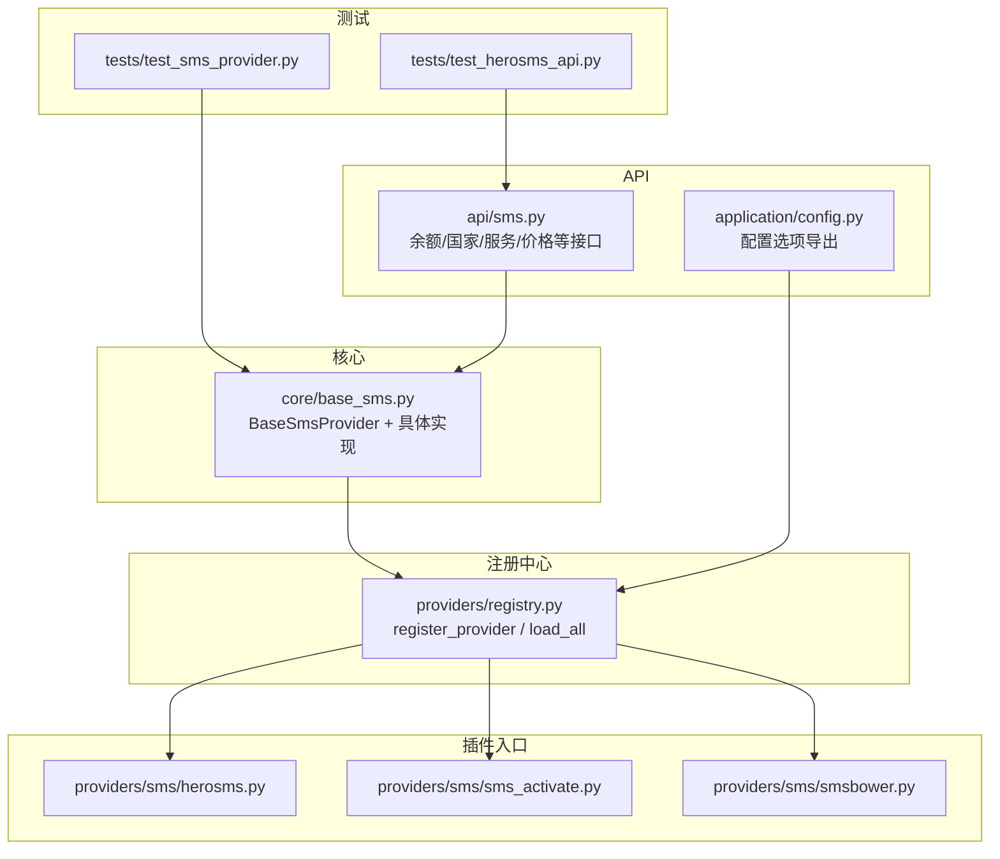
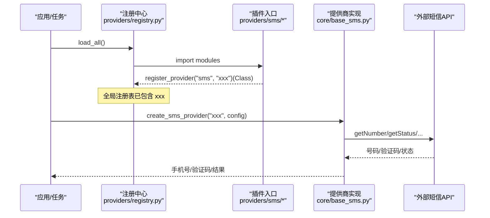
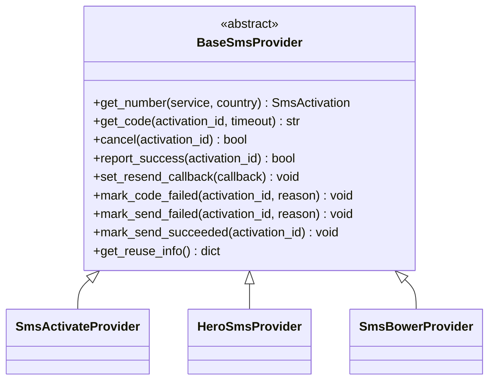
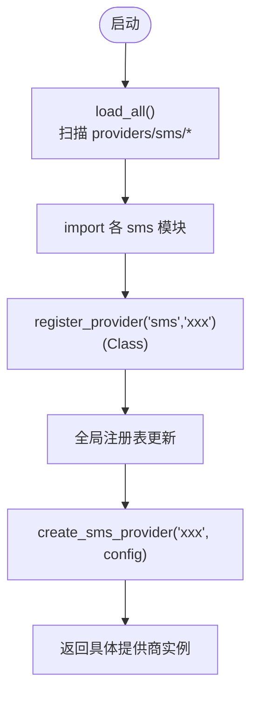
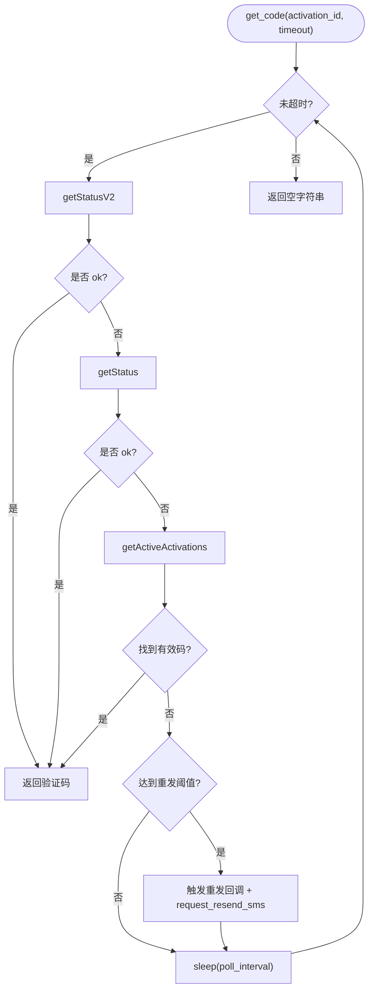
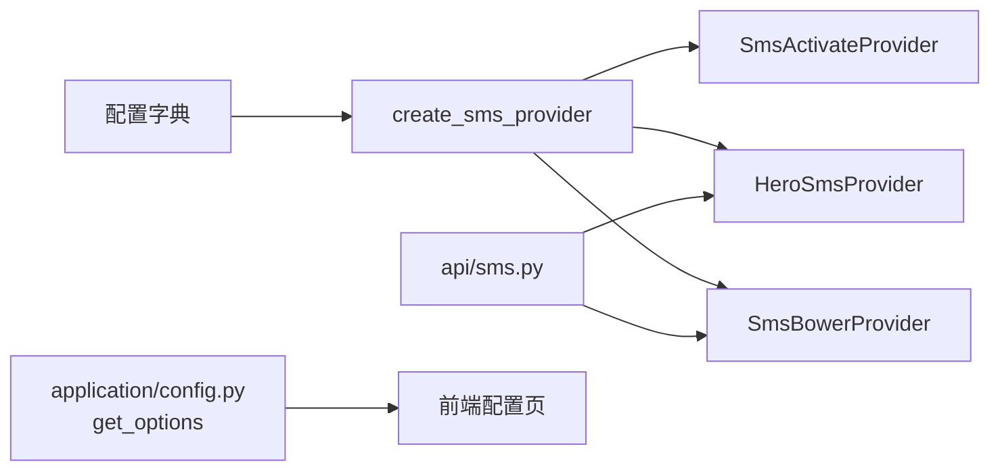
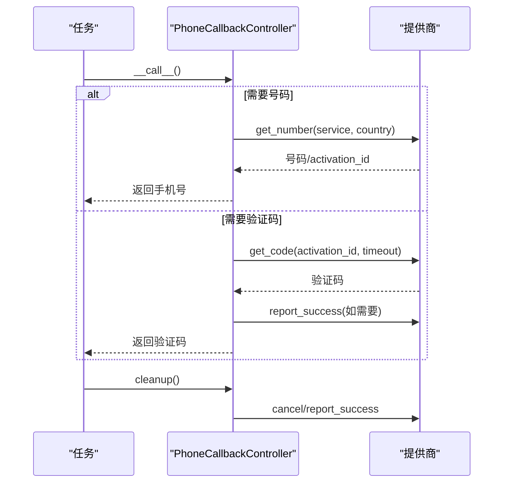
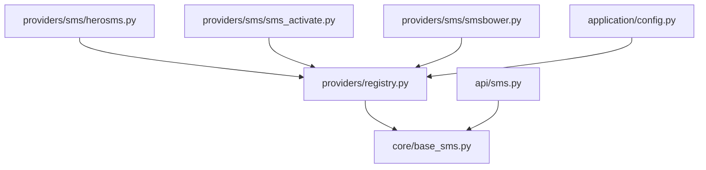

# 自定义短信提供商开发

<cite>
**本文引用的文件**
- [core/base_sms.py](file://core/base_sms.py)
- [providers/registry.py](file://providers/registry.py)
- [providers/sms/herosms.py](file://providers/sms/herosms.py)
- [providers/sms/sms_activate.py](file://providers/sms/sms_activate.py)
- [providers/sms/smsbower.py](file://providers/sms/smsbower.py)
- [api/sms.py](file://api/sms.py)
- [application/config.py](file://application/config.py)
- [tests/test_sms_provider.py](file://tests/test_sms_provider.py)
- [tests/test_herosms_api.py](file://tests/test_herosms_api.py)
</cite>

## 目录
1. [简介](#简介)
2. [项目结构](#项目结构)
3. [核心组件](#核心组件)
4. [架构总览](#架构总览)
5. [详细组件分析](#详细组件分析)
6. [依赖关系分析](#依赖关系分析)
7. [性能考虑](#性能考虑)
8. [故障排查指南](#故障排查指南)
9. [结论](#结论)
10. [附录](#附录)

## 简介
本指南面向希望为系统接入自定义短信服务提供商（SMS Provider）的开发者。文档基于现有代码库，系统性说明：
- BaseSmsProvider 基类的继承要求与必须实现的方法
- 提供商注册机制与集成流程（register_provider、load_all）
- 完整的实现示例要点（API 调用封装、错误处理、重试逻辑）
- 配置管理方式与提供商特定参数
- 测试策略（单元测试与集成测试）
- 日志记录与监控指标的实现建议
- 部署与版本管理最佳实践

## 项目结构
围绕短信提供商的核心代码分布在以下位置：
- 基类与具体实现：core/base_sms.py
- 统一注册中心：providers/registry.py
- 各提供商插件入口（仅负责导入并注册）：providers/sms/*.py
- API 暴露与配置读取：api/sms.py、application/config.py
- 测试用例：tests/test_sms_provider.py、tests/test_herosms_api.py

图表来源
- [core/base_sms.py:28-71](file://core/base_sms.py#L28-L71)
- [providers/registry.py:38-91](file://providers/registry.py#L38-L91)
- [providers/sms/herosms.py:10-18](file://providers/sms/herosms.py#L10-L18)
- [providers/sms/sms_activate.py:7-10](file://providers/sms/sms_activate.py#L7-L10)
- [providers/sms/smsbower.py:6-9](file://providers/sms/smsbower.py#L6-L9)
- [api/sms.py:1-215](file://api/sms.py#L1-L215)
- [application/config.py:23-37](file://application/config.py#L23-L37)

章节来源
- [core/base_sms.py:28-71](file://core/base_sms.py#L28-L71)
- [providers/registry.py:38-91](file://providers/registry.py#L38-L91)
- [providers/sms/herosms.py:10-18](file://providers/sms/herosms.py#L10-L18)
- [providers/sms/sms_activate.py:7-10](file://providers/sms/sms_activate.py#L7-L10)
- [providers/sms/smsbower.py:6-9](file://providers/sms/smsbower.py#L6-L9)
- [api/sms.py:1-215](file://api/sms.py#L1-L215)
- [application/config.py:23-37](file://application/config.py#L23-L37)

## 核心组件
- BaseSmsProvider：抽象基类，定义统一的短信提供商接口，包括获取号码、等待验证码、取消激活、成功上报、失败标记、重发回调、复用信息等。
- SmsActivateProvider：基于 SMS-Activate 兼容接口的实现。
- HeroSmsProvider：功能更丰富的实现，包含自动选国、价格查询、状态轮询、去重、缓存复用、重发等能力。
- SmsBowerProvider：在 HeroSmsProvider 基础上切换 Base URL 的轻量适配。
- PhoneCallbackController：浏览器注册流程中的“手机号+验证码”回调控制器，封装生命周期、重试、释放与成功上报。
- 工厂函数 create_sms_provider：根据 provider_key 和配置创建具体实例。
- 注册中心 register_provider/load_all：扫描 providers/sms 下的模块并注册到全局字典，供运行时通过键名查找。

章节来源
- [core/base_sms.py:28-71](file://core/base_sms.py#L28-L71)
- [core/base_sms.py:108-182](file://core/base_sms.py#L108-L182)
- [core/base_sms.py:328-1025](file://core/base_sms.py#L328-L1025)
- [core/base_sms.py:1028-1041](file://core/base_sms.py#L1028-L1041)
- [core/base_sms.py:1103-1266](file://core/base_sms.py#L1103-L1266)
- [providers/registry.py:38-91](file://providers/registry.py#L38-L91)

## 架构总览
下图展示了从应用层到提供商实现的调用链，以及注册机制如何使新提供商可被自动发现。

图表来源
- [providers/registry.py:70-91](file://providers/registry.py#L70-L91)
- [providers/sms/herosms.py:10-18](file://providers/sms/herosms.py#L10-L18)
- [providers/sms/sms_activate.py:7-10](file://providers/sms/sms_activate.py#L7-L10)
- [core/base_sms.py:1063-1100](file://core/base_sms.py#L1063-L1100)
- [core/base_sms.py:1103-1266](file://core/base_sms.py#L1103-L1266)

## 详细组件分析

### BaseSmsProvider 基类与必需方法
- 必需实现
  - get_number(service, country)：租用号码，返回激活信息对象。
  - get_code(activation_id, timeout)：等待并返回验证码。
  - cancel(activation_id)：取消/释放激活。
- 可选钩子
  - report_success(activation_id)：成功使用后的上报。
  - set_resend_callback(callback)：设置上游重发回调。
  - mark_code_failed/mark_send_failed/mark_send_succeeded：失败/发送成功标记。
  - get_reuse_info()：提供商特定的复用状态。

图表来源
- [core/base_sms.py:28-71](file://core/base_sms.py#L28-L71)
- [core/base_sms.py:108-182](file://core/base_sms.py#L108-L182)
- [core/base_sms.py:328-1025](file://core/base_sms.py#L328-L1025)
- [core/base_sms.py:1028-1041](file://core/base_sms.py#L1028-L1041)

章节来源
- [core/base_sms.py:28-71](file://core/base_sms.py#L28-L71)

### 提供商注册机制与集成步骤
- 注册器提供装饰器 register_provider(provider_type, driver_type)，将类加入全局注册表。
- 启动时调用 load_all()，会扫描 providers.captcha/proxy/sms/mailbox 的子模块并导入，从而触发各模块内的 register_provider 调用。
- 运行时通过 create_provider 或 create_sms_provider 按 key 创建实例。

图表来源
- [providers/registry.py:38-91](file://providers/registry.py#L38-L91)
- [providers/sms/herosms.py:10-18](file://providers/sms/herosms.py#L10-L18)
- [providers/sms/sms_activate.py:7-10](file://providers/sms/sms_activate.py#L7-L10)
- [providers/sms/smsbower.py:6-9](file://providers/sms/smsbower.py#L6-L9)
- [core/base_sms.py:1063-1100](file://core/base_sms.py#L1063-L1100)

章节来源
- [providers/registry.py:38-91](file://providers/registry.py#L38-L91)
- [providers/sms/herosms.py:10-18](file://providers/sms/herosms.py#L10-L18)
- [providers/sms/sms_activate.py:7-10](file://providers/sms/sms_activate.py#L7-L10)
- [providers/sms/smsbower.py:6-9](file://providers/sms/smsbower.py#L6-L9)

### 完整实现示例要点（以 HeroSmsProvider 为例）
- API 调用封装
  - 统一 _request 方法处理请求、超时、代理、响应校验。
  - 多端点支持：getNumberV2/getNumber/getStatus/getStatusV2/getActiveActivations/setStatus/cancelActivation/finishActivation/requestResendSMS 等。
- 错误处理
  - 对 V2/V1 响应进行兼容解析；异常时降级与回退。
  - 明确区分 NO_NUMBERS、NO_BALANCE、STATUS_WAIT_CODE/RETRY/CANCEL 等状态。
- 重试与轮询
  - wait_for_code 循环轮询 v2/v1/active 三种来源，直到超时或收到验证码。
  - 超过阈值自动触发重发（OpenAI 回调 + 提供商重发）。
- 号码复用与去重
  - 进程内缓存 + 持久化文件缓存，控制有效期、最大成功次数、已用验证码集合、尝试过的短信事件键集合，避免重复提交。
- 智能选国与价格策略
  - get_top_countries 优先走专用排名接口，否则从全量价格中解析排序。
  - get_best_country 结合库存与价格限制选择最优国家。

图表来源
- [core/base_sms.py:845-923](file://core/base_sms.py#L845-L923)

章节来源
- [core/base_sms.py:328-1025](file://core/base_sms.py#L328-L1025)

### 配置管理与提供商特定参数
- 工厂 create_sms_provider 从配置字典解析不同提供商的参数：
  - SMS-Activate：api_key、默认国家、代理等。
  - HeroSMS/SMSBower：api_key、默认服务/国家、max_price、proxy、reuse_phone_to_max、phone_success_max 等。
- API 层暴露了查询国家、服务、价格、余额、最佳国家等接口，便于前端展示与运维。
- 配置选项通过 application/config.ConfigService.get_options 暴露给前端，包含 sms_providers 与 sms_drivers 等。

图表来源
- [core/base_sms.py:1063-1100](file://core/base_sms.py#L1063-L1100)
- [api/sms.py:1-215](file://api/sms.py#L1-L215)
- [application/config.py:23-37](file://application/config.py#L23-L37)

章节来源
- [core/base_sms.py:1063-1100](file://core/base_sms.py#L1063-L1100)
- [api/sms.py:1-215](file://api/sms.py#L1-L215)
- [application/config.py:23-37](file://application/config.py#L23-L37)

### 浏览器回调控制器 PhoneCallbackController
- 职责：封装“先租号后取码”的两阶段流程，处理自动选国、失败回退、成功上报、清理释放、锁释放等。
- 关键行为
  - 首次调用：按需创建提供商，必要时获取号码；进入 need_code 阶段。
  - 第二次调用：等待验证码；若提供商支持自动上报则直接上报成功，否则等待外部成功。
  - cleanup：根据状态决定 cancel 或 report_success，并释放验证锁。

图表来源
- [core/base_sms.py:1103-1266](file://core/base_sms.py#L1103-L1266)

章节来源
- [core/base_sms.py:1103-1266](file://core/base_sms.py#L1103-L1266)

### 测试策略
- 单元测试
  - 覆盖映射关系（服务/国家）、工厂创建、回调生命周期、错误路径、锁释放、去重逻辑等。
  - 通过 monkeypatch 替换网络请求与缓存，确保无外部依赖。
- 集成测试
  - 通过 HTTP 客户端调用 /api/sms/* 接口，验证余额、国家、服务、价格、最佳国家等。
  - 验证配置项是否正确暴露（sms_providers、字段 key 等）。

章节来源
- [tests/test_sms_provider.py:1-469](file://tests/test_sms_provider.py#L1-L469)
- [tests/test_herosms_api.py:1-28](file://tests/test_herosms_api.py#L1-L28)

## 依赖关系分析
- 低耦合：具体提供商实现集中在 core/base_sms.py，注册中心与插件解耦。
- 插件即注册：每个 providers/sms/*.py 只负责 import 并 register_provider，降低侵入性。
- API 层依赖提供商实现，用于暴露查询与管理能力。
- 配置层通过 ProviderDefinitionsService 与 ProviderSettingsService 聚合可用提供商与设置。

图表来源
- [providers/registry.py:38-91](file://providers/registry.py#L38-L91)
- [providers/sms/herosms.py:10-18](file://providers/sms/herosms.py#L10-L18)
- [providers/sms/sms_activate.py:7-10](file://providers/sms/sms_activate.py#L7-L10)
- [providers/sms/smsbower.py:6-9](file://providers/sms/smsbower.py#L6-L9)
- [api/sms.py:1-215](file://api/sms.py#L1-L215)
- [application/config.py:23-37](file://application/config.py#L23-L37)

章节来源
- [providers/registry.py:38-91](file://providers/registry.py#L38-L91)
- [api/sms.py:1-215](file://api/sms.py#L1-L215)
- [application/config.py:23-37](file://application/config.py#L23-L37)

## 性能考虑
- 轮询与超时
  - wait_for_code 采用固定间隔轮询，避免频繁请求；超时后主动清理。
- 去重与缓存
  - 使用进程内缓存与持久化文件缓存，减少重复拉取与重复提交验证码。
  - 通过 attempted_sms_keys 与 used_codes 防止重复处理相同事件或验证码。
- 智能选国
  - 优先使用专用排名接口，失败再回退到全量价格解析，降低无效请求。
- 资源释放
  - 失败或完成时及时 cancel/finish，避免号码长期占用。

[本节为通用指导，不直接分析具体文件]

## 故障排查指南
- 常见问题定位
  - 未配置 API Key：工厂创建时会抛出明确错误，检查配置键值。
  - 无可用号码/余额不足：检查提供商返回状态与余额接口。
  - 验证码未到达：检查轮询超时、重发回调是否生效、是否命中去重逻辑。
  - 锁未释放：确保异常路径释放 _HERO_SMS_VERIFY_LOCK。
- 调试建议
  - 启用日志输出，关注“准备租用手机号”“已成功租到号码”“等待短信验证码”“短信验证成功”等关键日志。
  - 使用 /api/sms/* 接口快速验证连通性与配置。
  - 通过单元测试模拟网络与缓存，隔离外部依赖。

章节来源
- [core/base_sms.py:1103-1266](file://core/base_sms.py#L1103-L1266)
- [api/sms.py:1-215](file://api/sms.py#L1-L215)
- [tests/test_sms_provider.py:1-469](file://tests/test_sms_provider.py#L1-L469)

## 结论
通过 BaseSmsProvider 抽象与统一注册机制，系统实现了高度可扩展的短信提供商接入方案。新增提供商只需：
- 继承 BaseSmsProvider 并实现必要方法
- 在 providers/sms 下新建模块，导入实现并使用 register_provider 注册
- 在 create_sms_provider 中添加分支（如需），或在注册中心支持下直接使用
配合完善的配置、API、测试与日志，可快速稳定地集成新的短信服务。

[本节为总结，不直接分析具体文件]

## 附录

### 新增自定义提供商的最小步骤清单
- 在 core/base_sms.py 或独立模块中实现 BaseSmsProvider 子类
- 在 providers/sms/your_provider.py 中导入实现并使用 register_provider("sms", "your_key")(YourProvider)
- 如需要在工厂中创建实例，扩展 create_sms_provider 的分支逻辑
- 在 tests 中补充单元测试与集成测试
- 在 api/sms.py 中暴露必要的管理接口（可选）
- 在 application/config.py 中确保配置选项正确导出（通常由注册中心与定义服务自动处理）

章节来源
- [providers/registry.py:38-91](file://providers/registry.py#L38-L91)
- [core/base_sms.py:1063-1100](file://core/base_sms.py#L1063-L1100)
- [application/config.py:23-37](file://application/config.py#L23-L37)