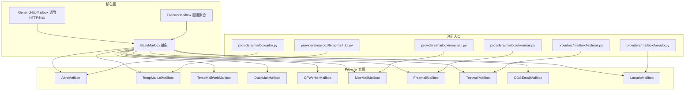
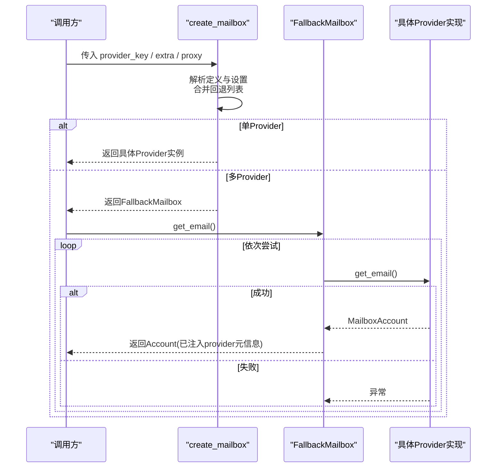
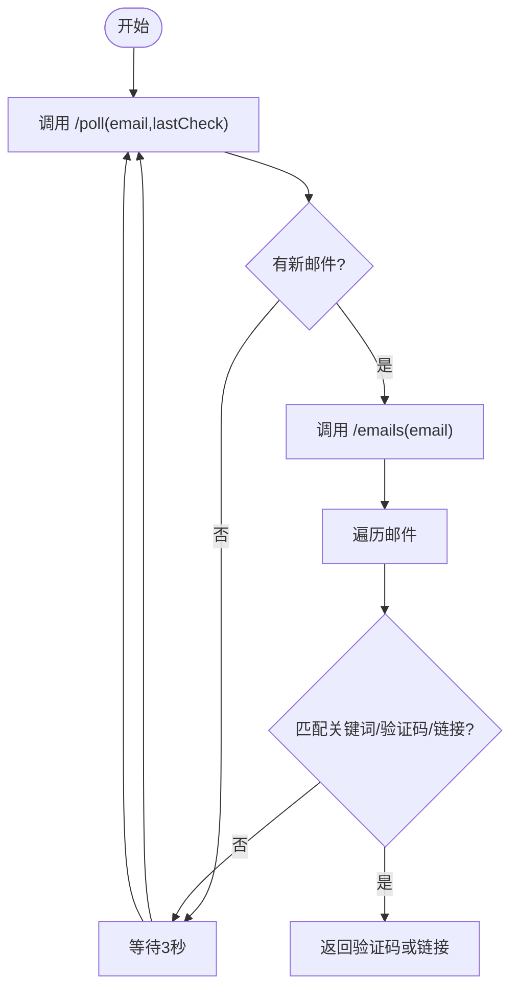
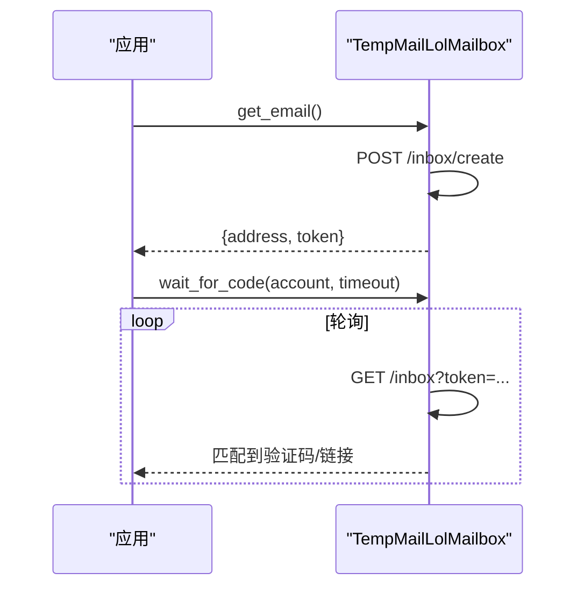
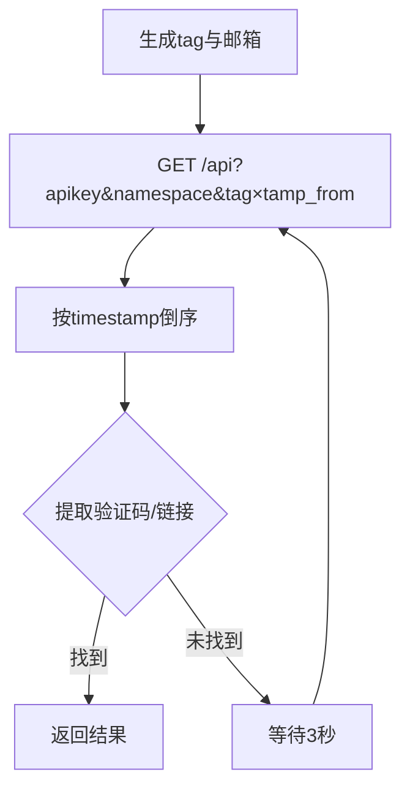
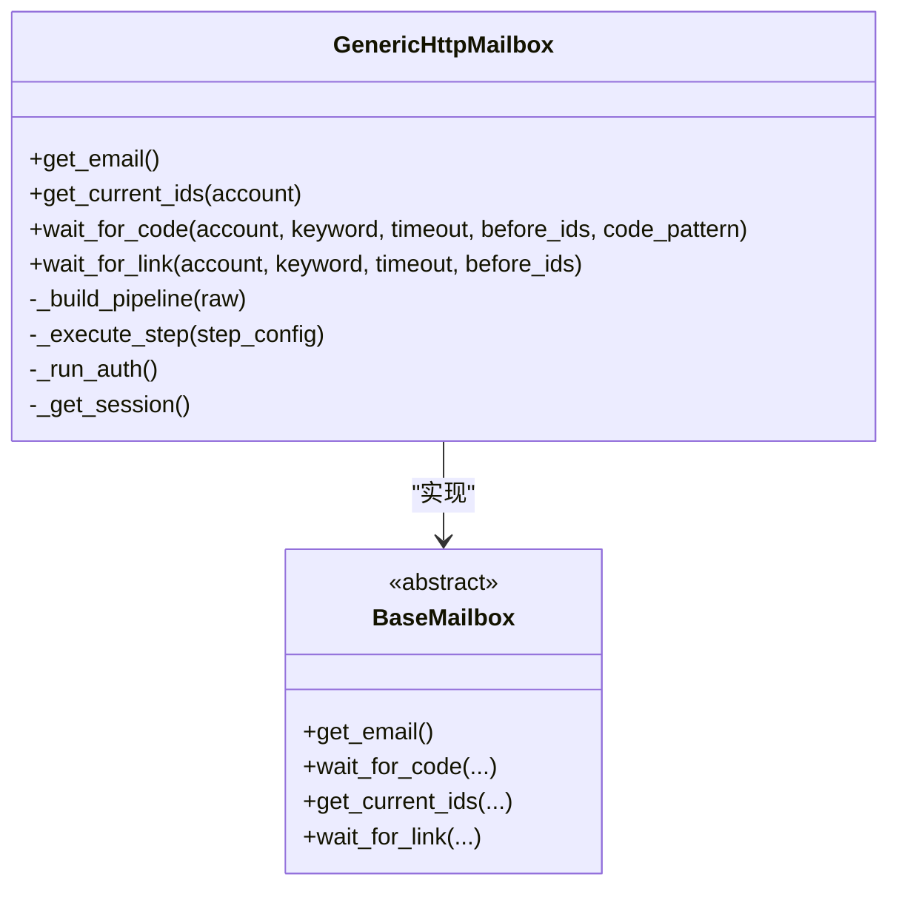
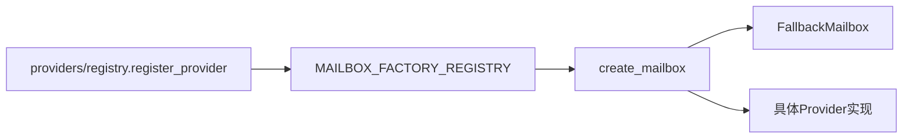

# 临时邮箱服务

<cite>
**本文引用的文件**
- [core/base_mailbox.py](file://core/base_mailbox.py)
- [core/generic_http_mailbox.py](file://core/generic_http_mailbox.py)
- [providers/mailbox/aitre.py](file://providers/mailbox/aitre.py)
- [providers/mailbox/tempmail_lol.py](file://providers/mailbox/tempmail_lol.py)
- [providers/mailbox/testmail.py](file://providers/mailbox/testmail.py)
- [providers/mailbox/freemail.py](file://providers/mailbox/freemail.py)
- [providers/mailbox/moemail.py](file://providers/mailbox/moemail.py)
- [providers/mailbox/laoudo.py](file://providers/mailbox/laoudo.py)
- [README.md](file://README.md)
</cite>

## 目录
1. [简介](#简介)
2. [项目结构](#项目结构)
3. [核心组件](#核心组件)
4. [架构总览](#架构总览)
5. [详细组件分析](#详细组件分析)
6. [依赖关系分析](#依赖关系分析)
7. [性能与可靠性](#性能与可靠性)
8. [故障排查指南](#故障排查指南)
9. [结论](#结论)
10. [附录：配置与集成示例](#附录配置与集成示例)

## 简介
本仓库提供统一的临时邮箱（收件）能力，内置多种第三方或自建邮箱服务的适配实现，并通过工厂与回退机制统一对外暴露接口。支持的服务包括 AITRE、TempMail Lol、TestMail、Freemail、MoeEmail、Laoudo、DuckMail、DDG Email、Temp-Mail Web 以及通用 HTTP 驱动。每个实现都遵循统一的 BaseMailbox 抽象，提供获取邮箱、轮询邮件、提取验证码或验证链接等能力，并支持代理、超时、重试与降级策略。

## 项目结构
- 核心抽象与默认 API 地址定义位于 core/base_mailbox.py，包含 FallbackMailbox、各具体 Provider 实现、工厂方法 create_mailbox 及注册表。
- 通用 HTTP 驱动 core/generic_http_mailbox.py 通过“步骤管道”配置化接入任意 HTTP 邮箱服务，无需代码改动即可新增类型。
- providers/mailbox/* 为各 Provider 的轻量注册入口，将具体类注册到统一注册表，便于系统启动时自动发现。
- README.md 提供了邮箱服务概览与选择建议。

**图表来源**
- [core/base_mailbox.py:27-348](file://core/base_mailbox.py#L27-L348)
- [core/generic_http_mailbox.py:75-474](file://core/generic_http_mailbox.py#L75-L474)
- [providers/mailbox/aitre.py:1-6](file://providers/mailbox/aitre.py#L1-L6)
- [providers/mailbox/tempmail_lol.py:1-6](file://providers/mailbox/tempmail_lol.py#L1-L6)
- [providers/mailbox/testmail.py:1-6](file://providers/mailbox/testmail.py#L1-L6)
- [providers/mailbox/freemail.py:1-6](file://providers/mailbox/freemail.py#L1-L6)
- [providers/mailbox/moemail.py:1-6](file://providers/mailbox/moemail.py#L1-L6)
- [providers/mailbox/laoudo.py:1-6](file://providers/mailbox/laoudo.py#L1-L6)

**章节来源**
- [core/base_mailbox.py:13-348](file://core/base_mailbox.py#L13-L348)
- [core/generic_http_mailbox.py:1-105](file://core/generic_http_mailbox.py#L1-L105)
- [README.md:183-199](file://README.md#L183-L199)

## 核心组件
- BaseMailbox：定义 get_email、wait_for_code、get_current_ids、wait_for_link 等统一接口。
- FallbackMailbox：按顺序尝试多个 provider，创建成功后固定使用同一 provider 进行收件。
- GenericHttpMailbox：数据驱动的通用 HTTP 邮箱驱动，通过 pipeline_config + settings 描述认证、创建邮箱、拉取列表、详情读取等步骤，零代码扩展新服务。
- 各 Provider 实现：针对特定服务的 API 差异进行适配，封装会话、鉴权、轮询、正则提取验证码/链接等逻辑。

**章节来源**
- [core/base_mailbox.py:27-118](file://core/base_mailbox.py#L27-L118)
- [core/generic_http_mailbox.py:75-161](file://core/generic_http_mailbox.py#L75-L161)

## 架构总览
系统通过 create_mailbox(provider, extra, proxy) 根据 provider key 解析定义与运行时设置，构建一个或多个 mailbox 实例；若存在多个可用 provider，则返回 FallbackMailbox 以顺序尝试并锁定成功的那个。所有实现均遵循 BaseMailbox 接口，上层平台插件只需调用统一接口完成注册流程中的邮箱与验证码处理。

**图表来源**
- [core/base_mailbox.py:289-348](file://core/base_mailbox.py#L289-L348)
- [core/base_mailbox.py:51-118](file://core/base_mailbox.py#L51-L118)

**章节来源**
- [core/base_mailbox.py:289-348](file://core/base_mailbox.py#L289-L348)

## 详细组件分析

### AITRE（mail.aitre.cc）
- 特点：公共临时邮箱，无需注册，直接通过 API 拉取指定邮箱的邮件。
- 注册流程：无显式注册，直接使用已有邮箱地址。
- 邮件获取：调用 /emails 获取列表，/poll 增量拉取，结合 lastCheck 避免重复请求。
- 会话管理：无持久会话，每次请求独立。
- 验证码/链接：从 preview/content/html 中匹配 6 位数字或提取验证链接。
- 超时与重试：等待循环内捕获异常并继续轮询，最终超时抛出 TimeoutError。

**图表来源**
- [core/base_mailbox.py:476-555](file://core/base_mailbox.py#L476-L555)

**章节来源**
- [core/base_mailbox.py:476-555](file://core/base_mailbox.py#L476-L555)
- [providers/mailbox/aitre.py:1-6](file://providers/mailbox/aitre.py#L1-L6)

### TempMail Lol（tempmail.lol）
- 特点：公共临时邮箱，自动生成匿名地址，无需登录。
- 注册流程：POST /inbox/create 创建邮箱，返回 address 与 token。
- 邮件获取：GET /inbox?token=... 获取邮件列表，按时间排序。
- 会话管理：基于 token 的简单鉴权。
- 验证码/链接：从 subject/body/html 中提取 6 位数字或链接。
- 超时与重试：轮询期间捕获异常，超时后抛出 TimeoutError。

**图表来源**
- [core/base_mailbox.py:557-652](file://core/base_mailbox.py#L557-L652)

**章节来源**
- [core/base_mailbox.py:557-652](file://core/base_mailbox.py#L557-L652)
- [providers/mailbox/tempmail_lol.py:1-6](file://providers/mailbox/tempmail_lol.py#L1-L6)

### TestMail（testmail.app）
- 特点：namespace + tag 模式，适合并发任务隔离。
- 注册流程：构造 namespace.tag@inbox.testmail.app，tag 随机生成。
- 邮件获取：GET /api?apikey&namespace&tag&timestamp_from，支持 livequery。
- 会话管理：基于 apikey 查询参数鉴权。
- 验证码/链接：从 subject/text/html 提取，支持自定义 code_pattern。
- 超时与重试：轮询期间捕获异常，超时后抛出 TimeoutError。

**图表来源**
- [core/base_mailbox.py:1628-1810](file://core/base_mailbox.py#L1628-L1810)

**章节来源**
- [core/base_mailbox.py:1628-1810](file://core/base_mailbox.py#L1628-L1810)
- [providers/mailbox/testmail.py:1-6](file://providers/mailbox/testmail.py#L1-L6)

### Freemail（Cloudflare Worker 自建）
- 特点：支持管理员令牌或用户名密码两种认证方式。
- 注册流程：GET /api/generate 生成邮箱。
- 邮件获取：GET /api/emails?mailbox=... 获取列表。
- 会话管理：Session 维护，支持 Bearer 或登录后 Cookie。
- 验证码/链接：优先使用 verification_code 字段，否则从 preview/subject 提取。
- 超时与重试：轮询期间捕获异常，超时后抛出 TimeoutError。

**章节来源**
- [core/base_mailbox.py:1490-1626](file://core/base_mailbox.py#L1490-L1626)
- [providers/mailbox/freemail.py:1-6](file://providers/mailbox/freemail.py#L1-L6)

### MoeEmail（sall.cc）
- 特点：可复用账号或自动注册账号，支持 session-token 复用，域名优选提升信誉。
- 注册流程：可选自动注册并登录，或直接使用提供的 session-token。
- 邮件获取：GET /api/emails/{id} 获取消息列表。
- 会话管理：Session + Cookie，支持多种 session-token 名称兼容。
- 验证码/链接：从 content/text/body/html/subject 提取，支持自定义 pattern。
- 超时与重试：轮询期间捕获异常，超时后抛出 TimeoutError。

**章节来源**
- [core/base_mailbox.py:1200-1488](file://core/base_mailbox.py#L1200-L1488)
- [providers/mailbox/moemail.py:1-6](file://providers/mailbox/moemail.py#L1-L6)

### Laoudo（laoudo.com）
- 特点：固定自有域名邮箱，稳定性高，适合长期使用。
- 注册流程：使用预置 email/account_id/auth_token，无需动态创建。
- 邮件获取：GET /api/email/list 拉取收件箱。
- 会话管理：Authorization header 鉴权。
- 验证码/链接：从 subject/content/html 提取，支持 keyword 过滤。
- 超时与重试：轮询期间捕获异常，超时后抛出 TimeoutError。

**章节来源**
- [core/base_mailbox.py:350-474](file://core/base_mailbox.py#L350-L474)
- [providers/mailbox/laoudo.py:1-6](file://providers/mailbox/laoudo.py#L1-L6)

### 其他 Provider（简要）
- DuckMail：自动生成账号并登录获取 token，支持 provider_url 与 bearer 鉴权。
- CFWorker：基于 cloudflare_temp_email 自建，admin/new_address 创建，/admin/mails 拉取。
- Temp-Mail Web：通过浏览器执行 fetch 访问 web2.temp-mail.org，具备 429 重试与 JSON 解码保护。
- DDG Email：创建 @duck.com 私密别名，通过 IMAP 从转发邮箱读取验证码，支持常见 IMAP host 自动推断。

**章节来源**
- [core/base_mailbox.py:654-1198](file://core/base_mailbox.py#L654-L1198)
- [core/base_mailbox.py:1812-1982](file://core/base_mailbox.py#L1812-L1982)

### 通用 HTTP 驱动（GenericHttpMailbox）
- 设计目标：通过 DB 配置描述所有步骤（auth_steps → create_email → list_emails → get_detail），零代码新增邮箱类型。
- 配置来源：pipeline_config（来自 provider_definitions.metadata_json）+ settings（用户 UI 填写的 flat 字段）。
- 关键能力：
  - 认证：Bearer/Header/api_key_param 三种方式，支持多步认证链。
  - 变量池：步骤间共享变量，支持 extract 提取响应字段与 cookie。
  - 邮箱模式：fixed（固定邮箱）、namespace_tag（testmail 风格）、generate（调用 create_email 步骤）。
  - 邮件轮询：list_emails 返回列表，可选 get_detail 获取详情，拼接 body_fields 提取验证码或链接。
- 错误处理：步骤执行异常被捕获，轮询超时抛出 TimeoutError。

**图表来源**
- [core/generic_http_mailbox.py:75-474](file://core/generic_http_mailbox.py#L75-L474)
- [core/base_mailbox.py:27-48](file://core/base_mailbox.py#L27-L48)

**章节来源**
- [core/generic_http_mailbox.py:1-161](file://core/generic_http_mailbox.py#L1-L161)
- [core/generic_http_mailbox.py:163-474](file://core/generic_http_mailbox.py#L163-L474)

## 依赖关系分析
- 工厂与注册表：create_mailbox 通过 MAILBOX_FACTORY_REGISTRY 映射 provider key 到构造函数；providers/mailbox/* 模块在导入时将具体类注册到统一注册表。
- 回退机制：当存在多个启用 provider 时，返回 FallbackMailbox 按顺序尝试，首次成功即锁定该 provider。
- 外部依赖：requests/curl_cffi/imaplib/Camoufox 等用于 HTTP/IMAP/浏览器自动化。

**图表来源**
- [core/base_mailbox.py:262-348](file://core/base_mailbox.py#L262-L348)
- [providers/mailbox/aitre.py:1-6](file://providers/mailbox/aitre.py#L1-L6)
- [providers/mailbox/tempmail_lol.py:1-6](file://providers/mailbox/tempmail_lol.py#L1-L6)
- [providers/mailbox/testmail.py:1-6](file://providers/mailbox/testmail.py#L1-L6)
- [providers/mailbox/freemail.py:1-6](file://providers/mailbox/freemail.py#L1-L6)
- [providers/mailbox/moemail.py:1-6](file://providers/mailbox/moemail.py#L1-L6)
- [providers/mailbox/laoudo.py:1-6](file://providers/mailbox/laoudo.py#L1-L6)

**章节来源**
- [core/base_mailbox.py:262-348](file://core/base_mailbox.py#L262-L348)

## 性能与可靠性
- 轮询间隔：多数 Provider 采用 3-5 秒轮询，兼顾实时性与服务器压力。
- 超时控制：wait_for_code/wait_for_link 默认 120 秒，可按需调整。
- 重试与降级：
  - Temp-Mail Web 对 429 进行指数退避重试。
  - FallbackMailbox 在多 provider 间顺序尝试，任一成功即锁定。
  - GenericHttpMailbox 支持多步认证与步骤级超时。
- 网络与代理：
  - 多数实现支持 http/https 代理注入。
  - curl_cffi 用于模拟浏览器指纹（如 Laoudo）。
  - Camoufox 用于浏览器自动化场景（Temp-Mail Web）。
- 可靠性建议：
  - 合理设置超时与轮询间隔，避免频繁请求导致封禁。
  - 使用稳定域名与高质量代理，降低风控风险。
  - 对关键路径增加日志与监控，便于定位问题。

[本节为通用指导，不直接分析具体文件]

## 故障排查指南
- 验证码未匹配：
  - 检查 keyword 是否与实际邮件主题/正文一致。
  - 调整 code_pattern 以适配不同格式（例如非 6 位数字）。
  - 确认 provider 返回的数据结构是否与实现预期一致。
- 连接超时/网络错误：
  - 检查代理配置是否正确，必要时更换代理。
  - 对于 DDG Email，确保 IMAP 主机/用户名/密码正确，且网络可达。
- 429 限流：
  - Temp-Mail Web 已内置重试；可适当增大轮询间隔或减少并发。
- 会话失效：
  - MoeEmail/Freemail 等需要 Session/Cookie 的 provider，确保登录成功并正确保存 session-token。
  - Laoudo/DuckMail 等基于 Bearer 的 provider，检查 Authorization 头是否正确。

**章节来源**
- [core/base_mailbox.py:409-474](file://core/base_mailbox.py#L409-L474)
- [core/base_mailbox.py:494-555](file://core/base_mailbox.py#L494-L555)
- [core/base_mailbox.py:603-652](file://core/base_mailbox.py#L603-L652)
- [core/base_mailbox.py:849-902](file://core/base_mailbox.py#L849-L902)
- [core/base_mailbox.py:1002-1068](file://core/base_mailbox.py#L1002-L1068)
- [core/base_mailbox.py:1144-1197](file://core/base_mailbox.py#L1144-L1197)
- [core/base_mailbox.py:1429-1487](file://core/base_mailbox.py#L1429-L1487)
- [core/base_mailbox.py:1575-1625](file://core/base_mailbox.py#L1575-L1625)
- [core/base_mailbox.py:1753-1809](file://core/base_mailbox.py#L1753-L1809)
- [core/base_mailbox.py:1881-1976](file://core/base_mailbox.py#L1881-L1976)

## 结论
本项目通过统一抽象与工厂机制，将多种临时邮箱服务整合为一致的收件能力，既满足快速集成的需求，又保留了足够的扩展性。对于常见服务（AITRE、TempMail Lol、TestMail、Freemail、MoeEmail、Laoudo）提供了开箱即用的实现；对于未知或私有服务，可通过通用 HTTP 驱动以配置化方式接入。建议在生产环境中结合代理、超时、重试与回退策略，确保注册流程的稳定与高效。

[本节为总结，不直接分析具体文件]

## 附录：配置与集成示例
- 选择邮箱服务：在“全局配置”页添加并启用所需 provider，系统将自动渲染表单字段。
- 常用 provider 说明（来自 README）：
  - MoeEmail：推荐，自动注册账号生成邮箱。
  - Laoudo：固定自有域名邮箱，稳定性最高。
  - Cloudflare Worker 自建：完全自主可控。
  - Testmail：namespace + tag 模式，适合并发任务。
  - DuckDuckGo Email：@duck.com 私密别名 + IMAP 转发读取。
  - Freemail：支持管理员令牌或用户名密码认证。
  - DuckMail：公共临时邮箱，部分地区需代理。
  - TempMail.lol：公共临时邮箱，自动生成匿名地址。
  - Temp-Mail Web：基于 web2.temp-mail.org 的临时邮箱。

**章节来源**
- [README.md:183-199](file://README.md#L183-L199)