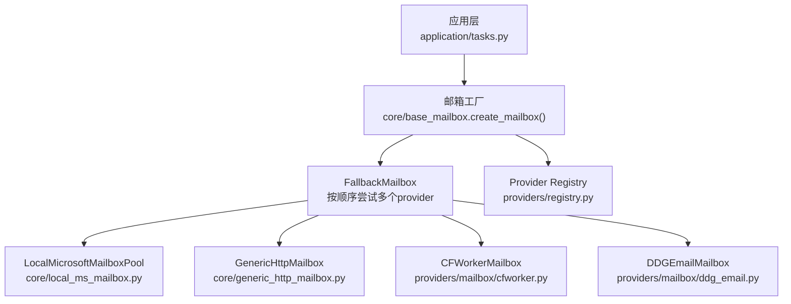
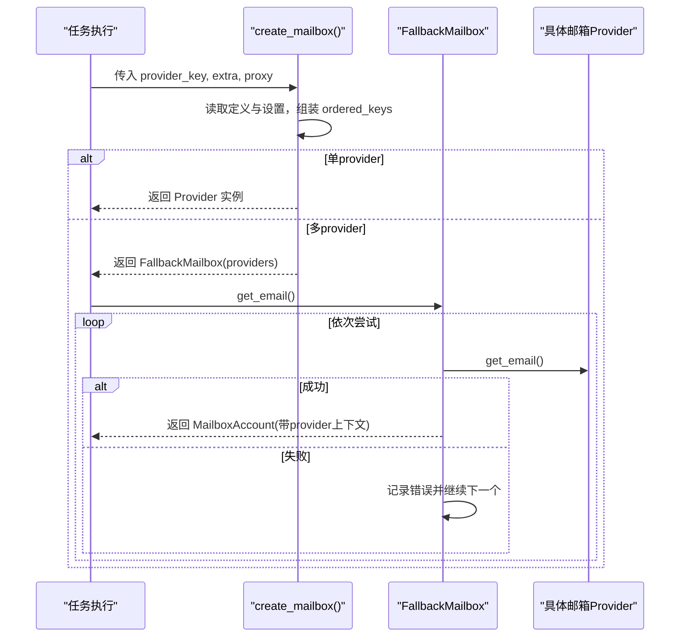
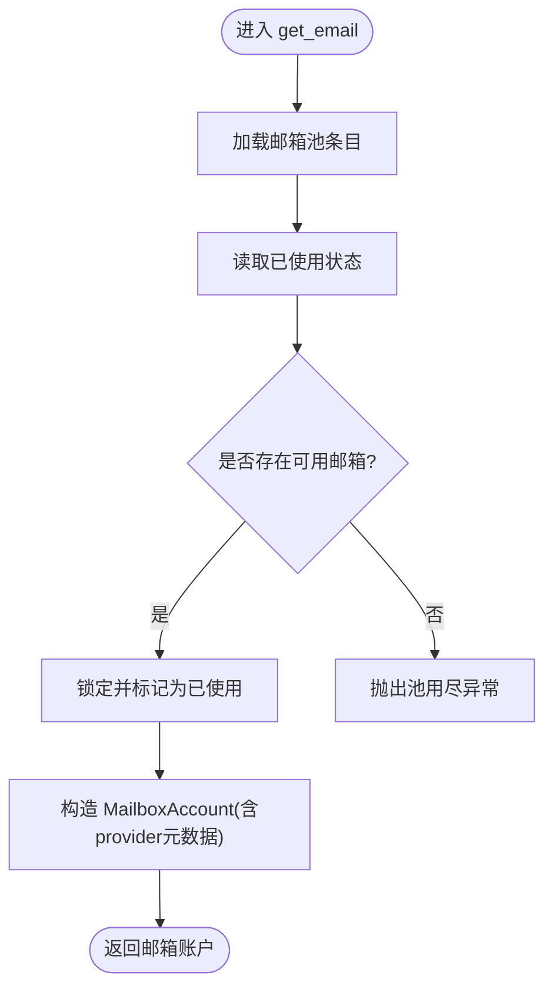
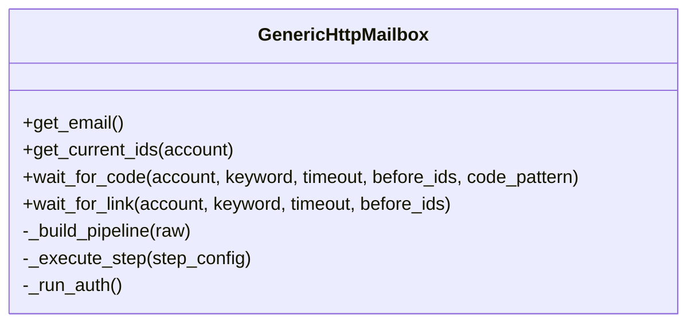
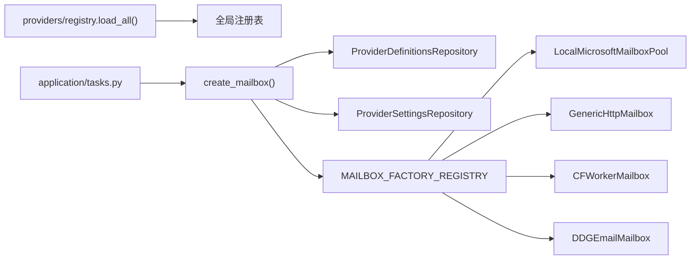
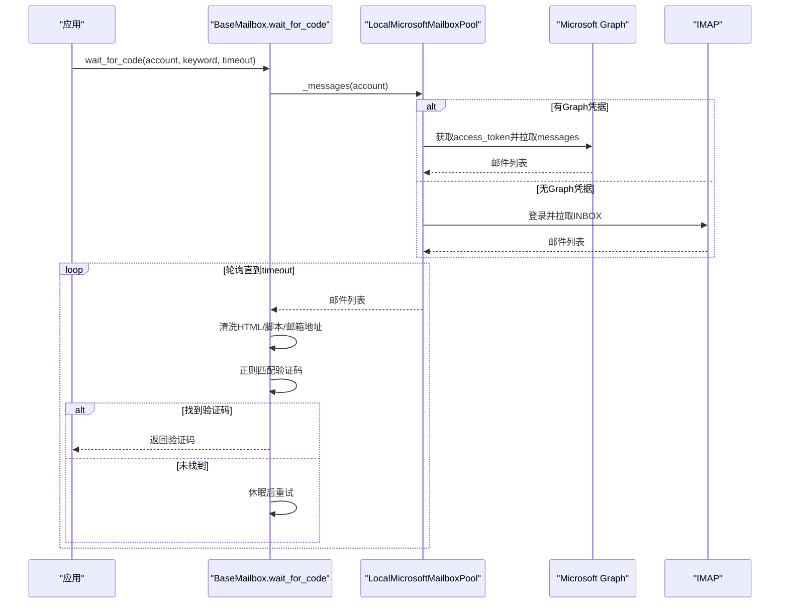

# 企业邮箱池管理

<cite>
**本文引用的文件**
- [core/local_ms_mailbox.py](file://core/local_ms_mailbox.py)
- [core/base_mailbox.py](file://core/base_mailbox.py)
- [core/generic_http_mailbox.py](file://core/generic_http_mailbox.py)
- [providers/mailbox/cfworker.py](file://providers/mailbox/cfworker.py)
- [providers/mailbox/ddg_email.py](file://providers/mailbox/ddg_email.py)
- [providers/registry.py](file://providers/registry.py)
- [application/tasks.py](file://application/tasks.py)
- [README.md](file://README.md)
</cite>

## 目录
1. [简介](#简介)
2. [项目结构](#项目结构)
3. [核心组件](#核心组件)
4. [架构总览](#架构总览)
5. [详细组件分析](#详细组件分析)
6. [依赖关系分析](#依赖关系分析)
7. [性能与容量管理](#性能与容量管理)
8. [配置选项](#配置选项)
9. [邮件监听、解析与提取](#邮件监听解析与提取)
10. [监控指标与日志记录](#监控指标与日志记录)
11. [扩展开发指南](#扩展开发指南)
12. [部署与运维](#部署与运维)
13. [故障排查](#故障排查)
14. [结论](#结论)

## 简介
本文件面向“企业邮箱池的管理和调度机制”，聚焦以下目标：
- 本地 Microsoft 邮箱池的实现原理：账户轮换、负载均衡与健康检查策略。
- CFWorker 邮箱服务与 DuckDuckGo 邮箱集成的技术实现。
- 邮箱池的容量管理、并发控制与资源分配算法。
- 邮箱池配置项：最大连接数、超时设置、故障转移策略。
- 邮件监听、解析与提取的技术细节。
- 性能监控指标与日志记录机制。
- 扩展开发指南：如何集成新的企业邮箱服务。
- 部署配置、运维管理与故障排查方法。

## 项目结构
系统采用插件化 provider 体系，邮箱能力通过统一基类抽象，具体实现以“驱动”形式注册并动态创建。关键路径：
- core/base_mailbox.py：定义 BaseMailbox 抽象接口、工厂方法与 Fallback 多 provider 编排。
- core/local_ms_mailbox.py：本地 Microsoft 邮箱池（Outlook/Hotmail/Live）实现。
- core/generic_http_mailbox.py：数据驱动的通用 HTTP 邮箱驱动，零代码新增邮箱类型。
- providers/mailbox/*：各邮箱服务的注册入口（如 cfworker、ddg_email）。
- providers/registry.py：统一的 provider 自动发现与工厂。
- application/tasks.py：任务执行时创建共享 mailbox 实例，避免并发初始化问题。

图表来源
- [application/tasks.py:717-748](file://application/tasks.py#L717-L748)
- [core/base_mailbox.py:289-347](file://core/base_mailbox.py#L289-L347)
- [core/local_ms_mailbox.py:161-251](file://core/local_ms_mailbox.py#L161-L251)
- [core/generic_http_mailbox.py:75-104](file://core/generic_http_mailbox.py#L75-L104)
- [providers/mailbox/cfworker.py:1-6](file://providers/mailbox/cfworker.py#L1-L6)
- [providers/mailbox/ddg_email.py:1-6](file://providers/mailbox/ddg_email.py#L1-L6)
- [providers/registry.py:28-91](file://providers/registry.py#L28-L91)

章节来源
- [application/tasks.py:717-748](file://application/tasks.py#L717-L748)
- [core/base_mailbox.py:289-347](file://core/base_mailbox.py#L289-L347)
- [providers/registry.py:28-91](file://providers/registry.py#L28-L91)

## 核心组件
- BaseMailbox：抽象接口，定义 get_email、wait_for_code、get_current_ids、wait_for_link。
- FallbackMailbox：按顺序尝试多个 provider，失败自动切换；创建成功后固定使用同一 provider 收件。
- LocalMicrosoftMailboxPool：本地微软邮箱池，支持 Graph API 或 IMAP 拉取邮件，具备账户轮换与状态持久化。
- GenericHttpMailbox：数据驱动，通过 pipeline_config 描述认证、创建邮箱、列表、详情等步骤，无需编码即可适配新邮箱服务。
- CFWorker/DuckDuckGo：通过各自模块注册到统一 registry，由 create_mailbox 动态创建实例。

章节来源
- [core/base_mailbox.py:27-118](file://core/base_mailbox.py#L27-L118)
- [core/local_ms_mailbox.py:161-251](file://core/local_ms_mailbox.py#L161-L251)
- [core/generic_http_mailbox.py:75-104](file://core/generic_http_mailbox.py#L75-L104)
- [providers/mailbox/cfworker.py:1-6](file://providers/mailbox/cfworker.py#L1-L6)
- [providers/mailbox/ddg_email.py:1-6](file://providers/mailbox/ddg_email.py#L1-L6)

## 架构总览
系统通过工厂方法 create_mailbox 根据 provider key 与运行时设置构建邮箱实例。若启用多个 provider，则返回 FallbackMailbox，内部维护已创建的实例映射，确保同一账号后续操作路由到正确的 provider。

图表来源
- [core/base_mailbox.py:289-347](file://core/base_mailbox.py#L289-L347)
- [core/base_mailbox.py:51-118](file://core/base_mailbox.py#L51-L118)

章节来源
- [core/base_mailbox.py:289-347](file://core/base_mailbox.py#L289-L347)
- [core/base_mailbox.py:51-118](file://core/base_mailbox.py#L51-L118)

## 详细组件分析

### 本地 Microsoft 邮箱池（LocalMicrosoftMailboxPool）
- 账户轮换与容量管理：
  - 从 pool_text/pool_file 解析出邮箱条目，去重后作为候选池。
  - 通过 state_file 记录已使用的邮箱（used），默认不允许重复使用；可通过 allow_reuse 开关控制。
  - _available_entry 按顺序选择未使用或允许复用的邮箱，耗尽时抛出异常。
- 负载均衡与健康检查：
  - 优先使用 Graph API（需 client_id + refresh_token），否则回退到 IMAP。
  - Graph token 刷新失败或 Graph 读取失败会抛错；IMAP 连接失败也会抛错。
  - 健康检查体现在每次获取消息前对可用通道进行判断与调用，失败即向上抛出，便于上层重试或切换。
- 并发控制：
  - 使用线程锁保护 get_email 的预留逻辑，避免并发下重复领取同一邮箱。
- 邮件监听与解析：
  - Graph：请求 /messages，提取 id/subject/bodyPreview/receivedDateTime/from/toRecipients/body。
  - IMAP：登录 INBOX，遍历最近最多 30 封邮件，解析 multipart 文本内容。
  - wait_for_code/wait_for_link：轮询直到找到验证码或验证链接，支持关键词过滤与正则匹配。

图表来源
- [core/local_ms_mailbox.py:161-251](file://core/local_ms_mailbox.py#L161-L251)
- [core/local_ms_mailbox.py:228-249](file://core/local_ms_mailbox.py#L228-L249)

章节来源
- [core/local_ms_mailbox.py:161-251](file://core/local_ms_mailbox.py#L161-L251)
- [core/local_ms_mailbox.py:344-438](file://core/local_ms_mailbox.py#L344-L438)
- [core/local_ms_mailbox.py:454-501](file://core/local_ms_mailbox.py#L454-L501)

### CFWorker 邮箱服务
- 注册入口：providers/mailbox/cfworker.py 将 CFWorkerMailbox 注册到统一 registry。
- 功能要点：
  - 通过 admin API 创建临时邮箱地址，返回 email 与 token。
  - 支持 domain/fingerprint 等参数，便于在不同域名或指纹环境下运行。
  - 邮件拉取与验证码/链接提取遵循 BaseMailbox 约定。

章节来源
- [providers/mailbox/cfworker.py:1-6](file://providers/mailbox/cfworker.py#L1-L6)
- [core/base_mailbox.py:1109-1127](file://core/base_mailbox.py#L1109-L1127)

### DuckDuckGo 邮箱集成
- 注册入口：providers/mailbox/ddg_email.py 将 DDGEmailMailbox 注册到统一 registry。
- 功能要点：
  - 支持 bearer 认证与 IMAP 转发读取。
  - 通过 base_mailbox 的工厂方法创建实例，与其他 provider 一致。

章节来源
- [providers/mailbox/ddg_email.py:1-6](file://providers/mailbox/ddg_email.py#L1-L6)
- [core/base_mailbox.py:182-189](file://core/base_mailbox.py#L182-L189)

### 通用 HTTP 邮箱驱动（GenericHttpMailbox）
- 数据驱动设计：
  - 通过 pipeline_config（来自 provider_definitions.metadata_json）与 settings（用户 UI 填写）合并生成最终步骤管道。
  - 支持 auth_steps、create_email、list_emails、get_detail 等步骤，变量池在各步骤间传递。
- 能力：
  - 固定邮箱模式、命名空间标签模式、动态生成邮箱模式。
  - 列表拉取与详情获取，支持 JSON path 取值与 cookie 提取。
  - 验证码/链接提取：拼接正文字段，正则匹配或链接提取。

图表来源
- [core/generic_http_mailbox.py:75-104](file://core/generic_http_mailbox.py#L75-L104)
- [core/generic_http_mailbox.py:105-161](file://core/generic_http_mailbox.py#L105-L161)
- [core/generic_http_mailbox.py:195-257](file://core/generic_http_mailbox.py#L195-L257)
- [core/generic_http_mailbox.py:270-315](file://core/generic_http_mailbox.py#L270-L315)
- [core/generic_http_mailbox.py:317-411](file://core/generic_http_mailbox.py#L317-L411)
- [core/generic_http_mailbox.py:413-473](file://core/generic_http_mailbox.py#L413-L473)

章节来源
- [core/generic_http_mailbox.py:75-104](file://core/generic_http_mailbox.py#L75-L104)
- [core/generic_http_mailbox.py:105-161](file://core/generic_http_mailbox.py#L105-L161)
- [core/generic_http_mailbox.py:195-257](file://core/generic_http_mailbox.py#L195-L257)
- [core/generic_http_mailbox.py:270-315](file://core/generic_http_mailbox.py#L270-L315)
- [core/generic_http_mailbox.py:317-411](file://core/generic_http_mailbox.py#L317-L411)
- [core/generic_http_mailbox.py:413-473](file://core/generic_http_mailbox.py#L413-L473)

## 依赖关系分析
- 工厂与注册：
  - create_mailbox 通过 ProviderDefinitionsRepository 与 ProviderSettingsRepository 读取定义与运行时设置，组装 ordered_keys（主 provider + 显式 fallbacks + 已启用的其他 provider）。
  - 每个 provider 在启动时被 providers/registry.load_all() 扫描并导入，完成注册。
- 运行时依赖：
  - 任务执行时创建共享 mailbox 实例，避免并发初始化冲突（例如 MoeMail 同时注册多个 provider 账户）。
- 外部依赖：
  - Microsoft Graph API、IMAP、HTTP 服务（CFWorker、TempMail、DuckMail 等）。

图表来源
- [providers/registry.py:70-91](file://providers/registry.py#L70-L91)
- [core/base_mailbox.py:289-347](file://core/base_mailbox.py#L289-L347)
- [application/tasks.py:717-748](file://application/tasks.py#L717-L748)

章节来源
- [providers/registry.py:70-91](file://providers/registry.py#L70-L91)
- [core/base_mailbox.py:289-347](file://core/base_mailbox.py#L289-L347)
- [application/tasks.py:717-748](file://application/tasks.py#L717-L748)

## 性能与容量管理
- 容量管理：
  - LocalMicrosoftMailboxPool：通过 state_file 记录 used，防止重复使用；pool 耗尽时报错。
  - GenericHttpMailbox：email_mode=fixed/namespace_tag/generate，按需生成或复用邮箱。
- 并发控制：
  - LocalMicrosoftMailboxPool：线程锁保护 get_email 的预留逻辑。
  - 任务执行：共享 mailbox 实例避免并发初始化问题。
- 资源分配算法：
  - FallbackMailbox：按 ordered_keys 顺序尝试，失败记录错误并切换到下一个 provider。
  - 通用 HTTP 驱动：步骤间变量池传递，减少重复认证与网络开销。
- 超时与重试：
  - 各 provider 的 HTTP/IMAP 调用均设置超时；遇到 429 等限流时，部分实现有指数退避或随机等待重试。

章节来源
- [core/local_ms_mailbox.py:161-251](file://core/local_ms_mailbox.py#L161-L251)
- [core/base_mailbox.py:51-118](file://core/base_mailbox.py#L51-L118)
- [core/generic_http_mailbox.py:270-315](file://core/generic_http_mailbox.py#L270-L315)
- [application/tasks.py:717-748](file://application/tasks.py#L717-L748)

## 配置选项
- 本地 Microsoft 邮箱池：
  - local_ms_pool_text：内联池文本（心蓝通用格式）。
  - local_ms_pool_file：池文件路径。
  - local_ms_pool_state_file：状态文件路径（用于记录已使用邮箱）。
  - local_ms_graph_scope：Graph 权限范围。
  - local_ms_pool_allow_reuse：是否允许重复使用邮箱。
  - proxy：HTTP 代理（Graph/IMAP 请求）。
- 通用 HTTP 邮箱驱动：
  - email_mode：fixed/namespace_tag/generate。
  - response_list_path/response_id_field/response_body_fields：列表响应解析配置。
  - list_method/list_params/detail_path/create_method/create_body/create_email_field：步骤配置。
  - auth_type/auth_token/auth_header_name：认证方式。
  - user_agent：请求头。
- CFWorker：
  - cfworker_api_url/cfworker_admin_token/cfworker_domain/cfworker_fingerprint：API 与认证信息。
- DuckDuckGo：
  - ddg_bearer/ddg_imap_host/ddg_imap_user/ddg_imap_pass：认证与 IMAP 配置。
- 故障转移策略：
  - mail_provider_fallbacks：显式指定 fallback provider 列表。
  - 系统会自动收集已启用的 provider 并追加到 ordered_keys。

章节来源
- [core/local_ms_mailbox.py:166-192](file://core/local_ms_mailbox.py#L166-L192)
- [core/base_mailbox.py:182-242](file://core/base_mailbox.py#L182-L242)
- [core/generic_http_mailbox.py:85-104](file://core/generic_http_mailbox.py#L85-L104)
- [core/base_mailbox.py:289-347](file://core/base_mailbox.py#L289-L347)

## 邮件监听、解析与提取
- 监听机制：
  - wait_for_code/wait_for_link：轮询邮箱，直到找到验证码或验证链接。
  - 支持关键词过滤与正则表达式匹配验证码。
- 解析与提取：
  - LocalMicrosoftMailboxPool：
    - Graph：从 messages 中提取 subject/bodyPreview/body。
    - IMAP：解析 multipart，提取 text/plain/text/html 内容。
  - GenericHttpMailbox：
    - 拼接 response_body_fields 中的字段，支持 get_detail 步骤获取详情。
    - 特殊字段 verification_code 直接返回。
  - 链接提取：
    - 基于 _extract_verification_link，结合关键词与 URL 特征匹配。

图表来源
- [core/local_ms_mailbox.py:344-438](file://core/local_ms_mailbox.py#L344-L438)
- [core/local_ms_mailbox.py:454-501](file://core/local_ms_mailbox.py#L454-L501)
- [core/base_mailbox.py:120-149](file://core/base_mailbox.py#L120-L149)
- [core/generic_http_mailbox.py:338-411](file://core/generic_http_mailbox.py#L338-L411)

章节来源
- [core/local_ms_mailbox.py:344-438](file://core/local_ms_mailbox.py#L344-L438)
- [core/local_ms_mailbox.py:454-501](file://core/local_ms_mailbox.py#L454-L501)
- [core/base_mailbox.py:120-149](file://core/base_mailbox.py#L120-L149)
- [core/generic_http_mailbox.py:338-411](file://core/generic_http_mailbox.py#L338-L411)

## 监控指标与日志记录
- 日志记录：
  - 各 provider 在关键步骤打印日志（如 CFWorker 创建邮箱、状态码与响应片段）。
  - 任务执行中捕获异常并记录失败原因。
- 监控指标：
  - 前端仪表盘展示总账号、存活、失效、今日注册、后台队列、失败重试等指标。
  - 成功率统计与错误归因（代理被风控、邮箱异常、二次验证）。
- 建议增强：
  - 增加邮箱池健康检查指标（Graph/IMAP 可用性、token 刷新成功率）。
  - 记录轮询次数、超时次数、失败率等性能指标。

章节来源
- [core/base_mailbox.py:1109-1127](file://core/base_mailbox.py#L1109-L1127)
- [application/tasks.py:717-748](file://application/tasks.py#L717-L748)
- [README.md:56-110](file://README.md#L56-L110)

## 扩展开发指南
- 新增邮箱服务步骤：
  1. 在 providers/mailbox/ 下新建模块，实现 BaseMailbox 子类。
  2. 使用 @register_provider("mailbox", "your_driver") 装饰器注册。
  3. 在 core/base_mailbox.py 的 MAILBOX_FACTORY_REGISTRY 中添加工厂函数。
  4. 如需数据驱动，可在 provider_definitions.metadata_json 中配置 pipeline_config。
- 最佳实践：
  - 实现 get_email/get_current_ids/wait_for_code/wait_for_link 四个核心方法。
  - 合理设置超时与重试策略，处理 429/网络异常。
  - 提供清晰的错误信息与日志，便于定位问题。

章节来源
- [providers/registry.py:38-63](file://providers/registry.py#L38-L63)
- [core/base_mailbox.py:262-286](file://core/base_mailbox.py#L262-L286)
- [core/generic_http_mailbox.py:75-104](file://core/generic_http_mailbox.py#L75-L104)

## 部署与运维
- 部署方式：
  - 桌面版：双击启动，内置后端与前端。
  - Docker：暴露 8000/6080/8889 端口，挂载 data 目录。
  - 源码运行：安装依赖，构建前端，启动 uvicorn。
- 运维管理：
  - 配置中心：全局设置页管理邮箱、验证码、接码等服务。
  - 任务队列：批量注册任务历史与实时进度。
  - 生命周期：定时检测、Token 续期、Trial 预警。
- 故障排查：
  - 检查邮箱 provider 是否启用与配置正确。
  - 查看任务日志与错误归因。
  - 针对 Graph/IMAP 连通性进行诊断。

章节来源
- [README.md:112-179](file://README.md#L112-L179)
- [README.md:181-200](file://README.md#L181-L200)

## 故障排查
- 常见问题：
  - 邮箱池为空或未解析到有效邮箱：检查 pool_text/pool_file 格式与内容。
  - Graph token 刷新失败：确认 client_id/refresh_token/scope 配置正确。
  - IMAP 连接失败：检查 host/port/security 配置。
  - 验证码/链接未找到：调整关键词与正则表达式，延长超时时间。
- 调试建议：
  - 启用详细日志，观察 HTTP 响应与错误信息。
  - 使用 FallbackMailbox 的多 provider 能力，快速定位问题 provider。
  - 对通用 HTTP 驱动，逐步验证 auth_steps/create_email/list_emails/get_detail 步骤。

章节来源
- [core/local_ms_mailbox.py:194-212](file://core/local_ms_mailbox.py#L194-L212)
- [core/local_ms_mailbox.py:344-363](file://core/local_ms_mailbox.py#L344-L363)
- [core/local_ms_mailbox.py:383-432](file://core/local_ms_mailbox.py#L383-L432)
- [core/generic_http_mailbox.py:195-257](file://core/generic_http_mailbox.py#L195-L257)

## 结论
本系统通过插件化 provider 体系与数据驱动设计，实现了灵活可扩展的企业邮箱池管理。本地 Microsoft 邮箱池支持账户轮换、负载均衡与健康检查；CFWorker 与 DuckDuckGo 集成提供了多样化的邮箱解决方案。通过 FallbackMailbox 与通用 HTTP 驱动，系统具备良好的容错性与扩展性。建议在运维中加强监控指标与日志记录，以提升可观测性与故障定位效率。