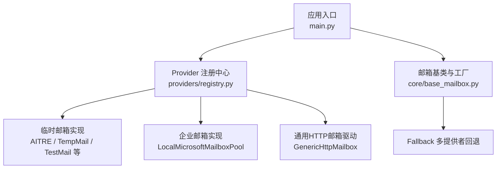
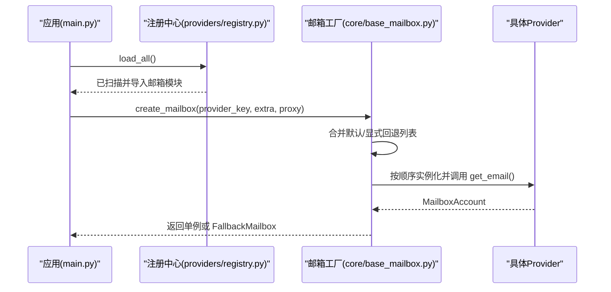
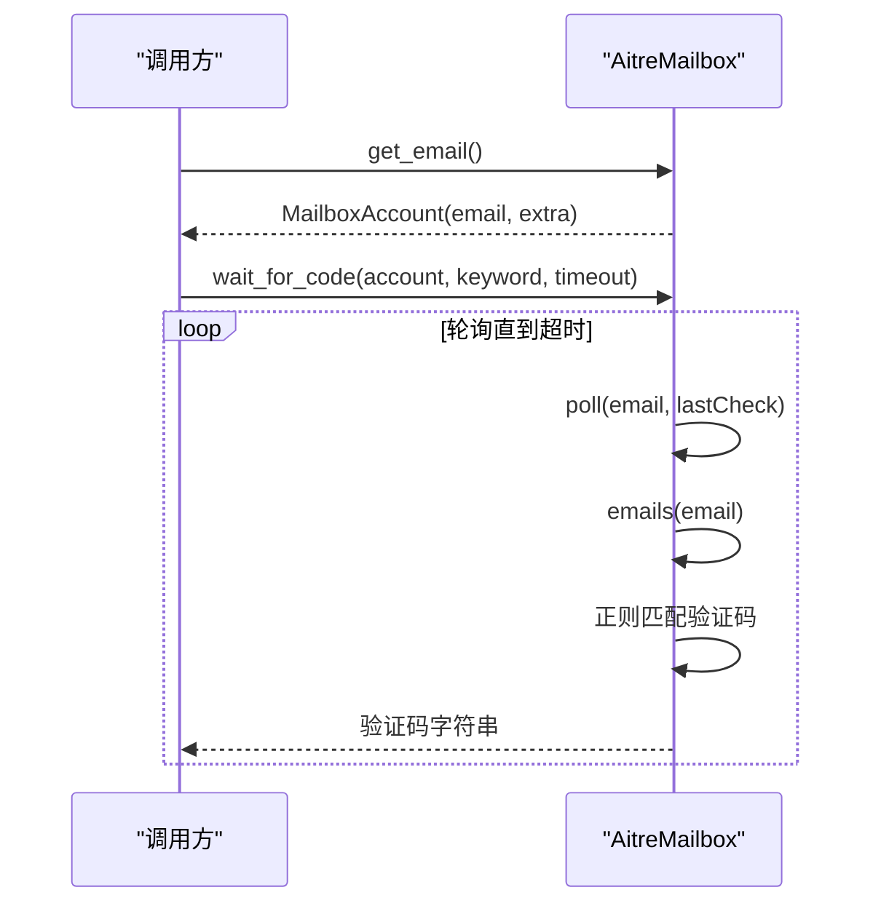
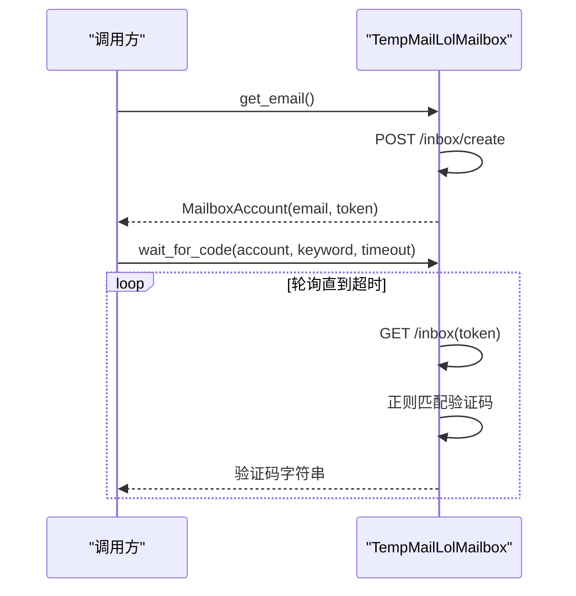
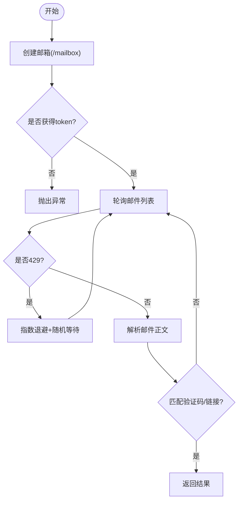
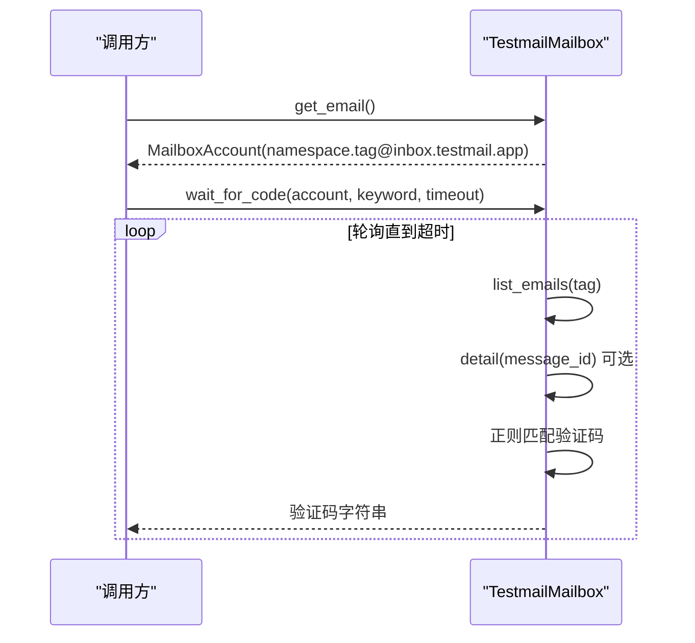
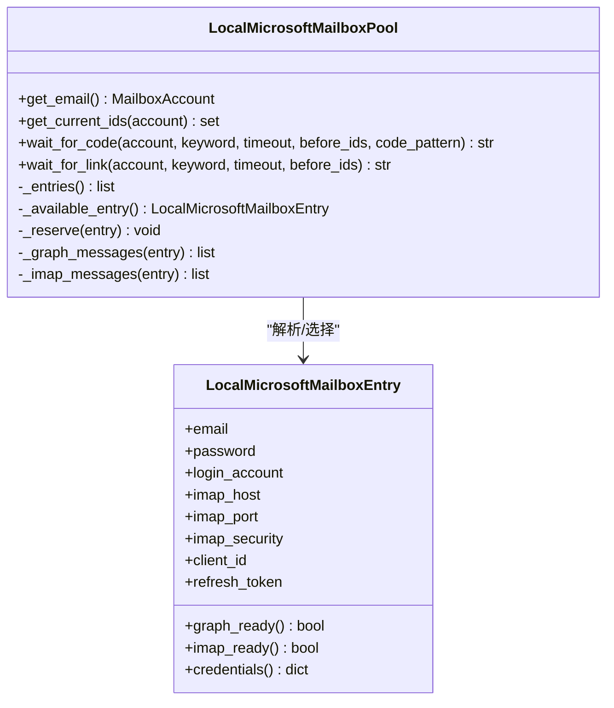
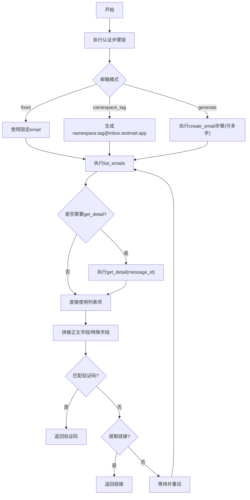
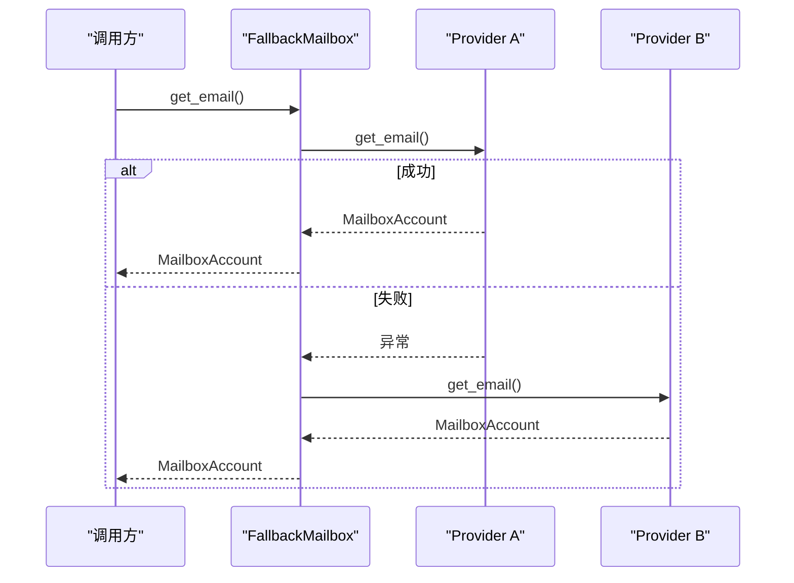
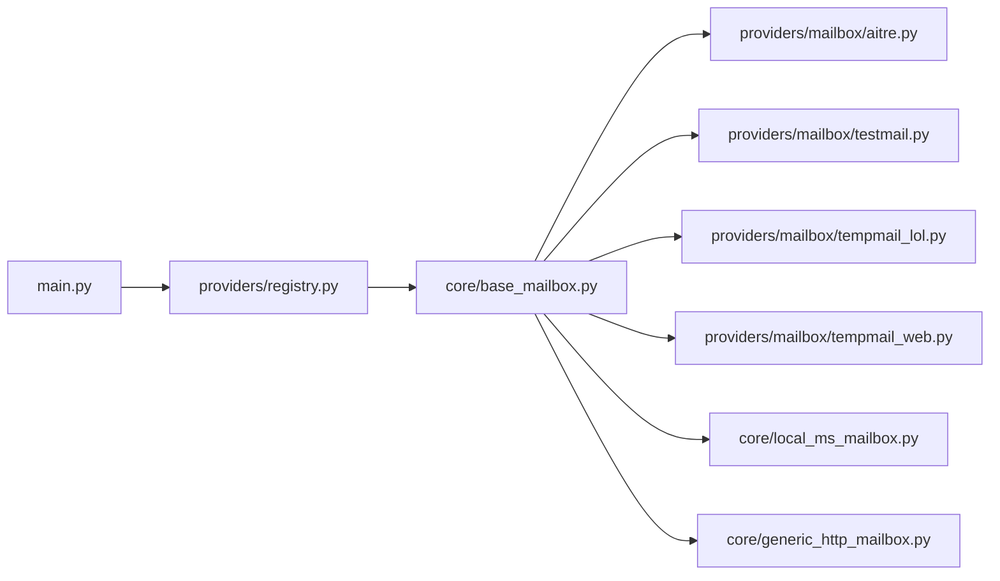

# 邮箱服务提供商

<cite>
**本文引用的文件**
- [main.py](file://main.py)
- [README.md](file://README.md)
- [core/base_mailbox.py](file://core/base_mailbox.py)
- [core/local_ms_mailbox.py](file://core/local_ms_mailbox.py)
- [core/generic_http_mailbox.py](file://core/generic_http_mailbox.py)
- [providers/registry.py](file://providers/registry.py)
- [providers/mailbox/aitre.py](file://providers/mailbox/aitre.py)
- [providers/mailbox/testmail.py](file://providers/mailbox/testmail.py)
- [providers/mailbox/tempmail_lol.py](file://providers/mailbox/tempmail_lol.py)
- [providers/mailbox/tempmail_web.py](file://providers/mailbox/tempmail_web.py)
- [providers/mailbox/laoudo.py](file://providers/mailbox/laoudo.py)
- [providers/mailbox/moemail.py](file://providers/mailbox/moemail.py)
- [providers/mailbox/ddg_email.py](file://providers/mailbox/ddg_email.py)
- [providers/mailbox/freemail.py](file://providers/mailbox/freemail.py)
</cite>

## 目录
1. [简介](#简介)
2. [项目结构](#项目结构)
3. [核心组件](#核心组件)
4. [架构总览](#架构总览)
5. [详细组件分析](#详细组件分析)
6. [依赖关系分析](#依赖关系分析)
7. [性能与监控](#性能与监控)
8. [故障排查指南](#故障排查指南)
9. [结论](#结论)
10. [附录：配置与参数说明](#附录：配置与参数说明)

## 简介
本文件面向临时邮箱与企业邮箱的集成方案，覆盖 AITRE、TempMail、TestMail 等临时邮箱服务的注册流程与邮件获取机制；深入解释本地 Microsoft 邮箱池的管理方式（账户轮换与负载均衡策略）；提供各邮箱服务的配置选项与连接参数说明；阐述邮件监听、解析与提取的技术实现；包含性能监控与错误恢复机制；并提供自定义邮箱提供商的开发指南（协议支持、认证方式、数据格式处理）；最后给出部署配置与运维管理建议。

## 项目结构
系统采用“平台 + Provider”插件化架构：
- 启动时加载所有平台与 Provider，统一通过工厂方法创建具体实现。
- 邮箱 Provider 以模块形式注册到统一注册表，运行时按配置动态实例化。
- 通用 HTTP 邮箱驱动支持零代码扩展新邮箱服务。

图表来源
- [main.py:67-91](file://main.py#L67-L91)
- [providers/registry.py:70-91](file://providers/registry.py#L70-L91)
- [core/base_mailbox.py:262-347](file://core/base_mailbox.py#L262-L347)

章节来源
- [main.py:67-91](file://main.py#L67-L91)
- [providers/registry.py:70-91](file://providers/registry.py#L70-L91)
- [core/base_mailbox.py:262-347](file://core/base_mailbox.py#L262-L347)

## 核心组件
- BaseMailbox 抽象接口：定义 get_email、wait_for_code、get_current_ids、wait_for_link 等能力。
- FallbackMailbox：顺序尝试多个邮箱 Provider，创建成功后固定使用同一 Provider 收件，提升稳定性。
- 具体 Provider：
  - AitreMailbox：对接 mail.aitre.cc 临时邮箱 API。
  - TempMailLolMailbox：对接 tempmail.lol 公共临时邮箱。
  - TempMailWebMailbox：基于 web2.temp-mail.org 的 Web 模式临时邮箱。
  - TestmailMailbox：testmail.app namespace 模式，适合并发任务。
  - LocalMicrosoftMailboxPool：本地 Microsoft 邮箱池，支持 Graph/IMAP 读取。
  - GenericHttpMailbox：数据驱动的通用 HTTP 邮箱，零代码新增邮箱类型。
- 注册与发现：providers/registry.py 扫描并导入 providers/mailbox/*，将具体类注册到全局注册表。

章节来源
- [core/base_mailbox.py:27-48](file://core/base_mailbox.py#L27-L48)
- [core/base_mailbox.py:51-118](file://core/base_mailbox.py#L51-L118)
- [core/base_mailbox.py:476-555](file://core/base_mailbox.py#L476-L555)
- [core/base_mailbox.py:557-652](file://core/base_mailbox.py#L557-L652)
- [core/base_mailbox.py:654-800](file://core/base_mailbox.py#L654-L800)
- [core/local_ms_mailbox.py:161-290](file://core/local_ms_mailbox.py#L161-L290)
- [core/generic_http_mailbox.py:75-161](file://core/generic_http_mailbox.py#L75-L161)
- [providers/registry.py:70-91](file://providers/registry.py#L70-L91)

## 架构总览
系统启动时初始化数据库、加载平台与 Provider，启动调度器、任务运行器、Solver 与生命周期管理器。邮箱 Provider 通过 create_mailbox 工厂根据配置动态创建，支持多 Provider 回退。

图表来源
- [main.py:67-91](file://main.py#L67-L91)
- [providers/registry.py:70-91](file://providers/registry.py#L70-L91)
- [core/base_mailbox.py:289-347](file://core/base_mailbox.py#L289-L347)

章节来源
- [main.py:67-91](file://main.py#L67-L91)
- [core/base_mailbox.py:289-347](file://core/base_mailbox.py#L289-L347)

## 详细组件分析

### AITRE 临时邮箱
- 注册与获取邮箱：通过 AitreMailbox.get_email 返回邮箱地址与资源元信息。
- 邮件监听与验证码提取：poll 接口轮询新邮件，emails 接口拉取详情，正则匹配 6 位验证码。
- 链接提取：支持从正文中提取验证链接。

图表来源
- [core/base_mailbox.py:476-555](file://core/base_mailbox.py#L476-L555)

章节来源
- [core/base_mailbox.py:476-555](file://core/base_mailbox.py#L476-L555)
- [providers/mailbox/aitre.py:1-6](file://providers/mailbox/aitre.py#L1-L6)

### TempMail.lol 临时邮箱
- 注册与获取邮箱：POST /inbox/create 创建匿名邮箱，返回 token 作为 account_id。
- 邮件监听与验证码提取：GET /inbox 拉取邮件列表，按时间倒序遍历，正则匹配验证码。
- 链接提取：支持从正文中提取验证链接。

图表来源
- [core/base_mailbox.py:557-652](file://core/base_mailbox.py#L557-L652)

章节来源
- [core/base_mailbox.py:557-652](file://core/base_mailbox.py#L557-L652)
- [providers/mailbox/tempmail_lol.py:1-6](file://providers/mailbox/tempmail_lol.py#L1-L6)

### Temp-Mail Web 临时邮箱
- 注册与获取邮箱：通过浏览器内 fetch 调用 /mailbox 创建邮箱，返回 address/token。
- 邮件监听与验证码提取：轮询 /mailbox 或相关列表接口，结合 429 重试与随机退避。
- 链接提取：支持从正文中提取验证链接。

图表来源
- [core/base_mailbox.py:654-800](file://core/base_mailbox.py#L654-L800)

章节来源
- [core/base_mailbox.py:654-800](file://core/base_mailbox.py#L654-L800)
- [providers/mailbox/tempmail_web.py:1-6](file://providers/mailbox/tempmail_web.py#L1-L6)

### TestMail 临时邮箱（namespace 模式）
- 注册与获取邮箱：通过 TestmailMailbox 使用 testmail.app 的 namespace/tag 模式，适合高并发隔离。
- 邮件监听与验证码提取：list_emails 拉取邮件，detail 可选，正则匹配验证码。
- 链接提取：支持从正文中提取验证链接。

图表来源
- [core/base_mailbox.py:222-229](file://core/base_mailbox.py#L222-L229)
- [core/generic_http_mailbox.py:285-315](file://core/generic_http_mailbox.py#L285-L315)

章节来源
- [core/base_mailbox.py:222-229](file://core/base_mailbox.py#L222-L229)
- [core/generic_http_mailbox.py:285-315](file://core/generic_http_mailbox.py#L285-L315)
- [providers/mailbox/testmail.py:1-6](file://providers/mailbox/testmail.py#L1-L6)

### 本地 Microsoft 邮箱池（企业邮箱）
- 账户轮换与负载均衡：
  - 从文本/文件解析 Xinlan/BH Mailer 通用行，去重后得到可用账户集合。
  - 状态文件记录已使用账户，支持 allow_reuse 开关控制复用策略。
  - 线程锁保证并发安全，避免重复分配。
- 邮件读取：
  - 优先使用 Microsoft Graph（client_id + refresh_token），否则回退 IMAP。
  - Graph：refresh_token 换取 access_token，拉取最近邮件。
  - IMAP：SSL/TLS 登录，拉取 INBOX 最近邮件。
- 验证码与链接提取：清洗 HTML/脚本，正则匹配验证码，提取验证链接。

图表来源
- [core/local_ms_mailbox.py:36-86](file://core/local_ms_mailbox.py#L36-L86)
- [core/local_ms_mailbox.py:161-290](file://core/local_ms_mailbox.py#L161-L290)
- [core/local_ms_mailbox.py:344-438](file://core/local_ms_mailbox.py#L344-L438)
- [core/local_ms_mailbox.py:454-502](file://core/local_ms_mailbox.py#L454-L502)

章节来源
- [core/local_ms_mailbox.py:161-290](file://core/local_ms_mailbox.py#L161-L290)
- [core/local_ms_mailbox.py:344-438](file://core/local_ms_mailbox.py#L344-L438)
- [core/local_ms_mailbox.py:454-502](file://core/local_ms_mailbox.py#L454-L502)

### 通用 HTTP 邮箱驱动（自定义邮箱）
- 数据驱动：通过 pipeline_config（metadata）与 settings（用户表单）合并构建步骤管道。
- 步骤：auth_steps → create_email → list_emails → get_detail（可选）。
- 认证：bearer/header/api_key_param，支持 Cookie 持久化与变量传递。
- 邮箱生成：fixed/namespace_tag/generate 三种模式。
- 邮件监听与解析：list_emails 拉取列表，get_detail 拉取详情，字段拼接后正则匹配验证码或提取链接。

图表来源
- [core/generic_http_mailbox.py:75-161](file://core/generic_http_mailbox.py#L75-L161)
- [core/generic_http_mailbox.py:165-257](file://core/generic_http_mailbox.py#L165-L257)
- [core/generic_http_mailbox.py:270-315](file://core/generic_http_mailbox.py#L270-L315)
- [core/generic_http_mailbox.py:317-411](file://core/generic_http_mailbox.py#L317-L411)
- [core/generic_http_mailbox.py:413-474](file://core/generic_http_mailbox.py#L413-L474)

章节来源
- [core/generic_http_mailbox.py:75-161](file://core/generic_http_mailbox.py#L75-L161)
- [core/generic_http_mailbox.py:165-257](file://core/generic_http_mailbox.py#L165-L257)
- [core/generic_http_mailbox.py:270-315](file://core/generic_http_mailbox.py#L270-L315)
- [core/generic_http_mailbox.py:317-411](file://core/generic_http_mailbox.py#L317-L411)
- [core/generic_http_mailbox.py:413-474](file://core/generic_http_mailbox.py#L413-L474)

### 多 Provider 回退机制
- FallbackMailbox 按顺序尝试多个 Provider，失败记录错误并继续下一个。
- 创建成功后缓存映射，后续收件固定使用该 Provider，避免切换导致上下文丢失。
- 支持显式 fallbacks 与启用 Provider 列表组合排序。

图表来源
- [core/base_mailbox.py:51-118](file://core/base_mailbox.py#L51-L118)
- [core/base_mailbox.py:289-347](file://core/base_mailbox.py#L289-L347)

章节来源
- [core/base_mailbox.py:51-118](file://core/base_mailbox.py#L51-L118)
- [core/base_mailbox.py:289-347](file://core/base_mailbox.py#L289-L347)

## 依赖关系分析
- 启动阶段：main.py 调用 providers/registry.load_all() 扫描并导入邮箱模块，完成注册。
- 运行时：base_mailbox.create_mailbox 根据 provider_key 查找定义与设置，构造具体实例或 FallbackMailbox。
- 具体 Provider 依赖外部 API（如 AITRE、TempMail.lol、Testmail）、Microsoft Graph 或 IMAP。

图表来源
- [main.py:67-91](file://main.py#L67-L91)
- [providers/registry.py:70-91](file://providers/registry.py#L70-L91)
- [core/base_mailbox.py:262-347](file://core/base_mailbox.py#L262-L347)

章节来源
- [main.py:67-91](file://main.py#L67-L91)
- [providers/registry.py:70-91](file://providers/registry.py#L70-L91)
- [core/base_mailbox.py:262-347](file://core/base_mailbox.py#L262-L347)

## 性能与监控
- 轮询间隔与超时：各 Provider 在 wait_for_code/wait_for_link 中采用固定轮询间隔（通常 3-5 秒）与可配置超时，避免频繁请求。
- 限流与重试：TempMailWeb 遇到 429 时进行指数退避与随机等待，降低被限流风险。
- 并发安全：LocalMicrosoftMailboxPool 使用线程锁保护账户预留与状态写入。
- 监控指标：
  - 注册成功率与错误归因：通过 stats API 查看全局、按平台、按天、按代理统计。
  - 健康检查：health API 用于服务可用性检测。
  - 生命周期：定时有效性检测、Token 续期、Trial 预警。

章节来源
- [core/base_mailbox.py:654-800](file://core/base_mailbox.py#L654-L800)
- [core/local_ms_mailbox.py:161-290](file://core/local_ms_mailbox.py#L161-L290)
- [README.md:244-250](file://README.md#L244-L250)

## 故障排查指南
- 验证码失败：
  - 确认验证码 Provider 已正确配置（YesCaptcha/2Captcha/本地 Solver）。
  - 协议模式下优先远程验证码服务；浏览器模式 Camoufox 自动点击 Turnstile，失败回退远程 Solver。
  - 持续失败检查代理 IP 质量，高风险 IP 触发更严格验证。
- 代理被封/注册失败率高：
  - 查看各代理成功率，禁用低成功率代理。
  - 使用住宅代理而非数据中心代理，通过率更高。
  - 降低并发数，避免同一 IP 短时间大量请求。
- Solver 启动超时：
  - 首次启动需下载或初始化 Camoufox，检查 8889 端口占用与环境依赖。
  - Docker 环境建议使用预构建镜像；本地裸跑持续超时优先检查端口与安装。
- ARM 镜像构建失败：
  - 前端 TypeScript 构建失败先本地执行 npm run build，再重新构建镜像。

章节来源
- [README.md:390-436](file://README.md#L390-L436)

## 结论
本方案通过统一的邮箱 Provider 体系与数据驱动的通用 HTTP 驱动，实现了临时邮箱与企业邮箱的灵活集成。AITRE、TempMail、TestMail 等临时邮箱服务具备稳定的注册与邮件获取机制；本地 Microsoft 邮箱池支持账户轮换与负载均衡，适配企业场景；通用 HTTP 驱动支持零代码扩展新邮箱服务。配合性能监控与错误恢复机制，满足高可用与可扩展需求。

## 附录：配置与参数说明
- 邮箱服务概览与推荐：
  - MoeMail（推荐）：基于 cloudflare_temp_email 自建临时邮箱，无需配置，自动注册账号生成邮箱。
  - Laoudo：固定自有域名邮箱，稳定性最高，适合长期使用。
  - Cloudflare Worker 自建：完全自主可控。
  - Testmail：testmail.app namespace 模式，适合并发任务，自动 tag + 时间过滤。
  - DuckDuckGo Email：私密别名 + IMAP 转发读取。
  - Freemail：Cloudflare Worker 自建，支持管理员令牌或用户名密码认证。
  - DuckMail：公共临时邮箱，无需配置，部分地区需代理。
  - TempMail.lol：公共临时邮箱，自动生成匿名地址。
  - Temp-Mail Web：基于 web2.temp-mail.org 的临时邮箱。
- 各 Provider 字段格式参考全局配置页内字段提示，后端会按 provider catalog 自动渲染表单。
- 验证码服务：
  - YesCaptcha：填写 Client Key。
  - 2Captcha：填写 API Key。
  - 本地 Solver：Camoufox 本地解码，需先执行 camoufox fetch。
- 代理池：
  - 静态代理：手动添加，按成功率加权轮询，连续失败自动禁用。
  - API 提取代理：通过 HTTP API 动态提取代理 IP。
  - 旋转网关代理：固定入口地址，每次请求自动分配出口 IP。
- 接码服务：
  - SMS-Activate：填写 API Key，可配置默认国家。
  - HeroSMS：填写 API Key，可配置服务代码、国家 ID、最高单价、号码复用策略。

章节来源
- [README.md:183-230](file://README.md#L183-L230)