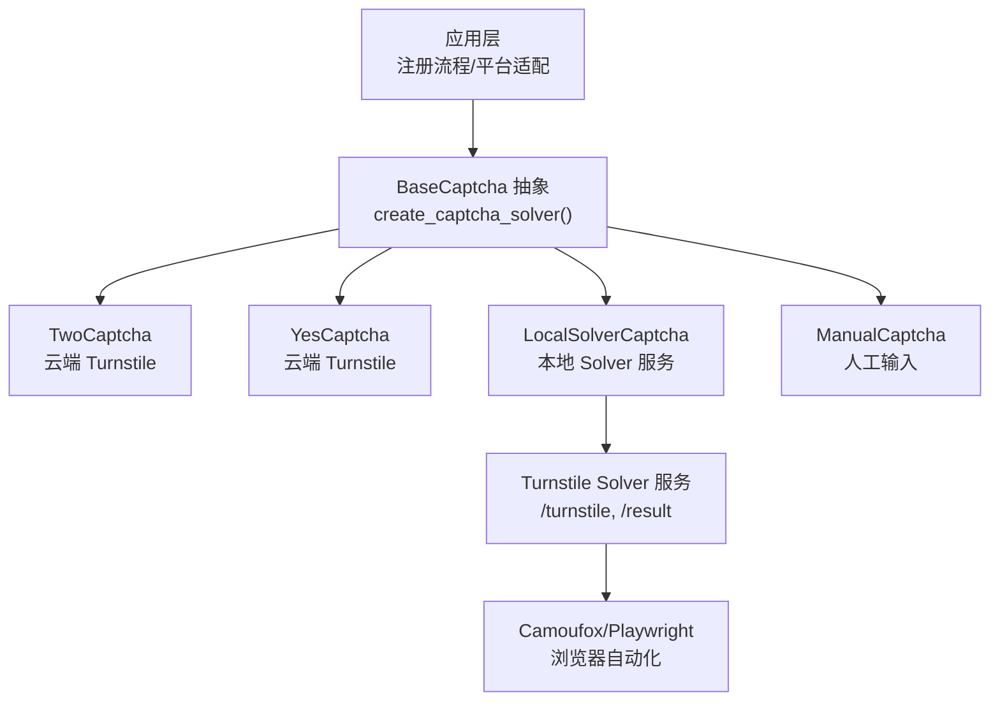
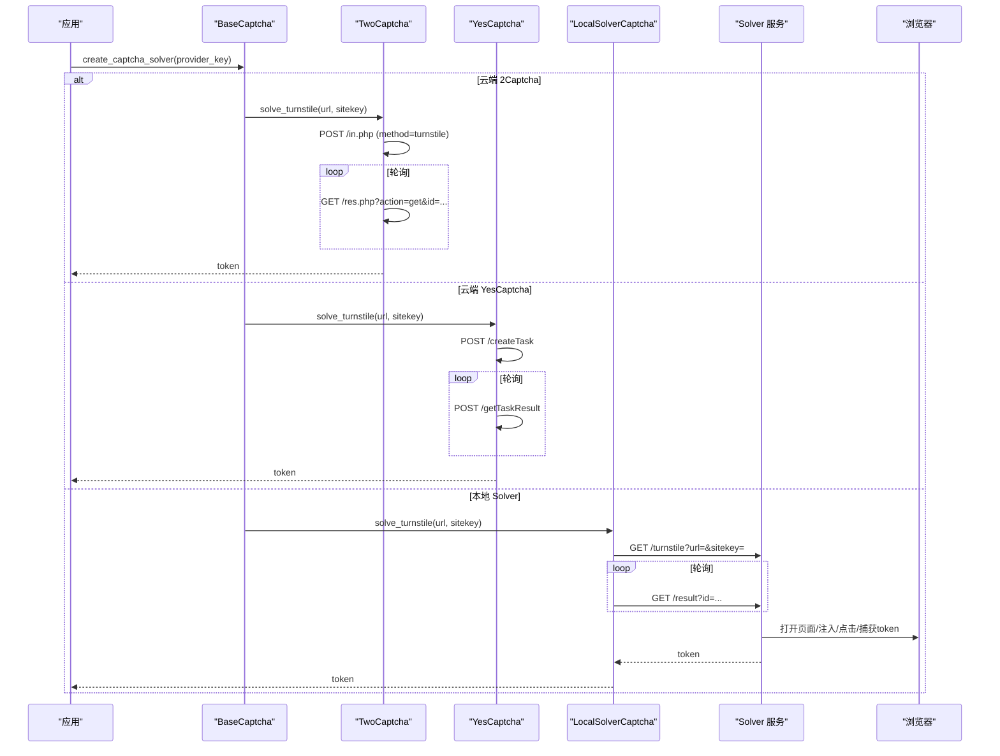
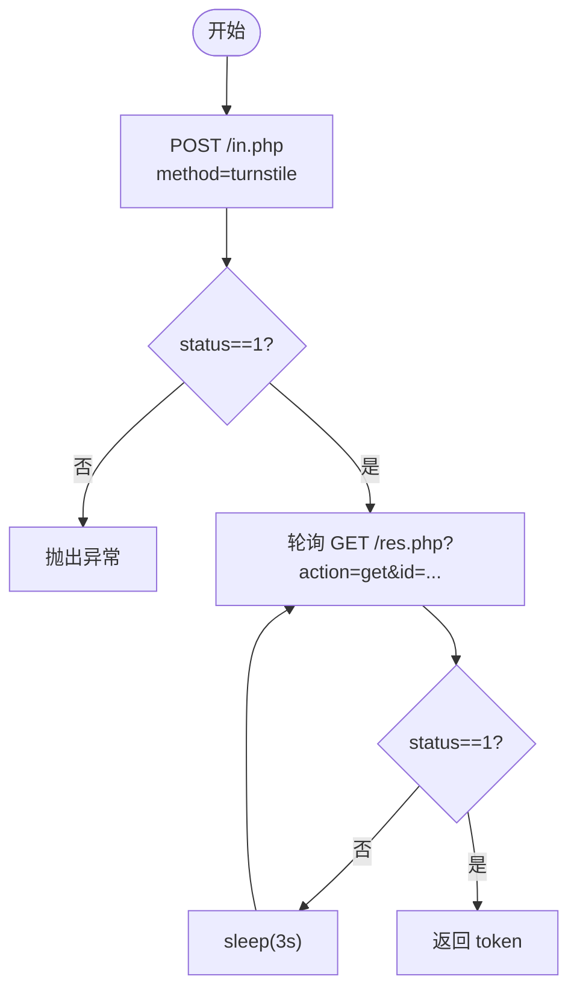
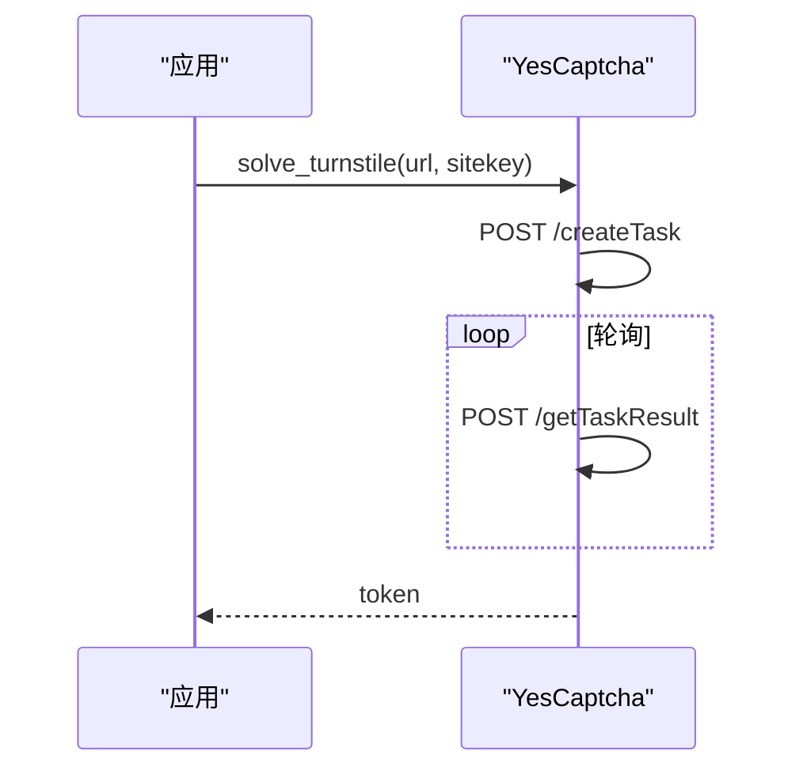
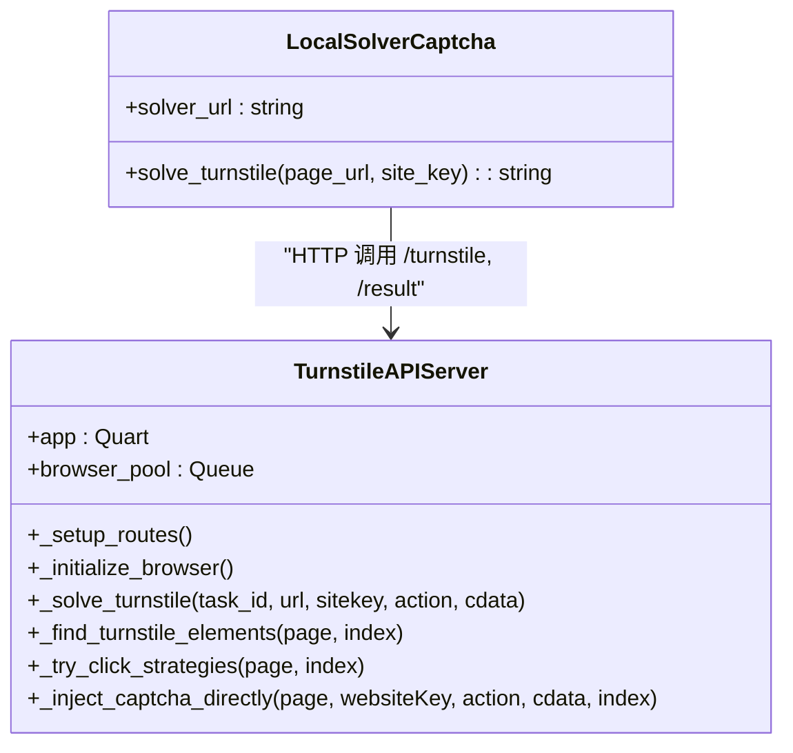
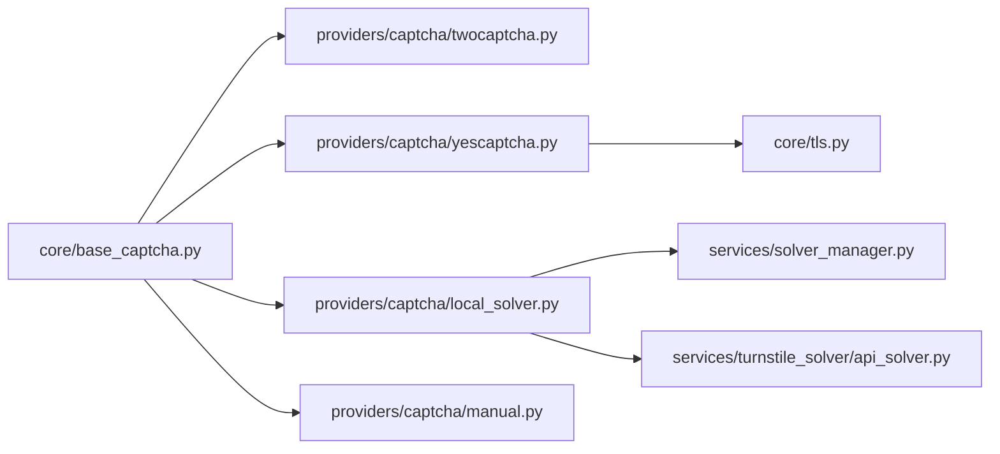

# 在线验证码服务

<cite>
**本文引用的文件**
- [core/base_captcha.py](file://core/base_captcha.py)
- [providers/captcha/twocaptcha.py](file://providers/captcha/twocaptcha.py)
- [providers/captcha/yescaptcha.py](file://providers/captcha/yescaptcha.py)
- [providers/captcha/manual.py](file://providers/captcha/manual.py)
- [providers/captcha/local_solver.py](file://providers/captcha/local_solver.py)
- [services/turnstile_solver/api_solver.py](file://services/turnstile_solver/api_solver.py)
- [services/turnstile_solver/start.py](file://services/turnstile_solver/start.py)
- [services/solver_manager.py](file://services/solver_manager.py)
- [core/tls.py](file://core/tls.py)
- [infrastructure/provider_settings_repository.py](file://infrastructure/provider_settings_repository.py)
- [application/provider_settings.py](file://application/provider_settings.py)
- [README.md](file://README.md)
</cite>

## 目录
1. [简介](#简介)
2. [项目结构](#项目结构)
3. [核心组件](#核心组件)
4. [架构总览](#架构总览)
5. [详细组件分析](#详细组件分析)
6. [依赖关系分析](#依赖关系分析)
7. [性能与成本对比](#性能与成本对比)
8. [故障排查指南](#故障排查指南)
9. [结论](#结论)
10. [附录：配置与使用要点](#附录：配置与使用要点)

## 简介
本项目提供统一的在线验证码解决能力，重点覆盖 Turnstile 验证码的云端与本地求解方案。云端方案通过 2Captcha、YesCaptcha 等第三方 API 完成“创建任务—轮询状态—获取结果”的流程；本地方案通过内置的 Turnstile Solver 服务（基于 Camoufox/Playwright）在浏览器环境中自动完成交互并返回 token。系统还包含人工打码模式与本地 solver 启动管理、TLS 安全请求封装、以及 provider 配置与策略选择机制。

## 项目结构
围绕验证码能力的关键目录与职责如下：
- core/base_captcha.py：定义统一抽象接口 BaseCaptcha，并提供按 provider_key 创建具体实现的能力。
- providers/captcha/*：各验证码提供商的具体实现（2Captcha、YesCaptcha、Manual、LocalSolver）。
- services/turnstile_solver/*：本地 Turnstile Solver 服务（API Server + 启动入口），负责浏览器自动化与结果持久化。
- services/solver_manager.py：进程级管理，负责本地 solver 服务的启动、停止、重启与健康检查。
- core/tls.py：封装不校验证书的 HTTP 调用，用于兼容部分第三方 API。
- infrastructure/provider_settings_repository.py：读取已启用的验证码 provider 顺序与默认项。
- application/provider_settings.py：对外暴露验证码策略与 provider 列表。
- README.md：部署说明中包含 Solver 端口与运行方式。

图表来源
- [core/base_captcha.py:67-97](file://core/base_captcha.py#L67-L97)
- [providers/captcha/twocaptcha.py:19-60](file://providers/captcha/twocaptcha.py#L19-L60)
- [providers/captcha/yescaptcha.py:20-39](file://providers/captcha/yescaptcha.py#L20-L39)
- [providers/captcha/local_solver.py:17-49](file://providers/captcha/local_solver.py#L17-L49)
- [services/turnstile_solver/api_solver.py:135-140](file://services/turnstile_solver/api_solver.py#L135-L140)

章节来源
- [core/base_captcha.py:1-98](file://core/base_captcha.py#L1-L98)
- [providers/captcha/twocaptcha.py:1-64](file://providers/captcha/twocaptcha.py#L1-L64)
- [providers/captcha/yescaptcha.py:1-43](file://providers/captcha/yescaptcha.py#L1-L43)
- [providers/captcha/local_solver.py:1-80](file://providers/captcha/local_solver.py#L1-L80)
- [services/turnstile_solver/api_solver.py:135-140](file://services/turnstile_solver/api_solver.py#L135-L140)
- [services/solver_manager.py:73-155](file://services/solver_manager.py#L73-L155)
- [core/tls.py:19-23](file://core/tls.py#L19-L23)
- [infrastructure/provider_settings_repository.py:67-83](file://infrastructure/provider_settings_repository.py#L67-L83)
- [application/provider_settings.py:37-52](file://application/provider_settings.py#L37-L52)
- [README.md:125-155](file://README.md#L125-L155)

## 核心组件
- BaseCaptcha 抽象：统一 solve_turnstile(page_url, site_key) 与 solve_image(image_b64) 接口，屏蔽不同后端差异。
- TwoCaptcha 实现：调用 https://2captcha.com/in.php 创建 turnstile 任务，再轮询 res.php 获取 token。
- YesCaptcha 实现：调用 https://api.yescaptcha.com/createTask 创建任务，再 getTaskResult 轮询 ready 状态取 token。
- LocalSolverCaptcha 实现：调用本地 solver 服务 /turnstile 提交任务，轮询 /result 获取 token。
- ManualCaptcha：阻塞等待用户手动输入 token，便于调试或兜底。
- Turnstile Solver 服务：Quart 应用，提供 /turnstile 与 /result 接口，内部维护浏览器池，注入脚本、拦截资源、点击控件、捕获 token 并落库。
- Solver Manager：守护本地 solver 子进程，处理首次下载 Camoufox、启动失败计数、端口占用清理、健康检查等。

章节来源
- [core/base_captcha.py:5-14](file://core/base_captcha.py#L5-L14)
- [providers/captcha/twocaptcha.py:19-60](file://providers/captcha/twocaptcha.py#L19-L60)
- [providers/captcha/yescaptcha.py:20-39](file://providers/captcha/yescaptcha.py#L20-L39)
- [providers/captcha/local_solver.py:17-49](file://providers/captcha/local_solver.py#L17-L49)
- [providers/captcha/manual.py:14-18](file://providers/captcha/manual.py#L14-L18)
- [services/turnstile_solver/api_solver.py:135-140](file://services/turnstile_solver/api_solver.py#L135-L140)
- [services/solver_manager.py:21-38](file://services/solver_manager.py#L21-L38)

## 架构总览
整体数据流分为两类路径：
- 云端路径：应用 → BaseCaptcha → 具体云端 Provider（2Captcha/YesCaptcha）→ 云端 API → 返回 token。
- 本地路径：应用 → BaseCaptcha → LocalSolverCaptcha → 本地 Solver 服务 → 浏览器自动化 → 返回 token。

图表来源
- [core/base_captcha.py:67-97](file://core/base_captcha.py#L67-L97)
- [providers/captcha/twocaptcha.py:19-60](file://providers/captcha/twocaptcha.py#L19-L60)
- [providers/captcha/yescaptcha.py:20-39](file://providers/captcha/yescaptcha.py#L20-L39)
- [providers/captcha/local_solver.py:17-49](file://providers/captcha/local_solver.py#L17-L49)
- [services/turnstile_solver/api_solver.py:135-140](file://services/turnstile_solver/api_solver.py#L135-L140)

## 详细组件分析

### 云端 Turnstile 求解：2Captcha
- 任务创建：POST 到 /in.php，参数包括 key、method=turnstile、sitekey、pageurl、json=1。
- 状态轮询：循环 GET /res.php?action=get&id={task_id}，间隔约 3 秒，最多约 60 次。
- 结果获取：当 status=1 时返回 request 字段作为 token。
- 错误处理：非 2xx 状态码 raise_for_status；status!=1 抛出运行时异常；未知错误直接报错；超时抛 TimeoutError。
- 超时与重试：单次请求 timeout=30s；轮询次数限制防止无限等待。

图表来源
- [providers/captcha/twocaptcha.py:19-60](file://providers/captcha/twocaptcha.py#L19-L60)

章节来源
- [providers/captcha/twocaptcha.py:19-60](file://providers/captcha/twocaptcha.py#L19-L60)

### 云端 Turnstile 求解：YesCaptcha
- 任务创建：POST /createTask，payload 包含 clientKey、task.type=TurnstileTaskProxyless、websiteURL、websiteKey。
- 状态轮询：循环 POST /getTaskResult，间隔约 3 秒，最多约 60 次。
- 结果获取：当 status="ready" 时从 solution.token 取回 token。
- 错误处理：errorId!=0 抛出异常；无 taskId 抛出异常；超时抛 TimeoutError。
- TLS：使用 insecure_request 封装 verify=False 的请求并抑制告警。

图表来源
- [providers/captcha/yescaptcha.py:20-39](file://providers/captcha/yescaptcha.py#L20-L39)
- [core/tls.py:19-23](file://core/tls.py#L19-L23)

章节来源
- [providers/captcha/yescaptcha.py:20-39](file://providers/captcha/yescaptcha.py#L20-L39)
- [core/tls.py:19-23](file://core/tls.py#L19-L23)

### 本地 Turnstile 求解：LocalSolverCaptcha 与 Solver 服务
- 客户端调用：GET /turnstile?{url, sitekey}，返回 taskId；然后循环 GET /result?id={taskId} 直到 ready 或失败。
- 服务端能力：
  - 路由：/turnstile、/result、/。
  - 浏览器池：支持 chromium/chrome/msedge/camoufox，可随机或固定 UA/Sec-Ch-UA。
  - 资源优化：拦截媒体、字体、统计等无关资源，仅允许 document/script/xhr/fetch/stylesheet 及 challenges.cloudflare.com 等域名。
  - 反检测：注入 anti-detect 脚本，隐藏 webdriver，设置 chrome runtime 等。
  - 元素定位：多策略查找 .cf-turnstile、[data-sitekey]、iframe[src*="turnstile"] 等，尝试点击 checkbox 或直接 widget。
  - Token 捕获：注入回调函数，将 token 写入隐藏 input 或通过全局回调收集。
  - 代理支持：可选从 proxies.txt 读取代理，解析多种格式并设置 context proxy。
  - 结果存储：db_results 模块保存/加载结果，定时清理旧记录。

图表来源
- [services/turnstile_solver/api_solver.py:62-140](file://services/turnstile_solver/api_solver.py#L62-L140)
- [providers/captcha/local_solver.py:17-49](file://providers/captcha/local_solver.py#L17-L49)

章节来源
- [providers/captcha/local_solver.py:17-49](file://providers/captcha/local_solver.py#L17-L49)
- [services/turnstile_solver/api_solver.py:135-140](file://services/turnstile_solver/api_solver.py#L135-L140)
- [services/turnstile_solver/api_solver.py:269-310](file://services/turnstile_solver/api_solver.py#L269-L310)
- [services/turnstile_solver/api_solver.py:312-451](file://services/turnstile_solver/api_solver.py#L312-L451)
- [services/turnstile_solver/api_solver.py:466-622](file://services/turnstile_solver/api_solver.py#L466-L622)
- [services/turnstile_solver/api_solver.py:624-779](file://services/turnstile_solver/api_solver.py#L624-L779)

### 人工打码：ManualCaptcha
- 用途：开发调试或兜底场景，阻塞等待用户输入 token。
- 行为：solve_turnstile 打印提示并读取标准输入；solve_image 同理。

章节来源
- [providers/captcha/manual.py:14-18](file://providers/captcha/manual.py#L14-L18)

### 服务启动与管理：Solver Manager
- 健康检查：is_running 通过 GET / 探测服务是否可用。
- 启动流程：
  - 确保 Camoufox 二进制存在，不存在则自动下载。
  - 以子进程方式启动 start.py，传入 --browser_type=camoufox、--thread=1、--port=8889。
  - 等待服务就绪（最多 30 秒），若退出则记录 stderr 并累计失败次数。
- 停止与重启：stop 先终止子进程，再尝试通过端口杀残留进程；restart 重置失败计数后 stop+start。
- 并发与线程：默认单线程，避免资源竞争；可通过命令行调整 thread。

章节来源
- [services/solver_manager.py:21-38](file://services/solver_manager.py#L21-L38)
- [services/solver_manager.py:41-70](file://services/solver_manager.py#L41-L70)
- [services/solver_manager.py:73-155](file://services/solver_manager.py#L73-L155)
- [services/solver_manager.py:158-229](file://services/solver_manager.py#L158-L229)
- [services/turnstile_solver/start.py:15-28](file://services/turnstile_solver/start.py#L15-L28)

## 依赖关系分析
- BaseCaptcha 为统一抽象，具体实现通过 register_provider 注册并按 driver_type 创建实例。
- 云端实现依赖 requests 进行 HTTP 调用；YesCaptcha 使用 insecure_request 关闭证书校验。
- LocalSolverCaptcha 依赖本地 solver 服务；solver_manager 负责生命周期管理。
- 平台侧在准备 captcha provider 时，若 driver_type=local_solver，会自动触发 solver_manager.start()。

图表来源
- [core/base_captcha.py:67-97](file://core/base_captcha.py#L67-L97)
- [providers/captcha/local_solver.py:17-49](file://providers/captcha/local_solver.py#L17-L49)
- [services/solver_manager.py:73-155](file://services/solver_manager.py#L73-L155)
- [services/turnstile_solver/api_solver.py:135-140](file://services/turnstile_solver/api_solver.py#L135-L140)
- [core/tls.py:19-23](file://core/tls.py#L19-L23)

章节来源
- [core/base_captcha.py:67-97](file://core/base_captcha.py#L67-L97)
- [providers/captcha/local_solver.py:17-49](file://providers/captcha/local_solver.py#L17-L49)
- [services/solver_manager.py:73-155](file://services/solver_manager.py#L73-L155)
- [core/tls.py:19-23](file://core/tls.py#L19-L23)

## 性能与成本对比
- 2Captcha
  - 优点：成熟稳定，API 简单，适合高并发云端场景。
  - 缺点：按任务计费，成本随任务量线性增长；网络延迟影响总体耗时。
  - 典型耗时：创建任务 + 轮询（约 3s×N，N≤60），平均取决于云端处理速度。
- YesCaptcha
  - 优点：API 简洁，支持 TurnstileTaskProxyless，无需自建代理。
  - 缺点：同样按任务计费；需接受 insecure_request 的安全权衡。
  - 典型耗时：与 2Captcha 类似，受网络与云端队列影响。
- 本地 Solver（Camoufox/Playwright）
  - 优点：一次性环境搭建后可长期复用，无按任务计费；可精细控制 UA、Sec-Ch-UA、代理、资源拦截。
  - 缺点：需要浏览器二进制与资源；首次下载较大；CPU/内存占用较高；稳定性受目标站点反爬策略影响。
  - 典型耗时：页面加载 + 元素定位 + 点击 + token 捕获，通常数秒至十余秒不等。
- 人工打码
  - 优点：零成本，可控性强。
  - 缺点：无法自动化，仅用于调试或极端情况。

注：以上为代码实现所体现的行为与约束，未包含外部定价信息。实际成本与性能需结合业务规模与网络环境评估。

## 故障排查指南
- 云端 API 错误
  - 2Captcha：创建任务失败或轮询返回非预期状态会抛出 RuntimeError；请检查 api_key、sitekey、pageurl 是否正确，确认网络可达与账户余额。
  - YesCaptcha：无 taskId 或 errorId!=0 会抛出异常；确认 clientKey 正确且任务类型匹配。
- 本地 Solver 启动失败
  - Camoufox 未安装或下载失败：solver_manager 会记录原因并停止重试；请检查网络与磁盘空间。
  - 端口占用：stop/restart 会尝试释放端口；如仍被占用，请手动清理进程。
  - 连续失败保护：达到最大连续失败次数后停止自动重试，需人工介入。
- 浏览器与反检测
  - 资源拦截导致页面加载异常：检查 _optimized_route_handler 允许的域名与资源类型。
  - 元素定位失败：检查 .cf-turnstile、[data-sitekey]、iframe 是否存在；必要时开启 debug 日志。
  - 代理配置：proxies.txt 格式不正确会导致上下文创建失败；请核对 scheme、auth、server 格式。
- 超时问题
  - 云端轮询上限约 60 次 × 间隔；如需更长等待，可在调用方增加重试或调整业务超时。
  - 本地轮询上限约 60 次 × 2s；若频繁超时，建议检查目标站点响应与浏览器性能。

章节来源
- [providers/captcha/twocaptcha.py:34-60](file://providers/captcha/twocaptcha.py#L34-L60)
- [providers/captcha/yescaptcha.py:27-39](file://providers/captcha/yescaptcha.py#L27-L39)
- [services/solver_manager.py:73-155](file://services/solver_manager.py#L73-L155)
- [services/turnstile_solver/api_solver.py:269-310](file://services/turnstile_solver/api_solver.py#L269-L310)
- [services/turnstile_solver/api_solver.py:312-451](file://services/turnstile_solver/api_solver.py#L312-L451)
- [services/turnstile_solver/api_solver.py:624-779](file://services/turnstile_solver/api_solver.py#L624-L779)

## 结论
本项目提供了完整的 Turnstile 验证码解决方案，涵盖云端（2Captcha、YesCaptcha）与本地（Camoufox/Playwright）两条路径，并通过统一抽象与 provider 管理机制实现灵活切换。本地 solver 具备较强的反检测与资源优化能力，适合对成本敏感或需要高度可控的场景；云端方案则更适合快速集成与弹性扩展。建议根据业务需求选择合适的 provider，并结合错误处理与超时重试策略提升鲁棒性。

## 附录：配置与使用要点
- 初始化服务
  - 云端：通过 from_config 或 create_captcha_solver 指定 provider_key（twocaptcha_api、yescaptcha_api），并确保对应密钥已配置。
  - 本地：确保 solver_manager 已启动，或使用 LocalSolverCaptcha.start_solver 后台启动。
- 提交验证码任务
  - 调用 solve_turnstile(page_url, site_key)，传入目标页面 URL 与 sitekey。
  - 云端：自动创建任务并轮询；本地：通过 /turnstile 提交并轮询 /result。
- 获取结果
  - 成功返回 token；失败抛出异常或返回错误状态，需在调用方捕获并处理。
- API 密钥配置
  - 2Captcha：twocaptcha_key。
  - YesCaptcha：yescaptcha_key。
  - 本地：solver_url（默认 http://localhost:8889）。
- 错误处理与超时重试
  - 云端：requests 超时 30s，轮询次数限制；建议在调用方增加重试与退避。
  - 本地：轮询次数限制；建议监控 solver 健康状态并在失败时降级到云端。
- 服务对比与选择
  - 云端优先：快速上线、免维护浏览器环境。
  - 本地优先：成本控制、精细化反检测与代理策略。
- 最佳实践
  - 合理设置超时与重试次数，避免长时间阻塞。
  - 启用 debug 日志定位元素定位与资源拦截问题。
  - 定期清理本地 solver 结果数据库，避免膨胀。
  - 使用代理池与随机 UA/Sec-Ch-UA 降低风控概率。

章节来源
- [core/base_captcha.py:67-97](file://core/base_captcha.py#L67-L97)
- [providers/captcha/twocaptcha.py:19-60](file://providers/captcha/twocaptcha.py#L19-L60)
- [providers/captcha/yescaptcha.py:20-39](file://providers/captcha/yescaptcha.py#L20-L39)
- [providers/captcha/local_solver.py:17-49](file://providers/captcha/local_solver.py#L17-L49)
- [services/solver_manager.py:73-155](file://services/solver_manager.py#L73-L155)
- [infrastructure/provider_settings_repository.py:67-83](file://infrastructure/provider_settings_repository.py#L67-L83)
- [application/provider_settings.py:37-52](file://application/provider_settings.py#L37-L52)
- [README.md:125-155](file://README.md#L125-L155)