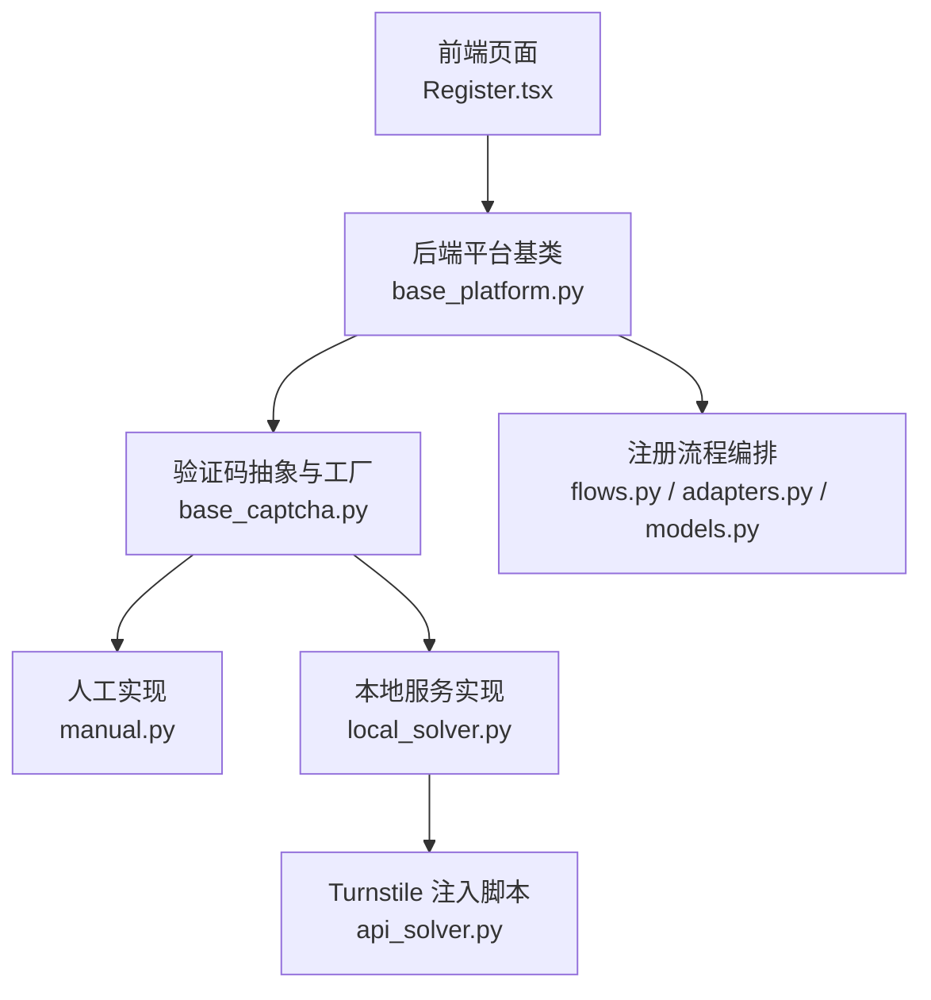
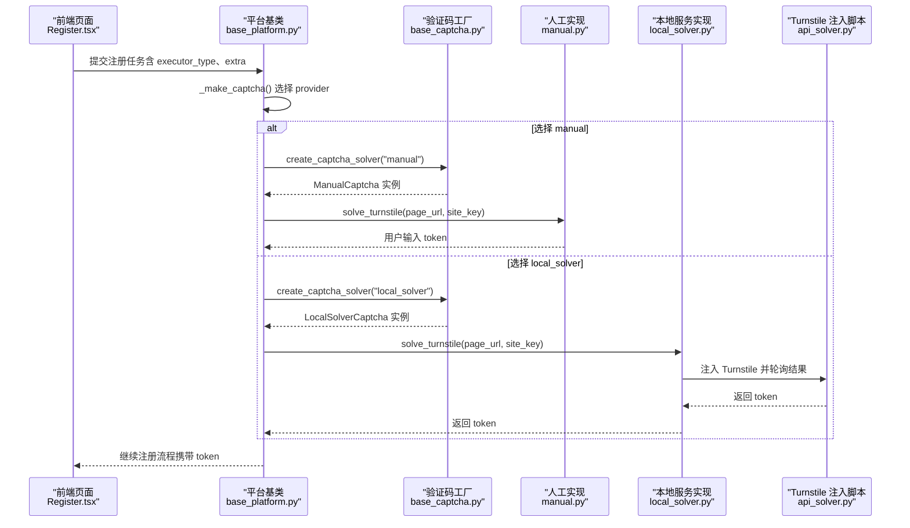
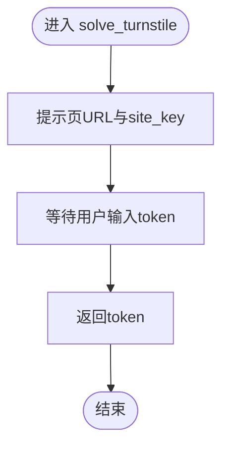
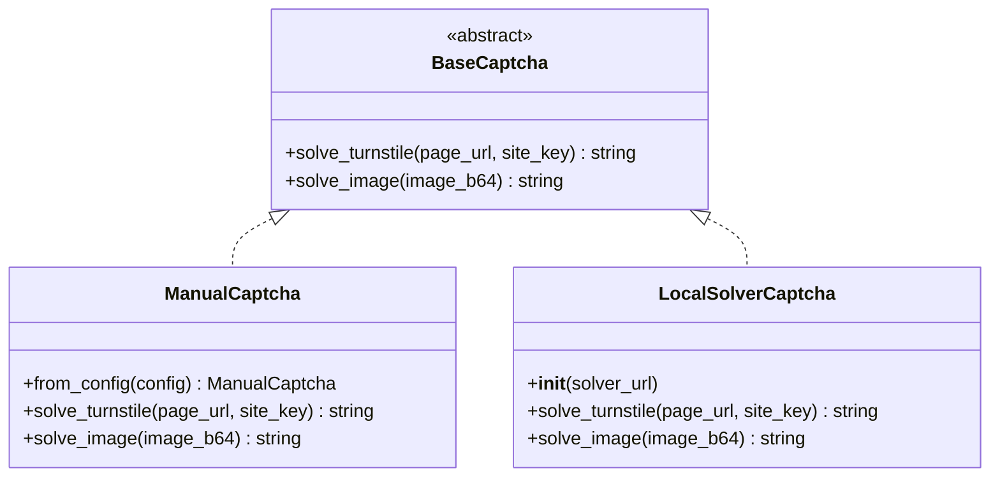
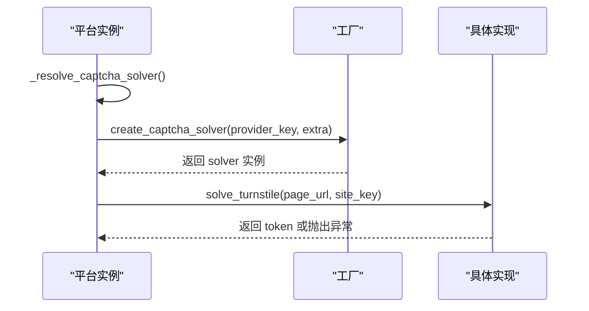
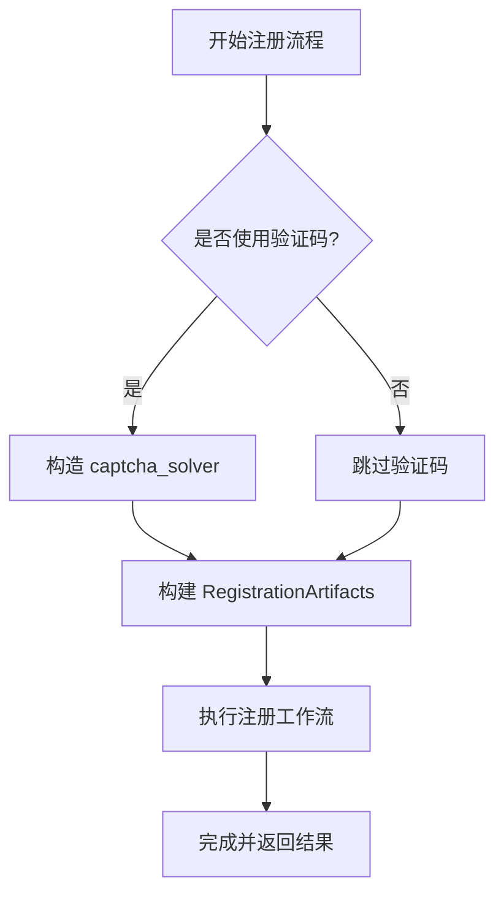
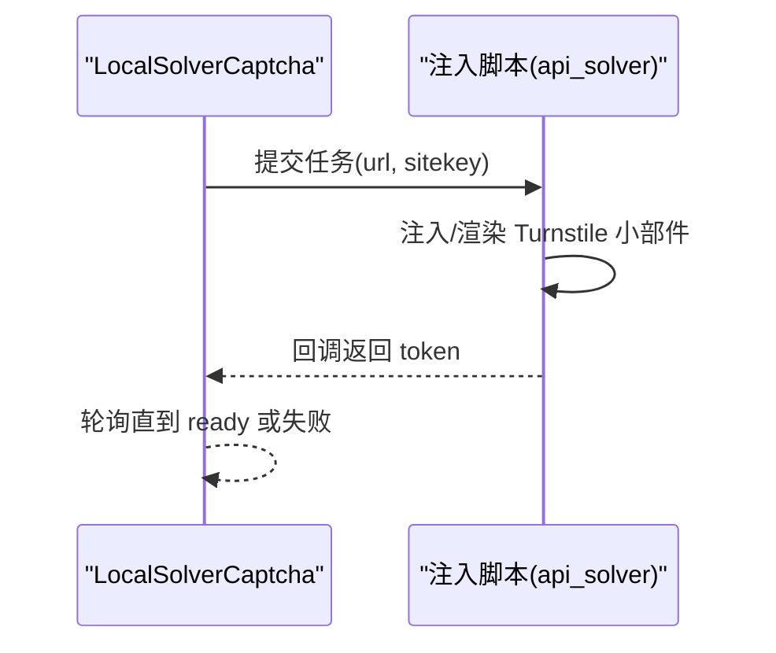
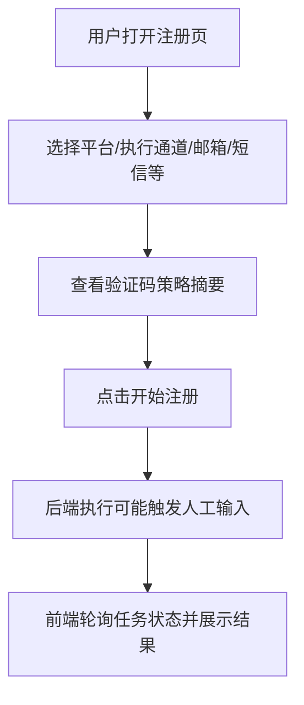
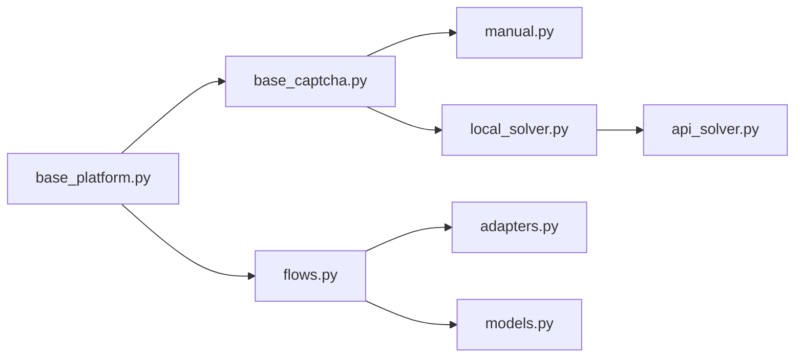

# 手动验证码解决

<cite>
**本文引用的文件**
- [providers/captcha/manual.py](file://providers/captcha/manual.py)
- [core/base_captcha.py](file://core/base_captcha.py)
- [core/base_platform.py](file://core/base_platform.py)
- [core/registration/flows.py](file://core/registration/flows.py)
- [core/registration/adapters.py](file://core/registration/adapters.py)
- [core/registration/models.py](file://core/registration/models.py)
- [services/turnstile_solver/api_solver.py](file://services/turnstile_solver/api_solver.py)
- [providers/captcha/local_solver.py](file://providers/captcha/local_solver.py)
- [frontend/src/pages/Register.tsx](file://frontend/src/pages/Register.tsx)
- [frontend/src/pages/Settings.tsx](file://frontend/src/pages/Settings.tsx)
</cite>

## 目录
1. [简介](#简介)
2. [项目结构](#项目结构)
3. [核心组件](#核心组件)
4. [架构总览](#架构总览)
5. [详细组件分析](#详细组件分析)
6. [依赖关系分析](#依赖关系分析)
7. [性能考虑](#性能考虑)
8. [故障排查指南](#故障排查指南)
9. [结论](#结论)
10. [附录](#附录)

## 简介
本文件围绕“手动验证码解决”的工作流程与用户交互机制展开，重点说明：
- 人工介入的触发条件与在自动化注册流程中的插入点
- 前端界面如何展示验证码信息、收集用户输入并回传后端
- 数据如何在任务执行过程中持久化并传递到后续注册步骤
- 用户体验优化建议与错误处理策略

该能力通过统一的验证码抽象接口接入多种实现（本地服务、第三方打码、以及“manual”人工模式），并在浏览器或协议注册流程中按需启用。

## 项目结构
与“手动验证码解决”直接相关的代码分布在以下位置：
- 验证码抽象与工厂：core/base_captcha.py
- 平台侧验证码选择与调用：core/base_platform.py
- 注册流程编排与产物注入：core/registration/flows.py, adapters.py, models.py
- 具体实现：providers/captcha/manual.py（人工）、providers/captcha/local_solver.py（本地服务）
- 前端配置与任务提交：frontend/src/pages/Settings.tsx, Register.tsx
- Turnstile 注入与回调（用于自动/本地解法）：services/turnstile_solver/api_solver.py

图表来源
- [core/base_platform.py:330-430](file://core/base_platform.py#L330-L430)
- [core/base_captcha.py:48-98](file://core/base_captcha.py#L48-L98)
- [providers/captcha/manual.py:1-18](file://providers/captcha/manual.py#L1-L18)
- [providers/captcha/local_solver.py:1-80](file://providers/captcha/local_solver.py#L1-L80)
- [services/turnstile_solver/api_solver.py:466-598](file://services/turnstile_solver/api_solver.py#L466-L598)
- [core/registration/flows.py:18-79](file://core/registration/flows.py#L18-L79)

章节来源
- [core/base_platform.py:330-430](file://core/base_platform.py#L330-L430)
- [core/base_captcha.py:48-98](file://core/base_captcha.py#L48-L98)
- [providers/captcha/manual.py:1-18](file://providers/captcha/manual.py#L1-L18)
- [providers/captcha/local_solver.py:1-80](file://providers/captcha/local_solver.py#L1-L80)
- [services/turnstile_solver/api_solver.py:466-598](file://services/turnstile_solver/api_solver.py#L466-L598)
- [core/registration/flows.py:18-79](file://core/registration/flows.py#L18-L79)

## 核心组件
- 验证码抽象与工厂
  - 定义统一接口 solve_turnstile/solve_image，并提供 create_captcha_solver 与 has_captcha_configured 等工具函数。
  - “manual” 被特殊识别为始终可用，便于在需要时强制走人工流程。
- 平台侧验证码调度
  - 根据 executor_type、默认 provider、已启用 provider 列表等策略选择具体实现；提供 solve_turnstile_with_fallback 进行多候选重试。
- 注册流程编排
  - 在 BrowserRegistrationFlow/ProtocolMailboxFlow 中，按适配器声明将 captcha_solver 注入到 RegistrationArtifacts，供后续浏览器/协议步骤使用。
- 人工实现
  - ManualCaptcha 阻塞等待用户输入，返回 token 或图片验证码文字。
- 本地服务实现
  - LocalSolverCaptcha 通过 HTTP 与本地 api_solver 服务交互，轮询获取 token。
- 前端
  - Settings.tsx 展示当前验证码策略；Register.tsx 负责创建任务并提交，包含验证码策略显示与任务状态面板。

章节来源
- [core/base_captcha.py:48-98](file://core/base_captcha.py#L48-L98)
- [core/base_platform.py:330-430](file://core/base_platform.py#L330-L430)
- [core/registration/flows.py:18-79](file://core/registration/flows.py#L18-L79)
- [core/registration/adapters.py:27-37](file://core/registration/adapters.py#L27-L37)
- [core/registration/models.py:44-54](file://core/registration/models.py#L44-L54)
- [providers/captcha/manual.py:1-18](file://providers/captcha/manual.py#L1-L18)
- [providers/captcha/local_solver.py:1-80](file://providers/captcha/local_solver.py#L1-L80)
- [frontend/src/pages/Settings.tsx:1164-1189](file://frontend/src/pages/Settings.tsx#L1164-L1189)
- [frontend/src/pages/Register.tsx:244-278](file://frontend/src/pages/Register.tsx#L244-L278)

## 架构总览
下图展示了从前端发起注册到验证码解决的端到端流程，包括人工介入与本地服务两种路径。

图表来源
- [core/base_platform.py:330-430](file://core/base_platform.py#L330-L430)
- [core/base_captcha.py:67-98](file://core/base_captcha.py#L67-L98)
- [providers/captcha/manual.py:10-18](file://providers/captcha/manual.py#L10-L18)
- [providers/captcha/local_solver.py:17-49](file://providers/captcha/local_solver.py#L17-L49)
- [services/turnstile_solver/api_solver.py:466-598](file://services/turnstile_solver/api_solver.py#L466-L598)

## 详细组件分析

### 人工验证码解决器（ManualCaptcha）
- 职责
  - 阻塞等待用户在控制台输入 Turnstile token 或图片验证码文字。
  - 作为“captcha” provider 的一种实现，可通过工厂方法创建。
- 关键行为
  - solve_turnstile：提示页 URL 与 site_key，等待用户输入 token。
  - solve_image：等待用户输入图片验证码文字。
- 适用场景
  - 调试、审计、或当自动/本地解法不可用时的人工兜底。

图表来源
- [providers/captcha/manual.py:14-18](file://providers/captcha/manual.py#L14-L18)

章节来源
- [providers/captcha/manual.py:1-18](file://providers/captcha/manual.py#L1-L18)

### 验证码抽象与工厂（BaseCaptcha + create_captcha_solver）
- 职责
  - 定义统一接口；提供创建与可用性检查逻辑。
  - “manual” 被视为已配置，便于无条件启用。
- 关键点
  - has_captcha_configured：对 key="manual" 直接返回 True。
  - create_captcha_solver：根据 key 返回对应实现；支持 local_solver/yescaptcha/twocaptcha。

图表来源
- [core/base_captcha.py:5-14](file://core/base_captcha.py#L5-L14)
- [providers/captcha/manual.py:6-18](file://providers/captcha/manual.py#L6-L18)
- [providers/captcha/local_solver.py:6-52](file://providers/captcha/local_solver.py#L6-L52)

章节来源
- [core/base_captcha.py:5-14](file://core/base_captcha.py#L5-L14)
- [core/base_captcha.py:48-98](file://core/base_captcha.py#L48-L98)

### 平台侧验证码选择与调用（base_platform）
- 职责
  - 根据 executor_type、默认 provider、已启用 provider 列表选择具体实现。
  - 提供 solve_turnstile_with_fallback 尝试多个候选 provider 并汇总错误。
- 关键点
  - _make_captcha：解析 provider_key，准备本地 solver（如 local_solver），并创建实例。
  - _get_captcha_solver_candidates：优先使用显式请求或默认 provider，否则枚举已启用的 captcha providers。
  - _prepare_captcha_provider：若 driver_type 为 local_solver，启动本地服务。

图表来源
- [core/base_platform.py:330-430](file://core/base_platform.py#L330-L430)
- [core/base_captcha.py:67-98](file://core/base_captcha.py#L67-L98)

章节来源
- [core/base_platform.py:330-430](file://core/base_platform.py#L330-L430)

### 注册流程中的验证码注入（flows/adapters/models）
- 职责
  - 在浏览器/协议注册流程中，按适配器声明将 captcha_solver 注入到 RegistrationArtifacts。
  - 同时注入 OTP/链接/电话回调，形成完整的注册产物。
- 关键点
  - BrowserRegistrationFlow：当 use_captcha_for_mailbox 为真且身份为 mailbox 时，构造 captcha_solver。
  - ProtocolMailboxFlow：当 use_captcha 为真时，构造 captcha_solver。
  - RegistrationArtifacts：保存 captcha_solver 供后续步骤使用。

图表来源
- [core/registration/flows.py:18-79](file://core/registration/flows.py#L18-L79)
- [core/registration/adapters.py:27-37](file://core/registration/adapters.py#L27-L37)
- [core/registration/models.py:44-54](file://core/registration/models.py#L44-L54)

章节来源
- [core/registration/flows.py:18-79](file://core/registration/flows.py#L18-L79)
- [core/registration/adapters.py:27-37](file://core/registration/adapters.py#L27-L37)
- [core/registration/models.py:44-54](file://core/registration/models.py#L44-L54)

### Turnstile 注入与回调（api_solver）
- 职责
  - 在目标页面注入 Turnstile 小部件，监听 callback 并将 token 回传给上层。
  - 兼容已有 widget 或 iframe，清理不匹配项后渲染新 widget。
- 关键点
  - 动态加载 turnstile.js，render 指定 sitekey/action/cdata。
  - 通过 window._turnstileTokenCallback 将 token 传出。

图表来源
- [services/turnstile_solver/api_solver.py:466-598](file://services/turnstile_solver/api_solver.py#L466-L598)
- [providers/captcha/local_solver.py:17-49](file://providers/captcha/local_solver.py#L17-L49)

章节来源
- [services/turnstile_solver/api_solver.py:466-598](file://services/turnstile_solver/api_solver.py#L466-L598)
- [providers/captcha/local_solver.py:17-49](file://providers/captcha/local_solver.py#L17-L49)

### 前端界面与用户交互（Register.tsx / Settings.tsx）
- 职责
  - 展示当前验证码策略（protocol/headless 策略标签）。
  - 提交注册任务，附带 executor_type、extra 等上下文。
  - 展示任务状态、日志与错误信息。
- 关键点
  - Settings.tsx：渲染“当前策略”，帮助确认是否启用 manual 或其他 provider。
  - Register.tsx：构建表单、提交任务、轮询任务状态、展示错误与成功结果。

图表来源
- [frontend/src/pages/Settings.tsx:1164-1189](file://frontend/src/pages/Settings.tsx#L1164-L1189)
- [frontend/src/pages/Register.tsx:244-278](file://frontend/src/pages/Register.tsx#L244-L278)

章节来源
- [frontend/src/pages/Settings.tsx:1164-1189](file://frontend/src/pages/Settings.tsx#L1164-L1189)
- [frontend/src/pages/Register.tsx:244-278](file://frontend/src/pages/Register.tsx#L244-L278)

## 依赖关系分析
- 模块耦合
  - base_platform 依赖 base_captcha 工厂与 provider 设置仓库，决定使用哪种验证码实现。
  - flows 依赖 adapters 与 models，将 captcha_solver 注入到 artifacts，供平台注册步骤消费。
  - local_solver 依赖外部 api_solver 服务，通过 HTTP 轮询获取 token。
  - manual 无外部依赖，仅阻塞等待输入。
- 外部集成点
  - Turnstile 脚本与服务端校验由 api_solver 注入与处理。
  - 第三方打码服务（如 2Captcha/YesCaptcha）通过各自实现接入。

图表来源
- [core/base_platform.py:330-430](file://core/base_platform.py#L330-L430)
- [core/base_captcha.py:48-98](file://core/base_captcha.py#L48-L98)
- [providers/captcha/manual.py:1-18](file://providers/captcha/manual.py#L1-L18)
- [providers/captcha/local_solver.py:1-80](file://providers/captcha/local_solver.py#L1-L80)
- [services/turnstile_solver/api_solver.py:466-598](file://services/turnstile_solver/api_solver.py#L466-L598)
- [core/registration/flows.py:18-79](file://core/registration/flows.py#L18-L79)
- [core/registration/adapters.py:27-37](file://core/registration/adapters.py#L27-L37)
- [core/registration/models.py:44-54](file://core/registration/models.py#L44-L54)

章节来源
- [core/base_platform.py:330-430](file://core/base_platform.py#L330-L430)
- [core/base_captcha.py:48-98](file://core/base_captcha.py#L48-L98)
- [providers/captcha/manual.py:1-18](file://providers/captcha/manual.py#L1-L18)
- [providers/captcha/local_solver.py:1-80](file://providers/captcha/local_solver.py#L1-L80)
- [services/turnstile_solver/api_solver.py:466-598](file://services/turnstile_solver/api_solver.py#L466-L598)
- [core/registration/flows.py:18-79](file://core/registration/flows.py#L18-L79)
- [core/registration/adapters.py:27-37](file://core/registration/adapters.py#L27-L37)
- [core/registration/models.py:44-54](file://core/registration/models.py#L44-L54)

## 性能考虑
- 人工模式
  - 阻塞式输入会暂停自动化流程，适合调试或小批量场景；不适合高并发。
- 本地服务
  - 存在启动与轮询开销；需确保本地服务可用且端口未被占用。
- 多候选重试
  - solve_turnstile_with_fallback 会依次尝试多个 provider，增加总体耗时但提高成功率。
- 前端轮询
  - 任务状态每 5 秒轮询一次，避免频繁请求；在页面不可见时暂停轮询以节省资源。

[本节为通用指导，无需特定文件引用]

## 故障排查指南
- 未配置验证码 provider
  - 现象：浏览器模式未配置默认 provider 或协议模式未配置可用 provider。
  - 处理：在设置页启用并设为默认，或在任务 extra 中指定 captcha_solver。
- 人工输入为空或无效
  - 现象：返回空 token 或无效字符串。
  - 处理：确保在控制台正确粘贴完整 token；必要时重试。
- 本地服务不可用
  - 现象：连接超时或未返回 taskId。
  - 处理：检查本地服务是否启动、端口是否冲突；必要时重启服务。
- Turnstile 注入失败
  - 现象：脚本加载失败或无法渲染 widget。
  - 处理：检查网络是否能访问 turnstile 脚本地址；确认 sitekey 与 action/cdata 是否正确。
- 任务中断或取消
  - 现象：任务状态为 interrupted/cancelled。
  - 处理：检查服务生命周期与任务队列；重新提交任务。

章节来源
- [core/base_platform.py:345-352](file://core/base_platform.py#L345-L352)
- [providers/captcha/local_solver.py:17-49](file://providers/captcha/local_solver.py#L17-L49)
- [services/turnstile_solver/api_solver.py:1020-1033](file://services/turnstile_solver/api_solver.py#L1020-L1033)
- [frontend/src/pages/Register.tsx:294-316](file://frontend/src/pages/Register.tsx#L294-L316)

## 结论
“手动验证码解决”通过统一的验证码抽象与灵活的 provider 选择机制，能够在自动化注册流程中无缝插入人工验证环节。结合前端的策略展示与任务状态反馈，用户可清晰感知验证码类型与执行进度。对于生产环境，建议优先使用本地服务或第三方打码；在调试或合规要求下，可使用 manual 模式进行人工介入。

[本节为总结性内容，无需特定文件引用]

## 附录
- 用户界面设计要点
  - 验证码策略展示：在设置页明确显示当前策略，帮助用户理解即将使用的验证码方式。
  - 任务状态与日志：在注册页集中展示任务状态、进度、错误信息与实时日志，便于定位问题。
  - 输入引导：在人工模式下，控制台提示应包含页 URL 与 site_key，减少用户困惑。
- 数据持久化与传递
  - 验证码 token 通过 RegistrationArtifacts 在注册流程中传递至后续步骤，确保后续注册能正确使用。
  - 任务完成后，前端通过任务 ID 轮询最终状态，保证结果一致性。
- 错误处理策略
  - 多候选重试：优先尝试配置的 provider，失败则回退到其他候选。
  - 明确错误消息：区分网络错误、服务不可用、验证码失败等，便于快速定位。

[本节为补充说明，无需特定文件引用]