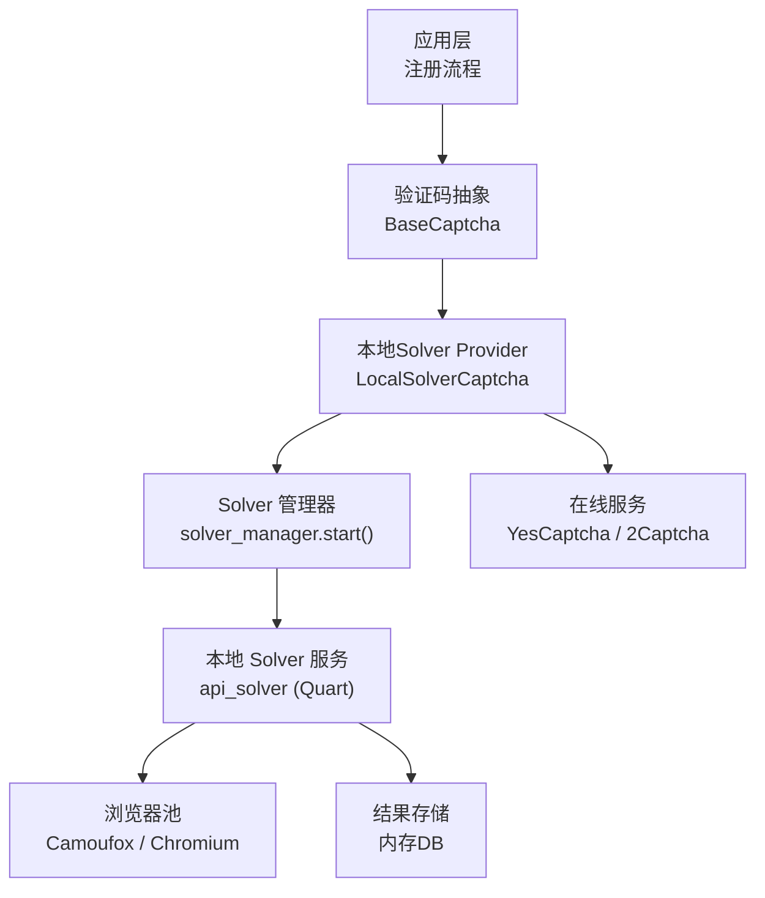
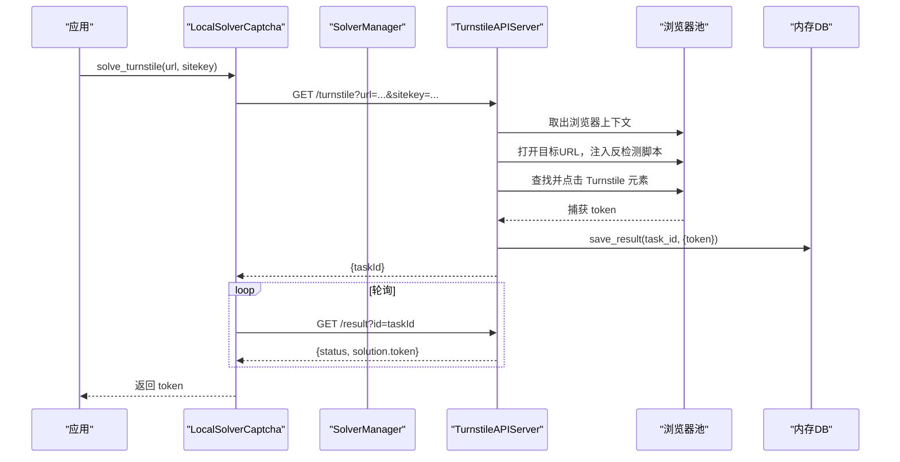
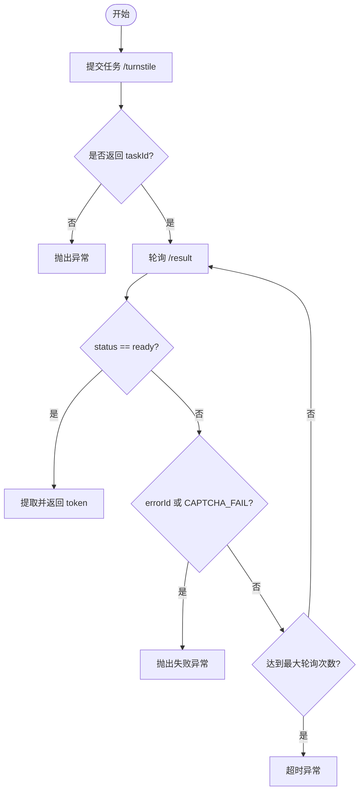
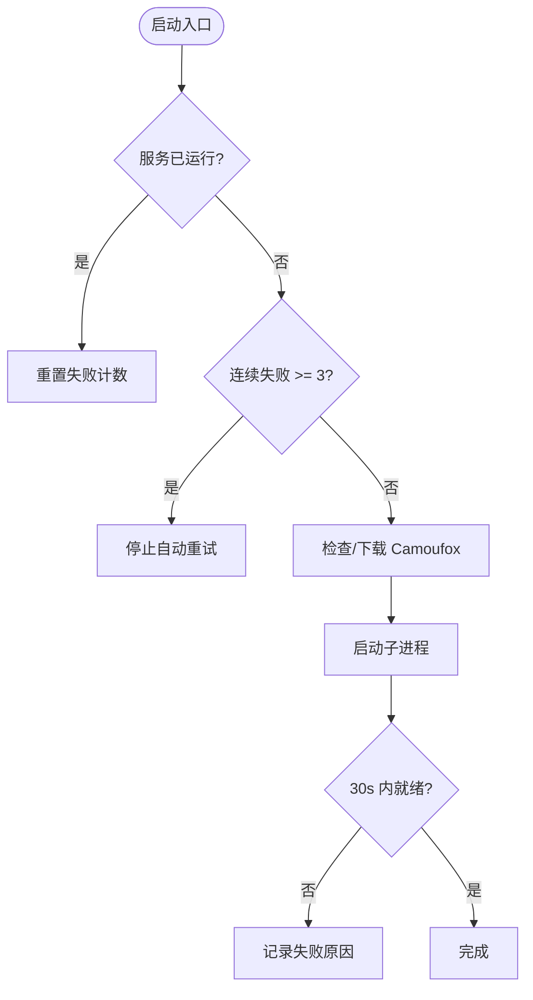
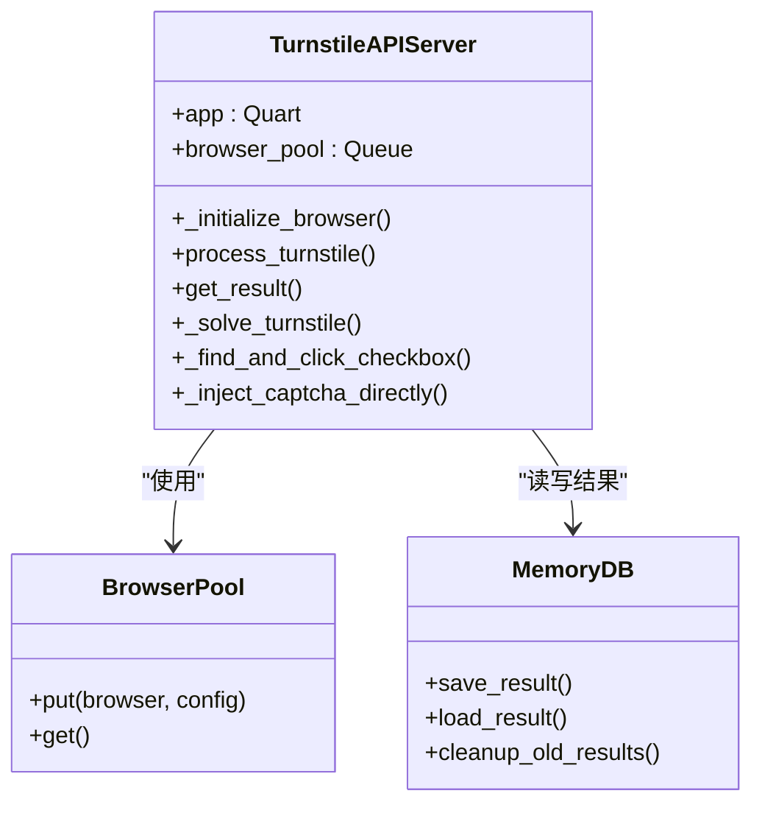
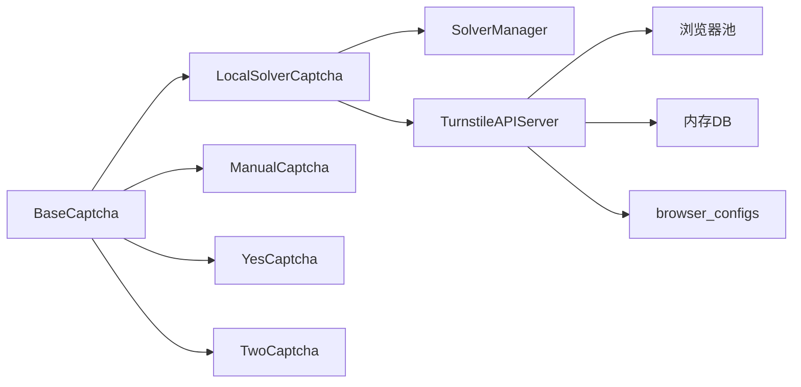

# 本地验证码解决器

<cite>
**本文引用的文件**
- [providers/captcha/local_solver.py](file://providers/captcha/local_solver.py)
- [core/base_captcha.py](file://core/base_captcha.py)
- [services/solver_manager.py](file://services/solver_manager.py)
- [services/turnstile_solver/start.py](file://services/turnstile_solver/start.py)
- [services/turnstile_solver/api_solver.py](file://services/turnstile_solver/api_solver.py)
- [services/turnstile_solver/db_results.py](file://services/turnstile_solver/db_results.py)
- [services/turnstile_solver/browser_configs.py](file://services/turnstile_solver/browser_configs.py)
- [providers/captcha/manual.py](file://providers/captcha/manual.py)
- [providers/captcha/yescaptcha.py](file://providers/captcha/yescaptcha.py)
- [providers/captcha/twocaptcha.py](file://providers/captcha/twocaptcha.py)
- [README.md](file://README.md)
</cite>

## 目录
1. [简介](#简介)
2. [项目结构](#项目结构)
3. [核心组件](#核心组件)
4. [架构总览](#架构总览)
5. [详细组件分析](#详细组件分析)
6. [依赖关系分析](#依赖关系分析)
7. [性能与并发](#性能与并发)
8. [配置指南](#配置指南)
9. [测试与评估](#测试与评估)
10. [故障排查](#故障排查)
11. [结论](#结论)

## 简介
本仓库实现了一个“本地 Turnstile 验证码解决器”，通过启动独立的浏览器自动化服务（Camoufox/Chromium），在目标网页中自动完成 Turnstile 人机验证并返回 token。该本地解决器与在线验证码服务（YesCaptcha、2Captcha）形成互补：本地方案强调隐私可控、无外部依赖；在线方案强调高成功率与免维护。

## 项目结构
围绕本地验证码解决器的关键目录与职责如下：
- providers/captcha：验证码 Provider 插件，包含本地 Solver、人工打码、以及 YesCaptcha/2Captcha 的远程对接
- core/base_captcha：统一抽象接口，定义 solve_turnstile/solve_image
- services/solver_manager：主进程内管理本地 solver 子进程的启停、健康检查、失败重试保护
- services/turnstile_solver：本地 solver 服务（Quart API + 浏览器池 + 结果存储）
- README：部署与使用说明

图表来源
- [core/base_captcha.py:5-14](file://core/base_captcha.py#L5-L14)
- [providers/captcha/local_solver.py:6-49](file://providers/captcha/local_solver.py#L6-L49)
- [services/solver_manager.py:73-155](file://services/solver_manager.py#L73-L155)
- [services/turnstile_solver/api_solver.py:135-156](file://services/turnstile_solver/api_solver.py#L135-L156)
- [services/turnstile_solver/db_results.py:4-27](file://services/turnstile_solver/db_results.py#L4-L27)

章节来源
- [README.md:181-208](file://README.md#L181-L208)

## 核心组件
- BaseCaptcha：统一接口，定义 solve_turnstile/page_url, site_key -> token 和 solve_image(image_b64) -> text
- LocalSolverCaptcha：调用本地 solver 服务（/turnstile 提交任务，/result 轮询结果）
- SolverManager：负责启动/停止/重启本地 solver 子进程，检测 Camoufox 二进制可用性，限制连续失败重试
- api_solver：本地 solver 服务，提供 HTTP 接口，维护浏览器池，执行 Turnstile 求解流程，持久化结果
- db_results：内存数据库，保存任务结果并定期清理
- browser_configs：随机或指定 UA/Sec-CH-UA 等指纹配置

章节来源
- [core/base_captcha.py:5-14](file://core/base_captcha.py#L5-L14)
- [providers/captcha/local_solver.py:6-49](file://providers/captcha/local_solver.py#L6-L49)
- [services/solver_manager.py:21-155](file://services/solver_manager.py#L21-L155)
- [services/turnstile_solver/api_solver.py:62-156](file://services/turnstile_solver/api_solver.py#L62-L156)
- [services/turnstile_solver/db_results.py:4-27](file://services/turnstile_solver/db_results.py#L4-L27)
- [services/turnstile_solver/browser_configs.py:3-25](file://services/turnstile_solver/browser_configs.py#L3-L25)

## 架构总览
本地验证码解决器采用“进程隔离 + 浏览器池”的架构：
- 主进程通过 solver_manager 拉起独立的 solver 子进程（端口默认 8889）
- 子进程基于 Quart 暴露 REST 接口，内部维护浏览器池（Camoufox/Chromium）
- 请求进入后，选择浏览器上下文，加载目标页面，注入反检测脚本，定位并触发 Turnstile，等待 token 回调
- 结果写入内存 DB，主进程通过轮询获取 token

图表来源
- [providers/captcha/local_solver.py:17-49](file://providers/captcha/local_solver.py#L17-L49)
- [services/turnstile_solver/api_solver.py:135-156](file://services/turnstile_solver/api_solver.py#L135-L156)
- [services/turnstile_solver/db_results.py:10-16](file://services/turnstile_solver/db_results.py#L10-L16)

## 详细组件分析

### 本地 Solver Provider（LocalSolverCaptcha）
- 职责：封装对本地 solver 服务的调用，提交任务并轮询结果
- 关键点：
  - 使用 requests 调用 /turnstile 提交任务，获取 taskId
  - 循环轮询 /result，直到 status=ready 且存在 token，或出现错误状态
  - 提供 start_solver 静态方法用于后台启动本地 solver 服务（可选）

图表来源
- [providers/captcha/local_solver.py:17-49](file://providers/captcha/local_solver.py#L17-L49)

章节来源
- [providers/captcha/local_solver.py:6-79](file://providers/captcha/local_solver.py#L6-L79)

### Solver 进程管理器（SolverManager）
- 职责：在主进程中管理本地 solver 子进程的生命周期与健康检查
- 关键点：
  - is_running：通过访问根路径判断服务是否就绪
  - start：确保 Camoufox 可用，以子进程方式启动 solver，等待就绪，记录失败原因
  - stop/restart：安全终止子进程，必要时按端口杀残留进程
  - 连续失败保护：避免无限重试，超过阈值停止自动重启

图表来源
- [services/solver_manager.py:21-155](file://services/solver_manager.py#L21-L155)

章节来源
- [services/solver_manager.py:21-229](file://services/solver_manager.py#L21-L229)

### 本地 Solver 服务（TurnstileAPIServer）
- 职责：提供 /turnstile 与 /result 接口，管理浏览器池，执行 Turnstile 求解
- 关键点：
  - 初始化时根据配置创建浏览器池（Camoufox 或 Chromium/Chrome/Edge）
  - 路由：/turnstile 接收任务，/result 查询结果，/ 健康检查
  - 页面处理：注入反检测脚本、拦截无关资源、智能定位 Turnstile 元素并触发
  - 代理支持：从 proxies.txt 读取代理，动态创建上下文
  - 结果存储：内存 DB 保存任务结果，定时清理旧数据

图表来源
- [services/turnstile_solver/api_solver.py:62-156](file://services/turnstile_solver/api_solver.py#L62-L156)
- [services/turnstile_solver/db_results.py:4-27](file://services/turnstile_solver/db_results.py#L4-L27)

章节来源
- [services/turnstile_solver/api_solver.py:62-800](file://services/turnstile_solver/api_solver.py#L62-L800)
- [services/turnstile_solver/db_results.py:4-27](file://services/turnstile_solver/db_results.py#L4-L27)

### 其他验证码 Provider（对比参考）
- ManualCaptcha：阻塞等待用户输入 token 或图片验证码文字
- YesCaptcha：远程 Turnstile 服务，创建任务并轮询结果
- TwoCaptcha：远程 Turnstile 服务，创建任务并轮询结果

章节来源
- [providers/captcha/manual.py:6-18](file://providers/captcha/manual.py#L6-L18)
- [providers/captcha/yescaptcha.py:7-42](file://providers/captcha/yescaptcha.py#L7-L42)
- [providers/captcha/twocaptcha.py:6-63](file://providers/captcha/twocaptcha.py#L6-L63)

## 依赖关系分析
- 本地 Solver 与在线服务均实现 BaseCaptcha 接口，便于统一调度
- LocalSolverCaptcha 依赖 solver_manager 启动本地服务，并通过 HTTP 与 api_solver 通信
- api_solver 依赖 Camoufox/Playwright 进行浏览器自动化，db_results 提供临时结果存储
- 浏览器指纹由 browser_configs 生成，可随机或固定 UA/Sec-CH-UA

图表来源
- [core/base_captcha.py:5-14](file://core/base_captcha.py#L5-L14)
- [providers/captcha/local_solver.py:6-49](file://providers/captcha/local_solver.py#L6-L49)
- [services/solver_manager.py:73-155](file://services/solver_manager.py#L73-L155)
- [services/turnstile_solver/api_solver.py:135-156](file://services/turnstile_solver/api_solver.py#L135-L156)
- [services/turnstile_solver/browser_configs.py:3-25](file://services/turnstile_solver/browser_configs.py#L3-L25)

章节来源
- [core/base_captcha.py:5-98](file://core/base_captcha.py#L5-L98)
- [providers/captcha/local_solver.py:6-79](file://providers/captcha/local_solver.py#L6-L79)
- [services/solver_manager.py:21-229](file://services/solver_manager.py#L21-L229)
- [services/turnstile_solver/api_solver.py:62-800](file://services/turnstile_solver/api_solver.py#L62-L800)
- [services/turnstile_solver/browser_configs.py:3-25](file://services/turnstile_solver/browser_configs.py#L3-L25)

## 性能与并发
- 浏览器池：api_solver 启动时按 thread_count 创建多个浏览器实例，提高并发处理能力
- 资源优化：
  - 拦截非必要资源（媒体、字体、统计脚本等），减少带宽与渲染开销
  - 设置固定视口尺寸，降低布局抖动
  - 注入反检测脚本，隐藏 webdriver 特征
- 内存管理：
  - 结果存储在内存字典中，每小时清理 7 天前的旧结果，防止内存泄漏
- 进程管理：
  - solver_manager 限制连续失败重试次数，避免雪崩
  - 支持按端口清理残留进程，保证服务稳定

章节来源
- [services/turnstile_solver/api_solver.py:158-241](file://services/turnstile_solver/api_solver.py#L158-L241)
- [services/turnstile_solver/api_solver.py:269-310](file://services/turnstile_solver/api_solver.py#L269-L310)
- [services/turnstile_solver/db_results.py:18-27](file://services/turnstile_solver/db_results.py#L18-L27)
- [services/solver_manager.py:15-18](file://services/solver_manager.py#L15-L18)
- [services/solver_manager.py:185-208](file://services/solver_manager.py#L185-L208)

## 配置指南
- 依赖安装与环境准备
  - Python 3.11+，Node.js 18+（前端构建）
  - 安装 Playwright 与 Camoufox：python3 -m playwright install chromium；python3 -m camoufox fetch
  - 安装后端依赖：pip install -r requirements.txt
- 启动方式
  - Docker：映射 8000（Web UI）、6080（noVNC）、8889（Solver）
  - 源码：uvicorn main:app --port 8000
- 验证码服务选择
  - 本地 Solver：需先执行 Camoufox fetch，并在“全局配置”页重启 Solver
  - 在线服务：YesCaptcha/2Captcha，填写对应 Key
- 代理配置
  - 可在 solver 工作目录下放置 proxies.txt，每行一个代理地址，支持多种格式
- 浏览器指纹
  - 可通过 browser_configs 随机或固定 UA/Sec-CH-UA，提升通过率

章节来源
- [README.md:157-179](file://README.md#L157-L179)
- [README.md:201-208](file://README.md#L201-L208)
- [services/turnstile_solver/api_solver.py:641-744](file://services/turnstile_solver/api_solver.py#L641-L744)
- [services/turnstile_solver/browser_configs.py:3-25](file://services/turnstile_solver/browser_configs.py#L3-L25)

## 测试与评估
- 功能测试
  - 启动本地 solver，访问 http://localhost:8889/ 确认健康检查通过
  - 调用 /turnstile 提交任务，轮询 /result 获取 token
  - 验证不同 sitekey 与 pageurl 组合下的成功率
- 效果评估标准
  - 成功率：成功返回 token 的任务占比
  - 耗时：从提交到返回 token 的平均时间
  - 稳定性：连续失败次数与恢复能力
  - 资源占用：CPU/内存/网络带宽
- 回归测试
  - 切换浏览器类型（camoufox/chromium）
  - 启用/禁用代理
  - 模拟网络异常与页面结构变化

章节来源
- [services/turnstile_solver/api_solver.py:135-156](file://services/turnstile_solver/api_solver.py#L135-L156)
- [providers/captcha/local_solver.py:17-49](file://providers/captcha/local_solver.py#L17-L49)

## 故障排查
- Solver 启动超时
  - 首次启动可能需下载 Camoufox，耐心等待
  - 检查 8889 端口是否被占用
  - 如不依赖本地 solver，可改用 YesCaptcha/2Captcha
- 验证码失败
  - 检查代理 IP 质量，优先使用住宅代理
  - 降低并发数，避免同一 IP 短时间大量请求
  - 协议模式下优先使用远程验证码服务
- 进程残留
  - 使用 stop/restart 接口清理残留进程
  - 必要时按端口杀进程

章节来源
- [README.md:388-419](file://README.md#L388-L419)
- [services/solver_manager.py:158-208](file://services/solver_manager.py#L158-L208)

## 结论
本地验证码解决器通过进程隔离与浏览器池技术，实现了高效、可控的 Turnstile 自动解算。相比在线服务，本地方案具备隐私优势与低延迟特性，适合对数据敏感与高并发场景。结合合理的代理策略与指纹配置，可显著提升成功率与稳定性。对于需要更高成功率或免维护的场景，可搭配 YesCaptcha/2Captcha 作为补充。