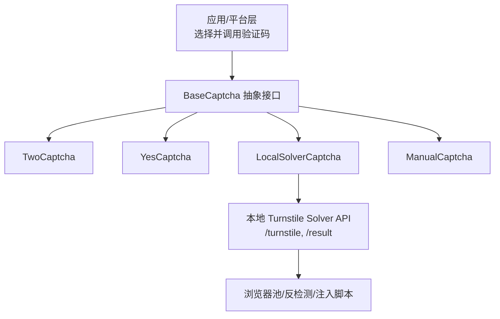
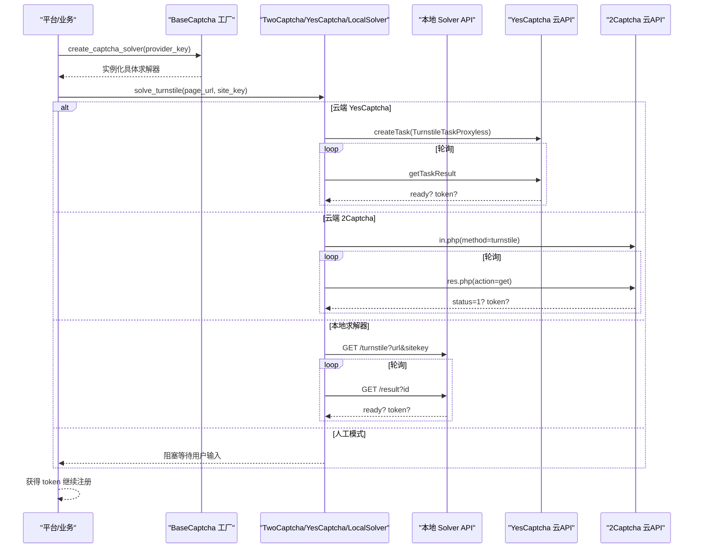
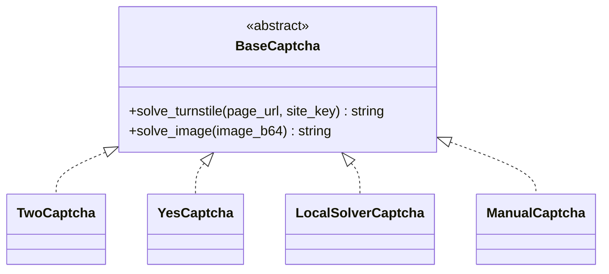
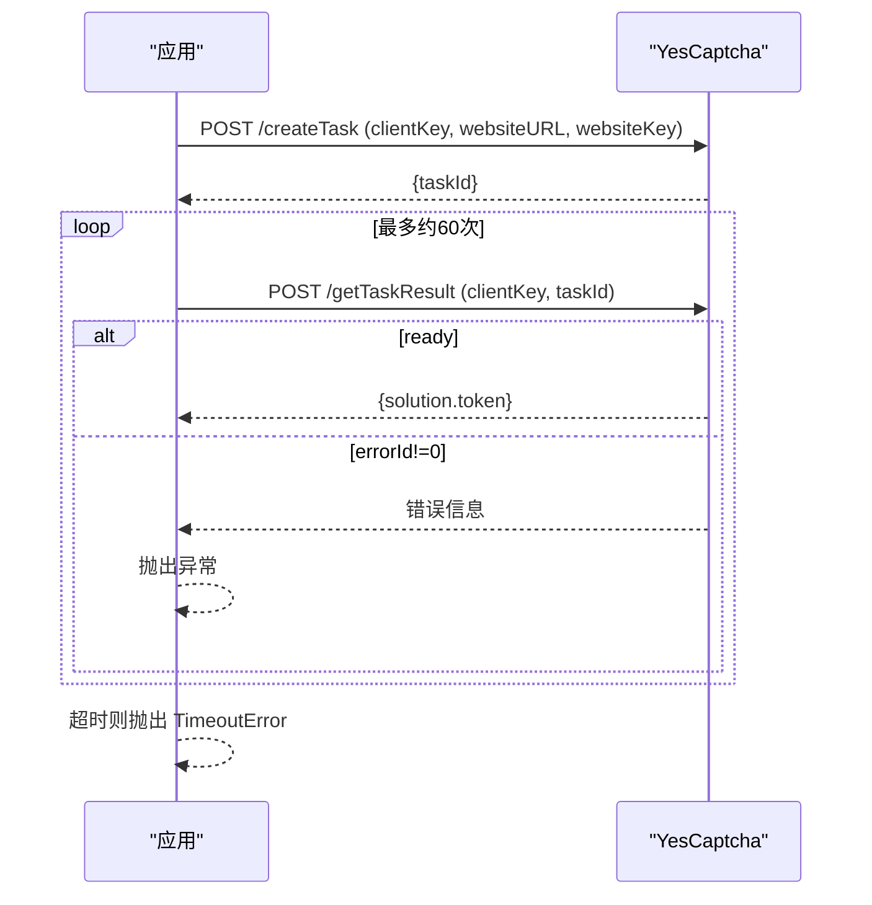
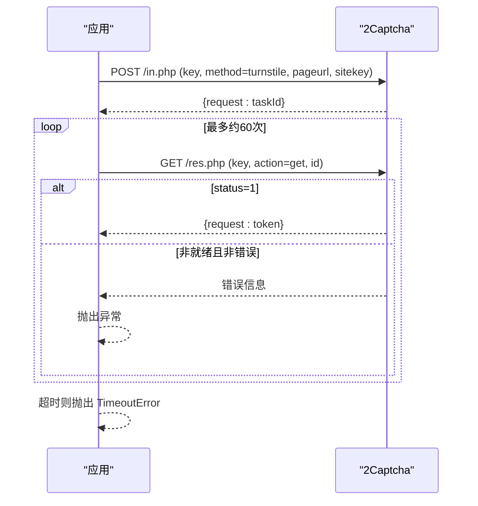
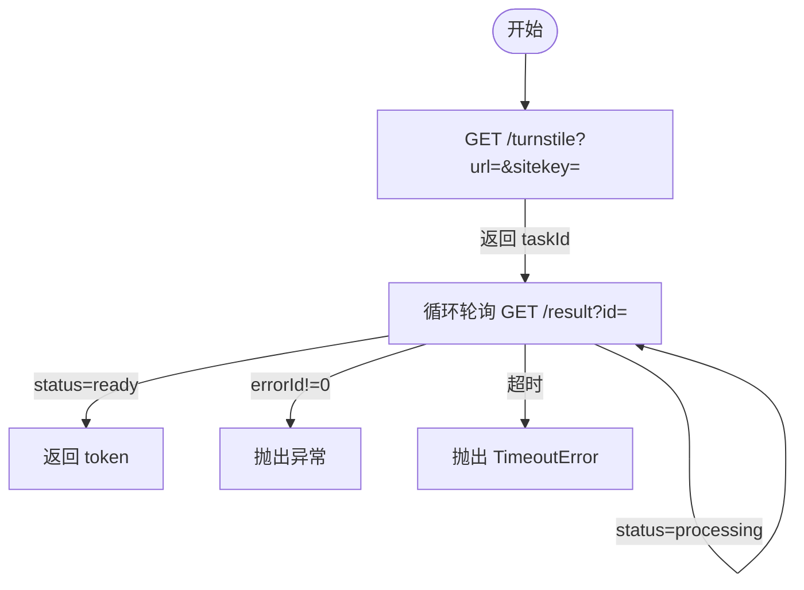
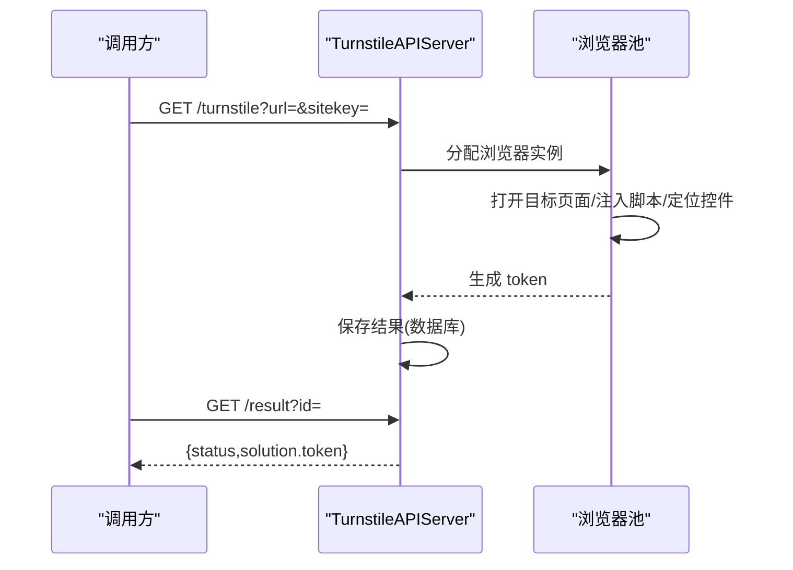
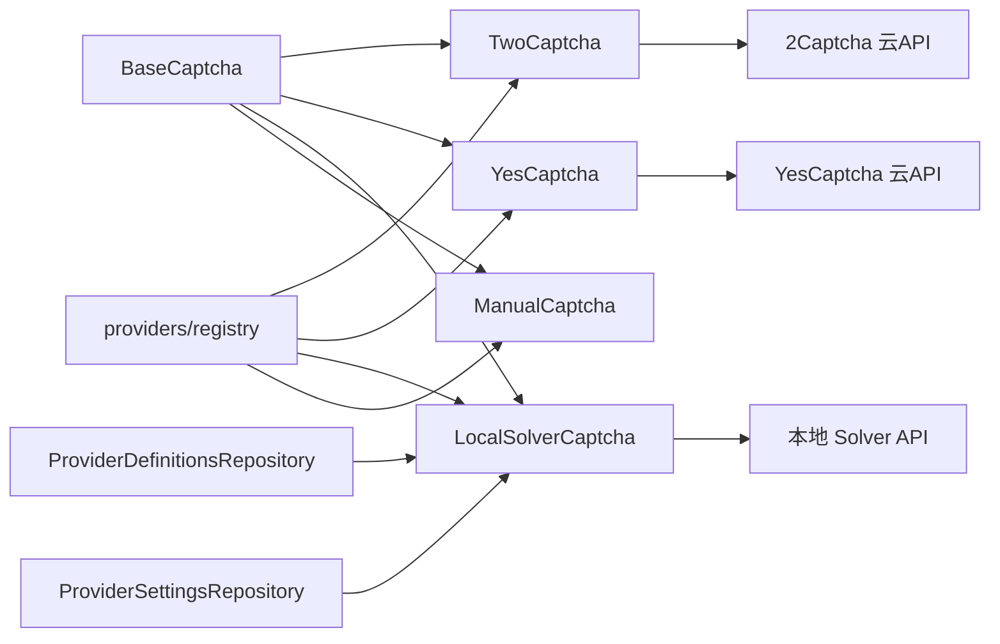

# 验证码解决服务

<cite>
**本文引用的文件**
- [core/base_captcha.py](file://core/base_captcha.py)
- [providers/captcha/local_solver.py](file://providers/captcha/local_solver.py)
- [providers/captcha/manual.py](file://providers/captcha/manual.py)
- [providers/captcha/twocaptcha.py](file://providers/captcha/twocaptcha.py)
- [providers/captcha/yescaptcha.py](file://providers/captcha/yescaptcha.py)
- [services/turnstile_solver/api_solver.py](file://services/turnstile_solver/api_solver.py)
- [services/turnstile_solver/start.py](file://services/turnstile_solver/start.py)
- [infrastructure/provider_definitions_repository.py](file://infrastructure/provider_definitions_repository.py)
- [infrastructure/provider_settings_repository.py](file://infrastructure/provider_settings_repository.py)
- [providers/registry.py](file://providers/registry.py)
- [application/config.py](file://application/config.py)
- [frontend/src/lib/config-options.ts](file://frontend/src/lib/config-options.ts)
- [frontend/src/pages/Settings.tsx](file://frontend/src/pages/Settings.tsx)
</cite>

## 目录
1. [简介](#简介)
2. [项目结构](#项目结构)
3. [核心组件](#核心组件)
4. [架构总览](#架构总览)
5. [详细组件分析](#详细组件分析)
6. [依赖关系分析](#依赖关系分析)
7. [性能与容错](#性能与容错)
8. [故障排查指南](#故障排查指南)
9. [结论](#结论)
10. [附录：配置与集成清单](#附录配置与集成清单)

## 简介
本仓库提供统一的验证码解决能力，支持三类实现：
- 云端服务：YesCaptcha、2Captcha（Turnstile 令牌求解）
- 本地服务：基于 Camoufox/Patchright 的本地 Turnstile 求解器（通过 HTTP API 调用）
- 人工打码：阻塞等待用户输入

系统通过“提供者定义 + 运行时设置”的方式管理各验证码服务的配置，并在注册流程中按策略顺序尝试不同求解器，具备超时重试、错误回退等容错机制。

## 项目结构
验证码相关代码主要分布在以下位置：
- 抽象接口与工厂：core/base_captcha.py
- 具体实现：providers/captcha/*（local_solver、manual、twocaptcha、yescaptcha）
- 本地求解器服务：services/turnstile_solver/*（api_solver、start）
- 提供者元数据与设置：infrastructure/provider_definitions_repository.py、provider_settings_repository.py
- 前端配置展示：frontend/src/lib/config-options.ts、frontend/src/pages/Settings.tsx
- 应用层选项聚合：application/config.py

图表来源
- [core/base_captcha.py:5-14](file://core/base_captcha.py#L5-L14)
- [providers/captcha/twocaptcha.py:19-60](file://providers/captcha/twocaptcha.py#L19-L60)
- [providers/captcha/yescaptcha.py:20-39](file://providers/captcha/yescaptcha.py#L20-L39)
- [providers/captcha/local_solver.py:17-49](file://providers/captcha/local_solver.py#L17-L49)
- [services/turnstile_solver/api_solver.py:950-1033](file://services/turnstile_solver/api_solver.py#L950-L1033)

章节来源
- [core/base_captcha.py:5-14](file://core/base_captcha.py#L5-L14)
- [providers/captcha/local_solver.py:1-80](file://providers/captcha/local_solver.py#L1-L80)
- [providers/captcha/manual.py:1-19](file://providers/captcha/manual.py#L1-L19)
- [providers/captcha/twocaptcha.py:1-64](file://providers/captcha/twocaptcha.py#L1-L64)
- [providers/captcha/yescaptcha.py:1-43](file://providers/captcha/yescaptcha.py#L1-L43)
- [services/turnstile_solver/api_solver.py:950-1033](file://services/turnstile_solver/api_solver.py#L950-L1033)

## 核心组件
- BaseCaptcha：统一抽象，定义 solve_turnstile 与 solve_image 两个方法；并提供创建与校验工具函数。
- TwoCaptcha：对接 2Captcha 云端 Turnstile 任务提交与轮询获取结果。
- YesCaptcha：对接 YesCaptcha 云端 Turnstile 任务提交与轮询获取结果。
- LocalSolverCaptcha：调用本地 Turnstile 求解器 HTTP 服务，提交任务并轮询结果。
- ManualCaptcha：阻塞等待用户手动输入 token。
- 提供者注册与发现：providers/registry.py 提供装饰器注册与统一工厂。
- 提供者定义与设置：infrastructure 层维护内置 provider 定义及运行时配置合并。

章节来源
- [core/base_captcha.py:5-98](file://core/base_captcha.py#L5-L98)
- [providers/registry.py:1-91](file://providers/registry.py#L1-L91)
- [infrastructure/provider_definitions_repository.py:239-293](file://infrastructure/provider_definitions_repository.py#L239-L293)
- [infrastructure/provider_settings_repository.py:39-55](file://infrastructure/provider_settings_repository.py#L39-L55)

## 架构总览
验证码解决的整体流程如下：
- 上层平台在注册流程中需要 Turnstile token 时，根据策略选择一个或多个验证码提供者。
- 若选择云端服务，则直接调用其 API 提交任务并轮询结果。
- 若选择本地服务，则调用本地 solver 的 /turnstile 接口创建任务，再轮询 /result 获取 token。
- 若选择人工模式，则阻塞等待用户输入。
- 失败或超时时，可切换到备用提供者（由策略决定）。

图表来源
- [core/base_captcha.py:67-97](file://core/base_captcha.py#L67-L97)
- [providers/captcha/yescaptcha.py:20-39](file://providers/captcha/yescaptcha.py#L20-L39)
- [providers/captcha/twocaptcha.py:19-60](file://providers/captcha/twocaptcha.py#L19-L60)
- [providers/captcha/local_solver.py:17-49](file://providers/captcha/local_solver.py#L17-L49)
- [services/turnstile_solver/api_solver.py:950-1033](file://services/turnstile_solver/api_solver.py#L950-L1033)

## 详细组件分析

### 抽象接口与工厂
- BaseCaptcha 定义了统一的 solve_turnstile 与 solve_image 接口，屏蔽底层差异。
- has_captcha_configured 用于判断某 provider 是否已正确配置（含认证字段）。
- create_captcha_solver 根据 provider_key 返回对应实例，支持 manual、local_solver、yescaptcha_api、twocaptcha_api。

图表来源
- [core/base_captcha.py:5-14](file://core/base_captcha.py#L5-L14)
- [providers/captcha/twocaptcha.py:6-17](file://providers/captcha/twocaptcha.py#L6-L17)
- [providers/captcha/yescaptcha.py:7-18](file://providers/captcha/yescaptcha.py#L7-L18)
- [providers/captcha/local_solver.py:6-15](file://providers/captcha/local_solver.py#L6-L15)
- [providers/captcha/manual.py:6-12](file://providers/captcha/manual.py#L6-L12)

章节来源
- [core/base_captcha.py:5-98](file://core/base_captcha.py#L5-L98)

### 云端服务：YesCaptcha
- 使用 insecure_request 封装请求，避免证书问题。
- 提交 TurnstileTaskProxyless 任务，循环轮询 getTaskResult，直到状态为 ready 并返回 token。
- 错误处理：errorId 非零时抛出异常；超时后抛出 TimeoutError。

图表来源
- [providers/captcha/yescaptcha.py:20-39](file://providers/captcha/yescaptcha.py#L20-L39)

章节来源
- [providers/captcha/yescaptcha.py:1-43](file://providers/captcha/yescaptcha.py#L1-L43)

### 云端服务：2Captcha
- 通过 in.php 提交 method=turnstile 的任务，获取 request(taskId)。
- 轮询 res.php?action=get，当 status=1 时返回 token。
- 错误处理：非预期状态抛出异常；超时抛出 TimeoutError。

图表来源
- [providers/captcha/twocaptcha.py:19-60](file://providers/captcha/twocaptcha.py#L19-L60)

章节来源
- [providers/captcha/twocaptcha.py:1-64](file://providers/captcha/twocaptcha.py#L1-L64)

### 本地服务：LocalSolverCaptcha
- 通过 HTTP 调用本地 solver：
  - GET /turnstile?url=&sitekey= 创建任务，返回 taskId
  - GET /result?id= 轮询结果，status=ready 时返回 solution.token
- 启动方式：可通过 start_solver 在后台进程启动本地服务，默认端口 8889，支持 headless 与浏览器类型参数。

图表来源
- [providers/captcha/local_solver.py:17-49](file://providers/captcha/local_solver.py#L17-L49)
- [services/turnstile_solver/api_solver.py:950-1033](file://services/turnstile_solver/api_solver.py#L950-L1033)

章节来源
- [providers/captcha/local_solver.py:1-80](file://providers/captcha/local_solver.py#L1-L80)
- [services/turnstile_solver/start.py:1-33](file://services/turnstile_solver/start.py#L1-L33)

### 本地 Turnstile 求解器服务（Camoufox/Patchright）
- 使用 Quart 提供 REST 接口：/turnstile 与 /result。
- 内部维护浏览器池，支持 Chromium/Chrome/MsEdge/Camoufox 等多种浏览器类型。
- 页面加载优化：拦截不必要资源、注入反检测脚本、智能定位并点击 Turnstile 元素。
- 支持代理读取 proxies.txt，动态创建上下文并注入 sec-ch-ua 等头部。
- 结果持久化到数据库，定时清理旧结果。

图表来源
- [services/turnstile_solver/api_solver.py:135-156](file://services/turnstile_solver/api_solver.py#L135-L156)
- [services/turnstile_solver/api_solver.py:158-240](file://services/turnstile_solver/api_solver.py#L158-L240)
- [services/turnstile_solver/api_solver.py:624-800](file://services/turnstile_solver/api_solver.py#L624-L800)
- [services/turnstile_solver/api_solver.py:950-1033](file://services/turnstile_solver/api_solver.py#L950-L1033)

章节来源
- [services/turnstile_solver/api_solver.py:1-800](file://services/turnstile_solver/api_solver.py#L1-L800)

### 人工打码：ManualCaptcha
- 阻塞等待用户在控制台输入 Turnstile token 或图片验证码。
- 适用于调试场景，便于快速验证流程。

章节来源
- [providers/captcha/manual.py:1-19](file://providers/captcha/manual.py#L1-L19)

### 提供者定义与运行时设置
- 内置定义：包含 captcha 类型的 yescaptcha_api、twocaptcha_api、local_solver、manual，以及各自字段定义（如 API Key、solver_url）。
- 运行时设置：从数据库读取启用项，合并默认值、配置与认证信息，供运行时使用。
- 前端展示：提供 captcha_providers、captcha_drivers、captcha_settings 等选项，支持策略显示与提示。

章节来源
- [infrastructure/provider_definitions_repository.py:239-293](file://infrastructure/provider_definitions_repository.py#L239-L293)
- [infrastructure/provider_settings_repository.py:39-55](file://infrastructure/provider_settings_repository.py#L39-L55)
- [application/config.py:23-37](file://application/config.py#L23-L37)
- [frontend/src/lib/config-options.ts:44-87](file://frontend/src/lib/config-options.ts#L44-L87)
- [frontend/src/pages/Settings.tsx:1164-1189](file://frontend/src/pages/Settings.tsx#L1164-L1189)

## 依赖关系分析
- BaseCaptcha 作为抽象基类，被所有具体实现继承。
- 具体实现通过 providers/registry.py 的 @register_provider 装饰器注册，支持统一工厂创建。
- 本地求解器依赖 Quart、Camoufox/Patchright 等库，提供异步浏览器自动化能力。
- 云端求解器依赖 requests 进行 HTTP 调用。
- 配置层依赖 infrastructure 提供的定义与设置仓库，前端通过 application/config 暴露选项。

图表来源
- [providers/registry.py:38-62](file://providers/registry.py#L38-L62)
- [infrastructure/provider_definitions_repository.py:239-293](file://infrastructure/provider_definitions_repository.py#L239-L293)
- [infrastructure/provider_settings_repository.py:39-55](file://infrastructure/provider_settings_repository.py#L39-L55)

章节来源
- [providers/registry.py:1-91](file://providers/registry.py#L1-L91)
- [infrastructure/provider_definitions_repository.py:387-474](file://infrastructure/provider_definitions_repository.py#L387-L474)
- [infrastructure/provider_settings_repository.py:15-55](file://infrastructure/provider_settings_repository.py#L15-L55)

## 性能与容错
- 轮询策略：云端与本地均采用固定次数轮询（约60次），间隔2-3秒，避免频繁请求。
- 超时控制：每次网络请求设置超时，整体流程在达到最大轮询次数后抛出 TimeoutError。
- 错误分类：云端服务返回错误码或状态，本地服务通过 errorId 与 errorCode 区分错误类型。
- 备用切换：平台层可根据 enabled 列表与 protocol_captcha_order 构建候选序列，依次尝试不同 provider，提高成功率。
- 本地服务优化：
  - 浏览器池复用，减少启动开销
  - 资源拦截与渲染优化，降低带宽与内存占用
  - 反检测注入与多策略点击，提升识别成功率
  - 代理支持与随机 UA/Sec-CH-UA，规避风控

[本节为通用指导，不直接分析具体文件]

## 故障排查指南
- 云端服务无响应或返回错误：
  - 检查 API Key 是否正确配置（yescaptcha_key、twocaptcha_key）
  - 查看轮询返回的错误描述，确认是否为 CAPTCHA_NOT_READY 或错误码
  - 参考错误处理路径：
    - [providers/captcha/yescaptcha.py:20-39](file://providers/captcha/yescaptcha.py#L20-L39)
    - [providers/captcha/twocaptcha.py:19-60](file://providers/captcha/twocaptcha.py#L19-L60)
- 本地服务无法连接：
  - 确认本地服务已启动，端口可达（默认 8889）
  - 检查 /turnstile 与 /result 接口返回格式
  - 参考本地服务接口：
    - [services/turnstile_solver/api_solver.py:950-1033](file://services/turnstile_solver/api_solver.py#L950-L1033)
- 人工模式卡住：
  - 确认控制台有输入提示，及时输入 token
  - 参考：
    - [providers/captcha/manual.py:14-18](file://providers/captcha/manual.py#L14-L18)
- 配置未生效：
  - 检查 ProviderDefinitionsRepository 中的定义是否启用
  - 检查 ProviderSettingsRepository 的运行时设置是否合并成功
  - 参考：
    - [infrastructure/provider_definitions_repository.py:239-293](file://infrastructure/provider_definitions_repository.py#L239-L293)
    - [infrastructure/provider_settings_repository.py:39-55](file://infrastructure/provider_settings_repository.py#L39-L55)

章节来源
- [providers/captcha/yescaptcha.py:20-39](file://providers/captcha/yescaptcha.py#L20-L39)
- [providers/captcha/twocaptcha.py:19-60](file://providers/captcha/twocaptcha.py#L19-L60)
- [providers/captcha/manual.py:14-18](file://providers/captcha/manual.py#L14-L18)
- [services/turnstile_solver/api_solver.py:950-1033](file://services/turnstile_solver/api_solver.py#L950-L1033)
- [infrastructure/provider_definitions_repository.py:239-293](file://infrastructure/provider_definitions_repository.py#L239-L293)
- [infrastructure/provider_settings_repository.py:39-55](file://infrastructure/provider_settings_repository.py#L39-L55)

## 结论
本项目提供了完整、可扩展的验证码解决体系：
- 统一抽象接口简化上层调用
- 多种实现覆盖云端、本地与人工场景
- 完善的配置管理与前端展示
- 健壮的错误处理与超时控制
- 本地服务具备高性能与反检测能力

建议在生产环境中优先使用云端服务以获得更高稳定性，同时保留本地与人工模式作为备用与调试手段。

[本节为总结性内容，不直接分析具体文件]

## 附录：配置与集成清单
- 支持的验证码提供者与驱动类型：
  - YesCaptcha：driver_type=yescaptcha_api，字段 yescaptcha_key
  - 2Captcha：driver_type=twocaptcha_api，字段 twocaptcha_key
  - 本地求解器：driver_type=local_solver，字段 solver_url
  - 人工打码：driver_type=manual，无需额外字段
- 前端配置项：
  - captcha_providers、captcha_drivers、captcha_settings
  - captcha_policy（协议模式、顺序、浏览器模式）
- 集成步骤概览：
  - 在设置页添加并启用所需 provider，填写必要认证字段
  - 平台层根据策略选择 provider，调用 create_captcha_solver
  - 执行 solve_turnstile 获取 token，完成注册流程

章节来源
- [infrastructure/provider_definitions_repository.py:239-293](file://infrastructure/provider_definitions_repository.py#L239-L293)
- [application/config.py:23-37](file://application/config.py#L23-L37)
- [frontend/src/lib/config-options.ts:44-87](file://frontend/src/lib/config-options.ts#L44-L87)
- [frontend/src/pages/Settings.tsx:1164-1189](file://frontend/src/pages/Settings.tsx#L1164-L1189)