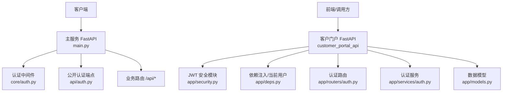
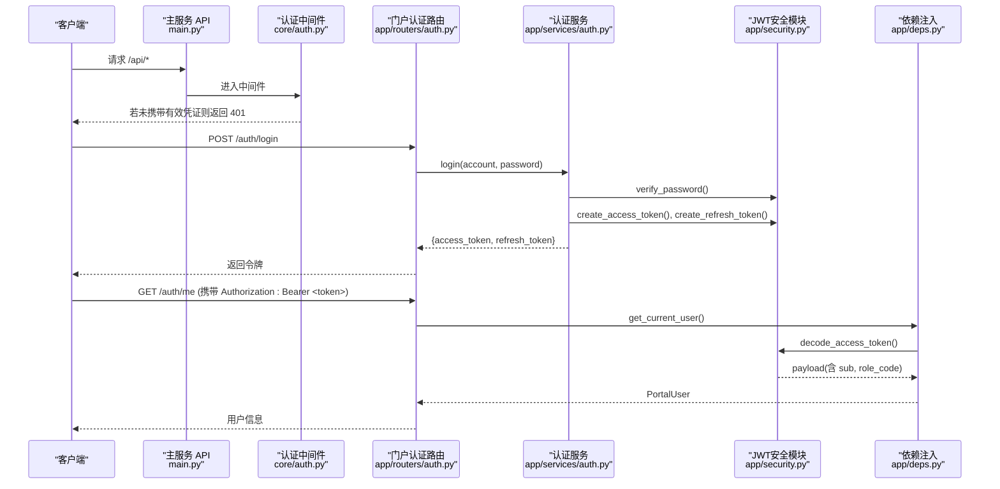
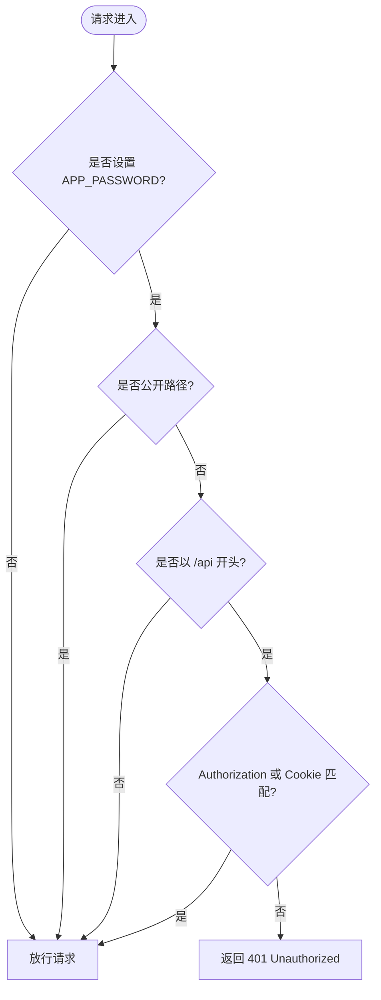
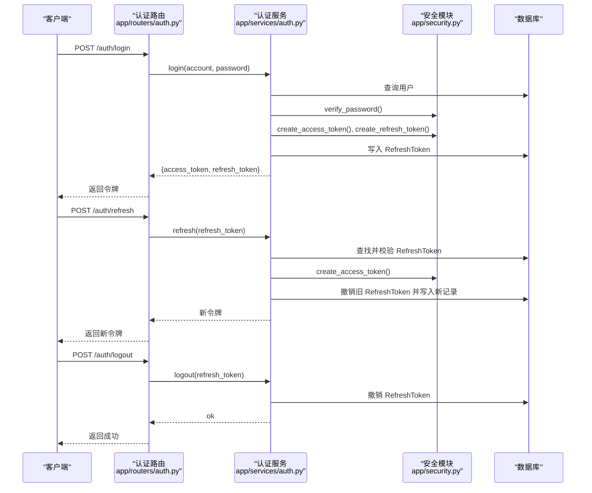
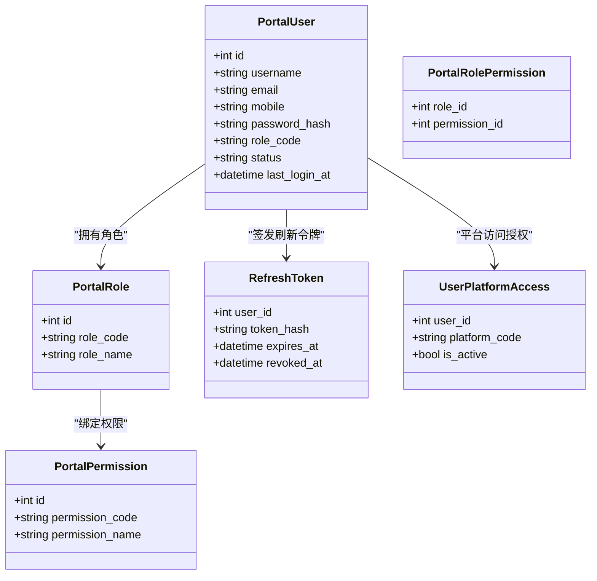
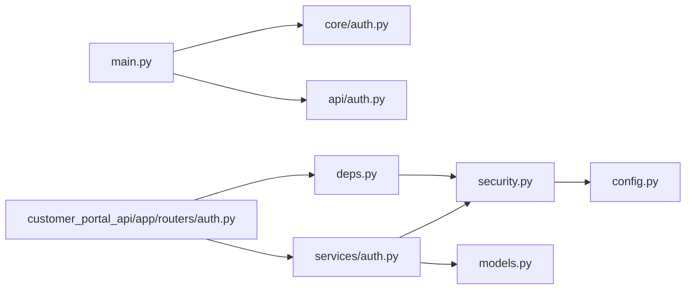

# 安全与认证

<cite>
**本文引用的文件**
- [main.py](file://main.py)
- [core/auth.py](file://core/auth.py)
- [api/auth.py](file://api/auth.py)
- [customer_portal_api/app/security.py](file://customer_portal_api/app/security.py)
- [customer_portal_api/app/deps.py](file://customer_portal_api/app/deps.py)
- [customer_portal_api/app/routers/auth.py](file://customer_portal_api/app/routers/auth.py)
- [customer_portal_api/app/services/auth.py](file://customer_portal_api/app/services/auth.py)
- [customer_portal_api/app/models.py](file://customer_portal_api/app/models.py)
- [customer_portal_api/app/config.py](file://customer_portal_api/app/config.py)
- [customer_portal_api/app/routers/admin.py](file://customer_portal_api/app/routers/admin.py)
- [infrastructure/config_repository.py](file://infrastructure/config_repository.py)
</cite>

## 目录
1. [简介](#简介)
2. [项目结构](#项目结构)
3. [核心组件](#核心组件)
4. [架构总览](#架构总览)
5. [详细组件分析](#详细组件分析)
6. [依赖关系分析](#依赖关系分析)
7. [性能与安全考量](#性能与安全考量)
8. [故障排查指南](#故障排查指南)
9. [结论](#结论)
10. [附录](#附录)

## 简介
本文件系统性说明系统的安全机制与认证授权实现，覆盖以下方面：
- Bearer Token 认证工作原理（令牌生成、验证、刷新）
- 权限控制设计模式（角色权限、资源访问控制、API 级别防护）
- 敏感信息保护策略（密码加密、API 密钥管理、会话安全）
- 安全最佳实践（输入校验、SQL 注入防护、XSS/CSRF 防护）
- 审计日志与监控（操作追踪、异常检测、安全事件响应）
- 安全配置最佳实践与常见威胁防护
- 企业级安全要求对齐建议

## 项目结构
系统包含两套认证体系：
- 主服务 API（FastAPI）：基于环境变量 APP_PASSWORD 的简单 Bearer/Cookie 鉴权中间件，适用于内部或受控环境。
- 客户门户 API（Customer Portal API）：基于 JWT 的完整认证授权体系，支持登录、刷新、登出、用户信息与平台访问控制。

图表来源
- [main.py:94-121](file://main.py#L94-L121)
- [core/auth.py:19-48](file://core/auth.py#L19-L48)
- [api/auth.py:15-29](file://api/auth.py#L15-L29)
- [customer_portal_api/app/security.py:26-90](file://customer_portal_api/app/security.py#L26-L90)
- [customer_portal_api/app/deps.py:20-36](file://customer_portal_api/app/deps.py#L20-L36)
- [customer_portal_api/app/routers/auth.py:28-45](file://customer_portal_api/app/routers/auth.py#L28-L45)
- [customer_portal_api/app/services/auth.py:30-143](file://customer_portal_api/app/services/auth.py#L30-L143)
- [customer_portal_api/app/models.py:12-67](file://customer_portal_api/app/models.py#L12-L67)

章节来源
- [main.py:94-121](file://main.py#L94-L121)
- [core/auth.py:19-48](file://core/auth.py#L19-L48)
- [api/auth.py:15-29](file://api/auth.py#L15-L29)
- [customer_portal_api/app/security.py:26-90](file://customer_portal_api/app/security.py#L26-L90)
- [customer_portal_api/app/deps.py:20-36](file://customer_portal_api/app/deps.py#L20-L36)
- [customer_portal_api/app/routers/auth.py:28-45](file://customer_portal_api/app/routers/auth.py#L28-L45)
- [customer_portal_api/app/services/auth.py:30-143](file://customer_portal_api/app/services/auth.py#L30-L143)
- [customer_portal_api/app/models.py:12-67](file://customer_portal_api/app/models.py#L12-L67)

## 核心组件
- 主服务认证中间件：通过环境变量 APP_PASSWORD 启用，对 /api 路径进行 Bearer 或 Cookie 校验，健康检查与认证相关端点保持公开。
- 客户门户 JWT 安全模块：提供密码哈希/校验、Access Token 签发与校验、Refresh Token 生命周期管理。
- 依赖注入与当前用户解析：从请求头提取并校验 Access Token，解析用户身份与状态。
- 认证服务：封装登录、刷新、登出、获取当前用户信息及角色权限查询。
- 数据模型：用户、角色、权限、刷新令牌、平台访问等实体定义。
- 配置管理：JWT 密钥、令牌有效期、CORS 等关键安全参数集中管理。

章节来源
- [core/auth.py:19-48](file://core/auth.py#L19-L48)
- [customer_portal_api/app/security.py:26-90](file://customer_portal_api/app/security.py#L26-L90)
- [customer_portal_api/app/deps.py:20-36](file://customer_portal_api/app/deps.py#L20-L36)
- [customer_portal_api/app/services/auth.py:30-143](file://customer_portal_api/app/services/auth.py#L30-L143)
- [customer_portal_api/app/models.py:12-67](file://customer_portal_api/app/models.py#L12-L67)
- [customer_portal_api/app/config.py:6-18](file://customer_portal_api/app/config.py#L6-L18)

## 架构总览
下图展示主服务与客户门户的认证流程与交互关系。

图表来源
- [main.py:94-121](file://main.py#L94-L121)
- [core/auth.py:19-48](file://core/auth.py#L19-L48)
- [customer_portal_api/app/routers/auth.py:28-45](file://customer_portal_api/app/routers/auth.py#L28-L45)
- [customer_portal_api/app/services/auth.py:30-143](file://customer_portal_api/app/services/auth.py#L30-L143)
- [customer_portal_api/app/security.py:26-90](file://customer_portal_api/app/security.py#L26-L90)
- [customer_portal_api/app/deps.py:20-36](file://customer_portal_api/app/deps.py#L20-L36)

## 详细组件分析

### 主服务 Bearer Token 认证（APP_PASSWORD）
- 工作原理：
  - 当设置环境变量 APP_PASSWORD 时，所有 /api 请求必须携带 Authorization: Bearer <password> 或 Cookie _auth=<password>。
  - 健康检查与认证相关端点（/api/health、/api/ready、/api/auth/）保持公开，便于容器健康探测与登录流程。
  - 未通过校验的请求返回 401。
- 适用场景：
  - 内部或受信任网络中的快速保护；不适合对外暴露的高风险场景。
- 限制与建议：
  - 使用强随机密码并通过环境变量注入。
  - 生产环境建议结合反向代理（如 Nginx）进行 TLS 终止与访问控制。

图表来源
- [core/auth.py:19-48](file://core/auth.py#L19-L48)

章节来源
- [core/auth.py:19-48](file://core/auth.py#L19-L48)
- [main.py:94-121](file://main.py#L94-L121)

### 客户门户 JWT 认证与授权
- 令牌生成与验证：
  - 密码采用 PBKDF2-SHA256 加盐迭代哈希存储与校验。
  - Access Token 为自定义 JWT（HS256），载荷包含用户标识、角色与用户名，签名使用配置的 jwt_secret。
  - Refresh Token 为一次性使用的随机串，服务端以哈希形式持久化并记录过期时间。
- 登录/刷新/登出流程：
  - 登录：校验账号与密码，签发 Access Token 与 Refresh Token，记录刷新令牌哈希与过期时间。
  - 刷新：校验 Refresh Token 有效性（未撤销且未过期），撤销旧令牌并签发新令牌。
  - 登出：撤销指定 Refresh Token。
- 当前用户解析与管理员校验：
  - 从请求头解析 Access Token，校验签名与过期时间，加载用户并检查状态。
  - 管理员接口通过 require_admin 依赖注入强制角色为 admin。

图表来源
- [customer_portal_api/app/routers/auth.py:28-45](file://customer_portal_api/app/routers/auth.py#L28-L45)
- [customer_portal_api/app/services/auth.py:30-143](file://customer_portal_api/app/services/auth.py#L30-L143)
- [customer_portal_api/app/security.py:26-90](file://customer_portal_api/app/security.py#L26-L90)
- [customer_portal_api/app/models.py:58-67](file://customer_portal_api/app/models.py#L58-L67)

章节来源
- [customer_portal_api/app/security.py:26-90](file://customer_portal_api/app/security.py#L26-L90)
- [customer_portal_api/app/services/auth.py:30-143](file://customer_portal_api/app/services/auth.py#L30-L143)
- [customer_portal_api/app/routers/auth.py:28-45](file://customer_portal_api/app/routers/auth.py#L28-L45)
- [customer_portal_api/app/models.py:58-67](file://customer_portal_api/app/models.py#L58-L67)

### 权限控制设计（RBAC 与资源访问）
- 角色与权限：
  - 用户拥有角色（role_code），角色绑定一组权限（permission_code）。
  - 管理员接口通过 require_admin 强制角色为 admin。
- 平台访问控制：
  - 非管理员用户仅能访问其被授权的 platform_code（UserPlatformAccess）。
  - 获取当前用户信息时会返回其可访问的平台列表。
- 数据模型关系：
  - 用户、角色、权限、刷新令牌、平台访问等实体在 models.py 中定义。

图表来源
- [customer_portal_api/app/models.py:12-67](file://customer_portal_api/app/models.py#L12-L67)
- [customer_portal_api/app/models.py:94-106](file://customer_portal_api/app/models.py#L94-L106)
- [customer_portal_api/app/services/auth.py:72-102](file://customer_portal_api/app/services/auth.py#L72-L102)
- [customer_portal_api/app/routers/admin.py:118-190](file://customer_portal_api/app/routers/admin.py#L118-L190)

章节来源
- [customer_portal_api/app/models.py:12-67](file://customer_portal_api/app/models.py#L12-L67)
- [customer_portal_api/app/models.py:94-106](file://customer_portal_api/app/models.py#L94-L106)
- [customer_portal_api/app/services/auth.py:72-102](file://customer_portal_api/app/services/auth.py#L72-L102)
- [customer_portal_api/app/routers/admin.py:118-190](file://customer_portal_api/app/routers/admin.py#L118-L190)

### 敏感信息保护策略
- 密码加密：
  - 使用 PBKDF2-SHA256 加盐与高迭代次数进行哈希存储与校验，避免明文存储。
- API 密钥管理：
  - 主服务通过环境变量 APP_PASSWORD 注入，避免硬编码。
  - 配置项通过 ConfigRepository 白名单过滤，仅允许更新允许的键，降低误配风险。
- 会话安全：
  - Refresh Token 以哈希形式存储，服务端记录过期与撤销时间，支持一次性使用与主动失效。
  - Access Token 短时效，配合 Refresh Token 轮换提升安全性。

章节来源
- [customer_portal_api/app/security.py:26-46](file://customer_portal_api/app/security.py#L26-L46)
- [customer_portal_api/app/security.py:81-90](file://customer_portal_api/app/security.py#L81-L90)
- [infrastructure/config_repository.py:7-43](file://infrastructure/config_repository.py#L7-L43)
- [core/auth.py:22-23](file://core/auth.py#L22-L23)

### 安全最佳实践
- 输入验证：
  - 使用 Pydantic 模型对请求体进行严格校验，减少非法输入导致的错误与攻击面。
- SQL 注入防护：
  - 使用 SQLModel/SQLAlchemy 的参数化查询，避免拼接 SQL。
- XSS 防护：
  - 前端渲染对用户输入进行转义；后端不直接输出不可信数据到 HTML。
- CSRF 防护：
  - 跨站请求需遵循 SameSite Cookie 策略；对于无状态 API，优先使用 Bearer Token 而非 Cookie 会话。
- 传输安全：
  - 生产环境启用 HTTPS，关闭不必要的 CORS 通配符，限定允许的源与方法。

[本节为通用指导，不直接分析具体文件]

### 审计日志与监控
- 操作追踪：
  - 登录成功后更新 last_login_at，便于追踪最近登录时间。
  - 刷新令牌记录创建与撤销时间，便于审计令牌生命周期。
- 异常检测：
  - 认证失败统一返回 401，便于网关或监控系统聚合告警。
- 安全事件响应：
  - 支持主动撤销 Refresh Token 实现即时下线。
  - 管理员可通过接口查看用户与平台访问情况，及时处置异常。

章节来源
- [customer_portal_api/app/services/auth.py:30-70](file://customer_portal_api/app/services/auth.py#L30-L70)
- [customer_portal_api/app/models.py:41-67](file://customer_portal_api/app/models.py#L41-L67)

## 依赖关系分析
- 主服务依赖：
  - main.py 注册路由并挂载认证中间件，确保 /api 路径受保护。
- 门户服务依赖：
  - routers/auth.py 依赖 services/auth.py 与 security.py，deps.py 提供当前用户解析。
  - models.py 定义数据实体，config.py 提供安全配置。

图表来源
- [main.py:94-121](file://main.py#L94-L121)
- [core/auth.py:19-48](file://core/auth.py#L19-L48)
- [api/auth.py:15-29](file://api/auth.py#L15-L29)
- [customer_portal_api/app/routers/auth.py:28-45](file://customer_portal_api/app/routers/auth.py#L28-L45)
- [customer_portal_api/app/services/auth.py:30-143](file://customer_portal_api/app/services/auth.py#L30-L143)
- [customer_portal_api/app/security.py:26-90](file://customer_portal_api/app/security.py#L26-L90)
- [customer_portal_api/app/deps.py:20-36](file://customer_portal_api/app/deps.py#L20-L36)
- [customer_portal_api/app/models.py:12-67](file://customer_portal_api/app/models.py#L12-L67)
- [customer_portal_api/app/config.py:6-18](file://customer_portal_api/app/config.py#L6-L18)

章节来源
- [main.py:94-121](file://main.py#L94-L121)
- [customer_portal_api/app/routers/auth.py:28-45](file://customer_portal_api/app/routers/auth.py#L28-L45)
- [customer_portal_api/app/services/auth.py:30-143](file://customer_portal_api/app/services/auth.py#L30-L143)
- [customer_portal_api/app/security.py:26-90](file://customer_portal_api/app/security.py#L26-L90)
- [customer_portal_api/app/deps.py:20-36](file://customer_portal_api/app/deps.py#L20-L36)
- [customer_portal_api/app/models.py:12-67](file://customer_portal_api/app/models.py#L12-L67)
- [customer_portal_api/app/config.py:6-18](file://customer_portal_api/app/config.py#L6-L18)

## 性能与安全考量
- 令牌校验开销：
  - JWT 解码与签名校验为轻量操作，适合高频访问；注意合理设置 access_token_ttl_seconds。
- 刷新令牌存储：
  - Refresh Token 哈希索引查询，性能良好；定期清理过期与已撤销令牌。
- 并发与事务：
  - 登录/刷新/登出涉及数据库写操作，应保证事务一致性与幂等性。
- 安全配置：
  - 生产环境务必更换默认 jwt_secret，限制 CORS 源，启用 HTTPS。
  - 主服务 APP_PASSWORD 应为高强度随机值，并通过安全的环境变量管理工具注入。

[本节为通用指导，不直接分析具体文件]

## 故障排查指南
- 401 未授权：
  - 主服务：检查是否设置 APP_PASSWORD 以及请求是否携带正确的 Bearer/Cookie。
  - 门户服务：检查 Authorization 头是否包含有效的 Access Token，确认签名与过期时间。
- 登录失败：
  - 检查账号是否存在、状态是否为 active，密码是否正确。
- 刷新失败：
  - 检查 Refresh Token 是否有效、未被撤销且未过期。
- 管理员接口 403：
  - 检查当前用户角色是否为 admin。

章节来源
- [core/auth.py:39-48](file://core/auth.py#L39-L48)
- [customer_portal_api/app/deps.py:20-36](file://customer_portal_api/app/deps.py#L20-L36)
- [customer_portal_api/app/services/auth.py:30-70](file://customer_portal_api/app/services/auth.py#L30-L70)
- [customer_portal_api/app/routers/admin.py:118-190](file://customer_portal_api/app/routers/admin.py#L118-L190)

## 结论
- 主服务提供轻量级 Bearer/Cookie 认证，适合内部受控环境。
- 客户门户提供完整的 JWT 认证授权体系，支持角色权限与平台访问控制，满足企业级安全需求。
- 通过密码哈希、令牌生命周期管理、配置白名单与依赖注入，系统在认证、授权与敏感信息保护方面具备坚实基础。
- 建议在生产环境强化传输安全、最小化权限、完善审计与监控，持续评估与加固。

[本节为总结，不直接分析具体文件]

## 附录
- 安全配置清单：
  - 设置高强度 APP_PASSWORD（主服务）。
  - 配置 PORTAL_JWT_SECRET、PORTAL_ACCESS_TOKEN_TTL_SECONDS、PORTAL_REFRESH_TOKEN_TTL_SECONDS（门户服务）。
  - 限制 CORS_ORIGINS，启用 HTTPS。
- 常见威胁防护：
  - 输入校验与参数化查询防止注入。
  - 使用 Bearer Token 替代 Cookie 会话以降低 CSRF 风险。
  - 定期轮换密钥与令牌，及时撤销可疑令牌。

[本节为通用指导，不直接分析具体文件]