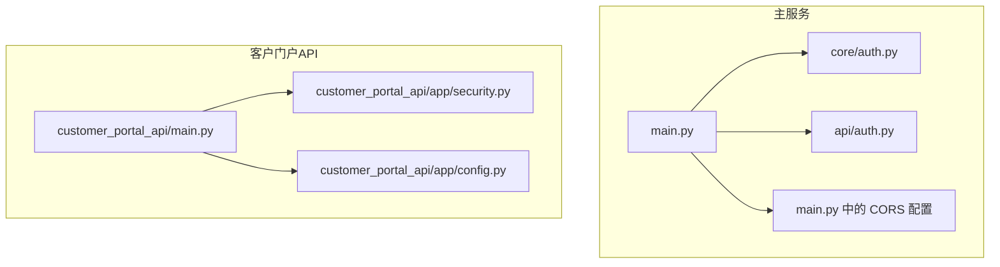
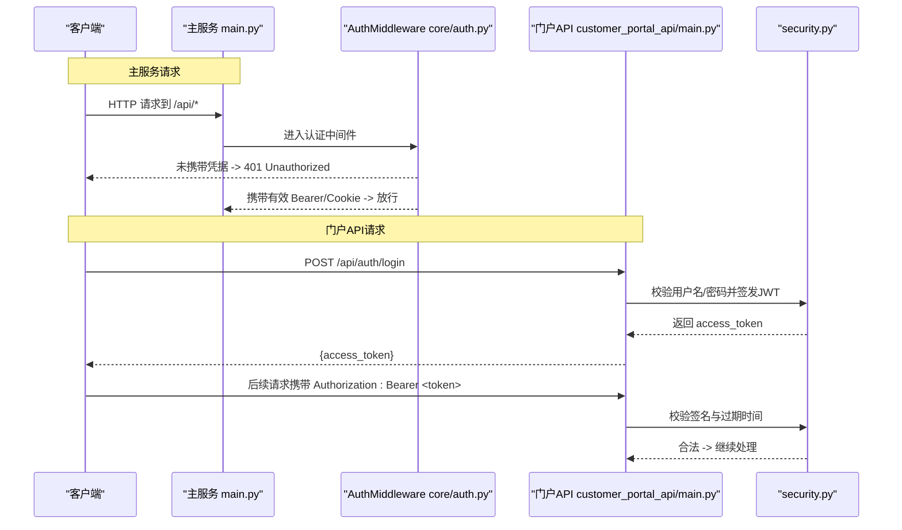
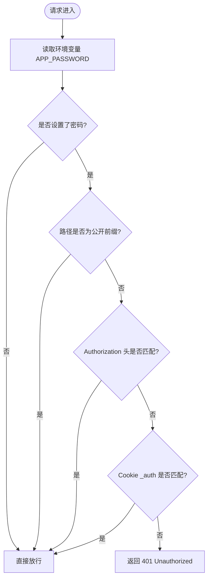
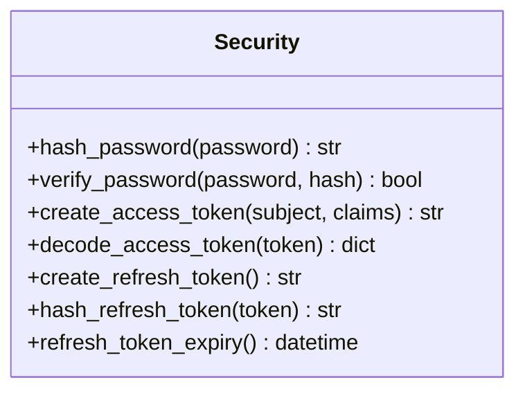

# 安全最佳实践

<cite>
**本文引用的文件**
- [main.py](file://main.py)
- [core/auth.py](file://core/auth.py)
- [api/auth.py](file://api/auth.py)
- [customer_portal_api/app/config.py](file://customer_portal_api/app/config.py)
- [customer_portal_api/app/security.py](file://customer_portal_api/app/security.py)
- [customer_portal_api/main.py](file://customer_portal_api/main.py)
- [core/tls.py](file://core/tls.py)
- [Dockerfile](file://Dockerfile)
- [docker-compose.yml](file://docker-compose.yml)
- [requirements.txt](file://requirements.txt)
</cite>

## 目录
1. [简介](#简介)
2. [项目结构](#项目结构)
3. [核心组件](#核心组件)
4. [架构总览](#架构总览)
5. [详细组件分析](#详细组件分析)
6. [依赖分析](#依赖分析)
7. [性能与安全权衡](#性能与安全权衡)
8. [故障排查指南](#故障排查指南)
9. [结论](#结论)
10. [附录](#附录)

## 简介
本指南面向生产环境，提供系统安全配置与开发最佳实践。内容涵盖：环境变量管理、证书与TLS策略、防火墙与端口暴露、输入验证与输出编码（防XSS/命令注入）、CSRF防护与CORS安全配置、依赖包安全更新与漏洞扫描、以及安全审计与监控（异常检测、访问日志分析、事件响应流程）。文档基于仓库现有实现进行解读，并给出可落地的加固建议。

## 项目结构
本项目包含两个FastAPI服务：
- 主服务：负责账户、任务、平台能力等核心业务，内置简单鉴权中间件与CORS配置。
- 客户门户API：提供JWT鉴权、刷新令牌、CORS来源控制等更完善的安全能力。

**图示来源**
- [main.py:30-102](file://main.py#L30-L102)
- [core/auth.py:19-48](file://core/auth.py#L19-L48)
- [api/auth.py:15-29](file://api/auth.py#L15-L29)
- [customer_portal_api/main.py:23-33](file://customer_portal_api/main.py#L23-L33)
- [customer_portal_api/app/security.py:26-91](file://customer_portal_api/app/security.py#L26-L91)
- [customer_portal_api/app/config.py:6-18](file://customer_portal_api/app/config.py#L6-L18)

**章节来源**
- [main.py:30-102](file://main.py#L30-L102)
- [customer_portal_api/main.py:23-33](file://customer_portal_api/main.py#L23-L33)

## 核心组件
- 认证与授权
  - 主服务：通过中间件对 /api 路径进行 Bearer Token 或 Cookie 校验；健康检查与认证相关端点保持公开。
  - 客户门户API：使用自定义JWT签发与校验、密码哈希与刷新令牌机制。
- 跨域资源共享（CORS）
  - 主服务默认允许所有来源与方法（宽松模式）。
  - 客户门户API支持从环境变量读取允许的源列表。
- TLS与外部请求
  - 提供工具函数用于在明确关闭证书校验时屏蔽告警，便于调试但需在生产禁用。
- 容器化与环境变量
  - Dockerfile 暴露端口并设置 APP_PASSWORD 环境变量；docker-compose 示例展示如何启用密码保护。

**章节来源**
- [core/auth.py:19-48](file://core/auth.py#L19-L48)
- [api/auth.py:15-29](file://api/auth.py#L15-L29)
- [customer_portal_api/app/security.py:26-91](file://customer_portal_api/app/security.py#L26-L91)
- [customer_portal_api/app/config.py:6-18](file://customer_portal_api/app/config.py#L6-L18)
- [core/tls.py:11-32](file://core/tls.py#L11-L32)
- [Dockerfile:54-58](file://Dockerfile#L54-L58)
- [docker-compose.yml:8-14](file://docker-compose.yml#L8-L14)

## 架构总览
下图展示了请求在主服务中的认证流程，以及在客户门户API中的JWT鉴权流程。

**图示来源**
- [main.py:96-102](file://main.py#L96-L102)
- [core/auth.py:26-48](file://core/auth.py#L26-L48)
- [customer_portal_api/main.py:23-33](file://customer_portal_api/main.py#L23-L33)
- [customer_portal_api/app/security.py:49-78](file://customer_portal_api/app/security.py#L49-L78)

## 详细组件分析

### 认证与授权（主服务）
- 行为说明
  - 当环境变量 APP_PASSWORD 为空时，不强制鉴权；否则所有 /api 请求必须携带 Authorization: Bearer <password> 或 Cookie _auth=<password>。
  - 健康检查与认证相关端点（/api/health、/api/ready、/api/auth/）始终公开，便于容器健康探测与登录流程。
- 风险与建议
  - 当前为明文口令比对，适合内部隔离场景；生产建议改用强口令策略与速率限制。
  - 建议结合WAF/反向代理实现IP白名单与请求频率限制。

**图示来源**
- [core/auth.py:22-48](file://core/auth.py#L22-L48)

**章节来源**
- [core/auth.py:19-48](file://core/auth.py#L19-L48)
- [api/auth.py:15-29](file://api/auth.py#L15-L29)

### 认证与授权（客户门户API）
- 行为说明
  - 使用 PBKDF2-SHA256 进行密码哈希与校验，迭代次数较高，增强暴力破解成本。
  - 签发HS256的JWT，包含子项、签发时间与过期时间；校验时验证签名与过期。
  - 支持刷新令牌（随机字符串），并提供哈希存储方案。
- 风险与建议
  - 确保 PORTAL_JWT_SECRET 在生产环境中为高强度随机值，避免硬编码。
  - 建议将 access token TTL 设置为较短时间，配合 refresh token 轮换。

**图示来源**
- [customer_portal_api/app/security.py:26-91](file://customer_portal_api/app/security.py#L26-L91)

**章节来源**
- [customer_portal_api/app/security.py:26-91](file://customer_portal_api/app/security.py#L26-L91)

### 跨域资源共享（CORS）
- 主服务
  - 默认允许所有来源、方法与头部，适合本地开发；生产应严格限定来源。
- 客户门户API
  - 通过环境变量 PORTAL_CORS_ORIGINS 指定允许的源列表，支持逗号分隔。
- 建议
  - 生产环境仅允许受信任的前端域名，禁止通配符。
  - 谨慎暴露敏感接口至公共网络，必要时结合网关层做来源校验。

**章节来源**
- [main.py:97-102](file://main.py#L97-L102)
- [customer_portal_api/main.py:24-29](file://customer_portal_api/main.py#L24-L29)
- [customer_portal_api/app/config.py:15-15](file://customer_portal_api/app/config.py#L15-L15)

### TLS与外部请求
- 现状
  - 提供工具函数以在 verify=False 时屏蔽 urllib3 的 InsecureRequestWarning，便于临时绕过证书校验。
- 风险与建议
  - 生产环境严禁全局关闭证书校验；如需自签证书，请正确配置 CA 链与主机名校验。
  - 对外部HTTP调用统一启用证书校验，仅在受控调试场景下临时关闭。

**章节来源**
- [core/tls.py:11-32](file://core/tls.py#L11-L32)

### 环境变量与容器化
- 关键变量
  - APP_PASSWORD：主服务鉴权口令，留空则不强制鉴权。
  - PORTAL_JWT_SECRET：门户API JWT密钥，生产必须替换为高强度随机值。
  - PORTAL_CORS_ORIGINS：门户API允许的CORS来源列表。
  - DISPLAY/VNC_PASSWORD：用于VNC远程桌面（按需启用）。
- 端口暴露
  - 8000：FastAPI Web UI/API
  - 6080：noVNC（浏览器可视化）
  - 8889：Turnstile Solver
- 建议
  - 生产环境仅暴露必要端口，并通过反向代理与防火墙限制来源。
  - 数据库文件持久化路径需具备最小权限。

**章节来源**
- [Dockerfile:54-58](file://Dockerfile#L54-L58)
- [docker-compose.yml:8-14](file://docker-compose.yml#L8-L14)

## 依赖分析
- Python依赖
  - 主要框架与库：fastapi、uvicorn、sqlmodel、requests、playwright、pydantic、jwcrypto、quart、rich、pyinstaller 等。
  - 测试依赖：pytest、httpx。
- 前端依赖
  - 通过 npm ci 安装，构建产物由多阶段构建复制到镜像。
- 建议
  - 定期运行依赖漏洞扫描（如 pip-audit、npm audit），并在CI中阻断高危漏洞。
  - 锁定依赖版本，避免上游变更引入风险。

**章节来源**
- [requirements.txt:1-20](file://requirements.txt#L1-L20)

## 性能与安全权衡
- 认证开销
  - 主服务中间件为轻量级比较，开销极低；门户API的PBKDF2哈希与JWT校验会带来CPU开销，需合理设置并发与超时。
- CORS与安全性
  - 宽松CORS提升开发效率，但生产应收紧以减少跨站攻击面。
- TLS与性能
  - 启用TLS会增加握手开销，但能显著提升传输安全；建议使用现代加密套件与会话复用。

[本节为通用指导，不直接分析具体文件]

## 故障排查指南
- 401 Unauthorized
  - 主服务：检查是否设置了 APP_PASSWORD，且请求携带正确的 Bearer 或 Cookie。
  - 门户API：检查JWT签名与过期时间，确认 PORTAL_JWT_SECRET 一致。
- CORS错误
  - 检查 Origin 是否在允许列表中；生产环境务必精确配置。
- 证书校验失败
  - 若出现 InsecureRequestWarning，检查是否误用 verify=False；生产环境应启用证书校验。
- 端口不可达
  - 检查容器端口映射与宿主防火墙规则，确保仅暴露必要端口。

**章节来源**
- [core/auth.py:26-48](file://core/auth.py#L26-L48)
- [customer_portal_api/app/security.py:49-78](file://customer_portal_api/app/security.py#L49-L78)
- [core/tls.py:11-32](file://core/tls.py#L11-L32)
- [docker-compose.yml:4-7](file://docker-compose.yml#L4-L7)

## 结论
- 主服务提供了基础的Bearer/Cookie鉴权与宽松的CORS，适合内网或本地使用；生产需收紧CORS并考虑增加速率限制与审计。
- 客户门户API具备更完善的密码哈希与JWT机制，生产应强化密钥管理与TTL策略。
- 容器化部署清晰，环境变量与端口暴露可控；生产应遵循最小暴露原则。
- 建议结合外部WAF/网关、日志审计与依赖扫描，形成完整的安全闭环。

[本节为总结性内容，不直接分析具体文件]

## 附录

### 生产环境安全配置清单
- 环境变量管理
  - 设置 APP_PASSWORD 并采用强口令策略。
  - 设置 PORTAL_JWT_SECRET 为高强度随机值，定期轮换。
  - 配置 PORTAL_CORS_ORIGINS 为精确来源列表。
- 证书与TLS
  - 启用HTTPS，配置可信CA与主机名校验；禁用全局 verify=False。
- 防火墙与端口
  - 仅暴露 8000（API/Web UI），按需开放 6080/8889；通过反向代理与ACL限制来源。
- 输入验证与输出编码
  - 对所有用户输入进行服务端校验（类型、长度、格式、白名单）。
  - 输出到HTML/JS上下文时进行编码，防止XSS；避免拼接命令执行参数，防止命令注入。
- CSRF防护
  - 对状态变更接口实施CSRF令牌校验或使用SameSite Cookie策略；门户API建议结合JWT与Referer/Origin校验。
- 依赖安全
  - 定期运行依赖漏洞扫描（pip-audit、npm audit），在CI中阻断高危漏洞；锁定版本并跟踪更新。
- 安全审计与监控
  - 记录访问日志（含来源IP、User-Agent、请求路径、状态码），集中收集与分析。
  - 建立异常检测规则（高频失败、异常UA、异常来源），触发告警。
  - 制定安全事件响应流程（隔离、取证、修复、复盘）。

[本节为通用指导，不直接分析具体文件]