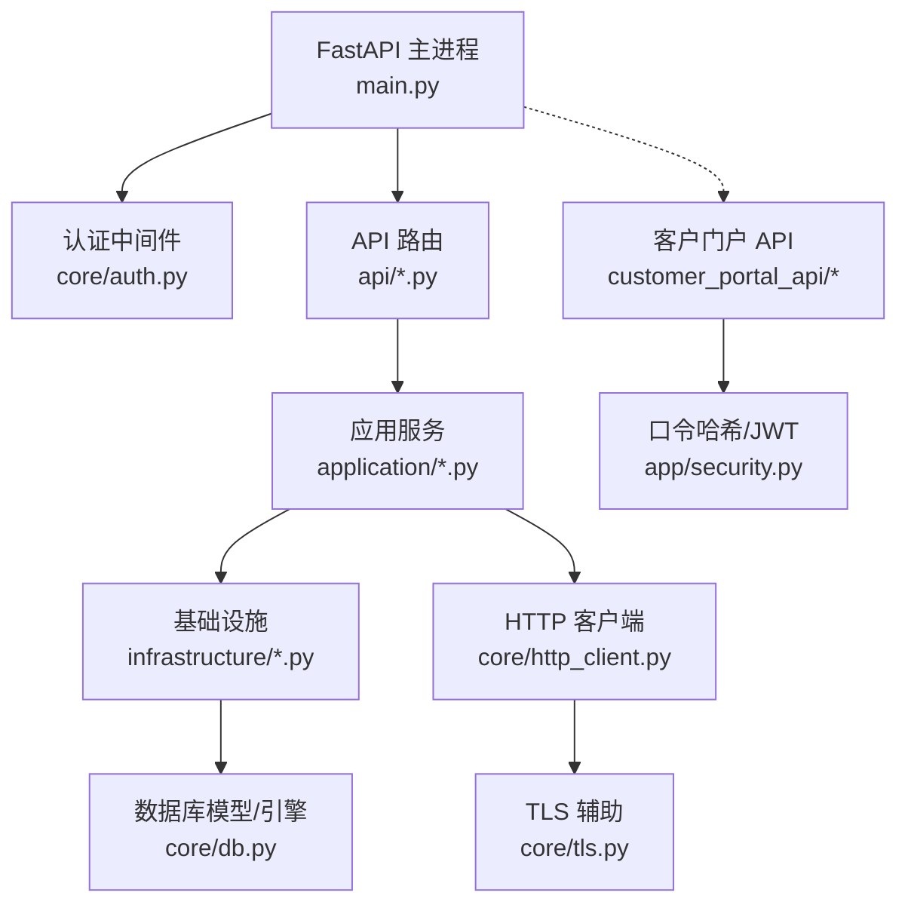
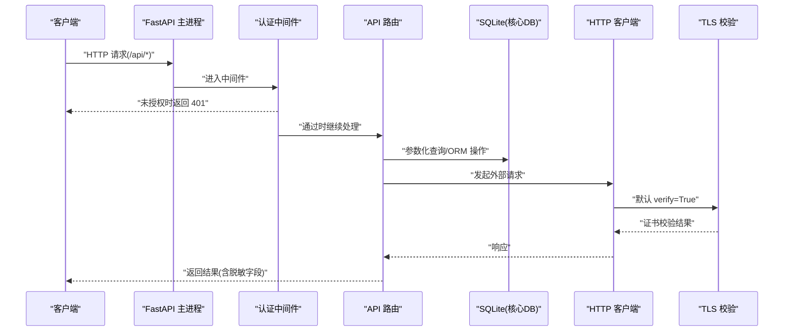
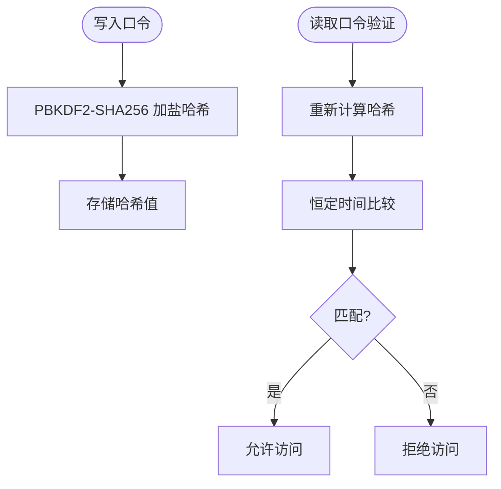
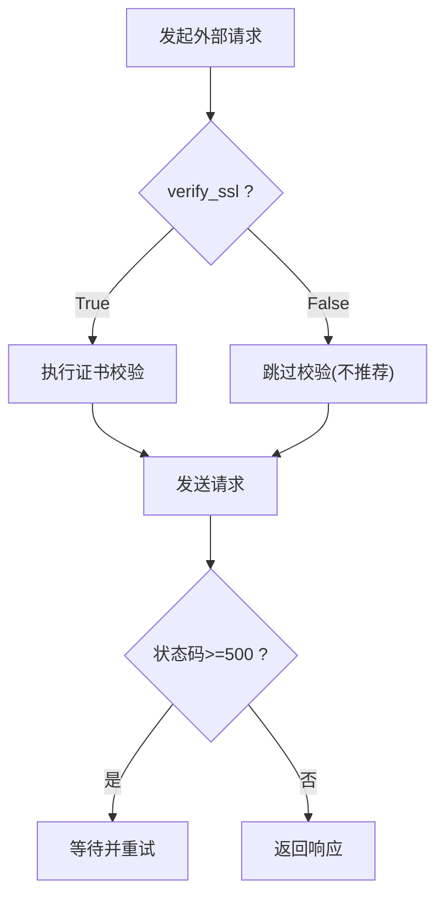
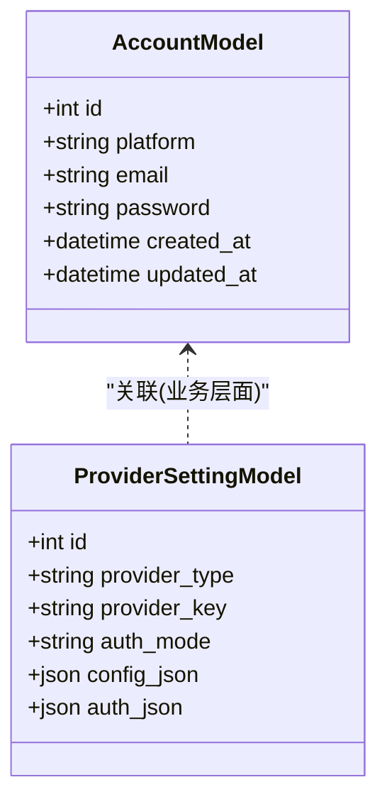
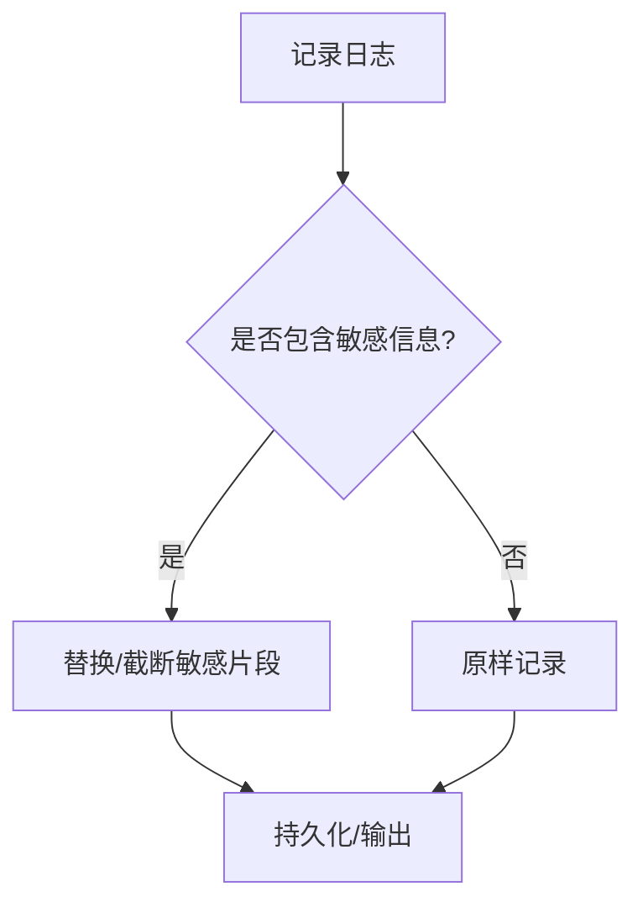
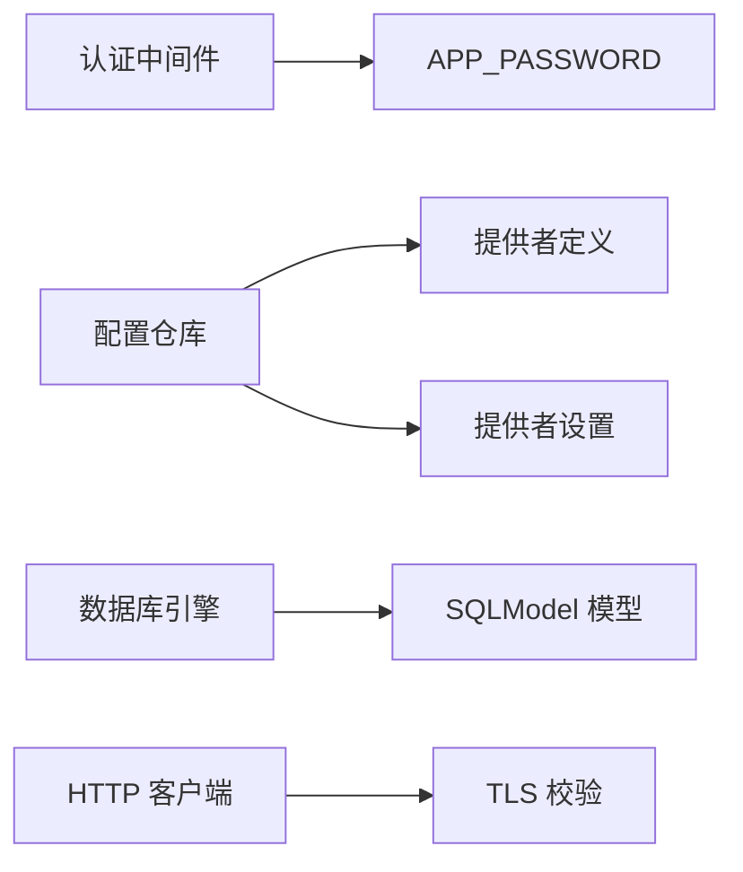

# 数据安全

<cite>
**本文引用的文件**
- [main.py](file://main.py)
- [core/auth.py](file://core/auth.py)
- [api/auth.py](file://api/auth.py)
- [customer_portal_api/app/security.py](file://customer_portal_api/app/security.py)
- [customer_portal_api/app/config.py](file://customer_portal_api/app/config.py)
- [core/db.py](file://core/db.py)
- [core/http_client.py](file://core/http_client.py)
- [core/tls.py](file://core/tls.py)
- [infrastructure/config_repository.py](file://infrastructure/config_repository.py)
- [application/provider_settings.py](file://application/provider_settings.py)
- [platforms/kiro/core.py](file://platforms/kiro/core.py)
</cite>

## 目录
1. [简介](#简介)
2. [项目结构](#项目结构)
3. [核心组件](#核心组件)
4. [架构总览](#架构总览)
5. [详细组件分析](#详细组件分析)
6. [依赖关系分析](#依赖关系分析)
7. [性能与安全权衡](#性能与安全权衡)
8. [故障排查指南](#故障排查指南)
9. [结论](#结论)
10. [附录](#附录)

## 简介
本章节从数据安全的角度，系统梳理系统在敏感信息加密存储、传输安全、数据库访问安全、日志脱敏以及备份恢复等方面的实现与注意事项。重点覆盖：
- 敏感信息的加密存储机制（密码、API密钥、配置）
- 数据传输安全（HTTPS/TLS、证书校验、完整性）
- 数据库安全策略（参数化查询、连接配置、迁移安全）
- 日志脱敏（避免将敏感信息写入日志或返回给前端）
- 备份与恢复的安全考虑（凭据保护、导出控制）

## 项目结构
本项目采用分层架构：API层路由到应用服务层，再调用基础设施与领域模型；核心模块负责认证、数据库、HTTP客户端、TLS工具等通用能力。客户门户子服务提供独立的鉴权与令牌体系。

图表来源
- [main.py:94-121](file://main.py#L94-L121)
- [core/auth.py:26-48](file://core/auth.py#L26-L48)
- [core/db.py:16-22](file://core/db.py#L16-L22)
- [core/http_client.py:39-83](file://core/http_client.py#L39-L83)
- [customer_portal_api/app/security.py:26-78](file://customer_portal_api/app/security.py#L26-L78)

章节来源
- [main.py:94-121](file://main.py#L94-L121)

## 核心组件
- 认证与访问控制
  - 主服务通过中间件对 /api 路径进行基于 Bearer Token 或 Cookie 的简单鉴权，健康检查与就绪接口保持公开。
  - 登录接口用于返回是否启用密码保护及校验密码并返回令牌。
- 口令与令牌
  - 客户门户使用 PBKDF2-SHA256 对口令进行加盐哈希存储与验证，并使用 HMAC-SHA256 签发和校验自定义 JWT。
- 数据库与配置持久化
  - 主服务使用 SQLite + SQLModel 管理账号、任务、提供者设置等数据；全局配置以 key-value 形式存储在 SQLite。
  - 配置更新通过白名单过滤，仅允许受控键写入。
- 外部通信安全
  - HTTP 客户端默认开启 SSL 校验，支持代理与重试；提供禁用校验的工具方法（需显式开关）。
- 前端敏感字段展示
  - 对“机密”字段在前端提供掩码显示与预览脱敏逻辑，避免明文泄露。

章节来源
- [core/auth.py:26-48](file://core/auth.py#L26-L48)
- [api/auth.py:15-29](file://api/auth.py#L15-L29)
- [customer_portal_api/app/security.py:26-78](file://customer_portal_api/app/security.py#L26-L78)
- [core/db.py:16-22](file://core/db.py#L16-L22)
- [infrastructure/config_repository.py:7-42](file://infrastructure/config_repository.py#L7-L42)
- [core/http_client.py:23-83](file://core/http_client.py#L23-L83)
- [application/provider_settings.py:54-87](file://application/provider_settings.py#L54-L87)

## 架构总览
下图展示了请求进入后的认证流程、数据存储与外部通信的安全要点。

图表来源
- [main.py:94-121](file://main.py#L94-L121)
- [core/auth.py:26-48](file://core/auth.py#L26-L48)
- [core/db.py:16-22](file://core/db.py#L16-L22)
- [core/http_client.py:39-83](file://core/http_client.py#L39-L83)

## 详细组件分析

### 敏感信息加密存储机制
- 口令存储
  - 客户门户使用 PBKDF2-SHA256 加盐哈希存储口令，并通过恒定时间比较验证口令，降低时序攻击风险。
  - 口令哈希格式包含算法、迭代次数、盐与摘要，便于未来升级。
- 令牌与刷新令牌
  - 访问令牌为自实现的 JWT，使用 HMAC-SHA256 签名，携带过期时间与声明；刷新令牌随机生成并在服务端哈希后保存。
- 平台密码加密
  - 部分平台（如 Kiro）在发送密码前使用 JWE（RSA-OAEP-256 + AES-GCM）对包含 claims 的 JSON 负载进行加密，确保端到端机密性。
- 配置与密钥
  - 全局配置以 key-value 形式持久化到 SQLite；写入口通过白名单限制可更新键，防止注入任意配置项。
  - 提供者设置中的“机密”字段在前端以掩码方式展示，后端序列化时对长字符串做首尾保留的脱敏预览。

图表来源
- [customer_portal_api/app/security.py:26-46](file://customer_portal_api/app/security.py#L26-L46)

章节来源
- [customer_portal_api/app/security.py:26-78](file://customer_portal_api/app/security.py#L26-L78)
- [platforms/kiro/core.py:169-197](file://platforms/kiro/core.py#L169-L197)
- [infrastructure/config_repository.py:7-42](file://infrastructure/config_repository.py#L7-L42)
- [application/provider_settings.py:54-87](file://application/provider_settings.py#L54-L87)

### 数据传输过程中的安全措施
- HTTPS/TLS 校验
  - HTTP 客户端默认启用 SSL 证书校验（verify=True），避免中间人攻击。
  - 提供工具函数可在明确关闭校验的场景下屏蔽警告，但应谨慎使用，仅在可信内网或调试环境临时使用。
- 代理与重试
  - 支持代理转发与指数退避重试，提升网络稳定性；错误日志中记录状态码与尝试次数，便于定位问题。
- 完整性与签名
  - 访问令牌使用 HMAC 签名，服务端校验签名与过期时间，保证令牌完整性和时效性。

图表来源
- [core/http_client.py:23-83](file://core/http_client.py#L23-L83)
- [core/http_client.py:114-145](file://core/http_client.py#L114-L145)
- [core/tls.py:11-32](file://core/tls.py#L11-L32)

章节来源
- [core/http_client.py:23-83](file://core/http_client.py#L23-L83)
- [core/tls.py:11-32](file://core/tls.py#L11-L32)

### 数据库安全策略
- 参数化查询与 ORM
  - 使用 SQLModel/SQLAlchemy ORM 进行数据读写，天然避免拼接 SQL 导致的注入风险。
- 连接与迁移
  - 数据库 URL 可通过环境变量覆盖；初始化时创建表并执行历史迁移脚本，迁移过程使用原生 SQL 但限定在事务边界内，避免脏写。
- 连接池与并发
  - SQLite 引擎通过 connect_args 控制线程行为；生产建议评估并发需求与锁竞争，必要时切换至更合适的数据库。
- 敏感字段存储
  - 账号密码等敏感字段以明文存储在账户表中（当前实现），建议在入库前进行不可逆哈希或对称加密，并在出库时严格脱敏。

图表来源
- [core/db.py:25-35](file://core/db.py#L25-L35)
- [core/db.py:172-207](file://core/db.py#L172-L207)

章节来源
- [core/db.py:16-22](file://core/db.py#L16-L22)
- [core/db.py:430-445](file://core/db.py#L430-L445)

### 日志脱敏处理
- 输出控制
  - 主进程强制 stdout/stderr 使用 UTF-8 编码，避免非 ASCII 字符导致崩溃；同时设置环境变量确保子进程继承。
- 任务日志
  - 任务日志以结构化方式持久化，包含平台、邮箱、状态、错误信息与详情；对外查询接口返回必要字段，避免直接暴露敏感细节。
- 前端脱敏
  - 提供者设置的“机密”字段在前端以掩码输入框展示，并提供短文本预览；后端序列化时对长字符串进行首尾保留的脱敏预览，减少敏感信息泄露面。

章节来源
- [main.py:5-28](file://main.py#L5-L28)
- [application/provider_settings.py:54-87](file://application/provider_settings.py#L54-L87)
- [infrastructure/task_logs_repository.py:11-40](file://infrastructure/task_logs_repository.py#L11-L40)

### 备份与恢复的安全考虑
- 导出功能
  - 客户门户提供账号导出（JSON/CSV/ZIP），包含邮箱、密码、平台等信息；此类导出必须严格权限控制，并建议增加二次确认与审计。
- 备份介质保护
  - 数据库文件与导出文件均可能包含敏感信息，应限制访问权限、加密存储、最小化留存周期。
- 恢复流程
  - 恢复前应校验备份完整性（如校验和），并在隔离环境中执行，避免污染生产数据。

章节来源
- [customer_portal_api/app/services/portal.py:646-688](file://customer_portal_api/app/services/portal.py#L646-L688)

## 依赖关系分析
- 认证依赖
  - 主服务中间件依赖环境变量 APP_PASSWORD；登录接口同样读取该变量进行校验。
- 配置依赖
  - 配置仓库依赖提供者定义与设置，动态构建允许更新的键集合，防止越权写入。
- 数据库依赖
  - 所有模型与迁移集中在 core/db.py；引擎通过环境变量配置，便于多环境部署。
- 外部通信依赖
  - HTTP 客户端统一封装，集中管理代理、重试与 SSL 校验；TLS 工具提供可选的禁用校验能力。

图表来源
- [core/auth.py:22-24](file://core/auth.py#L22-L24)
- [infrastructure/config_repository.py:7-42](file://infrastructure/config_repository.py#L7-L42)
- [core/db.py:16-22](file://core/db.py#L16-L22)
- [core/http_client.py:39-83](file://core/http_client.py#L39-L83)

章节来源
- [core/auth.py:22-24](file://core/auth.py#L22-L24)
- [infrastructure/config_repository.py:7-42](file://infrastructure/config_repository.py#L7-L42)
- [core/db.py:16-22](file://core/db.py#L16-L22)
- [core/http_client.py:39-83](file://core/http_client.py#L39-L83)

## 性能与安全权衡
- 口令哈希强度
  - PBKDF2 迭代次数较高，兼顾安全性与性能；可根据硬件调整迭代次数以满足合规要求。
- 令牌有效期
  - 访问令牌 TTL 较短，降低泄露窗口；刷新令牌长期有效但需安全存储与服务端校验。
- 外部请求重试
  - 重试策略提升鲁棒性，但需注意幂等性与限流，避免放大下游压力。
- 数据库选择
  - SQLite 适合单机与低并发场景；高并发或强一致性需求建议迁移至关系型数据库并启用 WAL、连接池与只读副本。

[本节为通用指导，不直接分析具体文件]

## 故障排查指南
- 401 未授权
  - 检查是否设置了 APP_PASSWORD；确认请求头 Authorization 或 Cookie _auth 是否正确传递。
- 证书校验失败
  - 若出现 SSL 校验错误，优先修复证书链；仅在可信环境临时关闭校验并记录原因。
- 配置更新无效
  - 确认键名在白名单内；检查提供者定义与设置是否生效。
- 日志缺失或乱码
  - 检查进程标准输出编码设置；确认日志写入路径权限。

章节来源
- [core/auth.py:26-48](file://core/auth.py#L26-L48)
- [core/http_client.py:114-145](file://core/http_client.py#L114-L145)
- [infrastructure/config_repository.py:7-42](file://infrastructure/config_repository.py#L7-L42)
- [main.py:5-28](file://main.py#L5-L28)

## 结论
系统在认证、口令哈希、令牌签名、外部通信 TLS 校验、配置白名单等方面具备基本的安全保障。针对敏感信息存储，建议进一步在入库前进行不可逆哈希或对称加密，并在出库时严格脱敏；对于备份与导出，应加强权限控制与审计。生产环境建议评估数据库选型与并发需求，完善监控与告警，持续改进安全基线。

[本节为总结性内容，不直接分析具体文件]

## 附录
- 关键环境变量
  - APP_PASSWORD：主服务 API 访问口令
  - ACCOUNT_MANAGER_DATABASE_URL：主服务数据库连接串
  - PORTAL_JWT_SECRET：客户门户 JWT 签名密钥
  - PORTAL_ACCESS_TOKEN_TTL_SECONDS：访问令牌有效期（秒）
  - PORTAL_REFRESH_TOKEN_TTL_SECONDS：刷新令牌有效期（秒）

章节来源
- [core/auth.py:22-24](file://core/auth.py#L22-L24)
- [core/db.py:16-22](file://core/db.py#L16-L22)
- [customer_portal_api/app/config.py:6-18](file://customer_portal_api/app/config.py#L6-L18)