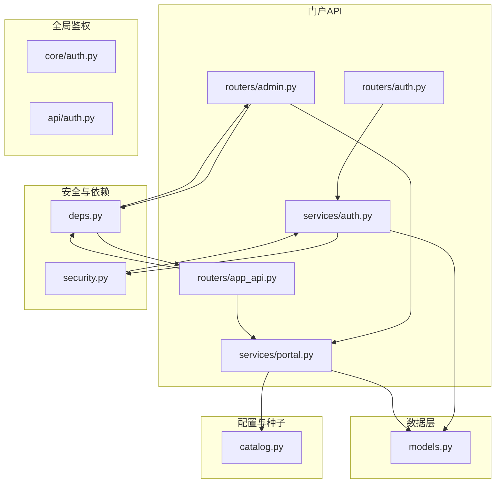
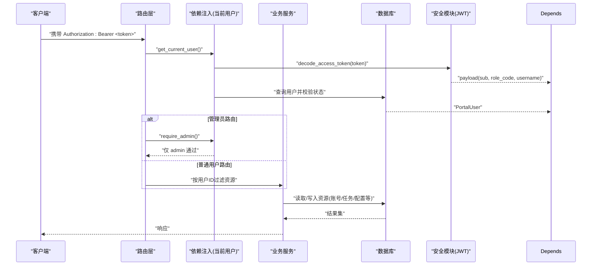
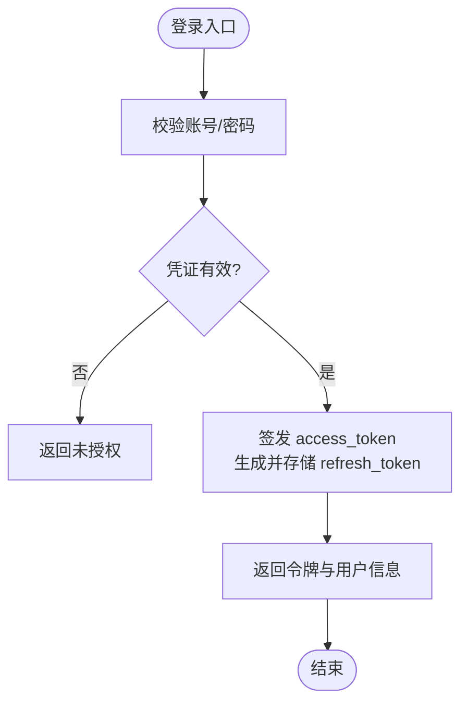
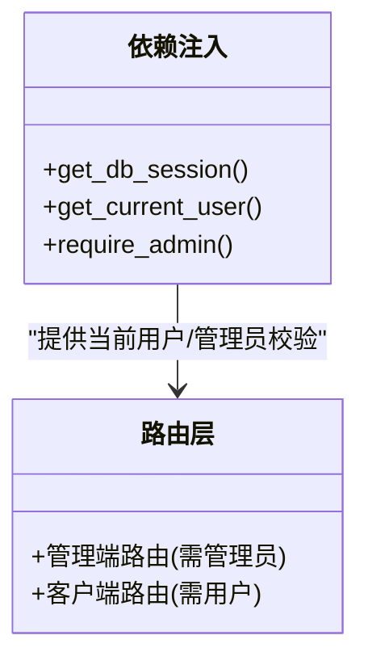
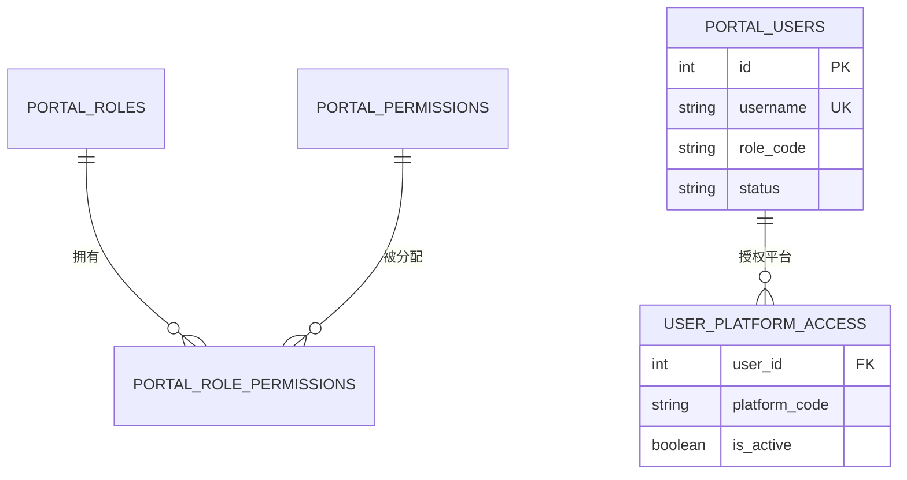
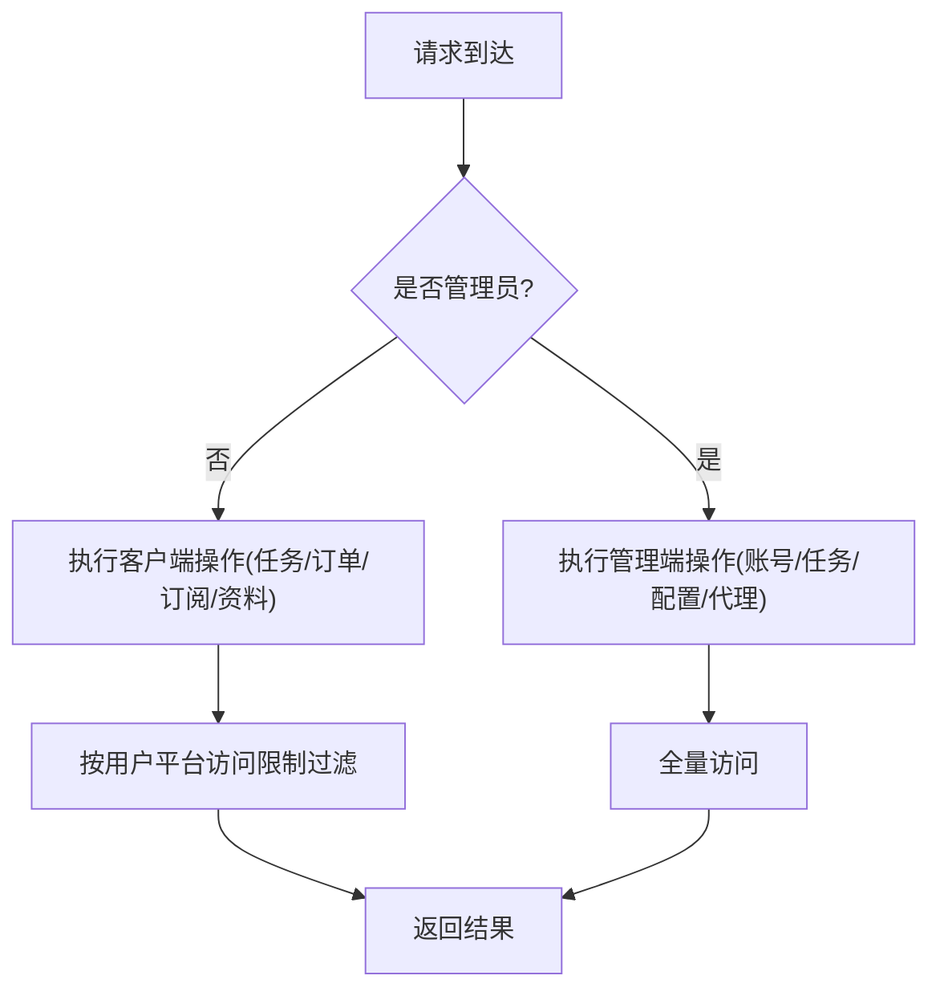
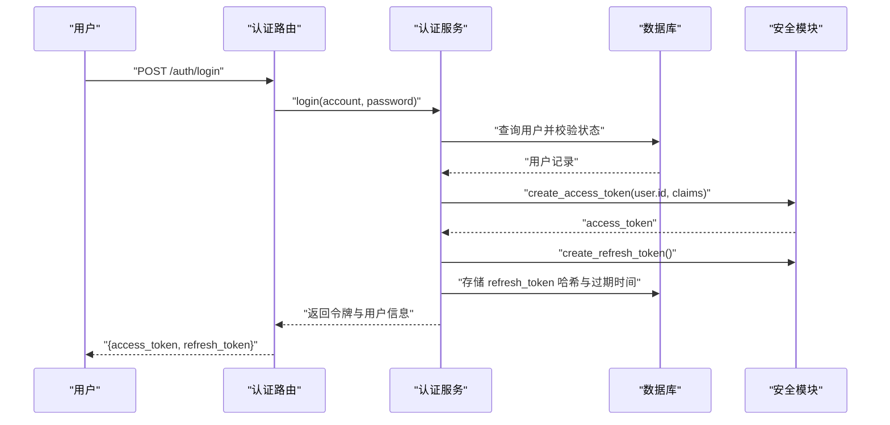
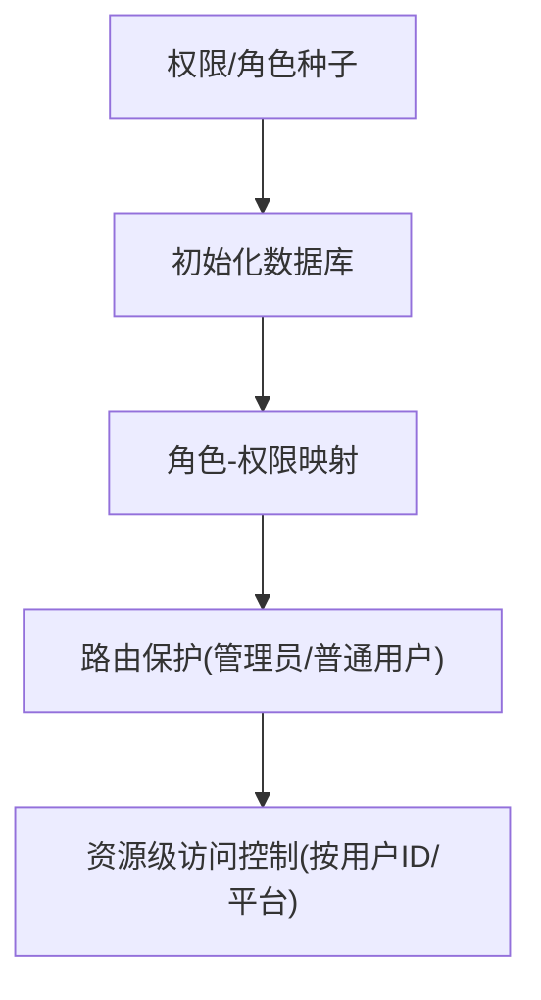
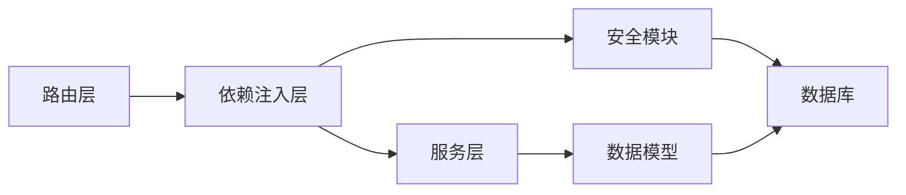

# 权限控制

<cite>
**本文引用的文件**
- [security.py](file://customer_portal_api/app/security.py)
- [auth.py（门户认证路由）](file://customer_portal_api/app/routers/auth.py)
- [deps.py](file://customer_portal_api/app/deps.py)
- [auth.py（认证服务）](file://customer_portal_api/app/services/auth.py)
- [models.py](file://customer_portal_api/app/models.py)
- [admin.py（管理端路由）](file://customer_portal_api/app/routers/admin.py)
- [app_api.py（客户端路由）](file://customer_portal_api/app/routers/app_api.py)
- [portal.py（门户服务）](file://customer_portal_api/app/services/portal.py)
- [catalog.py](file://customer_portal_api/app/catalog.py)
- [auth.py（核心中间件）](file://core/auth.py)
- [auth.py（主应用简单鉴权）](file://api/auth.py)
</cite>

## 目录
1. [简介](#简介)
2. [项目结构](#项目结构)
3. [核心组件](#核心组件)
4. [架构总览](#架构总览)
5. [详细组件分析](#详细组件分析)
6. [依赖关系分析](#依赖关系分析)
7. [性能考虑](#性能考虑)
8. [故障排查指南](#故障排查指南)
9. [结论](#结论)
10. [附录](#附录)

## 简介
本文件系统性说明客户门户的权限控制与角色管理机制，涵盖：
- 安全装饰器与权限验证逻辑
- 用户角色与权限级别（管理员、普通用户等）
- 资源级权限检查（账户、任务、系统配置等）
- JWT 令牌处理与会话管理（access token、refresh token）
- 权限配置方法与自定义扩展指南

## 项目结构
权限相关代码主要分布在以下模块：
- 安全与令牌：security.py
- 认证路由与流程：routers/auth.py、services/auth.py
- 依赖注入与当前用户解析：deps.py
- 数据模型（角色、权限、用户、平台访问等）：models.py
- 管理端路由（管理员专用）：routers/admin.py
- 客户端路由（普通用户）：routers/app_api.py
- 业务服务（含平台访问控制、配置管理等）：services/portal.py
- 权限种子与角色定义：catalog.py
- 全局简单鉴权中间件（可选）：core/auth.py
- 主应用简单密码鉴权（可选）：api/auth.py

**图表来源**
- [security.py:49-78](file://customer_portal_api/app/security.py#L49-L78)
- [auth.py（门户认证路由）:28-45](file://customer_portal_api/app/routers/auth.py#L28-L45)
- [deps.py:20-36](file://customer_portal_api/app/deps.py#L20-L36)
- [auth.py（认证服务）:30-60](file://customer_portal_api/app/services/auth.py#L30-L60)
- [models.py:12-105](file://customer_portal_api/app/models.py#L12-L105)
- [admin.py:118-190](file://customer_portal_api/app/routers/admin.py#L118-L190)
- [app_api.py:44-183](file://customer_portal_api/app/routers/app_api.py#L44-L183)
- [portal.py:51-87](file://customer_portal_api/app/services/portal.py#L51-L87)
- [catalog.py:92-160](file://customer_portal_api/app/catalog.py#L92-L160)
- [core/auth.py:26-48](file://core/auth.py#L26-L48)
- [api/auth.py:15-29](file://api/auth.py#L15-L29)

**章节来源**
- [security.py:49-78](file://customer_portal_api/app/security.py#L49-L78)
- [auth.py（门户认证路由）:28-45](file://customer_portal_api/app/routers/auth.py#L28-L45)
- [deps.py:20-36](file://customer_portal_api/app/deps.py#L20-L36)
- [auth.py（认证服务）:30-60](file://customer_portal_api/app/services/auth.py#L30-L60)
- [models.py:12-105](file://customer_portal_api/app/models.py#L12-L105)
- [admin.py:118-190](file://customer_portal_api/app/routers/admin.py#L118-L190)
- [app_api.py:44-183](file://customer_portal_api/app/routers/app_api.py#L44-L183)
- [portal.py:51-87](file://customer_portal_api/app/services/portal.py#L51-L87)
- [catalog.py:92-160](file://customer_portal_api/app/catalog.py#L92-L160)
- [core/auth.py:26-48](file://core/auth.py#L26-L48)
- [api/auth.py:15-29](file://api/auth.py#L15-L29)

## 核心组件
- 安全与令牌
  - access token 创建与校验、过期检查、签名验证
  - refresh token 生成、哈希存储、过期时间计算
  - 密码哈希与校验（PBKDF2-SHA256）
- 认证与授权
  - 登录、刷新、登出、获取当前用户信息
  - 基于角色的访问控制（RBAC）：管理员与普通用户
  - 资源级权限：平台访问、任务、账号、代理、配置、订单、订阅等
- 数据模型
  - 角色、权限、角色-权限关联、用户、平台访问、任务、账号、代理等
- 路由与依赖注入
  - 管理端路由强制管理员权限
  - 客户端路由按用户身份进行资源隔离

**章节来源**
- [security.py:26-90](file://customer_portal_api/app/security.py#L26-L90)
- [auth.py（认证服务）:30-143](file://customer_portal_api/app/services/auth.py#L30-L143)
- [models.py:12-253](file://customer_portal_api/app/models.py#L12-L253)
- [admin.py:118-519](file://customer_portal_api/app/routers/admin.py#L118-L519)
- [app_api.py:44-183](file://customer_portal_api/app/routers/app_api.py#L44-L183)
- [portal.py:51-87](file://customer_portal_api/app/services/portal.py#L51-L87)

## 架构总览
下图展示从请求进入、JWT 校验、角色与权限判定到资源访问控制的完整流程。

**图表来源**
- [deps.py:20-36](file://customer_portal_api/app/deps.py#L20-L36)
- [security.py:49-78](file://customer_portal_api/app/security.py#L49-L78)
- [admin.py:118-190](file://customer_portal_api/app/routers/admin.py#L118-L190)
- [app_api.py:44-183](file://customer_portal_api/app/routers/app_api.py#L44-L183)
- [portal.py:51-87](file://customer_portal_api/app/services/portal.py#L51-L87)

## 详细组件分析

### 安全与令牌（JWT 与密码）
- access token
  - 包含子标识（sub）、签发时间（iat）、过期时间（exp）以及角色与用户名等声明
  - 使用 HS256 签名，校验失败或过期将返回未授权错误
- refresh token
  - 服务端以哈希形式持久化，支持撤销与过期控制
  - 刷新时旧 token 被标记为已撤销，并发放新 token
- 密码安全
  - 采用 PBKDF2-SHA256 加盐哈希，提供安全的密码存储与比对

**图表来源**
- [auth.py（认证服务）:30-60](file://customer_portal_api/app/services/auth.py#L30-L60)
- [security.py:49-90](file://customer_portal_api/app/security.py#L49-L90)

**章节来源**
- [security.py:26-90](file://customer_portal_api/app/security.py#L26-L90)
- [auth.py（认证服务）:30-60](file://customer_portal_api/app/services/auth.py#L30-L60)

### 认证与授权（依赖注入与装饰器）
- get_current_user
  - 解析 Bearer token，校验签名与过期，加载用户并检查状态
- require_admin
  - 在管理端路由中强制要求角色为管理员，否则返回禁止访问
- 路由保护
  - 管理端路由统一使用 require_admin 装饰器
  - 客户端路由使用 get_current_user 进行用户身份绑定与资源隔离

**图表来源**
- [deps.py:15-36](file://customer_portal_api/app/deps.py#L15-L36)
- [admin.py:118-190](file://customer_portal_api/app/routers/admin.py#L118-L190)
- [app_api.py:44-183](file://customer_portal_api/app/routers/app_api.py#L44-L183)

**章节来源**
- [deps.py:15-36](file://customer_portal_api/app/deps.py#L15-L36)
- [admin.py:118-190](file://customer_portal_api/app/routers/admin.py#L118-L190)
- [app_api.py:44-183](file://customer_portal_api/app/routers/app_api.py#L44-L183)

### 角色与权限（RBAC）
- 角色
  - 管理员：拥有全部管理权限及查看自身资源的权限
  - 普通用户：可创建任务、查看自己的订单/订阅/资料等
- 权限
  - 细粒度权限码（如 admin:user:read、app:task:create 等）
  - 角色-权限多对多映射，便于灵活组合
- 平台访问控制
  - 非管理员用户只能访问其被授权的特定平台
  - 管理员可查看所有平台

**图表来源**
- [models.py:12-105](file://customer_portal_api/app/models.py#L12-L105)
- [catalog.py:92-160](file://customer_portal_api/app/catalog.py#L92-L160)

**章节来源**
- [catalog.py:92-160](file://customer_portal_api/app/catalog.py#L92-L160)
- [models.py:12-105](file://customer_portal_api/app/models.py#L12-L105)
- [portal.py:51-87](file://customer_portal_api/app/services/portal.py#L51-L87)

### 资源级权限检查
- 账户操作
  - 管理端：增删改查、导入导出、统计
  - 客户端：无直接账户管理（由管理员维护）
- 任务管理
  - 管理端：全量任务列表、事件流、取消任务
  - 客户端：仅查看与创建属于自身的任务
- 系统配置
  - 管理端：读取与更新配置项
- 代理管理
  - 管理端：增删改查、批量创建、启用/禁用、检测
- 平台访问
  - 非管理员：仅能访问被授权的平台
  - 管理员：可查看全部平台

**图表来源**
- [admin.py:118-519](file://customer_portal_api/app/routers/admin.py#L118-L519)
- [app_api.py:44-183](file://customer_portal_api/app/routers/app_api.py#L44-L183)
- [portal.py:51-87](file://customer_portal_api/app/services/portal.py#L51-L87)

**章节来源**
- [admin.py:118-519](file://customer_portal_api/app/routers/admin.py#L118-L519)
- [app_api.py:44-183](file://customer_portal_api/app/routers/app_api.py#L44-L183)
- [portal.py:51-87](file://customer_portal_api/app/services/portal.py#L51-L87)

### JWT 令牌处理与会话管理
- 登录流程
  - 校验账号/密码后签发 access token，并生成 refresh token 存入数据库
- 刷新流程
  - 校验 refresh token 有效性，撤销旧 token 并签发新 token
- 登出流程
  - 撤销 refresh token，使后续刷新失效
- 会话状态
  - 用户状态必须为 active，否则拒绝访问
  - access token 过期将导致未授权

**图表来源**
- [auth.py（认证路由）:28-45](file://customer_portal_api/app/routers/auth.py#L28-L45)
- [auth.py（认证服务）:30-60](file://customer_portal_api/app/services/auth.py#L30-L60)
- [security.py:49-90](file://customer_portal_api/app/security.py#L49-L90)

**章节来源**
- [auth.py（认证路由）:28-45](file://customer_portal_api/app/routers/auth.py#L28-L45)
- [auth.py（认证服务）:30-60](file://customer_portal_api/app/services/auth.py#L30-L60)
- [security.py:49-90](file://customer_portal_api/app/security.py#L49-L90)

### 权限配置与自定义扩展指南
- 权限种子
  - 预置权限码与名称，便于初始化与展示
- 角色种子
  - 管理员与普通用户的默认权限集合
- 扩展步骤
  - 新增权限：在权限种子中添加新的 permission_code 与描述
  - 调整角色：在角色种子中增减对应权限
  - 平台访问：通过用户-平台访问表授予或撤销平台权限
  - 路由保护：在管理端路由使用 require_admin；在客户端路由使用 get_current_user 并结合服务层按用户ID过滤资源

**图表来源**
- [catalog.py:92-160](file://customer_portal_api/app/catalog.py#L92-L160)
- [admin.py:118-190](file://customer_portal_api/app/routers/admin.py#L118-L190)
- [app_api.py:44-183](file://customer_portal_api/app/routers/app_api.py#L44-L183)
- [portal.py:51-87](file://customer_portal_api/app/services/portal.py#L51-L87)

**章节来源**
- [catalog.py:92-160](file://customer_portal_api/app/catalog.py#L92-L160)
- [admin.py:118-190](file://customer_portal_api/app/routers/admin.py#L118-L190)
- [app_api.py:44-183](file://customer_portal_api/app/routers/app_api.py#L44-L183)
- [portal.py:51-87](file://customer_portal_api/app/services/portal.py#L51-L87)

## 依赖关系分析
- 模块耦合
  - 路由层依赖依赖注入层进行用户解析与管理员校验
  - 服务层依赖数据模型与配置种子进行权限与资源控制
  - 安全模块独立于业务，提供统一的令牌与密码能力
- 外部集成点
  - 数据库：SQLModel 会话用于持久化用户、角色、权限、令牌等
  - 环境变量：可选的全局密码鉴权（APP_PASSWORD）

**图表来源**
- [deps.py:15-36](file://customer_portal_api/app/deps.py#L15-L36)
- [security.py:49-90](file://customer_portal_api/app/security.py#L49-L90)
- [models.py:12-253](file://customer_portal_api/app/models.py#L12-L253)

**章节来源**
- [deps.py:15-36](file://customer_portal_api/app/deps.py#L15-L36)
- [security.py:49-90](file://customer_portal_api/app/security.py#L49-L90)
- [models.py:12-253](file://customer_portal_api/app/models.py#L12-L253)

## 性能考虑
- JWT 校验开销低，建议缓存用户信息以减少重复查询
- 刷新 token 撤销策略避免并发刷新导致的竞态
- 大数据量导出（CSV/ZIP）使用流式输出降低内存占用
- 分页与限流：任务日志与账号列表均支持分页参数，避免一次性加载过多数据

[本节为通用指导，不直接分析具体文件]

## 故障排查指南
- 未授权（401）
  - 缺少 access token 或 token 无效/过期
  - 用户不存在或被禁用
- 禁止访问（403）
  - 非管理员尝试访问管理端接口
- 资源不存在（404）
  - 任务、账号、用户等资源 ID 不存在
- 刷新失败
  - refresh token 无效、已过期或已被撤销

**章节来源**
- [deps.py:20-36](file://customer_portal_api/app/deps.py#L20-L36)
- [security.py:65-78](file://customer_portal_api/app/security.py#L65-L78)
- [auth.py（认证服务）:48-70](file://customer_portal_api/app/services/auth.py#L48-L70)
- [portal.py:439-482](file://customer_portal_api/app/services/portal.py#L439-L482)

## 结论
本系统采用 RBAC 与资源级访问控制相结合的策略，通过 JWT 实现无状态鉴权，结合 refresh token 管理会话生命周期。管理员与普通用户在功能与资源访问上严格分离，平台访问进一步细化到用户维度。权限与角色可通过种子配置灵活扩展，满足多租户与多平台的差异化需求。

[本节为总结性内容，不直接分析具体文件]

## 附录
- 关键路径参考
  - 登录与令牌签发：[auth.py（认证路由）:28-45](file://customer_portal_api/app/routers/auth.py#L28-L45)、[auth.py（认证服务）:30-60](file://customer_portal_api/app/services/auth.py#L30-L60)、[security.py:49-90](file://customer_portal_api/app/security.py#L49-L90)
  - 管理员权限保护：[admin.py:118-190](file://customer_portal_api/app/routers/admin.py#L118-L190)、[deps.py:33-36](file://customer_portal_api/app/deps.py#L33-L36)
  - 普通用户资源隔离：[app_api.py:44-183](file://customer_portal_api/app/routers/app_api.py#L44-L183)、[portal.py:51-87](file://customer_portal_api/app/services/portal.py#L51-L87)
  - 权限与角色种子：[catalog.py:92-160](file://customer_portal_api/app/catalog.py#L92-L160)
  - 数据模型：[models.py:12-253](file://customer_portal_api/app/models.py#L12-L253)
  - 全局鉴权中间件（可选）：[core/auth.py:26-48](file://core/auth.py#L26-L48)、[api/auth.py:15-29](file://api/auth.py#L15-L29)

[本节为索引性内容，不直接分析具体文件]