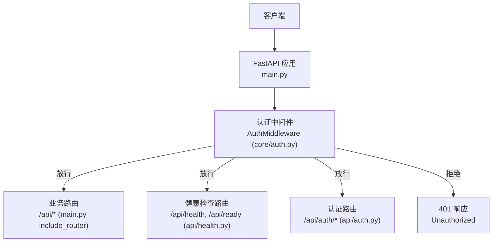
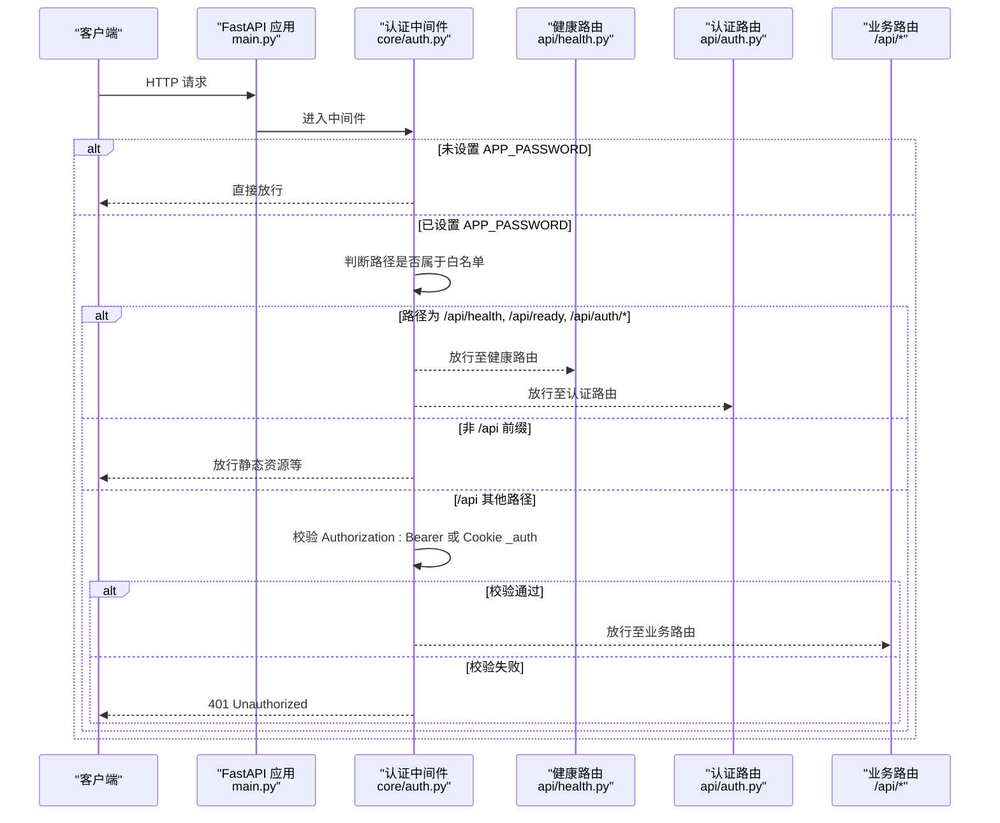
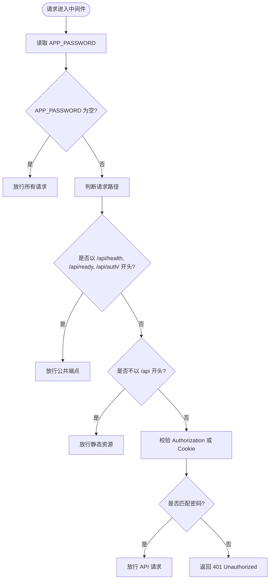
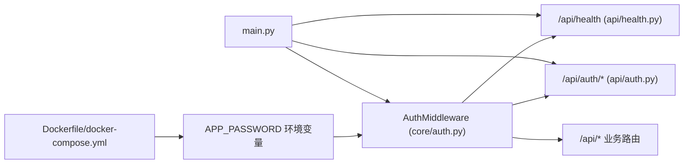

# 认证机制

<cite>
**本文引用的文件**
- [core/auth.py](file://core/auth.py)
- [api/auth.py](file://api/auth.py)
- [main.py](file://main.py)
- [api/health.py](file://api/health.py)
- [docker-compose.yml](file://docker-compose.yml)
- [Dockerfile](file://Dockerfile)
- [tests/test_api_health.py](file://tests/test_api_health.py)
</cite>

## 目录
1. [简介](#简介)
2. [项目结构](#项目结构)
3. [核心组件](#核心组件)
4. [架构总览](#架构总览)
5. [详细组件分析](#详细组件分析)
6. [依赖关系分析](#依赖关系分析)
7. [性能考量](#性能考量)
8. [故障排查指南](#故障排查指南)
9. [结论](#结论)
10. [附录](#附录)

## 简介
本系统采用基于 Bearer Token 的轻量级认证机制，通过环境变量 APP_PASSWORD 启用或关闭。启用后，所有 /api 请求必须携带 Authorization: Bearer <密码> 或 Cookie _auth=<密码> 才能通过；未配置 APP_PASSWORD 时，系统不强制认证。健康检查端点（/api/health、/api/ready）以及认证相关端点（/api/auth/*）始终公开，以便 Docker 健康检查和前端登录流程无需凭据即可访问。

## 项目结构
与认证相关的代码主要分布在以下位置：
- 中间件实现：core/auth.py
- 认证路由：api/auth.py
- 应用入口与中间件注册：main.py
- 健康检查路由：api/health.py
- 部署与环境变量：Dockerfile、docker-compose.yml
- 健康检查测试：tests/test_api_health.py

图表来源
- [main.py:94-121](file://main.py#L94-L121)
- [core/auth.py:26-48](file://core/auth.py#L26-L48)
- [api/health.py:11-18](file://api/health.py#L11-L18)
- [api/auth.py:15-29](file://api/auth.py#L15-L29)

章节来源
- [main.py:94-121](file://main.py#L94-L121)
- [core/auth.py:1-48](file://core/auth.py#L1-L48)
- [api/health.py:1-19](file://api/health.py#L1-L19)
- [api/auth.py:1-30](file://api/auth.py#L1-L30)

## 核心组件
- AuthMiddleware：基于 Starlette BaseHTTPMiddleware 的请求拦截器，负责校验令牌、判断白名单路径、返回 401 未授权。
- 认证路由：提供 /api/auth/check 和 /api/auth/login，用于前端检测是否需要密码并获取 token。
- 健康检查路由：提供 /api/health 和 /api/ready，供容器编排进行健康探测。
- 环境变量：APP_PASSWORD 控制是否启用认证。

章节来源
- [core/auth.py:1-48](file://core/auth.py#L1-L48)
- [api/auth.py:1-30](file://api/auth.py#L1-L30)
- [api/health.py:1-19](file://api/health.py#L1-L19)
- [Dockerfile:54-56](file://Dockerfile#L54-L56)
- [docker-compose.yml:8-14](file://docker-compose.yml#L8-L14)

## 架构总览
下图展示了请求从进入 FastAPI 到最终被处理或拒绝的完整流程，包括中间件的拦截逻辑、白名单放行、Bearer/Cookie 校验与健康检查的特殊处理。

图表来源
- [core/auth.py:26-48](file://core/auth.py#L26-L48)
- [api/health.py:11-18](file://api/health.py#L11-L18)
- [api/auth.py:15-29](file://api/auth.py#L15-L29)
- [main.py:94-121](file://main.py#L94-L121)

## 详细组件分析

### AuthMiddleware 工作原理
- 读取 APP_PASSWORD：若为空则跳过认证，所有请求直接放行。
- 白名单路径：/api/health、/api/ready、/api/auth/* 始终放行，确保健康检查与登录流程可用。
- 非 /api 前缀：如静态资源、SPA 回退等，直接放行。
- 认证校验：对 /api 下的其余请求，优先检查 Authorization 头是否为 "Bearer <密码>"，其次检查 Cookie 中是否存在 "_auth=<密码>"。任一匹配即放行。
- 失败处理：未通过校验时返回 JSON 格式的 401 响应，内容为 {"detail":"Unauthorized"}。

图表来源
- [core/auth.py:26-48](file://core/auth.py#L26-L48)

章节来源
- [core/auth.py:1-48](file://core/auth.py#L1-L48)

### 令牌验证流程
- 支持两种认证方式：
  - 请求头：Authorization: Bearer <密码>
  - Cookie：_auth=<密码>
- 优先级：先检查 Authorization 头，再检查 Cookie。
- 当 APP_PASSWORD 未设置时，不进行任何校验，所有请求均放行。

章节来源
- [core/auth.py:22-48](file://core/auth.py#L22-L48)

### 请求拦截机制
- 拦截范围：仅对 /api 前缀的请求进行认证校验（除白名单外）。
- 白名单策略：/api/health、/api/ready、/api/auth/* 始终放行，保证健康检查与登录流程不受限制。
- 非 API 路径：如静态资源、SPA 页面等，直接放行，避免影响前端体验。

章节来源
- [core/auth.py:32-46](file://core/auth.py#L32-L46)

### 公共端点白名单配置
- 白名单路径常量定义在中间件中，包含：
  - /api/health
  - /api/ready
  - /api/auth/
- 这些路径在任何情况下都不会触发认证校验。

章节来源
- [core/auth.py:19-35](file://core/auth.py#L19-L35)

### APP_PASSWORD 环境变量配置
- 作用：启用或禁用认证保护。
- 默认值：空字符串（不启用认证）。
- 配置方式：
  - Dockerfile 中定义了默认值为空。
  - docker-compose.yml 中可通过 environment 注入 APP_PASSWORD。
- 建议：生产环境务必设置强密码，并通过安全的密钥管理方式注入。

章节来源
- [Dockerfile:54-56](file://Dockerfile#L54-L56)
- [docker-compose.yml:8-14](file://docker-compose.yml#L8-L14)

### Authorization 头部与 _auth Cookie 认证方式
- Authorization 头部：格式为 "Bearer <密码>"，适用于服务端到服务端的调用或脚本自动化。
- Cookie：键名为 _auth，值为密码，适用于浏览器场景，由前端登录后设置。
- 两者任选其一即可通过认证。

章节来源
- [core/auth.py:39-46](file://core/auth.py#L39-L46)

### 健康检查端点的特殊处理逻辑
- /api/health 与 /api/ready 始终公开，即使设置了 APP_PASSWORD 也不会要求凭据。
- 目的：确保 Docker/Kubernetes 的健康检查能够正常探测服务状态。
- 测试覆盖：tests/test_api_health.py 验证了健康检查端点返回 200。

章节来源
- [api/health.py:11-18](file://api/health.py#L11-L18)
- [tests/test_api_health.py:5-15](file://tests/test_api_health.py#L5-L15)

### 认证失败的错误处理和 401 响应格式
- 当请求未携带有效凭据时，中间件返回 HTTP 401。
- 响应体为 JSON：{"detail":"Unauthorized"}。
- 该格式便于客户端统一处理未授权错误。

章节来源
- [core/auth.py:48-48](file://core/auth.py#L48-L48)

### 认证配置的最佳实践与安全建议
- 生产环境必须设置 APP_PASSWORD，并使用高强度随机密码。
- 通过环境变量或密钥管理服务注入密码，避免硬编码在代码或镜像中。
- 使用 HTTPS 传输，防止密码在链路中被窃听。
- 限制暴露端口，仅对内网或可信网络开放 API。
- 定期轮换密码，并在泄露时立即更新。
- 结合 WAF/网关进行额外防护，如速率限制、IP 白名单。
- 对于内部服务间调用，建议使用更严格的身份方案（如 mTLS），而非共享密码。

[本节为通用安全建议，不直接分析具体文件]

## 依赖关系分析
- main.py 将 AuthMiddleware 注册到 FastAPI 应用中，并对多个路由模块进行挂载。
- core/auth.py 中的中间件依赖 FastAPI Request/Response 与 Starlette BaseHTTPMiddleware。
- api/health.py 提供健康检查路由，被中间件白名单放行。
- api/auth.py 提供认证相关路由，同样被中间件白名单放行。
- Dockerfile 与 docker-compose.yml 提供运行环境与 APP_PASSWORD 注入方式。

图表来源
- [main.py:94-121](file://main.py#L94-L121)
- [core/auth.py:26-48](file://core/auth.py#L26-L48)
- [api/health.py:11-18](file://api/health.py#L11-L18)
- [api/auth.py:15-29](file://api/auth.py#L15-L29)
- [Dockerfile:54-56](file://Dockerfile#L54-L56)
- [docker-compose.yml:8-14](file://docker-compose.yml#L8-L14)

章节来源
- [main.py:94-121](file://main.py#L94-L121)
- [core/auth.py:26-48](file://core/auth.py#L26-L48)
- [api/health.py:11-18](file://api/health.py#L11-L18)
- [api/auth.py:15-29](file://api/auth.py#L15-L29)
- [Dockerfile:54-56](file://Dockerfile#L54-L56)
- [docker-compose.yml:8-14](file://docker-compose.yml#L8-L14)

## 性能考量
- 中间件仅在 /api 路径且未命中白名单时才进行认证校验，开销极小。
- 校验逻辑为字符串比较，时间复杂度 O(1)，对高并发场景友好。
- 建议在生产环境启用 HTTPS，减少明文密码在网络中的风险。
- 如需细粒度控制，可考虑扩展白名单或引入基于角色的访问控制。

[本节为通用性能讨论，不直接分析具体文件]

## 故障排查指南
- 现象：所有 /api 请求返回 401。
  - 检查是否正确设置 APP_PASSWORD。
  - 确认请求是否携带 Authorization: Bearer 或 Cookie _auth。
  - 确认请求路径是否命中白名单。
- 现象：健康检查失败。
  - 确认 /api/health 与 /api/ready 未被误改或拦截。
  - 查看 tests/test_api_health.py 的断言行为作为参考。
- 现象：前端无法登录。
  - 确认 /api/auth/check 与 /api/auth/login 可访问。
  - 检查后端返回的 token 是否正确传递到 Cookie _auth。

章节来源
- [core/auth.py:26-48](file://core/auth.py#L26-L48)
- [api/health.py:11-18](file://api/health.py#L11-L18)
- [tests/test_api_health.py:5-15](file://tests/test_api_health.py#L5-L15)
- [api/auth.py:15-29](file://api/auth.py#L15-L29)

## 结论
本系统通过简单的 Bearer Token 机制实现了 API 级别的访问控制，配合 APP_PASSWORD 环境变量灵活启用或关闭认证。中间件对健康检查与认证路由进行白名单放行，确保容器编排与前端登录流程顺畅。生产环境应严格配置强密码、使用 HTTPS，并结合网络与网关层的安全措施，提升整体安全性。

[本节为总结性内容，不直接分析具体文件]

## 附录
- 快速配置示例：
  - 在 docker-compose.yml 中添加 environment: - APP_PASSWORD=your_strong_password
  - 启动后，向 /api/auth/login 发送 POST 请求，body 中包含 password 字段，成功后获取 token。
  - 后续请求在 Authorization 头或 Cookie 中携带该 token。
- 常见错误码：
  - 401 Unauthorized：未携带或携带错误的凭据。
  - 200 OK：健康检查或认证成功。

[本节为补充说明，不直接分析具体文件]