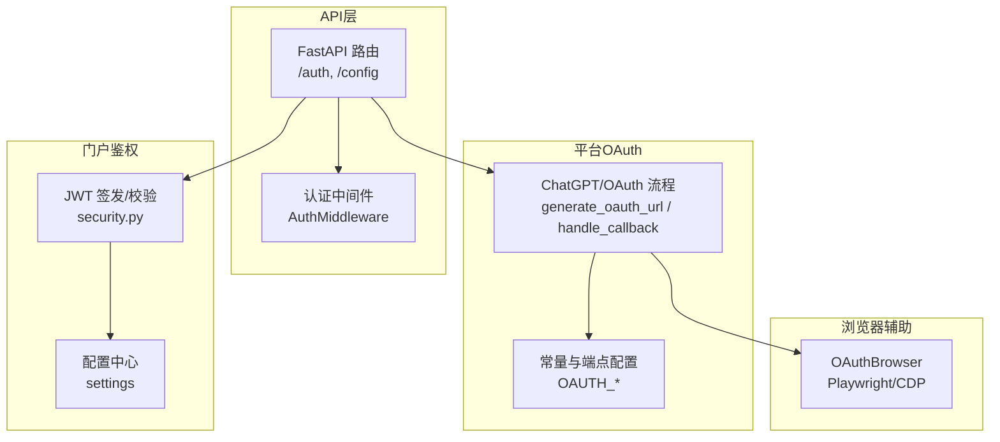
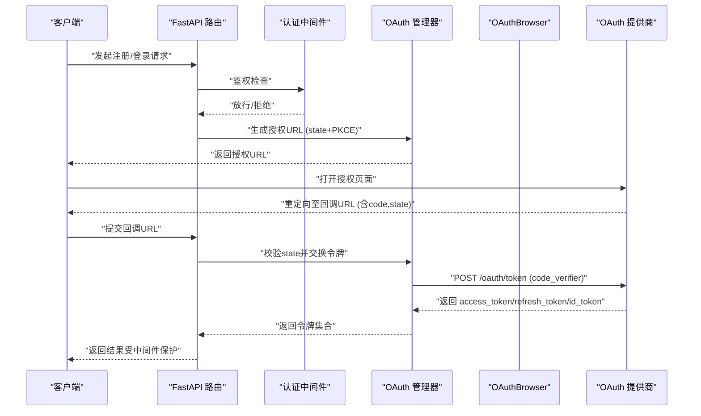
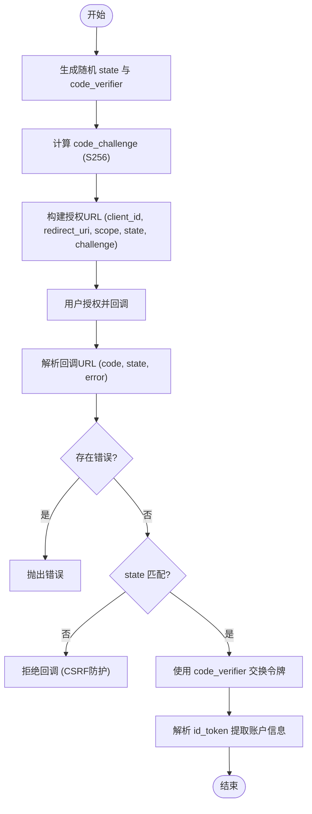
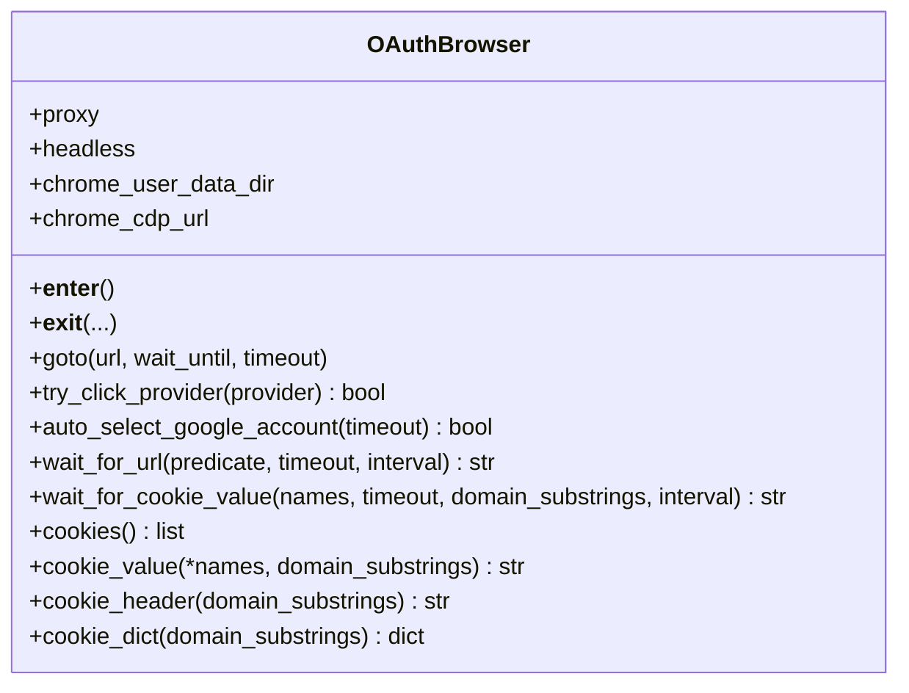
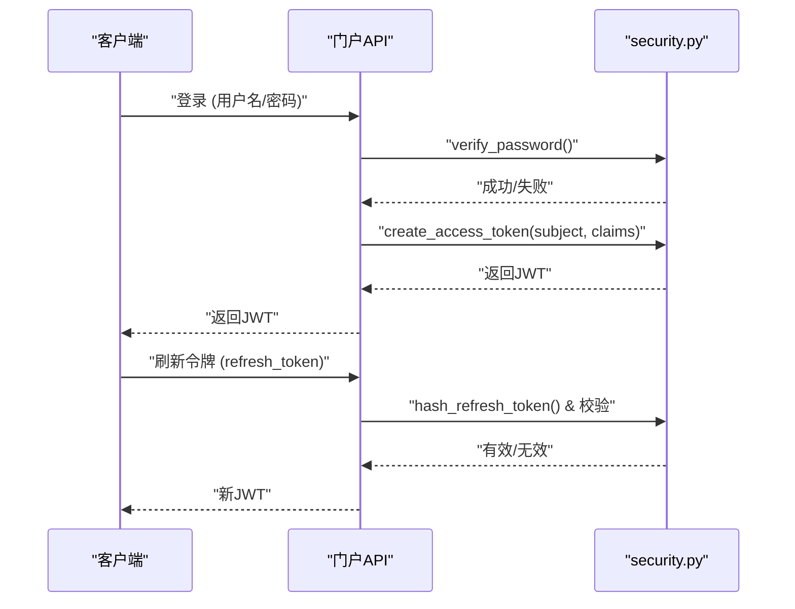
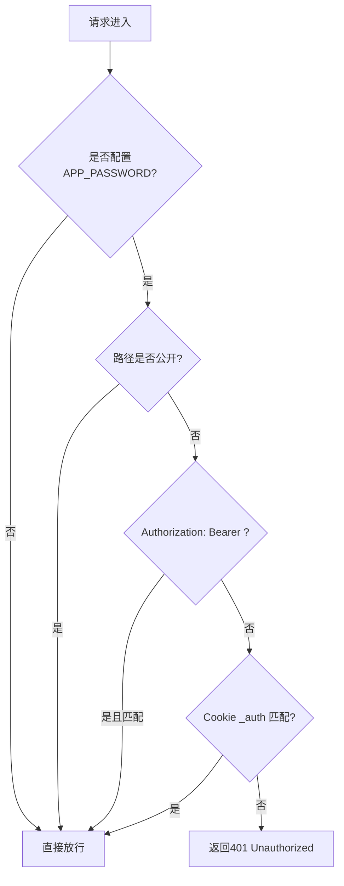
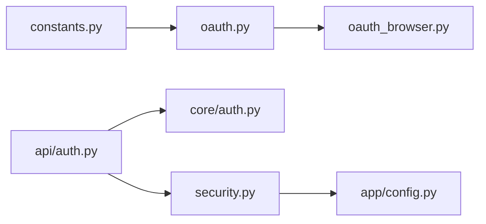

# OAuth安全最佳实践

<cite>
**本文引用的文件**
- [core/oauth_browser.py](file://core/oauth_browser.py)
- [platforms/chatgpt/oauth.py](file://platforms/chatgpt/oauth.py)
- [platforms/chatgpt/constants.py](file://platforms/chatgpt/constants.py)
- [customer_portal_api/app/security.py](file://customer_portal_api/app/security.py)
- [customer_portal_api/app/config.py](file://customer_portal_api/app/config.py)
- [core/auth.py](file://core/auth.py)
- [api/auth.py](file://api/auth.py)
- [core/tls.py](file://core/tls.py)
- [platforms/windsurf/switch.py](file://platforms/windsurf/switch.py)
- [tests/test_chatgpt_oauth_requirements.py](file://tests/test_chatgpt_oauth_requirements.py)
</cite>

## 目录
1. [简介](#简介)
2. [项目结构](#项目结构)
3. [核心组件](#核心组件)
4. [架构总览](#架构总览)
5. [详细组件分析](#详细组件分析)
6. [依赖关系分析](#依赖关系分析)
7. [性能与安全权衡](#性能与安全权衡)
8. [故障排查指南](#故障排查指南)
9. [结论](#结论)
10. [附录：合规与测试建议](#附录合规与测试建议)

## 简介
本指南围绕本项目中的OAuth集成实现，系统梳理安全风险与防护策略，覆盖CSRF、XSS、令牌劫持等常见威胁的防御方法；说明敏感信息加密存储、安全通信、权限最小化原则的实施；给出会话管理、超时控制、注销清理等安全机制；并提供安全审计、日志记录、异常监控的实现方案与合规性遵循建议。文档同时结合代码库中的具体实现进行解读，帮助读者在工程实践中落地安全最佳实践。

## 项目结构
- OAuth授权流程集中在平台层（如OpenAI/Codex）与通用浏览器辅助模块中，配合API网关的安全中间件完成鉴权与访问控制。
- 客户门户API提供JWT签发与校验能力，用于内部服务间或前后端鉴权。
- TLS工具模块提供对不安全请求的统一处理与告警抑制，便于在特定场景下可控地关闭证书校验。
- 配置与密钥通过环境变量注入，避免硬编码。

**图示来源**
- [core/auth.py:26-48](file://core/auth.py#L26-L48)
- [platforms/chatgpt/oauth.py:190-366](file://platforms/chatgpt/oauth.py#L190-L366)
- [platforms/chatgpt/constants.py:53-77](file://platforms/chatgpt/constants.py#L53-L77)
- [customer_portal_api/app/security.py:49-78](file://customer_portal_api/app/security.py#L49-L78)
- [customer_portal_api/app/config.py:6-18](file://customer_portal_api/app/config.py#L6-L18)

**章节来源**
- [core/auth.py:26-48](file://core/auth.py#L26-L48)
- [platforms/chatgpt/oauth.py:190-366](file://platforms/chatgpt/oauth.py#L190-L366)
- [platforms/chatgpt/constants.py:53-77](file://platforms/chatgpt/constants.py#L53-L77)
- [customer_portal_api/app/security.py:49-78](file://customer_portal_api/app/security.py#L49-L78)
- [customer_portal_api/app/config.py:6-18](file://customer_portal_api/app/config.py#L6-L18)

## 核心组件
- OAuth授权流程（PKCE + state）：生成授权URL时创建随机state与code_verifier，回调时严格校验state并交换令牌，降低CSRF与授权码泄露风险。
- 浏览器辅助（OAuthBrowser）：支持连接本地Chrome（CDP）、复用用户数据目录、自动选择账号、等待回调URL与Cookie，便于自动化登录与令牌获取。
- 门户鉴权（JWT）：使用HS256签名、设置过期时间、刷新令牌哈希存储，提供安全的会话管理能力。
- API鉴权中间件：基于Bearer Token或Cookie的简单口令保护，允许健康检查等公开路径免鉴权。
- TLS工具：统一处理verify=False的请求并抑制警告，便于调试但需在生产环境谨慎使用。

**章节来源**
- [platforms/chatgpt/oauth.py:190-366](file://platforms/chatgpt/oauth.py#L190-L366)
- [core/oauth_browser.py:139-393](file://core/oauth_browser.py#L139-L393)
- [customer_portal_api/app/security.py:49-90](file://customer_portal_api/app/security.py#L49-L90)
- [core/auth.py:26-48](file://core/auth.py#L26-L48)
- [core/tls.py:11-32](file://core/tls.py#L11-L32)

## 架构总览
下图展示了从前端/调用方到后端API、再到OAuth提供商的完整交互链路，以及令牌生命周期管理与安全控制点。

**图示来源**
- [platforms/chatgpt/oauth.py:190-366](file://platforms/chatgpt/oauth.py#L190-L366)
- [core/auth.py:26-48](file://core/auth.py#L26-L48)
- [core/oauth_browser.py:327-393](file://core/oauth_browser.py#L327-L393)

## 详细组件分析

### OAuth授权流程（PKCE + State）
- 生成授权URL时：
  - 使用密码学安全的随机数生成state与code_verifier。
  - 计算code_challenge（S256），确保授权码不可被猜测。
  - 明确指定redirect_uri与scope，遵循最小权限原则。
- 处理回调时：
  - 解析回调URL（query与fragment），提取code、state、error。
  - 严格校验state与预期值一致，防止CSRF攻击。
  - 使用code_verifier交换access_token/refresh_token/id_token。
  - 从id_token中提取账户信息（email、account_id）。

**图示来源**
- [platforms/chatgpt/oauth.py:190-366](file://platforms/chatgpt/oauth.py#L190-L366)

**章节来源**
- [platforms/chatgpt/oauth.py:190-366](file://platforms/chatgpt/oauth.py#L190-L366)

### 浏览器辅助（OAuthBrowser）
- 支持三种模式：
  - 连接已运行的Chrome（CDP）以复用会话。
  - 使用持久化上下文加载用户数据目录（携带Google/GitHub等登录态）。
  - 回退到普通Playwright Chromium。
- 关键能力：
  - 自动点击OAuth提供商按钮（按文本/属性评分匹配）。
  - 自动选择Google账号（当出现账号选择器时）。
  - 等待回调URL或特定Cookie值，便于无头/有头自动化流程。
  - 提供cookies()/cookie_value()/cookie_header()等方法，便于后续请求携带凭据。

**图示来源**
- [core/oauth_browser.py:139-393](file://core/oauth_browser.py#L139-L393)

**章节来源**
- [core/oauth_browser.py:139-393](file://core/oauth_browser.py#L139-L393)

### 门户鉴权（JWT与刷新令牌）
- 密码哈希：使用PBKDF2-SHA256，高迭代次数，盐值随机，防暴力破解。
- JWT签发：HS256签名，包含sub、iat、exp及自定义claims，设置合理的TTL。
- JWT校验：验证签名与过期时间，失败返回未授权。
- 刷新令牌：生成随机刷新令牌，存储其哈希值，避免明文泄露。

**图示来源**
- [customer_portal_api/app/security.py:26-90](file://customer_portal_api/app/security.py#L26-L90)

**章节来源**
- [customer_portal_api/app/security.py:26-90](file://customer_portal_api/app/security.py#L26-L90)
- [customer_portal_api/app/config.py:6-18](file://customer_portal_api/app/config.py#L6-L18)

### API鉴权中间件（Bearer/Cookie）
- 通过环境变量APP_PASSWORD启用口令保护。
- 支持Authorization: Bearer <password>或Cookie _auth=<password>。
- 公开路径（健康检查、就绪检查、/api/auth/*）无需鉴权，便于容器编排与健康探测。

**图示来源**
- [core/auth.py:26-48](file://core/auth.py#L26-L48)
- [api/auth.py:15-29](file://api/auth.py#L15-L29)

**章节来源**
- [core/auth.py:26-48](file://core/auth.py#L26-L48)
- [api/auth.py:15-29](file://api/auth.py#L15-L29)

### TLS与通信安全
- 提供insecure_request与mark_session_insecure，用于在开发/调试时禁用证书校验并抑制警告。
- 生产环境应默认开启TLS校验，仅在必要时临时关闭，并确保有审计与告警。

**章节来源**
- [core/tls.py:11-32](file://core/tls.py#L11-L32)

### 会话清理与注销
- 针对第三方应用（如Windsurf）的Electron安全存储数据库，提供清理旧session与auth缓存的能力，避免残留凭据导致越权访问。

**章节来源**
- [platforms/windsurf/switch.py:116-139](file://platforms/windsurf/switch.py#L116-L139)

## 依赖关系分析
- OAuth流程依赖：
  - constants.py定义OAuth端点、scope、重定向URI等配置。
  - oauth.py实现PKCE、state校验、令牌交换与ID Token解析。
  - oauth_browser.py提供浏览器自动化能力，辅助完成授权与回调捕获。
- 鉴权依赖：
  - core/auth.py为API层提供统一的Bearer/Cookie鉴权。
  - customer_portal_api/app/security.py提供JWT签发与校验。
  - customer_portal_api/app/config.py集中管理密钥与TTL等配置。

**图示来源**
- [platforms/chatgpt/constants.py:53-77](file://platforms/chatgpt/constants.py#L53-L77)
- [platforms/chatgpt/oauth.py:190-366](file://platforms/chatgpt/oauth.py#L190-L366)
- [core/oauth_browser.py:139-393](file://core/oauth_browser.py#L139-L393)
- [core/auth.py:26-48](file://core/auth.py#L26-L48)
- [customer_portal_api/app/security.py:49-78](file://customer_portal_api/app/security.py#L49-L78)
- [customer_portal_api/app/config.py:6-18](file://customer_portal_api/app/config.py#L6-L18)

**章节来源**
- [platforms/chatgpt/constants.py:53-77](file://platforms/chatgpt/constants.py#L53-L77)
- [platforms/chatgpt/oauth.py:190-366](file://platforms/chatgpt/oauth.py#L190-L366)
- [core/oauth_browser.py:139-393](file://core/oauth_browser.py#L139-L393)
- [core/auth.py:26-48](file://core/auth.py#L26-L48)
- [customer_portal_api/app/security.py:49-78](file://customer_portal_api/app/security.py#L49-L78)
- [customer_portal_api/app/config.py:6-18](file://customer_portal_api/app/config.py#L6-L18)

## 性能与安全权衡
- PKCE与state：增加少量计算开销，但显著提升安全性，建议始终启用。
- 浏览器自动化：CDP/持久化上下文可复用会话减少登录成本，但需注意隔离不同用户上下文，避免跨用户Cookie泄露。
- JWT TTL：较短的access token TTL可降低令牌劫持窗口，配合refresh token轮换提升安全性。
- TLS校验：生产环境必须开启，仅开发调试时可临时关闭并记录审计日志。

[本节为通用指导，不直接分析具体文件]

## 故障排查指南
- 回调state不匹配：检查授权URL生成与回调处理是否共享同一state，确认未发生重放或篡改。
- 令牌交换失败：核对client_id、redirect_uri、code_verifier与scope一致性，检查网络代理与证书校验。
- 鉴权失败：确认APP_PASSWORD配置正确，Authorization头或_auth Cookie格式无误。
- 浏览器自动化异常：检查CDP端口连通性、Chrome用户数据目录是否存在、账号选择器是否变化。
- 会话残留：清理第三方应用的Electron安全存储数据库中的旧session与auth缓存。

**章节来源**
- [platforms/chatgpt/oauth.py:240-320](file://platforms/chatgpt/oauth.py#L240-L320)
- [core/auth.py:26-48](file://core/auth.py#L26-L48)
- [core/oauth_browser.py:63-113](file://core/oauth_browser.py#L63-L113)
- [platforms/windsurf/switch.py:116-139](file://platforms/windsurf/switch.py#L116-L139)

## 结论
本项目在OAuth集成中采用了PKCE与state校验、浏览器自动化辅助、JWT签发与校验、API鉴权中间件等安全措施，覆盖了常见的授权与鉴权场景。建议在以下方面持续强化：
- 严格限制scope，遵循最小权限原则。
- 对所有敏感配置（密钥、密码、TTL）采用环境变量注入，禁止硬编码。
- 生产环境强制TLS校验，禁用不安全请求。
- 完善日志与审计，记录授权失败、令牌交换异常与鉴权拒绝事件。
- 定期执行安全测试与漏洞扫描，确保依赖与配置符合合规要求。

[本节为总结性内容，不直接分析具体文件]

## 附录：合规与测试建议
- 合规性遵循：
  - 数据最小化：仅收集必要的用户标识与邮箱，避免过度采集。
  - 令牌安全：access token短期有效，refresh token哈希存储，定期轮换。
  - 传输安全：强制HTTPS/TLS，禁用弱加密套件。
  - 审计与留痕：记录授权流程关键步骤与异常事件，保留合理时长。
- 安全测试与漏洞扫描：
  - 单元测试覆盖state校验、PKCE流程、JWT校验逻辑。
  - 集成测试模拟授权回调与令牌交换，验证异常分支。
  - 渗透测试关注CSRF、XSS、令牌劫持、重放攻击。
  - 依赖扫描检测已知漏洞，及时升级依赖。

**章节来源**
- [tests/test_chatgpt_oauth_requirements.py:16-107](file://tests/test_chatgpt_oauth_requirements.py#L16-L107)