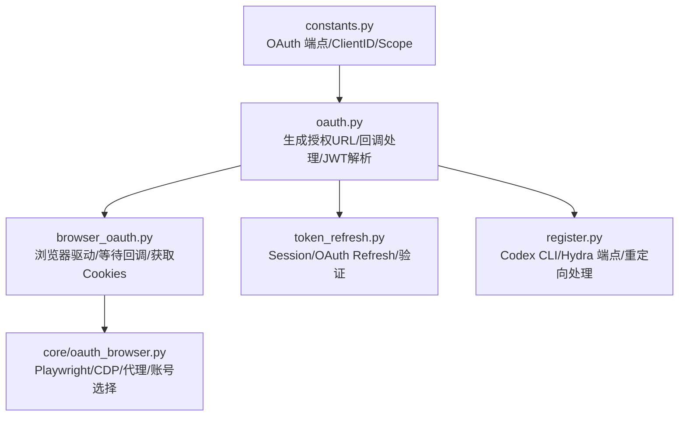
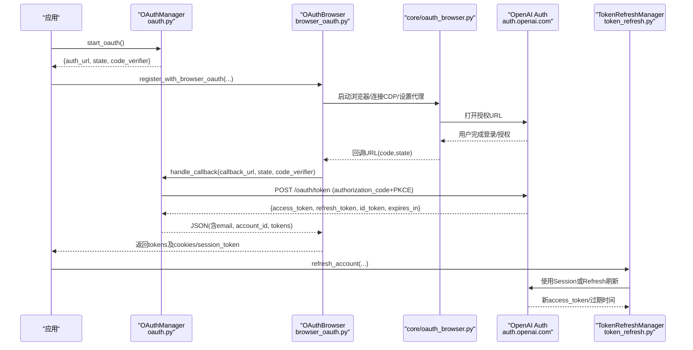
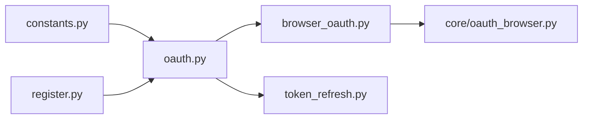

# ChatGPT OAuth集成

<cite>
**本文引用的文件**
- [platforms/chatgpt/oauth.py](file://platforms/chatgpt/oauth.py)
- [platforms/chatgpt/constants.py](file://platforms/chatgpt/constants.py)
- [platforms/chatgpt/browser_oauth.py](file://platforms/chatgpt/browser_oauth.py)
- [core/oauth_browser.py](file://core/oauth_browser.py)
- [platforms/chatgpt/token_refresh.py](file://platforms/chatgpt/token_refresh.py)
- [platforms/chatgpt/register.py](file://platforms/chatgpt/register.py)
- [tests/test_chatgpt_oauth_requirements.py](file://tests/test_chatgpt_oauth_requirements.py)
</cite>

## 目录
1. [简介](#简介)
2. [项目结构](#项目结构)
3. [核心组件](#核心组件)
4. [架构总览](#架构总览)
5. [详细组件分析](#详细组件分析)
6. [依赖关系分析](#依赖关系分析)
7. [性能与网络特性](#性能与网络特性)
8. [故障排查指南](#故障排查指南)
9. [结论](#结论)
10. [附录：完整流程示例（代码片段路径）](#附录完整流程示例代码片段路径)

## 简介
本文件面向需要在系统中实现 ChatGPT/OpenAI OAuth 集成的开发者，系统性说明 OpenAI 平台的 OAuth 配置、授权与令牌交换流程、Codex CLI 的特殊处理、Hydra 端点的使用、JWT ID Token 的解析与账户信息提取（email、account_id）、以及代理支持与网络错误处理。文档同时提供端到端的流程示意和关键代码片段路径，便于快速定位实现细节。

## 项目结构
围绕 ChatGPT OAuth 的核心代码主要分布在以下模块：
- 常量与端点定义：platforms/chatgpt/constants.py
- OAuth 流程与工具：platforms/chatgpt/oauth.py
- 浏览器自动化与回调捕获：platforms/chatgpt/browser_oauth.py + core/oauth_browser.py
- Token 刷新与验证：platforms/chatgpt/token_refresh.py
- Codex CLI 特殊流程与 Hydra 端点：platforms/chatgpt/register.py
- 测试用例（校验完整性要求等）：tests/test_chatgpt_oauth_requirements.py

图表来源
- [platforms/chatgpt/constants.py:53-69](file://platforms/chatgpt/constants.py#L53-L69)
- [platforms/chatgpt/oauth.py:190-320](file://platforms/chatgpt/oauth.py#L190-L320)
- [platforms/chatgpt/browser_oauth.py:44-110](file://platforms/chatgpt/browser_oauth.py#L44-L110)
- [core/oauth_browser.py:139-213](file://core/oauth_browser.py#L139-L213)
- [platforms/chatgpt/token_refresh.py:37-206](file://platforms/chatgpt/token_refresh.py#L37-L206)
- [platforms/chatgpt/register.py:1045-1065](file://platforms/chatgpt/register.py#L1045-L1065)

章节来源
- [platforms/chatgpt/constants.py:53-69](file://platforms/chatgpt/constants.py#L53-L69)
- [platforms/chatgpt/oauth.py:190-320](file://platforms/chatgpt/oauth.py#L190-L320)
- [platforms/chatgpt/browser_oauth.py:44-110](file://platforms/chatgpt/browser_oauth.py#L44-L110)
- [core/oauth_browser.py:139-213](file://core/oauth_browser.py#L139-L213)
- [platforms/chatgpt/token_refresh.py:37-206](file://platforms/chatgpt/token_refresh.py#L37-L206)
- [platforms/chatgpt/register.py:1045-1065](file://platforms/chatgpt/register.py#L1045-L1065)

## 核心组件
- OAuth 常量与端点：集中管理 Client ID、授权 URL、令牌端点、回调地址、Scope、Codex 专用参数等。
- OAuth 管理器：负责生成授权 URL（含 PKCE）、处理回调并换取访问令牌、从 ID Token 解析 email 与 account_id。
- 浏览器 OAuth 流程：使用 Playwright/CDP 打开授权页、自动选择第三方登录、等待回调 URL、抓取会话 Cookie。
- Token 刷新：支持 Session Token 与 OAuth Refresh Token 两种刷新方式，并提供 token 有效性校验。
- Codex CLI 特殊处理：针对 Codex 客户端使用 Hydra 端点 /oauth/authorize，并附加特定参数以简化流程。

章节来源
- [platforms/chatgpt/constants.py:53-69](file://platforms/chatgpt/constants.py#L53-L69)
- [platforms/chatgpt/oauth.py:180-379](file://platforms/chatgpt/oauth.py#L180-L379)
- [platforms/chatgpt/browser_oauth.py:44-110](file://platforms/chatgpt/browser_oauth.py#L44-L110)
- [platforms/chatgpt/token_refresh.py:37-206](file://platforms/chatgpt/token_refresh.py#L37-L206)
- [platforms/chatgpt/register.py:1045-1065](file://platforms/chatgpt/register.py#L1045-L1065)

## 架构总览
下图展示了从“开始授权”到“获取令牌并解析账户信息”，再到“刷新令牌”的整体数据流与控制流。

图表来源
- [platforms/chatgpt/oauth.py:190-320](file://platforms/chatgpt/oauth.py#L190-L320)
- [platforms/chatgpt/browser_oauth.py:44-110](file://platforms/chatgpt/browser_oauth.py#L44-L110)
- [core/oauth_browser.py:139-213](file://core/oauth_browser.py#L139-L213)
- [platforms/chatgpt/token_refresh.py:66-206](file://platforms/chatgpt/token_refresh.py#L66-L206)

## 详细组件分析

### OAuth 常量与端点配置
- 基础域名与端点：
  - OPENAI_AUTH：认证服务基础域，默认 https://auth.openai.com，可通过环境变量覆盖。
  - OAUTH_AUTH_URL：/api/accounts/authorize（常规授权）。
  - OAUTH_TOKEN_URL：/oauth/token（令牌交换）。
  - OAUTH_REDIRECT_URI：https://chatgpt.com/api/auth/callback/openai。
  - OAUTH_SCOPE：包含 openid、email、profile、offline_access 及模型/组织相关权限。
- Codex CLI 专用：
  - CODEX_CLIENT_ID：用于令牌交换的公开客户端。
  - CODEX_REDIRECT_URI：http://localhost:1455/auth/callback。
  - CODEX_SCOPE：openid、email、profile、offline_access。
- 其他：Sentinel 防护、页面类型、邮箱服务等常量。

章节来源
- [platforms/chatgpt/constants.py:53-69](file://platforms/chatgpt/constants.py#L53-L69)

### OAuth 流程：授权开始与回调处理
- 授权开始（generate_oauth_url）：
  - 生成随机 state 与 PKCE code_verifier，计算 code_challenge（S256）。
  - 根据 client_id 区分：
    - 若为 CODEX_CLIENT_ID：使用 Hydra 端点 /oauth/authorize，并添加 id_token_add_organizations=true、codex_cli_simplified_flow=true。
    - 否则：使用常规授权端点，并追加 screen_hint=login_or_signup。
  - 返回 OAuthStart（auth_url、state、code_verifier、redirect_uri、client_id）。
- 回调处理（submit_callback_url）：
  - 解析回调 URL（query/fragment），校验 error/state/code。
  - 向 /oauth/token 提交 authorization_code 请求（含 code_verifier）。
  - 解析响应中的 access_token、refresh_token、id_token、expires_in。
  - 从 ID Token 中解析 email 与 account_id（见下节）。
  - 返回包含令牌与账户信息的 JSON。

章节来源
- [platforms/chatgpt/oauth.py:190-320](file://platforms/chatgpt/oauth.py#L190-L320)

### JWT ID Token 解析与账户信息提取
- _jwt_claims_no_verify：对 ID Token 进行 Base64 URL 解码（不验签），提取 payload。
- extract_account_info：从 claims 中提取 email 与 account_id（位于 https://api.openai.com/auth.chatgpt_account_id）。
- 注意：该解析不验证签名，仅用于本地提取；生产环境应结合服务端校验。

章节来源
- [platforms/chatgpt/oauth.py:91-114](file://platforms/chatgpt/oauth.py#L91-L114)
- [platforms/chatgpt/oauth.py:368-379](file://platforms/chatgpt/oauth.py#L368-L379)

### 浏览器 OAuth 流程（Playwright/CDP）
- 启动浏览器：
  - 支持普通 Playwright Chromium、Chrome Profile（持久化上下文）、CDP 连接已运行 Chrome。
  - 自动检测系统 Chrome 并尝试重启开启调试端口。
  - 支持代理配置（HTTP/SOCKS5，含用户名密码）。
- 交互与等待：
  - goto 授权 URL，可选自动点击第三方登录按钮（Google/GitHub 等）。
  - wait_for_url 等待回调 URL（包含 code）。
  - 自动选择 Google 账号（当出现账号选择器时）。
- 结果收集：
  - 调用 OAuthManager.handle_callback 换取令牌。
  - 抓取 __Secure-next-auth.session-token 与 cookies（chatgpt.com/openai.com）。
  - 通过后端 /backend-api/me 获取 profile 信息，最终确定 email。

章节来源
- [platforms/chatgpt/browser_oauth.py:44-110](file://platforms/chatgpt/browser_oauth.py#L44-L110)
- [core/oauth_browser.py:139-213](file://core/oauth_browser.py#L139-L213)
- [core/oauth_browser.py:245-325](file://core/oauth_browser.py#L245-L325)
- [core/oauth_browser.py:327-393](file://core/oauth_browser.py#L327-L393)

### Codex CLI 特殊处理与 Hydra 端点
- 在生成授权 URL 时，若 client_id 为 CODEX_CLIENT_ID：
  - 使用 Hydra 端点 /oauth/authorize。
  - 添加 id_token_add_organizations=true 与 codex_cli_simplified_flow=true。
- 在注册流程中，会重新访问授权 URL 以获取 Codex CLI 的回调 URL（可能经过多次重定向），然后使用该回调换取令牌。

章节来源
- [platforms/chatgpt/oauth.py:221-230](file://platforms/chatgpt/oauth.py#L221-L230)
- [platforms/chatgpt/register.py:1045-1065](file://platforms/chatgpt/register.py#L1045-L1065)
- [platforms/chatgpt/register.py:1505-1515](file://platforms/chatgpt/register.py#L1505-L1515)

### Token 刷新与验证
- 两种方式：
  - Session Token 刷新：设置 __Secure-next-auth.session-token 后访问 /api/auth/session，获取 accessToken 与过期时间。
  - OAuth Refresh Token 刷新：POST /oauth/token，grant_type=refresh_token，可更新 refresh_token。
- 优先级：优先尝试 Session Token，失败再尝试 OAuth Refresh Token。
- 验证：调用 /backend-api/me，根据状态码判断是否有效（200 有效，401 无效/过期，403 可能封禁）。

章节来源
- [platforms/chatgpt/token_refresh.py:66-206](file://platforms/chatgpt/token_refresh.py#L66-L206)
- [platforms/chatgpt/token_refresh.py:245-278](file://platforms/chatgpt/token_refresh.py#L245-L278)

### 代理支持与网络错误处理
- HTTP 层：
  - 使用 curl_cffi 发送请求，支持 impersonate="chrome"/"chrome120"/"chrome124" 模拟浏览器指纹。
  - 支持传入 proxy_url（http/https），构建 proxies 字典。
- 浏览器层：
  - 支持 Playwright 代理配置（server、username、password）。
  - 支持 CDP 连接与 Chrome Profile，均能携带代理。
- 错误处理：
  - 令牌交换失败抛出 RuntimeError（包含状态码与响应体）。
  - 网络异常捕获 RequestsError 并转换为 RuntimeError。
  - Token 刷新失败记录日志并返回失败结果。

章节来源
- [platforms/chatgpt/oauth.py:125-178](file://platforms/chatgpt/oauth.py#L125-L178)
- [core/oauth_browser.py:116-127](file://core/oauth_browser.py#L116-L127)
- [platforms/chatgpt/token_refresh.py:99-132](file://platforms/chatgpt/token_refresh.py#L99-L132)

## 依赖关系分析
- oauth.py 依赖 constants.py 提供的端点与 Client ID。
- browser_oauth.py 依赖 core/oauth_browser.py 的浏览器能力与工具函数。
- token_refresh.py 独立于浏览器，直接调用 OpenAI 端点进行刷新与验证。
- register.py 在特定场景下复用 oauth.py 的 submit_callback_url 处理 Codex CLI 回调。

图表来源
- [platforms/chatgpt/constants.py:53-69](file://platforms/chatgpt/constants.py#L53-L69)
- [platforms/chatgpt/oauth.py:190-320](file://platforms/chatgpt/oauth.py#L190-L320)
- [platforms/chatgpt/browser_oauth.py:44-110](file://platforms/chatgpt/browser_oauth.py#L44-L110)
- [core/oauth_browser.py:139-213](file://core/oauth_browser.py#L139-L213)
- [platforms/chatgpt/token_refresh.py:66-206](file://platforms/chatgpt/token_refresh.py#L66-L206)
- [platforms/chatgpt/register.py:1045-1065](file://platforms/chatgpt/register.py#L1045-L1065)

章节来源
- [platforms/chatgpt/constants.py:53-69](file://platforms/chatgpt/constants.py#L53-L69)
- [platforms/chatgpt/oauth.py:190-320](file://platforms/chatgpt/oauth.py#L190-L320)
- [platforms/chatgpt/browser_oauth.py:44-110](file://platforms/chatgpt/browser_oauth.py#L44-L110)
- [core/oauth_browser.py:139-213](file://core/oauth_browser.py#L139-L213)
- [platforms/chatgpt/token_refresh.py:66-206](file://platforms/chatgpt/token_refresh.py#L66-L206)
- [platforms/chatgpt/register.py:1045-1065](file://platforms/chatgpt/register.py#L1045-L1065)

## 性能与网络特性
- 浏览器模式：
  - 支持无头/有头模式；CDP 连接可减少启动开销。
  - 自动重试与超时控制（等待回调、Cookie 等）。
- HTTP 请求：
  - 使用 curl_cffi 模拟真实浏览器指纹，降低被风控概率。
  - 支持代理池与超时配置，提高稳定性。
- Token 刷新：
  - 优先使用 Session Token（更快），失败回退至 OAuth Refresh Token。
  - 验证接口调用轻量，适合周期性健康检查。

[本节为通用指导，无需具体文件引用]

## 故障排查指南
- 回调缺少必要参数：
  - 现象：抛出 ValueError（缺少 ?code= 或 ?state=）。
  - 排查：确认浏览器是否正确跳转至回调地址，且 state 匹配。
- State 不匹配：
  - 现象：抛出 ValueError（state mismatch）。
  - 排查：确保每次授权生成的 state 与回调一致。
- 网络错误：
  - 现象：抛出 RuntimeError（network error）。
  - 排查：检查代理配置、DNS、防火墙、目标域名可达性。
- Token 刷新失败：
  - 现象：返回失败结果并记录错误消息。
  - 排查：确认 session_token/refresh_token 是否有效，必要时重新走授权流程。
- 邮箱不一致：
  - 现象：finalize_oauth_email 抛出运行时错误（实际与预期不一致）。
  - 排查：确认 email_hint 与实际登录邮箱一致。

章节来源
- [platforms/chatgpt/oauth.py:269-280](file://platforms/chatgpt/oauth.py#L269-L280)
- [platforms/chatgpt/oauth.py:169-178](file://platforms/chatgpt/oauth.py#L169-L178)
- [platforms/chatgpt/token_refresh.py:99-132](file://platforms/chatgpt/token_refresh.py#L99-L132)
- [core/oauth_browser.py:48-60](file://core/oauth_browser.py#L48-L60)

## 结论
本集成实现了完整的 ChatGPT/OpenAI OAuth 流程，涵盖授权开始、回调处理、令牌交换、JWT 解析、账户信息提取、Codex CLI 特殊处理与 Hydra 端点、Token 刷新与验证、代理支持与网络错误处理。通过模块化设计与清晰的职责划分，既保证了安全性与稳定性，也提供了良好的可扩展性与可维护性。

[本节为总结，无需具体文件引用]

## 附录：完整流程示例（代码片段路径）
以下为端到端流程的关键步骤与对应代码片段路径（不包含具体代码内容）：

- 配置与初始化
  - 读取常量与端点：[platforms/chatgpt/constants.py:53-69](file://platforms/chatgpt/constants.py#L53-L69)
  - 创建 OAuthManager：[platforms/chatgpt/oauth.py:323-348](file://platforms/chatgpt/oauth.py#L323-L348)

- 开始授权
  - 生成授权 URL（含 PKCE）：[platforms/chatgpt/oauth.py:190-237](file://platforms/chatgpt/oauth.py#L190-L237)
  - 浏览器打开授权页：[platforms/chatgpt/browser_oauth.py:55-81](file://platforms/chatgpt/browser_oauth.py#L55-L81)
  - 浏览器辅助（Playwright/CDP/代理）：[core/oauth_browser.py:139-213](file://core/oauth_browser.py#L139-L213)

- 回调处理与令牌交换
  - 等待回调 URL：[platforms/chatgpt/browser_oauth.py:78-89](file://platforms/chatgpt/browser_oauth.py#L78-L89)
  - 提交回调并换取令牌：[platforms/chatgpt/oauth.py:240-320](file://platforms/chatgpt/oauth.py#L240-L320)
  - 解析 ID Token 提取 email/account_id：[platforms/chatgpt/oauth.py:91-114](file://platforms/chatgpt/oauth.py#L91-L114), [platforms/chatgpt/oauth.py:368-379](file://platforms/chatgpt/oauth.py#L368-L379)

- 后续操作
  - 获取会话 Cookie 与 profile：[platforms/chatgpt/browser_oauth.py:91-110](file://platforms/chatgpt/browser_oauth.py#L91-L110)
  - Token 刷新（Session/OAuth）：[platforms/chatgpt/token_refresh.py:66-206](file://platforms/chatgpt/token_refresh.py#L66-L206)
  - 验证 Token 有效性：[platforms/chatgpt/token_refresh.py:245-278](file://platforms/chatgpt/token_refresh.py#L245-L278)

- Codex CLI 特殊流程
  - Hydra 端点与参数：[platforms/chatgpt/oauth.py:221-230](file://platforms/chatgpt/oauth.py#L221-L230)
  - 获取 Codex 回调并重定向处理：[platforms/chatgpt/register.py:1045-1065](file://platforms/chatgpt/register.py#L1045-L1065)
  - 使用 Codex Client ID 交换令牌：[platforms/chatgpt/register.py:1505-1515](file://platforms/chatgpt/register.py#L1505-L1515)

- 测试与校验
  - 完整 OAuth callback 校验：[tests/test_chatgpt_oauth_requirements.py:16-32](file://tests/test_chatgpt_oauth_requirements.py#L16-L32)

[本节为指引，无需具体代码内容]