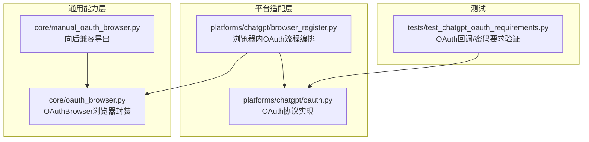
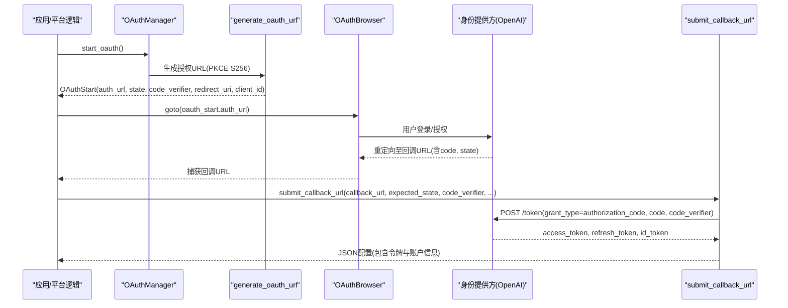
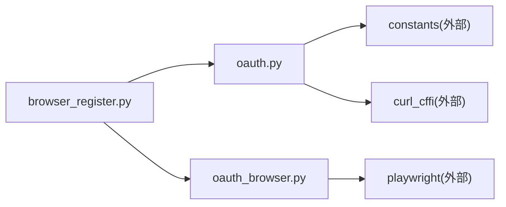

# OAuth基础架构

<cite>
**本文引用的文件**
- [platforms/chatgpt/oauth.py](file://platforms/chatgpt/oauth.py)
- [core/oauth_browser.py](file://core/oauth_browser.py)
- [core/manual_oauth_browser.py](file://core/manual_oauth_browser.py)
- [platforms/chatgpt/browser_register.py](file://platforms/chatgpt/browser_register.py)
- [tests/test_chatgpt_oauth_requirements.py](file://tests/test_chatgpt_oauth_requirements.py)
</cite>

## 目录
1. [简介](#简介)
2. [项目结构](#项目结构)
3. [核心组件](#核心组件)
4. [架构总览](#架构总览)
5. [详细组件分析](#详细组件分析)
6. [依赖关系分析](#依赖关系分析)
7. [性能考虑](#性能考虑)
8. [故障排查指南](#故障排查指南)
9. [结论](#结论)
10. [附录](#附录)

## 简介
本文件面向OAuth授权流程的基础架构与实现，重点说明：
- OAuth授权流程的核心组件与设计模式
- PKCE（Proof Key for Code Exchange）机制的实现原理与安全优势
- OAuth状态管理、回调处理、令牌交换等关键流程
- OAuthStart数据类的设计与使用方式
- generate_oauth_url 与 submit_callback_url 的实现细节
- OAuthManager类的扩展指南与最佳实践
- 错误处理、异常捕获与日志记录的最佳实践

## 项目结构
本项目将OAuth能力集中在平台适配层与通用浏览器辅助层中：
- 平台适配层（以ChatGPT为例）提供OAuth协议实现、PKCE参数生成、回调解析与令牌交换
- 通用浏览器辅助层提供跨平台的浏览器自动化能力，用于驱动真实或无头浏览器完成OAuth交互
- 测试用例覆盖OAuth回调完整性校验与密码强度等要求

图表来源
- [platforms/chatgpt/oauth.py:180-379](file://platforms/chatgpt/oauth.py#L180-L379)
- [platforms/chatgpt/browser_register.py:1600-1799](file://platforms/chatgpt/browser_register.py#L1600-L1799)
- [core/oauth_browser.py:139-459](file://core/oauth_browser.py#L139-L459)
- [core/manual_oauth_browser.py:1-13](file://core/manual_oauth_browser.py#L1-L13)
- [tests/test_chatgpt_oauth_requirements.py:16-33](file://tests/test_chatgpt_oauth_requirements.py#L16-L33)

章节来源
- [platforms/chatgpt/oauth.py:180-379](file://platforms/chatgpt/oauth.py#L180-L379)
- [core/oauth_browser.py:139-459](file://core/oauth_browser.py#L139-L459)
- [platforms/chatgpt/browser_register.py:1600-1799](file://platforms/chatgpt/browser_register.py#L1600-L1799)
- [tests/test_chatgpt_oauth_requirements.py:16-33](file://tests/test_chatgpt_oauth_requirements.py#L16-L33)

## 核心组件
- OAuthStart：不可变数据类，承载授权开始阶段的关键信息（授权URL、state、code_verifier、redirect_uri、client_id），用于在浏览器与后端之间安全传递。
- generate_oauth_url：生成符合PKCE的授权URL，并返回OAuthStart对象。
- submit_callback_url：解析回调URL，校验state，使用authorization_code + code_verifier换取访问令牌，并提取账户信息。
- OAuthManager：高层管理器，封装start_oauth与handle_callback，便于上层调用。
- OAuthBrowser：浏览器自动化封装，支持连接本地Chrome、复用用户数据目录、CDP连接、自动选择Google账号、等待回调URL等。

章节来源
- [platforms/chatgpt/oauth.py:180-379](file://platforms/chatgpt/oauth.py#L180-L379)
- [core/oauth_browser.py:139-459](file://core/oauth_browser.py#L139-L459)

## 架构总览
下图展示了从“发起授权”到“回调换令牌”的端到端流程，以及各组件之间的协作关系。

图表来源
- [platforms/chatgpt/oauth.py:190-320](file://platforms/chatgpt/oauth.py#L190-L320)
- [platforms/chatgpt/browser_register.py:1703-1750](file://platforms/chatgpt/browser_register.py#L1703-L1750)
- [core/oauth_browser.py:327-341](file://core/oauth_browser.py#L327-L341)

## 详细组件分析

### OAuthStart数据类
- 设计要点
  - 使用不可变数据类，确保授权上下文在传输过程中不被篡改
  - 字段包括授权URL、state、code_verifier、redirect_uri、client_id
  - 通过generate_oauth_url统一生成，避免手工拼接导致的安全隐患
- 使用方式
  - 上层调用generate_oauth_url获取OAuthStart
  - 将auth_url交给浏览器导航，保存state与code_verifier用于后续回调校验与令牌交换

章节来源
- [platforms/chatgpt/oauth.py:180-237](file://platforms/chatgpt/oauth.py#L180-L237)

### generate_oauth_url函数
- 功能概述
  - 生成随机state与code_verifier
  - 计算code_challenge（SHA256后Base64 URL编码，无填充）
  - 构造授权请求参数（client_id、response_type、redirect_uri、scope、state、code_challenge、code_challenge_method等）
  - 根据client_id选择不同授权端点（例如Codex CLI走Hydra端点）
  - 返回OAuthStart对象
- 安全特性
  - 使用加密安全的随机数生成器
  - 强制S256方法，防止降级攻击
  - 通过state防CSRF，通过code_verifier防授权码拦截

章节来源
- [platforms/chatgpt/oauth.py:190-237](file://platforms/chatgpt/oauth.py#L190-L237)

### submit_callback_url函数
- 功能概述
  - 解析回调URL，提取code、state、error等参数
  - 校验state与预期值一致，否则抛出异常
  - 向令牌端点发送POST表单（grant_type=authorization_code，附带code、code_verifier、redirect_uri、client_id）
  - 解析响应，提取access_token、refresh_token、id_token及过期时间
  - 从ID Token中解析邮箱与账户ID，组装配置JSON返回
- 错误处理
  - 当回调包含error时抛出运行时错误
  - 缺少必要参数或state不匹配时抛出值错误
  - 网络或HTTP错误包装为运行时错误

章节来源
- [platforms/chatgpt/oauth.py:240-320](file://platforms/chatgpt/oauth.py#L240-L320)

### OAuthManager类
- 职责
  - 封装OAuth流程的入口与回调处理
  - 提供start_oauth与handle_callback两个主要方法
  - 支持代理配置与自定义端点
- 扩展建议
  - 可注入不同的client_id、scope、redirect_uri以适应多租户或多客户端
  - 可替换令牌端点以适配不同提供商
  - 可在handle_callback前后加入审计日志与指标上报

章节来源
- [platforms/chatgpt/oauth.py:323-379](file://platforms/chatgpt/oauth.py#L323-L379)

### 浏览器侧OAuth流程（browser_register）
- 流程要点
  - 在真实浏览器中打开授权URL，跟踪页面跳转与状态变化
  - 支持邮箱输入、密码提交、OTP验证、同意页、工作区选择等步骤
  - 当检测到回调URL（含code）时，调用submit_callback_url完成令牌交换
  - 若直接捕获回调（如异常中的localhost回调），也能正确解析并换令牌
- 状态管理
  - 通过page_type与continue_url推进流程
  - 对consent、workspace_selection等页面进行特殊处理
  - 失败时提取错误文本并向上抛出

章节来源
- [platforms/chatgpt/browser_register.py:1600-1799](file://platforms/chatgpt/browser_register.py#L1600-L1799)

### OAuthBrowser浏览器封装
- 能力
  - 支持连接已运行的Chrome（CDP）、复用用户数据目录、或启动Playwright Chromium
  - 自动检测系统Chrome并尝试重启带调试端口
  - 提供wait_for_url、cookie_value、cookie_header等工具方法
  - 自动点击Google账号选择器，提升用户体验
- 集成方式
  - 上层负责导航到授权URL并监听回调URL
  - 通过cookies与页面状态判断流程进度

章节来源
- [core/oauth_browser.py:139-459](file://core/oauth_browser.py#L139-L459)

### PKCE机制与安全优势
- 实现原理
  - 客户端生成code_verifier（随机字符串）
  - 计算code_challenge = Base64URL(SHA256(code_verifier))
  - 授权请求携带code_challenge与method=S256
  - 回调换令牌时提交原始code_verifier供服务端校验
- 安全优势
  - 防止授权码被第三方截获后滥用（即使有code，没有code_verifier也无法换令牌）
  - 适用于公共客户端（如SPA、移动应用）场景
  - 与state共同抵御CSRF与重放攻击

章节来源
- [platforms/chatgpt/oauth.py:26-43](file://platforms/chatgpt/oauth.py#L26-L43)
- [platforms/chatgpt/oauth.py:190-237](file://platforms/chatgpt/oauth.py#L190-L237)
- [platforms/chatgpt/oauth.py:240-320](file://platforms/chatgpt/oauth.py#L240-L320)

### 错误处理、异常捕获与日志记录最佳实践
- 回调解析与校验
  - 解析回调URL时统一提取code、state、error等字段，兼容查询串与片段
  - 严格校验state，缺失或不匹配立即报错，避免会话劫持
- 令牌交换
  - HTTP非200或网络异常均抛出运行时错误，便于上层统一处理
  - 对ID Token进行安全解析（不验签仅读取claims），提取邮箱与账户ID
- 浏览器流程
  - 对邮箱输入、密码提交、OTP验证等步骤设置超时与回退策略
  - 捕获异常并提取回调URL，保证即使异常路径也能完成换令牌
- 日志记录
  - 关键节点输出状态与URL片段，便于定位问题
  - 错误信息包含上下文（如页面类型、当前URL、错误文本）

章节来源
- [platforms/chatgpt/oauth.py:46-101](file://platforms/chatgpt/oauth.py#L46-L101)
- [platforms/chatgpt/oauth.py:125-178](file://platforms/chatgpt/oauth.py#L125-L178)
- [platforms/chatgpt/browser_register.py:1631-1700](file://platforms/chatgpt/browser_register.py#L1631-L1700)

## 依赖关系分析
- 模块耦合
  - browser_register依赖oauth模块进行令牌交换
  - oauth模块依赖常量配置（client_id、端点、scope、redirect_uri）
  - browser_register依赖oauth_browser进行浏览器自动化
- 外部依赖
  - 使用curl_cffi发送HTTP请求，支持代理与浏览器指纹伪装
  - 使用Playwright控制浏览器，支持多种运行模式

图表来源
- [platforms/chatgpt/browser_register.py:1600-1799](file://platforms/chatgpt/browser_register.py#L1600-L1799)
- [platforms/chatgpt/oauth.py:125-178](file://platforms/chatgpt/oauth.py#L125-L178)
- [core/oauth_browser.py:139-213](file://core/oauth_browser.py#L139-L213)

章节来源
- [platforms/chatgpt/browser_register.py:1600-1799](file://platforms/chatgpt/browser_register.py#L1600-L1799)
- [platforms/chatgpt/oauth.py:125-178](file://platforms/chatgpt/oauth.py#L125-L178)
- [core/oauth_browser.py:139-213](file://core/oauth_browser.py#L139-L213)

## 性能考虑
- 浏览器复用
  - 优先连接已运行的Chrome（CDP）或复用用户数据目录，减少启动开销
  - 在无头模式下需确保具备必要的浏览器会话能力
- 网络优化
  - 合理设置超时与重试策略，避免阻塞
  - 使用代理时注意代理稳定性与延迟
- 令牌缓存与刷新
  - 基于expires_in计算过期时间，结合refresh_token实现静默刷新
  - 避免重复换令牌，降低对外部服务的压力

[本节为通用指导，不直接分析具体文件]

## 故障排查指南
- 常见错误
  - 回调URL缺少code或state：检查授权流程是否完整，确认state传递是否正确
  - state不匹配：确认前后端state一致，避免跨会话或并发问题
  - 令牌交换失败：检查网络、代理、client_id与redirect_uri配置
- 浏览器问题
  - 无法找到邮箱输入框或继续按钮：检查页面结构与选择器
  - Google账号选择器未自动点击：确认是否在Chrome Profile模式且已登录
- 日志定位
  - 关注OAuth状态步骤日志与当前URL
  - 捕获异常中的回调URL，必要时手动解析并换令牌

章节来源
- [platforms/chatgpt/oauth.py:240-320](file://platforms/chatgpt/oauth.py#L240-L320)
- [platforms/chatgpt/browser_register.py:1631-1700](file://platforms/chatgpt/browser_register.py#L1631-L1700)
- [core/oauth_browser.py:305-341](file://core/oauth_browser.py#L305-L341)

## 结论
本OAuth基础架构通过清晰的组件划分与严格的PKCE实现，提供了安全、可扩展的授权流程。OAuthStart作为不可变上下文载体，配合generate_oauth_url与submit_callback_url形成完整的授权与换令牌闭环；OAuthBrowser提供灵活的浏览器自动化能力，适应多种运行环境。建议在扩展时遵循现有模式，保持state与code_verifier的一致性，完善错误处理与日志记录，以提升系统的健壮性与可维护性。

[本节为总结，不直接分析具体文件]

## 附录
- 测试要点
  - 完整OAuth回调校验：确保account_id、access_token、refresh_token、id_token齐全
  - 密码强度要求：注册密码满足长度与复杂度要求
  - 拒绝会话回退：在无合适会话时明确拒绝，避免不安全路径

章节来源
- [tests/test_chatgpt_oauth_requirements.py:16-33](file://tests/test_chatgpt_oauth_requirements.py#L16-L33)
- [tests/test_chatgpt_oauth_requirements.py:35-48](file://tests/test_chatgpt_oauth_requirements.py#L35-L48)
- [tests/test_chatgpt_oauth_requirements.py:50-69](file://tests/test_chatgpt_oauth_requirements.py#L50-L69)