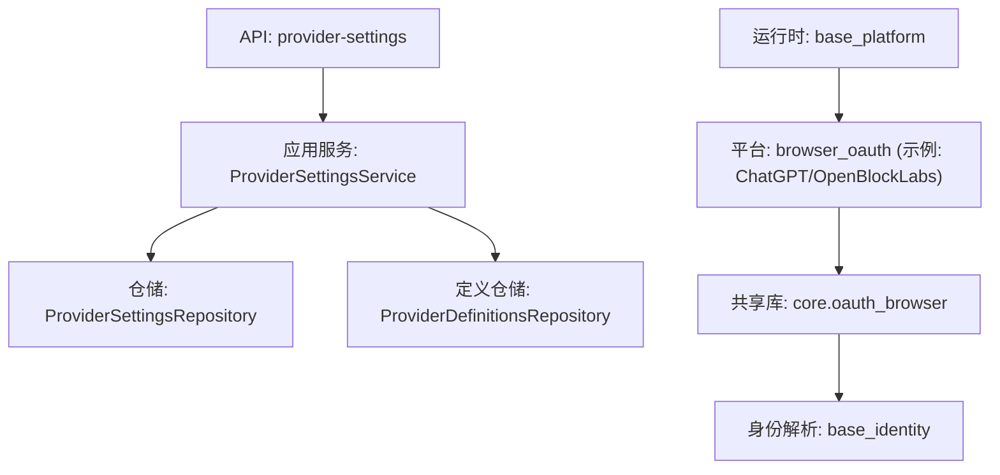
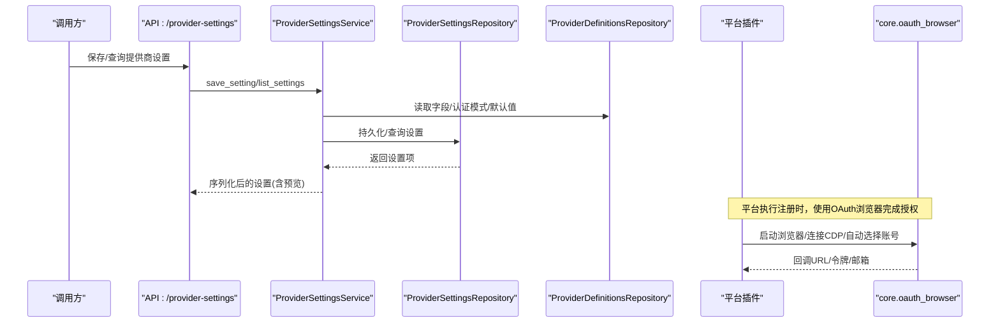
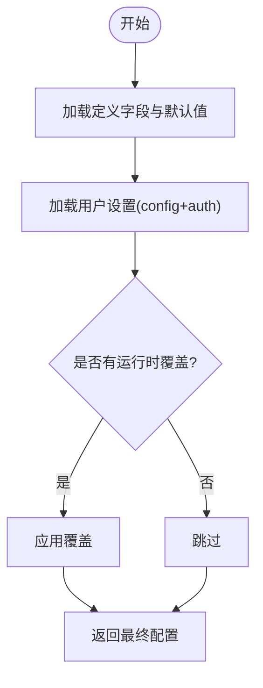
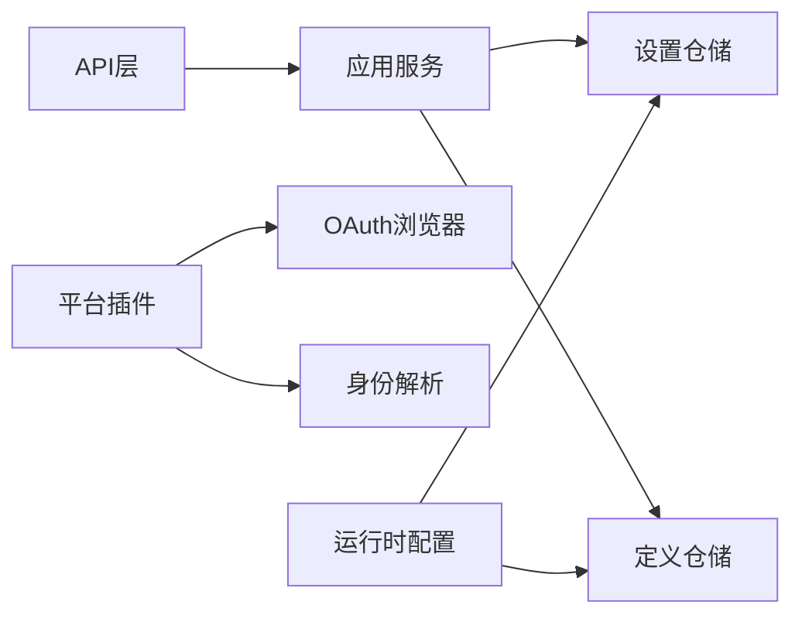

# OAuth提供商配置

<cite>
**本文引用的文件**
- [api/provider_settings.py](file://api/provider_settings.py)
- [application/provider_settings.py](file://application/provider_settings.py)
- [infrastructure/provider_settings_repository.py](file://infrastructure/provider_settings_repository.py)
- [infrastructure/provider_definitions_repository.py](file://infrastructure/provider_definitions_repository.py)
- [core/oauth_browser.py](file://core/oauth_browser.py)
- [platforms/chatgpt/browser_oauth.py](file://platforms/chatgpt/browser_oauth.py)
- [platforms/openblocklabs/browser_oauth.py](file://platforms/openblocklabs/browser_oauth.py)
- [core/base_identity.py](file://core/base_identity.py)
- [core/base_platform.py](file://core/base_platform.py)
- [core/manual_oauth_browser.py](file://core/manual_oauth_browser.py)
</cite>

## 目录
1. [简介](#简介)
2. [项目结构](#项目结构)
3. [核心组件](#核心组件)
4. [架构总览](#架构总览)
5. [详细组件分析](#详细组件分析)
6. [依赖关系分析](#依赖关系分析)
7. [性能与可用性考虑](#性能与可用性考虑)
8. [故障排查指南](#故障排查指南)
9. [结论](#结论)
10. [附录：模板与最佳实践](#附录模板与最佳实践)

## 简介
本文件面向需要在系统中新增或扩展“OAuth提供商”配置的技术人员，说明如何为新的OAuth提供商添加配置支持。文档涵盖：
- 配置文件结构与必需参数定义
- 关键配置项（客户端ID、客户端密钥、重定向URI等）的作用与设置方法
- 环境变量与动态配置更新机制
- 提供商设置的验证规则与默认值处理
- 配置模板与最佳实践
- 安全考虑与敏感信息保护

## 项目结构
系统采用分层设计：API层暴露REST接口，应用服务层编排业务逻辑，基础设施层负责持久化与元数据管理，平台侧通过浏览器流程完成OAuth交互。

图表来源
- [api/provider_settings.py:1-51](file://api/provider_settings.py#L1-L51)
- [application/provider_settings.py:1-88](file://application/provider_settings.py#L1-L88)
- [infrastructure/provider_settings_repository.py:1-167](file://infrastructure/provider_settings_repository.py#L1-L167)
- [infrastructure/provider_definitions_repository.py:387-561](file://infrastructure/provider_definitions_repository.py#L387-L561)
- [core/oauth_browser.py:1-459](file://core/oauth_browser.py#L1-L459)
- [platforms/chatgpt/browser_oauth.py:1-115](file://platforms/chatgpt/browser_oauth.py#L1-L115)
- [platforms/openblocklabs/browser_oauth.py:1-44](file://platforms/openblocklabs/browser_oauth.py#L1-L44)
- [core/base_identity.py:100-130](file://core/base_identity.py#L100-L130)
- [core/base_platform.py:44-160](file://core/base_platform.py#L44-L160)

章节来源
- [api/provider_settings.py:1-51](file://api/provider_settings.py#L1-L51)
- [application/provider_settings.py:1-88](file://application/provider_settings.py#L1-L88)
- [infrastructure/provider_settings_repository.py:1-167](file://infrastructure/provider_settings_repository.py#L1-L167)
- [infrastructure/provider_definitions_repository.py:387-561](file://infrastructure/provider_definitions_repository.py#L387-L561)
- [core/oauth_browser.py:1-459](file://core/oauth_browser.py#L1-L459)
- [platforms/chatgpt/browser_oauth.py:1-115](file://platforms/chatgpt/browser_oauth.py#L1-L115)
- [platforms/openblocklabs/browser_oauth.py:1-44](file://platforms/openblocklabs/browser_oauth.py#L1-L44)
- [core/base_identity.py:100-130](file://core/base_identity.py#L100-L130)
- [core/base_platform.py:44-160](file://core/base_platform.py#L44-L160)

## 核心组件
- 提供商定义（Provider Definitions）：声明每个提供商的元数据、字段、认证模式、驱动类型等。
- 提供商设置（Provider Settings）：存储具体实例的配置与凭据，支持启用/禁用、默认选择、多实例。
- 运行时配置解析：将定义默认值、用户设置、运行时覆盖合并为最终配置。
- OAuth浏览器流程：提供跨平台的浏览器自动化能力，用于完成第三方登录授权。
- 平台集成：各平台通过适配器调用OAuth流程，并产出账号结果。

章节来源
- [infrastructure/provider_definitions_repository.py:387-561](file://infrastructure/provider_definitions_repository.py#L387-L561)
- [infrastructure/provider_settings_repository.py:15-167](file://infrastructure/provider_settings_repository.py#L15-L167)
- [application/provider_settings.py:7-88](file://application/provider_settings.py#L7-L88)
- [core/oauth_browser.py:139-397](file://core/oauth_browser.py#L139-L397)
- [core/base_platform.py:124-160](file://core/base_platform.py#L124-L160)

## 架构总览
下图展示从API到运行时执行的完整链路，以及OAuth浏览器在平台中的参与方式。

图表来源
- [api/provider_settings.py:25-51](file://api/provider_settings.py#L25-L51)
- [application/provider_settings.py:16-88](file://application/provider_settings.py#L16-L88)
- [infrastructure/provider_settings_repository.py:39-55](file://infrastructure/provider_settings_repository.py#L39-L55)
- [core/oauth_browser.py:139-397](file://core/oauth_browser.py#L139-L397)
- [platforms/chatgpt/browser_oauth.py:44-110](file://platforms/chatgpt/browser_oauth.py#L44-L110)

## 详细组件分析

### 提供商定义（Provider Definitions）
- 作用：描述一个提供商的能力、字段、认证模式、默认值、分类等元数据。
- 关键点：
  - fields：字段列表，包含key、label、placeholder、secret、default_value等。
  - auth_modes：支持的认证模式（如token、bearer、apikey等）。
  - driver_type：驱动类型，决定实际实现类。
  - default_auth_mode：默认认证模式。
  - metadata：可携带额外信息（例如pipeline配置）。
- 内置种子：系统启动时会同步内置定义，确保字段与UI一致。

章节来源
- [infrastructure/provider_definitions_repository.py:17-384](file://infrastructure/provider_definitions_repository.py#L17-L384)
- [infrastructure/provider_definitions_repository.py:387-561](file://infrastructure/provider_definitions_repository.py#L387-L561)

### 提供商设置（Provider Settings）
- 作用：存储具体实例的配置与凭据，支持多实例、启用/禁用、默认选择。
- 关键字段：
  - provider_type/provider_key：标识提供商类型与键。
  - display_name/auth_mode/enabled/is_default：显示名、认证模式、是否启用、是否默认。
  - config/auth/metadata：配置与凭据分离存储，metadata用于扩展。
- 运行时解析：resolve_runtime_settings按优先级合并“定义默认值 → 用户设置 → 运行时覆盖”。

图表来源
- [infrastructure/provider_settings_repository.py:39-55](file://infrastructure/provider_settings_repository.py#L39-L55)

章节来源
- [infrastructure/provider_settings_repository.py:15-167](file://infrastructure/provider_settings_repository.py#L15-L167)
- [application/provider_settings.py:16-88](file://application/provider_settings.py#L16-L88)

### API与请求模型
- 端点：
  - GET /provider-settings?provider_type=...：列出某类型的提供商设置。
  - POST/PUT /provider-settings：创建或更新提供商设置。
  - DELETE /provider-settings/{id}：删除设置。
  - POST /provider-settings/test：测试特定提供商配置（如邮箱驱动）。
- 请求体字段：
  - id、provider_type、provider_key、display_name、auth_mode、enabled、is_default、config、auth、metadata。
- 错误处理：
  - 未知提供商或不存在设置会抛出HTTP异常。

章节来源
- [api/provider_settings.py:12-51](file://api/provider_settings.py#L12-L51)

### OAuth浏览器流程（核心能力）
- 功能：
  - 启动/连接浏览器（Playwright/Chrome Profile/CDP）。
  - 自动选择提供商按钮、Google账号选择器。
  - 等待回调URL、提取Cookie/Token。
- 关键常量：
  - OAUTH_PROVIDER_LABELS/OAUTH_PROVIDER_HINTS：提供商标签与提示映射。
- 典型用法：
  - 平台侧调用register_with_browser_oauth，传入proxy、oauth_provider、email_hint、超时、headless、chrome_user_data_dir、chrome_cdp_url等。

章节来源
- [core/oauth_browser.py:11-459](file://core/oauth_browser.py#L11-L459)
- [platforms/chatgpt/browser_oauth.py:44-110](file://platforms/chatgpt/browser_oauth.py#L44-L110)
- [platforms/openblocklabs/browser_oauth.py:13-44](file://platforms/openblocklabs/browser_oauth.py#L13-L44)

### 身份解析与平台集成
- 身份提供者：
  - BrowserOAuthIdentityProvider：从extra中解析oauth_provider、email_hint、chrome_user_data_dir、chrome_cdp_url。
- 平台注册流程：
  - BasePlatform根据executor_type与identity_provider选择不同流程；当identity_provider为oauth_browser时，走ProtocolOAuthFlow。

章节来源
- [core/base_identity.py:100-130](file://core/base_identity.py#L100-L130)
- [core/base_platform.py:124-160](file://core/base_platform.py#L124-L160)

## 依赖关系分析
- API层依赖应用服务，应用服务依赖仓储与定义仓库。
- 平台侧依赖共享OAuth浏览器能力，并通过身份解析获取OAuth相关上下文。
- 运行时配置解析依赖定义与设置，支持覆盖策略。

图表来源
- [api/provider_settings.py:1-51](file://api/provider_settings.py#L1-L51)
- [application/provider_settings.py:1-88](file://application/provider_settings.py#L1-L88)
- [infrastructure/provider_settings_repository.py:15-167](file://infrastructure/provider_settings_repository.py#L15-L167)
- [infrastructure/provider_definitions_repository.py:387-561](file://infrastructure/provider_definitions_repository.py#L387-L561)
- [core/base_identity.py:100-130](file://core/base_identity.py#L100-L130)
- [core/oauth_browser.py:139-397](file://core/oauth_browser.py#L139-L397)

## 性能与可用性考虑
- 浏览器复用：
  - 优先连接已运行的Chrome（CDP），避免重复启动开销。
  - 支持Chrome Profile持久化，复用会话减少登录步骤。
- 超时与重试：
  - 回调等待与页面操作具备超时控制，避免长时间阻塞。
- 并发与资源：
  - 无头模式与有头模式按需选择，注意资源占用。
- 配置解析：
  - 默认值→用户设置→运行时覆盖的合并策略保证灵活性与稳定性。

[本节为通用指导，不直接分析具体文件]

## 故障排查指南
- 常见错误：
  - 未知提供商：检查provider_type与provider_key是否在定义中存在。
  - 设置不存在：删除前需确认ID有效。
  - 回调未到达：检查redirect_uri与回调路径匹配，确认浏览器能访问回调地址。
  - 邮箱不一致：finalize_oauth_email会校验实际邮箱与预期是否一致。
- 调试建议：
  - 使用测试端点验证邮箱/验证码等服务配置。
  - 开启日志输出，关注浏览器控制台与回调URL。
  - 检查代理配置是否正确解析。

章节来源
- [api/provider_settings.py:30-51](file://api/provider_settings.py#L30-L51)
- [core/oauth_browser.py:48-60](file://core/oauth_browser.py#L48-L60)
- [platforms/chatgpt/browser_oauth.py:78-110](file://platforms/chatgpt/browser_oauth.py#L78-L110)

## 结论
通过“定义+设置+运行时解析”的分层设计，系统能够以最小改动扩展新的OAuth提供商。结合浏览器自动化能力，平台可以稳定地完成第三方授权流程。遵循本文的安全与最佳实践，可有效降低配置风险并提升可用性。

[本节为总结性内容，不直接分析具体文件]

## 附录：模板与最佳实践

### 新增OAuth提供商的步骤
- 步骤1：在提供商定义中添加新条目
  - 指定provider_type、provider_key、label、description、driver_type、default_auth_mode、auth_modes、fields、category等。
  - 在fields中定义所有必要参数（如客户端ID、客户端密钥、重定向URI等），并为敏感字段设置secret标记。
- 步骤2：创建提供商设置
  - 通过API创建或更新设置，填写config与auth，设置enabled与is_default。
- 步骤3：平台集成
  - 在平台browser_oauth中调用共享OAuth浏览器能力，传入必要的oauth_provider、email_hint、proxy、超时、headless、chrome_user_data_dir、chrome_cdp_url。
- 步骤4：验证与测试
  - 使用测试端点验证配置有效性，观察回调与令牌获取流程。

章节来源
- [infrastructure/provider_definitions_repository.py:17-384](file://infrastructure/provider_definitions_repository.py#L17-L384)
- [api/provider_settings.py:25-51](file://api/provider_settings.py#L25-L51)
- [platforms/chatgpt/browser_oauth.py:44-110](file://platforms/chatgpt/browser_oauth.py#L44-L110)

### 关键配置项与作用
- 客户端ID（client_id）：用于标识应用，通常由OAuth提供方颁发。
- 客户端密钥（client_secret）：用于鉴权，应作为敏感信息存储在auth中并标记为secret。
- 重定向URI（redirect_uri）：授权回调地址，必须与OAuth提供方后台配置一致。
- 其他字段：如scope、state、code_verifier等，依据OAuth流程需要配置。

章节来源
- [infrastructure/provider_definitions_repository.py:17-384](file://infrastructure/provider_definitions_repository.py#L17-L384)
- [platforms/chatgpt/browser_oauth.py:56-110](file://platforms/chatgpt/browser_oauth.py#L56-L110)

### 环境变量与动态配置更新
- 环境变量：
  - 可通过运行时覆盖注入配置（resolve_runtime_settings支持overrides）。
  - 建议在部署时使用环境变量注入敏感信息（如client_secret），并在应用启动时合并到配置。
- 动态更新：
  - 通过API更新提供商设置，无需重启服务即可生效。
  - 删除默认设置时，系统会自动选择下一个可用设置为默认。

章节来源
- [infrastructure/provider_settings_repository.py:39-55](file://infrastructure/provider_settings_repository.py#L39-L55)
- [infrastructure/provider_settings_repository.py:95-107](file://infrastructure/provider_settings_repository.py#L95-L107)

### 验证规则与默认值处理
- 验证规则：
  - 保存设置前校验provider_type与provider_key是否存在于定义中。
  - 删除设置时若为默认且存在其他设置，则自动选择下一个为默认。
- 默认值处理：
  - 定义中的field.default_value会被优先填充。
  - 用户设置覆盖默认值，运行时覆盖再次覆盖用户设置。

章节来源
- [infrastructure/provider_settings_repository.py:123-167](file://infrastructure/provider_settings_repository.py#L123-L167)
- [infrastructure/provider_settings_repository.py:39-55](file://infrastructure/provider_settings_repository.py#L39-L55)

### 安全考虑与敏感信息保护
- 敏感字段：
  - 在定义中将敏感字段标记为secret，API返回时对长字符串进行脱敏预览。
- 传输与存储：
  - 使用HTTPS传输配置与凭据。
  - 将敏感信息存入auth而非config，便于权限控制与审计。
- 最小权限原则：
  - 仅申请必要的OAuth scope，避免过度授权。
- 回滚与备份：
  - 定期备份提供商设置，变更前后保留版本记录。

章节来源
- [application/provider_settings.py:74-88](file://application/provider_settings.py#L74-L88)
- [infrastructure/provider_definitions_repository.py:17-384](file://infrastructure/provider_definitions_repository.py#L17-L384)