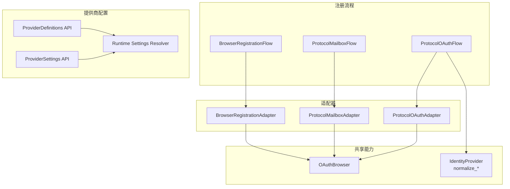
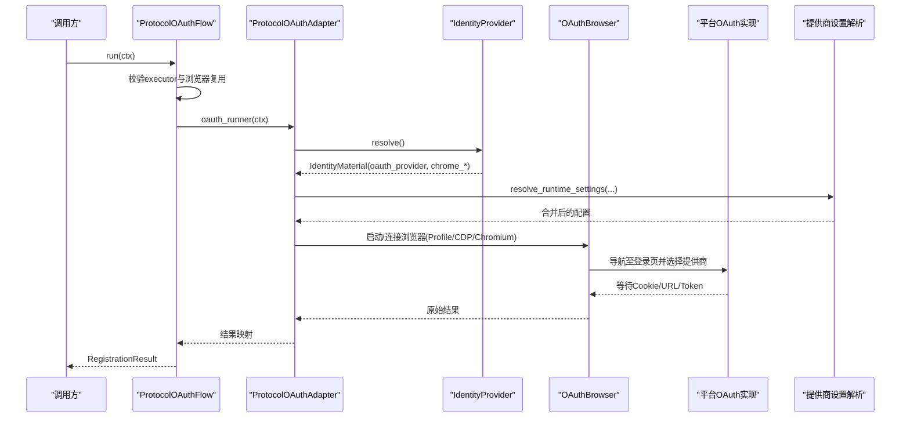
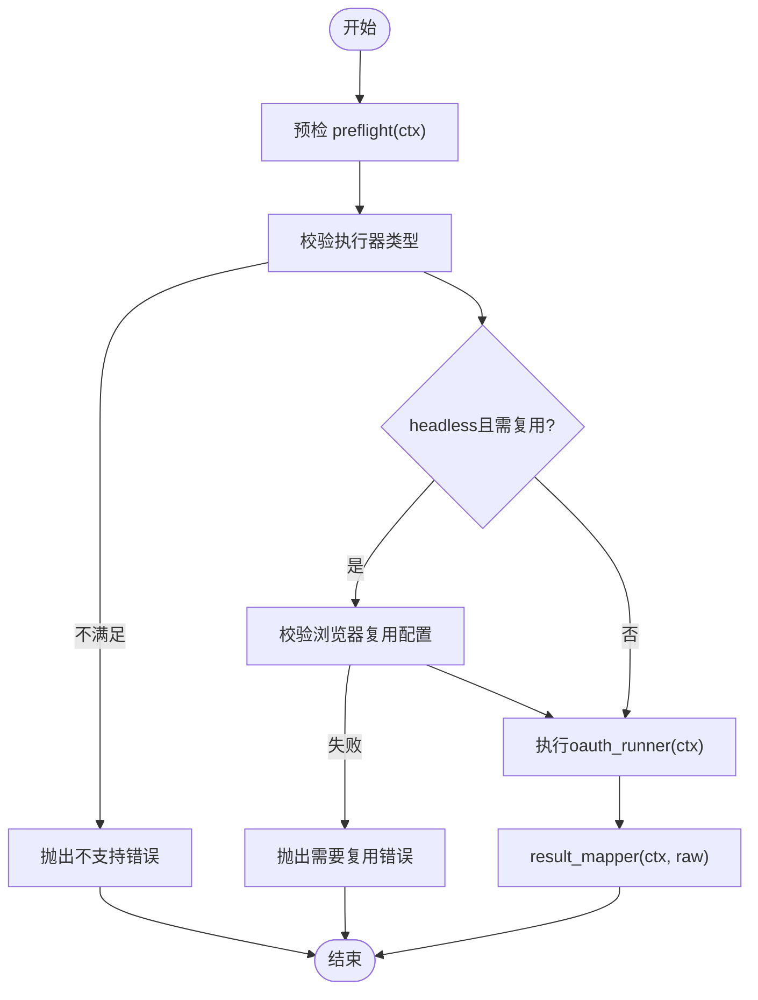
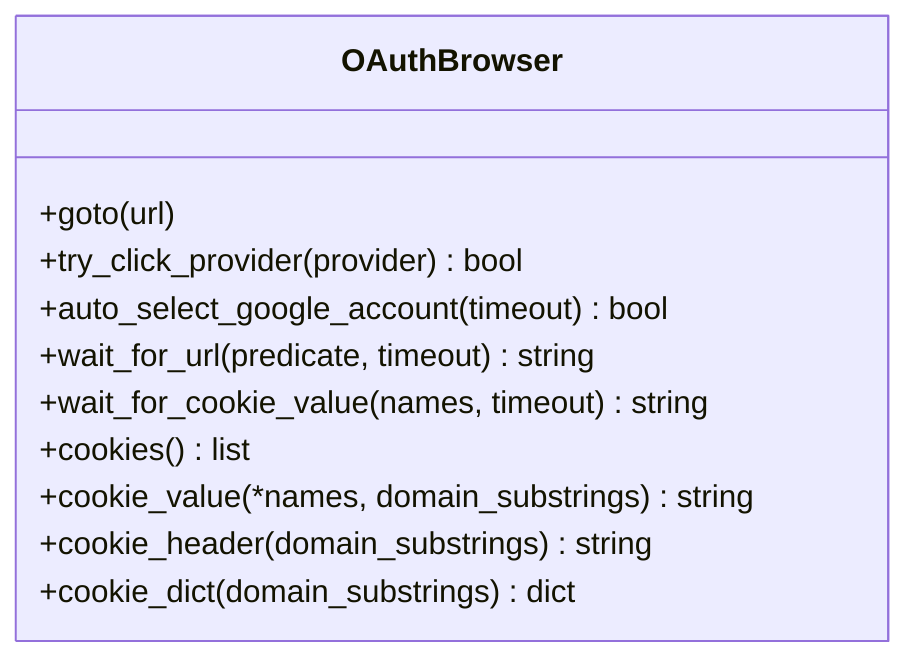
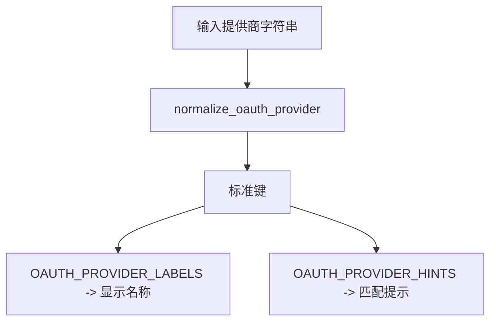
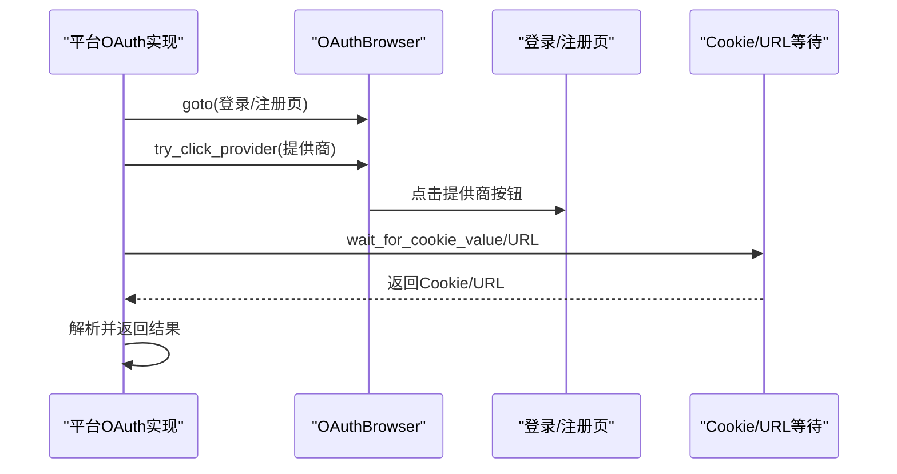
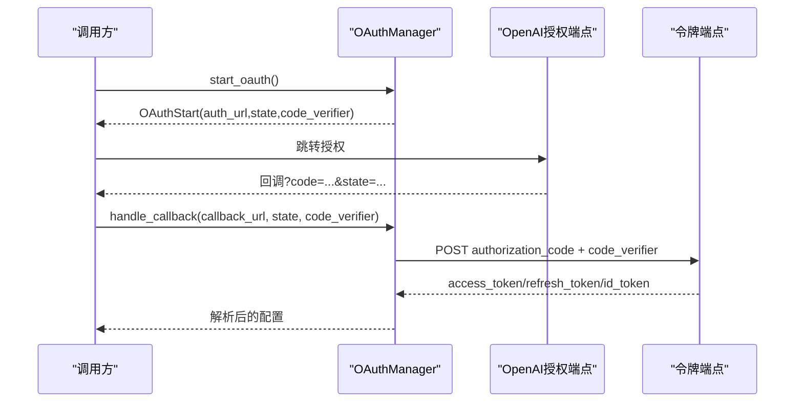
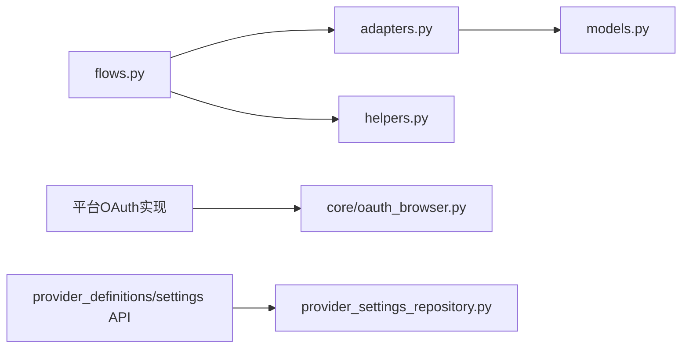

# OAuth提供商集成

<cite>
**本文引用的文件**
- [core/registration/adapters.py](file://core/registration/adapters.py)
- [core/registration/flows.py](file://core/registration/flows.py)
- [core/registration/models.py](file://core/registration/models.py)
- [core/registration/helpers.py](file://core/registration/helpers.py)
- [core/oauth_browser.py](file://core/oauth_browser.py)
- [core/manual_oauth_browser.py](file://core/manual_oauth_browser.py)
- [core/base_identity.py](file://core/base_identity.py)
- [platforms/chatgpt/oauth.py](file://platforms/chatgpt/oauth.py)
- [platforms/cursor/browser_oauth.py](file://platforms/cursor/browser_oauth.py)
- [platforms/grok/browser_oauth.py](file://platforms/grok/browser_oauth.py)
- [platforms/tavily/browser_oauth.py](file://platforms/tavily/browser_oauth.py)
- [api/provider_definitions.py](file://api/provider_definitions.py)
- [api/provider_settings.py](file://api/provider_settings.py)
- [infrastructure/provider_settings_repository.py](file://infrastructure/provider_settings_repository.py)
- [frontend/src/pages/Register.tsx](file://frontend/src/pages/Register.tsx)
</cite>

## 目录
1. [简介](#简介)
2. [项目结构](#项目结构)
3. [核心组件](#核心组件)
4. [架构总览](#架构总览)
5. [详细组件分析](#详细组件分析)
6. [依赖关系分析](#依赖关系分析)
7. [性能与可用性](#性能与可用性)
8. [故障排查指南](#故障排查指南)
9. [结论](#结论)
10. [附录：自定义OAuth提供商模板与最佳实践](#附录：自定义oauth提供商模板与最佳实践)

## 简介
本指南面向希望为新的第三方服务添加OAuth支持的开发者。文档基于代码库中的通用注册适配器、流程编排、共享OAuth浏览器能力以及多个平台的具体实现，系统说明：
- 如何配置OAuth提供商参数、API端点与协议差异
- 通用OAuth适配器的设计与扩展机制
- Google、Microsoft、GitHub等主流提供商的集成要点（通过统一浏览器自动化与提示）
- 自定义OAuth提供商的开发模板与最佳实践
- 提供商选择策略、负载均衡与故障转移机制
- 健康检查与监控告警的实现方法

## 项目结构
本项目将“注册流程”抽象为可插拔的适配器与流程，并通过共享的OAuth浏览器能力完成第三方登录交互；同时提供统一的提供商定义与设置管理接口，便于运行时动态装配。

图表来源
- [core/registration/flows.py:18-141](file://core/registration/flows.py#L18-L141)
- [core/registration/adapters.py:28-59](file://core/registration/adapters.py#L28-L59)
- [core/oauth_browser.py:139-214](file://core/oauth_browser.py#L139-L214)
- [core/base_identity.py:39-45](file://core/base_identity.py#L39-L45)
- [api/provider_definitions.py:24-41](file://api/provider_definitions.py#L24-L41)
- [api/provider_settings.py:25-43](file://api/provider_settings.py#L25-L43)
- [infrastructure/provider_settings_repository.py:39-55](file://infrastructure/provider_settings_repository.py#L39-L55)

章节来源
- [core/registration/flows.py:18-141](file://core/registration/flows.py#L18-L141)
- [core/registration/adapters.py:28-59](file://core/registration/adapters.py#L28-L59)
- [core/oauth_browser.py:139-214](file://core/oauth_browser.py#L139-L214)
- [core/base_identity.py:39-45](file://core/base_identity.py#L39-L45)
- [api/provider_definitions.py:24-41](file://api/provider_definitions.py#L24-L41)
- [api/provider_settings.py:25-43](file://api/provider_settings.py#L25-L43)
- [infrastructure/provider_settings_repository.py:39-55](file://infrastructure/provider_settings_repository.py#L39-L55)

## 核心组件
- 注册上下文与能力声明
  - RegistrationContext：承载平台名、显示名、身份、配置、邮箱、密码、日志函数等，并提供executor_type、proxy、extra等便捷属性。
  - RegistrationCapability：声明是否允许特定执行器类型、无头模式是否需要复用浏览器会话、邮箱/短信等前置条件。
- 适配器
  - BrowserRegistrationAdapter：封装浏览器注册所需的工作流构建器、注册执行器、可选的OAuth执行器、验证码/链接/短信回调等。
  - ProtocolMailboxAdapter：基于协议的邮箱注册适配器，支持验证码、链接、短信回调与可选的执行器。
  - ProtocolOAuthAdapter：纯OAuth流程适配器，仅包含oauth_runner与结果映射。
- 流程编排
  - BrowserRegistrationFlow：处理浏览器注册或浏览器OAuth分支，校验执行器与浏览器复用要求，组装验证码/链接/短信回调并执行注册。
  - ProtocolMailboxFlow：按能力校验邮箱/邮箱账号后，构造工作器并执行注册。
  - ProtocolOAuthFlow：校验执行器与浏览器复用要求后，直接调用oauth_runner并映射结果。
- 共享OAuth浏览器
  - OAuthBrowser：统一封装Playwright/Chrome Profile/CDP三种模式，自动检测本地Chrome、代理配置、等待Cookie/URL、点击提供商按钮、Google账号自动选择等。
- 身份提供者与标准化
  - IdentityMaterial：描述identity_provider、email、mailbox_account、oauth_provider、chrome_user_data_dir、chrome_cdp_url等。
  - normalize_identity_provider / normalize_oauth_provider：对身份与OAuth提供商进行别名归一化。

章节来源
- [core/registration/models.py:7-66](file://core/registration/models.py#L7-L66)
- [core/registration/adapters.py:28-59](file://core/registration/adapters.py#L28-L59)
- [core/registration/flows.py:18-141](file://core/registration/flows.py#L18-L141)
- [core/oauth_browser.py:139-214](file://core/oauth_browser.py#L139-L214)
- [core/base_identity.py:48-131](file://core/base_identity.py#L48-L131)

## 架构总览
下图展示了从任务到具体平台OAuth实现的端到端调用链，包括提供商选择、浏览器复用、回调处理与令牌交换。

图表来源
- [core/registration/flows.py:124-141](file://core/registration/flows.py#L124-L141)
- [core/registration/adapters.py:53-59](file://core/registration/adapters.py#L53-L59)
- [core/base_identity.py:100-131](file://core/base_identity.py#L100-L131)
- [core/oauth_browser.py:139-214](file://core/oauth_browser.py#L139-L214)
- [infrastructure/provider_settings_repository.py:39-55](file://infrastructure/provider_settings_repository.py#L39-L55)

## 详细组件分析

### 通用OAuth适配器与流程
- 设计要点
  - 通过ProtocolOAuthAdapter将“运行期逻辑”与“流程控制”解耦：流程负责校验与编排，适配器负责具体OAuth执行与结果映射。
  - 使用RegistrationCapability限制允许的executor_type，并在headless模式下强制浏览器会话复用，避免无头环境下的兼容性问题。
  - 通过helpers提供的ensure_*系列函数集中处理前置校验与错误语义。
- 关键路径
  - 预检：preflight(ctx)
  - 执行器校验：ensure_oauth_executor_allowed(ctx, capability.oauth_allowed_executor_types)
  - 浏览器复用校验：ensure_oauth_browser_reuse(ctx, message)
  - 执行：adapter.oauth_runner(ctx)
  - 结果映射：adapter.result_mapper(ctx, raw)

图表来源
- [core/registration/flows.py:124-141](file://core/registration/flows.py#L124-L141)
- [core/registration/helpers.py:33-43](file://core/registration/helpers.py#L33-L43)

章节来源
- [core/registration/flows.py:124-141](file://core/registration/flows.py#L124-L141)
- [core/registration/helpers.py:33-43](file://core/registration/helpers.py#L33-L43)

### 共享OAuth浏览器能力
- 多模式启动
  - CDP连接已运行的Chrome实例
  - 使用Chrome用户数据目录持久化上下文（保留登录态）
  - 回退到Playwright Chromium
- 自动发现与重启
  - 自动检测本机Chrome远程调试端口，必要时尝试重启并启用调试端口
- 提供商选择与交互
  - try_click_provider：根据标签与提示词智能匹配并点击提供商按钮
  - auto_select_google_account：在Google账号选择器出现时自动选择首个账号
- Cookie/URL等待
  - wait_for_cookie_value/wait_for_url：等待目标Cookie或URL变化以判定登录完成

图表来源
- [core/oauth_browser.py:139-214](file://core/oauth_browser.py#L139-L214)
- [core/oauth_browser.py:245-303](file://core/oauth_browser.py#L245-L303)
- [core/oauth_browser.py:305-341](file://core/oauth_browser.py#L305-L341)
- [core/oauth_browser.py:343-393](file://core/oauth_browser.py#L343-L393)

章节来源
- [core/oauth_browser.py:139-214](file://core/oauth_browser.py#L139-L214)
- [core/oauth_browser.py:245-303](file://core/oauth_browser.py#L245-L303)
- [core/oauth_browser.py:305-341](file://core/oauth_browser.py#L305-L341)
- [core/oauth_browser.py:343-393](file://core/oauth_browser.py#L343-L393)

### 提供商选择与标准化
- 提供商别名归一化
  - normalize_oauth_provider将多种写法映射为标准键，如google-oauth2→google、windowslive/live→microsoft、twitter→x等
- 前端展示与提示
  - OAUTH_PROVIDER_LABELS用于界面友好显示
  - OAUTH_PROVIDER_HINTS用于页面元素匹配时的关键词提示
- 身份提供者创建
  - create_identity_provider根据mode返回对应实现，支持mailbox与oauth_browser两种模式

图表来源
- [core/base_identity.py:18-45](file://core/base_identity.py#L18-L45)
- [core/oauth_browser.py:11-29](file://core/oauth_browser.py#L11-L29)

章节来源
- [core/base_identity.py:18-45](file://core/base_identity.py#L18-L45)
- [core/oauth_browser.py:11-29](file://core/oauth_browser.py#L11-L29)

### 主流提供商集成示例

#### Google
- 特点
  - 通过normalize_oauth_provider与OAUTH_PROVIDER_HINTS支持google/google-oauth2
  - 在Chrome Profile/CDP模式下，可使用auto_select_google_account自动选择账号
- 集成要点
  - 建议配置chrome_user_data_dir或chrome_cdp_url以复用已登录会话
  - 若使用无头模式，需在capability中声明oauth_headless_requires_browser_reuse=true，流程会强制校验浏览器复用配置

章节来源
- [core/base_identity.py:18-45](file://core/base_identity.py#L18-L45)
- [core/oauth_browser.py:130-136](file://core/oauth_browser.py#L130-L136)
- [core/oauth_browser.py:305-325](file://core/oauth_browser.py#L305-L325)
- [core/registration/models.py:8-15](file://core/registration/models.py#L8-L15)

#### Microsoft
- 特点
  - windowslive/live均归一化为microsoft
  - 可通过OAUTH_PROVIDER_HINTS在页面中匹配微软登录入口
- 集成要点
  - 与Google类似，推荐复用浏览器会话以提升成功率

章节来源
- [core/base_identity.py:18-45](file://core/base_identity.py#L18-L45)
- [core/oauth_browser.py:21-29](file://core/oauth_browser.py#L21-L29)

#### GitHub
- 特点
  - 支持github作为标准键
  - 可在页面中通过hints匹配GitHub登录按钮
- 集成要点
  - 同样建议复用浏览器会话

章节来源
- [core/base_identity.py:18-45](file://core/base_identity.py#L18-L45)
- [core/oauth_browser.py:21-29](file://core/oauth_browser.py#L21-L29)

#### 平台级OAuth实现示例
- Cursor
  - 使用OAuthBrowser导航至注册/登录页，选择提供商，等待WorkosCursorSessionToken，再获取用户信息并规范化邮箱
- Grok
  - 导航至X.AI账户页，选择提供商，等待sso Cookie，并读取读写权限Cookie
- Tavily
  - 强制要求复用浏览器会话，进入注册页后引导完成OAuth，提取API Key并验证

图表来源
- [platforms/cursor/browser_oauth.py:13-61](file://platforms/cursor/browser_oauth.py#L13-L61)
- [platforms/grok/browser_oauth.py:12-59](file://platforms/grok/browser_oauth.py#L12-L59)
- [platforms/tavily/browser_oauth.py:34-88](file://platforms/tavily/browser_oauth.py#L34-L88)
- [core/oauth_browser.py:245-341](file://core/oauth_browser.py#L245-L341)

章节来源
- [platforms/cursor/browser_oauth.py:13-61](file://platforms/cursor/browser_oauth.py#L13-L61)
- [platforms/grok/browser_oauth.py:12-59](file://platforms/grok/browser_oauth.py#L12-L59)
- [platforms/tavily/browser_oauth.py:34-88](file://platforms/tavily/browser_oauth.py#L34-L88)

### OpenAI（ChatGPT）OAuth流程
- 协议特性
  - 使用PKCE（code_challenge/code_verifier）增强安全性
  - 支持Hydra端点与Codex CLI简化流程
  - 回调解析支持query与fragment参数
- 关键步骤
  - generate_oauth_url：生成授权URL与必要参数
  - submit_callback_url：解析回调、校验state、换取access_token/refresh_token/id_token
  - OAuthManager：封装start/handle_callback/extract_account_info

图表来源
- [platforms/chatgpt/oauth.py:180-237](file://platforms/chatgpt/oauth.py#L180-L237)
- [platforms/chatgpt/oauth.py:240-320](file://platforms/chatgpt/oauth.py#L240-L320)
- [platforms/chatgpt/oauth.py:323-379](file://platforms/chatgpt/oauth.py#L323-L379)

章节来源
- [platforms/chatgpt/oauth.py:180-237](file://platforms/chatgpt/oauth.py#L180-L237)
- [platforms/chatgpt/oauth.py:240-320](file://platforms/chatgpt/oauth.py#L240-L320)
- [platforms/chatgpt/oauth.py:323-379](file://platforms/chatgpt/oauth.py#L323-L379)

## 依赖关系分析
- 组件耦合
  - flows依赖adapters与helpers，adapters依赖models；flows通过helpers进行前置校验与回调构建
  - 平台OAuth实现依赖core.oauth_browser与各自平台的switch/工具模块
  - 提供商配置通过API层暴露，运行时由repository解析合并
- 外部依赖
  - Playwright用于浏览器自动化
  - curl_cffi用于模拟浏览器指纹的HTTP请求（OpenAI场景）
- 潜在循环依赖
  - 当前分层清晰，未见明显循环依赖

图表来源
- [core/registration/flows.py:1-16](file://core/registration/flows.py#L1-L16)
- [core/registration/adapters.py:1-7](file://core/registration/adapters.py#L1-L7)
- [core/registration/models.py:1-6](file://core/registration/models.py#L1-L6)
- [platforms/cursor/browser_oauth.py:1-11](file://platforms/cursor/browser_oauth.py#L1-L11)
- [api/provider_definitions.py:1-7](file://api/provider_definitions.py#L1-L7)
- [api/provider_settings.py:1-7](file://api/provider_settings.py#L1-L7)
- [infrastructure/provider_settings_repository.py:39-55](file://infrastructure/provider_settings_repository.py#L39-L55)

章节来源
- [core/registration/flows.py:1-16](file://core/registration/flows.py#L1-L16)
- [core/registration/adapters.py:1-7](file://core/registration/adapters.py#L1-L7)
- [core/registration/models.py:1-6](file://core/registration/models.py#L1-L6)
- [platforms/cursor/browser_oauth.py:1-11](file://platforms/cursor/browser_oauth.py#L1-L11)
- [api/provider_definitions.py:1-7](file://api/provider_definitions.py#L1-L7)
- [api/provider_settings.py:1-7](file://api/provider_settings.py#L1-L7)
- [infrastructure/provider_settings_repository.py:39-55](file://infrastructure/provider_settings_repository.py#L39-L55)

## 性能与可用性
- 浏览器复用优先
  - 在无头模式下，若capability要求复用浏览器会话，则必须配置chrome_user_data_dir或chrome_cdp_url，否则流程会提前失败，避免无效重试
- 自动发现与回退
  - OAuthBrowser会先尝试连接已运行的Chrome（CDP），其次尝试重启并启用调试端口，最后回退到Playwright Chromium，提升在不同环境的可用性
- 超时与等待
  - 所有等待操作均支持timeout参数，建议在平台实现中合理设置以避免长时间阻塞
- 并发与资源
  - 浏览器上下文与页面应谨慎复用，避免跨租户污染；在容器化部署中建议使用CDP集中管理浏览器实例

[本节为通用指导，不直接分析具体文件]

## 故障排查指南
- 常见错误与定位
  - 未配置邮箱或邮箱账号：确保identity.email或has_mailbox满足需求
  - 执行器类型不被允许：检查capability.oauth_allowed_executor_types与ctx.executor_type
  - 无头模式需要浏览器复用但未配置：检查chrome_user_data_dir或chrome_cdp_url
  - 提供商按钮未找到：核对OAUTH_PROVIDER_HINTS与页面元素文本
  - 回调缺少必要参数：检查callback URL是否包含code/state，或state是否匹配
- 诊断建议
  - 使用日志输出关键节点（等待验证码/链接、Cookie/URL变化）
  - 在前端Register页面确认chrome_user_data_dir/chrome_cdp_url与oauth_email_hint是否正确填写
  - 使用提供商测试接口验证配置有效性（例如邮箱提供商）

章节来源
- [core/registration/helpers.py:23-43](file://core/registration/helpers.py#L23-L43)
- [core/oauth_browser.py:48-60](file://core/oauth_browser.py#L48-L60)
- [frontend/src/pages/Register.tsx:433-451](file://frontend/src/pages/Register.tsx#L433-L451)
- [api/provider_settings.py:61-81](file://api/provider_settings.py#L61-L81)

## 结论
本项目通过“适配器+流程+共享能力”的分层设计，将OAuth提供商接入抽象为可配置、可扩展的模块。借助标准化的提供商别名、统一的浏览器自动化能力与灵活的运行时配置解析，开发者可以以最小成本为新服务添加OAuth支持，并在不同环境中获得稳定的体验。结合健康检查与监控告警，可进一步提升系统的可用性与可维护性。

[本节为总结性内容，不直接分析具体文件]

## 附录：自定义OAuth提供商模板与最佳实践

### 开发模板（步骤清单）
- 定义适配器
  - 在adapters中新增或复用ProtocolOAuthAdapter，提供oauth_runner与result_mapper
- 编写流程
  - 在flows中通过ProtocolOAuthFlow编排：预检、执行器校验、浏览器复用校验、执行oauth_runner、结果映射
- 实现OAuth逻辑
  - 参考platforms/*/browser_oauth.py，使用OAuthBrowser完成：
    - 导航至登录/注册页
    - 选择提供商（try_click_provider）
    - 等待Cookie/URL（wait_for_cookie_value/wait_for_url）
    - 规范化邮箱（finalize_oauth_email）
- 配置提供商
  - 通过API provider_definitions与provider_settings注册提供商定义与运行时设置
  - 使用resolve_runtime_settings合并默认值、存储配置与覆盖参数
- 前端支持
  - 在Register页面增加chrome_user_data_dir/chrome_cdp_url与oauth_email_hint字段，提示用户复用浏览器会话

章节来源
- [core/registration/adapters.py:53-59](file://core/registration/adapters.py#L53-L59)
- [core/registration/flows.py:124-141](file://core/registration/flows.py#L124-L141)
- [platforms/cursor/browser_oauth.py:13-61](file://platforms/cursor/browser_oauth.py#L13-L61)
- [api/provider_definitions.py:24-41](file://api/provider_definitions.py#L24-L41)
- [api/provider_settings.py:25-43](file://api/provider_settings.py#L25-L43)
- [infrastructure/provider_settings_repository.py:39-55](file://infrastructure/provider_settings_repository.py#L39-L55)
- [frontend/src/pages/Register.tsx:433-451](file://frontend/src/pages/Register.tsx#L433-L451)

### 最佳实践
- 明确能力声明
  - 在RegistrationCapability中声明oauth_allowed_executor_types与oauth_headless_requires_browser_reuse，避免在不支持的环境下运行
- 稳健的等待与超时
  - 为所有等待操作设置合理timeout，记录日志以便定位问题
- 提供商别名与提示
  - 在base_identity中添加新提供商别名，在oauth_browser中补充label与hints，提高兼容性
- 安全与合规
  - 使用PKCE（如OpenAI场景）增强安全性；妥善管理client_id/secret与回调地址
- 健康检查与监控告警
  - 健康检查
    - 在health相关接口中增加OAuth提供商连通性检查（例如访问授权端点、解析回调能力）
    - 针对浏览器复用能力，检查CDP端口或Chrome Profile是否存在
  - 监控告警
    - 统计各提供商成功率、平均耗时、错误码分布
    - 当某提供商连续失败超过阈值时触发告警，并自动切换备用提供商（见下一节）
- 提供商选择策略、负载均衡与故障转移
  - 选择策略
    - 优先级：已登录会话 > 浏览器复用 > 无头回退
    - 按地域/网络质量选择最优提供商
  - 负载均衡
    - 基于权重轮询或最少连接数分配请求到不同提供商实例
  - 故障转移
    - 当主提供商失败时，自动切换到备选提供商（如Google失败则尝试Microsoft/GitHub）
    - 记录失败原因并更新权重，持续优化选择策略

[本节为通用指导，不直接分析具体文件]