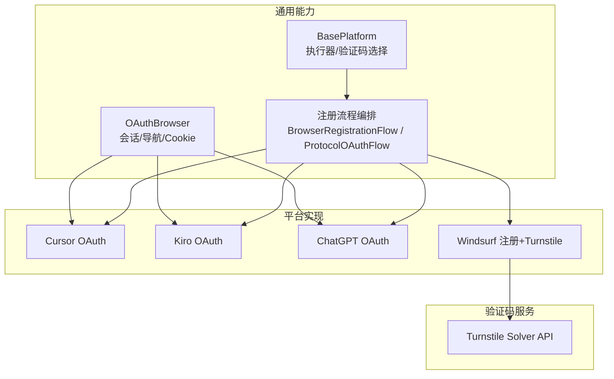
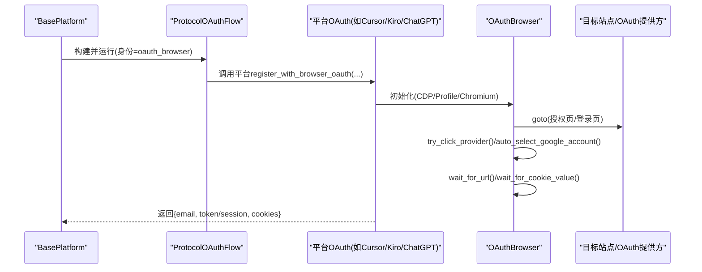
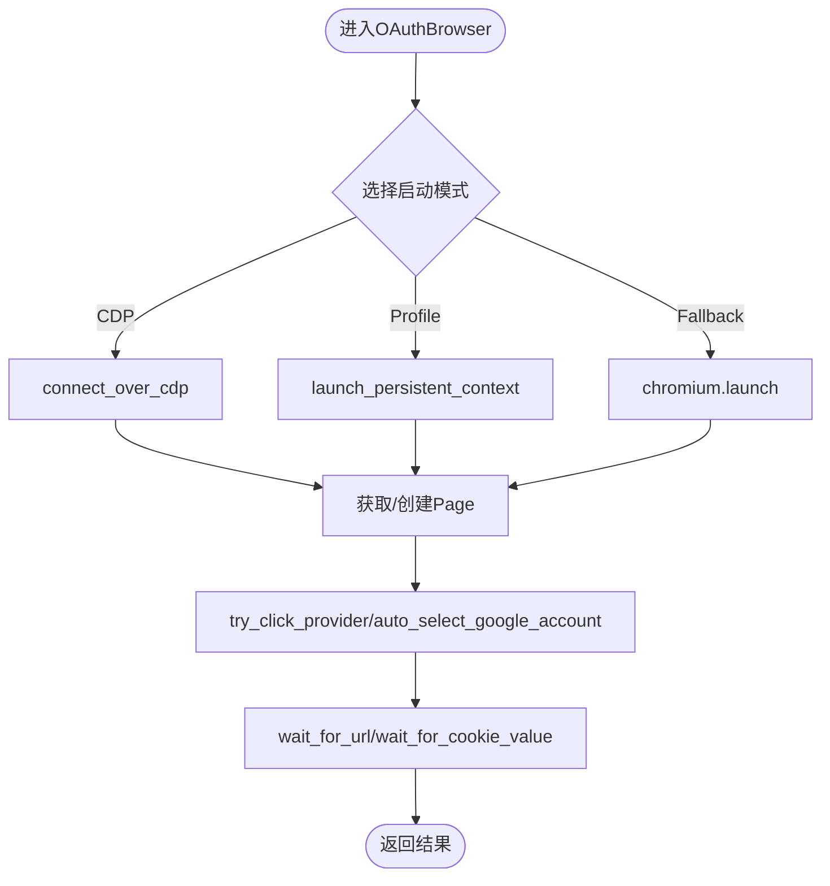
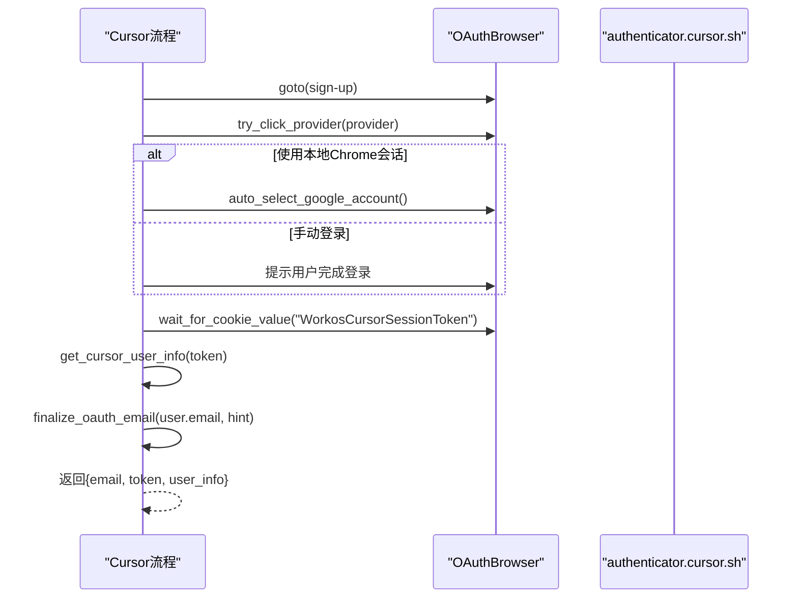
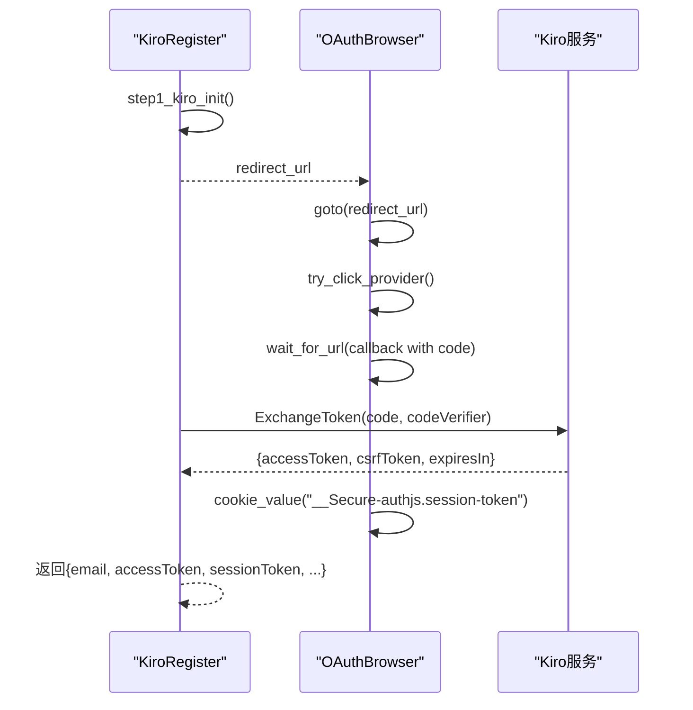
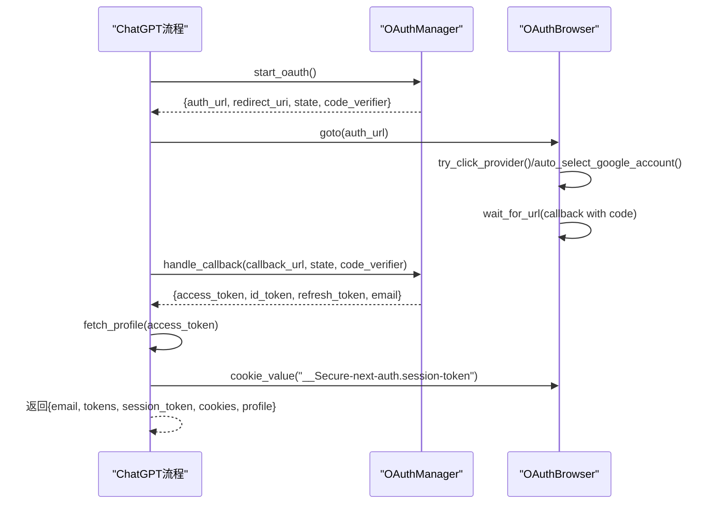
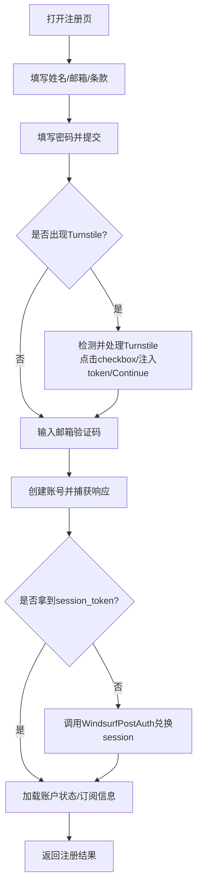
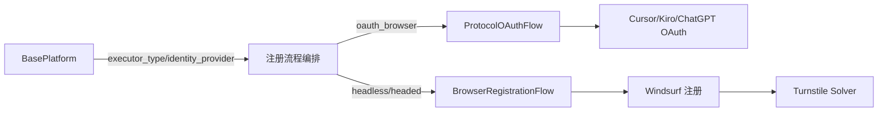

# 浏览器OAuth流程

<cite>
**本文引用的文件**
- [core/oauth_browser.py](file://core/oauth_browser.py)
- [core/manual_oauth_browser.py](file://core/manual_oauth_browser.py)
- [platforms/cursor/browser_oauth.py](file://platforms/cursor/browser_oauth.py)
- [platforms/kiro/browser_oauth.py](file://platforms/kiro/browser_oauth.py)
- [platforms/chatgpt/browser_oauth.py](file://platforms/chatgpt/browser_oauth.py)
- [platforms/windsurf/browser_register.py](file://platforms/windsurf/browser_register.py)
- [core/base_platform.py](file://core/base_platform.py)
- [core/registration/flows.py](file://core/registration/flows.py)
- [services/turnstile_solver/api_solver.py](file://services/turnstile_solver/api_solver.py)
</cite>

## 目录
1. [简介](#简介)
2. [项目结构](#项目结构)
3. [核心组件](#核心组件)
4. [架构总览](#架构总览)
5. [详细组件分析](#详细组件分析)
6. [依赖关系分析](#依赖关系分析)
7. [性能与稳定性](#性能与稳定性)
8. [故障排查指南](#故障排查指南)
9. [结论](#结论)
10. [附录：最佳实践与反检测策略](#附录最佳实践与反检测策略)

## 简介
本文件面向“基于浏览器的 OAuth 授权”实现，系统性说明 Playwright 在 OAuth 流程中的作用、配置方式、会话与 Cookie 管理、页面导航控制，以及不同平台（Cursor、Windsurf、Kiro）的差异与适配方法。文档还覆盖用户交互处理、表单自动填充、验证码解决（Turnstile）、调试技巧与常见问题解决方案，并总结浏览器自动化最佳实践与反检测策略。

## 项目结构
围绕浏览器 OAuth 的核心代码分布在以下位置：
- 通用 OAuth 浏览器封装：core/oauth_browser.py
- 向后兼容层：core/manual_oauth_browser.py
- 平台 OAuth 流程：
  - Cursor：platforms/cursor/browser_oauth.py
  - Kiro：platforms/kiro/browser_oauth.py
  - ChatGPT：platforms/chatgpt/browser_oauth.py
  - Windsurf：platforms/windsurf/browser_register.py（含 Turnstile 处理与注册流程）
- 平台基类与流程编排：core/base_platform.py、core/registration/flows.py
- Turnstile 服务与反检测：services/turnstile_solver/api_solver.py

图表来源
- [core/oauth_browser.py:139-243](file://core/oauth_browser.py#L139-L243)
- [core/registration/flows.py:18-142](file://core/registration/flows.py#L18-L142)
- [core/base_platform.py:124-160](file://core/base_platform.py#L124-L160)
- [platforms/cursor/browser_oauth.py:13-61](file://platforms/cursor/browser_oauth.py#L13-L61)
- [platforms/kiro/browser_oauth.py:63-114](file://platforms/kiro/browser_oauth.py#L63-L114)
- [platforms/chatgpt/browser_oauth.py:44-110](file://platforms/chatgpt/browser_oauth.py#L44-L110)
- [platforms/windsurf/browser_register.py:598-741](file://platforms/windsurf/browser_register.py#L598-L741)

章节来源
- [core/oauth_browser.py:139-243](file://core/oauth_browser.py#L139-L243)
- [core/registration/flows.py:18-142](file://core/registration/flows.py#L18-L142)
- [core/base_platform.py:124-160](file://core/base_platform.py#L124-L160)

## 核心组件
- OAuthBrowser：统一的浏览器生命周期与交互封装，支持三种模式：
  - CDP 连接已运行 Chrome
  - 使用本地 Chrome Profile 持久化上下文（保留登录态）
  - 回退到 Playwright Chromium（无头或可视化）
- 平台 OAuth 适配器：各平台通过统一入口调用 OAuthBrowser，完成跳转、等待回调、提取 Token/Session、校验邮箱等。
- 流程编排：BasePlatform 根据 executor_type 与 identity_provider 决定走 BrowserRegistrationFlow 还是 ProtocolOAuthFlow；后者专门用于“浏览器 OAuth”。
- Turnstile 处理：Windsurf 流程内嵌 Turnstile 检测、点击、注入 token 与继续按钮点击逻辑；同时提供独立的 Turnstile Solver 服务以多浏览器池化方式解决验证码。

章节来源
- [core/oauth_browser.py:139-393](file://core/oauth_browser.py#L139-L393)
- [core/registration/flows.py:124-142](file://core/registration/flows.py#L124-L142)
- [platforms/windsurf/browser_register.py:77-436](file://platforms/windsurf/browser_register.py#L77-L436)
- [services/turnstile_solver/api_solver.py:64-779](file://services/turnstile_solver/api_solver.py#L64-L779)

## 架构总览
下图展示从 BasePlatform 到具体平台 OAuth 流程的调用链，以及 OAuthBrowser 在不同模式下的行为。

图表来源
- [core/base_platform.py:146-153](file://core/base_platform.py#L146-L153)
- [core/registration/flows.py:124-142](file://core/registration/flows.py#L124-L142)
- [platforms/cursor/browser_oauth.py:26-61](file://platforms/cursor/browser_oauth.py#L26-L61)
- [platforms/kiro/browser_oauth.py:81-114](file://platforms/kiro/browser_oauth.py#L81-L114)
- [platforms/chatgpt/browser_oauth.py:59-110](file://platforms/chatgpt/browser_oauth.py#L59-L110)
- [core/oauth_browser.py:162-243](file://core/oauth_browser.py#L162-L243)

## 详细组件分析

### OAuthBrowser：浏览器会话、Cookie 与导航
- 启动模式
  - 优先尝试连接本机已运行的 Chrome（CDP），若失败则尝试重启 Chrome 开启调试端口，再失败则使用 Playwright Chromium。
  - 支持传入 chrome_user_data_dir 复用本地 Chrome 登录态（Google/GitHub 等）。
- 页面与上下文
  - 统一管理 context 与 page，提供 active_page、goto、pages 等方法。
- 交互辅助
  - try_click_provider：智能匹配 OAuth 提供商按钮（Google、GitHub、LinkedIn、Microsoft、Apple、X、Builder ID 等）。
  - auto_select_google_account：在 Google 账号选择器出现时自动点击第一个账号。
- Cookie 与 URL 等待
  - wait_for_url：按谓词等待任意页面的 URL 满足条件。
  - wait_for_cookie_value：轮询获取指定 Cookie 值，支持域名过滤。
  - cookies/cookie_value/cookie_header/cookie_dict：读取当前上下文的所有 Cookie 或构造请求头。

图表来源
- [core/oauth_browser.py:162-243](file://core/oauth_browser.py#L162-L243)
- [core/oauth_browser.py:245-393](file://core/oauth_browser.py#L245-L393)

章节来源
- [core/oauth_browser.py:139-393](file://core/oauth_browser.py#L139-L393)

### Cursor：浏览器 OAuth
- 流程要点
  - 打开 Cursor 认证页，尝试自动点击 OAuth 提供商。
  - 若使用本地 Chrome Profile/CDP，自动选择 Google 账号。
  - 等待 WorkosCursorSessionToken 出现在 cursor.com/cursor.sh 域下。
  - 通过内部接口获取用户信息，最终用 finalize_oauth_email 校验邮箱一致性。
- 输出
  - email、token、user_info。

图表来源
- [platforms/cursor/browser_oauth.py:13-61](file://platforms/cursor/browser_oauth.py#L13-L61)
- [core/oauth_browser.py:245-358](file://core/oauth_browser.py#L245-L358)

章节来源
- [platforms/cursor/browser_oauth.py:13-61](file://platforms/cursor/browser_oauth.py#L13-L61)

### Kiro：浏览器 OAuth
- 流程要点
  - 先发起 Kiro InitiateLogin，得到重定向 URL。
  - 使用 OAuthBrowser 打开重定向链接，必要时自动选择 Google 账号。
  - 等待回调 URL（包含 code 与 state），校验 state。
  - 将 code + codeVerifier 以 CBOR 格式发送到 ExchangeToken 接口换取 accessToken/csrfToken。
  - 从浏览器 Cookie 中取 __Secure-authjs.session-token。
- 输出
  - email（由 email_hint 解析）、accessToken、sessionToken、csrfToken、expiresIn。

图表来源
- [platforms/kiro/browser_oauth.py:63-114](file://platforms/kiro/browser_oauth.py#L63-L114)

章节来源
- [platforms/kiro/browser_oauth.py:63-114](file://platforms/kiro/browser_oauth.py#L63-L114)

### ChatGPT：浏览器 OAuth
- 流程要点
  - 通过 OAuthManager 启动 OAuth 流程，获得 auth_url。
  - 使用 OAuthBrowser 打开授权页，自动点击提供商或等待用户操作。
  - 等待回调 URL（包含 code），调用 handle_callback 换取 access_token/id_token/refresh_token。
  - 通过后端接口拉取用户 profile，最终用 finalize_oauth_email 校验邮箱。
  - 同时提取 NextAuth session cookie 与完整 Cookie 头。
- 输出
  - email、account_id、access_token、refresh_token、id_token、session_token、cookies、profile。

图表来源
- [platforms/chatgpt/browser_oauth.py:44-110](file://platforms/chatgpt/browser_oauth.py#L44-L110)
- [core/oauth_browser.py:327-393](file://core/oauth_browser.py#L327-L393)

章节来源
- [platforms/chatgpt/browser_oauth.py:44-110](file://platforms/chatgpt/browser_oauth.py#L44-L110)

### Windsurf：注册与 Turnstile 处理
- 注册流程
  - 打开登录页并进入注册页，填写姓名、邮箱、同意条款。
  - 填写密码，提交后进入邮箱验证码步骤。
  - 捕获响应中的 email_verification_token 与后续 WindsurfPostAuth 响应，获取 session_token。
  - 查询账户状态与订阅信息，汇总摘要。
- Turnstile 处理
  - 检测 Cloudflare 全页拦截与 Turnstile 弹窗。
  - 尝试在 iframe 中定位并点击 checkbox，必要时注入 token。
  - 点击 Continue 并再次触发 Start Free Trial，直到进入 Stripe 结账页。
- 输出
  - email、password、name、user_id、auth_token、session_token、account_id、org_id、account_overview、state_summary。

图表来源
- [platforms/windsurf/browser_register.py:598-741](file://platforms/windsurf/browser_register.py#L598-L741)
- [platforms/windsurf/browser_register.py:77-436](file://platforms/windsurf/browser_register.py#L77-L436)

章节来源
- [platforms/windsurf/browser_register.py:598-741](file://platforms/windsurf/browser_register.py#L598-L741)
- [platforms/windsurf/browser_register.py:77-436](file://platforms/windsurf/browser_register.py#L77-L436)

## 依赖关系分析
- BasePlatform 负责根据 executor_type 与 identity_provider 选择执行路径：
  - 当 identity_provider == oauth_browser 且 executor 为 headless/headed 时，走 ProtocolOAuthFlow。
  - 否则走 BrowserRegistrationFlow 或 ProtocolMailboxFlow。
- Platform 具体实现通过 register_with_browser_oauth 调用 OAuthBrowser，完成跨平台一致的浏览器交互。
- Turnstile 处理既可在平台流程内直接处理（Windsurf），也可通过独立服务 api_solver 进行多浏览器并发求解。

图表来源
- [core/base_platform.py:124-160](file://core/base_platform.py#L124-L160)
- [core/registration/flows.py:18-142](file://core/registration/flows.py#L18-L142)
- [platforms/windsurf/browser_register.py:77-436](file://platforms/windsurf/browser_register.py#L77-L436)

章节来源
- [core/base_platform.py:124-160](file://core/base_platform.py#L124-L160)
- [core/registration/flows.py:18-142](file://core/registration/flows.py#L18-L142)

## 性能与稳定性
- 启动模式选择
  - 优先复用本地 Chrome 会话（CDP/Profile），减少登录耗时与二次验证概率。
  - 在无可用 Chrome 时回退到 Playwright Chromium，保证可用性。
- 等待策略
  - 使用 wait_for_url 与 wait_for_cookie_value 精确等待关键节点，避免盲目 sleep。
  - 对 Google 账号选择器采用轮询与超时控制，提升成功率。
- 验证码处理
  - Windsurf 内置 Turnstile 检测与点击逻辑，必要时注入 token 并继续流程。
  - 独立 Turnstile Solver 支持多浏览器池化、随机 UA/视口、资源屏蔽与反检测脚本注入，提高通过率与吞吐。
- 资源释放
  - 使用上下文管理器确保 context 与 browser 正确关闭，避免僵尸进程。

[本节为通用指导，不直接分析具体文件]

## 故障排查指南
- 未检测到系统 Chrome
  - 现象：无法连接 CDP，也无法找到用户数据目录。
  - 处理：确认 Chrome 已安装并允许远程调试；或在配置中显式传入 chrome_cdp_url/chrome_user_data_dir。
  - 参考：[core/oauth_browser.py:63-113](file://core/oauth_browser.py#L63-L113)
- OAuth 回调未到达
  - 现象：wait_for_url 超时。
  - 处理：检查代理设置、网络连通性、回调地址是否正确；查看日志中提示的“请在浏览器中完成登录”。
  - 参考：[platforms/kiro/browser_oauth.py:99-104](file://platforms/kiro/browser_oauth.py#L99-L104)、[platforms/chatgpt/browser_oauth.py:78-83](file://platforms/chatgpt/browser_oauth.py#L78-L83)
- 邮箱不一致
  - 现象：finalize_oauth_email 抛出异常。
  - 处理：确保 email_hint 与实际登录邮箱一致；或调整流程以从回调/用户信息中获取真实邮箱。
  - 参考：[core/oauth_browser.py:48-60](file://core/oauth_browser.py#L48-L60)
- Turnstile 卡住
  - 现象：Cloudflare 全页拦截或弹窗无法通过。
  - 处理：启用 Turnstile 自动点击与 token 注入；或使用独立 solver 服务；检查代理与 UA。
  - 参考：[platforms/windsurf/browser_register.py:77-436](file://platforms/windsurf/browser_register.py#L77-L436)、[services/turnstile_solver/api_solver.py:64-779](file://services/turnstile_solver/api_solver.py#L64-L779)
- 无头模式需要复用浏览器会话
  - 现象：无头模式下无法复用本地登录态。
  - 处理：配置 chrome_user_data_dir 或 chrome_cdp_url；或在 headed 模式下运行。
  - 参考：[core/registration/flows.py:26-39](file://core/registration/flows.py#L26-L39)

章节来源
- [core/oauth_browser.py:48-60](file://core/oauth_browser.py#L48-L60)
- [core/oauth_browser.py:63-113](file://core/oauth_browser.py#L63-L113)
- [platforms/kiro/browser_oauth.py:99-104](file://platforms/kiro/browser_oauth.py#L99-L104)
- [platforms/chatgpt/browser_oauth.py:78-83](file://platforms/chatgpt/browser_oauth.py#L78-L83)
- [platforms/windsurf/browser_register.py:77-436](file://platforms/windsurf/browser_register.py#L77-L436)
- [services/turnstile_solver/api_solver.py:64-779](file://services/turnstile_solver/api_solver.py#L64-L779)
- [core/registration/flows.py:26-39](file://core/registration/flows.py#L26-L39)

## 结论
本项目通过统一的 OAuthBrowser 抽象了浏览器生命周期、会话与 Cookie 管理，并以平台适配的方式实现了 Cursor、Kiro、ChatGPT 的浏览器 OAuth 流程；Windsurf 则在注册流程中集成了完整的 Turnstile 处理。BasePlatform 与注册流程编排确保了在不同执行器与身份模式下的稳定路由。结合代理、UA、视口与反检测脚本，系统在复杂人机验证环境下具备较高的鲁棒性与可维护性。

[本节为总结，不直接分析具体文件]

## 附录：最佳实践与反检测策略
- 浏览器与会话
  - 优先使用 CDP 或本地 Chrome Profile 复用登录态，减少二次验证与人工干预。
  - 合理设置 viewport、UA 与 extra_http_headers（如 sec-ch-ua），降低指纹识别风险。
- 页面交互
  - 使用 wait_for_url/wait_for_cookie_value 精准等待关键节点，避免硬编码 sleep。
  - 对动态出现的元素（如 Google 账号选择器）采用轮询与超时控制。
- 验证码解决
  - 优先尝试 iframe 内点击 checkbox；若失败，注入 token 并触发回调函数。
  - 使用独立 Turnstile Solver 服务，利用多浏览器池化与随机配置提升通过率。
- 代理与网络
  - 支持多种代理格式（含鉴权），并在上下文中正确传递。
  - 对 Cloudflare 全页拦截进行主动检测与重试。
- 调试技巧
  - 使用 headed 模式观察页面变化；记录可见按钮文本与页面内容以便定位问题。
  - 打印关键 Cookie 与 URL，确认回调与令牌获取是否符合预期。
- 错误处理
  - 对超时、空响应、状态码异常进行明确报错与日志输出。
  - 在 finally 块中确保浏览器与上下文关闭，避免资源泄漏。

[本节为通用指导，不直接分析具体文件]