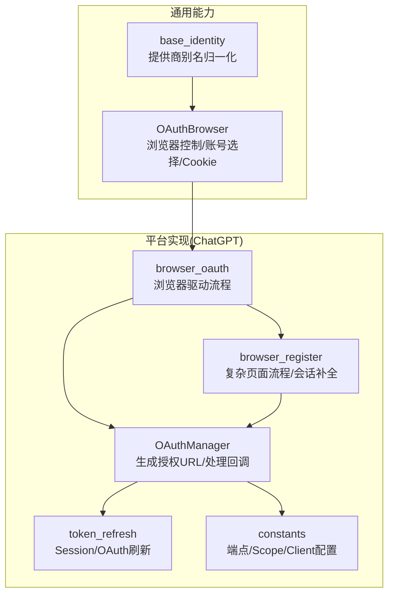
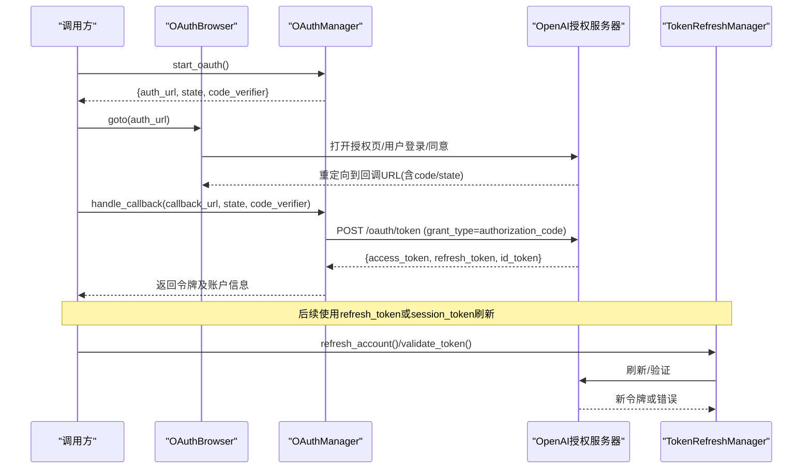
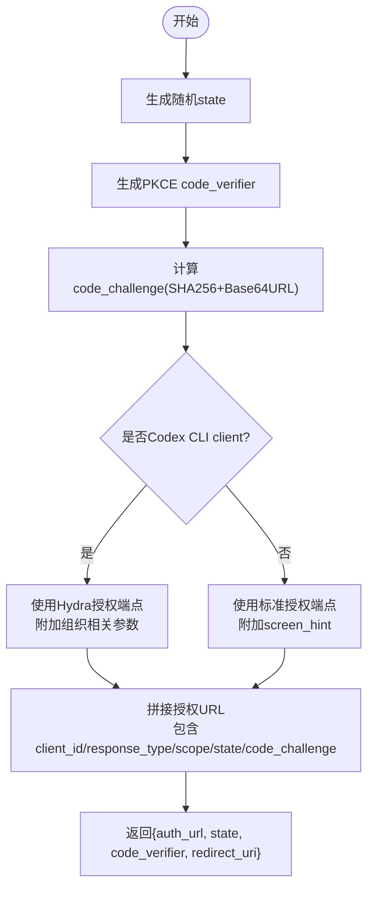
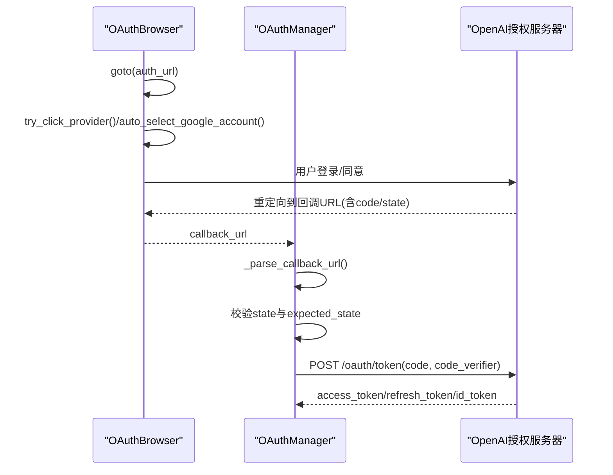
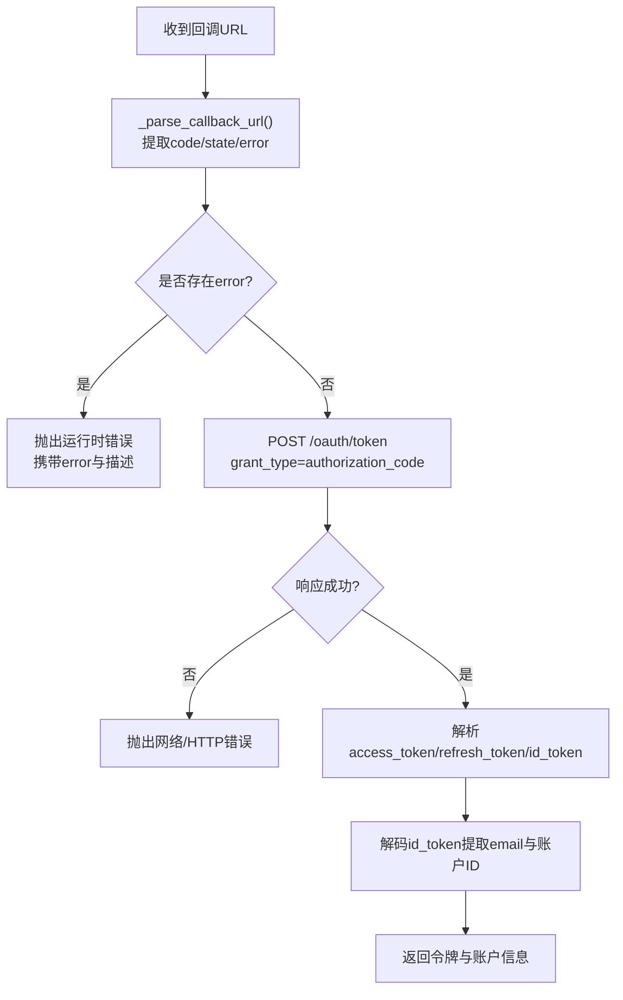
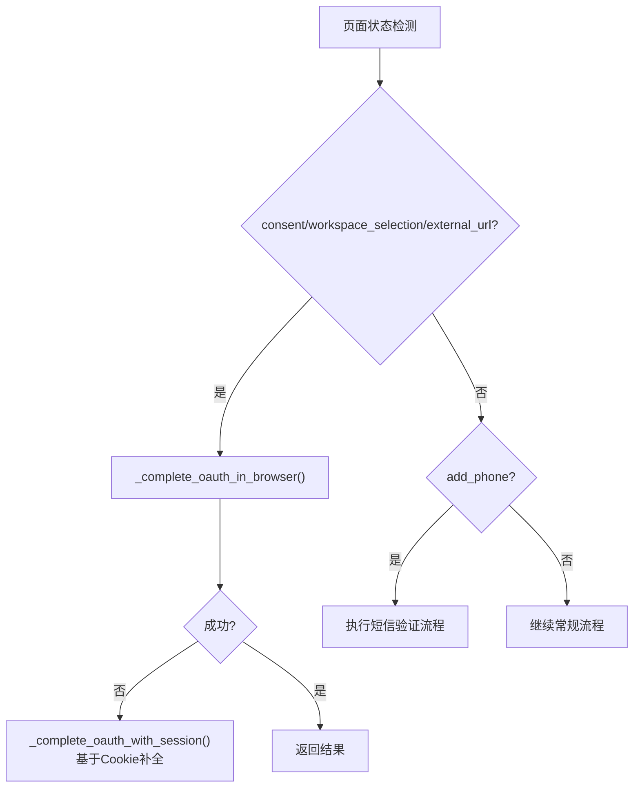
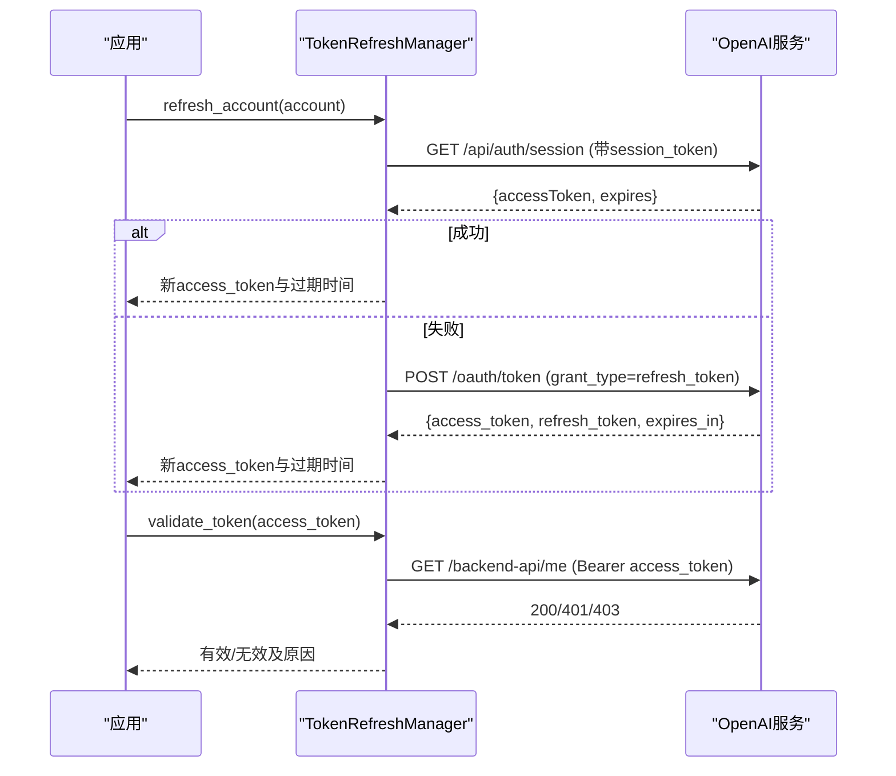
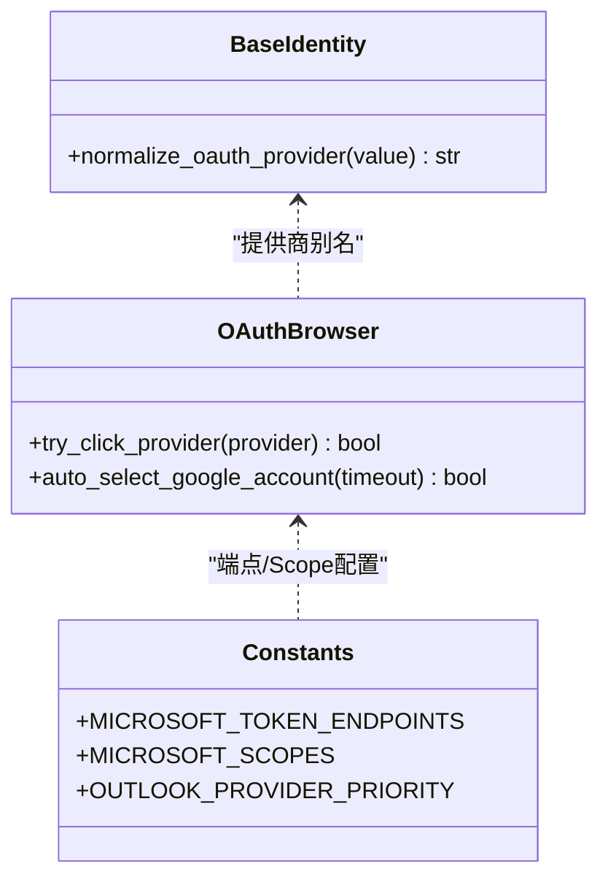
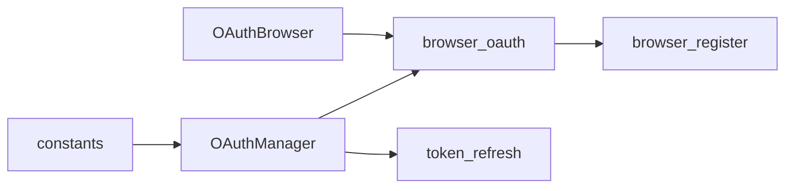

# OAuth认证流程

<cite>
**本文引用的文件**
- [core/oauth_browser.py](file://core/oauth_browser.py)
- [platforms/chatgpt/oauth.py](file://platforms/chatgpt/oauth.py)
- [platforms/chatgpt/browser_oauth.py](file://platforms/chatgpt/browser_oauth.py)
- [platforms/chatgpt/constants.py](file://platforms/chatgpt/constants.py)
- [platforms/chatgpt/browser_register.py](file://platforms/chatgpt/browser_register.py)
- [platforms/chatgpt/token_refresh.py](file://platforms/chatgpt/token_refresh.py)
- [core/base_identity.py](file://core/base_identity.py)
- [core/registration/errors.py](file://core/registration/errors.py)
</cite>

## 目录
1. [简介](#简介)
2. [项目结构](#项目结构)
3. [核心组件](#核心组件)
4. [架构总览](#架构总览)
5. [详细组件分析](#详细组件分析)
6. [依赖关系分析](#依赖关系分析)
7. [性能考虑](#性能考虑)
8. [故障排查指南](#故障排查指南)
9. [结论](#结论)
10. [附录](#附录)

## 简介
本文件系统化梳理本项目中的OAuth 2.0授权码流程实现，重点围绕OpenAI（ChatGPT）的OAuth集成，覆盖以下关键步骤：
- 授权请求构建（含PKCE、state生成与校验）
- 浏览器重定向与回调处理
- 授权码换取访问令牌
- 会话管理与Token刷新
- 多提供商适配与差异说明（Google、Microsoft、GitHub等）
- CSRF防护与安全措施
- 调试方法与常见问题定位

## 项目结构
本项目将OAuth能力分为“通用浏览器辅助”和“平台特定实现”两层：
- 通用层：提供跨平台的OAuth浏览器控制、账号选择、Cookie读取等能力
- 平台层：以ChatGPT为例，封装完整的授权码流程、回调解析、令牌交换、刷新策略

图表来源
- [core/oauth_browser.py:139-341](file://core/oauth_browser.py#L139-L341)
- [platforms/chatgpt/oauth.py:180-237](file://platforms/chatgpt/oauth.py#L180-L237)
- [platforms/chatgpt/browser_oauth.py:44-110](file://platforms/chatgpt/browser_oauth.py#L44-L110)
- [platforms/chatgpt/constants.py:53-68](file://platforms/chatgpt/constants.py#L53-L68)

章节来源
- [core/oauth_browser.py:139-341](file://core/oauth_browser.py#L139-L341)
- [platforms/chatgpt/oauth.py:180-237](file://platforms/chatgpt/oauth.py#L180-L237)
- [platforms/chatgpt/browser_oauth.py:44-110](file://platforms/chatgpt/browser_oauth.py#L44-L110)
- [platforms/chatgpt/constants.py:53-68](file://platforms/chatgpt/constants.py#L53-L68)

## 核心组件
- OAuthBrowser：封装Playwright/CDP/持久化Profile三种模式，支持代理、自动选择Google账号、等待回调URL、读取Cookie等。
- OAuthManager（ChatGPT）：负责生成授权URL（含PKCE）、解析回调、调用令牌端点换取access_token/id_token/refresh_token，并提取账户信息。
- browser_oauth（ChatGPT）：串联OAuthManager与OAuthBrowser，完成从打开授权页到获取令牌的完整流程。
- browser_register（ChatGPT）：处理更复杂的页面跳转（同意页、工作区选择、外部链接、短信验证等），必要时回退到会话补全或直接提交回调。
- token_refresh（ChatGPT）：支持通过Session Token或OAuth Refresh Token刷新访问令牌，并提供有效性校验。
- base_identity：提供OAuth提供商别名归一化（google/microsoft/github等）。

章节来源
- [core/oauth_browser.py:139-341](file://core/oauth_browser.py#L139-L341)
- [platforms/chatgpt/oauth.py:180-379](file://platforms/chatgpt/oauth.py#L180-L379)
- [platforms/chatgpt/browser_oauth.py:44-110](file://platforms/chatgpt/browser_oauth.py#L44-L110)
- [platforms/chatgpt/browser_register.py:1540-1824](file://platforms/chatgpt/browser_register.py#L1540-L1824)
- [platforms/chatgpt/token_refresh.py:37-243](file://platforms/chatgpt/token_refresh.py#L37-L243)
- [core/base_identity.py:18-45](file://core/base_identity.py#L18-L45)

## 架构总览
下图展示从发起授权到获取令牌、再到刷新令牌的端到端流程，映射到具体代码位置。

图表来源
- [platforms/chatgpt/oauth.py:190-237](file://platforms/chatgpt/oauth.py#L190-L237)
- [platforms/chatgpt/oauth.py:240-320](file://platforms/chatgpt/oauth.py#L240-L320)
- [platforms/chatgpt/browser_oauth.py:44-110](file://platforms/chatgpt/browser_oauth.py#L44-L110)
- [platforms/chatgpt/token_refresh.py:66-243](file://platforms/chatgpt/token_refresh.py#L66-L243)

## 详细组件分析

### 授权请求构建（含PKCE与State）
- 生成随机state用于CSRF防护
- 生成PKCE code_verifier并计算code_challenge（S256）
- 根据client_id选择不同授权端点（Hydra或标准authorize）
- 组装redirect_uri、scope、prompt等参数

图表来源
- [platforms/chatgpt/oauth.py:36-43](file://platforms/chatgpt/oauth.py#L36-L43)
- [platforms/chatgpt/oauth.py:190-237](file://platforms/chatgpt/oauth.py#L190-L237)
- [platforms/chatgpt/constants.py:53-68](file://platforms/chatgpt/constants.py#L53-L68)

章节来源
- [platforms/chatgpt/oauth.py:36-43](file://platforms/chatgpt/oauth.py#L36-L43)
- [platforms/chatgpt/oauth.py:190-237](file://platforms/chatgpt/oauth.py#L190-L237)
- [platforms/chatgpt/constants.py:53-68](file://platforms/chatgpt/constants.py#L53-L68)

### 浏览器重定向与回调处理
- 使用OAuthBrowser打开授权URL，支持自动点击提供商按钮、自动选择Google账号
- 等待回调URL到达（包含code与state）
- 解析回调URL，校验state一致性，防止CSRF攻击
- 若存在error字段，抛出异常并携带错误描述

图表来源
- [platforms/chatgpt/browser_oauth.py:44-110](file://platforms/chatgpt/browser_oauth.py#L44-L110)
- [platforms/chatgpt/oauth.py:46-88](file://platforms/chatgpt/oauth.py#L46-L88)
- [platforms/chatgpt/oauth.py:240-320](file://platforms/chatgpt/oauth.py#L240-L320)

章节来源
- [platforms/chatgpt/browser_oauth.py:44-110](file://platforms/chatgpt/browser_oauth.py#L44-L110)
- [platforms/chatgpt/oauth.py:46-88](file://platforms/chatgpt/oauth.py#L46-L88)
- [platforms/chatgpt/oauth.py:240-320](file://platforms/chatgpt/oauth.py#L240-L320)

### 访问令牌交换与账户信息提取
- 使用授权码、code_verifier、redirect_uri、client_id向令牌端点换取令牌
- 解析id_token中的email与账户标识
- 返回标准化结果（access_token、refresh_token、id_token、account_id、过期时间等）

图表来源
- [platforms/chatgpt/oauth.py:125-178](file://platforms/chatgpt/oauth.py#L125-L178)
- [platforms/chatgpt/oauth.py:240-320](file://platforms/chatgpt/oauth.py#L240-L320)

章节来源
- [platforms/chatgpt/oauth.py:125-178](file://platforms/chatgpt/oauth.py#L125-L178)
- [platforms/chatgpt/oauth.py:240-320](file://platforms/chatgpt/oauth.py#L240-L320)

### 复杂页面流程与会话补全
- 当进入同意页、工作区选择、外部链接等状态时，优先尝试在浏览器内完成交互
- 若失败则回退为从当前会话Cookie中补全令牌
- 遇到短信验证（add_phone）时，触发短信验证码流程后继续

图表来源
- [platforms/chatgpt/browser_register.py:1801-1824](file://platforms/chatgpt/browser_register.py#L1801-L1824)
- [platforms/chatgpt/browser_register.py:1540-1557](file://platforms/chatgpt/browser_register.py#L1540-L1557)

章节来源
- [platforms/chatgpt/browser_register.py:1540-1557](file://platforms/chatgpt/browser_register.py#L1540-L1557)
- [platforms/chatgpt/browser_register.py:1801-1824](file://platforms/chatgpt/browser_register.py#L1801-L1824)

### 会话管理与Token刷新
- 优先尝试使用Session Token刷新（设置__Secure-next-auth.session-token后访问会话端点）
- 若失败则使用OAuth Refresh Token刷新
- 提供令牌有效性校验接口（调用后端API验证）

图表来源
- [platforms/chatgpt/token_refresh.py:66-243](file://platforms/chatgpt/token_refresh.py#L66-L243)

章节来源
- [platforms/chatgpt/token_refresh.py:66-243](file://platforms/chatgpt/token_refresh.py#L66-L243)

### 多提供商适配与差异
- 提供商别名归一化：支持google/google-oauth2、microsoft/windowslive/live、x/twitter等
- 浏览器自动识别与点击：按标签与提示词匹配提供商按钮
- Google账号选择器：在Chrome Profile模式下自动点击第一个账号
- Microsoft IMAP/Graph API端点与Scope差异：旧版IMAP与新端点不同，Graph API需特定scope
- OpenAI特殊逻辑：Hydra端点与标准authorize端点切换；Codex CLI附加参数

图表来源
- [core/base_identity.py:18-45](file://core/base_identity.py#L18-L45)
- [core/oauth_browser.py:11-35](file://core/oauth_browser.py#L11-L35)
- [platforms/chatgpt/constants.py:375-402](file://platforms/chatgpt/constants.py#L375-L402)

章节来源
- [core/base_identity.py:18-45](file://core/base_identity.py#L18-L45)
- [core/oauth_browser.py:11-35](file://core/oauth_browser.py#L11-L35)
- [platforms/chatgpt/constants.py:375-402](file://platforms/chatgpt/constants.py#L375-L402)

## 依赖关系分析
- OAuthManager依赖constants中的端点与Scope配置
- browser_oauth依赖OAuthBrowser进行浏览器操作，并调用OAuthManager完成令牌交换
- browser_register在复杂场景下回退到会话补全或直接提交回调
- token_refresh独立于浏览器，仅依赖HTTP客户端与服务端点

图表来源
- [platforms/chatgpt/constants.py:53-68](file://platforms/chatgpt/constants.py#L53-L68)
- [platforms/chatgpt/oauth.py:180-237](file://platforms/chatgpt/oauth.py#L180-L237)
- [platforms/chatgpt/browser_oauth.py:44-110](file://platforms/chatgpt/browser_oauth.py#L44-L110)
- [platforms/chatgpt/browser_register.py:1540-1824](file://platforms/chatgpt/browser_register.py#L1540-L1824)
- [platforms/chatgpt/token_refresh.py:37-243](file://platforms/chatgpt/token_refresh.py#L37-L243)

章节来源
- [platforms/chatgpt/constants.py:53-68](file://platforms/chatgpt/constants.py#L53-L68)
- [platforms/chatgpt/oauth.py:180-237](file://platforms/chatgpt/oauth.py#L180-L237)
- [platforms/chatgpt/browser_oauth.py:44-110](file://platforms/chatgpt/browser_oauth.py#L44-L110)
- [platforms/chatgpt/browser_register.py:1540-1824](file://platforms/chatgpt/browser_register.py#L1540-L1824)
- [platforms/chatgpt/token_refresh.py:37-243](file://platforms/chatgpt/token_refresh.py#L37-L243)

## 性能考虑
- 浏览器复用：支持连接已运行的Chrome（CDP）或使用持久化Profile，减少启动开销
- 无头模式限制：持久化上下文不支持headless，需在配置中明确
- 网络代理：统一构建代理配置，避免重复解析
- Cookie读取优化：按域名子串过滤，减少不必要遍历
- Token刷新优先级：先尝试Session Token刷新，失败再走OAuth Refresh Token，降低授权次数

[本节为通用指导，不直接分析具体文件]

## 故障排查指南
- 回调缺少code或state：检查授权URL是否正确生成，回调URL是否被截断或转义
- state不匹配：确认服务端保存的state与回调中的state一致，防止CSRF
- 令牌交换失败：检查grant_type、client_id、redirect_uri、code_verifier是否一致；查看HTTP状态码与响应体
- 浏览器未跳转：延长等待超时，检查是否有弹窗或拦截；确认回调URL匹配条件
- 同意页/工作区选择卡住：尝试在浏览器内手动完成；或回退到会话补全
- 短信验证失败：检查短信回调是否生效；记录错误日志并中止流程
- Token刷新失败：确认session_token或refresh_token有效；检查服务端返回的expires与access_token

章节来源
- [platforms/chatgpt/oauth.py:46-88](file://platforms/chatgpt/oauth.py#L46-L88)
- [platforms/chatgpt/oauth.py:240-320](file://platforms/chatgpt/oauth.py#L240-L320)
- [platforms/chatgpt/browser_register.py:1540-1824](file://platforms/chatgpt/browser_register.py#L1540-L1824)
- [platforms/chatgpt/token_refresh.py:66-243](file://platforms/chatgpt/token_refresh.py#L66-L243)
- [core/registration/errors.py:4-25](file://core/registration/errors.py#L4-L25)

## 结论
本项目实现了稳定可靠的OAuth 2.0授权码流程，结合PKCE与state校验保障安全，通过浏览器自动化与会话补全提升成功率，并提供完善的Token刷新机制。针对多提供商提供了别名归一化与差异化配置，便于扩展到其他平台。建议在生产环境中启用代理、合理设置超时与重试，并结合日志与监控快速定位问题。

[本节为总结性内容，不直接分析具体文件]

## 附录
- 关键函数路径参考：
  - 生成授权URL：[platforms/chatgpt/oauth.py:190-237](file://platforms/chatgpt/oauth.py#L190-L237)
  - 处理回调与换令牌：[platforms/chatgpt/oauth.py:240-320](file://platforms/chatgpt/oauth.py#L240-L320)
  - 浏览器驱动流程：[platforms/chatgpt/browser_oauth.py:44-110](file://platforms/chatgpt/browser_oauth.py#L44-L110)
  - 复杂页面处理与会话补全：[platforms/chatgpt/browser_register.py:1540-1824](file://platforms/chatgpt/browser_register.py#L1540-L1824)
  - Token刷新与校验：[platforms/chatgpt/token_refresh.py:66-243](file://platforms/chatgpt/token_refresh.py#L66-L243)
  - 提供商别名与浏览器辅助：[core/base_identity.py:18-45](file://core/base_identity.py#L18-L45), [core/oauth_browser.py:11-35](file://core/oauth_browser.py#L11-L35)

[本节为索引性内容，不直接分析具体文件]