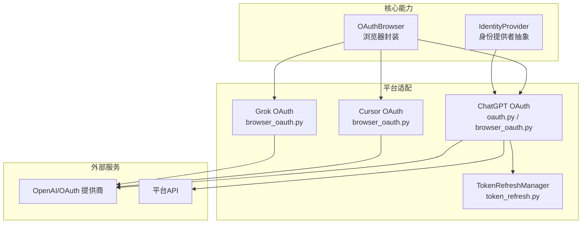
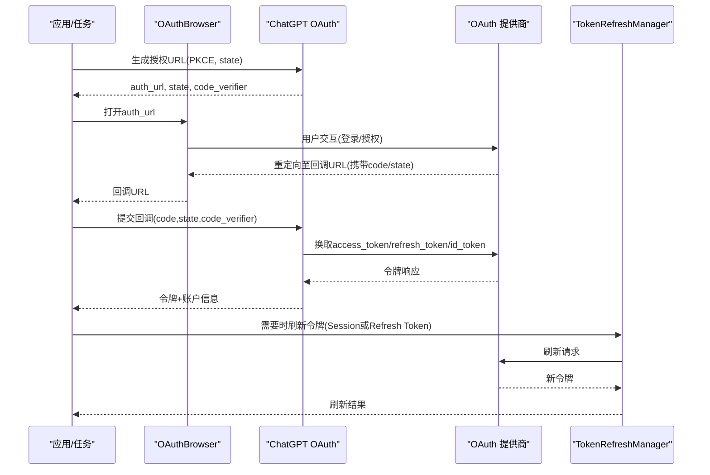
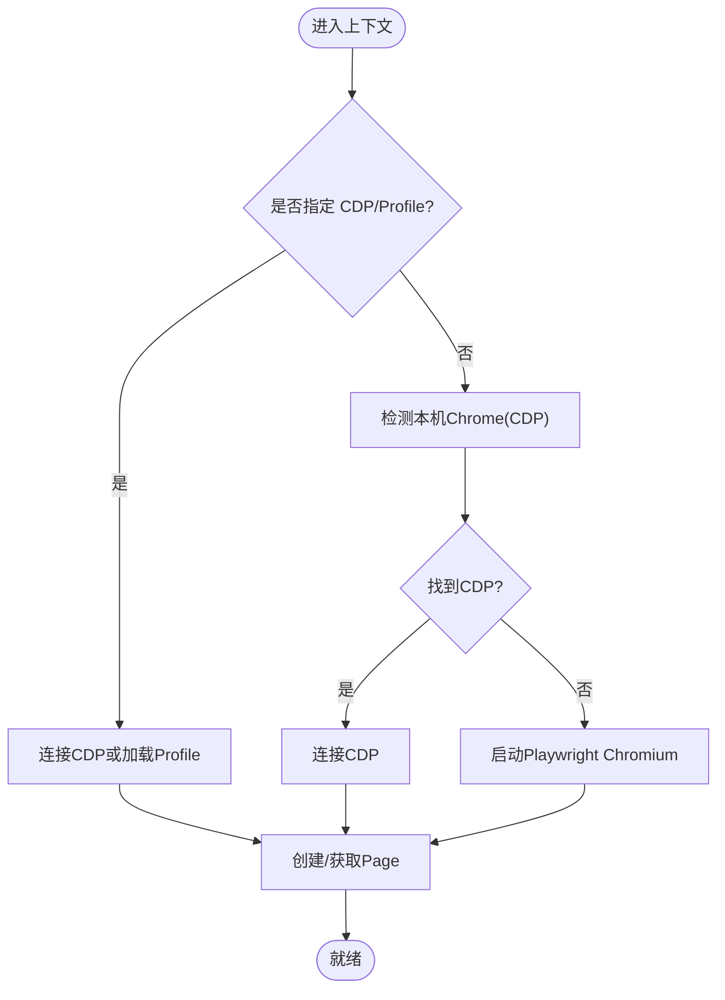
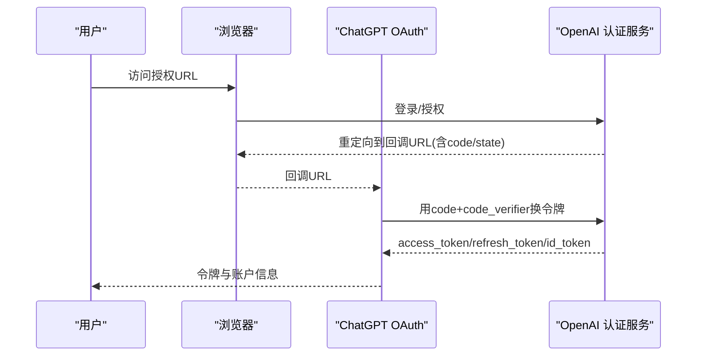
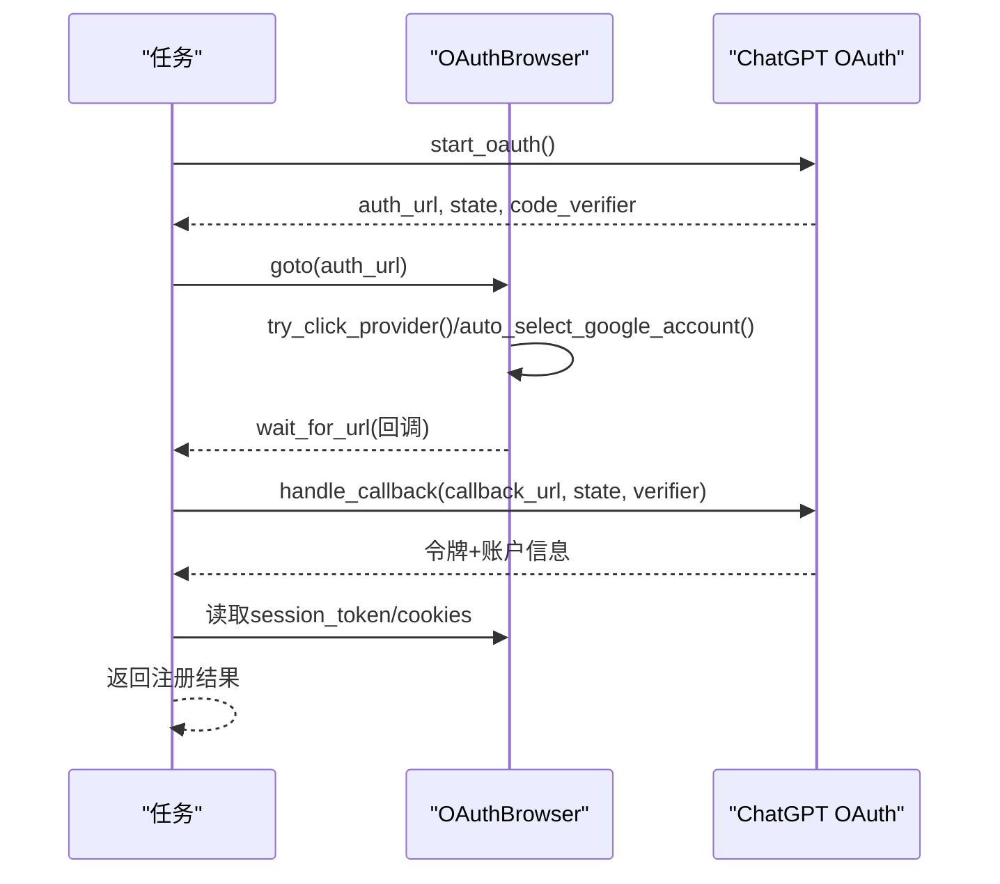
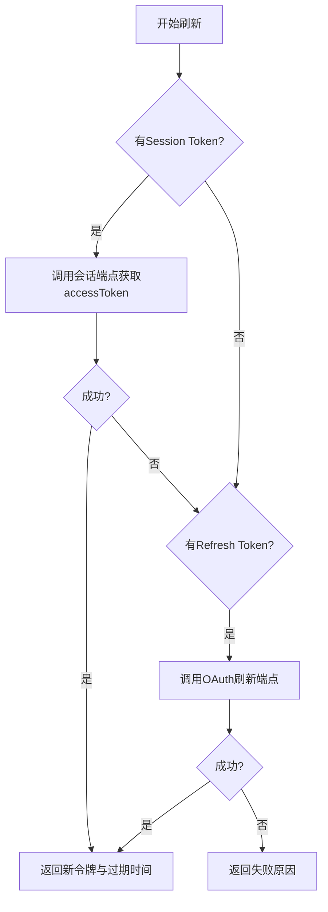
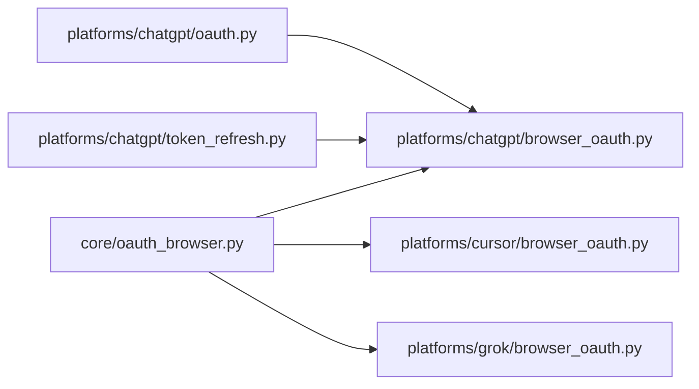

# OAuth集成开发

<cite>
**本文引用的文件**
- [core/oauth_browser.py](file://core/oauth_browser.py)
- [core/manual_oauth_browser.py](file://core/manual_oauth_browser.py)
- [core/base_identity.py](file://core/base_identity.py)
- [platforms/chatgpt/oauth.py](file://platforms/chatgpt/oauth.py)
- [platforms/chatgpt/browser_oauth.py](file://platforms/chatgpt/browser_oauth.py)
- [platforms/chatgpt/token_refresh.py](file://platforms/chatgpt/token_refresh.py)
- [platforms/chatgpt/constants.py](file://platforms/chatgpt/constants.py)
- [platforms/cursor/browser_oauth.py](file://platforms/cursor/browser_oauth.py)
- [platforms/grok/browser_oauth.py](file://platforms/grok/browser_oauth.py)
</cite>

## 目录
1. [简介](#简介)
2. [项目结构](#项目结构)
3. [核心组件](#核心组件)
4. [架构总览](#架构总览)
5. [详细组件分析](#详细组件分析)
6. [依赖关系分析](#依赖关系分析)
7. [性能考虑](#性能考虑)
8. [故障排查指南](#故障排查指南)
9. [结论](#结论)
10. [附录](#附录)

## 简介
本指南面向需要在平台适配器中实现第三方登录（OAuth）的开发者，系统讲解授权码流程、令牌刷新与会话管理，对比 manual_oauth_browser 与 oauth_browser 两种模式的区别与适用场景，并以 ChatGPT 平台为例给出完整实现分析。文档同时提供提供商配置方法、安全注意事项、错误处理与调试技巧，帮助快速为新平台添加 OAuth 支持。

## 项目结构
本项目将“通用 OAuth 浏览器能力”下沉到 core 层，各平台在 platforms/* 下实现具体适配逻辑：
- core 层提供跨平台的浏览器自动化、Cookie/URL 等待、代理配置、Google 账号自动选择等能力。
- platforms/chatgpt 实现了完整的 OpenAI/Codex OAuth 流程（PKCE、回调解析、令牌交换、会话提取）。
- platforms/cursor、grok 等展示了不同平台通过 Cookie/SSO 完成登录的模式。
- token_refresh 模块提供 Session Token 与 OAuth Refresh Token 两种续期策略。

图表来源
- [core/oauth_browser.py:139-231](file://core/oauth_browser.py#L139-L231)
- [platforms/chatgpt/oauth.py:190-320](file://platforms/chatgpt/oauth.py#L190-L320)
- [platforms/chatgpt/browser_oauth.py:44-110](file://platforms/chatgpt/browser_oauth.py#L44-L110)
- [platforms/chatgpt/token_refresh.py:37-206](file://platforms/chatgpt/token_refresh.py#L37-L206)

章节来源
- [core/oauth_browser.py:1-459](file://core/oauth_browser.py#L1-L459)
- [platforms/chatgpt/oauth.py:1-379](file://platforms/chatgpt/oauth.py#L1-L379)
- [platforms/chatgpt/browser_oauth.py:1-115](file://platforms/chatgpt/browser_oauth.py#L1-L115)
- [platforms/chatgpt/token_refresh.py:1-339](file://platforms/chatgpt/token_refresh.py#L1-L339)

## 核心组件
- OAuthBrowser：统一封装 Playwright/Chrome Profile/CDP，提供导航、等待 URL/Cookie、点击提供商按钮、Google 账号自动选择等能力。
- IdentityProvider：抽象邮箱与浏览器 OAuth 两种方式，规范化 provider 别名并产出 IdentityMaterial。
- ChatGPT OAuth：生成授权 URL（含 PKCE）、解析回调、换取 access_token/refresh_token/id_token，并提取账户信息。
- TokenRefreshManager：优先使用 Session Token 刷新，回退到 OAuth Refresh Token；支持验证 access_token 有效性。
- 平台适配：以 ChatGPT/Cursor/Grok 为例，展示如何驱动浏览器完成登录、捕获关键 Cookie/Token 并返回给上层。

章节来源
- [core/oauth_browser.py:139-459](file://core/oauth_browser.py#L139-L459)
- [core/base_identity.py:39-131](file://core/base_identity.py#L39-L131)
- [platforms/chatgpt/oauth.py:180-379](file://platforms/chatgpt/oauth.py#L180-L379)
- [platforms/chatgpt/token_refresh.py:37-206](file://platforms/chatgpt/token_refresh.py#L37-L206)

## 架构总览
下图展示从发起 OAuth 到获取令牌、后续刷新与使用的整体流程。

图表来源
- [platforms/chatgpt/oauth.py:190-320](file://platforms/chatgpt/oauth.py#L190-L320)
- [platforms/chatgpt/browser_oauth.py:44-110](file://platforms/chatgpt/browser_oauth.py#L44-L110)
- [platforms/chatgpt/token_refresh.py:66-206](file://platforms/chatgpt/token_refresh.py#L66-L206)

## 详细组件分析

### OAuthBrowser：浏览器自动化与等待机制
- 启动策略：优先连接已运行的 Chrome（CDP），其次尝试本地持久化 Profile，最后回退到普通 Chromium。
- 代理支持：解析 proxy 字符串为 Playwright 可接受的配置。
- 交互辅助：按名称/属性智能匹配并点击“Google/GitHub/Microsoft/Apple/X/Builder ID”等提供商按钮；在 Google 账号选择器出现时自动点击首个账号。
- 等待与采集：等待 URL 满足谓词、等待指定 Cookie 值、批量读取 Cookie 并构造 Cookie Header/Dict。

图表来源
- [core/oauth_browser.py:162-213](file://core/oauth_browser.py#L162-L213)

章节来源
- [core/oauth_browser.py:63-128](file://core/oauth_browser.py#L63-L128)
- [core/oauth_browser.py:139-231](file://core/oauth_browser.py#L139-L231)
- [core/oauth_browser.py:242-393](file://core/oauth_browser.py#L242-L393)

### IdentityProvider：邮箱与浏览器 OAuth 的统一入口
- 规范化 identity_provider：支持 mailbox、oauth_browser 及兼容别名。
- 规范化 oauth_provider：将 google-oauth2、windowslive、builder id 等别名归一为标准标识。
- BrowserOAuthIdentityProvider：产出 email_hint、oauth_provider、chrome_user_data_dir/chrome_cdp_url 等元数据，供上层驱动浏览器登录。

章节来源
- [core/base_identity.py:7-46](file://core/base_identity.py#L7-L46)
- [core/base_identity.py:100-131](file://core/base_identity.py#L100-L131)

### ChatGPT OAuth：授权码 + PKCE + 回调交换
- 生成授权 URL：包含 client_id、response_type=code、redirect_uri、scope、state、code_challenge(SHA256)、prompt=login；针对 Codex CLI 走 Hydra 端点并附加特定参数。
- 回调解析：兼容 query 与 fragment 中的 code/state/error，自动补齐缺失部分。
- 令牌交换：POST form 到 token 端点，换取 access_token、refresh_token、id_token，并解析 JWT payload 得到 email 与 account_id。
- 管理器：封装 start/handle_callback/extract_account_info，便于上层调用。

图表来源
- [platforms/chatgpt/oauth.py:190-320](file://platforms/chatgpt/oauth.py#L190-L320)

章节来源
- [platforms/chatgpt/oauth.py:26-115](file://platforms/chatgpt/oauth.py#L26-L115)
- [platforms/chatgpt/oauth.py:180-320](file://platforms/chatgpt/oauth.py#L180-L320)
- [platforms/chatgpt/oauth.py:323-379](file://platforms/chatgpt/oauth.py#L323-L379)

### ChatGPT 浏览器登录流程：manual vs browser
- register_with_browser_oauth：驱动 OAuthBrowser 打开授权页，可选自动点击提供商，等待回调 URL，交换令牌，拉取 profile，最终返回 email、account_id、access_token、refresh_token、id_token、session_token、cookies 等。
- manual_oauth_browser：向后兼容别名，实际指向同一实现。

图表来源
- [platforms/chatgpt/browser_oauth.py:44-110](file://platforms/chatgpt/browser_oauth.py#L44-L110)
- [platforms/chatgpt/oauth.py:323-366](file://platforms/chatgpt/oauth.py#L323-L366)

章节来源
- [platforms/chatgpt/browser_oauth.py:1-115](file://platforms/chatgpt/browser_oauth.py#L1-L115)
- [core/manual_oauth_browser.py:1-13](file://core/manual_oauth_browser.py#L1-L13)

### Cursor 与 Grok：基于 Cookie/SSO 的简化登录
- Cursor：登录后等待 WorkosCursorSessionToken Cookie，再拉取用户信息。
- Grok：登录后等待 sso/sso-rw Cookie，直接返回 SSO 凭证。
- 两者均复用 OAuthBrowser 的等待 Cookie 与提供商点击能力。

章节来源
- [platforms/cursor/browser_oauth.py:1-66](file://platforms/cursor/browser_oauth.py#L1-L66)
- [platforms/grok/browser_oauth.py:1-64](file://platforms/grok/browser_oauth.py#L1-L64)

### Token 刷新与会话管理
- 优先级：优先使用 Session Token 刷新（设置 __Secure-next-auth.session-token 后访问会话端点获取 accessToken），失败则回退到 OAuth Refresh Token 刷新。
- 校验：通过调用后端接口验证 access_token 有效性，区分 401/403 等状态。
- 结果：返回新的 access_token、可能的 refresh_token、过期时间等信息。

图表来源
- [platforms/chatgpt/token_refresh.py:66-206](file://platforms/chatgpt/token_refresh.py#L66-L206)

章节来源
- [platforms/chatgpt/token_refresh.py:37-206](file://platforms/chatgpt/token_refresh.py#L37-L206)
- [platforms/chatgpt/token_refresh.py:245-278](file://platforms/chatgpt/token_refresh.py#L245-L278)

## 依赖关系分析
- OAuthBrowser 依赖 Playwright 与系统 Chrome（可选），提供跨平台一致的浏览器控制能力。
- ChatGPT OAuth 依赖 curl_cffi 模拟浏览器指纹进行令牌交换，降低被风控概率。
- TokenRefreshManager 依赖 OpenAI 会话与 OAuth 端点，具备代理与超时控制。
- 各平台适配仅关注自身登录入口与关键 Cookie/Token 字段，复用 core 能力。

图表来源
- [core/oauth_browser.py:139-231](file://core/oauth_browser.py#L139-L231)
- [platforms/chatgpt/oauth.py:180-320](file://platforms/chatgpt/oauth.py#L180-L320)
- [platforms/chatgpt/browser_oauth.py:44-110](file://platforms/chatgpt/browser_oauth.py#L44-L110)
- [platforms/chatgpt/token_refresh.py:37-206](file://platforms/chatgpt/token_refresh.py#L37-L206)

章节来源
- [core/oauth_browser.py:1-459](file://core/oauth_browser.py#L1-L459)
- [platforms/chatgpt/oauth.py:1-379](file://platforms/chatgpt/oauth.py#L1-L379)
- [platforms/chatgpt/browser_oauth.py:1-115](file://platforms/chatgpt/browser_oauth.py#L1-L115)
- [platforms/chatgpt/token_refresh.py:1-339](file://platforms/chatgpt/token_refresh.py#L1-L339)

## 性能考虑
- 浏览器启动策略：优先复用已运行 Chrome（CDP）或持久化 Profile，减少冷启动开销。
- 等待策略：使用谓词等待 URL/Cookie，避免轮询风暴；合理设置超时与间隔。
- 网络请求：使用带指纹的请求库并支持代理，提升成功率与稳定性。
- 刷新策略：优先 Session Token 刷新，减少 OAuth 刷新次数与限流风险。

[本节为通用指导，不直接分析具体文件]

## 故障排查指南
- 回调解析异常：检查回调 URL 中 code/state 是否在 query 或 fragment；确保 state 一致。
- 令牌交换失败：核对 client_id、redirect_uri、scope 与 code_verifier；查看 HTTP 状态码与响应体。
- 浏览器未跳转：确认回调 URL 谓词正确；必要时延长超时；检查代理与 DNS。
- 账号不一致：使用 finalize_oauth_email 校验实际邮箱与预期是否一致。
- 刷新失败：先尝试 Session Token 刷新，再回退到 OAuth Refresh Token；记录错误消息定位问题。
- 调试建议：开启日志输出；打印当前 URL、Cookie 列表；逐步缩小等待范围。

章节来源
- [platforms/chatgpt/oauth.py:46-88](file://platforms/chatgpt/oauth.py#L46-L88)
- [platforms/chatgpt/oauth.py:240-320](file://platforms/chatgpt/oauth.py#L240-L320)
- [core/oauth_browser.py:327-393](file://core/oauth_browser.py#L327-L393)
- [platforms/chatgpt/token_refresh.py:66-206](file://platforms/chatgpt/token_refresh.py#L66-L206)

## 结论
本项目通过 core 层的通用 OAuth 浏览器能力与各平台的轻量适配，实现了稳定、可扩展的第三方登录方案。ChatGPT 平台采用标准 OAuth 授权码 + PKCE 流程，配合 Session Token 与 Refresh Token 双通道续期，兼顾易用性与可靠性。其他平台（如 Cursor、Grok）则以 Cookie/SSO 方式快速接入。开发者可据此为新平台快速添加 OAuth 支持，并复用统一的浏览器自动化与令牌管理能力。

[本节为总结性内容，不直接分析具体文件]

## 附录

### 两种 OAuth 模式对比与使用场景
- manual_oauth_browser：向后兼容别名，实际与 oauth_browser 相同实现。适用于希望沿用旧命名或兼容历史代码的场景。
- oauth_browser：推荐的新模式，语义更清晰，强调“浏览器驱动”的登录方式。适用于需要自动化或半自动化登录的平台。

章节来源
- [core/manual_oauth_browser.py:1-13](file://core/manual_oauth_browser.py#L1-L13)
- [core/oauth_browser.py:396-397](file://core/oauth_browser.py#L396-L397)

### ChatGPT 提供商配置与安全
- 配置项：client_id、auth_url、token_url、redirect_uri、scope 可通过环境变量覆盖，便于多环境部署。
- 安全要点：
  - 使用 PKCE（code_challenge=S256）增强安全性。
  - 严格校验 state，防止 CSRF。
  - 限制 redirect_uri 白名单。
  - 妥善存储 access_token/refresh_token/session_token，最小权限原则。
  - 使用 HTTPS 与安全的 Cookie（__Secure-*）。

章节来源
- [platforms/chatgpt/constants.py:53-69](file://platforms/chatgpt/constants.py#L53-L69)
- [platforms/chatgpt/oauth.py:190-237](file://platforms/chatgpt/oauth.py#L190-L237)
- [platforms/chatgpt/browser_oauth.py:97-110](file://platforms/chatgpt/browser_oauth.py#L97-L110)

### 自定义 OAuth 流程示例（步骤指引）
- 步骤 1：在平台目录下新增 browser_oauth.py，复用 OAuthBrowser 打开登录入口。
- 步骤 2：根据平台要求，等待关键 Cookie/URL（如 session token、SSO cookie）。
- 步骤 3：如需标准 OAuth，集成生成授权 URL、回调解析与令牌交换逻辑。
- 步骤 4：返回统一的结构（email、token(s)、cookies、profile 等），供上层使用。
- 步骤 5：如需续期，实现或复用 TokenRefreshManager 的刷新策略。

章节来源
- [platforms/cursor/browser_oauth.py:13-61](file://platforms/cursor/browser_oauth.py#L13-L61)
- [platforms/grok/browser_oauth.py:12-59](file://platforms/grok/browser_oauth.py#L12-L59)
- [platforms/chatgpt/oauth.py:190-320](file://platforms/chatgpt/oauth.py#L190-L320)
- [platforms/chatgpt/token_refresh.py:66-206](file://platforms/chatgpt/token_refresh.py#L66-L206)