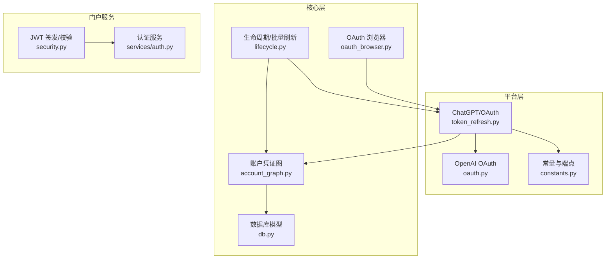
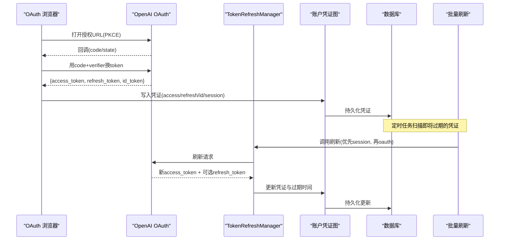
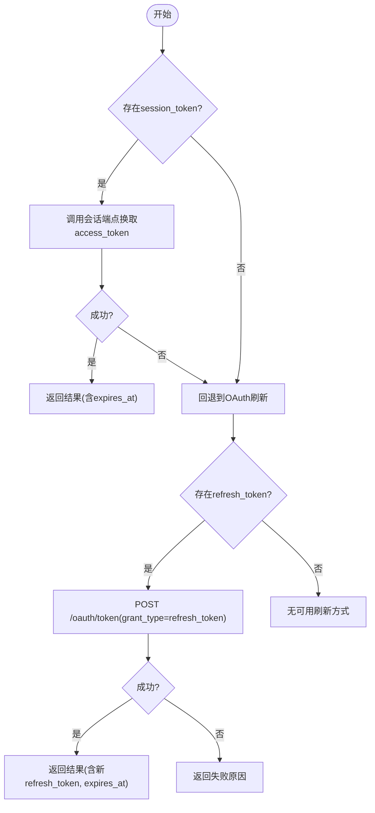
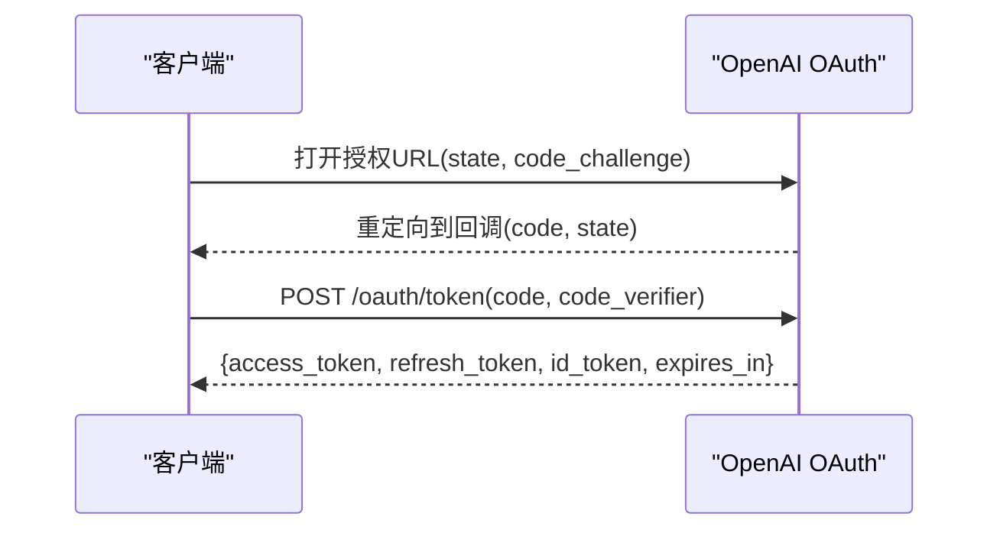
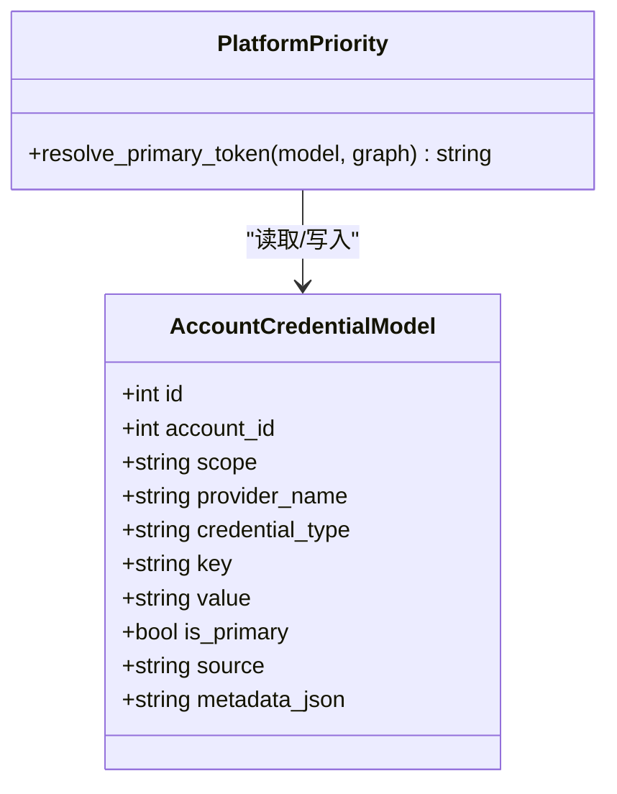
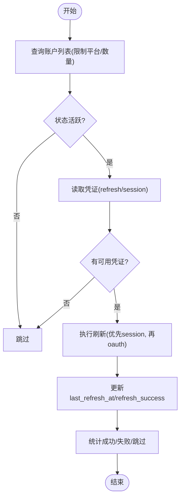
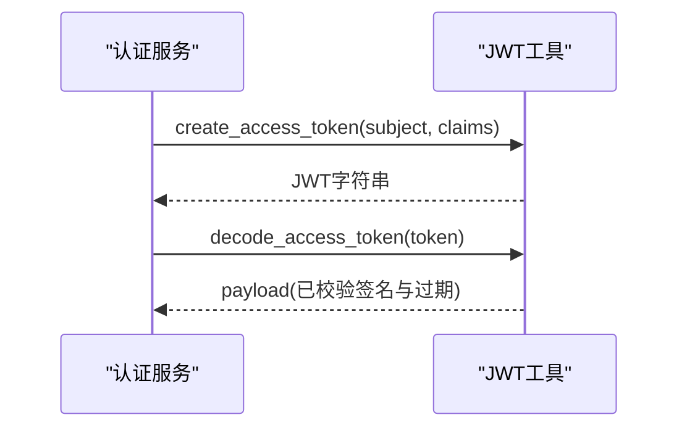
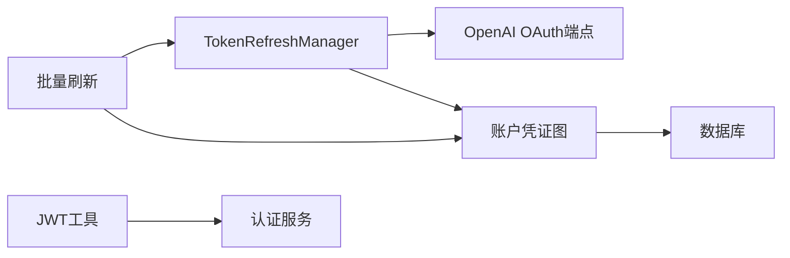

# 令牌管理

<cite>
**本文引用的文件**
- [platforms/chatgpt/token_refresh.py](file://platforms/chatgpt/token_refresh.py)
- [platforms/chatgpt/oauth.py](file://platforms/chatgpt/oauth.py)
- [platforms/chatgpt/constants.py](file://platforms/chatgpt/constants.py)
- [core/lifecycle.py](file://core/lifecycle.py)
- [core/account_graph.py](file://core/account_graph.py)
- [core/db.py](file://core/db.py)
- [customer_portal_api/app/security.py](file://customer_portal_api/app/security.py)
- [customer_portal_api/app/services/auth.py](file://customer_portal_api/app/services/auth.py)
- [core/oauth_browser.py](file://core/oauth_browser.py)
- [platforms/chatgpt/browser_register.py](file://platforms/chatgpt/browser_register.py)
</cite>

## 目录
1. [简介](#简介)
2. [项目结构](#项目结构)
3. [核心组件](#核心组件)
4. [架构总览](#架构总览)
5. [详细组件分析](#详细组件分析)
6. [依赖关系分析](#依赖关系分析)
7. [性能考虑](#性能考虑)
8. [故障排查指南](#故障排查指南)
9. [结论](#结论)
10. [附录](#附录)

## 简介
本文件系统性说明本项目中的 OAuth 令牌管理机制，覆盖访问令牌与刷新令牌的存储、更新与失效处理；JWT 的结构解析、签名验证与安全存储；自动续期的触发条件与重试策略；以及令牌缓存、过期时间检查、批量刷新等高级能力。同时给出令牌泄露防护、安全传输与持久化存储的最佳实践，并解释不同平台（如 OpenAI/Codex、门户系统）的令牌格式差异与兼容性处理。

## 项目结构
围绕令牌管理的代码主要分布在以下模块：
- ChatGPT/OpenAI 平台的令牌获取与刷新：platforms/chatgpt/*
- 账户凭证与图结构的持久化：core/account_graph.py, core/db.py
- 批量刷新调度与状态回写：core/lifecycle.py
- 门户系统的 JWT 签发与校验：customer_portal_api/app/security.py, customer_portal_api/app/services/auth.py
- 浏览器辅助与 Cookie/会话提取：core/oauth_browser.py
- 平台常量与端点配置：platforms/chatgpt/constants.py

**图示来源**
- [platforms/chatgpt/token_refresh.py:37-64](file://platforms/chatgpt/token_refresh.py#L37-L64)
- [platforms/chatgpt/oauth.py:180-237](file://platforms/chatgpt/oauth.py#L180-L237)
- [platforms/chatgpt/constants.py:53-77](file://platforms/chatgpt/constants.py#L53-L77)
- [core/lifecycle.py:104-193](file://core/lifecycle.py#L104-L193)
- [core/account_graph.py:20-52](file://core/account_graph.py#L20-L52)
- [core/db.py:25-73](file://core/db.py#L25-L73)
- [customer_portal_api/app/security.py:49-78](file://customer_portal_api/app/security.py#L49-L78)
- [customer_portal_api/app/services/auth.py:104-132](file://customer_portal_api/app/services/auth.py#L104-L132)

**章节来源**
- [platforms/chatgpt/token_refresh.py:37-64](file://platforms/chatgpt/token_refresh.py#L37-L64)
- [platforms/chatgpt/oauth.py:180-237](file://platforms/chatgpt/oauth.py#L180-L237)
- [platforms/chatgpt/constants.py:53-77](file://platforms/chatgpt/constants.py#L53-L77)
- [core/lifecycle.py:104-193](file://core/lifecycle.py#L104-L193)
- [core/account_graph.py:20-52](file://core/account_graph.py#L20-L52)
- [core/db.py:25-73](file://core/db.py#L25-L73)
- [customer_portal_api/app/security.py:49-78](file://customer_portal_api/app/security.py#L49-L78)
- [customer_portal_api/app/services/auth.py:104-132](file://customer_portal_api/app/services/auth.py#L104-L132)

## 核心组件
- 令牌刷新管理器（TokenRefreshManager）
  - 支持两种刷新方式：Session Token 刷新与 OAuth Refresh Token 刷新，优先尝试 Session Token，失败后回退到 OAuth 刷新。
  - 提供访问令牌有效性校验（调用后端接口验证）。
- OpenAI OAuth 流程（OAuthManager / generate_oauth_url / submit_callback_url）
  - 生成授权 URL（含 PKCE），处理回调并交换 access_token、refresh_token、id_token。
  - 从 id_token 中解析邮箱与账号标识。
- 账户凭证与图（AccountCredentialModel / account_graph）
  - 以“键值对”形式存储各类 token（access_token、refresh_token、session_token、id_token 等），并通过优先级选择主令牌。
- 批量刷新（refresh_expiring_tokens）
  - 按平台筛选、读取凭证、执行刷新、回写成功时间与结果摘要。
- 门户 JWT（create_access_token / decode_access_token）
  - HS256 签名、标准 claims（sub、iat、exp）、过期校验。
  - refresh_token 随机生成并哈希存储，附带过期时间。

**章节来源**
- [platforms/chatgpt/token_refresh.py:27-64](file://platforms/chatgpt/token_refresh.py#L27-L64)
- [platforms/chatgpt/oauth.py:180-237](file://platforms/chatgpt/oauth.py#L180-L237)
- [core/account_graph.py:20-52](file://core/account_graph.py#L20-L52)
- [core/lifecycle.py:104-193](file://core/lifecycle.py#L104-L193)
- [customer_portal_api/app/security.py:49-90](file://customer_portal_api/app/security.py#L49-L90)
- [customer_portal_api/app/services/auth.py:104-132](file://customer_portal_api/app/services/auth.py#L104-L132)

## 架构总览
下图展示令牌从获取、存储、校验到批量刷新的整体流程，以及与浏览器辅助和数据库的关系。

**图示来源**
- [platforms/chatgpt/oauth.py:180-237](file://platforms/chatgpt/oauth.py#L180-L237)
- [platforms/chatgpt/oauth.py:240-320](file://platforms/chatgpt/oauth.py#L240-L320)
- [platforms/chatgpt/token_refresh.py:66-206](file://platforms/chatgpt/token_refresh.py#L66-L206)
- [core/account_graph.py:20-52](file://core/account_graph.py#L20-L52)
- [core/lifecycle.py:104-193](file://core/lifecycle.py#L104-L193)

## 详细组件分析

### 令牌刷新管理器（TokenRefreshManager）
- 刷新策略
  - 优先使用 session_token 调用会话端点换取 access_token。
  - 若失败或不可用，则使用 refresh_token 走 OAuth refresh 流程。
- 结果封装
  - 统一返回 TokenRefreshResult，包含 success、access_token、refresh_token、expires_at、error_message。
- 有效性校验
  - 通过调用后端接口验证 access_token 是否有效，区分 401/403 等错误语义。

**图示来源**
- [platforms/chatgpt/token_refresh.py:66-206](file://platforms/chatgpt/token_refresh.py#L66-L206)
- [platforms/chatgpt/token_refresh.py:208-243](file://platforms/chatgpt/token_refresh.py#L208-L243)

**章节来源**
- [platforms/chatgpt/token_refresh.py:66-206](file://platforms/chatgpt/token_refresh.py#L66-L206)
- [platforms/chatgpt/token_refresh.py:208-243](file://platforms/chatgpt/token_refresh.py#L208-L243)

### OpenAI OAuth 流程（PKCE、回调与令牌交换）
- 授权阶段
  - 生成 state 与 code_verifier，计算 code_challenge，构造授权 URL。
- 回调处理
  - 解析回调参数（code、state），校验 state，使用 code 与 code_verifier 交换令牌。
- 令牌内容
  - 返回 access_token、refresh_token、id_token、expires_in；从 id_token 解析 email 与账号标识。

**图示来源**
- [platforms/chatgpt/oauth.py:180-237](file://platforms/chatgpt/oauth.py#L180-L237)
- [platforms/chatgpt/oauth.py:240-320](file://platforms/chatgpt/oauth.py#L240-L320)

**章节来源**
- [platforms/chatgpt/oauth.py:180-237](file://platforms/chatgpt/oauth.py#L180-L237)
- [platforms/chatgpt/oauth.py:240-320](file://platforms/chatgpt/oauth.py#L240-L320)

### 账户凭证存储与主令牌选择
- 凭证类型
  - 支持多种 key（access_token、refresh_token、session_token、id_token、client_id 等），并以 scope="platform" 标记平台级凭证。
- 主令牌选择
  - 根据平台优先级选择主令牌（例如 chatgpt 优先顺序为 access_token/accessToken/session_token/sessionToken/legacy_token）。
- 持久化
  - 通过 AccountCredentialModel 将凭证以键值对形式存入数据库，支持元数据与预览字段。

**图示来源**
- [core/db.py:59-73](file://core/db.py#L59-L73)
- [core/platform_accounts.py:34-63](file://core/platform_accounts.py#L34-L63)
- [core/account_graph.py:20-52](file://core/account_graph.py#L20-L52)

**章节来源**
- [core/db.py:59-73](file://core/db.py#L59-L73)
- [core/platform_accounts.py:34-63](file://core/platform_accounts.py#L34-L63)
- [core/account_graph.py:20-52](file://core/account_graph.py#L20-L52)

### 批量刷新与状态回写
- 触发条件
  - 仅对活跃状态的账号进行刷新（registered/trial/subscribed），且当前仅支持 chatgpt 平台。
- 执行流程
  - 读取凭证（refresh_token 或 session_token），调用刷新逻辑，成功后更新 last_refresh_at 与 refresh_success。
- 统计与日志
  - 记录成功、失败、跳过数量，便于监控与排障。

**图示来源**
- [core/lifecycle.py:104-193](file://core/lifecycle.py#L104-L193)

**章节来源**
- [core/lifecycle.py:104-193](file://core/lifecycle.py#L104-L193)

### 门户 JWT 签发与校验
- 签发
  - 使用 HS256 算法，header 声明 alg=HS256、typ=JWT；payload 包含 sub、iat、exp 及自定义 claims。
- 校验
  - 拆分三段，验证签名一致性，检查 exp 是否过期，否则拒绝访问。
- 刷新令牌
  - 生成随机 refresh_token，哈希后入库，设置过期时间。

**图示来源**
- [customer_portal_api/app/security.py:49-78](file://customer_portal_api/app/security.py#L49-L78)
- [customer_portal_api/app/services/auth.py:104-132](file://customer_portal_api/app/services/auth.py#L104-L132)

**章节来源**
- [customer_portal_api/app/security.py:49-78](file://customer_portal_api/app/security.py#L49-L78)
- [customer_portal_api/app/services/auth.py:104-132](file://customer_portal_api/app/services/auth.py#L104-L132)

### 浏览器辅助与 Cookie/会话提取
- 支持连接本地 Chrome（CDP）、复用用户数据目录或启动独立 Chromium。
- 提供等待特定 Cookie、解析回调 URL、自动选择 Google 账号等能力，便于完成 OAuth 登录流程。

**章节来源**
- [core/oauth_browser.py:139-214](file://core/oauth_browser.py#L139-L214)
- [core/oauth_browser.py:327-383](file://core/oauth_browser.py#L327-L383)

## 依赖关系分析
- 组件耦合
  - TokenRefreshManager 依赖 OpenAI OAuth 端点与 HTTP 客户端；与账户凭证图紧密交互以读写凭证。
  - lifecycle 模块依赖账户模型与凭证图，负责批量刷新与状态回写。
  - 门户 JWT 模块独立于平台令牌，但共享统一的鉴权理念（HS256、过期控制）。
- 外部依赖
  - curl_cffi 用于模拟浏览器指纹的网络请求。
  - Playwright 用于浏览器自动化与 Cookie 捕获。
  - SQLModel/SQLite 用于凭证与账户信息持久化。

**图示来源**
- [platforms/chatgpt/token_refresh.py:37-64](file://platforms/chatgpt/token_refresh.py#L37-L64)
- [core/lifecycle.py:104-193](file://core/lifecycle.py#L104-L193)
- [core/account_graph.py:20-52](file://core/account_graph.py#L20-L52)
- [customer_portal_api/app/security.py:49-78](file://customer_portal_api/app/security.py#L49-L78)

**章节来源**
- [platforms/chatgpt/token_refresh.py:37-64](file://platforms/chatgpt/token_refresh.py#L37-L64)
- [core/lifecycle.py:104-193](file://core/lifecycle.py#L104-L193)
- [core/account_graph.py:20-52](file://core/account_graph.py#L20-L52)
- [customer_portal_api/app/security.py:49-78](file://customer_portal_api/app/security.py#L49-L78)

## 性能考虑
- 网络请求
  - 使用连接池与会话复用减少握手开销；合理设置超时与重试次数。
- 刷新频率
  - 基于 expires_in 计算 expires_at，避免频繁刷新；批量刷新时限制每次处理的账户数量。
- 数据库写入
  - 批量更新时使用事务提交，减少锁竞争；仅更新必要字段。
- 浏览器自动化
  - 复用 CDP 连接或用户数据目录，降低启动成本；仅在必要时启动浏览器。

[本节为通用指导，不直接分析具体文件]

## 故障排查指南
- 刷新失败常见原因
  - HTTP 非 200：检查网络、代理、端点可达性。
  - 缺少 access_token：确认服务端响应结构与字段名。
  - 401/403：令牌无效或账号被封禁，需重新授权或联系平台。
- 批量刷新异常
  - 检查账户状态是否为活跃；确认凭证是否存在（refresh_token 或 session_token）。
  - 查看日志中的成功/失败/跳过计数，定位问题账户。
- JWT 校验失败
  - 签名不一致：检查密钥配置与编码方式。
  - 已过期：检查 exp 字段与服务端时间同步。

**章节来源**
- [platforms/chatgpt/token_refresh.py:99-132](file://platforms/chatgpt/token_refresh.py#L99-L132)
- [platforms/chatgpt/token_refresh.py:175-206](file://platforms/chatgpt/token_refresh.py#L175-L206)
- [platforms/chatgpt/token_refresh.py:245-278](file://platforms/chatgpt/token_refresh.py#L245-L278)
- [core/lifecycle.py:168-193](file://core/lifecycle.py#L168-L193)
- [customer_portal_api/app/security.py:65-78](file://customer_portal_api/app/security.py#L65-L78)

## 结论
本项目实现了健壮的 OAuth 令牌管理与刷新机制：通过 Session Token 与 OAuth Refresh Token 双通道保障可用性；以账户凭证图统一管理多平台令牌；借助批量刷新与状态回写实现自动化维护；门户 JWT 提供标准化的鉴权能力。结合浏览器辅助与持久化存储，形成端到端的令牌生命周期管理方案。建议在生产环境中强化密钥管理、网络容错与监控告警，以提升稳定性与安全性。

[本节为总结性内容，不直接分析具体文件]

## 附录

### 令牌格式与兼容性
- OpenAI/Codex
  - 使用 PKCE 的授权码模式；回调中交换得到 access_token、refresh_token、id_token。
  - 支持 Codex CLI 专用客户端 ID 与简化流程参数。
- 门户系统
  - 使用 HS256 签名的 JWT；refresh_token 随机生成并哈希存储。
- 兼容性处理
  - 通过平台优先级选择主令牌；对不同 key 命名（大小写变体）进行兼容识别。

**章节来源**
- [platforms/chatgpt/oauth.py:180-237](file://platforms/chatgpt/oauth.py#L180-L237)
- [platforms/chatgpt/constants.py:53-77](file://platforms/chatgpt/constants.py#L53-L77)
- [customer_portal_api/app/security.py:49-90](file://customer_portal_api/app/security.py#L49-L90)
- [core/platform_accounts.py:34-63](file://core/platform_accounts.py#L34-L63)

### 安全最佳实践
- 令牌泄露防护
  - 最小权限原则：仅申请必要 scope。
  - 敏感字段脱敏：在日志与前端展示中使用预览字段。
  - 刷新令牌哈希存储：避免明文保存。
- 安全传输
  - 强制 HTTPS；使用代理时确保隧道加密。
  - 浏览器自动化中谨慎处理 Cookie 与本地存储。
- 持久化存储
  - 数据库加密（磁盘级或列级）；定期备份与访问审计。
  - 限制数据库访问权限与网络暴露面。

[本节为通用指导，不直接分析具体文件]