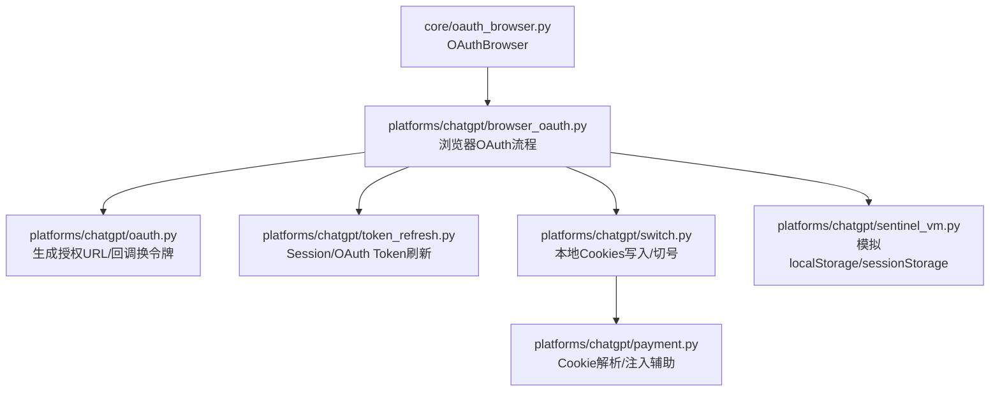
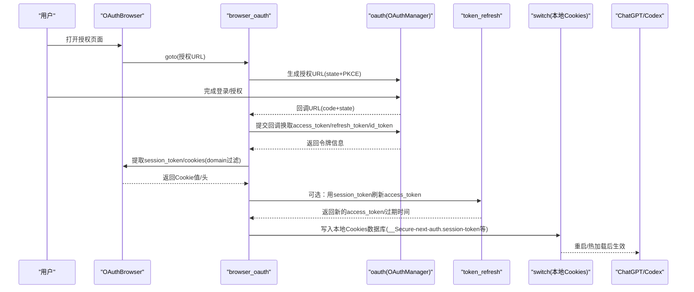
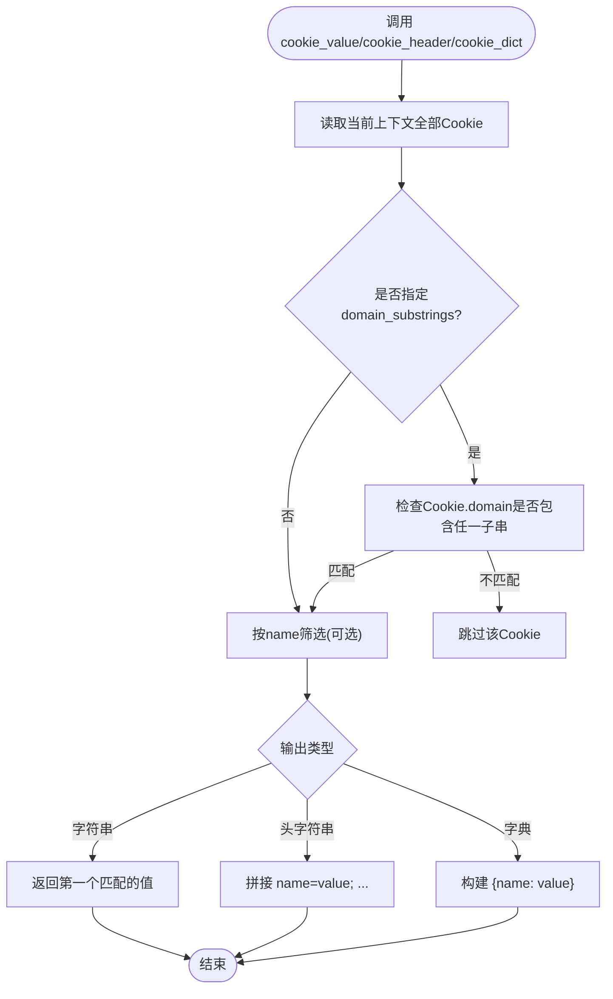
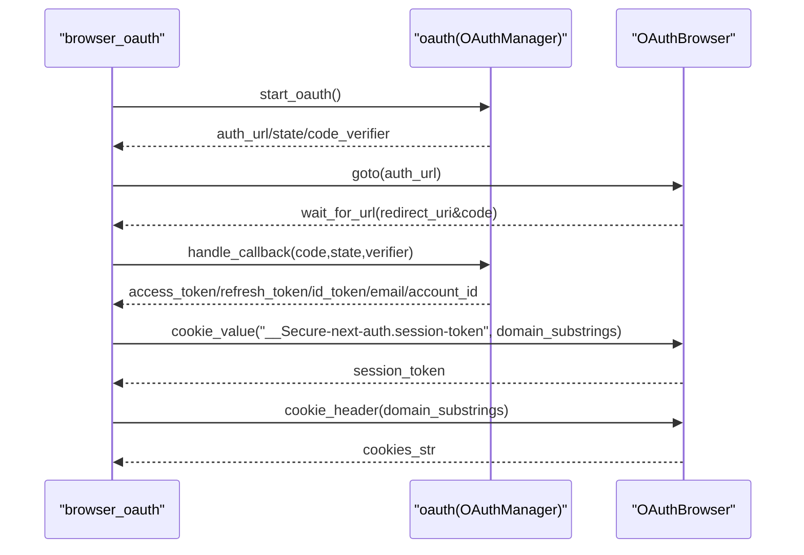
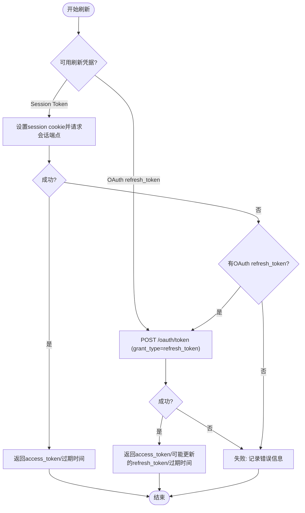
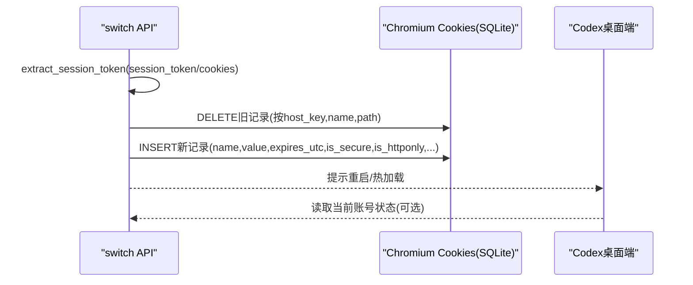
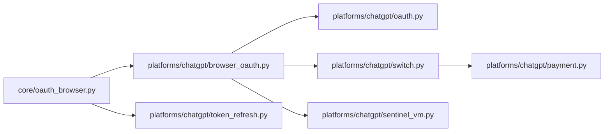

# Cookie和会话管理

<cite>
**本文引用的文件**
- [core/oauth_browser.py](file://core/oauth_browser.py)
- [platforms/chatgpt/browser_oauth.py](file://platforms/chatgpt/browser_oauth.py)
- [platforms/chatgpt/oauth.py](file://platforms/chatgpt/oauth.py)
- [platforms/chatgpt/token_refresh.py](file://platforms/chatgpt/token_refresh.py)
- [platforms/chatgpt/switch.py](file://platforms/chatgpt/switch.py)
- [platforms/chatgpt/payment.py](file://platforms/chatgpt/payment.py)
- [platforms/chatgpt/sentinel_vm.py](file://platforms/chatgpt/sentinel_vm.py)
</cite>

## 目录
1. [简介](#简介)
2. [项目结构](#项目结构)
3. [核心组件](#核心组件)
4. [架构总览](#架构总览)
5. [详细组件分析](#详细组件分析)
6. [依赖关系分析](#依赖关系分析)
7. [性能考虑](#性能考虑)
8. [故障排查指南](#故障排查指南)
9. [结论](#结论)
10. [附录：代码示例路径](#附录代码示例路径)

## 简介
本文件系统性说明本项目在OAuth流程中的Cookie与会话管理机制，覆盖以下要点：
- Cookie获取、过滤（domain_substrings）、序列化（cookie_header/cookie_dict）
- 会话保持机制（本地Cookies数据库写入、Token刷新）
- 跨域Cookie处理（多域名、Secure/HttpOnly/SameSite策略）
- 安全考虑（敏感字段脱敏、最小权限、过期处理）
- 多标签页会话同步（通过浏览器上下文共享）
- 提取访问令牌、刷新令牌和用户身份信息的具体方法（以路径引用代替直接代码）

## 项目结构
围绕OAuth与Cookie的关键模块分布如下：
- core层提供通用的OAuth浏览器能力（Playwright/CDP/Chrome Profile），封装了Cookie的读取、过滤与序列化。
- platforms/chatgpt层实现OpenAI/ChatGPT特定流程：浏览器OAuth、Token刷新、本地桌面端（Codex）Cookies写入与切换、支付状态查询等。
- 其他平台复用core层的通用能力，按各自业务扩展。

图表来源
- [core/oauth_browser.py:139-397](file://core/oauth_browser.py#L139-L397)
- [platforms/chatgpt/browser_oauth.py:44-110](file://platforms/chatgpt/browser_oauth.py#L44-L110)
- [platforms/chatgpt/oauth.py:190-320](file://platforms/chatgpt/oauth.py#L190-L320)
- [platforms/chatgpt/token_refresh.py:37-206](file://platforms/chatgpt/token_refresh.py#L37-L206)
- [platforms/chatgpt/switch.py:180-244](file://platforms/chatgpt/switch.py#L180-L244)
- [platforms/chatgpt/payment.py:144-170](file://platforms/chatgpt/payment.py#L144-L170)
- [platforms/chatgpt/sentinel_vm.py:256-286](file://platforms/chatgpt/sentinel_vm.py#L256-L286)

章节来源
- [core/oauth_browser.py:139-397](file://core/oauth_browser.py#L139-L397)
- [platforms/chatgpt/browser_oauth.py:44-110](file://platforms/chatgpt/browser_oauth.py#L44-L110)

## 核心组件
- OAuthBrowser（core层）
  - 统一封装Playwright/CDP/Chrome Profile三种模式，自动选择最优方式启动或连接浏览器。
  - 提供Cookie读取、等待、过滤、序列化的完整工具集，支持按domain子串过滤。
- ChatGPT浏览器OAuth（platforms层）
  - 驱动浏览器完成授权登录，捕获回调URL并换取令牌，同时提取session token与cookies。
- Token刷新（platforms层）
  - 支持两种刷新路径：基于session token的会话刷新，以及基于OAuth refresh_token的标准刷新。
- 本地Cookies写入与切号（platforms层）
  - 将session token等Cookie写入本机Codex桌面端的Chromium Cookies数据库，实现本地应用“无缝”登录态切换。
- 支付与Cookie解析（platforms层）
  - 将字符串形式的Cookie转换为Playwright兼容的列表，处理__Secure-前缀的secure标志。
- 前端存储模拟（platforms层）
  - 为自动化场景提供localStorage/sessionStorage的模拟对象，便于绕过部分检测。

章节来源
- [core/oauth_browser.py:139-397](file://core/oauth_browser.py#L139-L397)
- [platforms/chatgpt/browser_oauth.py:44-110](file://platforms/chatgpt/browser_oauth.py#L44-L110)
- [platforms/chatgpt/token_refresh.py:37-206](file://platforms/chatgpt/token_refresh.py#L37-L206)
- [platforms/chatgpt/switch.py:180-244](file://platforms/chatgpt/switch.py#L180-L244)
- [platforms/chatgpt/payment.py:144-170](file://platforms/chatgpt/payment.py#L144-L170)
- [platforms/chatgpt/sentinel_vm.py:256-286](file://platforms/chatgpt/sentinel_vm.py#L256-L286)

## 架构总览
下图展示了从浏览器OAuth到令牌获取、再到本地会话持久化与跨应用同步的整体流程。

图表来源
- [platforms/chatgpt/browser_oauth.py:44-110](file://platforms/chatgpt/browser_oauth.py#L44-L110)
- [platforms/chatgpt/oauth.py:190-320](file://platforms/chatgpt/oauth.py#L190-L320)
- [platforms/chatgpt/token_refresh.py:66-132](file://platforms/chatgpt/token_refresh.py#L66-L132)
- [platforms/chatgpt/switch.py:180-244](file://platforms/chatgpt/switch.py#L180-L244)

## 详细组件分析

### OAuthBrowser：Cookie获取、过滤与序列化
- 获取所有Cookie：cookies()
- 等待指定Cookie出现：wait_for_cookie_value(names, domain_substrings, timeout, interval)
- 按名称与域名过滤取值：cookie_value(*names, domain_substrings)
- 序列化为请求头：cookie_header(domain_substrings)
- 序列化为字典：cookie_dict(domain_substrings)

domain_substrings的作用：
- 用于精确限定Cookie所属域名的匹配范围，避免跨域污染或误取。
- 内部实现会遍历当前上下文的Cookie集合，仅当Cookie的domain包含任一子串时才会被纳入结果。

图表来源
- [core/oauth_browser.py:343-393](file://core/oauth_browser.py#L343-L393)

章节来源
- [core/oauth_browser.py:343-393](file://core/oauth_browser.py#L343-L393)

### ChatGPT浏览器OAuth：令牌与身份提取
- 使用OAuthManager生成授权URL（含state与PKCE code_challenge）。
- 驱动浏览器完成登录/授权，等待回调URL。
- 提交回调换取access_token、refresh_token、id_token。
- 从浏览器上下文提取session_token与cookies（domain过滤为chatgpt.com/openai.com）。
- 可选调用后端接口获取用户profile，结合id_token claims得到email与account_id。

图表来源
- [platforms/chatgpt/browser_oauth.py:44-110](file://platforms/chatgpt/browser_oauth.py#L44-L110)
- [platforms/chatgpt/oauth.py:190-320](file://platforms/chatgpt/oauth.py#L190-L320)

章节来源
- [platforms/chatgpt/browser_oauth.py:44-110](file://platforms/chatgpt/browser_oauth.py#L44-L110)
- [platforms/chatgpt/oauth.py:190-320](file://platforms/chatgpt/oauth.py#L190-L320)

### Token刷新：会话与OAuth双通道
- Session Token刷新：设置__Secure-next-auth.session-token到会话，请求会话端点获取access_token及过期时间。
- OAuth Refresh Token刷新：使用refresh_token向标准OAuth端点换取新access_token，可能更新refresh_token并计算expires_at。
- 验证access_token有效性：调用后端/me接口判断是否有效。

图表来源
- [platforms/chatgpt/token_refresh.py:66-206](file://platforms/chatgpt/token_refresh.py#L66-L206)

章节来源
- [platforms/chatgpt/token_refresh.py:66-206](file://platforms/chatgpt/token_refresh.py#L66-L206)

### 本地Cookies写入与跨应用同步（Codex桌面端）
- 将session_token等Cookie写入本机Codex的Chromium Cookies SQLite数据库，实现桌面端无需重新登录即可使用Web侧会话。
- 针对特定Cookie名映射多个host_key（如.chatgpt.com与chatgpt.com），确保跨子域可用。
- 设置合理的创建时间、过期时间、secure/httponly等属性，保证浏览器正确识别。
- 提供读取当前账号状态、关闭/重启应用的辅助能力。

图表来源
- [platforms/chatgpt/switch.py:180-244](file://platforms/chatgpt/switch.py#L180-L244)
- [platforms/chatgpt/switch.py:247-290](file://platforms/chatgpt/switch.py#L247-L290)

章节来源
- [platforms/chatgpt/switch.py:180-244](file://platforms/chatgpt/switch.py#L180-L244)
- [platforms/chatgpt/switch.py:247-290](file://platforms/chatgpt/switch.py#L247-L290)

### 跨域Cookie处理与安全策略
- __Secure-前缀Cookie必须带secure=True标志，否则Playwright/Chromium会拒绝设置。
- 对chatgpt.com域名，需将domain设置为“.chatgpt.com”以支持子域共享。
- 在构造Cookie时，严格遵循path="/"、secure/httponly/samesite等策略，避免跨站风险。
- 使用domain_substrings精准过滤，防止跨域Cookie污染。

章节来源
- [platforms/chatgpt/payment.py:144-170](file://platforms/chatgpt/payment.py#L144-L170)
- [core/oauth_browser.py:363-393](file://core/oauth_browser.py#L363-L393)

### 多标签页会话同步
- 通过Playwright Context共享页面与Cookie，同一Context下的多个标签页天然共享会话。
- 若使用Chrome Profile或CDP连接已运行浏览器，则继承已有会话；必要时可自动选择Google账号以加速流程。

章节来源
- [core/oauth_browser.py:162-213](file://core/oauth_browser.py#L162-L213)
- [core/oauth_browser.py:305-325](file://core/oauth_browser.py#L305-L325)

### 前端存储模拟（localStorage/sessionStorage）
- 为自动化环境提供localStorage/sessionStorage的模拟对象，预置若干键以避免检测。
- 有助于绕过某些前端校验逻辑，提升自动化成功率。

章节来源
- [platforms/chatgpt/sentinel_vm.py:256-286](file://platforms/chatgpt/sentinel_vm.py#L256-L286)

## 依赖关系分析
- core.oauth_browser为各平台提供统一的浏览器与Cookie能力，降低重复实现。
- platforms.chatgpt依赖core层，并在其之上实现OpenAI特定的OAuth、Token刷新与本地Cookies操作。
- 各平台间解耦清晰，易于扩展到其他提供商。

图表来源
- [core/oauth_browser.py:139-397](file://core/oauth_browser.py#L139-L397)
- [platforms/chatgpt/browser_oauth.py:44-110](file://platforms/chatgpt/browser_oauth.py#L44-L110)
- [platforms/chatgpt/oauth.py:190-320](file://platforms/chatgpt/oauth.py#L190-L320)
- [platforms/chatgpt/token_refresh.py:37-206](file://platforms/chatgpt/token_refresh.py#L37-L206)
- [platforms/chatgpt/switch.py:180-244](file://platforms/chatgpt/switch.py#L180-L244)
- [platforms/chatgpt/payment.py:144-170](file://platforms/chatgpt/payment.py#L144-L170)
- [platforms/chatgpt/sentinel_vm.py:256-286](file://platforms/chatgpt/sentinel_vm.py#L256-L286)

章节来源
- [core/oauth_browser.py:139-397](file://core/oauth_browser.py#L139-L397)
- [platforms/chatgpt/browser_oauth.py:44-110](file://platforms/chatgpt/browser_oauth.py#L44-L110)

## 性能考虑
- 使用wait_for_cookie_value时合理设置timeout与interval，避免频繁轮询造成资源浪费。
- 批量序列化Cookie时使用cookie_header/cookie_dict一次性构建，减少多次遍历。
- 本地Cookies写入采用SQLite事务式插入，注意控制写入频率与并发。
- Token刷新优先尝试session token路径，因其通常更快且更稳定。

[本节为通用指导，不直接分析具体文件]

## 故障排查指南
- 未找到系统Chrome或CDP端口不可用：检查是否已开启远程调试端口或存在正在运行的Chrome实例。
- 回调URL未捕获：确认redirect_uri配置一致，且浏览器能正常跳转至回调地址。
- state不匹配或缺少code：检查授权流程是否被拦截或重定向异常。
- session_token为空：确认domain_substrings包含目标域名（如chatgpt.com/openai.com），并确保已在浏览器中完成登录。
- 本地Cookies写入失败：检查Codex安装路径与Cookies数据库是否存在，以及进程是否占用导致锁表。
- Token刷新失败：核对session_token或refresh_token是否有效，网络代理是否正确配置。

章节来源
- [core/oauth_browser.py:162-213](file://core/oauth_browser.py#L162-L213)
- [platforms/chatgpt/oauth.py:240-320](file://platforms/chatgpt/oauth.py#L240-L320)
- [platforms/chatgpt/token_refresh.py:66-206](file://platforms/chatgpt/token_refresh.py#L66-L206)
- [platforms/chatgpt/switch.py:180-244](file://platforms/chatgpt/switch.py#L180-L244)

## 结论
本项目通过core层抽象出通用的OAuth浏览器与Cookie管理能力，并在ChatGPT平台实现了完整的OAuth流程、Token刷新与本地Cookies持久化。借助domain_substrings精准过滤、__Secure-前缀的安全策略、以及本地SQLite写入，实现了跨域、跨应用与会话持久化的高可靠性方案。建议在生产环境中：
- 严格限制domain_substrings范围，避免跨域泄露。
- 定期刷新Token并监控过期时间。
- 对敏感字段进行脱敏与最小化暴露。
- 在多标签页环境下利用Context共享会话，提高稳定性。

[本节为总结性内容，不直接分析具体文件]

## 附录：代码示例路径
以下为提取访问令牌、刷新令牌和用户身份信息的相关实现位置（以路径引用代替直接代码）：
- 生成OAuth授权URL与回调换令牌：
  - [platforms/chatgpt/oauth.py:190-320](file://platforms/chatgpt/oauth.py#L190-L320)
- 浏览器OAuth流程与session_token/cookies提取：
  - [platforms/chatgpt/browser_oauth.py:44-110](file://platforms/chatgpt/browser_oauth.py#L44-L110)
- Cookie过滤与序列化（domain_substrings用法）：
  - [core/oauth_browser.py:343-393](file://core/oauth_browser.py#L343-L393)
- Token刷新（Session/OAuth两种方式）：
  - [platforms/chatgpt/token_refresh.py:66-206](file://platforms/chatgpt/token_refresh.py#L66-L206)
- 本地Cookies写入与读取（跨应用同步）：
  - [platforms/chatgpt/switch.py:180-244](file://platforms/chatgpt/switch.py#L180-L244)
  - [platforms/chatgpt/switch.py:247-290](file://platforms/chatgpt/switch.py#L247-L290)
- Cookie解析与注入（__Secure-前缀处理）：
  - [platforms/chatgpt/payment.py:144-170](file://platforms/chatgpt/payment.py#L144-L170)
- 前端存储模拟（localStorage/sessionStorage）：
  - [platforms/chatgpt/sentinel_vm.py:256-286](file://platforms/chatgpt/sentinel_vm.py#L256-L286)