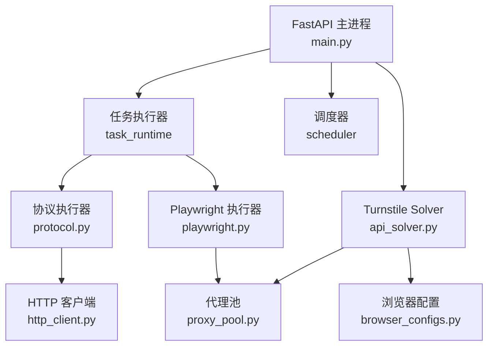
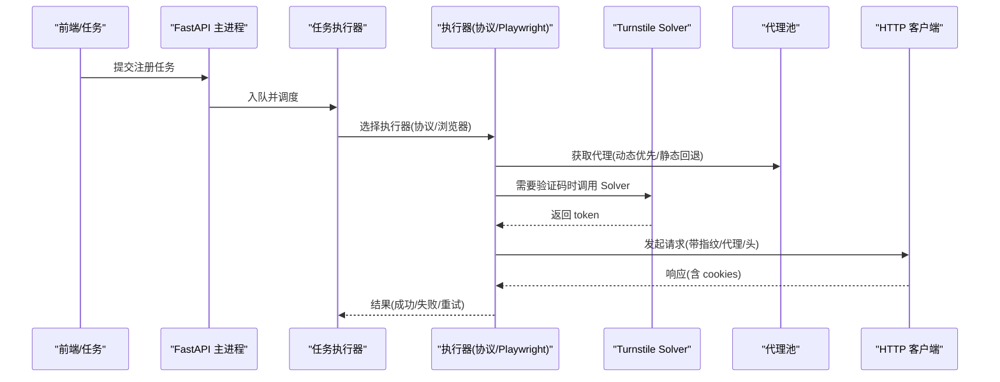
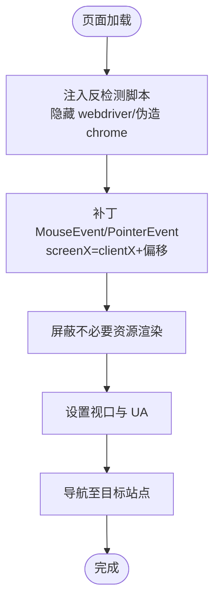
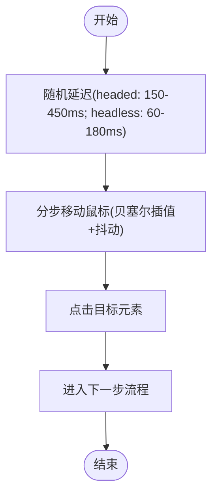
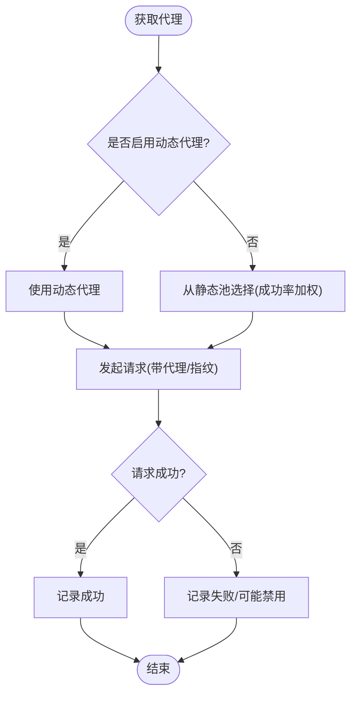
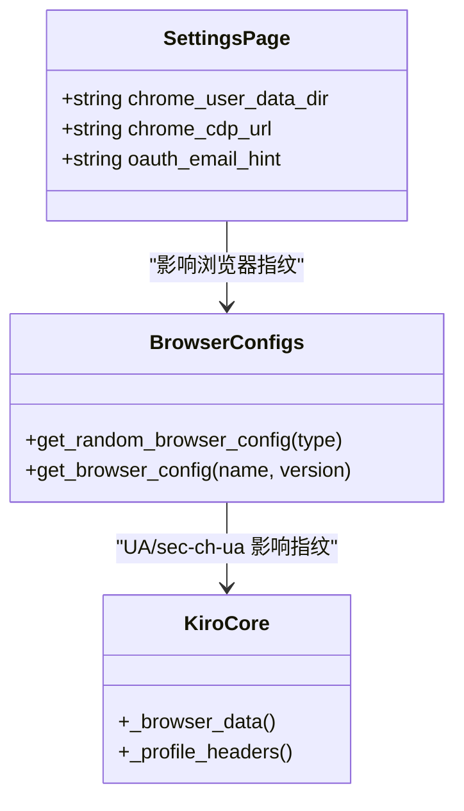
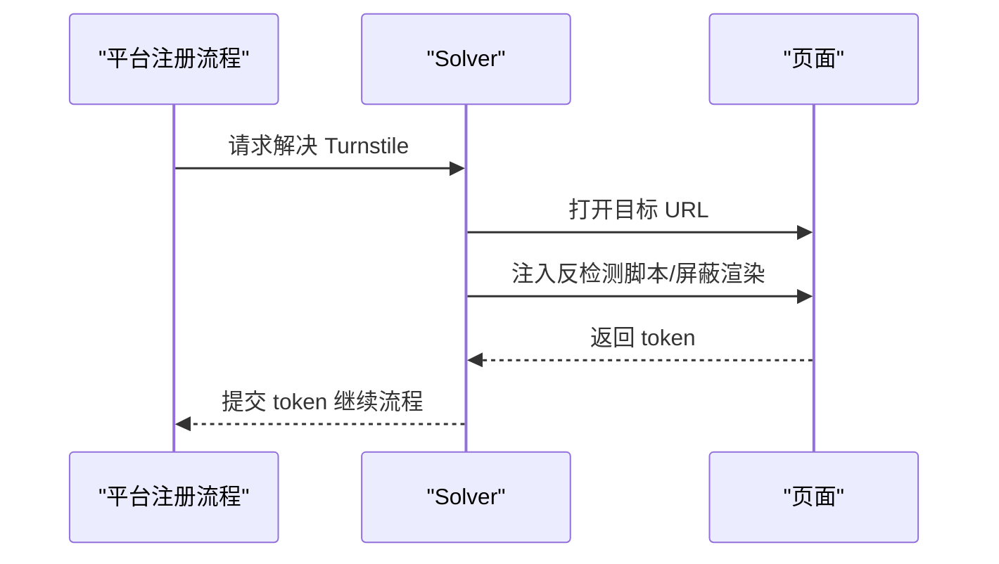
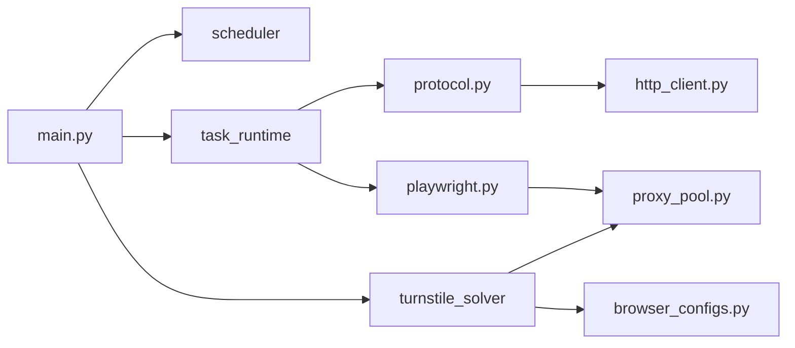

# 反检测策略

<cite>
**本文引用的文件**
- [main.py](file://main.py)
- [core/http_client.py](file://core/http_client.py)
- [core/executors/protocol.py](file://core/executors/protocol.py)
- [core/executors/playwright.py](file://core/executors/playwright.py)
- [core/proxy_pool.py](file://core/proxy_pool.py)
- [services/turnstile_solver/api_solver.py](file://services/turnstile_solver/api_solver.py)
- [services/turnstile_solver/browser_configs.py](file://services/turnstile_solver/browser_configs.py)
- [platforms/chatgpt/browser_register.py](file://platforms/chatgpt/browser_register.py)
- [platforms/chatgpt/register.py](file://platforms/chatgpt/register.py)
- [platforms/cursor/browser_register.py](file://platforms/cursor/browser_register.py)
- [platforms/windsurf/browser_register.py](file://platforms/windsurf/browser_register.py)
- [platforms/kiro/core.py](file://platforms/kiro/core.py)
- [frontend/src/pages/SettingsPage.tsx](file://frontend/src/pages/SettingsPage.tsx)
</cite>

## 目录
1. [简介](#简介)
2. [项目结构](#项目结构)
3. [核心组件](#核心组件)
4. [架构总览](#架构总览)
5. [详细组件分析](#详细组件分析)
6. [依赖关系分析](#依赖关系分析)
7. [性能考量](#性能考量)
8. [故障排查指南](#故障排查指南)
9. [结论](#结论)
10. [附录：按平台定制的反检测配置示例](#附录按平台定制的反检测配置示例)

## 简介
本指南聚焦于“如何避免被目标网站识别为自动化脚本”的反检测策略，结合代码库中的实现，系统阐述以下能力：
- 用户数据目录复用与真实浏览器指纹模拟
- 随机延迟与人类化行为模拟
- 代理池、网络请求伪装与行为模式模拟
- 常见检测机制的绕过方案（如 Turnstile、指纹校验）
- 性能优化与稳定性保障
- 针对不同网站的定制化反检测配置示例

## 项目结构
本项目采用分层与插件化设计：
- 入口与生命周期管理：FastAPI 应用启动、调度器、任务执行器、Solver 服务
- 执行层：协议执行器（curl_cffi）、Playwright 执行器（Chromium/Camoufox）
- 反检测服务：Turnstile Solver（多浏览器上下文、指纹注入、资源拦截）
- 平台插件：各平台的注册/OAuth/支付流程，内置反检测逻辑
- 代理池：动态/静态代理选择、成功率统计与自动禁用
- 前端设置：支持 Chrome 用户数据目录复用与 CDP 连接

**图示来源**
- [main.py:67-91](file://main.py#L67-L91)
- [services/turnstile_solver/api_solver.py:168-225](file://services/turnstile_solver/api_solver.py#L168-L225)
- [core/executors/protocol.py:1-44](file://core/executors/protocol.py#L1-L44)
- [core/executors/playwright.py:14-35](file://core/executors/playwright.py#L14-L35)
- [core/http_client.py:73-83](file://core/http_client.py#L73-L83)
- [core/proxy_pool.py:14-45](file://core/proxy_pool.py#L14-L45)

**章节来源**
- [main.py:67-91](file://main.py#L67-L91)

## 核心组件
- 协议执行器：基于 curl_cffi 的会话封装，支持 impersonate 指纹、代理、重试
- Playwright 执行器：支持 headless/headed，注入反自动化参数，设置 UA/视口
- Turnstile Solver：多浏览器上下文池，注入指纹补丁、屏蔽渲染、设置 sec-ch-ua、代理
- HTTP 客户端：统一封装请求、重试、代理、SSL 验证、下载
- 代理池：动态优先、静态回退，成功率加权轮询，失败自动禁用
- 平台插件：针对 ChatGPT、Cursor、Windsurf、Kiro 等平台的反检测细节

**章节来源**
- [core/executors/protocol.py:1-44](file://core/executors/protocol.py#L1-L44)
- [core/executors/playwright.py:14-35](file://core/executors/playwright.py#L14-L35)
- [services/turnstile_solver/api_solver.py:168-225](file://services/turnstile_solver/api_solver.py#L168-L225)
- [core/http_client.py:73-83](file://core/http_client.py#L73-L83)
- [core/proxy_pool.py:14-45](file://core/proxy_pool.py#L14-L45)

## 架构总览
下图展示从任务触发到浏览器/协议执行、再到反检测注入与代理选择的整体流程。

**图示来源**
- [main.py:67-91](file://main.py#L67-L91)
- [core/proxy_pool.py:14-45](file://core/proxy_pool.py#L14-L45)
- [services/turnstile_solver/api_solver.py:662-736](file://services/turnstile_solver/api_solver.py#L662-L736)
- [core/http_client.py:109-145](file://core/http_client.py#L109-L145)

## 详细组件分析

### 浏览器指纹与反自动化注入
- 通过 Playwright 启动参数禁用自动化特征，设置固定视口与 UA
- 在页面初始化阶段注入脚本，隐藏 webdriver、伪造 chrome 对象
- 使用 Camoufox 或 Patchright 增强指纹一致性，降低被识别概率
- 对鼠标事件 screenX/screenY 进行补丁，规避 Turnstile 检测

**图示来源**
- [core/executors/playwright.py:14-35](file://core/executors/playwright.py#L14-L35)
- [services/turnstile_solver/api_solver.py:746-768](file://services/turnstile_solver/api_solver.py#L746-L768)
- [platforms/cursor/browser_register.py:468-498](file://platforms/cursor/browser_register.py#L468-L498)
- [platforms/windsurf/browser_register.py:1888-1912](file://platforms/windsurf/browser_register.py#L1888-L1912)

**章节来源**
- [core/executors/playwright.py:14-35](file://core/executors/playwright.py#L14-L35)
- [services/turnstile_solver/api_solver.py:746-768](file://services/turnstile_solver/api_solver.py#L746-L768)
- [platforms/cursor/browser_register.py:468-498](file://platforms/cursor/browser_register.py#L468-L498)
- [platforms/windsurf/browser_register.py:1888-1912](file://platforms/windsurf/browser_register.py#L1888-L1912)

### 随机延迟与人类化行为模拟
- 在关键交互点插入随机等待时间，区分 headed/headless 场景
- 鼠标移动采用贝塞尔曲线插值与随机抖动，模拟人类轨迹
- 点击前增加“观看页面”的停顿，减少机械感

**图示来源**
- [platforms/chatgpt/browser_register.py:1130-1136](file://platforms/chatgpt/browser_register.py#L1130-L1136)
- [platforms/cursor/browser_register.py:202-223](file://platforms/cursor/browser_register.py#L202-L223)

**章节来源**
- [platforms/chatgpt/browser_register.py:1130-1136](file://platforms/chatgpt/browser_register.py#L1130-L1136)
- [platforms/cursor/browser_register.py:202-223](file://platforms/cursor/browser_register.py#L202-L223)

### 代理配置与网络请求伪装
- 代理池优先尝试动态代理，失败或未配置回退到静态池
- 静态池按成功率加权轮询，连续失败自动禁用
- HTTP 客户端支持 impersonate 指纹、代理、重试与 SSL 验证
- Playwright/Solver 支持多种代理格式与认证信息

**图示来源**
- [core/proxy_pool.py:14-45](file://core/proxy_pool.py#L14-L45)
- [core/proxy_pool.py:47-66](file://core/proxy_pool.py#L47-L66)
- [core/http_client.py:109-145](file://core/http_client.py#L109-L145)
- [services/turnstile_solver/api_solver.py:662-736](file://services/turnstile_solver/api_solver.py#L662-L736)

**章节来源**
- [core/proxy_pool.py:14-45](file://core/proxy_pool.py#L14-L45)
- [core/proxy_pool.py:47-66](file://core/proxy_pool.py#L47-L66)
- [core/http_client.py:109-145](file://core/http_client.py#L109-L145)
- [services/turnstile_solver/api_solver.py:662-736](file://services/turnstile_solver/api_solver.py#L662-L736)

### 用户数据目录复用与真实浏览器指纹
- 前端提供 Chrome 用户数据目录路径与 CDP 地址配置，便于复用本机已登录状态
- Solver 中根据浏览器类型生成匹配的 UA 与 sec-ch-ua，提升指纹一致性
- 平台侧可注入特定指纹相关字段（如 Kiro 的 fingerprint 上报）

**图示来源**
- [frontend/src/pages/SettingsPage.tsx:169-202](file://frontend/src/pages/SettingsPage.tsx#L169-L202)
- [services/turnstile_solver/browser_configs.py:1-25](file://services/turnstile_solver/browser_configs.py#L1-L25)
- [platforms/kiro/core.py:381-406](file://platforms/kiro/core.py#L381-L406)

**章节来源**
- [frontend/src/pages/SettingsPage.tsx:169-202](file://frontend/src/pages/SettingsPage.tsx#L169-L202)
- [services/turnstile_solver/browser_configs.py:1-25](file://services/turnstile_solver/browser_configs.py#L1-L25)
- [platforms/kiro/core.py:381-406](file://platforms/kiro/core.py#L381-L406)

### 验证码绕过与指纹挑战处理
- ChatGPT 的 Sentinel 流程：生成 requirements token、处理 challenge token、可选 POW 计算
- Cursor/Windsurf：对 Turnstile iframe 定位与点击，注入 mouse event patch
- Solver：注入 anti-shadow、block rendering、隐藏 webdriver、设置 viewport

**图示来源**
- [platforms/chatgpt/register.py:125-170](file://platforms/chatgpt/register.py#L125-L170)
- [platforms/chatgpt/browser_register.py:1346-1387](file://platforms/chatgpt/browser_register.py#L1346-L1387)
- [platforms/cursor/browser_register.py:424-469](file://platforms/cursor/browser_register.py#L424-L469)
- [platforms/windsurf/browser_register.py:781-813](file://platforms/windsurf/browser_register.py#L781-L813)
- [services/turnstile_solver/api_solver.py:746-779](file://services/turnstile_solver/api_solver.py#L746-L779)

**章节来源**
- [platforms/chatgpt/register.py:125-170](file://platforms/chatgpt/register.py#L125-L170)
- [platforms/chatgpt/browser_register.py:1346-1387](file://platforms/chatgpt/browser_register.py#L1346-L1387)
- [platforms/cursor/browser_register.py:424-469](file://platforms/cursor/browser_register.py#L424-L469)
- [platforms/windsurf/browser_register.py:781-813](file://platforms/windsurf/browser_register.py#L781-L813)
- [services/turnstile_solver/api_solver.py:746-779](file://services/turnstile_solver/api_solver.py#L746-L779)

## 依赖关系分析
- 主进程依赖调度器、任务执行器、Solver 服务
- 执行器依赖代理池与 HTTP 客户端
- Solver 依赖浏览器配置与代理池
- 平台插件依赖执行器与 Solver

**图示来源**
- [main.py:67-91](file://main.py#L67-L91)
- [core/executors/protocol.py:1-44](file://core/executors/protocol.py#L1-L44)
- [core/executors/playwright.py:14-35](file://core/executors/playwright.py#L14-L35)
- [core/http_client.py:73-83](file://core/http_client.py#L73-L83)
- [core/proxy_pool.py:14-45](file://core/proxy_pool.py#L14-L45)
- [services/turnstile_solver/browser_configs.py:1-25](file://services/turnstile_solver/browser_configs.py#L1-L25)

**章节来源**
- [main.py:67-91](file://main.py#L67-L91)

## 性能考量
- 并发控制：合理设置任务并发数，避免同一 IP 短时间大量请求导致风控
- 资源屏蔽：Solver 中屏蔽不必要资源以减少渲染开销
- 视口与 UA：固定视口与匹配 UA 减少指纹不一致带来的额外校验
- 重试策略：HTTP 客户端指数退避重试，提高鲁棒性
- 代理健康检查：定期检测代理可用性，快速剔除失效节点

[本节为通用指导，不直接分析具体文件]

## 故障排查指南
- 验证码失败：确认验证码 provider 配置；浏览器模式下优先本地 Solver，失败回退远程；检查代理 IP 质量
- 代理被封/失败率高：查看代理成功率，禁用低成功率代理；使用住宅代理；降低并发；按平台分配代理池
- Solver 启动超时：首次需下载/初始化 Camoufox；检查端口占用与环境依赖；Docker 建议使用预构建镜像

**章节来源**
- [README.md:388-419](file://README.md#L388-L419)

## 结论
本项目通过多层反检测策略组合，有效降低被目标网站识别为自动化脚本的概率：
- 浏览器指纹与反自动化注入
- 随机延迟与人类化行为模拟
- 代理池与网络请求伪装
- 验证码绕过与指纹挑战处理
- 用户数据目录复用与真实浏览器指纹
建议在生产环境中持续监控成功率与错误归因，按需调整代理池、并发与反检测参数。

[本节为总结，不直接分析具体文件]

## 附录：按平台定制的反检测配置示例
- ChatGPT
  - 使用 Camoufox 执行注册流程
  - 注入 Sentinel 要求与挑战 token，必要时执行 POW
  - 随机延迟与人类化点击
  - 参考路径：[platforms/chatgpt/browser_register.py:1130-1136](file://platforms/chatgpt/browser_register.py#L1130-L1136)、[platforms/chatgpt/register.py:125-170](file://platforms/chatgpt/register.py#L125-L170)、[platforms/chatgpt/browser_register.py:1346-1387](file://platforms/chatgpt/browser_register.py#L1346-L1387)

- Cursor
  - 使用 Camoufox，注入 mouse event patch，定位并点击 Turnstile checkbox
  - 平滑鼠标移动与随机抖动
  - 参考路径：[platforms/cursor/browser_register.py:202-223](file://platforms/cursor/browser_register.py#L202-L223)、[platforms/cursor/browser_register.py:468-498](file://platforms/cursor/browser_register.py#L468-L498)

- Windsurf
  - 接受 Cookie 弹窗，注入 mouse event patch
  - 使用 Playwright 启动参数禁用自动化特征
  - 参考路径：[platforms/windsurf/browser_register.py:1872-1912](file://platforms/windsurf/browser_register.py#L1872-L1912)、[platforms/windsurf/browser_register.py:781-813](file://platforms/windsurf/browser_register.py#L781-L813)

- Kiro
  - 上报指纹与页面停留时长，构造符合预期的请求头
  - 参考路径：[platforms/kiro/core.py:381-406](file://platforms/kiro/core.py#L381-L406)

- 通用
  - 代理池：动态优先、静态回退，成功率加权轮询
  - HTTP 客户端：impersonate、重试、代理、SSL 验证
  - 参考路径：[core/proxy_pool.py:14-45](file://core/proxy_pool.py#L14-L45)、[core/http_client.py:73-83](file://core/http_client.py#L73-L83)

**章节来源**
- [platforms/chatgpt/browser_register.py:1130-1136](file://platforms/chatgpt/browser_register.py#L1130-L1136)
- [platforms/chatgpt/register.py:125-170](file://platforms/chatgpt/register.py#L125-L170)
- [platforms/chatgpt/browser_register.py:1346-1387](file://platforms/chatgpt/browser_register.py#L1346-L1387)
- [platforms/cursor/browser_register.py:202-223](file://platforms/cursor/browser_register.py#L202-L223)
- [platforms/cursor/browser_register.py:468-498](file://platforms/cursor/browser_register.py#L468-L498)
- [platforms/windsurf/browser_register.py:1872-1912](file://platforms/windsurf/browser_register.py#L1872-L1912)
- [platforms/windsurf/browser_register.py:781-813](file://platforms/windsurf/browser_register.py#L781-L813)
- [platforms/kiro/core.py:381-406](file://platforms/kiro/core.py#L381-L406)
- [core/proxy_pool.py:14-45](file://core/proxy_pool.py#L14-L45)
- [core/http_client.py:73-83](file://core/http_client.py#L73-L83)