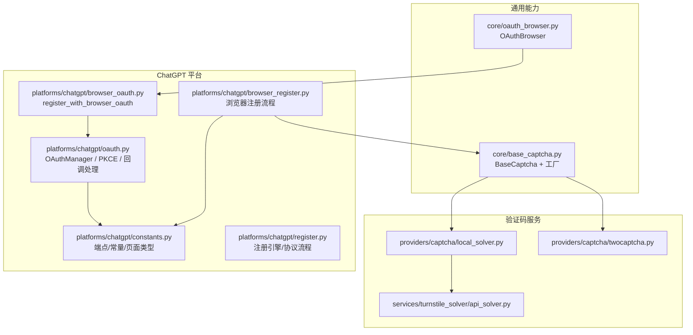
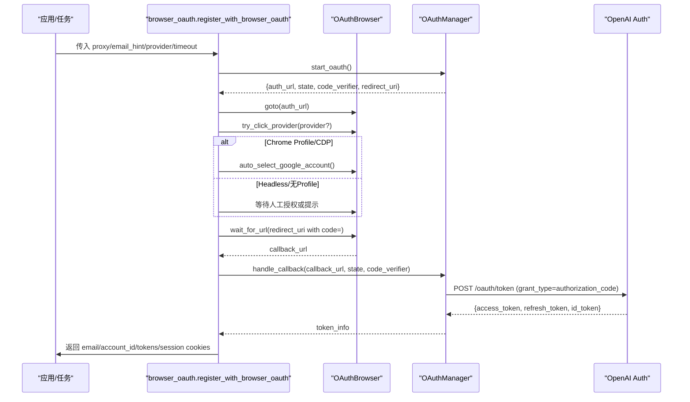
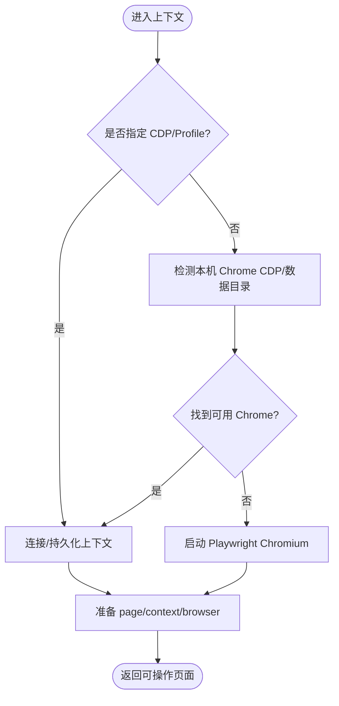
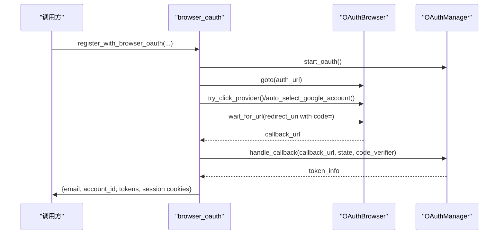
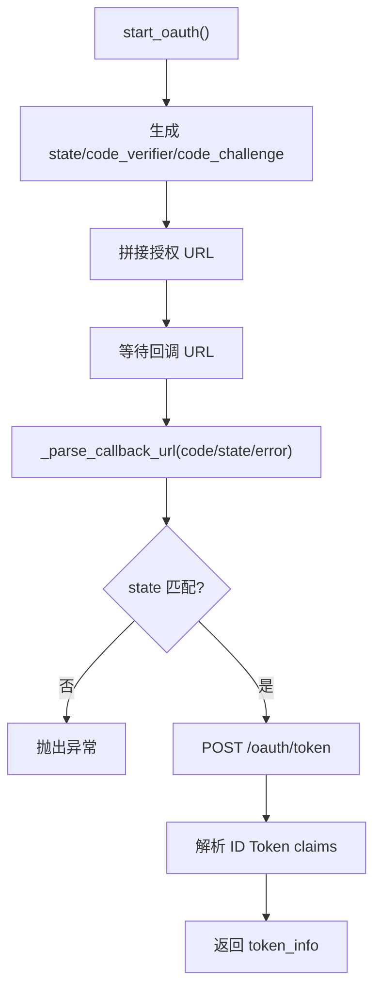
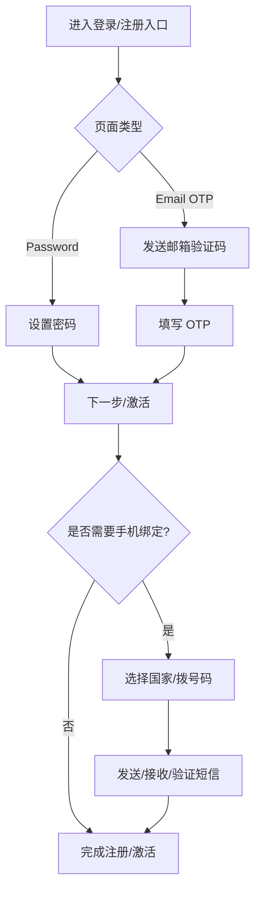
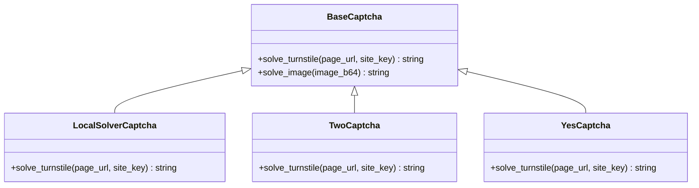
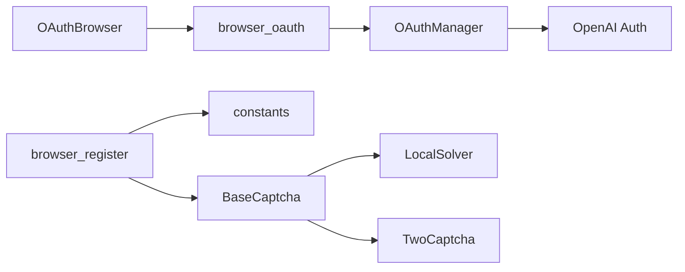
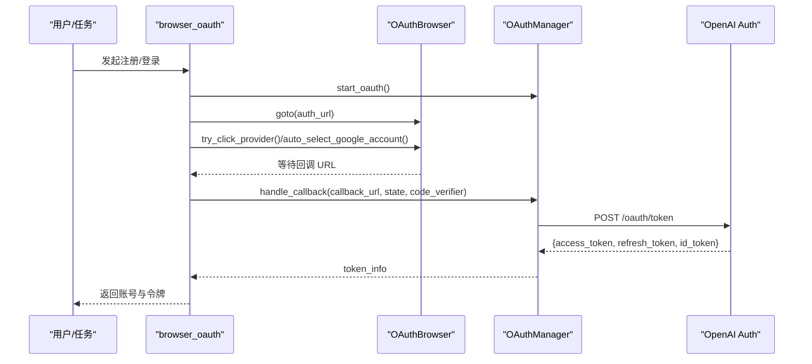
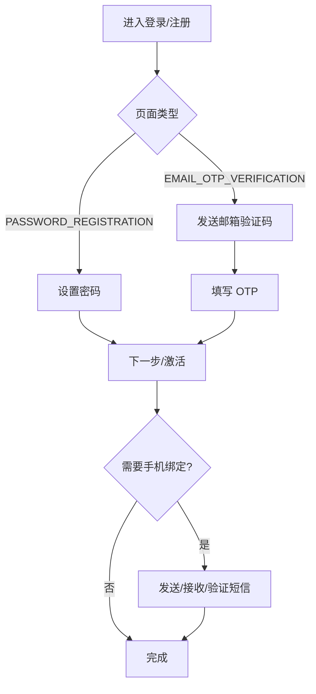

# 浏览器OAuth流程实现

<cite>
**本文引用的文件**
- [core/oauth_browser.py](file://core/oauth_browser.py)
- [platforms/chatgpt/browser_oauth.py](file://platforms/chatgpt/browser_oauth.py)
- [platforms/chatgpt/oauth.py](file://platforms/chatgpt/oauth.py)
- [platforms/chatgpt/constants.py](file://platforms/chatgpt/constants.py)
- [platforms/chatgpt/browser_register.py](file://platforms/chatgpt/browser_register.py)
- [platforms/chatgpt/register.py](file://platforms/chatgpt/register.py)
- [core/base_captcha.py](file://core/base_captcha.py)
- [providers/captcha/local_solver.py](file://providers/captcha/local_solver.py)
- [providers/captcha/twocaptcha.py](file://providers/captcha/twocaptcha.py)
- [services/turnstile_solver/api_solver.py](file://services/turnstile_solver/api_solver.py)
- [README.md](file://README.md)
</cite>

## 目录
1. [简介](#简介)
2. [项目结构](#项目结构)
3. [核心组件](#核心组件)
4. [架构总览](#架构总览)
5. [详细组件分析](#详细组件分析)
6. [依赖关系分析](#依赖关系分析)
7. [性能与稳定性](#性能与稳定性)
8. [故障排查指南](#故障排查指南)
9. [结论](#结论)
10. [附录：关键流程图与时序图](#附录：关键流程图与时序图)

## 简介
本指南面向需要在浏览器中完成第三方平台 OAuth 登录并自动化后续注册、邮箱验证、密码设置、账户激活等步骤的开发者。本文以 ChatGPT 平台为例，系统讲解如何使用 OAuthBrowser 完成完整的 OAuth 登录流程，如何处理 Google 账号选择器、第三方登录跳转、回调 URL 解析与 Token 交换；同时覆盖验证码识别（Turnstile/图片）、表单自动填写、页面状态等待、错误处理、重试机制与日志记录等工程化细节。

## 项目结构
围绕浏览器 OAuth 的核心代码分布在以下模块：
- 通用浏览器能力：core/oauth_browser.py
- ChatGPT 平台 OAuth 流程：platforms/chatgpt/browser_oauth.py、platforms/chatgpt/oauth.py、platforms/chatgpt/constants.py
- ChatGPT 浏览器注册流程（含邮箱验证、密码设置、激活）：platforms/chatgpt/browser_register.py、platforms/chatgpt/register.py
- 验证码解决器抽象与实现：core/base_captcha.py、providers/captcha/*、services/turnstile_solver/*

**图表来源**
- [core/oauth_browser.py:139-397](file://core/oauth_browser.py#L139-L397)
- [platforms/chatgpt/browser_oauth.py:44-110](file://platforms/chatgpt/browser_oauth.py#L44-L110)
- [platforms/chatgpt/oauth.py:180-366](file://platforms/chatgpt/oauth.py#L180-L366)
- [platforms/chatgpt/constants.py:53-97](file://platforms/chatgpt/constants.py#L53-L97)
- [platforms/chatgpt/browser_register.py:1-120](file://platforms/chatgpt/browser_register.py#L1-L120)
- [platforms/chatgpt/register.py:187-200](file://platforms/chatgpt/register.py#L187-L200)
- [core/base_captcha.py:5-98](file://core/base_captcha.py#L5-L98)
- [providers/captcha/local_solver.py:17-52](file://providers/captcha/local_solver.py#L17-L52)
- [providers/captcha/twocaptcha.py:42-63](file://providers/captcha/twocaptcha.py#L42-L63)
- [services/turnstile_solver/api_solver.py:1020-1051](file://services/turnstile_solver/api_solver.py#L1020-L1051)

**章节来源**
- [README.md:39-110](file://README.md#L39-L110)

## 核心组件
- OAuthBrowser：封装 Playwright/CDP/Chrome Profile 三种启动模式，提供页面导航、第三方登录按钮点击、Google 账号选择器自动点击、URL/Cookie 等待与读取等能力。
- ChatGPT browser_oauth：编排“开始 OAuth -> 打开浏览器 -> 可选指定提供商 -> 等待回调 -> 交换 Token -> 拉取用户信息 -> 提取会话 Cookie”的完整流程。
- ChatGPT oauth：实现 PKCE、生成授权 URL、解析回调、校验 state、调用 token 接口、从 ID Token 提取 email/account_id。
- ChatGPT constants：集中定义 OpenAI/OAuth 端点、页面类型（如 EMAIL_OTP_VERIFICATION、PASSWORD_REGISTRATION）、验证码正则、默认密码长度等。
- ChatGPT browser_register/register：浏览器注册流程，包含邮箱输入、发送 OTP、OTP 输入、密码设置、账户激活、手机号绑定（可选）等自动化步骤，以及 Sentinel 防护、表单智能填写、页面状态判断。
- BaseCaptcha 及实现：统一验证码求解接口，支持本地 Solver、YesCaptcha、2Captcha 等。

**章节来源**
- [core/oauth_browser.py:139-397](file://core/oauth_browser.py#L139-L397)
- [platforms/chatgpt/browser_oauth.py:44-110](file://platforms/chatgpt/browser_oauth.py#L44-L110)
- [platforms/chatgpt/oauth.py:180-366](file://platforms/chatgpt/oauth.py#L180-L366)
- [platforms/chatgpt/constants.py:53-97](file://platforms/chatgpt/constants.py#L53-L97)
- [platforms/chatgpt/browser_register.py:25-187](file://platforms/chatgpt/browser_register.py#L25-L187)
- [platforms/chatgpt/register.py:187-200](file://platforms/chatgpt/register.py#L187-L200)
- [core/base_captcha.py:5-98](file://core/base_captcha.py#L5-L98)

## 架构总览
下图展示了浏览器 OAuth 的整体交互：应用层通过 ChatGPT 的 browser_oauth 发起流程，使用 OAuthBrowser 控制浏览器完成授权，再通过 oauth 模块进行回调处理和 Token 交换，最终获取会话与用户信息。

**图表来源**
- [platforms/chatgpt/browser_oauth.py:44-110](file://platforms/chatgpt/browser_oauth.py#L44-L110)
- [platforms/chatgpt/oauth.py:180-366](file://platforms/chatgpt/oauth.py#L180-L366)
- [core/oauth_browser.py:242-358](file://core/oauth_browser.py#L242-L358)

## 详细组件分析

### OAuthBrowser：浏览器与页面自动化基座
- 启动策略：优先连接已运行的 Chrome（CDP），其次尝试 launch_persistent_context（携带 Google/GitHub 等登录态），最后回退到普通 Chromium。
- 代理支持：解析 http/https/socks5 代理，支持用户名/密码。
- 第三方登录按钮识别：基于文本/属性评分匹配，自动点击 Google/GitHub/Microsoft/Apple/X 等。
- Google 账号选择器：在 accounts.google.com 页面自动点击第一个账号。
- 状态等待：wait_for_url/wait_for_cookie_value 支持超时与轮询。
- Cookie 管理：按域名子串过滤，导出 header/dict/value。

**图表来源**
- [core/oauth_browser.py:162-214](file://core/oauth_browser.py#L162-L214)

**章节来源**
- [core/oauth_browser.py:139-397](file://core/oauth_browser.py#L139-L397)

### ChatGPT browser_oauth：端到端 OAuth 编排
- 初始化 OAuthManager，生成授权 URL。
- 使用 OAuthBrowser 打开授权页，必要时自动选择 Google 账号。
- 等待回调 URL（包含 code），调用 manager.handle_callback 换取 access_token/refresh_token/id_token。
- 拉取 /backend-api/me 获取 profile，结合 finalize_oauth_email 校验/归一化邮箱。
- 提取 session cookie（__Secure-next-auth.session-token）与 domain 相关 cookies。

**图表来源**
- [platforms/chatgpt/browser_oauth.py:44-110](file://platforms/chatgpt/browser_oauth.py#L44-L110)
- [platforms/chatgpt/oauth.py:323-366](file://platforms/chatgpt/oauth.py#L323-L366)

**章节来源**
- [platforms/chatgpt/browser_oauth.py:44-110](file://platforms/chatgpt/browser_oauth.py#L44-L110)

### ChatGPT oauth：PKCE、回调解析与 Token 交换
- PKCE：生成 code_verifier 与 code_challenge（S256）。
- 授权 URL：根据 client_id 区分 Codex CLI 与普通 Web，附加必要参数。
- 回调解析：兼容 query/fragment，提取 code/state/error。
- Token 交换：POST form 到 /oauth/token，支持代理与浏览器指纹伪装。
- 解析 ID Token：不验签情况下提取 email、account_id。

**图表来源**
- [platforms/chatgpt/oauth.py:190-237](file://platforms/chatgpt/oauth.py#L190-L237)
- [platforms/chatgpt/oauth.py:240-320](file://platforms/chatgpt/oauth.py#L240-L320)

**章节来源**
- [platforms/chatgpt/oauth.py:180-366](file://platforms/chatgpt/oauth.py#L180-L366)

### ChatGPT 浏览器注册：邮箱验证、密码设置、账户激活
- 邮箱输入与提交：多选择器匹配，智能填充与提交。
- OTP 验证：等待并填入一次性验证码。
- 密码设置：在新账号路径下设置密码。
- 账户激活：根据页面类型（EMAIL_OTP_VERIFICATION/PASSWORD_REGISTRATION）分支处理。
- 手机号绑定（可选）：国家码映射、下拉框选择、发送/验证短信。
- Sentinel 防护：动态生成请求头与 Token，绕过风控。
- 表单自动填写：模拟人类输入延迟、触发 input/change 事件，兼容 React/Aria 组件。

**图表来源**
- [platforms/chatgpt/constants.py:93-97](file://platforms/chatgpt/constants.py#L93-L97)
- [platforms/chatgpt/browser_register.py:25-187](file://platforms/chatgpt/browser_register.py#L25-L187)
- [platforms/chatgpt/browser_register.py:518-559](file://platforms/chatgpt/browser_register.py#L518-L559)
- [platforms/chatgpt/browser_register.py:686-767](file://platforms/chatgpt/browser_register.py#L686-L767)

**章节来源**
- [platforms/chatgpt/browser_register.py:1-800](file://platforms/chatgpt/browser_register.py#L1-L800)
- [platforms/chatgpt/constants.py:93-97](file://platforms/chatgpt/constants.py#L93-L97)

### 验证码识别与自动化技巧
- Turnstile 识别：通过 BaseCaptcha 抽象，支持本地 Solver、YesCaptcha、2Captcha。本地 Solver 通过 HTTP API 提交任务并轮询结果。
- 图片验证码：预留 solve_image 接口，可按需扩展。
- 表单自动填写：使用多种选择器定位输入框，模拟真实输入节奏，触发 input/change 事件，兼容 React/Aria 组件。
- 页面状态等待：wait_for_any_selector、_wait_for_url 等工具函数，配合超时与轮询，提高鲁棒性。

**图表来源**
- [core/base_captcha.py:5-98](file://core/base_captcha.py#L5-L98)
- [providers/captcha/local_solver.py:17-52](file://providers/captcha/local_solver.py#L17-L52)
- [providers/captcha/twocaptcha.py:42-63](file://providers/captcha/twocaptcha.py#L42-L63)

**章节来源**
- [core/base_captcha.py:5-98](file://core/base_captcha.py#L5-L98)
- [providers/captcha/local_solver.py:17-52](file://providers/captcha/local_solver.py#L17-L52)
- [providers/captcha/twocaptcha.py:42-63](file://providers/captcha/twocaptcha.py#L42-L63)
- [services/turnstile_solver/api_solver.py:1020-1051](file://services/turnstile_solver/api_solver.py#L1020-L1051)

## 依赖关系分析
- OAuthBrowser 依赖 Playwright 与系统 Chrome（可选 CDP/Profile）。
- ChatGPT browser_oauth 依赖 OAuthBrowser 与 OAuthManager。
- OAuthManager 依赖 OpenAI 认证端点与 curl_cffi（浏览器指纹）。
- 浏览器注册流程依赖 constants 中的端点与页面类型，以及验证码解决器。
- 验证码解决器通过 HTTP 与本地/远程 Solver 通信。

**图表来源**
- [core/oauth_browser.py:139-397](file://core/oauth_browser.py#L139-L397)
- [platforms/chatgpt/browser_oauth.py:44-110](file://platforms/chatgpt/browser_oauth.py#L44-L110)
- [platforms/chatgpt/oauth.py:180-366](file://platforms/chatgpt/oauth.py#L180-L366)
- [platforms/chatgpt/browser_register.py:1-120](file://platforms/chatgpt/browser_register.py#L1-L120)
- [core/base_captcha.py:5-98](file://core/base_captcha.py#L5-L98)

**章节来源**
- [platforms/chatgpt/constants.py:53-97](file://platforms/chatgpt/constants.py#L53-L97)
- [core/base_captcha.py:5-98](file://core/base_captcha.py#L5-L98)

## 性能与稳定性
- 浏览器启动优化：优先复用已运行 Chrome（CDP），减少启动开销；Profile 模式保留登录态，避免重复登录。
- 回调等待：wait_for_url 支持超时与轮询，避免长时间阻塞。
- 验证码求解：本地 Solver 与远程服务并行可选，失败时快速回退。
- 网络请求：curl_cffi 支持浏览器指纹伪装，降低被风控概率。
- 并发与资源：合理配置 headless/headed 模式，避免过多浏览器实例导致资源耗尽。

[本节为通用指导，无需特定文件引用]

## 故障排查指南
- 未收到回调 URL：检查 redirect_uri 配置、浏览器代理、防火墙；确认 wait_for_url 超时设置合理。
- state 不匹配：确保 start_oauth 生成的 state 与回调一致，避免跨进程/跨实例传递错误。
- Token 交换失败：检查网络、代理、服务端响应；查看 _post_form 的错误信息。
- Google 账号选择器未点击：确认 chrome_user_data_dir/chrome_cdp_url 正确；或在非 Profile 模式下引导人工授权。
- 验证码失败：确认验证码 provider 已启用且配置正确；本地 Solver 健康检查通过；必要时切换远程服务。
- 表单填写无效：检查选择器是否匹配最新 UI；使用 _fill_input_like_user/_submit_form_with_fallback 增强兼容性。

**章节来源**
- [platforms/chatgpt/oauth.py:240-320](file://platforms/chatgpt/oauth.py#L240-L320)
- [core/base_captcha.py:48-98](file://core/base_captcha.py#L48-L98)
- [platforms/chatgpt/browser_register.py:686-767](file://platforms/chatgpt/browser_register.py#L686-L767)

## 结论
本方案通过 OAuthBrowser 提供统一的浏览器自动化能力，结合 ChatGPT 平台的 OAuth 与注册流程，实现了从授权、回调、Token 交换到邮箱验证、密码设置、账户激活的全链路自动化。借助验证码解决器与智能表单填写，系统在复杂 UI 与风控环境下具备较高鲁棒性。建议在生产环境结合代理池、日志追踪与监控指标，持续优化成功率与稳定性。

[本节为总结，无需特定文件引用]

## 附录：关键流程图与时序图

### 浏览器 OAuth 登录时序

**图表来源**
- [platforms/chatgpt/browser_oauth.py:44-110](file://platforms/chatgpt/browser_oauth.py#L44-L110)
- [platforms/chatgpt/oauth.py:180-366](file://platforms/chatgpt/oauth.py#L180-L366)

### 邮箱验证与密码设置流程

**图表来源**
- [platforms/chatgpt/constants.py:93-97](file://platforms/chatgpt/constants.py#L93-L97)
- [platforms/chatgpt/browser_register.py:25-187](file://platforms/chatgpt/browser_register.py#L25-L187)