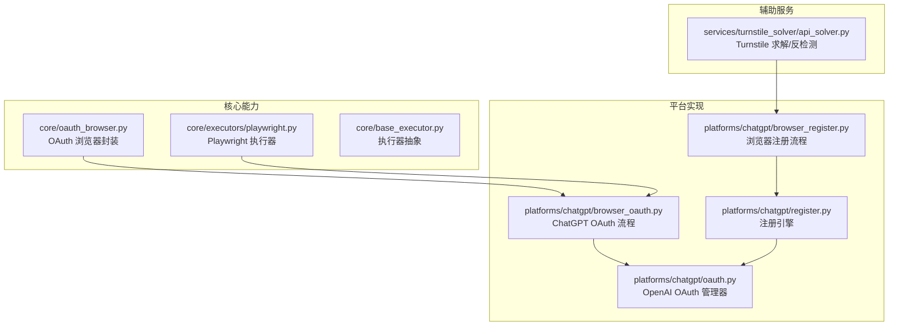
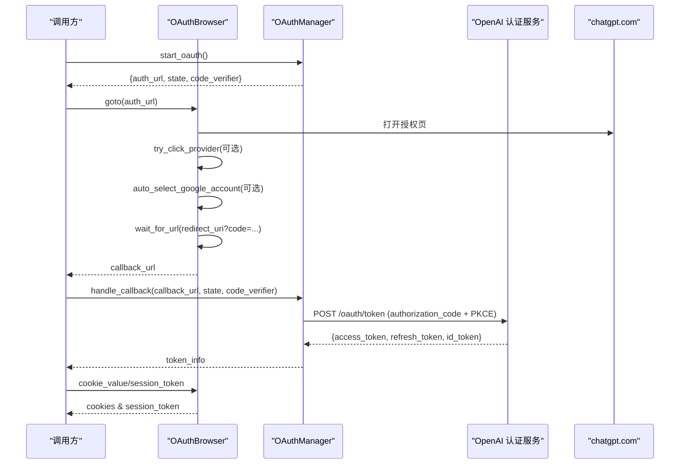
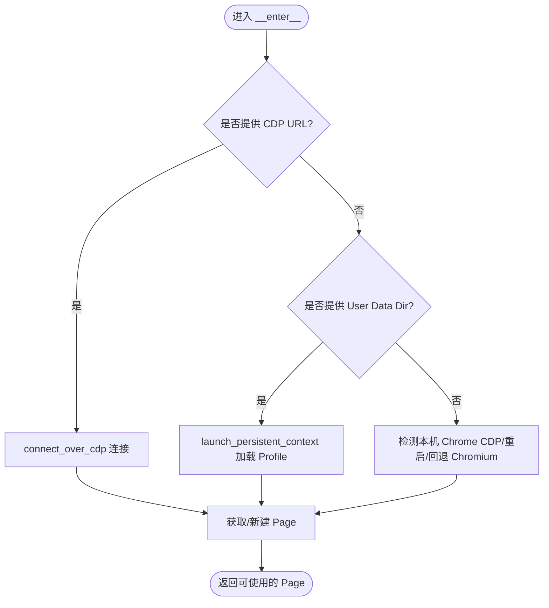
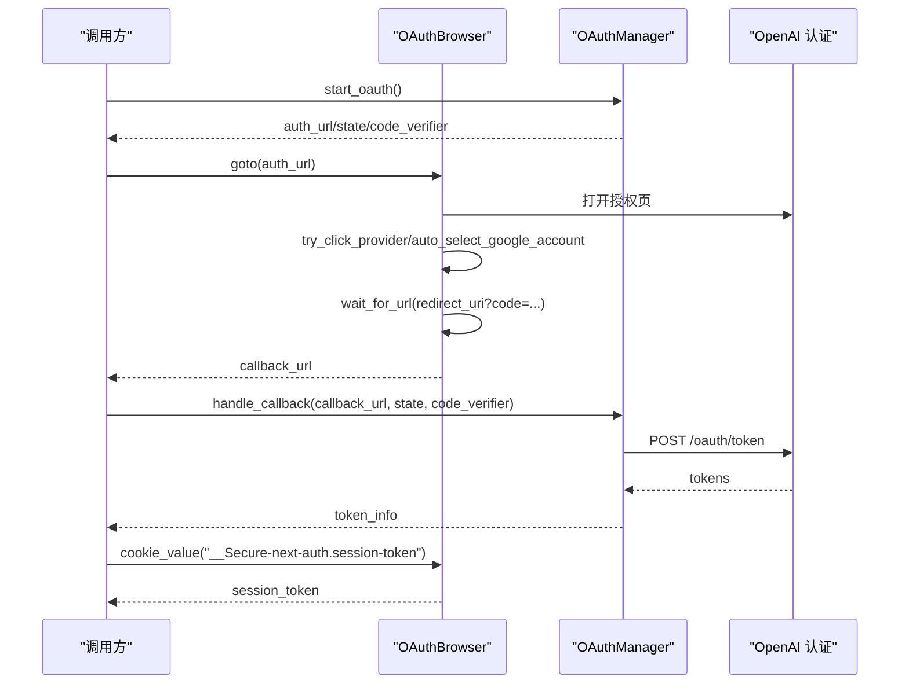
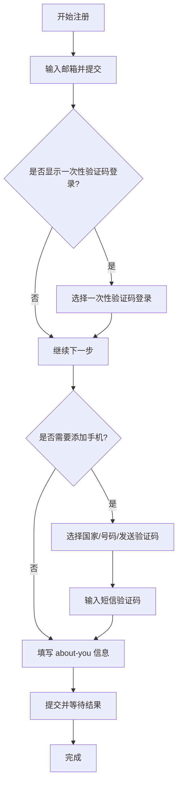
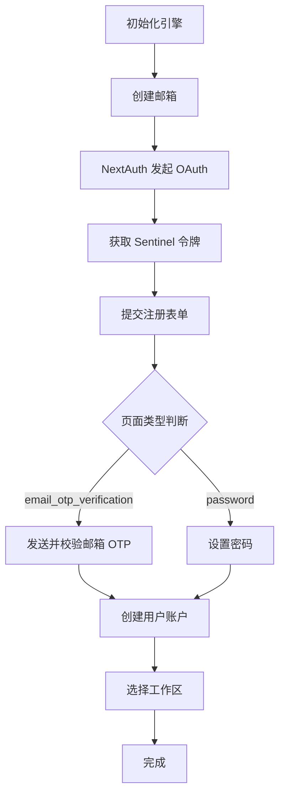
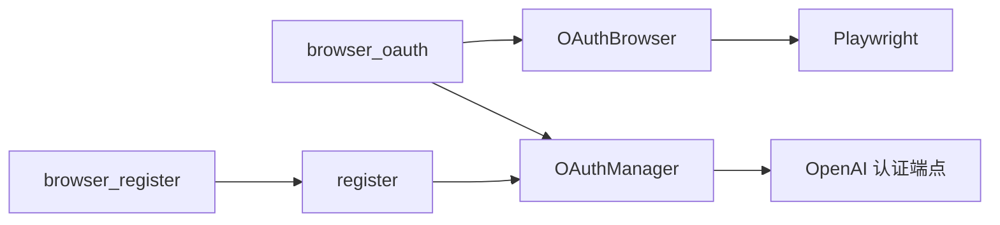

# 浏览器自动化OAuth

<cite>
**本文引用的文件**
- [core/oauth_browser.py](file://core/oauth_browser.py)
- [core/manual_oauth_browser.py](file://core/manual_oauth_browser.py)
- [platforms/chatgpt/browser_oauth.py](file://platforms/chatgpt/browser_oauth.py)
- [platforms/chatgpt/oauth.py](file://platforms/chatgpt/oauth.py)
- [platforms/chatgpt/constants.py](file://platforms/chatgpt/constants.py)
- [core/executors/playwright.py](file://core/executors/playwright.py)
- [core/base_executor.py](file://core/base_executor.py)
- [platforms/chatgpt/register.py](file://platforms/chatgpt/register.py)
- [platforms/chatgpt/browser_register.py](file://platforms/chatgpt/browser_register.py)
- [services/turnstile_solver/api_solver.py](file://services/turnstile_solver/api_solver.py)
</cite>

## 目录
1. [简介](#简介)
2. [项目结构](#项目结构)
3. [核心组件](#核心组件)
4. [架构总览](#架构总览)
5. [详细组件分析](#详细组件分析)
6. [依赖关系分析](#依赖关系分析)
7. [性能与反检测](#性能与反检测)
8. [故障排查指南](#故障排查指南)
9. [结论](#结论)
10. [附录](#附录)

## 简介
本指南面向需要在浏览器中实现自动化 OAuth 集成的工程师，基于 Playwright/Camoufox 等浏览器自动化能力，提供从“启动浏览器、选择登录方式、处理验证码、提取会话”到“平台注册（以 ChatGPT/OpenAI 为例）”的完整实践。文档重点覆盖：
- headless 与 headed 模式的选择与使用场景
- 浏览器实例管理、页面导航、表单填写、验证码处理
- Cookie 提取、本地存储操作、会话保持
- ChatGPT 平台自动注册的邮箱验证、密码设置、账户激活流程
- 代理配置、反检测策略与性能优化技巧

## 项目结构
本项目采用分层模块化设计：
- core：通用能力（OAuth 浏览器封装、执行器抽象、基础工具）
- platforms：各平台的业务实现（ChatGPT、Cursor、Grok 等），包含浏览器注册/OAuth/协议适配
- services：辅助服务（如 Turnstile 求解、任务运行时）
- api/application/domain/infrastructure：API 层、应用编排、领域模型、基础设施
- frontend/electron：前端与桌面端集成

图表来源
- [core/oauth_browser.py:139-230](file://core/oauth_browser.py#L139-L230)
- [platforms/chatgpt/browser_oauth.py:44-115](file://platforms/chatgpt/browser_oauth.py#L44-L115)
- [platforms/chatgpt/oauth.py:180-379](file://platforms/chatgpt/oauth.py#L180-L379)
- [platforms/chatgpt/register.py:187-800](file://platforms/chatgpt/register.py#L187-L800)
- [platforms/chatgpt/browser_register.py:1-800](file://platforms/chatgpt/browser_register.py#L1-L800)
- [services/turnstile_solver/api_solver.py:64-100](file://services/turnstile_solver/api_solver.py#L64-L100)

章节来源
- [core/oauth_browser.py:139-230](file://core/oauth_browser.py#L139-L230)
- [platforms/chatgpt/browser_oauth.py:44-115](file://platforms/chatgpt/browser_oauth.py#L44-L115)
- [platforms/chatgpt/oauth.py:180-379](file://platforms/chatgpt/oauth.py#L180-L379)
- [platforms/chatgpt/register.py:187-800](file://platforms/chatgpt/register.py#L187-L800)
- [platforms/chatgpt/browser_register.py:1-800](file://platforms/chatgpt/browser_register.py#L1-L800)
- [services/turnstile_solver/api_solver.py:64-100](file://services/turnstile_solver/api_solver.py#L64-L100)

## 核心组件
- OAuth 浏览器封装（OAuthBrowser）
  - 支持三种连接方式：CDP 连接已运行 Chrome、持久化上下文加载用户数据目录、回退到普通 Chromium
  - 内置代理解析、Google 账号自动选择、URL/Cookie 等待与提取
  - 提供 try_click_provider 智能识别并点击第三方登录按钮
- Playwright 执行器（PlaywrightExecutor）
  - 统一 get/post/cookies 等方法，屏蔽底层浏览器差异
  - 默认启用反自动化参数、自定义 UA、较长超时
- ChatGPT OAuth 管理器（OAuthManager）
  - 生成授权 URL（含 PKCE）、处理回调、交换 token、解析 JWT claims
- ChatGPT 注册引擎（RegistrationEngine）
  - 协调邮箱服务、NextAuth OAuth、Sentinel PoW/Turnstile、邮箱 OTP、密码设置、创建账户、工作区选择
- 浏览器注册流程（browser_register）
  - 通过 Camoufox/Playwright 驱动真实浏览器界面，处理 add-phone、短信验证码、about-you 等步骤

章节来源
- [core/oauth_browser.py:139-394](file://core/oauth_browser.py#L139-L394)
- [core/executors/playwright.py:5-134](file://core/executors/playwright.py#L5-L134)
- [platforms/chatgpt/oauth.py:180-379](file://platforms/chatgpt/oauth.py#L180-L379)
- [platforms/chatgpt/register.py:187-800](file://platforms/chatgpt/register.py#L187-L800)
- [platforms/chatgpt/browser_register.py:1-800](file://platforms/chatgpt/browser_register.py#L1-L800)

## 架构总览
下图展示了 ChatGPT 平台 OAuth 自动化的端到端调用链：

图表来源
- [platforms/chatgpt/browser_oauth.py:44-115](file://platforms/chatgpt/browser_oauth.py#L44-L115)
- [platforms/chatgpt/oauth.py:180-379](file://platforms/chatgpt/oauth.py#L180-L379)
- [core/oauth_browser.py:139-394](file://core/oauth_browser.py#L139-L394)

## 详细组件分析

### OAuth 浏览器封装（OAuthBrowser）
- 浏览器实例管理
  - 优先尝试连接本机已运行的 Chrome（CDP），否则尝试重启带调试端口，最后回退到 Playwright Chromium
  - 支持通过 chrome_user_data_dir 复用系统 Chrome Profile，携带 Google/GitHub 等登录态
- 代理配置
  - 解析 http/https 代理，支持用户名/密码
- 页面交互
  - try_click_provider：通过文本匹配与评分机制，自动点击 Google/GitHub/Microsoft 等登录按钮
  - auto_select_google_account：在 Google 账号选择器出现时自动点击第一个账号
- 等待与提取
  - wait_for_url：等待满足谓词的 URL（如回调地址带 code）
  - wait_for_cookie_value：等待指定 Cookie 出现
  - cookies/cookie_value/cookie_header/cookie_dict：灵活提取 Cookie 或拼接为请求头

图表来源
- [core/oauth_browser.py:162-214](file://core/oauth_browser.py#L162-L214)

章节来源
- [core/oauth_browser.py:63-127](file://core/oauth_browser.py#L63-L127)
- [core/oauth_browser.py:139-230](file://core/oauth_browser.py#L139-L230)
- [core/oauth_browser.py:242-394](file://core/oauth_browser.py#L242-L394)

### ChatGPT OAuth 流程（browser_oauth + oauth）
- 流程要点
  - 初始化 OAuthManager，生成授权 URL（含 PKCE）
  - 使用 OAuthBrowser 打开授权页，可选择第三方登录提供商
  - 若使用 Profile/CDP，自动选择 Google 账号
  - 等待回调 URL（带 code），调用 handle_callback 换取 access_token/refresh_token/id_token
  - 提取 session_token 与 cookies（chatgpt.com/openai.com 域）
- 安全与兼容性
  - 使用 PKCE 避免授权码泄露风险
  - 兼容不同 client_id（Codex CLI 与普通 Web）

图表来源
- [platforms/chatgpt/browser_oauth.py:44-115](file://platforms/chatgpt/browser_oauth.py#L44-L115)
- [platforms/chatgpt/oauth.py:180-379](file://platforms/chatgpt/oauth.py#L180-L379)

章节来源
- [platforms/chatgpt/browser_oauth.py:44-115](file://platforms/chatgpt/browser_oauth.py#L44-L115)
- [platforms/chatgpt/oauth.py:180-379](file://platforms/chatgpt/oauth.py#L180-L379)

### ChatGPT 浏览器注册流程（browser_register）
- 关键步骤
  - 邮箱输入与提交：多选择器匹配 email/password/continue 按钮
  - 一次性验证码登录：优先选择 passwordless 入口
  - 国家代码选择：React Aria Select 的多策略选择（原生 select、selectOption、listbox 交互、键盘 type-ahead）
  - 手机号发送与短信验证码：发送按钮、错误提示、重试换号
  - about-you 页面：生日隐藏字段同步
- 健壮性
  - 多处 fallback：JS 注入、事件派发、Playwright API 组合
  - 错误提取：alert/error 区域文本捕获

图表来源
- [platforms/chatgpt/browser_register.py:25-187](file://platforms/chatgpt/browser_register.py#L25-L187)
- [platforms/chatgpt/browser_register.py:2005-2285](file://platforms/chatgpt/browser_register.py#L2005-L2285)

章节来源
- [platforms/chatgpt/browser_register.py:25-187](file://platforms/chatgpt/browser_register.py#L25-L187)
- [platforms/chatgpt/browser_register.py:2005-2285](file://platforms/chatgpt/browser_register.py#L2005-L2285)

### 注册引擎（register）
- 职责
  - 协调邮箱服务、NextAuth OAuth、Sentinel PoW/Turnstile、邮箱 OTP、密码设置、创建账户
- 关键点
  - NextAuth 发起 OAuth：获取 CSRF、调用 signin/openai、得到 authorize URL
  - Sentinel 防护：动态生成 p/c/t 令牌，必要时进行 PoW 计算与 VM 求解
  - 邮箱 OTP：发送、轮询获取、校验并推进 continue_url
  - 密码设置：生成强密码，多次尝试，处理“已存在”错误
  - 创建账户：填充 name/birthday，携带 device-id 与 sentinel token

图表来源
- [platforms/chatgpt/register.py:331-800](file://platforms/chatgpt/register.py#L331-L800)
- [platforms/chatgpt/constants.py:53-91](file://platforms/chatgpt/constants.py#L53-L91)

章节来源
- [platforms/chatgpt/register.py:331-800](file://platforms/chatgpt/register.py#L331-L800)
- [platforms/chatgpt/constants.py:53-91](file://platforms/chatgpt/constants.py#L53-L91)

### Playwright 执行器与基类
- BaseExecutor：定义统一的 HTTP 接口与生命周期管理
- PlaywrightExecutor：基于 Playwright 实现 get/post/cookies，设置反自动化参数与长超时

章节来源
- [core/base_executor.py:7-49](file://core/base_executor.py#L7-L49)
- [core/executors/playwright.py:5-134](file://core/executors/playwright.py#L5-L134)

## 依赖关系分析
- OAuthBrowser 依赖 Playwright 与系统 Chrome（可选）
- ChatGPT browser_oauth 依赖 OAuthBrowser 与 OAuthManager
- OAuthManager 依赖 OpenAI 认证端点与 curl_cffi（支持指纹模拟）
- register 依赖 OAuthManager、HTTP 客户端、邮箱服务、Sentinel 求解
- browser_register 依赖 Camoufox/Playwright 与常量选择器

图表来源
- [core/oauth_browser.py:139-230](file://core/oauth_browser.py#L139-L230)
- [platforms/chatgpt/browser_oauth.py:44-115](file://platforms/chatgpt/browser_oauth.py#L44-L115)
- [platforms/chatgpt/oauth.py:180-379](file://platforms/chatgpt/oauth.py#L180-L379)
- [platforms/chatgpt/register.py:187-800](file://platforms/chatgpt/register.py#L187-L800)
- [platforms/chatgpt/browser_register.py:1-800](file://platforms/chatgpt/browser_register.py#L1-L800)

章节来源
- [core/oauth_browser.py:139-230](file://core/oauth_browser.py#L139-L230)
- [platforms/chatgpt/browser_oauth.py:44-115](file://platforms/chatgpt/browser_oauth.py#L44-L115)
- [platforms/chatgpt/oauth.py:180-379](file://platforms/chatgpt/oauth.py#L180-L379)
- [platforms/chatgpt/register.py:187-800](file://platforms/chatgpt/register.py#L187-L800)
- [platforms/chatgpt/browser_register.py:1-800](file://platforms/chatgpt/browser_register.py#L1-L800)

## 性能与反检测
- Headless vs Headed
  - headless：适合服务器环境、批量任务；注意部分站点对无头浏览器更敏感
  - headed：便于调试与人工介入；在 CI 中需配合虚拟显示（如 xvfb）
- 反检测策略
  - 启动参数禁用自动化特征、设置真实 UA、随机 sec-ch-ua
  - 使用 curl_cffi impersonate 模拟浏览器指纹
  - 使用 Camoufox/Chrome Profile 提升拟真度
- 代理配置
  - 支持 http/socks5，带用户名/密码；可在上下文级别设置
  - 旋转代理网关与 API 提取，提高稳定性
- 性能优化
  - 合理设置超时与等待策略（networkidle、selector 等待）
  - 复用浏览器上下文与页面，减少启动开销
  - 并发控制与资源隔离（多 context 并行）

章节来源
- [core/executors/playwright.py:14-35](file://core/executors/playwright.py#L14-L35)
- [platforms/chatgpt/oauth.py:125-178](file://platforms/chatgpt/oauth.py#L125-L178)
- [services/turnstile_solver/api_solver.py:64-100](file://services/turnstile_solver/api_solver.py#L64-L100)
- [services/turnstile_solver/api_solver.py:686-710](file://services/turnstile_solver/api_solver.py#L686-L710)

## 故障排查指南
- OAuth 回调失败
  - 检查 redirect_uri 与 state 匹配；确认浏览器已正确跳转至回调地址
  - 查看 handle_callback 的错误信息（error/error_description）
- 未收到邮箱验证码
  - 确认邮箱服务可用；检查 OTP 轮询超时与正则匹配
  - 查看 _get_verification_code 日志与 _send_verification_code 状态
- 手机号验证失败
  - 检查国家代码选择是否正确；确认 listbox 展开与 option 匹配
  - 若多次失败，触发换号重试逻辑
- 被反检测拦截
  - 调整 UA、sec-ch-ua、禁用自动化特征
  - 使用 Profile/CDP 模式或 Camoufox
  - 检查 Turnstile/PoW 求解是否成功

章节来源
- [platforms/chatgpt/oauth.py:240-321](file://platforms/chatgpt/oauth.py#L240-L321)
- [platforms/chatgpt/register.py:673-752](file://platforms/chatgpt/register.py#L673-L752)
- [platforms/chatgpt/browser_register.py:2005-2285](file://platforms/chatgpt/browser_register.py#L2005-L2285)
- [platforms/chatgpt/register.py:421-481](file://platforms/chatgpt/register.py#L421-L481)

## 结论
本方案通过 OAuthBrowser 与 OAuthManager 的组合，实现了跨平台的自动化 OAuth 登录；结合 ChatGPT 的注册引擎与浏览器注册流程，覆盖了邮箱验证、密码设置、账户激活等关键环节。借助代理、反检测与性能优化策略，能够在复杂环境中稳定运行。建议在生产环境结合 headed 模式进行调试，并在批量化场景中使用 headless 与上下文复用以提升效率。

## 附录
- 常用选择器与常量
  - 邮箱/密码/提交按钮选择器集合
  - OpenAI 端点与页面类型常量
- 最佳实践
  - 使用 Profile/CDP 复用登录态
  - 合理设置超时与重试
  - 记录关键日志以便定位问题

章节来源
- [platforms/chatgpt/browser_register.py:25-187](file://platforms/chatgpt/browser_register.py#L25-L187)
- [platforms/chatgpt/constants.py:53-91](file://platforms/chatgpt/constants.py#L53-L91)