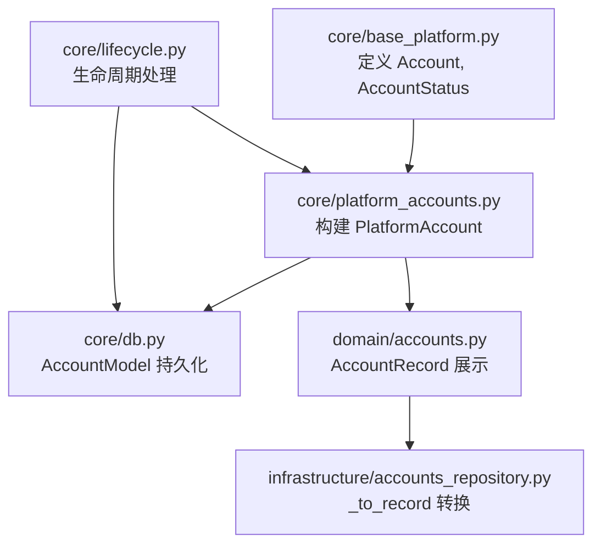
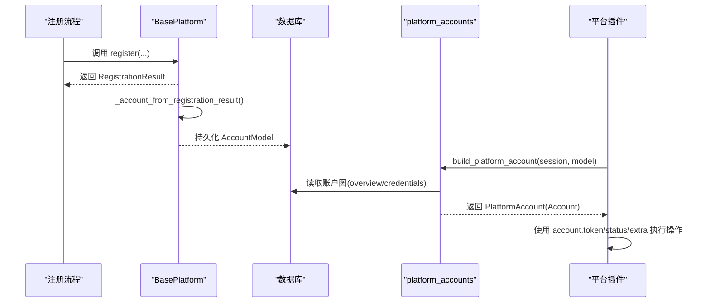
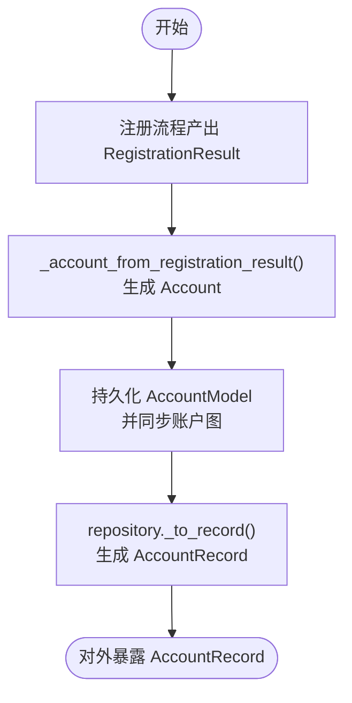
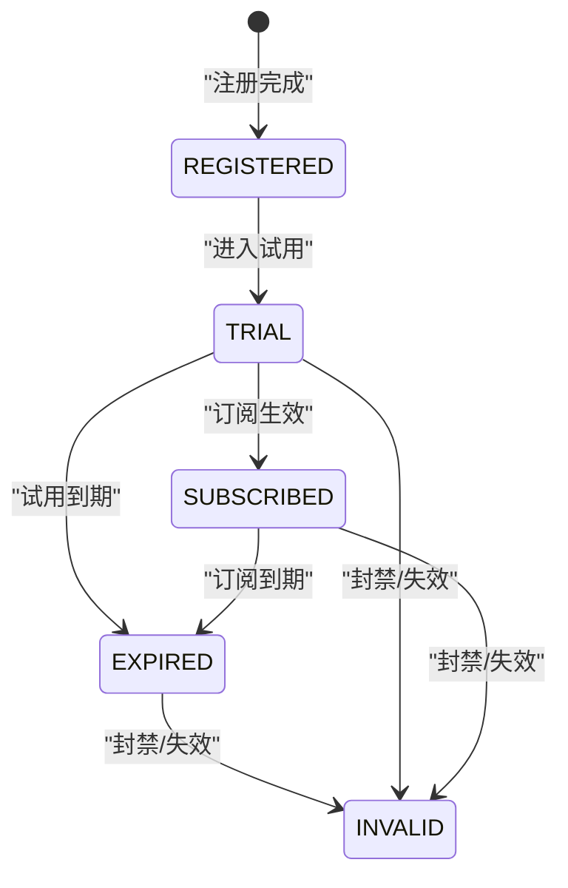
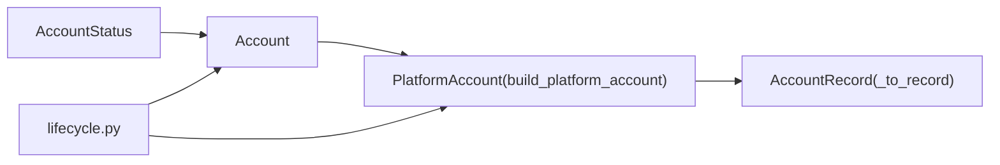

# Account数据模型详解

<cite>
**本文引用的文件**
- [core/base_platform.py](file://core/base_platform.py)
- [core/platform_accounts.py](file://core/platform_accounts.py)
- [core/db.py](file://core/db.py)
- [domain/accounts.py](file://domain/accounts.py)
- [infrastructure/accounts_repository.py](file://infrastructure/accounts_repository.py)
- [core/lifecycle.py](file://core/lifecycle.py)
- [tests/test_windsurf_platform.py](file://tests/test_windsurf_platform.py)
</cite>

## 目录
1. [简介](#简介)
2. [项目结构](#项目结构)
3. [核心组件](#核心组件)
4. [架构总览](#架构总览)
5. [详细组件分析](#详细组件分析)
6. [依赖关系分析](#依赖关系分析)
7. [性能考量](#性能考量)
8. [故障排查指南](#故障排查指南)
9. [结论](#结论)
10. [附录](#附录)

## 简介
本文件围绕系统中的 Account 数据模型进行系统化说明，涵盖字段含义、状态枚举、创建与序列化/反序列化流程、注册生命周期与状态流转，以及在实际代码中的使用方式。目标是帮助开发者快速理解并正确使用 Account 模型完成账户操作。

## 项目结构
Account 模型及相关能力分布在以下模块：
- 领域模型与持久化：core/base_platform.py（Account、AccountStatus）、core/db.py（数据库模型）
- 平台账户装配：core/platform_accounts.py（从图结构与凭证解析出 PlatformAccount）
- 展示记录：domain/accounts.py（AccountRecord，用于对外展示）
- 仓库层：infrastructure/accounts_repository.py（将模型转为记录）
- 生命周期管理：core/lifecycle.py（过期标记、状态修复等）
- 测试用例：tests/test_windsurf_platform.py（Account 构造与使用的示例）

图表来源
- [core/base_platform.py:13-33](file://core/base_platform.py#L13-L33)
- [core/platform_accounts.py:23-112](file://core/platform_accounts.py#L23-L112)
- [core/db.py:25-50](file://core/db.py#L25-L50)
- [domain/accounts.py:8-29](file://domain/accounts.py#L8-L29)
- [infrastructure/accounts_repository.py:55-86](file://infrastructure/accounts_repository.py#L55-L86)
- [core/lifecycle.py:200-260](file://core/lifecycle.py#L200-L260)

章节来源
- [core/base_platform.py:13-33](file://core/base_platform.py#L13-L33)
- [core/platform_accounts.py:23-112](file://core/platform_accounts.py#L23-L112)
- [core/db.py:25-50](file://core/db.py#L25-L50)
- [domain/accounts.py:8-29](file://domain/accounts.py#L8-L29)
- [infrastructure/accounts_repository.py:55-86](file://infrastructure/accounts_repository.py#L55-L86)
- [core/lifecycle.py:200-260](file://core/lifecycle.py#L200-L260)

## 核心组件
- Account 数据类：包含平台标识、邮箱、密码、用户ID、地区、访问令牌、状态、试用结束时间、扩展字段、创建时间等。
- AccountStatus 枚举：表示账户生命周期状态。
- PlatformAccount 构建器：从数据库模型和“账户图”中拼装出运行时可用的 Account。
- AccountRecord：面向前端或外部系统的展示记录，聚合了生命周期、有效性、计划等信息。
- 仓库转换：将数据库模型转换为展示记录。

章节来源
- [core/base_platform.py:13-33](file://core/base_platform.py#L13-L33)
- [core/platform_accounts.py:23-112](file://core/platform_accounts.py#L23-L112)
- [domain/accounts.py:8-29](file://domain/accounts.py#L8-L29)
- [infrastructure/accounts_repository.py:55-86](file://infrastructure/accounts_repository.py#L55-L86)

## 架构总览
Account 的生命周期贯穿注册、存储、查询、校验、展示等环节。注册完成后，系统通过“账户图”维护更丰富的上下文（如 overview、credentials、provider_accounts 等），并在需要时装配为 PlatformAccount 供平台插件使用。

图表来源
- [core/base_platform.py:105-160](file://core/base_platform.py#L105-L160)
- [core/platform_accounts.py:23-112](file://core/platform_accounts.py#L23-L112)
- [core/db.py:307-334](file://core/db.py#L307-L334)

## 详细组件分析

### Account 数据模型与字段语义
- platform：平台标识，用于区分不同目标平台（如 windsurf、chatgpt、cursor 等）。
- email：邮箱地址，作为账号唯一标识之一。
- password：密码，用于登录或某些平台的二次认证。
- user_id：平台侧的用户ID，便于跨系统关联。
- region：地区信息，常用于代理选择或区域化服务。
- token：访问令牌，优先从“账户图”的凭证中解析为主令牌；若为空则回退到基础字段。
- status：账户状态枚举，见下文 AccountStatus。
- trial_end_time：试用结束时间的 Unix 秒级时间戳，用于试用到期判定。
- extra：自定义字段字典，承载平台相关扩展信息（如 accessToken、session_token、region、cashier_url、provider_accounts、provider_resources 等）。
- created_at：创建时间（Unix 秒级时间戳）。

注意：
- 在运行时，token 通常由 platform_accounts.resolve_primary_token 根据平台优先级从 credentials 中解析得到。
- region、trial_end_time、cashier_url 等可能来自账户图的 overview 并写入 extra。

章节来源
- [core/base_platform.py:13-33](file://core/base_platform.py#L13-L33)
- [core/platform_accounts.py:51-93](file://core/platform_accounts.py#L51-L93)
- [core/platform_accounts.py:96-112](file://core/platform_accounts.py#L96-L112)

### AccountStatus 枚举及业务含义
- REGISTERED：已注册，尚未进入试用或订阅阶段。
- TRIAL：试用中，处于试用有效期内。
- SUBSCRIBED：已订阅，付费订阅生效。
- EXPIRED：已过期，试用或订阅到期。
- INVALID：无效，账号被封禁或不可用。

这些状态会体现在账户图的 lifecycle_status/display_status/plan_state 中，并被用于展示与自动化流程（如过期预警、封禁标记）。

章节来源
- [core/base_platform.py:13-18](file://core/base_platform.py#L13-L18)
- [core/lifecycle.py:200-260](file://core/lifecycle.py#L200-L260)

### Account 的创建与序列化/反序列化
- 创建路径：
  - 注册流程产生 RegistrationResult，BasePlatform._account_from_registration_result 将其转换为 Account。
  - 随后通过数据库层持久化为 AccountModel，并同步账户图。
- 序列化/反序列化：
  - 对外展示使用 AccountRecord，由 infrastructure.accounts_repository._to_record 将 AccountModel 与账户图组装成展示记录。
  - 前端/外部系统消费 AccountRecord 的字段（如 primary_token、lifecycle_status、display_status、plan_state、overview、display_summary 等）。

图表来源
- [core/base_platform.py:105-160](file://core/base_platform.py#L105-L160)
- [core/db.py:307-334](file://core/db.py#L307-L334)
- [infrastructure/accounts_repository.py:55-86](file://infrastructure/accounts_repository.py#L55-L86)

章节来源
- [core/base_platform.py:105-160](file://core/base_platform.py#L105-L160)
- [core/db.py:307-334](file://core/db.py#L307-L334)
- [infrastructure/accounts_repository.py:55-86](file://infrastructure/accounts_repository.py#L55-L86)

### Account 在注册流程中的生命周期与状态流转
- 初始状态：注册成功后默认状态为 REGISTERED。
- 试用阶段：当检测到试用资格或进入试用，状态可变为 TRIAL，并设置 trial_end_time。
- 订阅阶段：购买或激活订阅后，状态变为 SUBSCRIBED。
- 过期阶段：试用或订阅到期，状态变为 EXPIRED。
- 无效阶段：被封禁或验证失败，状态变为 INVALID。

图表来源
- [core/base_platform.py:13-18](file://core/base_platform.py#L13-L18)
- [core/lifecycle.py:200-260](file://core/lifecycle.py#L200-L260)

章节来源
- [core/base_platform.py:13-18](file://core/base_platform.py#L13-L18)
- [core/lifecycle.py:200-260](file://core/lifecycle.py#L200-L260)

### 实际代码示例（如何正确使用 Account）
- 构造 Account 对象（测试用例示例）：
  - 参考测试文件中对 Account 的直接构造，传入 platform、email、password、token、extra 等字段，用于驱动平台能力调用。
- 使用 PlatformAccount：
  - 通过 core.platform_accounts.build_platform_account 从数据库模型与账户图构建 Account，再交给平台插件执行动作（如 generate_trial_link、switch_desktop 等）。

提示：
- 不要直接修改 Account 的持久化字段（如 token、status），应通过平台能力与仓库层更新账户图与凭证。
- 对于多平台，token 的获取优先从账户图的 credentials 中按平台优先级解析。

章节来源
- [tests/test_windsurf_platform.py:269-400](file://tests/test_windsurf_platform.py#L269-L400)
- [core/platform_accounts.py:96-112](file://core/platform_accounts.py#L96-L112)

## 依赖关系分析
- Account 依赖 AccountStatus 枚举。
- PlatformAccount 构建依赖账户图（overview、credentials、provider_accounts、provider_resources）。
- 展示记录 AccountRecord 依赖账户图与显示摘要计算。
- 生命周期模块依赖账户图的状态字段进行过期预警与状态修复。

图表来源
- [core/base_platform.py:13-33](file://core/base_platform.py#L13-L33)
- [core/platform_accounts.py:23-112](file://core/platform_accounts.py#L23-L112)
- [infrastructure/accounts_repository.py:55-86](file://infrastructure/accounts_repository.py#L55-L86)
- [core/lifecycle.py:200-260](file://core/lifecycle.py#L200-L260)

章节来源
- [core/base_platform.py:13-33](file://core/base_platform.py#L13-L33)
- [core/platform_accounts.py:23-112](file://core/platform_accounts.py#L23-L112)
- [infrastructure/accounts_repository.py:55-86](file://infrastructure/accounts_repository.py#L55-L86)
- [core/lifecycle.py:200-260](file://core/lifecycle.py#L200-L260)

## 性能考量
- Token 解析采用平台优先级列表，避免全量扫描，提升查找效率。
- 账户图按需加载与同步，减少不必要的 I/O。
- 展示记录聚合计算尽量复用已有数据（overview、display_summary），避免重复计算。

[本节提供通用指导，不直接分析具体文件]

## 故障排查指南
- 试用即将过期：
  - 检查 trial_end_time 与当前时间差，系统会标记 expiring_in_Xh 警告。
- 账号被封禁：
  - 检查 validity_status 与 lifecycle_status，可能被标记为 invalid。
- Token 缺失：
  - 确认账户图中是否存在对应平台的凭证键（如 session_token、access_token），必要时通过平台能力刷新。

章节来源
- [core/lifecycle.py:200-260](file://core/lifecycle.py#L200-L260)
- [core/platform_accounts.py:51-93](file://core/platform_accounts.py#L51-L93)

## 结论
Account 模型以简洁的数据类形式承载账户核心信息，并通过账户图机制扩展平台特定上下文。配合 AccountStatus 与生命周期管理，系统能够准确表达账户状态、驱动自动化流程并提供一致的展示视图。遵循本文所述字段语义与流程，可在各平台插件中安全、高效地使用 Account 完成账户操作。

## 附录
- 字段速查
  - platform：平台标识
  - email：邮箱地址
  - password：密码
  - user_id：用户ID
  - region：地区
  - token：访问令牌（优先从账户图凭证解析）
  - status：账户状态（REGISTERED/TRIAL/SUBSCRIBED/EXPIRED/INVALID）
  - trial_end_time：试用结束时间（Unix 秒）
  - extra：自定义字段字典（含 account_overview、region、cashier_url、provider_accounts、provider_resources 等）
  - created_at：创建时间（Unix 秒）

- 常用操作路径
  - 创建：注册流程 -> BasePlatform._account_from_registration_result -> 持久化 -> 同步账户图
  - 查询：build_platform_account -> 解析 token/status/extra
  - 展示：_to_record -> AccountRecord（primary_token、lifecycle_status、display_status、plan_state、overview、display_summary）

章节来源
- [core/base_platform.py:13-33](file://core/base_platform.py#L13-L33)
- [core/platform_accounts.py:51-112](file://core/platform_accounts.py#L51-L112)
- [infrastructure/accounts_repository.py:55-86](file://infrastructure/accounts_repository.py#L55-L86)