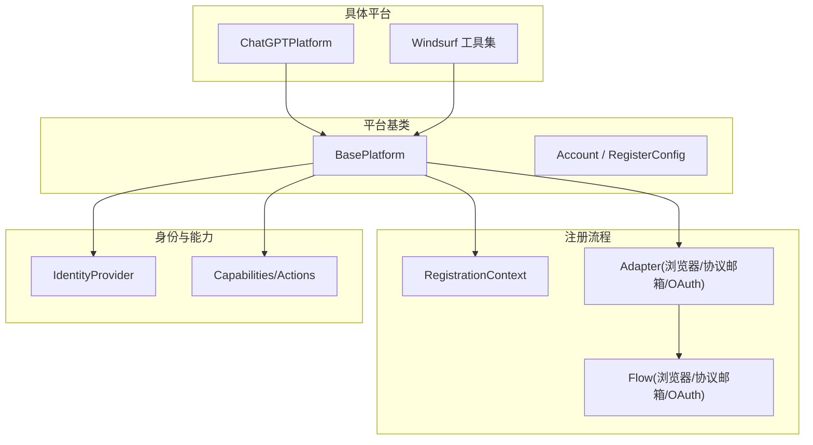
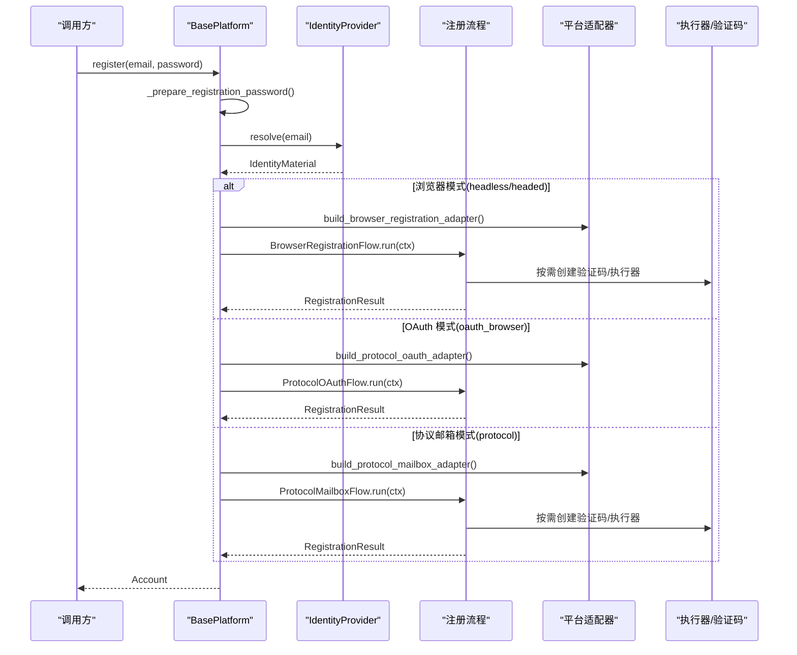
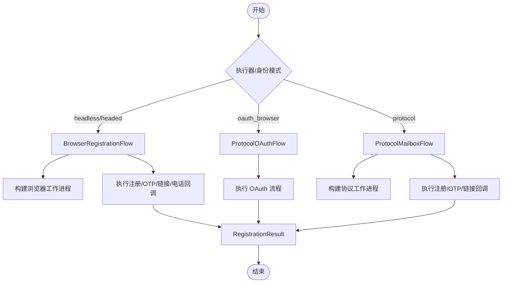
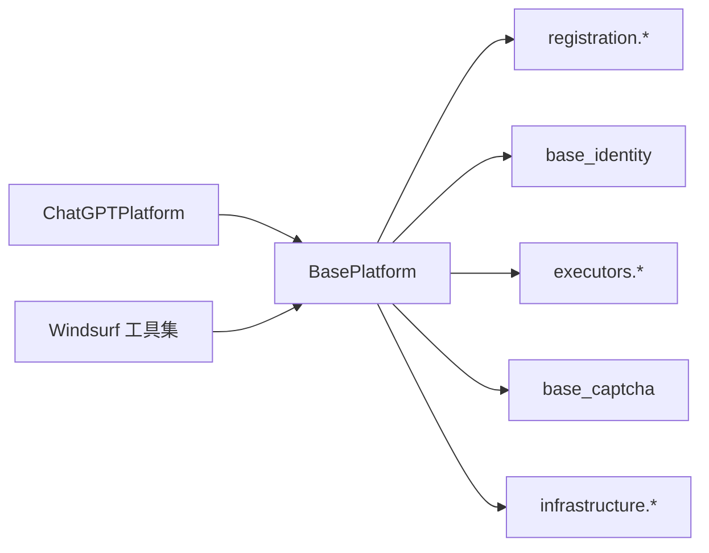

# 基础平台类使用指南

<cite>
**本文引用的文件**
- [core/base_platform.py](file://core/base_platform.py)
- [core/registration/models.py](file://core/registration/models.py)
- [core/registration/adapters.py](file://core/registration/adapters.py)
- [core/registration/flows.py](file://core/registration/flows.py)
- [core/base_identity.py](file://core/base_identity.py)
- [platforms/chatgpt/plugin.py](file://platforms/chatgpt/plugin.py)
- [platforms/windsurf/core.py](file://platforms/windsurf/core.py)
</cite>

## 目录
1. [简介](#简介)
2. [项目结构](#项目结构)
3. [核心组件](#核心组件)
4. [架构总览](#架构总览)
5. [详细组件分析](#详细组件分析)
6. [依赖关系分析](#依赖关系分析)
7. [性能注意事项](#性能注意事项)
8. [故障排查指南](#故障排查指南)
9. [结论](#结论)
10. [附录：快速上手清单](#附录快速上手清单)

## 简介
本指南面向希望基于 BasePlatform 基类扩展新平台适配器的开发者。内容涵盖：
- BasePlatform 的核心概念、生命周期与注册流程
- 必须实现的抽象方法与可选方法
- Account 数据模型与 RegisterConfig 配置项
- 身份解析、执行器选择、验证码处理等关键步骤
- 完整示例路径与最佳实践（错误处理、调试技巧）
帮助你在最短时间内构建稳定、可维护的平台适配器。

## 项目结构
围绕 BasePlatform 的关键代码分布在以下模块：
- 平台基类与账号模型：core/base_platform.py
- 注册上下文、适配器与流程编排：core/registration/*
- 身份提供者抽象：core/base_identity.py
- 具体平台实现参考：platforms/chatgpt/plugin.py、platforms/windsurf/core.py

图表来源
- [core/base_platform.py:44-160](file://core/base_platform.py#L44-L160)
- [core/registration/models.py:17-66](file://core/registration/models.py#L17-L66)
- [core/registration/adapters.py:27-59](file://core/registration/adapters.py#L27-L59)
- [core/registration/flows.py:18-142](file://core/registration/flows.py#L18-L142)
- [core/base_identity.py:64-131](file://core/base_identity.py#L64-L131)
- [platforms/chatgpt/plugin.py:48-225](file://platforms/chatgpt/plugin.py#L48-L225)
- [platforms/windsurf/core.py:401-667](file://platforms/windsurf/core.py#L401-L667)

章节来源
- [core/base_platform.py:44-160](file://core/base_platform.py#L44-L160)
- [core/registration/models.py:17-66](file://core/registration/models.py#L17-L66)
- [core/registration/adapters.py:27-59](file://core/registration/adapters.py#L27-L59)
- [core/registration/flows.py:18-142](file://core/registration/flows.py#L18-L142)
- [core/base_identity.py:64-131](file://core/base_identity.py#L64-L131)
- [platforms/chatgpt/plugin.py:48-225](file://platforms/chatgpt/plugin.py#L48-L225)
- [platforms/windsurf/core.py:401-667](file://platforms/windsurf/core.py#L401-L667)

## 核心组件
- BasePlatform：平台插件的抽象基类，封装注册流程、执行器与验证码选择、能力与动作分发、账户状态校验等通用逻辑。
- Account：账号数据模型，承载平台名、邮箱、密码、用户ID、区域、token、状态、试用截止时间及自定义字段。
- RegisterConfig：注册任务配置，包含执行器类型、验证码解决器、代理与扩展参数。
- RegistrationContext/Artifacts/Result：注册流程中的上下文、产物与结果对象。
- Adapters/Flows：将“平台如何注册”解耦为“适配器描述 + 流程编排”，支持浏览器模式、协议邮箱模式、OAuth 模式。
- IdentityProvider：统一身份来源抽象，支持 mailbox 与 oauth_browser。

章节来源
- [core/base_platform.py:21-42](file://core/base_platform.py#L21-L42)
- [core/base_platform.py:44-160](file://core/base_platform.py#L44-L160)
- [core/registration/models.py:17-66](file://core/registration/models.py#L17-L66)
- [core/registration/adapters.py:27-59](file://core/registration/adapters.py#L27-L59)
- [core/registration/flows.py:18-142](file://core/registration/flows.py#L18-L142)
- [core/base_identity.py:64-131](file://core/base_identity.py#L64-L131)

## 架构总览
BasePlatform.register 是入口，负责：
- 准备密码与身份解析
- 根据 executor_type 与 identity_provider 选择注册流程
- 构造并运行对应 Flow（浏览器/协议邮箱/OAuth）
- 将 RegistrationResult 转为 Account，并附加身份元数据

图表来源
- [core/base_platform.py:124-160](file://core/base_platform.py#L124-L160)
- [core/registration/flows.py:18-142](file://core/registration/flows.py#L18-L142)
- [core/registration/adapters.py:27-59](file://core/registration/adapters.py#L27-L59)
- [core/base_identity.py:64-131](file://core/base_identity.py#L64-L131)

## 详细组件分析

### BasePlatform 核心职责
- 初始化与能力加载：从注册表读取平台能力，校验 executor_type 是否受支持。
- 注册入口 register：统一协调身份解析、执行器选择、验证码处理与结果转换。
- 必需实现：check_valid(account) -> bool，用于验证账号有效性。
- 可选实现：get_trial_url、get_quota、get_desktop_state、execute_action 等。
- 验证码与执行器：_make_captcha/_make_executor 根据配置动态创建；solve_turnstile_with_fallback 提供多 provider 回退。
- 身份元数据：_attach_identity_metadata 将 identity 快照写入 account.extra，便于后续查询与操作。

章节来源
- [core/base_platform.py:59-76](file://core/base_platform.py#L59-L76)
- [core/base_platform.py:124-160](file://core/base_platform.py#L124-L160)
- [core/base_platform.py:162-169](file://core/base_platform.py#L162-L169)
- [core/base_platform.py:316-338](file://core/base_platform.py#L316-L338)
- [core/base_platform.py:412-430](file://core/base_platform.py#L412-L430)
- [core/base_platform.py:484-504](file://core/base_platform.py#L484-L504)

### Account 数据模型
- 字段含义
  - platform：平台标识
  - email/password：登录凭据
  - user_id/region/token：平台返回的身份与令牌信息
  - status：账号状态枚举（registered/trial/subscribed/expired/invalid）
  - trial_end_time：试用截止时间戳
  - extra：平台自定义字段，会注入 identity 快照、verification_mailbox、provider_accounts/resources 等
- 典型用途
  - check_valid 中读取 token/cookies 等凭据进行状态检查
  - execute_action 中读取 extra 完成支付链接生成、桌面端切换等操作

章节来源
- [core/base_platform.py:13-33](file://core/base_platform.py#L13-L33)
- [core/base_platform.py:105-122](file://core/base_platform.py#L105-L122)
- [core/base_platform.py:484-504](file://core/base_platform.py#L484-L504)

### RegisterConfig 配置选项
- executor_type：protocol | headless | headed，决定注册执行方式
- captcha_solver：auto | <provider_key> | manual，控制验证码解决策略
- proxy：可选代理地址
- extra：扩展参数，如 mail_provider、identity_provider、oauth_* 等

章节来源
- [core/base_platform.py:35-42](file://core/base_platform.py#L35-L42)
- [core/base_identity.py:100-117](file://core/base_identity.py#L100-L117)

### 注册流程与适配器
- 三种流程
  - BrowserRegistrationFlow：浏览器自动化注册，支持 OTP/链接/电话回调、Turnstile 验证码
  - ProtocolMailboxFlow：协议邮箱注册，支持 OTP/链接回调、可选验证码与执行器
  - ProtocolOAuthFlow：通过浏览器 OAuth 完成注册或登录
- 适配器要点
  - BrowserRegistrationAdapter：定义 result_mapper、browser_worker_builder、browser_register_runner、oauth_runner、capability、otp_spec/link_spec 等
  - ProtocolMailboxAdapter：定义 worker_builder、register_runner、capability、otp_spec/link_spec 等
  - ProtocolOAuthAdapter：定义 oauth_runner、result_mapper、capability 等

图表来源
- [core/registration/flows.py:18-142](file://core/registration/flows.py#L18-L142)
- [core/registration/adapters.py:27-59](file://core/registration/adapters.py#L27-L59)

章节来源
- [core/registration/flows.py:18-142](file://core/registration/flows.py#L18-L142)
- [core/registration/adapters.py:27-59](file://core/registration/adapters.py#L27-L59)

### 身份解析与执行器选择
- 身份解析
  - 通过 BaseIdentityProvider 的 resolve 获取邮箱、OAuth 提供商、Chrome 会话信息等
  - 支持 mailbox 与 oauth_browser 两种模式
- 执行器选择
  - protocol：HTTP 协议执行器
  - headless/headed：Playwright 浏览器执行器
  - 若 identity_provider=oauth_browser，则强制走 ProtocolOAuthFlow

章节来源
- [core/base_identity.py:64-131](file://core/base_identity.py#L64-L131)
- [core/base_platform.py:432-459](file://core/base_platform.py#L432-L459)
- [core/base_platform.py:138-160](file://core/base_platform.py#L138-L160)

### 验证码处理
- 自动选择策略
  - 优先读取 config.captcha_solver
  - 浏览器模式尝试默认 provider
  - 协议模式遍历已启用的 provider
- 回退机制
  - solve_turnstile_with_fallback 依次尝试多个 provider，收集失败原因并抛出聚合错误
- 本地 solver 启动
  - _prepare_captcha_provider 在需要时启动本地 solver 服务

章节来源
- [core/base_platform.py:330-411](file://core/base_platform.py#L330-L411)
- [core/base_platform.py:412-430](file://core/base_platform.py#L412-L430)

### 能力与动作（Capabilities & Actions）
- 能力声明：capabilities 列表，由数据库能力表覆盖默认值
- 动作映射：get_capability_actions 将能力映射为 UI 可用的 action 定义
- 标准能力默认处理：query_state、refresh_token、generate_link、switch_desktop、upload_cpa、upload_tm、check_trial、generate_link_browser、create_api_key
- 平台自定义：重写 _execute_platform_action 或特定 _handle_* 方法

章节来源
- [core/base_platform.py:171-310](file://core/base_platform.py#L171-L310)
- [platforms/chatgpt/plugin.py:58-66](file://platforms/chatgpt/plugin.py#L58-L66)
- [platforms/chatgpt/plugin.py:337-420](file://platforms/chatgpt/plugin.py#L337-L420)

### 具体平台示例参考
- ChatGPT 平台
  - 继承 BasePlatform，声明 capabilities 与支持的执行器/身份模式
  - 实现 check_valid、build_*_adapter、_execute_platform_action、_handle_* 等方法
  - 演示了浏览器注册、协议邮箱注册、OAuth 注册三种路径
- Windsurf 工具集
  - 提供 HTTP/Proto 客户端与状态解析，配合 BasePlatform 完成账号状态查询、订阅链接生成等

章节来源
- [platforms/chatgpt/plugin.py:48-225](file://platforms/chatgpt/plugin.py#L48-L225)
- [platforms/chatgpt/plugin.py:227-420](file://platforms/chatgpt/plugin.py#L227-L420)
- [platforms/windsurf/core.py:401-667](file://platforms/windsurf/core.py#L401-L667)

## 依赖关系分析
- BasePlatform 依赖
  - registration 模块：流程编排与适配器契约
  - base_identity：身份来源抽象
  - executors：执行器工厂
  - base_captcha：验证码解决器工厂与配置
  - infrastructure：provider 设置与定义仓库（用于能力与验证码配置）
- 平台插件依赖
  - 各自业务逻辑（HTTP/Proto、浏览器自动化、第三方服务）
  - 通过 BasePlatform 暴露统一接口

图表来源
- [core/base_platform.py:59-76](file://core/base_platform.py#L59-L76)
- [core/base_platform.py:316-411](file://core/base_platform.py#L316-L411)
- [platforms/chatgpt/plugin.py:48-225](file://platforms/chatgpt/plugin.py#L48-L225)
- [platforms/windsurf/core.py:401-667](file://platforms/windsurf/core.py#L401-L667)

章节来源
- [core/base_platform.py:59-76](file://core/base_platform.py#L59-L76)
- [core/base_platform.py:316-411](file://core/base_platform.py#L316-L411)
- [platforms/chatgpt/plugin.py:48-225](file://platforms/chatgpt/plugin.py#L48-L225)
- [platforms/windsurf/core.py:401-667](file://platforms/windsurf/core.py#L401-L667)

## 性能注意事项
- 执行器选择
  - protocol 模式通常更快、更轻量；headless/headed 适合复杂交互场景
- 验证码回退
  - 多 provider 顺序尝试会增加耗时，建议合理配置默认 provider 并限制超时
- 代理池
  - 在 check_valid 等高频调用中复用代理池，避免频繁切换导致不稳定
- 资源释放
  - 浏览器模式注意清理临时会话与资源；流程中已通过 phone_cleanup 等机制保障

[本节为通用指导，不直接分析具体文件]

## 故障排查指南
- 常见异常与定位
  - 未实现浏览器/协议邮箱适配器：检查 build_*_adapter 是否正确返回
  - 不支持的执行器/身份模式：核对 supported_executors/supported_identity_modes 与配置
  - 验证码未配置：确保至少一个 provider 启用并配置，或在浏览器模式下设置默认 provider
  - 未获取到邮箱：确认 identity_provider 与 mailbox 配置正确
- 调试技巧
  - 使用 set_logger 输出关键日志
  - 利用 RegistrationContext.log 打印流程节点
  - 捕获并记录 solve_turnstile_with_fallback 的错误聚合信息
  - 在 _execute_platform_action 中细化错误消息，便于前端展示

章节来源
- [core/base_platform.py:138-160](file://core/base_platform.py#L138-L160)
- [core/base_platform.py:345-353](file://core/base_platform.py#L345-L353)
- [core/base_platform.py:412-430](file://core/base_platform.py#L412-L430)
- [core/base_identity.py:76-97](file://core/base_identity.py#L76-L97)

## 结论
BasePlatform 提供了统一的平台适配器骨架，将注册流程、身份解析、验证码处理、能力与动作等通用逻辑内聚，使平台插件只需关注自身业务细节。通过遵循本指南，你可以快速实现稳定、可扩展的新平台适配器，并在生产环境中获得良好的可观测性与可维护性。

[本节为总结性内容，不直接分析具体文件]

## 附录：快速上手清单
- 新建平台插件
  - 继承 BasePlatform，设置 name/display_name/version
  - 声明 supported_executors/supported_identity_modes/capabilities
  - 实现 check_valid
- 实现注册适配器
  - 浏览器模式：build_browser_registration_adapter，定义 result_mapper/browser_worker_builder/browser_register_runner/oauth_runner
  - 协议邮箱模式：build_protocol_mailbox_adapter，定义 worker_builder/register_runner
  - OAuth 模式：build_protocol_oauth_adapter，定义 oauth_runner/result_mapper
- 配置与调试
  - 设置 RegisterConfig.executor_type/captcha_solver/proxy/extra
  - 启用并配置验证码 provider，必要时设置默认 provider
  - 使用 set_logger 与 RegistrationContext.log 输出日志
- 能力与动作
  - 声明 capabilities，并通过 get_capability_actions 暴露给前端
  - 如需自定义行为，重写 _execute_platform_action 或 _handle_* 方法

章节来源
- [core/base_platform.py:44-160](file://core/base_platform.py#L44-L160)
- [core/base_platform.py:167-310](file://core/base_platform.py#L167-L310)
- [platforms/chatgpt/plugin.py:48-225](file://platforms/chatgpt/plugin.py#L48-L225)
- [platforms/chatgpt/plugin.py:227-420](file://platforms/chatgpt/plugin.py#L227-L420)