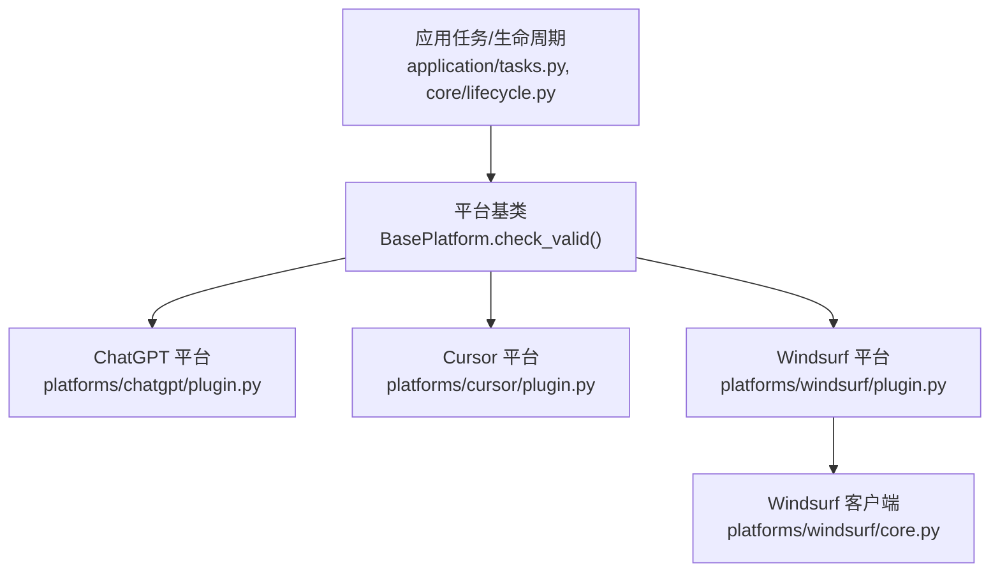
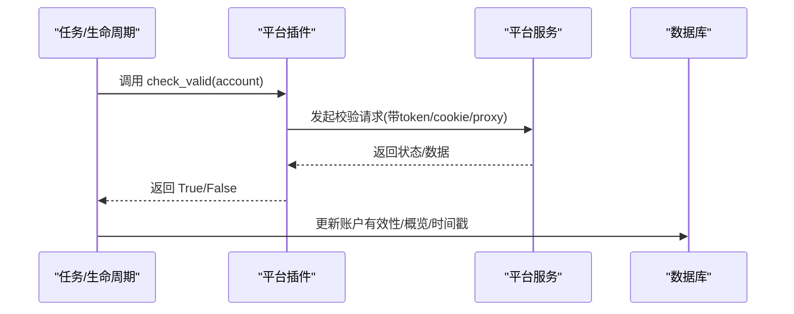
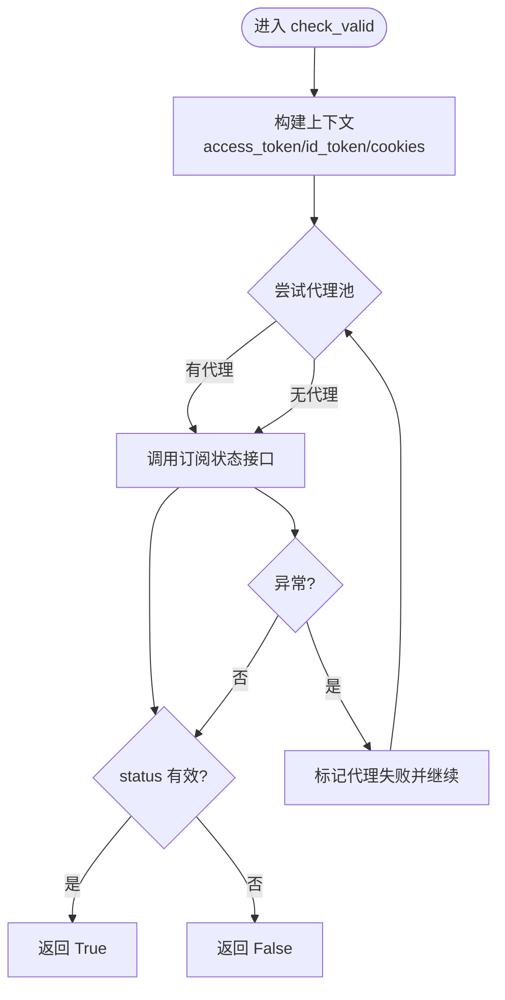
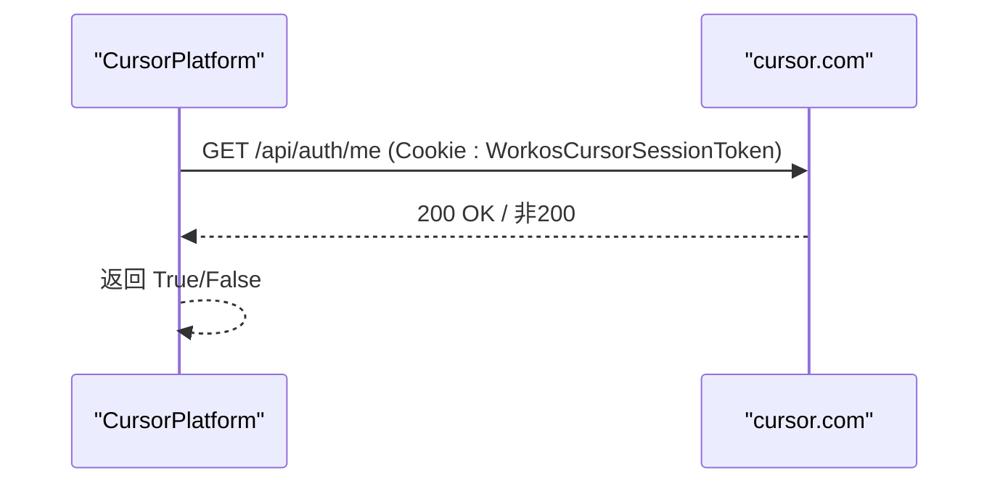
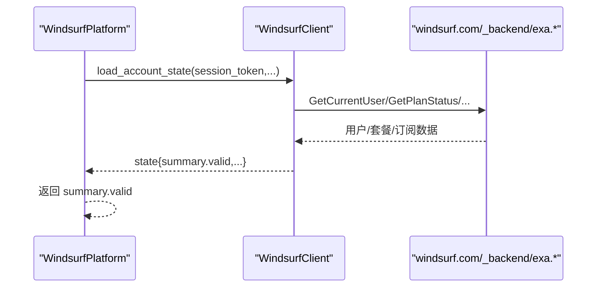
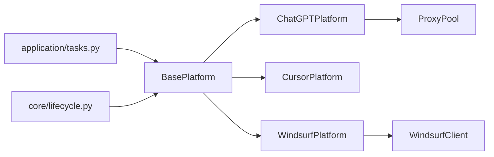

# check_valid()方法实现

<cite>
**本文引用的文件**
- [core/base_platform.py](file://core/base_platform.py)
- [platforms/chatgpt/plugin.py](file://platforms/chatgpt/plugin.py)
- [platforms/cursor/plugin.py](file://platforms/cursor/plugin.py)
- [platforms/windsurf/plugin.py](file://platforms/windsurf/plugin.py)
- [platforms/windsurf/core.py](file://platforms/windsurf/core.py)
- [tests/test_validity_recovery.py](file://tests/test_validity_recovery.py)
- [application/tasks.py](file://application/tasks.py)
- [core/lifecycle.py](file://core/lifecycle.py)
</cite>

## 目录
1. [简介](#简介)
2. [项目结构](#项目结构)
3. [核心组件](#核心组件)
4. [架构总览](#架构总览)
5. [详细组件分析](#详细组件分析)
6. [依赖关系分析](#依赖关系分析)
7. [性能与可靠性考虑](#性能与可靠性考虑)
8. [故障排查指南](#故障排查指南)
9. [结论](#结论)
10. [附录：单元测试编写指南](#附录单元测试编写指南)

## 简介
本指南聚焦于 BasePlatform 的抽象方法 check_valid(account: Account) -> bool 的实现规范与实践。该方法用于验证账户有效性，是各平台插件必须实现的契约。文档将说明三种主流实现策略：
- API 调用验证：直接调用平台接口检查账户状态或会话有效性
- 页面抓取验证：通过浏览器自动化登录并检查页面元素
- 状态检查：基于 token/session 校验账户是否仍有效

同时提供 ChatGPT、Cursor、Windsurf 三个平台的现有实现示例路径，并给出错误处理最佳实践（网络超时、重试机制、异常捕获、日志记录）以及单元测试编写指南。

## 项目结构
check_valid() 位于平台插件层，由生命周期/任务调度层统一调用，最终落库更新账号有效性状态。

图表来源
- [application/tasks.py:535-562](file://application/tasks.py#L535-L562)
- [core/lifecycle.py:37-70](file://core/lifecycle.py#L37-L70)
- [core/base_platform.py:162-165](file://core/base_platform.py#L162-L165)
- [platforms/chatgpt/plugin.py:72-117](file://platforms/chatgpt/plugin.py#L72-L117)
- [platforms/cursor/plugin.py:116-127](file://platforms/cursor/plugin.py#L116-L127)
- [platforms/windsurf/plugin.py:159-168](file://platforms/windsurf/plugin.py#L159-L168)
- [platforms/windsurf/core.py:634-666](file://platforms/windsurf/core.py#L634-L666)

章节来源
- [core/base_platform.py:162-165](file://core/base_platform.py#L162-L165)
- [application/tasks.py:535-562](file://application/tasks.py#L535-L562)
- [core/lifecycle.py:37-70](file://core/lifecycle.py#L37-L70)

## 核心组件
- BasePlatform.check_valid(account: Account) -> bool
  - 定义在基类的抽象方法，要求子类必须实现
  - 返回值必须是布尔值：True 表示账户有效，False 表示无效
  - 建议内部保存最近一次检查概览（如 plan/state/usage），便于上层查询和展示

- 平台插件
  - ChatGPTPlatform.check_valid：通过订阅状态 API 验证，结合代理池重试
  - CursorPlatform.check_valid：通过 /api/auth/me 接口验证会话
  - WindsurfPlatform.check_valid：通过协议接口获取当前用户与套餐状态，汇总为 valid

章节来源
- [core/base_platform.py:162-165](file://core/base_platform.py#L162-L165)
- [platforms/chatgpt/plugin.py:72-117](file://platforms/chatgpt/plugin.py#L72-L117)
- [platforms/cursor/plugin.py:116-127](file://platforms/cursor/plugin.py#L116-L127)
- [platforms/windsurf/plugin.py:159-168](file://platforms/windsurf/plugin.py#L159-L168)

## 架构总览
check_valid 的执行链路如下：
- 上层任务/调度器遍历活跃账户，构造平台实例并调用 check_valid
- 平台实现根据各自策略进行远程校验（API/页面/状态）
- 返回布尔结果后，上层写入数据库的生命周期与有效性状态，并可附带最近一次检查概览

图表来源
- [application/tasks.py:535-562](file://application/tasks.py#L535-L562)
- [core/lifecycle.py:37-70](file://core/lifecycle.py#L37-L70)
- [platforms/chatgpt/plugin.py:72-117](file://platforms/chatgpt/plugin.py#L72-L117)
- [platforms/cursor/plugin.py:116-127](file://platforms/cursor/plugin.py#L116-L127)
- [platforms/windsurf/plugin.py:159-168](file://platforms/windsurf/plugin.py#L159-L168)

## 详细组件分析

### ChatGPT 平台：API 调用验证 + 代理池重试
- 策略
  - 从 account.extra 中读取 access_token/id_token/cookies 等凭据
  - 优先使用代理池中的代理访问订阅状态接口，失败时回退直连
  - 根据返回的 status 判断是否有效（排除 expired/invalid/banned/null）
  - 缓存最近一次检查概览（plan/source/usage）

- 关键流程

图表来源
- [platforms/chatgpt/plugin.py:72-117](file://platforms/chatgpt/plugin.py#L72-L117)

- 错误处理要点
  - 网络异常/超时：捕获异常并记录日志，必要时标记代理失败
  - 代理失败自动回退：先尝试代理，再尝试直连
  - 返回值严格为布尔值

章节来源
- [platforms/chatgpt/plugin.py:72-117](file://platforms/chatgpt/plugin.py#L72-L117)
- [tests/test_validity_recovery.py:125-165](file://tests/test_validity_recovery.py#L125-L165)

### Cursor 平台：API 调用验证（会话 Cookie）
- 策略
  - 使用 WorkosCursorSessionToken 作为 Cookie 访问 /api/auth/me
  - 若 HTTP 200 则视为有效，否则无效
  - 设置合理的超时时间，避免阻塞

- 关键流程

图表来源
- [platforms/cursor/plugin.py:116-127](file://platforms/cursor/plugin.py#L116-L127)

- 错误处理要点
  - 捕获所有异常，确保返回 False
  - 设置超时，防止长时间挂起

章节来源
- [platforms/cursor/plugin.py:116-127](file://platforms/cursor/plugin.py#L116-L127)

### Windsurf 平台：状态检查（协议接口 + 摘要）
- 策略
  - 通过 session_token/auth_token/account_id/org_id 调用后端协议接口
  - 获取当前用户、套餐状态、Stripe 订阅信息，组装为 account_overview
  - 以 summary.valid 作为最终有效性判断依据

- 关键流程

图表来源
- [platforms/windsurf/plugin.py:159-168](file://platforms/windsurf/plugin.py#L159-L168)
- [platforms/windsurf/core.py:634-666](file://platforms/windsurf/core.py#L634-L666)

- 错误处理要点
  - 任何异常均返回 False，并清空上次概览
  - 对 Stripe 订阅查询做容错，不影响整体有效性判断

章节来源
- [platforms/windsurf/plugin.py:159-168](file://platforms/windsurf/plugin.py#L159-L168)
- [platforms/windsurf/core.py:634-666](file://platforms/windsurf/core.py#L634-L666)

### 页面抓取验证（通用模式）
当平台未提供稳定 API 时，可采用浏览器自动化登录并检查页面元素（例如“欢迎页”、“仪表盘”是否存在）。该模式适用于需要模拟真实用户交互的场景。注意：
- 需配置验证码解决器（Turnstile/CAPTCHA）
- 控制超时与重试次数
- 解析页面元素或跳转 URL 判定成功
- 捕获异常并返回 False

（本节为通用模式说明，不直接对应具体文件）

## 依赖关系分析
- BasePlatform 提供抽象契约与能力框架
- 平台插件实现具体 check_valid 逻辑
- 上层任务/生命周期负责调度与持久化
- 外部依赖包括：HTTP 客户端、代理池、平台服务端点

图表来源
- [core/base_platform.py:162-165](file://core/base_platform.py#L162-L165)
- [platforms/chatgpt/plugin.py:72-117](file://platforms/chatgpt/plugin.py#L72-L117)
- [platforms/cursor/plugin.py:116-127](file://platforms/cursor/plugin.py#L116-L127)
- [platforms/windsurf/plugin.py:159-168](file://platforms/windsurf/plugin.py#L159-L168)
- [platforms/windsurf/core.py:634-666](file://platforms/windsurf/core.py#L634-L666)
- [application/tasks.py:535-562](file://application/tasks.py#L535-L562)
- [core/lifecycle.py:37-70](file://core/lifecycle.py#L37-L70)

章节来源
- [core/base_platform.py:162-165](file://core/base_platform.py#L162-L165)
- [application/tasks.py:535-562](file://application/tasks.py#L535-L562)
- [core/lifecycle.py:37-70](file://core/lifecycle.py#L37-L70)

## 性能与可靠性考虑
- 超时控制
  - 为每次网络请求设置合理超时（如 15-30 秒），避免线程阻塞
  - 参考：Cursor 的 timeout=15；Windsurf 的 _json_post/_proto_post 使用 timeout=30

- 重试机制
  - 对临时性错误（如 429/5xx）可实施有限次重试
  - ChatGPT 使用代理池，失败时回退直连，提升成功率

- 异常捕获
  - 所有外部调用包裹 try/except，确保返回布尔值
  - 记录异常原因以便排查

- 日志记录
  - 使用平台实例的 log 方法输出关键步骤
  - 记录代理选择、失败原因、返回状态

- 资源复用
  - 复用 HTTP Session/连接，减少握手开销
  - 避免重复登录，尽量使用 token/session

[本节为通用指导，不直接引用具体文件]

## 故障排查指南
- 常见问题
  - Token 过期：重新刷新或重新登录获取新 token
  - 代理不可用：切换代理或禁用代理直连
  - 验证码失败：检查验证码 provider 配置与可用性
  - 网络超时：增加超时或降低并发

- 定位方法
  - 查看 get_last_check_overview 返回的概览信息
  - 检查任务日志与平台日志
  - 使用测试用例模拟外部依赖，快速复现问题

章节来源
- [platforms/chatgpt/plugin.py:119-120](file://platforms/chatgpt/plugin.py#L119-L120)
- [platforms/windsurf/plugin.py:170-171](file://platforms/windsurf/plugin.py#L170-L171)
- [tests/test_validity_recovery.py:125-165](file://tests/test_validity_recovery.py#L125-L165)

## 结论
check_valid() 是平台插件的核心契约，必须返回布尔值以表达账户有效性。不同平台可根据自身特性选择合适的验证策略：API 调用、页面抓取或状态检查。实现时应重视超时、重试、异常捕获与日志记录，并通过单元测试覆盖边界情况，确保稳定性与可维护性。

[本节为总结，不直接引用具体文件]

## 附录：单元测试编写指南
- 目标
  - 验证 check_valid 在不同场景下的行为（有效、无效、异常）
  - 模拟外部依赖（HTTP 客户端、代理池、平台 API）
  - 覆盖边界情况（空 token、网络超时、代理失败）

- 推荐做法
  - 使用 monkeypatch 替换外部模块或函数
  - 构造最小化的 Account 对象，仅包含必要字段
  - 断言返回值与副作用（如代理池统计、概览缓存）

- 示例参考
  - 始终有效/无效的平台桩：见测试文件中的 _AlwaysValidPlatform/_AlwaysInvalidPlatform
  - 代理池行为验证：见 test_chatgpt_check_valid_uses_proxy_pool_before_direct
  - 订阅状态回退逻辑：见 test_chatgpt_subscription_status_falls_back_to_wham_usage

章节来源
- [tests/test_validity_recovery.py:17-31](file://tests/test_validity_recovery.py#L17-L31)
- [tests/test_validity_recovery.py:85-123](file://tests/test_validity_recovery.py#L85-L123)
- [tests/test_validity_recovery.py:125-165](file://tests/test_validity_recovery.py#L125-L165)