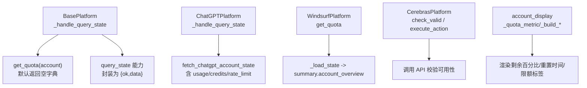
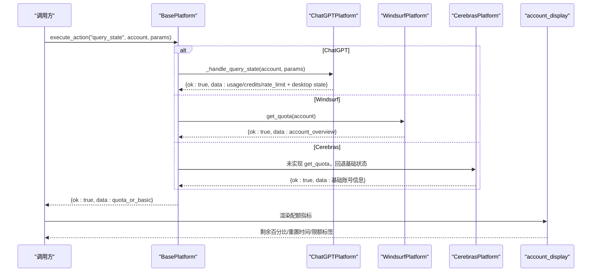
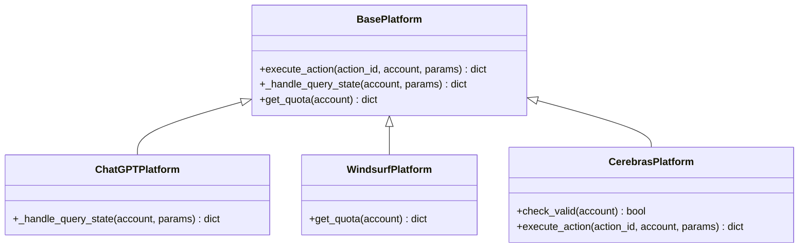
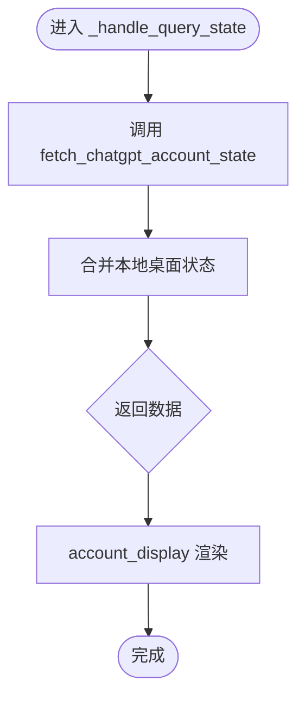
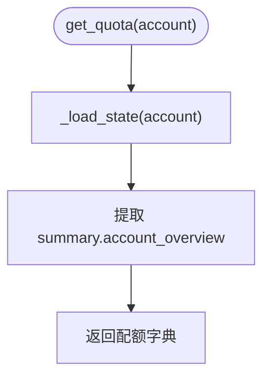
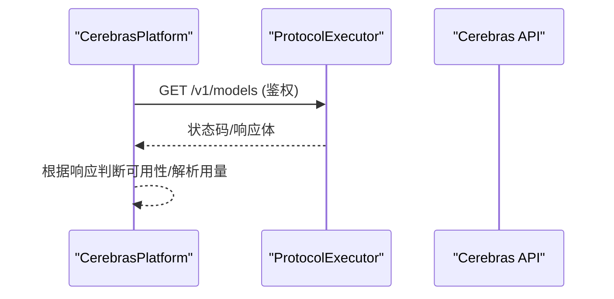
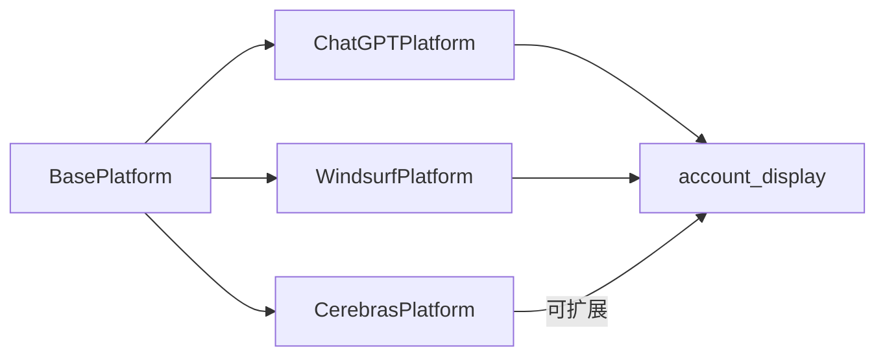

# get_quota()方法实现

<cite>
**本文引用的文件**
- [core/base_platform.py](file://core/base_platform.py)
- [platforms/chatgpt/plugin.py](file://platforms/chatgpt/plugin.py)
- [platforms/windsurf/plugin.py](file://platforms/windsurf/plugin.py)
- [platforms/cerebras/plugin.py](file://platforms/cerebras/plugin.py)
- [platforms/cerebras/core.py](file://platforms/cerebras/core.py)
- [core/account_display.py](file://core/account_display.py)
- [tests/test_api_platforms.py](file://tests/test_api_platforms.py)
</cite>

## 目录
1. [简介](#简介)
2. [项目结构](#项目结构)
3. [核心组件](#核心组件)
4. [架构总览](#架构总览)
5. [详细组件分析](#详细组件分析)
6. [依赖关系分析](#依赖关系分析)
7. [性能考虑](#性能考虑)
8. [故障排查指南](#故障排查指南)
9. [结论](#结论)
10. [附录](#附录)

## 简介
本指南围绕可选的 get_quota(account) -> dict 方法，提供统一的配额查询实现规范与落地示例。该方法用于查询账户配额信息，返回标准化的配额数据字典，便于上层统一展示、统计与告警。文档涵盖：
- 标准数据结构定义（剩余配额、已使用、重置时间、类型等）
- ChatGPT、Cerebras、Windsurf 等平台的具体实现思路与调用路径
- 错误处理策略（网络异常、权限不足、配额不可用等）
- 性能优化建议（缓存、批量、异步）
- 数据验证与格式化规范
- 单元测试示例（覆盖正常与异常场景）

## 项目结构
get_quota() 位于平台抽象层 BasePlatform 中作为可选能力，具体平台通过覆写或借助 query_state 能力来暴露配额信息。关键位置如下：
- 基类默认实现与能力路由：core/base_platform.py
- ChatGPT 平台能力与状态查询：platforms/chatgpt/plugin.py
- Windsurf 平台配额来源与映射：platforms/windsurf/plugin.py
- Cerebras 平台校验与动作：platforms/cerebras/plugin.py, core.py
- 前端/展示层对配额数据的消费：core/account_display.py
- 平台列表测试用例：tests/test_api_platforms.py

图表来源
- [core/base_platform.py:203-249](file://core/base_platform.py#L203-L249)
- [platforms/chatgpt/plugin.py:338-359](file://platforms/chatgpt/plugin.py#L338-L359)
- [platforms/windsurf/plugin.py:382-384](file://platforms/windsurf/plugin.py#L382-L384)
- [platforms/cerebras/plugin.py:54-89](file://platforms/cerebras/plugin.py#L54-L89)
- [core/account_display.py:83-127](file://core/account_display.py#L83-L127)

章节来源
- [core/base_platform.py:203-249](file://core/base_platform.py#L203-L249)
- [platforms/chatgpt/plugin.py:338-359](file://platforms/chatgpt/plugin.py#L338-L359)
- [platforms/windsurf/plugin.py:382-384](file://platforms/windsurf/plugin.py#L382-L384)
- [platforms/cerebras/plugin.py:54-89](file://platforms/cerebras/plugin.py#L54-L89)
- [core/account_display.py:83-127](file://core/account_display.py#L83-L127)

## 核心组件
- BasePlatform.get_quota(account)
  - 默认返回空字典，表示“未实现配额查询”。当 _handle_query_state 收到非空结果时，将其作为 data 返回；否则回退到基础账号信息。
- 能力路由 _handle_query_state
  - 统一将配额查询包装为 {"ok": True, "data": ...} 的结构，便于上层一致处理。
- 平台实现
  - ChatGPT：通过 _handle_query_state 调用内部接口获取 usage/credits/rate_limit 等，并附加本地桌面应用状态。
  - Windsurf：get_quota 直接返回 account_overview 摘要，包含配额百分比等信息。
  - Cerebras：当前未实现 get_quota，但可通过 check_valid/execute_action 进行可用性探测；如需配额，可复用其协议执行器访问计费/用量接口。

章节来源
- [core/base_platform.py:312-314](file://core/base_platform.py#L312-L314)
- [core/base_platform.py:236-249](file://core/base_platform.py#L236-L249)
- [platforms/chatgpt/plugin.py:338-359](file://platforms/chatgpt/plugin.py#L338-L359)
- [platforms/windsurf/plugin.py:382-384](file://platforms/windsurf/plugin.py#L382-L384)
- [platforms/cerebras/plugin.py:54-89](file://platforms/cerebras/plugin.py#L54-L89)

## 架构总览
下图展示了从调用方到平台实现的完整链路，以及配额数据如何被消费和展示。

图表来源
- [core/base_platform.py:203-249](file://core/base_platform.py#L203-L249)
- [platforms/chatgpt/plugin.py:338-359](file://platforms/chatgpt/plugin.py#L338-L359)
- [platforms/windsurf/plugin.py:382-384](file://platforms/windsurf/plugin.py#L382-L384)
- [core/account_display.py:83-127](file://core/account_display.py#L83-L127)

## 详细组件分析

### 基类：BasePlatform 与 get_quota
- 默认行为
  - get_quota 默认返回空字典，表示平台未提供配额能力。
  - _handle_query_state 会优先尝试 get_quota，若为空则返回基础账号信息。
- 扩展点
  - 子类可覆写 get_quota 以提供平台特定配额数据。
  - 也可覆写 _handle_query_state 以自定义查询流程。

图表来源
- [core/base_platform.py:192-249](file://core/base_platform.py#L192-L249)
- [core/base_platform.py:312-314](file://core/base_platform.py#L312-L314)
- [platforms/chatgpt/plugin.py:338-359](file://platforms/chatgpt/plugin.py#L338-L359)
- [platforms/windsurf/plugin.py:382-384](file://platforms/windsurf/plugin.py#L382-L384)
- [platforms/cerebras/plugin.py:54-89](file://platforms/cerebras/plugin.py#L54-L89)

章节来源
- [core/base_platform.py:192-249](file://core/base_platform.py#L192-L249)
- [core/base_platform.py:312-314](file://core/base_platform.py#L312-L314)

### ChatGPT 平台：配额数据来源与结构
- 入口
  - 覆写 _handle_query_state，调用内部接口获取账号状态与用量。
- 数据结构要点
  - usage.rate_limit：周限额窗口，包含 used_percent、reset_at 等字段。
  - usage.credits：余额、是否无限、近似消息数等。
  - 附加 local_app_account、desktop_app_state 等上下文。
- 展示消费
  - account_display 中的 _quota_metric 会将 rate_limit 转换为剩余百分比与重置提示。

图表来源
- [platforms/chatgpt/plugin.py:338-359](file://platforms/chatgpt/plugin.py#L338-L359)
- [core/account_display.py:83-127](file://core/account_display.py#L83-L127)

章节来源
- [platforms/chatgpt/plugin.py:338-359](file://platforms/chatgpt/plugin.py#L338-L359)
- [core/account_display.py:83-127](file://core/account_display.py#L83-L127)

### Windsurf 平台：get_quota 实现
- 入口
  - 覆写 get_quota，读取 _load_state 返回的 summary.account_overview。
- 数据结构要点
  - 包含 Prompt Credits、Flow Action Credits 等的剩余百分比与重置信息。
- 特点
  - 直接返回平台提供的 overview 摘要，适合快速展示。

图表来源
- [platforms/windsurf/plugin.py:382-384](file://platforms/windsurf/plugin.py#L382-L384)

章节来源
- [platforms/windsurf/plugin.py:382-384](file://platforms/windsurf/plugin.py#L382-L384)

### Cerebras 平台：可用性与配额扩展
- 现状
  - 未实现 get_quota；提供 check_valid 与 execute_action 用于可用性检测。
- 扩展建议
  - 在 get_quota 中复用 ProtocolExecutor 访问计费/用量接口，返回标准化配额结构。
  - 参考 core.py 中的 Stytch 认证与 API Key 流程，确保鉴权正确。

图表来源
- [platforms/cerebras/plugin.py:54-89](file://platforms/cerebras/plugin.py#L54-L89)
- [platforms/cerebras/core.py:101-154](file://platforms/cerebras/core.py#L101-L154)

章节来源
- [platforms/cerebras/plugin.py:54-89](file://platforms/cerebras/plugin.py#L54-L89)
- [platforms/cerebras/core.py:101-154](file://platforms/cerebras/core.py#L101-L154)

## 依赖关系分析
- 耦合关系
  - BasePlatform 与平台插件强耦合于能力路由；平台插件通过覆写 get_quota 或 _handle_query_state 接入。
  - account_display 依赖配额数据结构约定（如 primary_window.used_percent、reset_at）。
- 外部依赖
  - ChatGPT：内部账号状态接口、桌面应用状态读取。
  - Windsurf：网站/协议接口返回 account_overview。
  - Cerebras：Stytch 认证与 Cloud API。

图表来源
- [core/base_platform.py:203-249](file://core/base_platform.py#L203-L249)
- [core/account_display.py:83-127](file://core/account_display.py#L83-L127)

章节来源
- [core/base_platform.py:203-249](file://core/base_platform.py#L203-L249)
- [core/account_display.py:83-127](file://core/account_display.py#L83-L127)

## 性能考虑
- 缓存机制
  - 对 get_quota 结果按 account.id 做短期缓存（例如 60-120 秒），避免频繁请求平台接口。
  - 缓存失效策略：失败重试退避、平台侧变更事件触发刷新。
- 批量查询
  - 对多账号配额查询采用线程池并发（参考任务执行中的并发模式），控制最大并发度以避免限流。
- 异步处理
  - 对于耗时较长的平台接口，采用异步任务队列，前端轮询进度。
- 降级与熔断
  - 当平台接口持续失败时，降级为基础状态展示，并记录告警。

[本节为通用指导，不直接分析具体文件]

## 故障排查指南
- 网络异常
  - 现象：超时、连接失败、DNS 解析失败。
  - 处理：捕获异常，返回 {"ok": False, "error": "..."}；记录日志；触发重试与退避。
- 权限不足
  - 现象：401/403；Token 过期或缺失。
  - 处理：尝试刷新 Token（如 ChatGPT 的 refresh_token 能力），失败则提示用户重新登录。
- 配额不可用
  - 现象：平台未实现 get_quota 或接口返回空数据。
  - 处理：回退到基础状态；记录“未实现”标记；允许上层提示“该平台暂不支持配额查询”。
- 数据不一致
  - 现象：used_percent 超出范围、reset_at 缺失。
  - 处理：在 account_display 层做容错计算与默认值填充。

章节来源
- [core/base_platform.py:203-249](file://core/base_platform.py#L203-L249)
- [platforms/chatgpt/plugin.py:361-389](file://platforms/chatgpt/plugin.py#L361-L389)
- [core/account_display.py:83-127](file://core/account_display.py#L83-L127)

## 结论
get_quota() 是平台配额能力的统一入口。通过基类默认实现与平台覆写，既能保证一致性，又能灵活适配不同平台的配额模型。结合缓存、并发与降级策略，可在高并发与不稳定网络环境下稳定提供配额查询服务。建议在新增平台时优先实现 get_quota，并在展示层遵循统一的数据结构规范。

[本节为总结性内容，不直接分析具体文件]

## 附录

### 配额数据标准结构（建议）
- primary_window
  - used_percent: 数字，0-100，表示已用百分比
  - reset_at: 字符串或时间戳，表示重置时间
  - limit_reached: 布尔，是否达到上限
- credits
  - balance: 数字或字符串，余额
  - unlimited: 布尔，是否无限
  - approx_local_messages/approx_cloud_messages: 数字，近似消息数
- 其他
  - plan/plan_name: 套餐名称
  - check_source: 数据来源
  - local_app_account/desktop_app_state: 平台附加上下文

章节来源
- [core/account_display.py:83-127](file://core/account_display.py#L83-L127)
- [platforms/chatgpt/plugin.py:338-359](file://platforms/chatgpt/plugin.py#L338-L359)

### 单元测试示例（概念）
- 正常场景
  - 模拟 ChatGPT 返回 usage 与 credits，断言返回 ok=true 且包含必要字段。
  - 模拟 Windsurf 返回 account_overview，断言剩余百分比与重置时间存在。
- 异常场景
  - 模拟网络异常，断言返回 ok=false 且 error 非空。
  - 模拟权限不足（401），断言触发 Token 刷新或返回明确错误。
  - 模拟平台未实现 get_quota，断言回退到基础状态。
- 边界场景
  - used_percent 为 None 或非法值，断言显示层能安全降级。
  - reset_at 缺失，断言不崩溃并给出合理提示。

[本节为测试设计指导，不直接分析具体文件]

### 相关测试参考
- 平台列表与字段校验测试可作为框架参考，用于验证平台注册与能力声明的正确性。

章节来源
- [tests/test_api_platforms.py:5-25](file://tests/test_api_platforms.py#L5-L25)