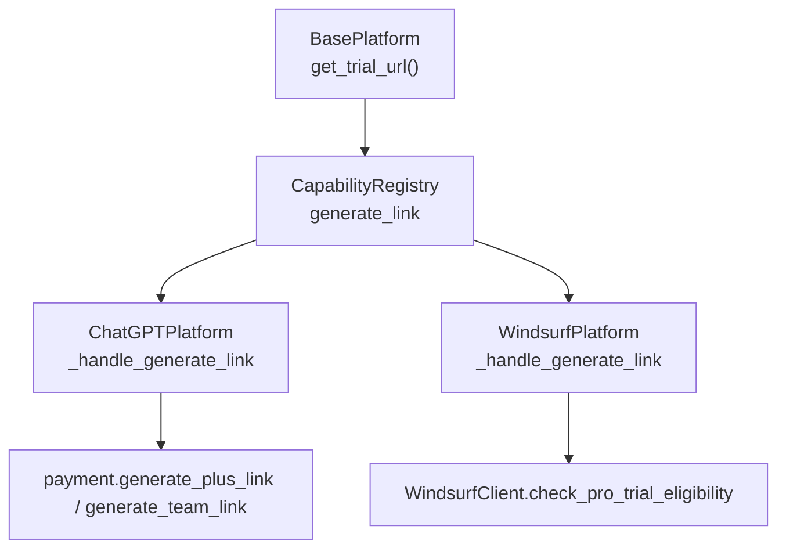
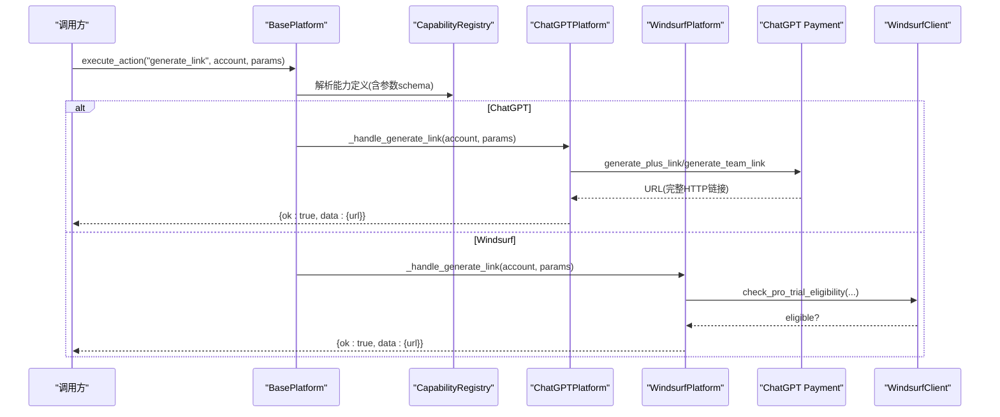
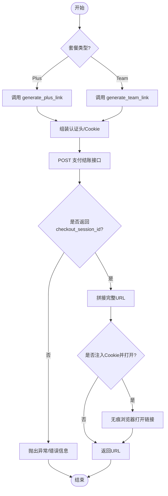
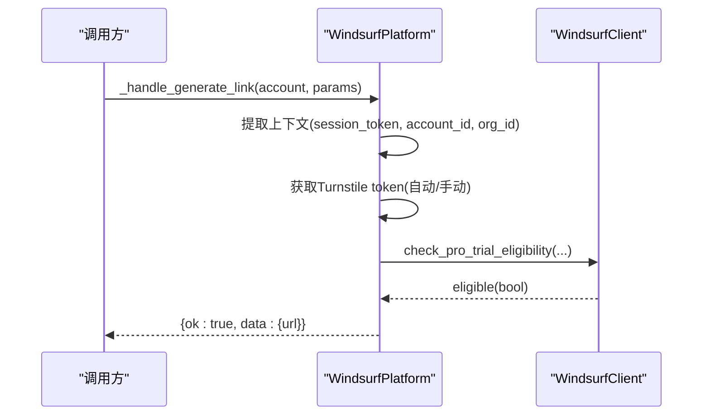
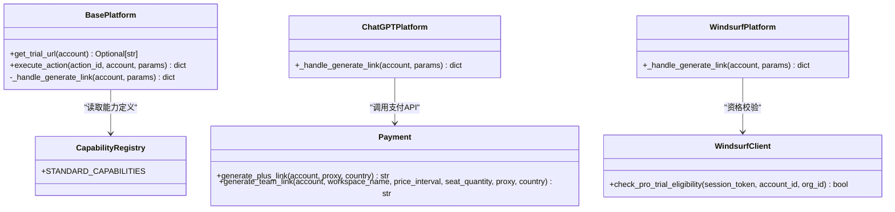

# get_trial_url()方法实现

<cite>
**本文引用的文件**
- [core/base_platform.py](file://core/base_platform.py)
- [platforms/chatgpt/plugin.py](file://platforms/chatgpt/plugin.py)
- [platforms/chatgpt/payment.py](file://platforms/chatgpt/payment.py)
- [platforms/windsurf/plugin.py](file://platforms/windsurf/plugin.py)
- [platforms/windsurf/core.py](file://platforms/windsurf/core.py)
- [core/capability_registry.py](file://core/capability_registry.py)
- [core/account_graph.py](file://core/account_graph.py)
</cite>

## 目录
1. [简介](#简介)
2. [项目结构](#项目结构)
3. [核心组件](#核心组件)
4. [架构总览](#架构总览)
5. [详细组件分析](#详细组件分析)
6. [依赖关系分析](#依赖关系分析)
7. [性能考虑](#性能考虑)
8. [故障排查指南](#故障排查指南)
9. [结论](#结论)
10. [附录](#附录)

## 简介
本指南聚焦于可选方法 get_trial_url(account: Account) -> Optional[str] 的实现与集成。该方法用于生成试用/支付激活链接，返回完整的 HTTP URL 字符串或 None。不同平台可采用三种策略：
- API 方式生成：通过平台后端 API 获取预生成的试用/支付链接（如 ChatGPT 的 checkout session）。
- 动态生成：根据账户信息实时计算链接参数（例如拼接查询参数、签名等）。
- 配置化生成：从配置文件读取模板并替换变量（适用于固定规则的平台）。

在系统中，get_trial_url 是“generate_link”能力的基础实现入口；未实现的平台会抛出异常，已实现的平台将返回有效 URL。

## 项目结构
围绕 get_trial_url 的关键位置如下：
- 基类定义与默认行为：core/base_platform.py
- 能力注册与动作映射：core/capability_registry.py
- 平台具体实现：
  - ChatGPT：platforms/chatgpt/plugin.py 与 payment 模块
  - Windsurf：platforms/windsurf/plugin.py 与 core.py
- 账号状态与展示字段：core/account_graph.py

图表来源
- [core/base_platform.py:167-169](file://core/base_platform.py#L167-L169)
- [core/capability_registry.py:46-58](file://core/capability_registry.py#L46-L58)
- [platforms/chatgpt/plugin.py:391-420](file://platforms/chatgpt/plugin.py#L391-L420)
- [platforms/chatgpt/payment.py:199-297](file://platforms/chatgpt/payment.py#L199-L297)
- [platforms/windsurf/plugin.py:277-312](file://platforms/windsurf/plugin.py#L277-L312)
- [platforms/windsurf/core.py:583-592](file://platforms/windsurf/core.py#L583-L592)

章节来源
- [core/base_platform.py:167-169](file://core/base_platform.py#L167-L169)
- [core/capability_registry.py:46-58](file://core/capability_registry.py#L46-L58)

## 核心组件
- BasePlatform.get_trial_url：默认返回 None，表示“未实现”。当能力系统调用 generate_link 时，若未覆盖则抛出异常。
- CapabilityRegistry：声明标准能力 generate_link，包含参数 schema（plan、country 等），供前端/上层编排使用。
- 平台插件：
  - ChatGPTPlatform：通过 _handle_generate_link 调用 payment 模块生成 Plus/Team 支付链接，并可自动打开无痕浏览器。
  - WindsurfPlatform：通过 _handle_generate_link 结合 Turnstile 校验与 eligibility 检查，生成试用链接。

章节来源
- [core/base_platform.py:167-169](file://core/base_platform.py#L167-L169)
- [core/base_platform.py:255-260](file://core/base_platform.py#L255-L260)
- [core/capability_registry.py:46-58](file://core/capability_registry.py#L46-L58)
- [platforms/chatgpt/plugin.py:391-420](file://platforms/chatgpt/plugin.py#L391-L420)
- [platforms/windsurf/plugin.py:277-312](file://platforms/windsurf/plugin.py#L277-L312)

## 架构总览
下图展示了“generate_link”能力到具体平台的调用链，以及 get_trial_url 在其中的角色。

图表来源
- [core/base_platform.py:192-229](file://core/base_platform.py#L192-L229)
- [core/capability_registry.py:46-58](file://core/capability_registry.py#L46-L58)
- [platforms/chatgpt/plugin.py:391-420](file://platforms/chatgpt/plugin.py#L391-L420)
- [platforms/chatgpt/payment.py:199-297](file://platforms/chatgpt/payment.py#L199-L297)
- [platforms/windsurf/plugin.py:277-312](file://platforms/windsurf/plugin.py#L277-L312)
- [platforms/windsurf/core.py:583-592](file://platforms/windsurf/core.py#L583-L592)

## 详细组件分析

### 基类与能力路由
- BasePlatform.get_trial_url：默认返回 None，作为“可选实现”的占位。
- BasePlatform._handle_generate_link：若 get_trial_url 返回非空 URL，则封装为统一响应格式；否则抛出异常提示未实现。
- CapabilityRegistry 定义了 generate_link 的参数 schema（plan、country 等），便于 UI 渲染与校验。

章节来源
- [core/base_platform.py:167-169](file://core/base_platform.py#L167-L169)
- [core/base_platform.py:255-260](file://core/base_platform.py#L255-L260)
- [core/capability_registry.py:46-58](file://core/capability_registry.py#L46-L58)

### ChatGPT 平台实现（API 方式）
- 入口：ChatGPTPlatform._handle_generate_link
- 逻辑要点：
  - 根据 plan 选择 generate_plus_link 或 generate_team_link。
  - 构造必要请求头（Authorization、Cookie、oai-device-id 等）。
  - 调用后端 checkout 接口获取 checkout_session_id，拼接成完整支付链接。
  - 可选：使用本地指纹浏览器无痕模式打开链接并注入 Cookie。
- 返回值：URL 字符串（完整 HTTP 链接），由上层封装为 {ok, data:{url}}。

图表来源
- [platforms/chatgpt/plugin.py:391-420](file://platforms/chatgpt/plugin.py#L391-L420)
- [platforms/chatgpt/payment.py:199-297](file://platforms/chatgpt/payment.py#L199-L297)

章节来源
- [platforms/chatgpt/plugin.py:391-420](file://platforms/chatgpt/plugin.py#L391-L420)
- [platforms/chatgpt/payment.py:199-297](file://platforms/chatgpt/payment.py#L199-L297)

### Windsurf 平台实现（资格校验 + 动态生成）
- 入口：WindsurfPlatform._handle_generate_link
- 逻辑要点：
  - 提取账户上下文（session_token、account_id、org_id）。
  - 需要 Turnstile token：可自动求解或要求传入。
  - 调用 WindsurfClient.check_pro_trial_eligibility 判断试用资格。
  - 基于资格结果与上下文生成试用链接（具体拼接逻辑在客户端内部）。
- 返回值：URL 字符串（完整 HTTP 链接），由上层封装为 {ok, data:{url}}。

图表来源
- [platforms/windsurf/plugin.py:277-312](file://platforms/windsurf/plugin.py#L277-L312)
- [platforms/windsurf/core.py:583-592](file://platforms/windsurf/core.py#L583-L592)

章节来源
- [platforms/windsurf/plugin.py:277-312](file://platforms/windsurf/plugin.py#L277-L312)
- [platforms/windsurf/core.py:583-592](file://platforms/windsurf/core.py#L583-L592)

### 数据模型与状态字段
- Account 对象包含 trial_end_time、extra 等字段，用于承载试用相关元数据。
- 概览摘要中会标准化 trial_end_time、cashier_url、region 等字段，便于展示与决策。

章节来源
- [core/base_platform.py:21-33](file://core/base_platform.py#L21-L33)
- [core/account_graph.py:254-275](file://core/account_graph.py#L254-L275)

## 依赖关系分析
- BasePlatform 依赖 CapabilityRegistry 提供标准能力定义与参数 schema。
- ChatGPTPlatform 依赖 payment 模块进行后端 API 调用与浏览器打开。
- WindsurfPlatform 依赖 core 中的客户端进行资格校验。
- 所有平台均通过统一的 execute_action/_handle_capability 路由进入。

图表来源
- [core/base_platform.py:192-229](file://core/base_platform.py#L192-L229)
- [core/capability_registry.py:46-58](file://core/capability_registry.py#L46-L58)
- [platforms/chatgpt/payment.py:199-297](file://platforms/chatgpt/payment.py#L199-L297)
- [platforms/windsurf/core.py:583-592](file://platforms/windsurf/core.py#L583-L592)

章节来源
- [core/base_platform.py:192-229](file://core/base_platform.py#L192-L229)
- [core/capability_registry.py:46-58](file://core/capability_registry.py#L46-L58)
- [platforms/chatgpt/payment.py:199-297](file://platforms/chatgpt/payment.py#L199-L297)
- [platforms/windsurf/core.py:583-592](file://platforms/windsurf/core.py#L583-L592)

## 性能考虑
- 网络超时与重试：支付/资格校验接口应设置合理超时，并在失败时快速回退或提示。
- 浏览器打开开销：ChatGPT 的无痕浏览器打开为异步线程，避免阻塞主流程。
- 代理与地区：country 影响货币与结算页体验，需按业务策略选择。
- Token 有效性：确保 access_token/session_token 有效，减少无效请求。

[本节为通用指导，不直接分析具体文件]

## 故障排查指南
- 未实现异常：若平台未实现 get_trial_url 或未覆盖 _handle_generate_link，将抛出“未实现”异常。请确认平台已正确覆盖。
- 缺少凭据：ChatGPT 需要 access_token 与 cookies；Windsurf 需要 session_token 与 Turnstile token。缺失将导致失败。
- 参数错误：plan、country 等参数需符合平台期望；非法值可能导致接口报错。
- 浏览器打开失败：Playwright 未安装或系统浏览器不可用时会回退；检查依赖与环境。
- 资格校验失败：Windsurf 的 eligibility 检查失败不影响继续生成链接，但可能无法获得试用权限。

章节来源
- [core/base_platform.py:255-260](file://core/base_platform.py#L255-L260)
- [platforms/chatgpt/payment.py:199-297](file://platforms/chatgpt/payment.py#L199-L297)
- [platforms/windsurf/plugin.py:277-312](file://platforms/windsurf/plugin.py#L277-L312)

## 结论
get_trial_url 是平台试用/支付链接生成的核心扩展点。推荐优先采用“API 方式”以获得稳定可靠的链接；对于需要强校验的平台（如 Windsurf），结合资格检查与动态参数生成。无论何种策略，都应保证：
- 返回完整 HTTP URL，包含必要的查询参数与认证信息。
- 做好安全控制：防泄露、过期时间、访问次数限制（由平台侧保障）。
- 提供清晰的错误信息与回退路径，便于运维与用户操作。

[本节为总结性内容，不直接分析具体文件]

## 附录

### 返回值规范
- 成功：返回完整 HTTP URL 字符串（包含域名、路径、查询参数及必要认证信息）。
- 失败：返回 None 或在能力层抛出异常，由上层统一处理。

章节来源
- [core/base_platform.py:167-169](file://core/base_platform.py#L167-L169)
- [core/base_platform.py:255-260](file://core/base_platform.py#L255-L260)

### 安全考虑
- 链接泄露防护：避免在日志中打印完整 URL；对敏感参数进行脱敏。
- 过期时间：尽量使用一次性或短时效的 checkout session；服务端应支持失效机制。
- 访问次数限制：平台侧应对同一会话/账号的链接生成频率进行限流。
- 认证绑定：链接应与特定账号/会话绑定，防止被他人复用。

[本节为通用指导，不直接分析具体文件]

### 测试用例设计模式
- 正常场景
  - ChatGPT Plus：传入合法 access_token、cookies，验证返回有效 Plus 支付链接。
  - ChatGPT Team：传入团队参数与地区，验证返回有效 Team 支付链接。
  - Windsurf：提供 session_token 与 Turnstile token，验证返回试用链接且资格校验通过。
- 异常场景
  - 缺少凭据：无 access_token 或 session_token，预期失败并返回明确错误。
  - 非法参数：plan/country 不符合预期，预期失败。
  - 网络异常：模拟超时或 5xx，验证回退与错误提示。
  - 浏览器打开失败：未安装 Playwright，验证回退到系统浏览器或给出提示。

[本节为通用指导，不直接分析具体文件]