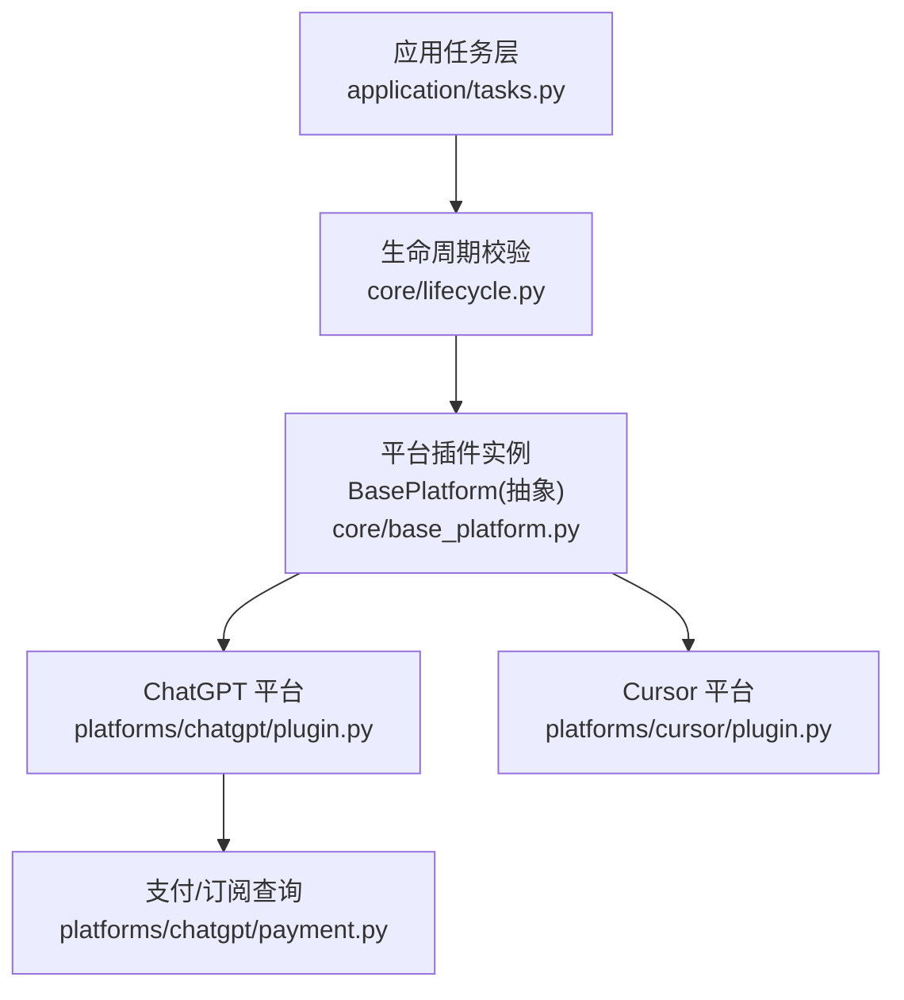
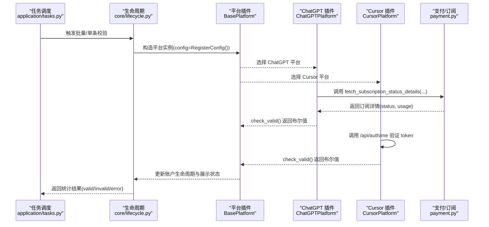
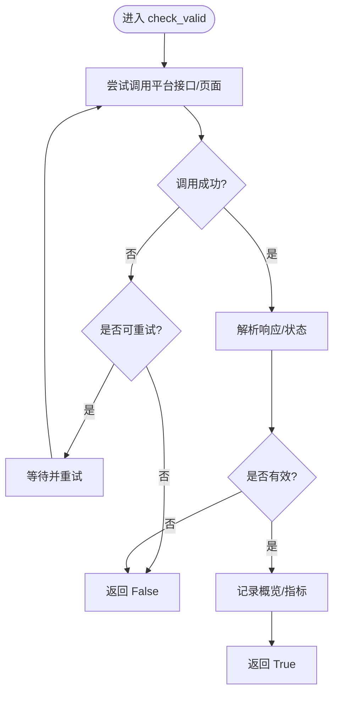
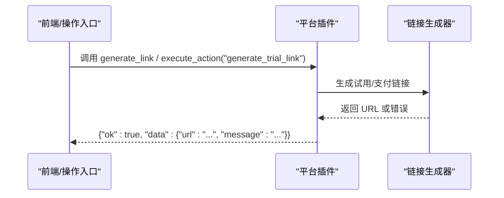
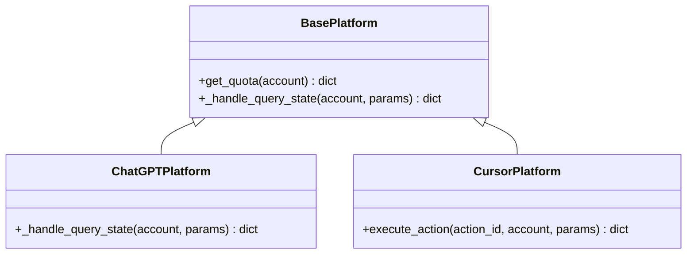
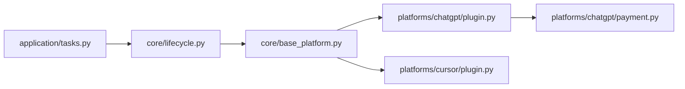

# 抽象方法实现指南

<cite>
**本文引用的文件**
- [core/base_platform.py](file://core/base_platform.py)
- [platforms/chatgpt/plugin.py](file://platforms/chatgpt/plugin.py)
- [platforms/cursor/plugin.py](file://platforms/cursor/plugin.py)
- [application/tasks.py](file://application/tasks.py)
- [core/lifecycle.py](file://core/lifecycle.py)
- [tests/test_validity_recovery.py](file://tests/test_validity_recovery.py)
- [platforms/chatgpt/payment.py](file://platforms/chatgpt/payment.py)
</cite>

## 目录
1. [简介](#简介)
2. [项目结构](#项目结构)
3. [核心组件](#核心组件)
4. [架构总览](#架构总览)
5. [详细组件分析](#详细组件分析)
6. [依赖关系分析](#依赖关系分析)
7. [性能与健壮性建议](#性能与健壮性建议)
8. [故障排查指南](#故障排查指南)
9. [结论](#结论)
10. [附录：单元测试编写指南](#附录单元测试编写指南)

## 简介
本指南面向平台插件开发者，聚焦于抽象基类中必须实现的 check_valid() 方法，以及可选的 get_trial_url()、get_quota() 方法的实现模式与最佳实践。文档基于现有代码库中的 ChatGPT、Cursor 等平台实现，总结账户有效性验证的核心作用、多种实现策略（API 调用、页面抓取、状态检查）、错误处理、超时控制、重试机制，并提供可复用的测试用例设计模式。

## 项目结构
- 平台抽象基类位于 core/base_platform.py，定义了所有平台插件必须遵循的接口契约，包括 check_valid()、get_trial_url()、get_quota() 等。
- 具体平台插件位于 platforms/<平台>/plugin.py，例如 ChatGPTPlatform、CursorPlatform，分别实现了各自平台的验证逻辑。
- 任务调度与生命周期校验位于 application/tasks.py、core/lifecycle.py，负责批量/单条账号有效性检测并更新数据库状态。
- 测试覆盖在 tests/test_validity_recovery.py，提供最小化 mock 和断言示例。

**图表来源**
- [application/tasks.py:535-560](file://application/tasks.py#L535-L560)
- [core/lifecycle.py:46-70](file://core/lifecycle.py#L46-L70)
- [core/base_platform.py:162-169](file://core/base_platform.py#L162-L169)
- [platforms/chatgpt/plugin.py:72-117](file://platforms/chatgpt/plugin.py#L72-L117)
- [platforms/cursor/plugin.py:116-127](file://platforms/cursor/plugin.py#L116-L127)
- [platforms/chatgpt/payment.py:118-141](file://platforms/chatgpt/payment.py#L118-L141)

**章节来源**
- [core/base_platform.py:44-169](file://core/base_platform.py#L44-L169)
- [application/tasks.py:535-560](file://application/tasks.py#L535-L560)
- [core/lifecycle.py:46-70](file://core/lifecycle.py#L46-L70)

## 核心组件
- BasePlatform：定义平台插件的统一接口，包含必须实现的 check_valid() 与可选的 get_trial_url()、get_quota()。
- Account 与 AccountStatus：描述账号数据模型与状态枚举，用于跨平台统一表示。
- 平台插件：如 ChatGPTPlatform、CursorPlatform，实现各自的 check_valid() 以对接外部服务或本地状态。

关键要点
- check_valid(account) -> bool：必须实现，返回 True 表示账户有效，False 表示无效。
- get_trial_url(account) -> Optional[str]：可选实现，返回试用激活链接字符串或 None。
- get_quota(account) -> dict：可选实现，返回配额信息字典；若未实现，默认查询状态会回退到基础信息。

**章节来源**
- [core/base_platform.py:21-33](file://core/base_platform.py#L21-L33)
- [core/base_platform.py:162-169](file://core/base_platform.py#L162-L169)
- [core/base_platform.py:312-314](file://core/base_platform.py#L312-L314)

## 架构总览
下图展示了从任务触发到平台插件执行 check_valid() 的完整流程，以及结果如何影响账户生命周期与展示状态。

**图表来源**
- [application/tasks.py:535-560](file://application/tasks.py#L535-L560)
- [core/lifecycle.py:46-70](file://core/lifecycle.py#L46-L70)
- [platforms/chatgpt/plugin.py:72-117](file://platforms/chatgpt/plugin.py#L72-L117)
- [platforms/cursor/plugin.py:116-127](file://platforms/cursor/plugin.py#L116-L127)
- [platforms/chatgpt/payment.py:118-141](file://platforms/chatgpt/payment.py#L118-L141)

## 详细组件分析

### check_valid() 必需方法实现要求与最佳实践
- 职责：验证账户是否仍然可用（登录态有效、订阅未过期、未被封禁等）。
- 返回值：True 表示有效，False 表示无效。
- 常见策略：
  - API 调用验证：通过平台提供的认证/状态接口判断有效性。
  - 页面抓取验证：通过浏览器或 HTTP 请求解析页面内容判断状态。
  - 状态检查：结合本地缓存或桌面应用状态进行判定。
- 健壮性考虑：
  - 异常捕获：外层 try/except 确保网络异常时返回 False，避免任务崩溃。
  - 超时控制：为 HTTP 请求设置合理 timeout，防止阻塞。
  - 重试机制：对临时失败进行有限次重试（指数退避），提高成功率。
  - 代理池：优先使用代理池获取代理，失败后回退直连，并记录成功/失败事件。
  - 日志与概览：记录最后一次检查概览（如 plan、usage），便于前端展示与诊断。

参考实现
- ChatGPTPlatform.check_valid()：调用 payment.fetch_subscription_status_details()，根据 status 判断是否有效，同时记录 chatgpt_usage 等概览信息，并使用代理池。
- CursorPlatform.check_valid()：直接 GET /api/auth/me，依据 HTTP 状态码判断有效性。

**图表来源**
- [platforms/chatgpt/plugin.py:72-117](file://platforms/chatgpt/plugin.py#L72-L117)
- [platforms/cursor/plugin.py:116-127](file://platforms/cursor/plugin.py#L116-L127)
- [platforms/chatgpt/payment.py:118-141](file://platforms/chatgpt/payment.py#L118-L141)

**章节来源**
- [platforms/chatgpt/plugin.py:72-117](file://platforms/chatgpt/plugin.py#L72-L117)
- [platforms/cursor/plugin.py:116-127](file://platforms/cursor/plugin.py#L116-L127)
- [platforms/chatgpt/payment.py:118-141](file://platforms/chatgpt/payment.py#L118-L141)

### get_trial_url() 可选方法：返回值格式与使用场景
- 返回值：Optional[str]，即字符串 URL 或 None。
- 使用场景：生成试用激活链接（如 7 天 Pro 试用），供用户打开并完成试用开通。
- 默认行为：BasePlatform.get_trial_url() 返回 None；若未实现，能力处理器 _handle_generate_link() 将抛出 NotImplementedError。
- 平台示例：
  - CursorPlatform.execute_action("generate_trial_link")：生成 Checkout 链接并返回 url、billing_info、trial_eligible 等信息。
  - ChatGPTPlatform._handle_generate_link()：根据 plan/country 生成 Plus/Team 支付链接，并在本地浏览器无痕打开。

**图表来源**
- [core/base_platform.py:255-260](file://core/base_platform.py#L255-L260)
- [platforms/cursor/plugin.py:236-262](file://platforms/cursor/plugin.py#L236-L262)
- [platforms/chatgpt/plugin.py:391-420](file://platforms/chatgpt/plugin.py#L391-L420)

**章节来源**
- [core/base_platform.py:167-169](file://core/base_platform.py#L167-L169)
- [core/base_platform.py:255-260](file://core/base_platform.py#L255-L260)
- [platforms/cursor/plugin.py:236-262](file://platforms/cursor/plugin.py#L236-L262)
- [platforms/chatgpt/plugin.py:391-420](file://platforms/chatgpt/plugin.py#L391-L420)

### get_quota() 配额查询实现模式
- 职责：查询账号配额使用情况（用量、剩余百分比、重置时间等）。
- 返回值：dict，键值由平台自定义；若为空，_handle_query_state() 会回退到基础状态信息。
- 默认行为：BasePlatform.get_quota() 返回空字典；_handle_query_state() 会尝试调用 get_quota()，若无数据则返回 status/user_id/email/platform。
- 平台示例：
  - CursorPlatform.execute_action("get_account_state")：返回 billing_info、usage_info、usage_summary、quota_note 等，体现“部分账号只返回已用量”的限制。
  - ChatGPTPlatform._handle_query_state()：调用 switch.fetch_chatgpt_account_state()，并附加本地/桌面端状态。

**图表来源**
- [core/base_platform.py:236-249](file://core/base_platform.py#L236-L249)
- [core/base_platform.py:312-314](file://core/base_platform.py#L312-L314)
- [platforms/chatgpt/plugin.py:337-359](file://platforms/chatgpt/plugin.py#L337-L359)
- [platforms/cursor/plugin.py:192-234](file://platforms/cursor/plugin.py#L192-L234)

**章节来源**
- [core/base_platform.py:236-249](file://core/base_platform.py#L236-L249)
- [core/base_platform.py:312-314](file://core/base_platform.py#L312-L314)
- [platforms/chatgpt/plugin.py:337-359](file://platforms/chatgpt/plugin.py#L337-L359)
- [platforms/cursor/plugin.py:192-234](file://platforms/cursor/plugin.py#L192-L234)

### 现有平台实现示例
- ChatGPTPlatform.check_valid()：
  - 通过 payment.fetch_subscription_status_details() 获取订阅详情，依据 status 判断有效与否。
  - 支持代理池优先、失败回退直连，并记录 success/fail 事件。
  - 记录 last_check_overview，包含 plan、source、chatgpt_usage 等。
- CursorPlatform.check_valid()：
  - 直接调用 /api/auth/me，依据 HTTP 状态码判断有效性。
  - 简单直接，适合快速验证 token 是否有效。

**章节来源**
- [platforms/chatgpt/plugin.py:72-117](file://platforms/chatgpt/plugin.py#L72-L117)
- [platforms/cursor/plugin.py:116-127](file://platforms/cursor/plugin.py#L116-L127)
- [platforms/chatgpt/payment.py:118-141](file://platforms/chatgpt/payment.py#L118-L141)

## 依赖关系分析
- 任务层依赖生命周期模块，后者负责筛选活跃状态的账户并调用平台插件。
- 平台插件依赖各自的外部服务（如 ChatGPT 支付/订阅接口）或本地状态（如桌面应用）。
- 代理池在 ChatGPT 平台中被广泛使用，以提高稳定性与成功率。

**图表来源**
- [application/tasks.py:535-560](file://application/tasks.py#L535-L560)
- [core/lifecycle.py:46-70](file://core/lifecycle.py#L46-L70)
- [core/base_platform.py:162-169](file://core/base_platform.py#L162-L169)
- [platforms/chatgpt/plugin.py:72-117](file://platforms/chatgpt/plugin.py#L72-L117)
- [platforms/chatgpt/payment.py:118-141](file://platforms/chatgpt/payment.py#L118-L141)

**章节来源**
- [application/tasks.py:535-560](file://application/tasks.py#L535-L560)
- [core/lifecycle.py:46-70](file://core/lifecycle.py#L46-L70)
- [core/base_platform.py:162-169](file://core/base_platform.py#L162-L169)
- [platforms/chatgpt/plugin.py:72-117](file://platforms/chatgpt/plugin.py#L72-L117)
- [platforms/chatgpt/payment.py:118-141](file://platforms/chatgpt/payment.py#L118-L141)

## 性能与健壮性建议
- 超时控制：为所有外部 HTTP 请求设置合理的超时（如 15-20 秒），避免长时间阻塞。
- 重试机制：对临时失败（如网络抖动、限流）进行有限次重试，采用指数退避策略。
- 代理池：优先使用代理池，成功/失败均上报，以便动态调整代理质量。
- 异常隔离：check_valid() 内部捕获异常并返回 False，保证任务整体稳定。
- 资源复用：尽量复用会话/连接，减少握手开销。
- 日志与度量：记录最后一次检查概览（plan、usage、source），便于监控与排障。

[本节为通用指导，不直接分析具体文件]

## 故障排查指南
常见问题与定位思路
- 网络异常：检查代理配置、超时设置、重试次数；查看 proxy_pool 的成功/失败记录。
- Token 失效：确认 token 是否正确传递（access_token、session_token、cookies）；必要时刷新 token。
- 接口变更：核对平台接口路径、请求头、参数变化；更新解析逻辑。
- 状态不一致：对比远程状态与本地缓存，必要时强制刷新。

参考实现中的错误处理
- ChatGPTPlatform.check_valid()：捕获异常并返回 False，代理失败时上报。
- CursorPlatform.check_valid()：捕获异常并返回 False。
- payment.py：对响应格式进行校验，异常时抛出 ValueError。

**章节来源**
- [platforms/chatgpt/plugin.py:72-117](file://platforms/chatgpt/plugin.py#L72-L117)
- [platforms/cursor/plugin.py:116-127](file://platforms/cursor/plugin.py#L116-L127)
- [platforms/chatgpt/payment.py:118-141](file://platforms/chatgpt/payment.py#L118-L141)

## 结论
- check_valid() 是平台插件的核心方法，必须实现且需具备健壮的错误处理、超时控制与重试机制。
- get_trial_url() 与 get_quota() 为可选方法，分别用于生成试用链接与查询配额；未实现时有合理的默认行为。
- 现有平台（ChatGPT、Cursor）提供了可复用的实现模式，可作为新平台开发的参考。
- 建议在实现中充分利用代理池、日志与概览记录，提升系统稳定性与可观测性。

[本节为总结，不直接分析具体文件]

## 附录：单元测试编写指南
目标
- 验证 check_valid() 在不同场景下的行为（有效、无效、异常）。
- 验证 get_trial_url() 与 get_quota() 的返回值格式与业务逻辑。
- 验证代理池的使用与上报行为。

推荐模式
- Mock 外部依赖：使用 monkeypatch 替换 payment.cffi_requests.get 等方法，模拟不同响应。
- 构造最小化 Account 对象：仅包含必要字段（token、access_token、cookies、region、extra）。
- 断言关键点：
  - check_valid() 返回值是否符合预期。
  - 代理池调用顺序与上报事件（success/fail）。
  - last_check_overview 是否包含 plan、usage、source 等字段。
  - 生命周期状态更新是否符合预期（registered/trial/subscribed/invalid）。

示例参考
- test_validity_recovery.py 中的用例展示了：
  - 单账号校验恢复 previously invalid 的账户。
  - 生命周期校验不会覆盖 lifecycle_status。
  - ChatGPT 订阅状态回退到 wham usage 的行为。
  - check_valid() 优先使用代理池并上报成功事件。

**章节来源**
- [tests/test_validity_recovery.py:56-82](file://tests/test_validity_recovery.py#L56-L82)
- [tests/test_validity_recovery.py:85-122](file://tests/test_validity_recovery.py#L85-L122)
- [tests/test_validity_recovery.py:125-165](file://tests/test_validity_recovery.py#L125-L165)