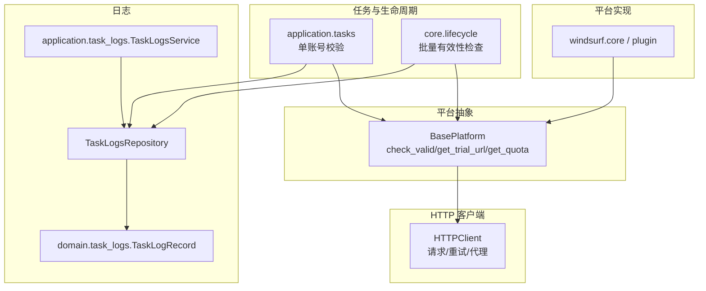
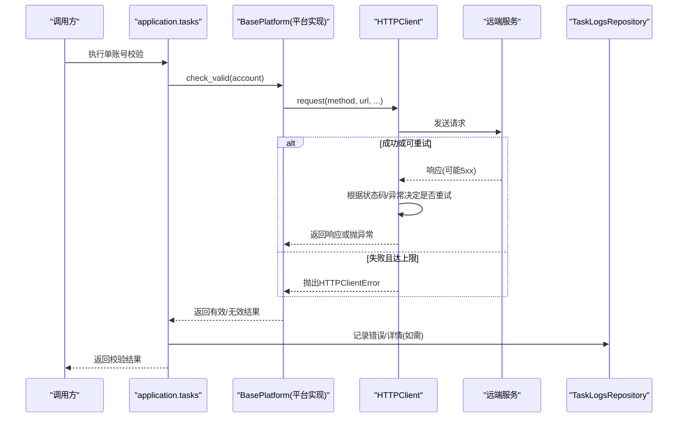
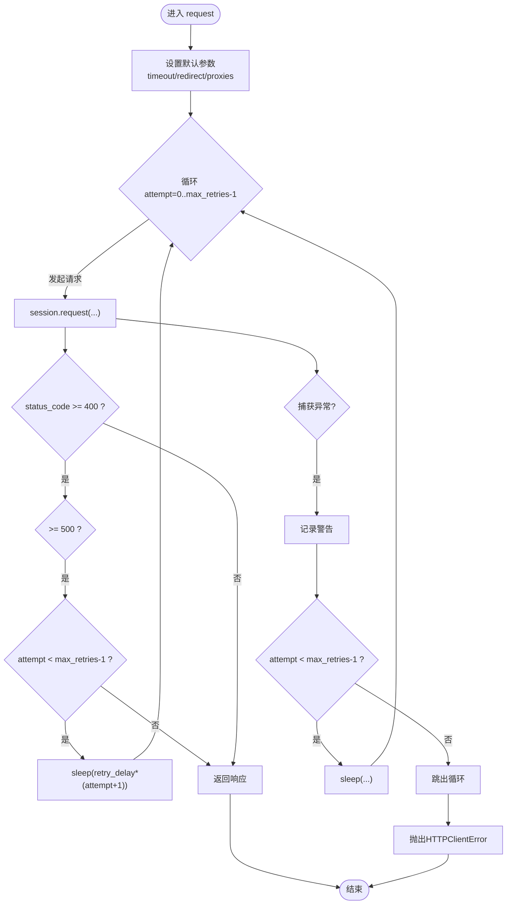
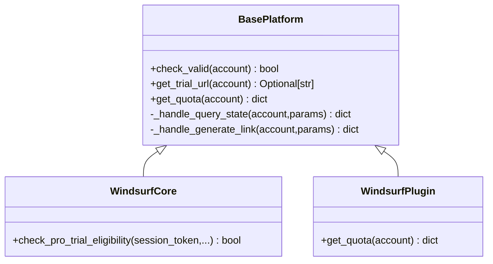
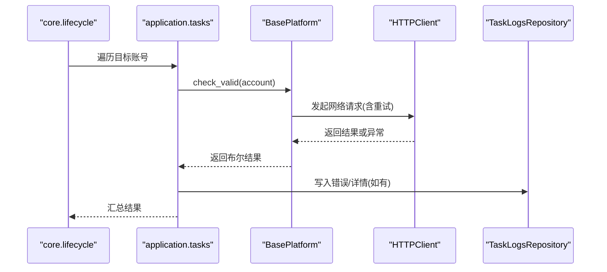
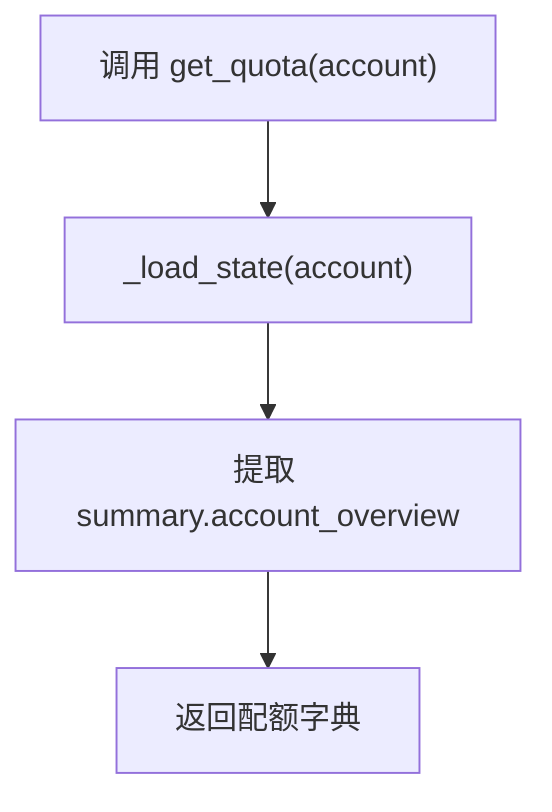
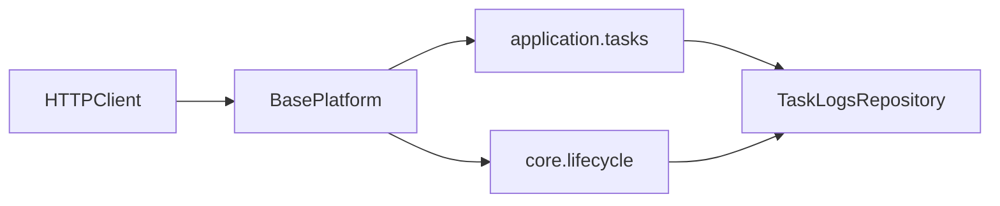

# 错误处理和重试机制

<cite>
**本文引用的文件**
- [core/http_client.py](file://core/http_client.py)
- [core/base_platform.py](file://core/base_platform.py)
- [core/registration/errors.py](file://core/registration/errors.py)
- [application/tasks.py](file://application/tasks.py)
- [core/lifecycle.py](file://core/lifecycle.py)
- [infrastructure/task_logs_repository.py](file://infrastructure/task_logs_repository.py)
- [domain/task_logs.py](file://domain/task_logs.py)
- [application/task_logs.py](file://application/task_logs.py)
- [platforms/windsurf/core.py](file://platforms/windsurf/core.py)
- [platforms/windsurf/plugin.py](file://platforms/windsurf/plugin.py)
- [tests/test_validity_recovery.py](file://tests/test_validity_recovery.py)
- [tests/test_sms_provider.py](file://tests/test_sms_provider.py)
</cite>

## 目录
1. [简介](#简介)
2. [项目结构](#项目结构)
3. [核心组件](#核心组件)
4. [架构总览](#架构总览)
5. [详细组件分析](#详细组件分析)
6. [依赖关系分析](#依赖关系分析)
7. [性能考量](#性能考量)
8. [故障排查指南](#故障排查指南)
9. [结论](#结论)
10. [附录](#附录)

## 简介
本指南聚焦于在实现平台抽象方法（如 check_valid()、get_trial_url()、get_quota()）时的错误处理与重试策略，覆盖网络异常、API 限流、服务不可用、超时等场景；提供指数退避、最大重试次数、重试间隔控制、失败条件判断的实现模式；给出日志记录最佳实践、熔断器模式建议、监控告警集成方案以及测试策略。

## 项目结构
围绕错误处理与重试的关键代码主要分布在以下模块：
- HTTP 客户端层：统一封装请求、重试、代理、超时与异常抛出
- 平台抽象层：定义 check_valid/get_trial_url/get_quota 等抽象方法与默认能力处理器
- 注册流程异常：统一的异常类型体系
- 任务执行与生命周期：调用平台方法并持久化结果
- 日志存储与查询：结构化记录错误与详情
- 具体平台实现：示例展示配额获取与试用链接生成

**图表来源**
- [core/http_client.py:85-145](file://core/http_client.py#L85-L145)
- [core/base_platform.py:162-314](file://core/base_platform.py#L162-L314)
- [application/tasks.py:535-562](file://application/tasks.py#L535-L562)
- [core/lifecycle.py:46-70](file://core/lifecycle.py#L46-L70)
- [infrastructure/task_logs_repository.py:11-40](file://infrastructure/task_logs_repository.py#L11-L40)
- [domain/task_logs.py:8-16](file://domain/task_logs.py#L8-L16)
- [application/task_logs.py:7-28](file://application/task_logs.py#L7-L28)
- [platforms/windsurf/core.py:583-592](file://platforms/windsurf/core.py#L583-L592)
- [platforms/windsurf/plugin.py:382-384](file://platforms/windsurf/plugin.py#L382-L384)

**章节来源**
- [core/http_client.py:85-145](file://core/http_client.py#L85-L145)
- [core/base_platform.py:162-314](file://core/base_platform.py#L162-L314)
- [application/tasks.py:535-562](file://application/tasks.py#L535-L562)
- [core/lifecycle.py:46-70](file://core/lifecycle.py#L46-L70)
- [infrastructure/task_logs_repository.py:11-40](file://infrastructure/task_logs_repository.py#L11-L40)
- [domain/task_logs.py:8-16](file://domain/task_logs.py#L8-L16)
- [application/task_logs.py:7-28](file://application/task_logs.py#L7-L28)
- [platforms/windsurf/core.py:583-592](file://platforms/windsurf/core.py#L583-L592)
- [platforms/windsurf/plugin.py:382-384](file://platforms/windsurf/plugin.py#L382-L384)

## 核心组件
- HTTP 客户端（HTTPClient）
  - 统一封装请求、代理、会话复用、超时、重试与异常
  - 支持对 5xx 状态码进行可配置的重试，捕获连接/超时/底层请求异常
  - 达到最大重试次数后抛出 HTTPClientError
- 平台抽象（BasePlatform）
  - 定义必须实现的 check_valid() 与可选的 get_trial_url()/get_quota()
  - 提供标准能力处理器（如 query_state -> get_quota），便于上层统一调用
- 注册异常体系（RegistrationError 及其子类）
  - 用于注册流程中的身份解析、验证码、OTP 等待等异常分类
- 任务与生命周期
  - application.tasks._run_single_account_check 调用平台 check_valid 并更新账户图
  - core.lifecycle.check_accounts_validity 批量筛选活跃状态账号进行检查
- 日志存储与查询
  - TaskLogsRepository 将错误与详情持久化，TaskLogsService 提供分页查询

**章节来源**
- [core/http_client.py:23-145](file://core/http_client.py#L23-L145)
- [core/base_platform.py:162-314](file://core/base_platform.py#L162-L314)
- [core/registration/errors.py:4-25](file://core/registration/errors.py#L4-L25)
- [application/tasks.py:535-562](file://application/tasks.py#L535-L562)
- [core/lifecycle.py:46-70](file://core/lifecycle.py#L46-L70)
- [infrastructure/task_logs_repository.py:11-40](file://infrastructure/task_logs_repository.py#L11-L40)
- [domain/task_logs.py:8-16](file://domain/task_logs.py#L8-L16)
- [application/task_logs.py:7-28](file://application/task_logs.py#L7-L28)

## 架构总览
下图展示了从任务触发到平台方法调用、HTTP 请求、重试与日志记录的完整链路。

**图表来源**
- [application/tasks.py:535-562](file://application/tasks.py#L535-L562)
- [core/base_platform.py:162-314](file://core/base_platform.py#L162-L314)
- [core/http_client.py:85-145](file://core/http_client.py#L85-L145)
- [infrastructure/task_logs_repository.py:11-40](file://infrastructure/task_logs_repository.py#L11-L40)

## 详细组件分析

### HTTP 客户端：重试与异常
- 重试策略
  - 针对 5xx 状态码与连接/超时/底层请求异常进行重试
  - 使用线性退避：sleep(retry_delay * (attempt + 1))
  - 达到 max_retries 后抛出 HTTPClientError
- 关键行为
  - 统一设置超时、重定向、代理
  - 记录每次尝试的状态码与异常信息
- 扩展建议
  - 引入指数退避：sleep(base_delay * exponential_backoff(attempt))
  - 区分可重试错误（5xx、超时、连接错误）与不可重试错误（4xx）
  - 增加抖动（jitter）避免雪崩

**图表来源**
- [core/http_client.py:85-145](file://core/http_client.py#L85-L145)

**章节来源**
- [core/http_client.py:23-145](file://core/http_client.py#L23-L145)

### 平台抽象：抽象方法与默认处理器
- 必须实现的方法
  - check_valid(account): 检测账号是否有效
- 可选实现
  - get_trial_url(account): 生成试用激活链接
  - get_quota(account): 查询账号配额
- 默认能力处理器
  - _handle_query_state 会调用 get_quota，若为空则返回基础状态
  - _handle_generate_link 会调用 get_trial_url，未实现时抛出 NotImplementedError

**图表来源**
- [core/base_platform.py:162-314](file://core/base_platform.py#L162-L314)
- [platforms/windsurf/core.py:583-592](file://platforms/windsurf/core.py#L583-L592)
- [platforms/windsurf/plugin.py:382-384](file://platforms/windsurf/plugin.py#L382-L384)

**章节来源**
- [core/base_platform.py:162-314](file://core/base_platform.py#L162-L314)
- [platforms/windsurf/core.py:583-592](file://platforms/windsurf/core.py#L583-L592)
- [platforms/windsurf/plugin.py:382-384](file://platforms/windsurf/plugin.py#L382-L384)

### 任务执行与生命周期：调用与结果持久化
- 单账号校验
  - application.tasks._run_single_account_check 获取平台插件并调用 check_valid
  - 根据结果更新账户图与生命周期状态
- 批量有效性检查
  - core.lifecycle.check_accounts_validity 仅对处于活跃状态的账号进行检查
- 日志记录
  - infrastructure.task_logs_repository 将错误与详情持久化
  - domain.task_logs.TaskLogRecord 定义日志记录的数据结构
  - application.task_logs.TaskLogsService 提供分页查询接口

**图表来源**
- [core/lifecycle.py:46-70](file://core/lifecycle.py#L46-L70)
- [application/tasks.py:535-562](file://application/tasks.py#L535-L562)
- [core/http_client.py:85-145](file://core/http_client.py#L85-L145)
- [infrastructure/task_logs_repository.py:11-40](file://infrastructure/task_logs_repository.py#L11-L40)

**章节来源**
- [core/lifecycle.py:46-70](file://core/lifecycle.py#L46-L70)
- [application/tasks.py:535-562](file://application/tasks.py#L535-L562)
- [infrastructure/task_logs_repository.py:11-40](file://infrastructure/task_logs_repository.py#L11-L40)
- [domain/task_logs.py:8-16](file://domain/task_logs.py#L8-L16)
- [application/task_logs.py:7-28](file://application/task_logs.py#L7-L28)

### 平台实现示例：配额与试用链接
- 配额查询
  - platforms/windsurf/plugin.get_quota 从本地状态中读取摘要并返回
- 试用资格检查
  - platforms/windsurf.core.check_pro_trial_eligibility 通过协议调用检查资格

**图表来源**
- [platforms/windsurf/plugin.py:382-384](file://platforms/windsurf/plugin.py#L382-L384)

**章节来源**
- [platforms/windsurf/plugin.py:382-384](file://platforms/windsurf/plugin.py#L382-L384)
- [platforms/windsurf/core.py:583-592](file://platforms/windsurf/core.py#L583-L592)

## 依赖关系分析
- HTTP 客户端被平台抽象及具体平台实现广泛使用，负责所有外部网络访问
- 平台抽象为上层任务与生命周期提供统一接口，屏蔽不同平台的差异
- 任务与生命周期依赖平台抽象，并将结果与错误写入日志存储
- 日志存储与查询为运维与排障提供数据支撑

**图表来源**
- [core/http_client.py:85-145](file://core/http_client.py#L85-L145)
- [core/base_platform.py:162-314](file://core/base_platform.py#L162-L314)
- [application/tasks.py:535-562](file://application/tasks.py#L535-L562)
- [core/lifecycle.py:46-70](file://core/lifecycle.py#L46-L70)
- [infrastructure/task_logs_repository.py:11-40](file://infrastructure/task_logs_repository.py#L11-L40)

**章节来源**
- [core/http_client.py:85-145](file://core/http_client.py#L85-L145)
- [core/base_platform.py:162-314](file://core/base_platform.py#L162-L314)
- [application/tasks.py:535-562](file://application/tasks.py#L535-L562)
- [core/lifecycle.py:46-70](file://core/lifecycle.py#L46-L70)
- [infrastructure/task_logs_repository.py:11-40](file://infrastructure/task_logs_repository.py#L11-L40)

## 性能考量
- 重试延迟策略
  - 当前为线性退避，建议在大规模并发下改为指数退避并加入随机抖动，降低风暴风险
- 超时与连接池
  - 合理设置 timeout，避免长尾请求占用资源；复用 Session 提升吞吐
- 限流与背压
  - 对上游 API 限流敏感的场景，可增加令牌桶/漏桶控制，或在重试前主动退避
- 日志开销
  - 高频重试会产生大量日志，建议按级别过滤与采样，避免 I/O 瓶颈

[本节为通用指导，不直接分析具体文件]

## 故障排查指南
- 常见错误分类
  - 网络异常：连接失败、DNS 解析失败、TLS 握手失败
  - 超时：请求耗时过长
  - 服务端错误：5xx 状态码
  - 客户端错误：4xx 状态码（通常不应重试）
  - 业务异常：验证码配置缺失、OTP 等待超时、身份解析失败
- 定位步骤
  - 查看 HTTP 客户端日志中的状态码与异常堆栈
  - 通过 TaskLogsRepository 查询错误与详情，结合 platform/email/status 过滤
  - 在平台实现中补充上下文信息（如 account_id、url、headers 摘要）以便快速定位
- 恢复策略
  - 对可重试错误采用指数退避与最大重试次数
  - 对不可重试错误立即失败并记录，避免浪费资源
  - 对关键路径引入熔断器，防止级联故障

**章节来源**
- [core/http_client.py:113-145](file://core/http_client.py#L113-L145)
- [core/registration/errors.py:4-25](file://core/registration/errors.py#L4-L25)
- [infrastructure/task_logs_repository.py:11-40](file://infrastructure/task_logs_repository.py#L11-L40)
- [domain/task_logs.py:8-16](file://domain/task_logs.py#L8-L16)

## 结论
本项目通过 HTTP 客户端统一实现了网络请求的重试与异常处理，并在平台抽象层定义了清晰的错误边界与默认能力处理器。任务与生命周期层负责调用与结果持久化，日志系统提供可观测性。建议在现有线性退避基础上引入指数退避与抖动，完善限流与熔断策略，并结合监控告警提升生产稳定性。

[本节为总结，不直接分析具体文件]

## 附录

### 在抽象方法中集成错误处理的建议
- check_valid(account)
  - 使用 HTTP 客户端发起校验请求，捕获网络异常与超时
  - 对 5xx 与可重试异常进行指数退避重试，达到上限后返回无效并记录错误
  - 对 4xx 等不可重试错误直接返回无效并记录
  - 参考路径：[core/base_platform.py:162-165](file://core/base_platform.py#L162-L165)、[core/http_client.py:85-145](file://core/http_client.py#L85-L145)
- get_trial_url(account)
  - 调用平台内部接口生成试用链接，捕获异常并返回 None 或抛出明确业务异常
  - 参考路径：[core/base_platform.py:167-169](file://core/base_platform.py#L167-L169)、[platforms/windsurf/core.py:583-592](file://platforms/windsurf/core.py#L583-L592)
- get_quota(account)
  - 从本地状态或远程接口获取配额，处理空值与异常，返回稳定结构
  - 参考路径：[core/base_platform.py:312-314](file://core/base_platform.py#L312-L314)、[platforms/windsurf/plugin.py:382-384](file://platforms/windsurf/plugin.py#L382-L384)

**章节来源**
- [core/base_platform.py:162-314](file://core/base_platform.py#L162-L314)
- [core/http_client.py:85-145](file://core/http_client.py#L85-L145)
- [platforms/windsurf/core.py:583-592](file://platforms/windsurf/core.py#L583-L592)
- [platforms/windsurf/plugin.py:382-384](file://platforms/windsurf/plugin.py#L382-L384)

### 重试机制实现模式
- 指数退避算法
  - delay = base_delay * (2 ** attempt) + jitter
  - 适用于网络抖动与临时拥塞
- 最大重试次数
  - 限制重试轮次，避免无限重试
- 重试间隔控制
  - 线性/指数退避 + 抖动，避免同步风暴
- 失败条件判断
  - 仅对 5xx、超时、连接异常重试；4xx 视为不可重试
  - 业务层面可对特定错误码进行差异化处理

[本节为通用指导，不直接分析具体文件]

### 日志记录最佳实践
- 错误级别分类
  - 使用 warning 记录可重试失败与状态码异常，error 记录最终失败
- 上下文信息记录
  - 包含 method、url、account_id、platform、attempt、error 摘要
- 调试信息输出
  - 仅在开发或诊断时开启更详细日志，生产环境按需降级

**章节来源**
- [core/http_client.py:113-145](file://core/http_client.py#L113-L145)
- [infrastructure/task_logs_repository.py:11-40](file://infrastructure/task_logs_repository.py#L11-L40)
- [domain/task_logs.py:8-16](file://domain/task_logs.py#L8-L16)

### 熔断器模式（建议）
- 目的：防止级联故障，保护下游服务
- 实现要点
  - 统计失败率与慢调用比例
  - 达到阈值后进入熔断（拒绝请求或快速失败）
  - 半开状态探测部分请求，逐步恢复
- 与重试的关系
  - 熔断优先于重试，避免放大故障

[本节为通用指导，不直接分析具体文件]

### 监控与告警集成（建议）
- 指标采集
  - 请求成功率、失败率、平均耗时、重试次数、熔断状态
- 告警规则
  - 高失败率、持续超时、熔断触发、重试耗尽
- 可视化
  - 仪表盘展示关键指标趋势，便于快速定位问题

[本节为通用指导，不直接分析具体文件]

### 测试策略
- 模拟网络异常
  - 连接失败、超时、DNS 解析失败
- 模拟 API 限流与服务不可用
  - 429、5xx、空响应
- 验证错误处理正确性
  - 确认重试次数、退避间隔、最终异常类型
  - 确认日志记录完整性与可查询性
- 参考用例
  - 短信提供商重试与污染隔离：[tests/test_sms_provider.py:182-216](file://tests/test_sms_provider.py#L182-L216)
  - 有效性恢复与生命周期更新：[tests/test_validity_recovery.py:49-86](file://tests/test_validity_recovery.py#L49-L86)

**章节来源**
- [tests/test_sms_provider.py:182-216](file://tests/test_sms_provider.py#L182-L216)
- [tests/test_validity_recovery.py:49-86](file://tests/test_validity_recovery.py#L49-L86)