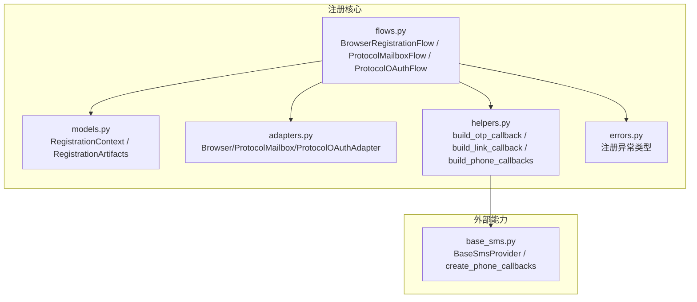
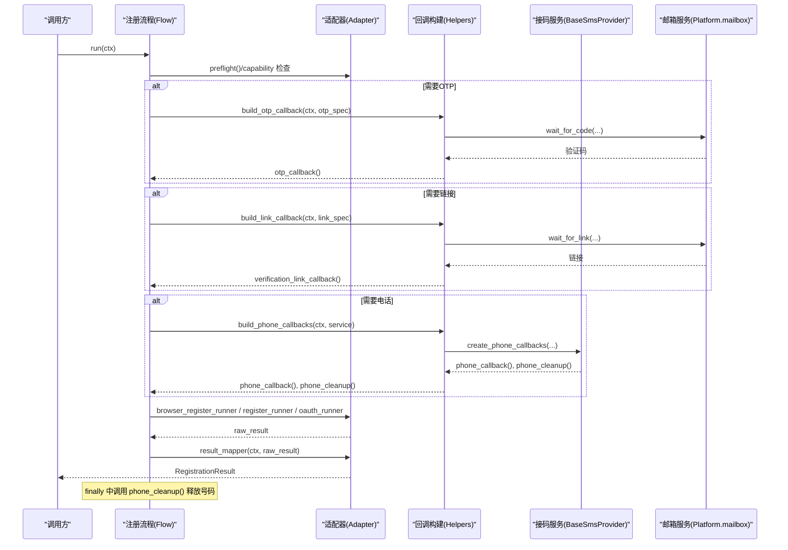
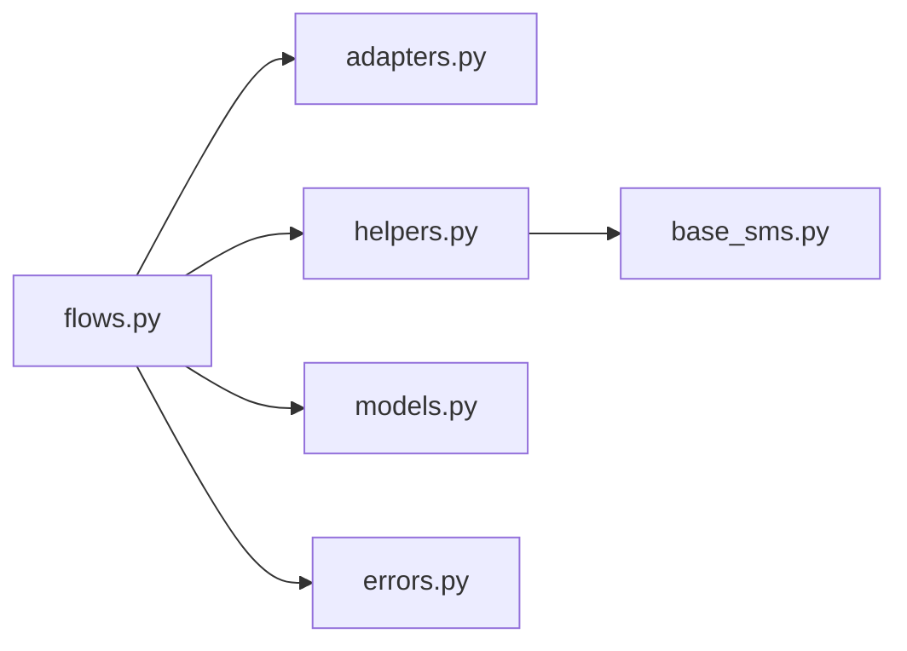

# 上下文对象管理

<cite>
**本文引用的文件**
- [core/registration/models.py](file://core/registration/models.py)
- [core/registration/adapters.py](file://core/registration/adapters.py)
- [core/registration/flows.py](file://core/registration/flows.py)
- [core/registration/helpers.py](file://core/registration/helpers.py)
- [core/registration/errors.py](file://core/registration/errors.py)
- [core/base_sms.py](file://core/base_sms.py)
</cite>

## 目录
1. [简介](#简介)
2. [项目结构](#项目结构)
3. [核心组件](#核心组件)
4. [架构总览](#架构总览)
5. [详细组件分析](#详细组件分析)
6. [依赖关系分析](#依赖关系分析)
7. [性能与稳定性考虑](#性能与稳定性考虑)
8. [故障排查指南](#故障排查指南)
9. [结论](#结论)
10. [附录：字段说明与使用示例](#附录字段说明与使用示例)

## 简介
本文聚焦于注册流程中的“上下文对象”管理机制，围绕 RegistrationContext 与 RegistrationArtifacts 的设计、传递、共享方式展开，系统解释 OTP 回调、链接回调、电话回调的构建与管理，并说明上下文的初始化与清理策略。同时给出完整字段说明、使用示例、持久化策略与版本兼容性建议，帮助读者在平台扩展和流程定制中正确复用上下文数据。

## 项目结构
注册相关代码集中在 core/registration 目录下，采用“模型 + 适配器 + 流程 + 辅助函数”的分层组织：
- models.py：定义上下文、工件、结果等核心数据结构
- adapters.py：定义浏览器/协议邮箱/OAuth 三类适配器的配置与能力声明
- flows.py：实现具体注册流程编排（浏览器模式、协议邮箱模式、协议 OAuth 模式）
- helpers.py：提供回调构建、身份校验、执行器限制检查等工具
- errors.py：注册流程异常类型定义
- base_sms.py：接码服务抽象与实现，支撑 phone_callback/phone_cleanup

图表来源
- [core/registration/flows.py:18-142](file://core/registration/flows.py#L18-L142)
- [core/registration/adapters.py:28-59](file://core/registration/adapters.py#L28-L59)
- [core/registration/helpers.py:46-177](file://core/registration/helpers.py#L46-L177)
- [core/base_sms.py:28-66](file://core/base_sms.py#L28-L66)

章节来源
- [core/registration/models.py:17-66](file://core/registration/models.py#L17-L66)
- [core/registration/adapters.py:28-59](file://core/registration/adapters.py#L28-L59)
- [core/registration/flows.py:18-142](file://core/registration/flows.py#L18-L142)
- [core/registration/helpers.py:46-177](file://core/registration/helpers.py#L46-L177)
- [core/base_sms.py:28-66](file://core/base_sms.py#L28-L66)

## 核心组件
- RegistrationContext：承载一次注册任务所需的平台、身份、配置、日志等上下文信息，并提供 executor_type、proxy、extra 等便捷访问属性。
- RegistrationArtifacts：封装注册过程中产生的可复用工件，包括 OTP 回调、验证链接回调、电话回调及清理函数、验证码求解器、执行器、原始结果与元数据。
- 适配器（Adapters）：描述不同注册路径的能力与回调需求（如是否需要 OTP/链接），以及浏览器/协议邮箱/OAuth 三种模式的运行入口。
- 流程（Flows）：编排注册步骤，按需构建回调，调用适配器完成注册，并在 finally 中确保资源清理。
- 辅助函数（Helpers）：统一构建 OTP/链接/电话回调，校验身份与执行器限制，解析超时等参数。
- 错误（Errors）：定义注册流程各类异常，便于上层捕获与提示。

章节来源
- [core/registration/models.py:17-66](file://core/registration/models.py#L17-L66)
- [core/registration/adapters.py:28-59](file://core/registration/adapters.py#L28-L59)
- [core/registration/flows.py:18-142](file://core/registration/flows.py#L18-L142)
- [core/registration/helpers.py:46-177](file://core/registration/helpers.py#L46-L177)
- [core/registration/errors.py:4-27](file://core/registration/errors.py#L4-L27)

## 架构总览
注册流程通过 Flow 驱动，根据平台适配器能力选择合适路径；在流程中动态构建回调，并通过 RegistrationArtifacts 在 worker/runner 之间共享；最终由 result_mapper 将原始结果映射为标准 RegistrationResult。

图表来源
- [core/registration/flows.py:18-142](file://core/registration/flows.py#L18-L142)
- [core/registration/helpers.py:46-177](file://core/registration/helpers.py#L46-L177)
- [core/base_sms.py:28-66](file://core/base_sms.py#L28-L66)

## 详细组件分析

### 上下文对象：RegistrationContext
- 职责：集中保存平台、身份、配置、邮箱、密码、日志函数等注册所需信息，并提供便捷属性以简化调用。
- 关键字段
  - platform_name/platform_display_name：平台标识与展示名
  - platform：平台实例，用于访问 mailbox、executor、captcha 等能力
  - identity：身份对象，可能包含 email、has_mailbox、mailbox_account、before_ids、identity_provider 等
  - config：配置对象，暴露 executor_type、proxy、extra 等
  - email/password：可选的账号凭据
  - log_fn：日志回调，供上下文内统一输出
- 便捷属性与方法
  - executor_type：从 config 读取执行器类型，默认 protocol
  - proxy：从 config 读取代理地址
  - extra：从 config 读取额外参数字典
  - log(message)：通过 log_fn 输出日志

使用要点
- 所有回调通过 ctx.log 记录关键事件，便于追踪
- 通过 ctx.platform 访问邮箱、验证码、执行器等能力
- 通过 ctx.identity 获取邮箱账号、前置消息ID等
- 通过 ctx.config 获取执行器类型、代理、扩展参数

章节来源
- [core/registration/models.py:17-42](file://core/registration/models.py#L17-L42)

### 工件对象：RegistrationArtifacts
- 职责：在注册流程中承载可复用的中间产物，尤其是各种回调与执行器，供 worker/runner 共享。
- 关键字段
  - otp_callback：获取验证码的回调
  - verification_link_callback：获取验证链接的回调
  - phone_callback：获取电话号码或验证码的回调
  - phone_cleanup：释放/取消电话号码的清理回调
  - captcha_solver：验证码求解器实例（可选）
  - executor：执行器实例（可选）
  - raw_result：原始结果（由 runner 返回）
  - metadata：扩展元数据（键值对）

生命周期
- 在流程中创建并填充
- 传递给 worker/runner 使用
- 在 finally 中确保 phone_cleanup 被调用，避免号码泄露

章节来源
- [core/registration/models.py:44-54](file://core/registration/models.py#L44-L54)
- [core/registration/flows.py:46-78](file://core/registration/flows.py#L46-L78)

### 适配器：能力与运行入口
- BrowserRegistrationAdapter：浏览器模式注册，支持预检、OAuth 运行器、浏览器工作流、OTP/链接等待、验证码求解等
- ProtocolMailboxAdapter：协议邮箱模式注册，支持 worker 构建、注册运行器、OTP/链接等待、执行器上下文
- ProtocolOAuthAdapter：协议 OAuth 模式注册，支持预检、执行器类型校验、OAuth 运行器

能力声明
- capability：RegistrationCapability，控制邮箱/浏览器/无头模式等约束
- otp_spec/link_spec：描述如何等待验证码/链接

章节来源
- [core/registration/adapters.py:28-59](file://core/registration/adapters.py#L28-L59)

### 流程编排：回调构建与资源清理
- 浏览器模式
  - 若 identity_provider 为 oauth_browser，先校验执行器类型与无头复用要求，再走 OAuth 路径
  - 否则构造 RegistrationArtifacts，按需构建 OTP/链接/电话回调，调用浏览器注册 runner，finally 清理电话
- 协议邮箱模式
  - 校验邮箱与 mailbox 可用性，构造 OTP/链接回调，必要时创建执行器上下文，调用注册 runner
- 协议 OAuth 模式
  - 校验执行器类型与无头复用要求，直接调用 OAuth runner

清理机制
- 浏览器模式中，无论成功失败，均会调用 phone_cleanup 释放号码
- 协议邮箱模式通过 with 上下文管理执行器，自动关闭

章节来源
- [core/registration/flows.py:18-142](file://core/registration/flows.py#L18-L142)

### 回调构建与管理
- OTP 回调
  - 基于 platform.mailbox 与 identity.mailbox_account，按 keyword、before_ids、timeout、code_pattern 等待验证码
  - 成功后通过 ctx.log 输出，返回验证码字符串
- 链接回调
  - 基于 platform.mailbox 与 identity.mailbox_account，按 keyword、before_ids、timeout 等待验证链接
  - 成功后截断预览并输出，返回链接字符串
- 电话回调
  - 从 task 参数/全局默认/历史兼容字段解析 sms provider
  - 合并运行时设置，注入代理与国家/服务信息
  - 调用 create_phone_callbacks 生成 phone_callback 与 phone_cleanup
  - 若未配置或认证字段缺失，返回 None，注册到 add_phone 步骤将抛错

章节来源
- [core/registration/helpers.py:46-177](file://core/registration/helpers.py#L46-L177)
- [core/base_sms.py:28-66](file://core/base_sms.py#L28-L66)

### 身份与执行器校验
- ensure_identity_email：确保 identity.email 存在
- ensure_mailbox_identity：确保 identity.has_mailbox 为真
- ensure_oauth_executor_allowed：根据 capability.oauth_allowed_executor_types 校验当前 executor_type
- ensure_oauth_browser_reuse：当无头 OAuth 需要复用本机浏览器会话时，校验 chrome_user_data_dir/chrome_cdp_url

章节来源
- [core/registration/helpers.py:11-44](file://core/registration/helpers.py#L11-L44)

### 错误处理
- RegistrationError：注册基础异常
- IdentityResolutionError：身份解析失败
- CaptchaConfigurationError：验证码配置不可用
- OtpTimeoutError：验证码等待超时
- BrowserReuseRequiredError：无头 OAuth 缺少可复用浏览器会话
- RegistrationUnsupportedError：当前平台或执行器不支持该注册路径

章节来源
- [core/registration/errors.py:4-27](file://core/registration/errors.py#L4-L27)

## 依赖关系分析
- Flow 依赖 Adapters 定义能力与运行入口
- Flow 依赖 Helpers 构建回调与校验
- Helpers 依赖 BaseSmsProvider 提供的接码能力
- Flow 依赖 Models 中的 Context/Artifacts/Result
- 各平台通过 platform 实例提供 mailbox、executor、captcha 等能力

图表来源
- [core/registration/flows.py:18-142](file://core/registration/flows.py#L18-L142)
- [core/registration/adapters.py:28-59](file://core/registration/adapters.py#L28-L59)
- [core/registration/helpers.py:46-177](file://core/registration/helpers.py#L46-L177)
- [core/base_sms.py:28-66](file://core/base_sms.py#L28-L66)
- [core/registration/models.py:17-66](file://core/registration/models.py#L17-L66)
- [core/registration/errors.py:4-27](file://core/registration/errors.py#L4-L27)

## 性能与稳定性考虑
- 回调超时控制：OTP/链接回调支持 timeout，避免长时间阻塞
- 号码复用与去重：接码服务内部维护缓存与去重逻辑，减少重复请求与冲突
- 资源清理：phone_cleanup 在 finally 中保证执行，防止号码泄露
- 执行器限制：通过 capability 与校验函数限制不兼容的执行器类型，降低失败率
- 日志与可观测性：统一通过 ctx.log 输出关键事件，便于定位问题

[本节为通用指导，无需特定文件引用]

## 故障排查指南
- 未配置短信服务
  - 现象：phone_callback=None，add_phone 步骤抛错
  - 排查：检查任务参数/全局默认/历史兼容字段是否配置了 sms provider，且认证字段齐全
- 无头 OAuth 需要浏览器复用
  - 现象：抛出 BrowserReuseRequiredError
  - 排查：配置 chrome_user_data_dir 或 chrome_cdp_url，启用本地已登录浏览器会话
- 邮箱/身份缺失
  - 现象：抛出 IdentityResolutionError
  - 排查：确保 identity.email 与 identity.has_mailbox 满足要求
- 验证码/链接超时
  - 现象：抛出 OtpTimeoutError 或等待超时
  - 排查：调整 timeout、keyword、before_ids、code_pattern 等参数

章节来源
- [core/registration/helpers.py:75-147](file://core/registration/helpers.py#L75-L147)
- [core/registration/errors.py:4-27](file://core/registration/errors.py#L4-L27)

## 结论
RegistrationContext 与 RegistrationArtifacts 构成了注册流程的核心数据载体，前者负责“输入与能力”，后者负责“过程工件与清理”。通过适配器声明能力、流程编排步骤、辅助函数统一构建回调，系统在多平台、多模式下实现了高内聚、低耦合的可扩展设计。配合完善的错误处理与资源清理机制，能够稳定支撑复杂注册场景。

[本节为总结性内容，无需特定文件引用]

## 附录：字段说明与使用示例

### RegistrationContext 字段说明
- platform_name：平台名称（字符串）
- platform_display_name：平台显示名（字符串）
- platform：平台实例（用于访问 mailbox、executor、captcha 等）
- identity：身份对象（可能包含 email、has_mailbox、mailbox_account、before_ids、identity_provider 等）
- config：配置对象（可能包含 executor_type、proxy、extra 等）
- email：邮箱（可选）
- password：密码（可选）
- log_fn：日志回调（接收字符串）
- 便捷属性
  - executor_type：执行器类型（字符串，默认 protocol）
  - proxy：代理地址（字符串或空）
  - extra：扩展参数（字典）
- 方法
  - log(message)：输出日志

使用示例（概念性）
- 在 OTP 回调中通过 ctx.log 输出“等待验证码...”
- 在链接回调中通过 ctx.log 输出“验证链接: ...”
- 在电话回调中通过 ctx.log 输出“已就绪: provider=... service=... country=...”

章节来源
- [core/registration/models.py:17-42](file://core/registration/models.py#L17-L42)
- [core/registration/helpers.py:46-177](file://core/registration/helpers.py#L46-L177)

### RegistrationArtifacts 字段说明
- otp_callback：获取验证码的回调（函数或空）
- verification_link_callback：获取验证链接的回调（函数或空）
- phone_callback：获取电话号码或验证码的回调（函数或空）
- phone_cleanup：释放电话号码的清理回调（函数或空）
- captcha_solver：验证码求解器（任意类型或空）
- executor：执行器（任意类型或空）
- raw_result：原始结果（任意类型）
- metadata：扩展元数据（字典）

使用示例（概念性）
- 在浏览器模式中，构造 artifacts 后传入 worker/runner
- 在 finally 中调用 artifacts.phone_cleanup() 释放号码
- 将 raw_result 与 metadata 一并返回给 result_mapper

章节来源
- [core/registration/models.py:44-54](file://core/registration/models.py#L44-L54)
- [core/registration/flows.py:46-78](file://core/registration/flows.py#L46-L78)

### 回调构建与使用
- OTP 回调
  - 输入：ctx、keyword、timeout、code_pattern、wait_message、success_label
  - 行为：调用 mailbox.wait_for_code，返回验证码
  - 日志：输出等待与结果
- 链接回调
  - 输入：ctx、keyword、timeout、wait_message、success_label、preview_chars
  - 行为：调用 mailbox.wait_for_link，返回链接
  - 日志：输出等待与链接预览
- 电话回调
  - 输入：ctx、service
  - 行为：解析 provider、合并设置、注入代理与国家/服务，调用 create_phone_callbacks
  - 输出：phone_callback、phone_cleanup
  - 日志：输出 provider、来源、service、country

章节来源
- [core/registration/helpers.py:46-177](file://core/registration/helpers.py#L46-L177)
- [core/base_sms.py:28-66](file://core/base_sms.py#L28-L66)

### 上下文数据的持久化策略与版本兼容性
- 持久化策略
  - 接码服务内部维护进程级缓存与磁盘缓存（例如 HeroSMS 的 .herosms_phone_cache.json），用于号码复用与去重
  - 缓存包含激活ID、手机号、国家、使用时间、使用次数、已用验证码集合、尝试过的短信键集合等
  - 通过哈希密钥与时间戳控制缓存有效性与隔离性
- 版本兼容性
  - 通过 resolve_runtime_settings 合并任务参数与全局默认设置，兼容历史字段（如 sms_activate_api_key）
  - 通过 capability 声明执行器与邮箱/浏览器模式约束，避免不兼容环境运行
  - 通过 error 体系明确异常类型，便于上层捕获与降级

章节来源
- [core/base_sms.py:196-205](file://core/base_sms.py#L196-L205)
- [core/base_sms.py:581-634](file://core/base_sms.py#L581-L634)
- [core/registration/helpers.py:75-147](file://core/registration/helpers.py#L75-L147)
- [core/registration/adapters.py:28-59](file://core/registration/adapters.py#L28-L59)