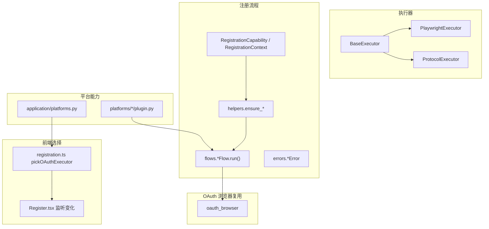
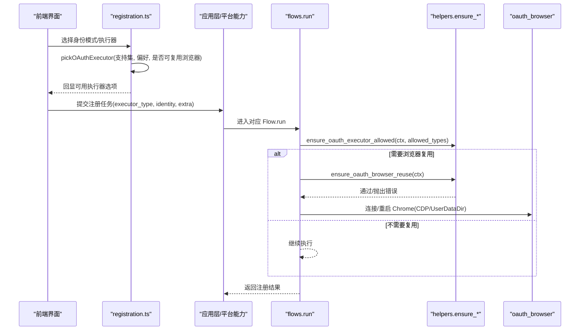
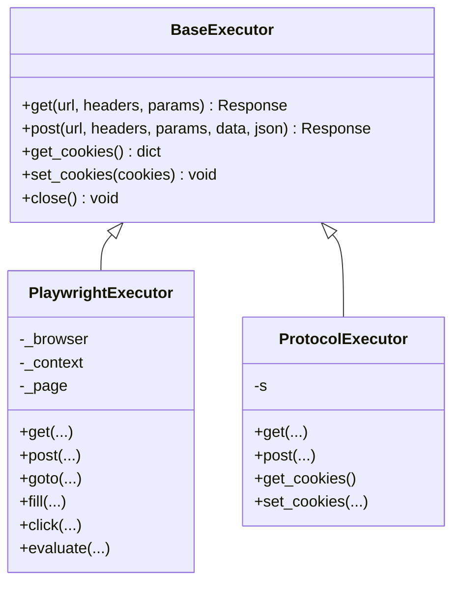
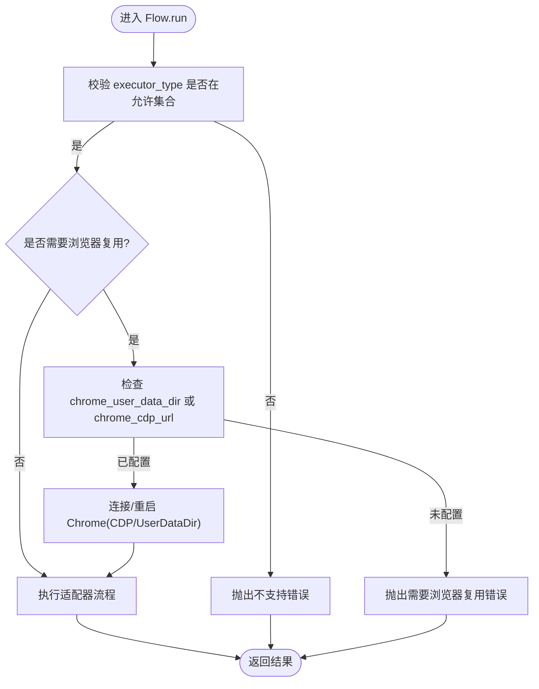
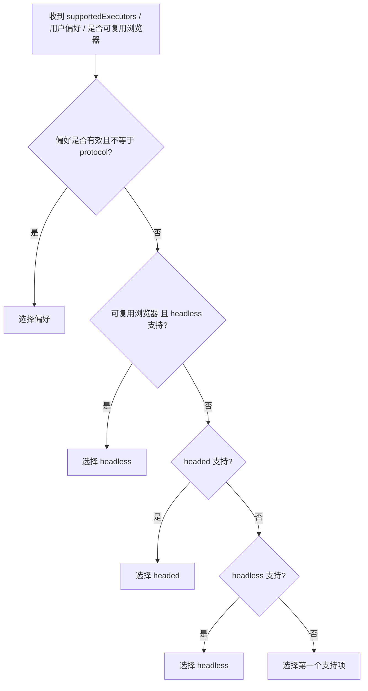
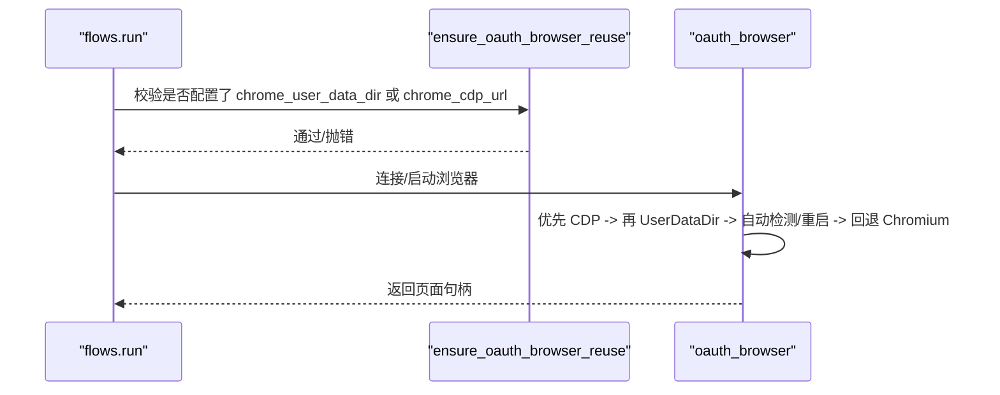
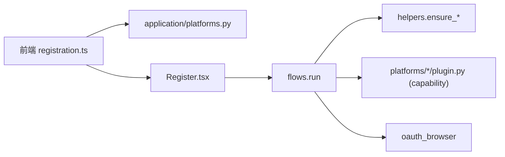
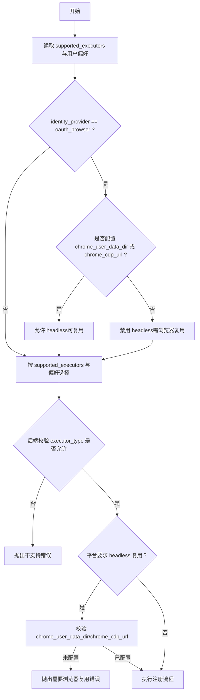

# 执行器选择逻辑

<cite>
**本文引用的文件**
- [core/base_executor.py](file://core/base_executor.py)
- [core/executors/playwright.py](file://core/executors/playwright.py)
- [core/executors/protocol.py](file://core/executors/protocol.py)
- [core/registration/models.py](file://core/registration/models.py)
- [core/registration/helpers.py](file://core/registration/helpers.py)
- [core/registration/flows.py](file://core/registration/flows.py)
- [core/registration/errors.py](file://core/registration/errors.py)
- [core/oauth_browser.py](file://core/oauth_browser.py)
- [platforms/chatgpt/plugin.py](file://platforms/chatgpt/plugin.py)
- [frontend/src/lib/registration.ts](file://frontend/src/lib/registration.ts)
- [frontend/src/pages/Register.tsx](file://frontend/src/pages/Register.tsx)
- [application/platforms.py](file://application/platforms.py)
</cite>

## 目录
1. [简介](#简介)
2. [项目结构](#项目结构)
3. [核心组件](#核心组件)
4. [架构总览](#架构总览)
5. [详细组件分析](#详细组件分析)
6. [依赖关系分析](#依赖关系分析)
7. [性能考量](#性能考量)
8. [故障排查指南](#故障排查指南)
9. [结论](#结论)
10. [附录：配置示例与决策流程图](#附录配置示例与决策流程图)

## 简介
本文聚焦“执行器选择逻辑”，系统性说明系统如何在浏览器模式（headless/headed）与协议模式（protocol）之间自动选择执行器，并解释 ensure_oauth_executor_allowed 如何依据平台能力限制可用的执行器类型。同时覆盖 headless 模式下对 chrome_user_data_dir 与 chrome_cdp_url 的特殊处理、不同执行器的优缺点与适用场景，并提供决策流程图与常见配置错误的诊断方案。

## 项目结构
围绕执行器选择的关键代码分布在以下位置：
- 执行器抽象与实现：base_executor、playwright、protocol
- 注册流程与能力约束：registration/models、registration/helpers、registration/flows、registration/errors
- OAuth 浏览器复用：oauth_browser
- 前端自动选择策略：frontend/src/lib/registration.ts、Register.tsx
- 平台能力声明与应用层聚合：platforms/*/plugin.py、application/platforms.py

图表来源
- [core/base_executor.py:19-49](file://core/base_executor.py#L19-L49)
- [core/executors/playwright.py:5-134](file://core/executors/playwright.py#L5-L134)
- [core/executors/protocol.py:6-45](file://core/executors/protocol.py#L6-L45)
- [core/registration/models.py:7-41](file://core/registration/models.py#L7-L41)
- [core/registration/helpers.py:33-43](file://core/registration/helpers.py#L33-L43)
- [core/registration/flows.py:22-40](file://core/registration/flows.py#L22-L40)
- [core/oauth_browser.py:166-212](file://core/oauth_browser.py#L166-L212)
- [frontend/src/lib/registration.ts:14-32](file://frontend/src/lib/registration.ts#L14-L32)
- [frontend/src/pages/Register.tsx:233-242](file://frontend/src/pages/Register.tsx#L233-L242)
- [application/platforms.py:36-54](file://application/platforms.py#L36-L54)

章节来源
- [core/base_executor.py:19-49](file://core/base_executor.py#L19-L49)
- [core/executors/playwright.py:5-134](file://core/executors/playwright.py#L5-L134)
- [core/executors/protocol.py:6-45](file://core/executors/protocol.py#L6-L45)
- [core/registration/models.py:7-41](file://core/registration/models.py#L7-L41)
- [core/registration/helpers.py:33-43](file://core/registration/helpers.py#L33-L43)
- [core/registration/flows.py:22-40](file://core/registration/flows.py#L22-L40)
- [core/oauth_browser.py:166-212](file://core/oauth_browser.py#L166-L212)
- [frontend/src/lib/registration.ts:14-32](file://frontend/src/lib/registration.ts#L14-L32)
- [frontend/src/pages/Register.tsx:233-242](file://frontend/src/pages/Register.tsx#L233-L242)
- [application/platforms.py:36-54](file://application/platforms.py#L36-L54)

## 核心组件
- BaseExecutor：定义统一的 HTTP 请求接口与 Cookie 管理，屏蔽底层差异。
- PlaywrightExecutor：基于 Playwright 的浏览器执行器，支持 headless 与 headed 两种模式，封装页面导航、表单交互等能力。
- ProtocolExecutor：纯协议执行器，基于 curl_cffi 直接发起 HTTP 请求，不启动浏览器。
- RegistrationCapability：声明平台在 OAuth 与邮箱注册路径上的能力与约束，如允许的执行器类型、无头模式是否要求浏览器复用等。
- RegistrationContext：承载当前注册上下文，包括 executor_type、proxy、extra 等。
- helpers.ensure_oauth_executor_allowed：校验当前 executor_type 是否在平台允许的集合中。
- flows.*Flow.run：注册流程入口，按适配器能力进行前置检查与运行。
- oauth_browser：负责连接或重启本地 Chrome，支持通过 CDP 或 User Data Dir 复用已登录会话。

章节来源
- [core/base_executor.py:19-49](file://core/base_executor.py#L19-L49)
- [core/executors/playwright.py:5-134](file://core/executors/playwright.py#L5-L134)
- [core/executors/protocol.py:6-45](file://core/executors/protocol.py#L6-L45)
- [core/registration/models.py:7-41](file://core/registration/models.py#L7-L41)
- [core/registration/helpers.py:33-43](file://core/registration/helpers.py#L33-L43)
- [core/registration/flows.py:22-40](file://core/registration/flows.py#L22-L40)
- [core/oauth_browser.py:166-212](file://core/oauth_browser.py#L166-L212)

## 架构总览
执行器选择由“前端自动选择 + 后端能力校验”共同完成：
- 前端根据用户选择的 identity_provider、supported_executors 以及是否配置了可复用浏览器（chrome_user_data_dir 或 chrome_cdp_url），调用 pickOAuthExecutor 计算默认 executor_type。
- 后端在 flows.run 中通过 ensure_oauth_executor_allowed 校验 executor_type 是否符合平台能力；若为 headless 且平台要求浏览器复用，则进一步校验 chrome_user_data_dir/chrome_cdp_url 是否配置。
- 平台插件在构建适配器时声明 capability（例如 ChatGPT 设置 oauth_headless_requires_browser_reuse=True），从而驱动后端的强制校验。

图表来源
- [frontend/src/lib/registration.ts:14-32](file://frontend/src/lib/registration.ts#L14-L32)
- [core/registration/flows.py:22-40](file://core/registration/flows.py#L22-L40)
- [core/registration/helpers.py:33-43](file://core/registration/helpers.py#L33-L43)
- [core/oauth_browser.py:166-212](file://core/oauth_browser.py#L166-L212)

## 详细组件分析

### 执行器基类与实现
- BaseExecutor 提供 get/post/get_cookies/set_cookies/close 的统一接口，便于上层以相同方式调用不同执行器。
- PlaywrightExecutor 使用 Chromium 引擎，支持 headless/headed，内置超时、UA、代理等配置，并暴露常用页面操作。
- ProtocolExecutor 使用 curl_cffi 模拟真实浏览器指纹，适合无需 DOM 操作的纯协议流程。

图表来源
- [core/base_executor.py:19-49](file://core/base_executor.py#L19-L49)
- [core/executors/playwright.py:5-134](file://core/executors/playwright.py#L5-L134)
- [core/executors/protocol.py:6-45](file://core/executors/protocol.py#L6-L45)

章节来源
- [core/base_executor.py:19-49](file://core/base_executor.py#L19-L49)
- [core/executors/playwright.py:5-134](file://core/executors/playwright.py#L5-L134)
- [core/executors/protocol.py:6-45](file://core/executors/protocol.py#L6-L45)

### 注册流程中的执行器选择与校验
- flows.run 在 OAuth 路径下会先调用 ensure_oauth_executor_allowed，将当前 executor_type 与平台能力中的 allowed_executor_types 对比，若不匹配则抛出不支持的错误。
- 当平台能力声明 oauth_headless_requires_browser_reuse=True 且 executor_type=headless 时，会进一步校验是否配置了 chrome_user_data_dir 或 chrome_cdp_url，否则抛出“需要浏览器复用”的错误。
- 平台插件（如 ChatGPT）在构建适配器时声明 capability，从而控制行为。

图表来源
- [core/registration/flows.py:22-40](file://core/registration/flows.py#L22-L40)
- [core/registration/helpers.py:33-43](file://core/registration/helpers.py#L33-L43)
- [core/registration/errors.py:20-25](file://core/registration/errors.py#L20-L25)
- [platforms/chatgpt/plugin.py:160-177](file://platforms/chatgpt/plugin.py#L160-L177)

章节来源
- [core/registration/flows.py:22-40](file://core/registration/flows.py#L22-L40)
- [core/registration/helpers.py:33-43](file://core/registration/helpers.py#L33-L43)
- [core/registration/errors.py:20-25](file://core/registration/errors.py#L20-L25)
- [platforms/chatgpt/plugin.py:160-177](file://platforms/chatgpt/plugin.py#L160-L177)

### 前端自动选择策略
- hasReusableOAuthBrowser：判断是否配置了 chrome_user_data_dir 或 chrome_cdp_url。
- pickOAuthExecutor：优先保留用户偏好（排除 protocol），其次在有可复用浏览器时倾向 headless，然后 headed，最后 headless，兜底取首个支持项。
- Register.tsx：当有效执行器列表为空或当前值不在有效列表中时，根据 identity_provider 是否为 oauth_browser 调用 pickOAuthExecutor 重新计算 executor_type。

图表来源
- [frontend/src/lib/registration.ts:6-32](file://frontend/src/lib/registration.ts#L6-L32)
- [frontend/src/pages/Register.tsx:233-242](file://frontend/src/pages/Register.tsx#L233-L242)

章节来源
- [frontend/src/lib/registration.ts:6-32](file://frontend/src/lib/registration.ts#L6-L32)
- [frontend/src/pages/Register.tsx:233-242](file://frontend/src/pages/Register.tsx#L233-L242)

### Headless 下的特殊处理：浏览器复用
- 当 executor_type=headless 且平台要求浏览器复用时，必须配置 chrome_user_data_dir 或 chrome_cdp_url。
- oauth_browser 的连接优先级：
  1) 直接使用配置的 chrome_cdp_url 连接已运行的 Chrome；
  2) 使用 chrome_user_data_dir 启动持久化上下文加载用户 Profile；
  3) 自动检测本机 Chrome 的 CDP 端口，必要时尝试重启 Chrome 开启调试端口；
  4) 以上均失败则回退到普通 Playwright Chromium。

图表来源
- [core/registration/flows.py:22-40](file://core/registration/flows.py#L22-L40)
- [core/registration/helpers.py:41-43](file://core/registration/helpers.py#L41-L43)
- [core/oauth_browser.py:166-212](file://core/oauth_browser.py#L166-L212)

章节来源
- [core/registration/flows.py:22-40](file://core/registration/flows.py#L22-L40)
- [core/registration/helpers.py:41-43](file://core/registration/helpers.py#L41-L43)
- [core/oauth_browser.py:166-212](file://core/oauth_browser.py#L166-L212)

### 不同执行器的优缺点与适用场景
- ProtocolExecutor（协议模式）
  - 优点：轻量、资源占用低、速度快、易于并发。
  - 缺点：无法执行 JS/DOM 相关逻辑，难以绕过强反爬或需要完整浏览器环境的站点。
  - 适用：纯 HTTP API 注册、邮箱验证码流程、无需浏览器交互的场景。
- PlaywrightExecutor（headless/headed 浏览器模式）
  - 优点：能执行 JS、渲染页面、模拟真实用户行为，兼容性强。
  - 缺点：资源消耗高、启动开销大、受环境依赖影响（Chromium/系统）。
  - 适用：需要浏览器自动化、第三方 OAuth 登录、复杂人机验证等场景。
- Headless vs Headed
  - Headless：后台运行、不可见，适合服务器环境或批量任务。
  - Headed：可见窗口，便于调试与人工干预，但占用桌面资源。

[本节为通用说明，不直接引用具体文件]

## 依赖关系分析
- 前端依赖 application/platforms.py 提供的 supported_executors 与标签映射，结合本地配置（chrome_user_data_dir/chrome_cdp_url）计算默认执行器。
- 后端 flows.run 依赖 platform 插件声明的 capability 与 helpers 的校验函数，确保执行器选择符合平台能力与安全策略。
- oauth_browser 作为运行时依赖，决定 headless 模式下是否能成功复用本机浏览器会话。

图表来源
- [frontend/src/lib/registration.ts:14-32](file://frontend/src/lib/registration.ts#L14-L32)
- [application/platforms.py:36-54](file://application/platforms.py#L36-L54)
- [core/registration/flows.py:22-40](file://core/registration/flows.py#L22-L40)
- [core/registration/helpers.py:33-43](file://core/registration/helpers.py#L33-L43)
- [platforms/chatgpt/plugin.py:160-177](file://platforms/chatgpt/plugin.py#L160-L177)
- [core/oauth_browser.py:166-212](file://core/oauth_browser.py#L166-L212)

章节来源
- [frontend/src/lib/registration.ts:14-32](file://frontend/src/lib/registration.ts#L14-L32)
- [application/platforms.py:36-54](file://application/platforms.py#L36-L54)
- [core/registration/flows.py:22-40](file://core/registration/flows.py#L22-L40)
- [core/registration/helpers.py:33-43](file://core/registration/helpers.py#L33-L43)
- [platforms/chatgpt/plugin.py:160-177](file://platforms/chatgpt/plugin.py#L160-L177)
- [core/oauth_browser.py:166-212](file://core/oauth_browser.py#L166-L212)

## 性能考量
- 协议模式（ProtocolExecutor）资源占用最低，适合高并发、短链路任务。
- 浏览器模式（PlaywrightExecutor）启动 Chromium、创建上下文与页面会带来额外开销，建议：
  - 合理设置超时与并发数；
  - 复用浏览器上下文以减少重复启动；
  - 在无交互需求时优先选择协议模式。
- Headless 模式在服务器上更稳定，Headed 模式更适合调试。

[本节为通用指导，不直接引用具体文件]

## 故障排查指南
- 错误：当前执行器不被平台支持
  - 现象：抛出“当前平台或执行器不支持该注册路径”类错误。
  - 原因：executor_type 不在平台能力声明的允许集合中。
  - 解决：调整 executor_type 至 supported_executors 之一，或在平台侧扩展能力。
- 错误：无头 OAuth 需要配置浏览器复用
  - 现象：抛出“需要浏览器复用”类错误。
  - 原因：executor_type=headless 且平台要求浏览器复用，但未配置 chrome_user_data_dir 或 chrome_cdp_url。
  - 解决：在全局设置中填写 Chrome Profile 路径或 Chrome CDP 地址，确保可连接到已登录的浏览器会话。
- 错误：邮箱或手机号相关步骤缺失
  - 现象：提示需要邮箱或 mailbox provider。
  - 原因：平台能力要求邮箱或邮箱服务未配置。
  - 解决：补充邮箱或配置 mailbox provider。

章节来源
- [core/registration/errors.py:8-25](file://core/registration/errors.py#L8-L25)
- [core/registration/helpers.py:23-43](file://core/registration/helpers.py#L23-L43)
- [core/registration/flows.py:22-40](file://core/registration/flows.py#L22-L40)

## 结论
执行器选择由“前端智能推荐 + 后端能力校验”构成：前端基于用户偏好与环境能力给出最优解，后端通过平台能力与运行时约束确保安全性与可行性。对于需要浏览器会话的 OAuth 流程，务必正确配置 chrome_user_data_dir 或 chrome_cdp_url，以便 headless 模式也能复用本机登录态。在不同场景下选择合适的执行器，可在稳定性与性能之间取得平衡。

[本节为总结性内容，不直接引用具体文件]

## 附录：配置示例与决策流程图

### 配置示例（字段说明）
- executor_type：执行器类型，可选 protocol、headless、headed。
- identity_provider：身份模式，mailbox 或 oauth_browser。
- oauth_provider：OAuth 提供商，如 google、microsoft。
- chrome_user_data_dir：本机 Chrome Profile 路径，用于复用已登录会话。
- chrome_cdp_url：远程调试地址，如 http://localhost:9222，用于连接已运行的 Chrome。
- proxy：代理地址（可选）。

[本节为概念性说明，不直接引用具体文件]

### 执行器选择决策流程图（综合前后端）

图表来源
- [frontend/src/lib/registration.ts:14-32](file://frontend/src/lib/registration.ts#L14-L32)
- [core/registration/flows.py:22-40](file://core/registration/flows.py#L22-L40)
- [core/registration/helpers.py:33-43](file://core/registration/helpers.py#L33-L43)
- [core/registration/errors.py:20-25](file://core/registration/errors.py#L20-L25)