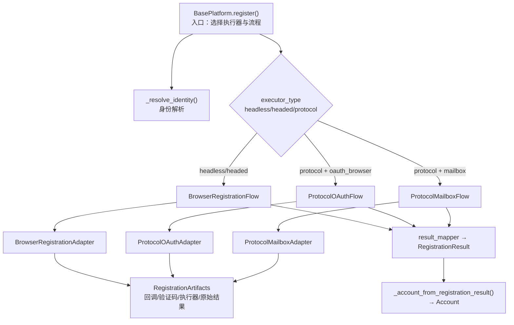
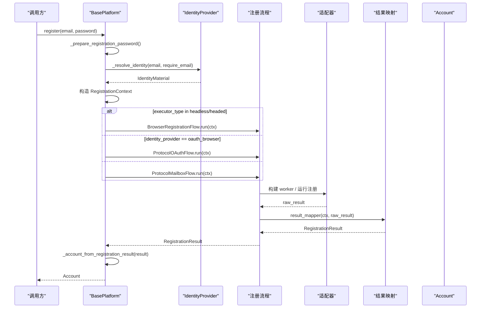
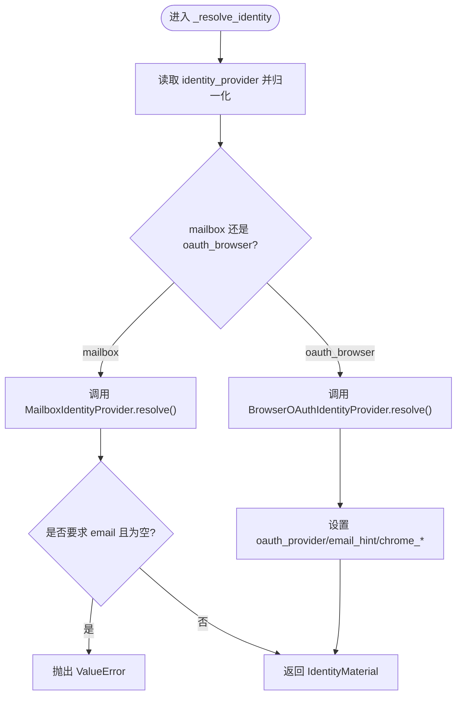
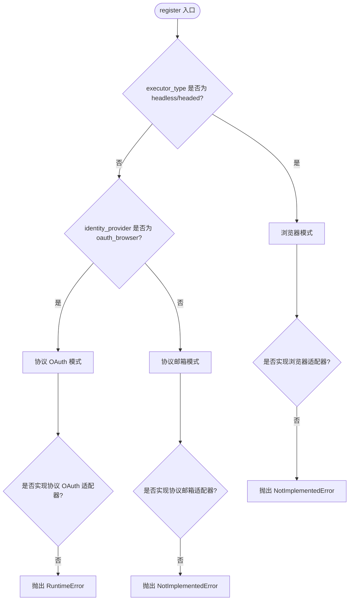
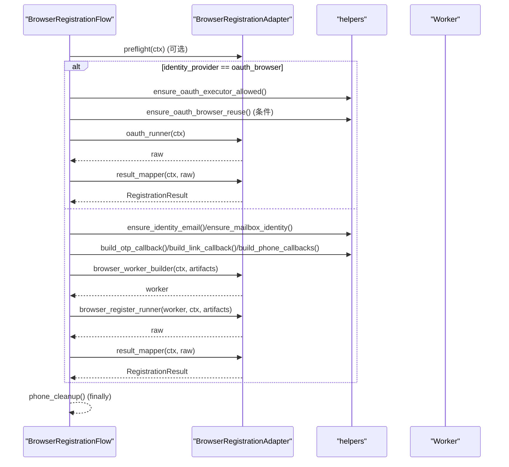
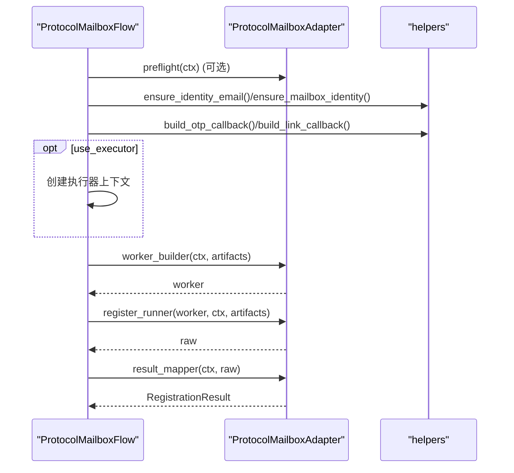
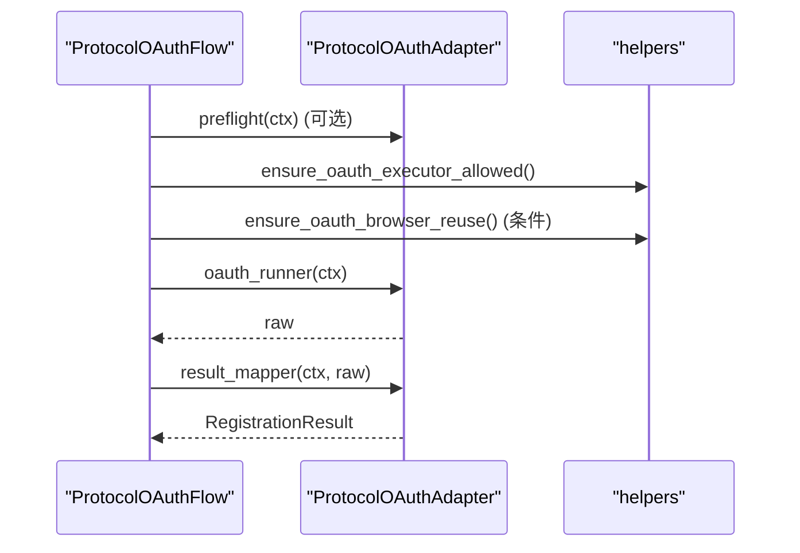
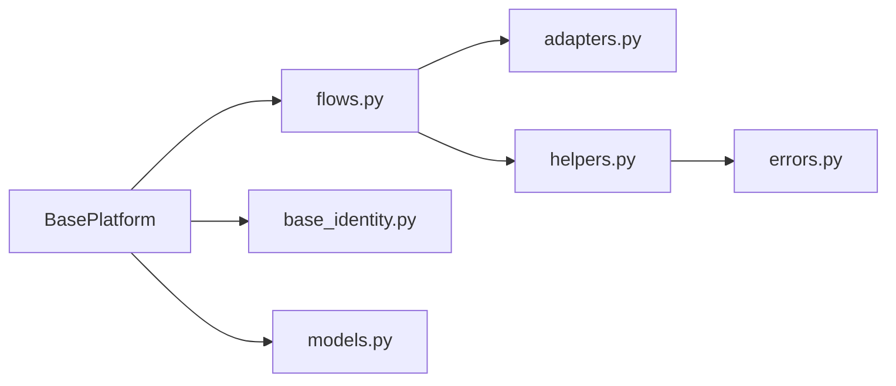

# 注册流程生命周期

<cite>
**本文引用的文件**
- [base_platform.py](file://core/base_platform.py)
- [flows.py](file://core/registration/flows.py)
- [adapters.py](file://core/registration/adapters.py)
- [models.py](file://core/registration/models.py)
- [helpers.py](file://core/registration/helpers.py)
- [errors.py](file://core/registration/errors.py)
- [base_identity.py](file://core/base_identity.py)
- [plugin.py（ChatGPT）](file://platforms/chatgpt/plugin.py)
</cite>

## 目录
1. [简介](#简介)
2. [项目结构](#项目结构)
3. [核心组件](#核心组件)
4. [架构总览](#架构总览)
5. [详细组件分析](#详细组件分析)
6. [依赖关系分析](#依赖关系分析)
7. [性能考虑](#性能考虑)
8. [故障排查指南](#故障排查指南)
9. [结论](#结论)
10. [附录](#附录)

## 简介
本文面向从调用 register() 到返回 Account 的完整注册生命周期，覆盖身份解析、执行器选择、适配器构建、三种注册流程（浏览器模式、协议邮箱、协议 OAuth）的执行步骤、上下文对象 RegistrationContext 的作用与数据结构、错误处理机制、调试技巧与日志分析方法。文档以代码为依据，提供流程图和时序图帮助理解数据流转与控制流。

## 项目结构
注册相关能力集中在 core/registration 模块，由 base_platform 作为入口统一编排；具体平台通过实现各自的适配器来定制行为。

图表来源
- [base_platform.py:124-160](file://core/base_platform.py#L124-L160)
- [flows.py:18-142](file://core/registration/flows.py#L18-L142)
- [adapters.py:27-59](file://core/registration/adapters.py#L27-L59)
- [models.py:17-66](file://core/registration/models.py#L17-L66)

章节来源
- [base_platform.py:124-160](file://core/base_platform.py#L124-L160)
- [flows.py:18-142](file://core/registration/flows.py#L18-L142)
- [adapters.py:27-59](file://core/registration/adapters.py#L27-L59)
- [models.py:17-66](file://core/registration/models.py#L17-L66)

## 核心组件
- BasePlatform.register：注册入口，负责密码准备、身份解析、上下文构造、执行器选择、流程调度与结果映射为 Account。
- 身份解析 _resolve_identity：根据 identity_provider 创建对应提供者并解析出 email、mailbox_account、oauth_provider、chrome_user_data_dir/chrome_cdp_url 等。
- 执行器选择：基于 executor_type 决定走浏览器模式或协议模式；当 identity_provider 为 oauth_browser 时优先走协议 OAuth。
- 适配器与流程：
  - BrowserRegistrationAdapter + BrowserRegistrationFlow：浏览器自动化注册或复用浏览器会话完成 OAuth。
  - ProtocolMailboxAdapter + ProtocolMailboxFlow：纯协议邮箱注册。
  - ProtocolOAuthAdapter + ProtocolOAuthFlow：协议级 OAuth 注册。
- 上下文与工件：
  - RegistrationContext：承载平台信息、配置、身份、日志函数等。
  - RegistrationArtifacts：在流程中传递 OTP/链接/短信回调、验证码求解器、执行器、原始结果等。
- 辅助工具：build_otp_callback/build_link_callback/build_phone_callbacks、ensure_* 校验、异常类型定义。

章节来源
- [base_platform.py:83-160](file://core/base_platform.py#L83-L160)
- [base_identity.py:76-130](file://core/base_identity.py#L76-L130)
- [flows.py:18-142](file://core/registration/flows.py#L18-L142)
- [adapters.py:27-59](file://core/registration/adapters.py#L27-L59)
- [models.py:17-66](file://core/registration/models.py#L17-L66)
- [helpers.py:23-177](file://core/registration/helpers.py#L23-L177)
- [errors.py:4-27](file://core/registration/errors.py#L4-L27)

## 架构总览
下图展示从 register() 到返回 Account 的整体控制流与关键分支。

图表来源
- [base_platform.py:124-160](file://core/base_platform.py#L124-L160)
- [flows.py:18-142](file://core/registration/flows.py#L18-L142)
- [adapters.py:27-59](file://core/registration/adapters.py#L27-L59)
- [models.py:17-66](file://core/registration/models.py#L17-L66)

## 详细组件分析

### 身份解析阶段（_resolve_identity）
- 依据 config.extra.identity_provider 归一化后选择 MailboxIdentityProvider 或 BrowserOAuthIdentityProvider。
- 邮箱模式：若未提供 email 且 mailbox provider 未返回可用邮箱，抛出异常；同时记录 before_ids 用于后续等待新邮件。
- OAuth 模式：解析 oauth_provider、email_hint、chrome_user_data_dir/chrome_cdp_url 等元信息。
- 若 require_email=True 且最终无 email，抛出 ValueError 提示需配置支持的 identity_provider 或传入 email。

图表来源
- [base_platform.py:436-459](file://core/base_platform.py#L436-L459)
- [base_identity.py:76-130](file://core/base_identity.py#L76-L130)

章节来源
- [base_platform.py:436-459](file://core/base_platform.py#L436-L459)
- [base_identity.py:76-130](file://core/base_identity.py#L76-L130)

### 执行器选择逻辑（浏览器模式 vs 协议模式）
- 若 executor_type 为 headless 或 headed：进入浏览器模式，需要平台实现 build_browser_registration_adapter，否则抛出不支持异常。
- 若 identity_provider 为 oauth_browser：进入协议 OAuth 流程，需要平台实现 build_protocol_oauth_adapter，否则报错。
- 否则：进入协议邮箱流程，需要平台实现 build_protocol_mailbox_adapter，否则抛出不支持异常。

图表来源
- [base_platform.py:124-160](file://core/base_platform.py#L124-L160)

章节来源
- [base_platform.py:124-160](file://core/base_platform.py#L124-L160)

### 适配器构建过程
- 浏览器模式适配器：包含 result_mapper、browser_worker_builder、browser_register_runner、可选 oauth_runner、capability、otp_spec/link_spec、use_captcha_for_mailbox、preflight。
- 协议邮箱适配器：包含 result_mapper、worker_builder、register_runner、capability、otp_spec/link_spec、use_captcha、use_executor、preflight。
- 协议 OAuth 适配器：包含 oauth_runner、result_mapper、capability、preflight。
- 平台侧示例（如 ChatGPT/Cursor/Trae）通过各自 plugin 实现上述适配器，注入平台特定的 worker 与 runner。

章节来源
- [adapters.py:27-59](file://core/registration/adapters.py#L27-L59)
- [plugin.py（ChatGPT）:160-187](file://platforms/chatgpt/plugin.py#L160-L187)
- [plugin.py（Cursor）:72-97](file://platforms/cursor/plugin.py#L72-L97)
- [plugin.py（Trae）:37-73](file://platforms/trae/plugin.py#L37-L73)

### 注册流程执行步骤

#### BrowserRegistrationFlow
- 可选 preflight。
- 若 identity_provider 为 oauth_browser：校验允许的执行器类型；若 headless 且 capability 要求复用浏览器会话，则检查 chrome_user_data_dir/chrome_cdp_url；若存在 oauth_runner，直接调用并映射结果。
- 否则按 capability 校验邮箱与 mailbox 可用性。
- 构建 RegistrationArtifacts：
  - 验证码求解器（可选）。
  - OTP 回调（根据 otp_spec）。
  - 验证链接回调（根据 link_spec）。
  - 手机号回调及清理函数（build_phone_callbacks）。
- 构建 worker 并执行 browser_register_runner，保存 raw_result，映射为 RegistrationResult。
- finally 确保 phone_cleanup 被调用。

图表来源
- [flows.py:18-79](file://core/registration/flows.py#L18-L79)
- [helpers.py:23-177](file://core/registration/helpers.py#L23-L177)

章节来源
- [flows.py:18-79](file://core/registration/flows.py#L18-L79)
- [helpers.py:23-177](file://core/registration/helpers.py#L23-L177)

#### ProtocolMailboxFlow
- 可选 preflight。
- 按 capability 校验邮箱与 mailbox 可用性。
- 构建 RegistrationArtifacts：验证码求解器（可选）、OTP/链接回调（可选）。
- 使用 use_executor 决定是否创建执行器上下文。
- 构建 worker 并执行 register_runner，保存 raw_result，映射为 RegistrationResult。

图表来源
- [flows.py:81-122](file://core/registration/flows.py#L81-L122)

章节来源
- [flows.py:81-122](file://core/registration/flows.py#L81-L122)

#### ProtocolOAuthFlow
- 可选 preflight。
- 校验允许的执行器类型。
- 若 headless 且 capability 要求复用浏览器会话，则检查可复用浏览器会话。
- 直接调用 oauth_runner 并映射结果。

图表来源
- [flows.py:124-142](file://core/registration/flows.py#L124-L142)

章节来源
- [flows.py:124-142](file://core/registration/flows.py#L124-L142)

### RegistrationContext 上下文对象
- 作用：贯穿注册流程，携带平台标识、显示名、平台实例、身份对象、配置、邮箱/密码、日志函数。
- 关键属性与方法：
  - executor_type：从 config.executor_type 获取，默认 protocol。
  - proxy：从 config.proxy 获取。
  - extra：从 config.extra 获取。
  - log(message)：统一日志输出。
- 典型用途：在 helpers 中用于构建 OTP/链接/短信回调、校验邮箱与 mailbox、打印日志。

章节来源
- [models.py:17-42](file://core/registration/models.py#L17-L42)
- [helpers.py:23-177](file://core/registration/helpers.py#L23-L177)

### 三种注册流程的区别与适用场景
- BrowserRegistrationFlow（浏览器模式）
  - 适用：需要浏览器自动化的平台，或需要复用本机浏览器登录态进行 OAuth 的场景。
  - 特点：支持 OTP/链接/短信回调；支持验证码求解；支持 headless/headed；对 OAuth 可强制要求复用浏览器会话。
- ProtocolMailboxFlow（协议邮箱模式）
  - 适用：可通过 HTTP/协议直接完成注册的邮箱账号场景。
  - 特点：轻量、无需浏览器；可结合验证码与 OTP/链接回调；可选择是否使用执行器。
- ProtocolOAuthFlow（协议 OAuth 模式）
  - 适用：通过第三方 OAuth 提供商完成注册/登录的场景。
  - 特点：受限于 allowed_executor_types；headless 下可能要求复用浏览器会话；流程最短，仅调用 oauth_runner。

章节来源
- [flows.py:18-142](file://core/registration/flows.py#L18-L142)
- [adapters.py:27-59](file://core/registration/adapters.py#L27-L59)

## 依赖关系分析
- BasePlatform 依赖 registration 模块的三类 Flow 与模型；各平台通过 plugin 实现适配器。
- flows 依赖 adapters 与 helpers；helpers 依赖 base_sms 与 infrastructure 仓库；errors 提供统一异常族。
- identity 抽象解耦邮箱与 OAuth 两种身份来源。

图表来源
- [base_platform.py:124-160](file://core/base_platform.py#L124-L160)
- [flows.py:1-16](file://core/registration/flows.py#L1-L16)
- [adapters.py:1-7](file://core/registration/adapters.py#L1-L7)
- [helpers.py:1-9](file://core/registration/helpers.py#L1-L9)
- [errors.py:1-27](file://core/registration/errors.py#L1-L27)
- [models.py:1-16](file://core/registration/models.py#L1-L16)

章节来源
- [base_platform.py:124-160](file://core/base_platform.py#L124-L160)
- [flows.py:1-16](file://core/registration/flows.py#L1-L16)
- [adapters.py:1-7](file://core/registration/adapters.py#L1-L7)
- [helpers.py:1-9](file://core/registration/helpers.py#L1-L9)
- [errors.py:1-27](file://core/registration/errors.py#L1-L27)
- [models.py:1-16](file://core/registration/models.py#L1-L16)

## 性能考虑
- 浏览器模式会启动浏览器进程，开销较大；在无头模式下应尽量避免频繁重启浏览器实例。
- 协议邮箱模式更轻量，适合批量注册。
- OTP/链接/短信回调涉及网络等待，合理设置超时与重试策略可降低失败率。
- 验证码求解器选择与回退策略会影响整体耗时，建议启用本地 solver 或高效远程服务。

[本节为通用指导，不直接分析具体文件]

## 故障排查指南
- 常见异常与定位
  - IdentityResolutionError：身份解析失败，检查 identity_provider 配置与 mailbox provider 状态。
  - CaptchaConfigurationError：验证码 provider 未配置或不可用，检查全局默认与任务参数。
  - OtpTimeoutError：OTP 等待超时，检查邮箱服务与 timeout 配置。
  - BrowserReuseRequiredError：无头 OAuth 缺少可复用浏览器会话，配置 chrome_user_data_dir 或 chrome_cdp_url。
  - RegistrationUnsupportedError：当前执行器不支持该注册路径，调整 executor_type 或 platform 能力。
- 日志分析要点
  - 使用 ctx.log 输出的“使用浏览器模式注册”、“等待验证码...”、“等待验证链接邮件...”、“phone_callback 已就绪”等关键日志定位阶段。
  - 关注 SMS provider 来源（任务参数/全局默认/历史兼容字段）与服务/国家配置是否正确。
  - 观察 Turnstile 验证码尝试与失败原因，确认 provider 列表与认证字段是否齐全。
- 调试技巧
  - 在平台 plugin 中为 result_mapper 增加断点，查看 raw_result 结构。
  - 临时将 executor_type 切换为 headed 以便可视化浏览器操作。
  - 使用最小化配置复现问题：关闭多余回调（如短信），逐步启用功能定位瓶颈。

章节来源
- [errors.py:4-27](file://core/registration/errors.py#L4-L27)
- [helpers.py:75-147](file://core/registration/helpers.py#L75-L147)
- [base_platform.py:316-430](file://core/base_platform.py#L316-L430)

## 结论
注册流程以 BasePlatform.register 为入口，通过身份解析与执行器选择分派到三类流程之一。适配器将平台特定逻辑封装为可插拔组件，流程层负责组装回调、校验与资源管理，最终将 RegistrationResult 转换为 Account。清晰的上下文与工件设计使流程具备高扩展性与可观测性。

[本节为总结性内容，不直接分析具体文件]

## 附录
- 关键类与职责速查
  - BasePlatform：注册入口、执行器选择、结果映射为 Account。
  - BrowserRegistrationFlow/ProtocolMailboxFlow/ProtocolOAuthFlow：分别实现浏览器、协议邮箱、协议 OAuth 注册。
  - BrowserRegistrationAdapter/ProtocolMailboxAdapter/ProtocolOAuthAdapter：平台适配器的数据结构定义。
  - RegistrationContext/RegistrationArtifacts/RegistrationResult：上下文、工件与结果的数据载体。
  - helpers：OTP/链接/短信回调构建与前置校验。
  - errors：注册流程异常体系。

章节来源
- [base_platform.py:124-160](file://core/base_platform.py#L124-L160)
- [flows.py:18-142](file://core/registration/flows.py#L18-L142)
- [adapters.py:27-59](file://core/registration/adapters.py#L27-L59)
- [models.py:17-66](file://core/registration/models.py#L17-L66)
- [helpers.py:23-177](file://core/registration/helpers.py#L23-L177)
- [errors.py:4-27](file://core/registration/errors.py#L4-L27)