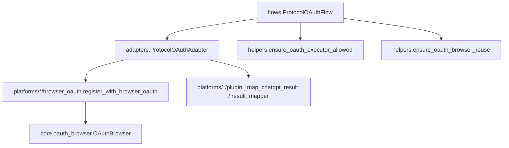
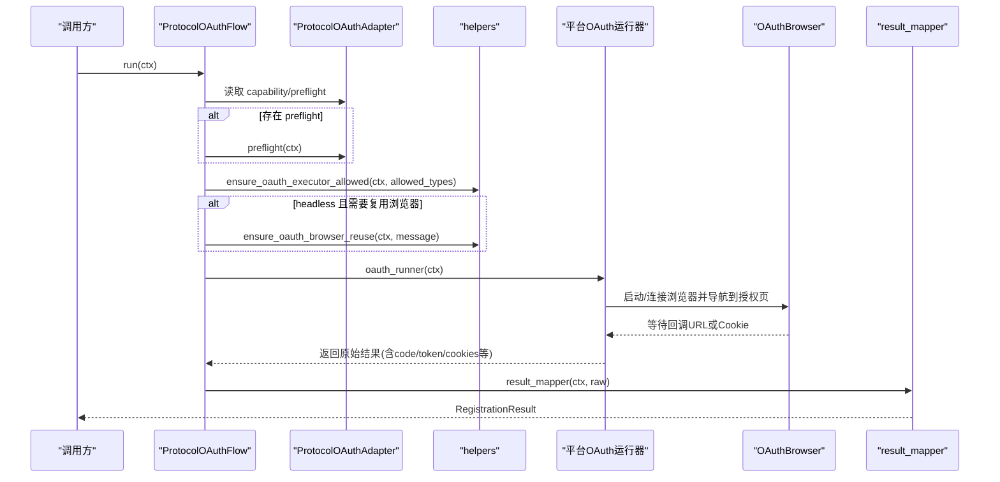
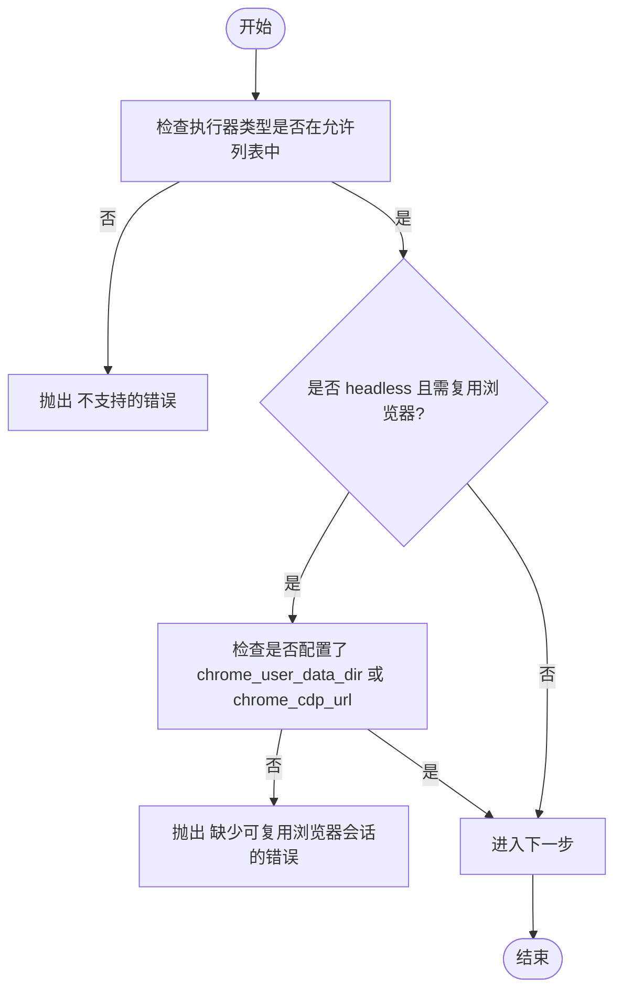
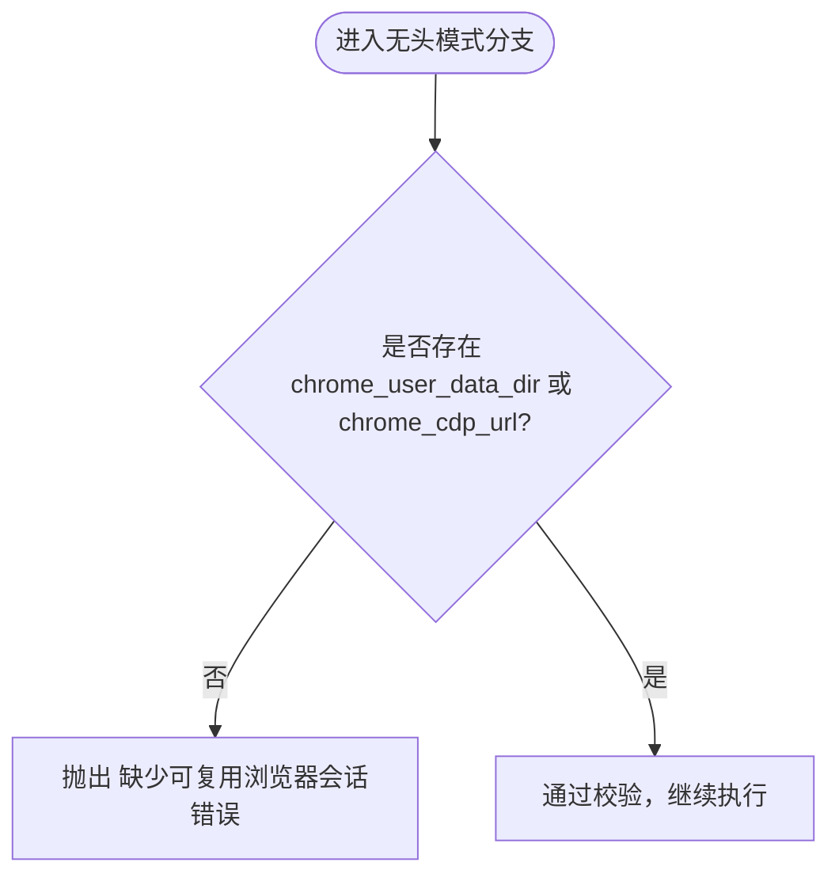
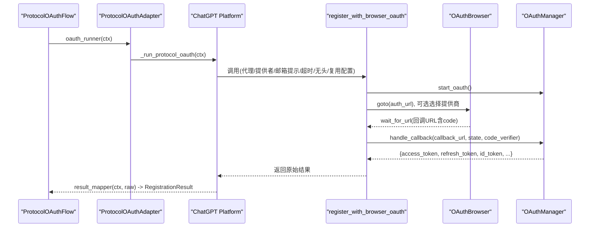
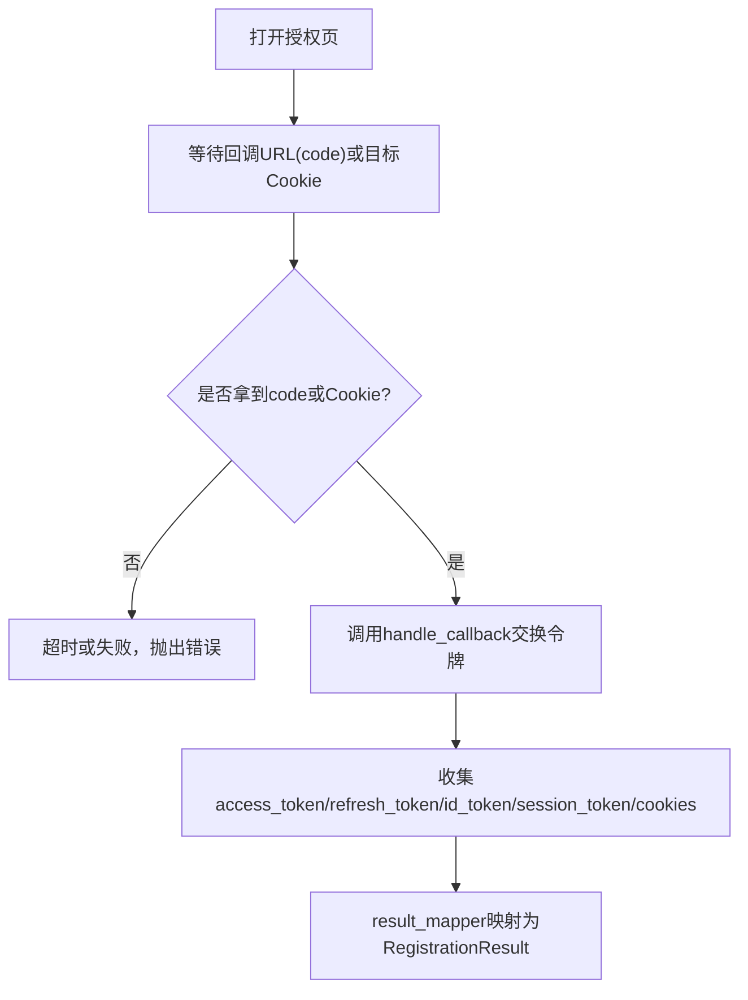
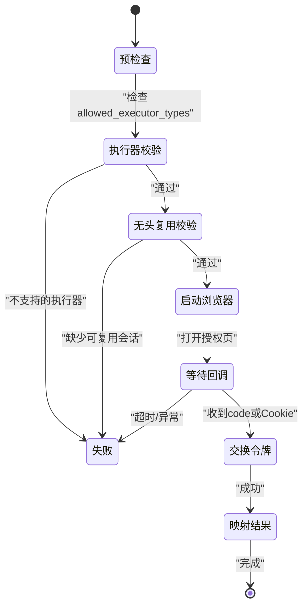
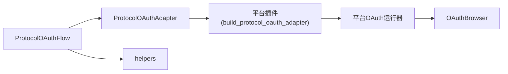

# 协议OAuth流程

<cite>
**本文引用的文件**
- [flows.py](file://core/registration/flows.py)
- [adapters.py](file://core/registration/adapters.py)
- [helpers.py](file://core/registration/helpers.py)
- [models.py](file://core/registration/models.py)
- [errors.py](file://core/registration/errors.py)
- [oauth_browser.py](file://core/oauth_browser.py)
- [browser_oauth.py（ChatGPT）](file://platforms/chatgpt/browser_oauth.py)
- [plugin.py（ChatGPT平台）](file://platforms/chatgpt/plugin.py)
- [browser_oauth.py（Cursor）](file://platforms/cursor/browser_oauth.py)
</cite>

## 目录
1. [简介](#简介)
2. [项目结构](#项目结构)
3. [核心组件](#核心组件)
4. [架构总览](#架构总览)
5. [详细组件分析](#详细组件分析)
6. [依赖关系分析](#依赖关系分析)
7. [性能考虑](#性能考虑)
8. [故障排查指南](#故障排查指南)
9. [结论](#结论)
10. [附录](#附录)

## 简介
本文档围绕 ProtocolOAuthFlow 的 OAuth 认证注册流程，系统化说明预检查阶段的 OAuth 能力验证与执行器类型检查、无头模式下浏览器会话复用要求与校验机制、OAuth 运行器的调用过程与令牌交换逻辑、授权码获取/存储/使用全流程、错误处理与重试策略，并提供时序图与状态转换图。同时给出具体平台的适配器实现示例与配置参数说明，帮助读者快速理解并落地使用。

## 项目结构
ProtocolOAuthFlow 位于注册流程层，负责编排“协议式 OAuth”注册：先进行能力与执行器校验，再调用平台提供的 OAuth 运行器完成授权码交换与结果映射。其关键文件与职责如下：
- flows.py：定义 ProtocolOAuthFlow 主流程入口
- adapters.py：定义 ProtocolOAuthAdapter 数据类，承载 oauth_runner、result_mapper、capability 等
- models.py：定义 RegistrationCapability、RegistrationContext、RegistrationResult 等模型
- helpers.py：提供 ensure_oauth_executor_allowed、ensure_oauth_browser_reuse 等前置校验工具
- errors.py：定义注册相关异常类型
- core/oauth_browser.py：共享的 OAuth 浏览器辅助，支持 Playwright/Chrome Profile/CDP 三种模式
- platforms/*/browser_oauth.py：各平台的具体 OAuth 浏览器流程实现
- platforms/*/plugin.py：平台插件中构建 ProtocolOAuthAdapter 并注入运行时参数

图表来源
- [flows.py:124-142](file://core/registration/flows.py#L124-L142)
- [adapters.py:53-59](file://core/registration/adapters.py#L53-L59)
- [helpers.py:33-43](file://core/registration/helpers.py#L33-L43)
- [browser_oauth.py（ChatGPT）:44-110](file://platforms/chatgpt/browser_oauth.py#L44-L110)
- [oauth_browser.py:139-200](file://core/oauth_browser.py#L139-L200)
- [plugin.py（ChatGPT平台）:179-183](file://platforms/chatgpt/plugin.py#L179-L183)

章节来源
- [flows.py:124-142](file://core/registration/flows.py#L124-L142)
- [adapters.py:53-59](file://core/registration/adapters.py#L53-L59)
- [models.py:7-15](file://core/registration/models.py#L7-L15)
- [helpers.py:33-43](file://core/registration/helpers.py#L33-L43)
- [errors.py:4-27](file://core/registration/errors.py#L4-L27)
- [oauth_browser.py:139-200](file://core/oauth_browser.py#L139-L200)
- [browser_oauth.py（ChatGPT）:44-110](file://platforms/chatgpt/browser_oauth.py#L44-L110)
- [plugin.py（ChatGPT平台）:179-183](file://platforms/chatgpt/plugin.py#L179-L183)

## 核心组件
- ProtocolOAuthFlow：协议式 OAuth 注册流程编排器，负责预检查与调用平台 OAuth 运行器
- ProtocolOAuthAdapter：平台适配器的声明式容器，包含 oauth_runner、result_mapper、capability、preflight
- RegistrationCapability：声明平台对 OAuth 的能力约束（如允许的执行器类型、无头模式是否必须复用浏览器）
- RegistrationContext：注册上下文，携带平台、身份、配置、日志函数等
- RegistrationResult：注册结果统一输出（邮箱、密码、用户ID、区域、token、状态、扩展字段）
- OAuthBrowser：跨平台 OAuth 浏览器封装，支持普通 Playwright、Chrome 用户数据目录、CDP 连接已运行 Chrome
- 平台 OAuth 运行器：如 ChatGPT/Cursor 的 register_with_browser_oauth，负责打开授权页、等待回调、交换令牌、提取会话信息

章节来源
- [flows.py:124-142](file://core/registration/flows.py#L124-L142)
- [adapters.py:53-59](file://core/registration/adapters.py#L53-L59)
- [models.py:7-15](file://core/registration/models.py#L7-L15)
- [models.py:17-42](file://core/registration/models.py#L17-L42)
- [models.py:44-66](file://core/registration/models.py#L44-L66)
- [oauth_browser.py:139-200](file://core/oauth_browser.py#L139-L200)
- [browser_oauth.py（ChatGPT）:44-110](file://platforms/chatgpt/browser_oauth.py#L44-L110)

## 架构总览
ProtocolOAuthFlow 在运行时会依次执行：
1. 可选 preflight 钩子（由平台自定义）
2. 执行器类型白名单校验（通过 capability.oauth_allowed_executor_types）
3. 无头模式下的浏览器会话复用校验（当 capability.oauth_headless_requires_browser_reuse 为真且 executor_type=headless）
4. 调用平台实现的 oauth_runner（通常是浏览器驱动的 OAuth 流程）
5. 将原始结果经 result_mapper 转换为统一的 RegistrationResult

图表来源
- [flows.py:124-142](file://core/registration/flows.py#L124-L142)
- [adapters.py:53-59](file://core/registration/adapters.py#L53-L59)
- [helpers.py:33-43](file://core/registration/helpers.py#L33-L43)
- [browser_oauth.py（ChatGPT）:44-110](file://platforms/chatgpt/browser_oauth.py#L44-L110)
- [oauth_browser.py:139-200](file://core/oauth_browser.py#L139-L200)
- [plugin.py（ChatGPT平台）:179-183](file://platforms/chatgpt/plugin.py#L179-L183)

## 详细组件分析

### 预检查阶段：OAuth 能力验证与执行器类型检查
- 能力来源：Platform 通过 RegistrationCapability 声明 oauth_allowed_executor_types、oauth_headless_requires_browser_reuse 等约束
- 执行器类型检查：ensure_oauth_executor_allowed 根据 ctx.executor_type 与 allowed types 进行匹配，不匹配则抛出 RegistrationUnsupportedError
- 无头模式浏览器复用检查：当 capability.oauth_headless_requires_browser_reuse 为真且 ctx.executor_type == "headless" 时，调用 ensure_oauth_browser_reuse，若 identity 未配置 chrome_user_data_dir 或 chrome_cdp_url，则抛出 BrowserReuseRequiredError

图表来源
- [flows.py:128-139](file://core/registration/flows.py#L128-L139)
- [helpers.py:33-43](file://core/registration/helpers.py#L33-L43)
- [errors.py:20-26](file://core/registration/errors.py#L20-L26)

章节来源
- [flows.py:128-139](file://core/registration/flows.py#L128-L139)
- [helpers.py:33-43](file://core/registration/helpers.py#L33-L43)
- [errors.py:20-26](file://core/registration/errors.py#L20-L26)
- [models.py:7-15](file://core/registration/models.py#L7-L15)

### 无头模式下浏览器会话复用的配置要求与验证机制
- 配置项：identity.chrome_user_data_dir 或 identity.chrome_cdp_url
- 检测逻辑：has_reusable_oauth_browser 判断任一配置非空即认为具备复用条件
- 触发条件：当 capability.oauth_headless_requires_browser_reuse 为真且 executor_type=headless 时强制校验
- 失败处理：抛出 BrowserReuseRequiredError，提示需配置本地已登录浏览器的用户数据目录或 CDP 地址

图表来源
- [helpers.py:11-13](file://core/registration/helpers.py#L11-L13)
- [helpers.py:41-43](file://core/registration/helpers.py#L41-L43)
- [flows.py:135-139](file://core/registration/flows.py#L135-L139)
- [errors.py:20-22](file://core/registration/errors.py#L20-L22)

章节来源
- [helpers.py:11-13](file://core/registration/helpers.py#L11-L13)
- [helpers.py:41-43](file://core/registration/helpers.py#L41-L43)
- [flows.py:135-139](file://core/registration/flows.py#L135-L139)
- [errors.py:20-22](file://core/registration/errors.py#L20-L22)

### OAuth 运行器的调用过程与令牌交换逻辑
以 ChatGPT 为例：
- 平台插件构建 ProtocolOAuthAdapter，注入 _run_protocol_oauth 作为 oauth_runner，以及 _map_chatgpt_result 作为 result_mapper
- _run_protocol_oauth 调用 platforms.chatgpt.browser_oauth.register_with_browser_oauth，传入代理、oauth_provider、email_hint、timeout、headless、chrome_user_data_dir/chrome_cdp_url
- register_with_browser_oauth 内部：
  - 初始化 OAuthManager 发起授权请求，得到 auth_url、redirect_uri、state、code_verifier
  - 使用 OAuthBrowser 打开授权页，必要时自动选择 Google 账户
  - 等待回调 URL 中包含 code 参数
  - 调用 manager.handle_callback 用 code + state + code_verifier 交换 access_token/refresh_token/id_token
  - 拉取用户资料，最终汇总 email、access_token、refresh_token、id_token、session_token、cookies 等
- result_mapper 将原始结果映射为 RegistrationResult，填充 token、extra 等字段

图表来源
- [plugin.py（ChatGPT平台）:146-183](file://platforms/chatgpt/plugin.py#L146-L183)
- [browser_oauth.py（ChatGPT）:44-110](file://platforms/chatgpt/browser_oauth.py#L44-L110)
- [oauth_browser.py:139-200](file://core/oauth_browser.py#L139-L200)

章节来源
- [plugin.py（ChatGPT平台）:146-183](file://platforms/chatgpt/plugin.py#L146-L183)
- [browser_oauth.py（ChatGPT）:44-110](file://platforms/chatgpt/browser_oauth.py#L44-L110)
- [oauth_browser.py:139-200](file://core/oauth_browser.py#L139-L200)

### 授权码获取、存储与使用的完整流程
- 获取：OAuthBrowser.wait_for_url 监听回调 URL，直到出现 code 参数；或在某些平台直接等待 Cookie（如 Cursor 的 WorkosCursorSessionToken）
- 存储：原始结果中通常包含 access_token、refresh_token、id_token、session_token、cookies 等，由 result_mapper 写入 RegistrationResult.extra
- 使用：后续业务通过 RegistrationResult.token/extra 中的 token 访问平台 API；cookies/session_token 用于维持会话

图表来源
- [browser_oauth.py（ChatGPT）:78-90](file://platforms/chatgpt/browser_oauth.py#L78-L90)
- [browser_oauth.py（Cursor）:47-61](file://platforms/cursor/browser_oauth.py#L47-L61)
- [plugin.py（ChatGPT平台）:127-144](file://platforms/chatgpt/plugin.py#L127-L144)

章节来源
- [browser_oauth.py（ChatGPT）:78-90](file://platforms/chatgpt/browser_oauth.py#L78-L90)
- [browser_oauth.py（Cursor）:47-61](file://platforms/cursor/browser_oauth.py#L47-L61)
- [plugin.py（ChatGPT平台）:127-144](file://platforms/chatgpt/plugin.py#L127-L144)

### 错误处理与重试机制
- 错误类型：
  - IdentityResolutionError：身份解析失败（如缺少邮箱）
  - OtpTimeoutError：验证码等待超时
  - BrowserReuseRequiredError：无头模式缺少可复用浏览器会话
  - RegistrationUnsupportedError：当前执行器不被支持
- 触发点：
  - 执行器类型不匹配：ensure_oauth_executor_allowed
  - 无头模式复用缺失：ensure_oauth_browser_reuse
  - 浏览器登录超时：平台 OAuth 运行器内抛出 RuntimeError（例如未在超时时间内完成）
- 重试建议：
  - 针对网络抖动或临时不可用，可在上层调用处捕获异常并重试
  - 对于 BrowserReuseRequiredError，应修正配置（补充 chrome_user_data_dir 或 chrome_cdp_url）
  - 对于超时错误，可增加 timeout 或优化网络环境

章节来源
- [errors.py:4-27](file://core/registration/errors.py#L4-L27)
- [helpers.py:33-43](file://core/registration/helpers.py#L33-L43)
- [browser_oauth.py（ChatGPT）:82-83](file://platforms/chatgpt/browser_oauth.py#L82-L83)
- [browser_oauth.py（Cursor）:52-53](file://platforms/cursor/browser_oauth.py#L52-L53)

### 状态转换图（注册流程）

图表来源
- [flows.py:128-141](file://core/registration/flows.py#L128-L141)
- [helpers.py:33-43](file://core/registration/helpers.py#L33-L43)
- [browser_oauth.py（ChatGPT）:78-90](file://platforms/chatgpt/browser_oauth.py#L78-L90)

## 依赖关系分析
- ProtocolOAuthFlow 依赖 adapters 中的 ProtocolOAuthAdapter 与 helpers 中的校验函数
- 平台插件通过 build_protocol_oauth_adapter 注入具体的 oauth_runner 与 result_mapper
- OAuthBrowser 作为底层浏览器抽象，被各平台 browser_oauth 模块复用
- RegistrationCapability 控制流程行为（执行器限制、无头复用要求）

图表来源
- [flows.py:124-142](file://core/registration/flows.py#L124-L142)
- [adapters.py:53-59](file://core/registration/adapters.py#L53-L59)
- [plugin.py（ChatGPT平台）:179-183](file://platforms/chatgpt/plugin.py#L179-L183)
- [oauth_browser.py:139-200](file://core/oauth_browser.py#L139-L200)

章节来源
- [flows.py:124-142](file://core/registration/flows.py#L124-L142)
- [adapters.py:53-59](file://core/registration/adapters.py#L53-L59)
- [plugin.py（ChatGPT平台）:179-183](file://platforms/chatgpt/plugin.py#L179-L183)
- [oauth_browser.py:139-200](file://core/oauth_browser.py#L139-L200)

## 性能考虑
- 浏览器复用：优先使用 chrome_user_data_dir 或 CDP 连接已登录浏览器，减少重复登录开销
- 超时配置：合理设置 browser_oauth_timeout/manual_oauth_timeout，避免长时间阻塞
- 代理配置：为浏览器与HTTP请求配置合适的代理，降低网络延迟与封禁风险
- 资源释放：确保浏览器上下文正确关闭，避免残留进程占用资源

[本节为通用指导，不直接分析具体文件]

## 故障排查指南
- 执行器类型不支持：检查 platform.supported_executors 与任务配置的 executor_type，确保在允许列表内
- 无头模式无法复用：确认 identity 中配置了 chrome_user_data_dir 或 chrome_cdp_url，并确保本地 Chrome 已登录目标账号
- 授权回调超时：检查网络连通性、代理配置、回调域名是否正确，适当增加 timeout
- 邮箱不一致：若传入了 email_hint，需确保实际登录邮箱与之一致，否则 finalize_oauth_email 会报错
- 结果不完整：平台 result_mapper 会校验必要字段（如 account_id、access_token），缺失将抛出错误

章节来源
- [errors.py:4-27](file://core/registration/errors.py#L4-L27)
- [helpers.py:48-60](file://core/registration/helpers.py#L48-L60)
- [browser_oauth.py（ChatGPT）:82-83](file://platforms/chatgpt/browser_oauth.py#L82-L83)
- [browser_oauth.py（Cursor）:52-53](file://platforms/cursor/browser_oauth.py#L52-L53)
- [plugin.py（ChatGPT平台）:16-24](file://platforms/chatgpt/plugin.py#L16-L24)

## 结论
ProtocolOAuthFlow 提供了标准化的协议式 OAuth 注册流程，通过能力声明与前置校验保证执行环境与平台约束一致，结合可复用的浏览器会话显著提升了无头模式的稳定性与效率。平台侧只需实现 oauth_runner 与 result_mapper，即可无缝接入统一流程。推荐在生产环境中启用浏览器会话复用、合理配置超时与代理，并在上层实现健壮的重试与错误恢复机制。

[本节为总结，不直接分析具体文件]

## 附录

### 配置参数说明
- executor_type：执行器类型，常见值包括 protocol、headless、headed
- proxy：代理地址，可为 HTTP/HTTPS 代理字符串
- extra：额外参数，如 browser_oauth_timeout、manual_oauth_timeout、sms_provider、phone_country 等
- identity.chrome_user_data_dir：本地 Chrome 用户数据目录路径，用于复用已登录会话
- identity.chrome_cdp_url：Chrome 远程调试端口地址，用于连接已运行的 Chrome
- identity.oauth_provider：OAuth 提供方，如 google、microsoft、github 等
- identity.email/email_hint：期望登录邮箱，用于一致性校验与提示

章节来源
- [models.py:17-42](file://core/registration/models.py#L17-L42)
- [helpers.py:75-147](file://core/registration/helpers.py#L75-L147)
- [oauth_browser.py:139-200](file://core/oauth_browser.py#L139-L200)

### 适配器实现示例（ChatGPT）
- 平台插件通过 build_protocol_oauth_adapter 返回 ProtocolOAuthAdapter，注入：
  - oauth_runner：_run_protocol_oauth，调用 platforms.chatgpt.browser_oauth.register_with_browser_oauth
  - result_mapper：_map_chatgpt_result，将原始结果映射为 RegistrationResult
  - capability：可声明 oauth_headless_requires_browser_reuse=True 等约束

章节来源
- [plugin.py（ChatGPT平台）:179-183](file://platforms/chatgpt/plugin.py#L179-L183)
- [plugin.py（ChatGPT平台）:127-144](file://platforms/chatgpt/plugin.py#L127-L144)

### 适配器实现示例（Cursor）
- Cursor 的 browser_oauth 直接等待特定 Cookie（WorkosCursorSessionToken），随后调用 get_cursor_user_info 获取用户信息，并返回 email、token、user_info
- 适用于无需显式回调 URL 的 OAuth 场景

章节来源
- [browser_oauth.py（Cursor）:13-61](file://platforms/cursor/browser_oauth.py#L13-L61)