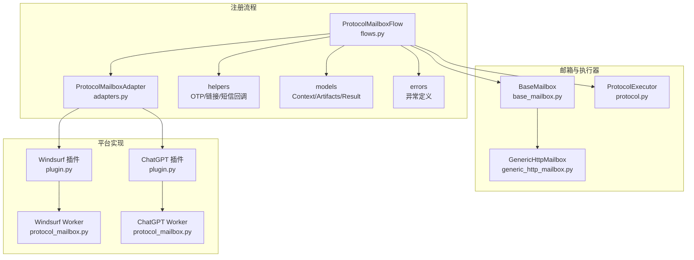
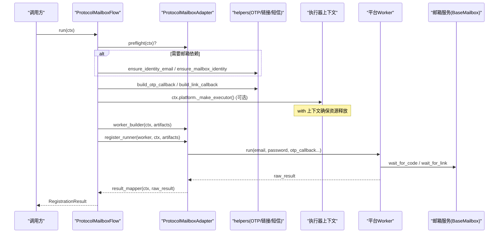
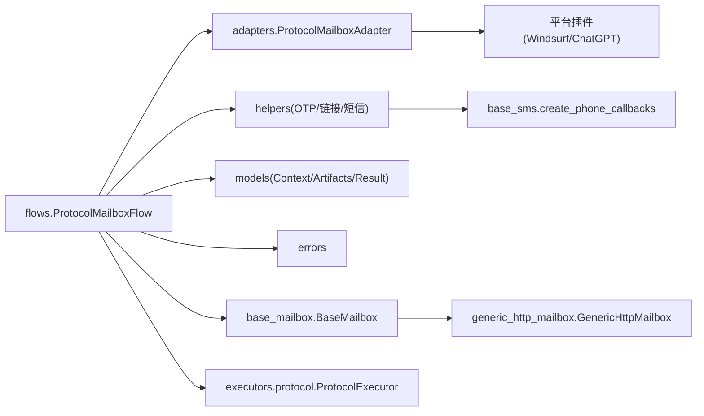
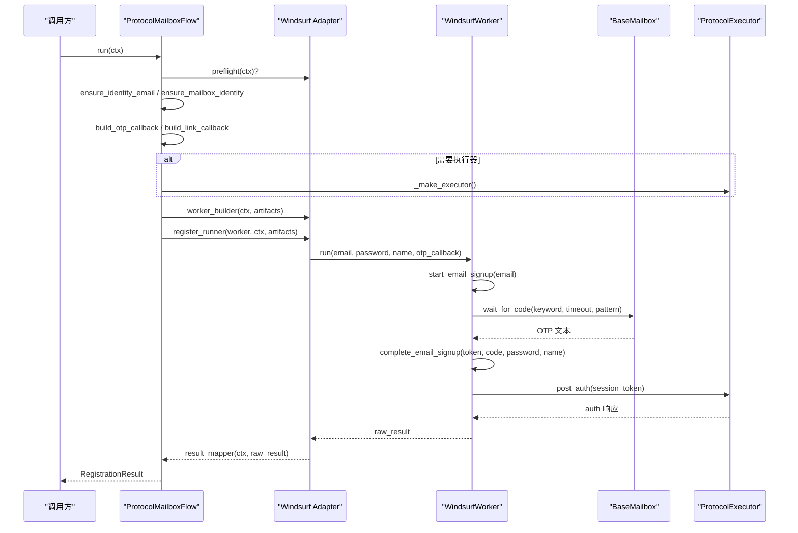
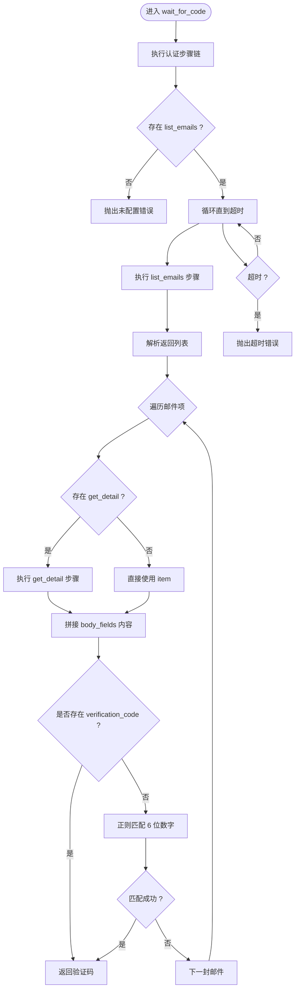

# 协议邮箱注册流程

<cite>
**本文引用的文件**
- [flows.py](file://core/registration/flows.py)
- [adapters.py](file://core/registration/adapters.py)
- [helpers.py](file://core/registration/helpers.py)
- [models.py](file://core/registration/models.py)
- [errors.py](file://core/registration/errors.py)
- [base_mailbox.py](file://core/base_mailbox.py)
- [generic_http_mailbox.py](file://core/generic_http_mailbox.py)
- [protocol.py](file://core/executors/protocol.py)
- [plugin.py](file://platforms/windsurf/plugin.py)
- [protocol_mailbox.py](file://platforms/windsurf/protocol_mailbox.py)
- [plugin.py](file://platforms/chatgpt/plugin.py)
- [protocol_mailbox.py](file://platforms/chatgpt/protocol_mailbox.py)
</cite>

## 目录
1. [简介](#简介)
2. [项目结构](#项目结构)
3. [核心组件](#核心组件)
4. [架构总览](#架构总览)
5. [详细组件分析](#详细组件分析)
6. [依赖关系分析](#依赖关系分析)
7. [性能与可靠性](#性能与可靠性)
8. [故障排查指南](#故障排查指南)
9. [结论](#结论)
10. [附录：HTTP请求序列图与响应处理流程图](#附录http请求序列图与响应处理流程图)

## 简介
本文件面向“协议邮箱注册”场景，系统性说明 ProtocolMailboxFlow 的 HTTP 协议注册过程。重点覆盖：
- 预检查阶段的邮箱依赖验证与 mailbox 提供商配置检查
- 注册执行器的创建与管理（上下文管理器）
- worker 构建器调用与注册运行器执行逻辑
- 验证码处理器集成与 OTP 验证链接回调机制
- 执行器上下文的资源管理与清理
- HTTP 请求序列图与响应处理流程图
- 具体适配器实现示例与错误处理策略

## 项目结构
围绕协议邮箱注册的关键代码分布在以下模块：
- 流程编排：core/registration/flows.py
- 适配器契约：core/registration/adapters.py
- 辅助工具（OTP、链接、短信等回调构建）：core/registration/helpers.py
- 数据模型（上下文、产物、结果、能力声明）：core/registration/models.py
- 异常类型：core/registration/errors.py
- 邮箱抽象与通用 HTTP 驱动：core/base_mailbox.py, core/generic_http_mailbox.py
- 纯协议执行器（基于 curl_cffi）：core/executors/protocol.py
- 平台侧适配器与 Worker 示例：platforms/windsurf/*, platforms/chatgpt/*

图表来源
- [flows.py:81-121](file://core/registration/flows.py#L81-L121)
- [adapters.py:40-50](file://core/registration/adapters.py#L40-L50)
- [helpers.py:46-177](file://core/registration/helpers.py#L46-L177)
- [models.py:7-66](file://core/registration/models.py#L7-L66)
- [base_mailbox.py:27-49](file://core/base_mailbox.py#L27-L49)
- [generic_http_mailbox.py:75-474](file://core/generic_http_mailbox.py#L75-L474)
- [protocol.py:6-45](file://core/executors/protocol.py#L6-L45)
- [plugin.py:94-119](file://platforms/windsurf/plugin.py#L94-L119)
- [protocol_mailbox.py:10-83](file://platforms/windsurf/protocol_mailbox.py#L10-L83)
- [plugin.py:189-225](file://platforms/chatgpt/plugin.py#L189-L225)
- [protocol_mailbox.py:36-65](file://platforms/chatgpt/protocol_mailbox.py#L36-L65)

章节来源
- [flows.py:81-121](file://core/registration/flows.py#L81-L121)
- [adapters.py:40-50](file://core/registration/adapters.py#L40-L50)
- [helpers.py:46-177](file://core/registration/helpers.py#L46-L177)
- [models.py:7-66](file://core/registration/models.py#L7-L66)
- [base_mailbox.py:27-49](file://core/base_mailbox.py#L27-L49)
- [generic_http_mailbox.py:75-474](file://core/generic_http_mailbox.py#L75-L474)
- [protocol.py:6-45](file://core/executors/protocol.py#L6-L45)
- [plugin.py:94-119](file://platforms/windsurf/plugin.py#L94-L119)
- [protocol_mailbox.py:10-83](file://platforms/windsurf/protocol_mailbox.py#L10-L83)
- [plugin.py:189-225](file://platforms/chatgpt/plugin.py#L189-L225)
- [protocol_mailbox.py:36-65](file://platforms/chatgpt/protocol_mailbox.py#L36-L65)

## 核心组件
- ProtocolMailboxFlow：编排协议邮箱注册全流程，负责预检查、回调装配、执行器上下文管理、worker 构建与运行、结果映射。
- ProtocolMailboxAdapter：平台注册的适配器契约，声明能力、是否使用验证码/执行器、以及 worker_builder/register_runner/result_mapper。
- helpers：提供 OTP 回调、验证链接回调、短信回调的构建；身份与邮箱依赖校验。
- models：RegistrationContext（上下文）、RegistrationArtifacts（中间产物）、RegistrationResult（最终结果）、RegistrationCapability（能力声明）。
- base_mailbox/GenericHttpMailbox：邮箱抽象与通用 HTTP 驱动，支持通过配置描述端点、认证、列表、详情、提取字段等。
- ProtocolExecutor：基于 curl_cffi 的轻量 HTTP 客户端，封装会话、代理、UA、Cookie 等。
- 平台示例：Windsurf、ChatGPT 分别给出 adapter 与 worker 的具体实现。

章节来源
- [flows.py:81-121](file://core/registration/flows.py#L81-L121)
- [adapters.py:40-50](file://core/registration/adapters.py#L40-L50)
- [helpers.py:23-177](file://core/registration/helpers.py#L23-L177)
- [models.py:7-66](file://core/registration/models.py#L7-L66)
- [base_mailbox.py:27-49](file://core/base_mailbox.py#L27-L49)
- [generic_http_mailbox.py:75-474](file://core/generic_http_mailbox.py#L75-L474)
- [protocol.py:6-45](file://core/executors/protocol.py#L6-L45)
- [plugin.py:94-119](file://platforms/windsurf/plugin.py#L94-L119)
- [protocol_mailbox.py:10-83](file://platforms/windsurf/protocol_mailbox.py#L10-L83)
- [plugin.py:189-225](file://platforms/chatgpt/plugin.py#L189-L225)
- [protocol_mailbox.py:36-65](file://platforms/chatgpt/protocol_mailbox.py#L36-L65)

## 架构总览
ProtocolMailboxFlow 作为统一入口，将平台无关的流程控制与平台特定的 worker 解耦。整体时序如下：

图表来源
- [flows.py:81-121](file://core/registration/flows.py#L81-L121)
- [helpers.py:46-177](file://core/registration/helpers.py#L46-L177)
- [base_mailbox.py:27-49](file://core/base_mailbox.py#L27-L49)
- [protocol.py:6-45](file://core/executors/protocol.py#L6-L45)

## 详细组件分析

### 预检查阶段：邮箱依赖验证与提供商配置检查
- 能力声明：RegistrationCapability 中 protocol_mailbox_requires_email/protocol_mailbox_requires_mailbox 控制是否需要邮箱地址与 mailbox 账号。
- 预检查动作：
  - ensure_identity_email：若未提供 identity.email，抛出 IdentityResolutionError。
  - ensure_mailbox_identity：若 identity.has_mailbox 为假，抛出 IdentityResolutionError。
- 这些检查在 Platform 的 adapter 中通过 capability 配置，从而对不同平台进行差异化约束。

章节来源
- [models.py:7-15](file://core/registration/models.py#L7-L15)
- [helpers.py:23-31](file://core/registration/helpers.py#L23-L31)
- [flows.py:85-91](file://core/registration/flows.py#L85-L91)

### 注册执行器的创建与管理（上下文管理器）
- 当 adapter.use_executor=True 时，流程通过 ctx.platform._make_executor() 获取执行器，并使用 Python 上下文管理器 with 包裹，确保关闭连接、释放资源。
- 执行器对象会被注入到 artifacts.executor，供平台 worker 使用（例如 Tavily/Tray 等需要 HTTP 客户端的场景）。
- 若不需要执行器，则使用 nullcontext(None)，避免不必要的开销。

章节来源
- [flows.py:115-121](file://core/registration/flows.py#L115-L121)
- [protocol.py:6-45](file://core/executors/protocol.py#L6-L45)

### worker 构建器与注册运行器执行逻辑
- 平台通过 ProtocolMailboxAdapter 提供：
  - worker_builder(ctx, artifacts)：构造平台特定的 worker（如 WindsurfProtocolMailboxWorker、TavilyProtocolMailboxWorker）。
  - register_runner(worker, ctx, artifacts)：执行注册流程，通常调用 worker.run(...)。
  - result_mapper(ctx, raw)：将原始结果映射为标准 RegistrationResult。
- 流程在 with executor_cm 内调用 worker_builder 与 register_runner，保证执行期资源受控。

章节来源
- [adapters.py:40-50](file://core/registration/adapters.py#L40-L50)
- [flows.py:115-121](file://core/registration/flows.py#L115-L121)
- [plugin.py:94-119](file://platforms/windsurf/plugin.py#L94-L119)
- [protocol_mailbox.py:10-83](file://platforms/windsurf/protocol_mailbox.py#L10-L83)

### 验证码处理器集成与 OTP 验证链接回调
- OTP 回调：build_otp_callback 根据 adapter.otp_spec 生成回调函数，内部调用 mailbox.wait_for_code，支持 keyword、timeout、code_pattern、before_ids 等参数。
- 链接回调：build_link_callback 生成回调函数，内部调用 mailbox.get_current_ids 与 wait_for_link，支持 keyword、timeout、success_label、preview_chars。
- 平台可在 worker.run 中按需调用 otp_callback() 或 verification_link_callback() 完成二次验证。

章节来源
- [helpers.py:46-77](file://core/registration/helpers.py#L46-L77)
- [helpers.py:150-177](file://core/registration/helpers.py#L150-L177)
- [flows.py:93-113](file://core/registration/flows.py#L93-L113)
- [base_mailbox.py:27-49](file://core/base_mailbox.py#L27-L49)

### 执行器上下文的资源管理与清理机制
- 使用 with executor_cm 确保即使发生异常也能正确关闭执行器（ProtocolExecutor.close），避免连接泄漏。
- 对于不需要执行器的场景，nullcontext(None) 不产生额外开销。
- 同时，phone_cleanup 在 finally 中确保短信相关资源释放。

章节来源
- [flows.py:69-79](file://core/registration/flows.py#L69-L79)
- [flows.py:115-121](file://core/registration/flows.py#L115-L121)
- [protocol.py:43-45](file://core/executors/protocol.py#L43-L45)

### 适配器实现示例
- Windsurf：
  - 通过 build_protocol_mailbox_adapter 返回 ProtocolMailboxAdapter，设置 otp_spec、worker_builder、register_runner、result_mapper。
  - worker 内部调用 OTP 回调并执行业务 API，最后返回包含 session_token、account_id 等的原始结果。
- ChatGPT：
  - 通过 build_protocol_mailbox_adapter 返回 ProtocolMailboxAdapter，worker 使用 RegistrationEngine 完成邮箱注册与 OAuth 流程，返回 access_token、refresh_token、session_token 等。

章节来源
- [plugin.py:94-119](file://platforms/windsurf/plugin.py#L94-L119)
- [protocol_mailbox.py:10-83](file://platforms/windsurf/protocol_mailbox.py#L10-L83)
- [plugin.py:189-225](file://platforms/chatgpt/plugin.py#L189-L225)
- [protocol_mailbox.py:36-65](file://platforms/chatgpt/protocol_mailbox.py#L36-L65)

### 错误处理策略
- 预检查失败：IdentityResolutionError（缺少邮箱或 mailbox 账号）。
- 验证码超时：OtpTimeoutError（由邮箱等待方法抛出）。
- 无头 OAuth 复用浏览器缺失：BrowserReuseRequiredError（适用于 OAuth 路径，但有助于理解错误体系）。
- 不支持的执行器类型：RegistrationUnsupportedError。
- 通用异常：RegistrationError 基类便于上层统一捕获。

章节来源
- [errors.py:4-27](file://core/registration/errors.py#L4-L27)
- [helpers.py:23-43](file://core/registration/helpers.py#L23-L43)
- [base_mailbox.py:409-474](file://core/base_mailbox.py#L409-L474)
- [generic_http_mailbox.py:338-474](file://core/generic_http_mailbox.py#L338-L474)

## 依赖关系分析
- flows 依赖 adapters、helpers、models、errors，并通过 platform 提供的 _make_executor 与 _make_captcha 扩展能力。
- helpers 依赖 base_sms 的 create_phone_callbacks 以支持短信回调。
- base_mailbox 提供多种邮箱 provider 实现，generic_http_mailbox 支持通过配置驱动的 HTTP 步骤管道。
- 平台插件通过 adapter 将自身业务逻辑接入统一流程。

图表来源
- [flows.py:81-121](file://core/registration/flows.py#L81-L121)
- [adapters.py:40-50](file://core/registration/adapters.py#L40-L50)
- [helpers.py:75-147](file://core/registration/helpers.py#L75-L147)
- [base_mailbox.py:27-49](file://core/base_mailbox.py#L27-L49)
- [generic_http_mailbox.py:75-474](file://core/generic_http_mailbox.py#L75-L474)
- [protocol.py:6-45](file://core/executors/protocol.py#L6-L45)

章节来源
- [flows.py:81-121](file://core/registration/flows.py#L81-L121)
- [adapters.py:40-50](file://core/registration/adapters.py#L40-L50)
- [helpers.py:75-147](file://core/registration/helpers.py#L75-L147)
- [base_mailbox.py:27-49](file://core/base_mailbox.py#L27-L49)
- [generic_http_mailbox.py:75-474](file://core/generic_http_mailbox.py#L75-L474)
- [protocol.py:6-45](file://core/executors/protocol.py#L6-L45)

## 性能与可靠性
- 邮箱轮询优化：
  - GenericHttpMailbox 支持 response_list_path/response_id_field/response_body_fields 配置，减少不必要的数据解析。
  - 支持 get_detail 步骤按需拉取详情，降低带宽与解析成本。
  - 默认每 3 秒轮询一次，避免高频请求导致限流。
- 重试与容错：
  - TempMailWeb 对 429 限流进行指数退避式重试。
  - 各邮箱实现捕获异常并继续轮询，提升鲁棒性。
- 执行器复用：
  - ProtocolExecutor 使用 Session 复用连接，减少握手开销。
  - 通过上下文管理器确保 close 被调用，防止连接泄漏。

[本节为通用指导，无需特定文件引用]

## 故障排查指南
- 预检查失败（缺少邮箱或 mailbox 账号）：
  - 检查 identity.email 与 identity.has_mailbox 是否正确设置。
  - 确认平台 adapter 的 capability 配置是否符合预期。
- OTP 等待超时：
  - 检查 mailbox 配置（list_emails、response_list_path、response_id_field、body fields）。
  - 调整 timeout 与 code_pattern，确保能匹配目标验证码格式。
- 链接回调无效：
  - 检查 keyword 是否与邮件主题/正文匹配。
  - 确认 get_current_ids 返回的 before_ids 能有效过滤旧邮件。
- 执行器资源泄漏：
  - 确保 use_executor=True 时，平台 worker 不会提前关闭执行器。
  - 检查 with executor_cm 是否被正确使用。
- 短信回调未生效：
  - 检查 sms_provider/sms_proxy/country/service 等配置是否齐全。
  - 确认 ProviderDefinitionsRepository 与 ProviderSettingsRepository 已正确加载。

章节来源
- [helpers.py:23-43](file://core/registration/helpers.py#L23-L43)
- [helpers.py:75-147](file://core/registration/helpers.py#L75-L147)
- [generic_http_mailbox.py:317-474](file://core/generic_http_mailbox.py#L317-L474)
- [base_mailbox.py:409-474](file://core/base_mailbox.py#L409-L474)
- [protocol.py:43-45](file://core/executors/protocol.py#L43-L45)

## 结论
ProtocolMailboxFlow 提供了统一的协议邮箱注册编排，结合适配器模式将平台差异隔离，借助 helpers 提供可配置的 OTP/链接/短信回调，并通过执行器上下文管理保障资源安全。配合 GenericHttpMailbox 的配置化 HTTP 驱动，系统能够灵活适配多种邮箱服务与平台注册流程，具备高可扩展性与稳定性。

[本节为总结，无需特定文件引用]

## 附录：HTTP请求序列图与响应处理流程图

### HTTP 请求序列图（以 Windsurf 为例）

图表来源
- [flows.py:81-121](file://core/registration/flows.py#L81-L121)
- [plugin.py:94-119](file://platforms/windsurf/plugin.py#L94-L119)
- [protocol_mailbox.py:10-83](file://platforms/windsurf/protocol_mailbox.py#L10-L83)
- [helpers.py:46-77](file://core/registration/helpers.py#L46-L77)
- [base_mailbox.py:27-49](file://core/base_mailbox.py#L27-L49)
- [protocol.py:6-45](file://core/executors/protocol.py#L6-L45)

### 响应处理流程图（GenericHttpMailbox 验证码提取）

图表来源
- [generic_http_mailbox.py:338-412](file://core/generic_http_mailbox.py#L338-L412)