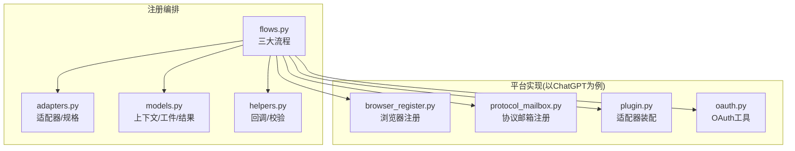
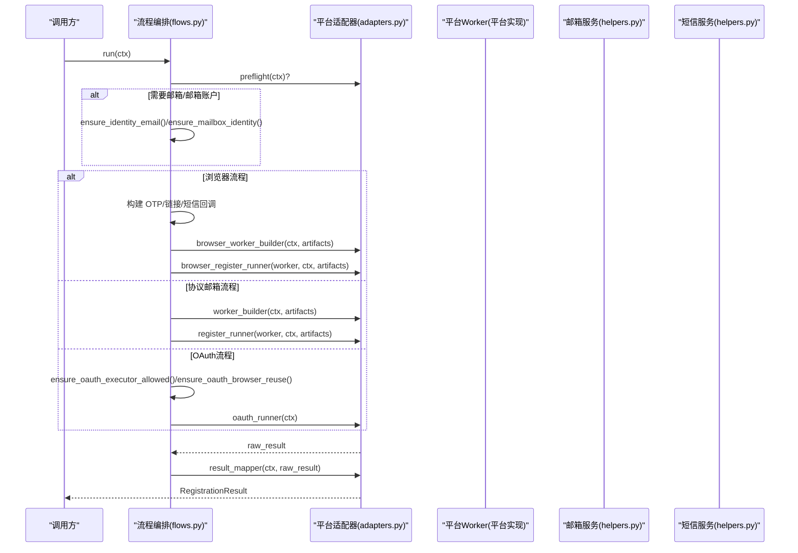
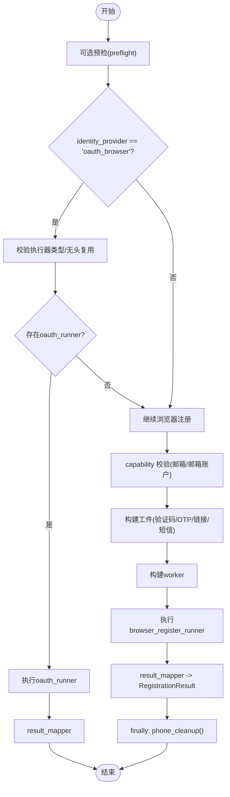
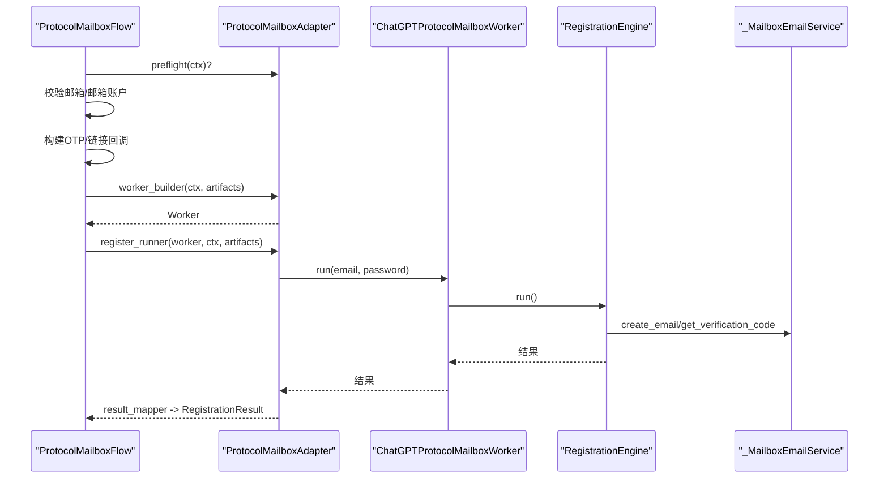
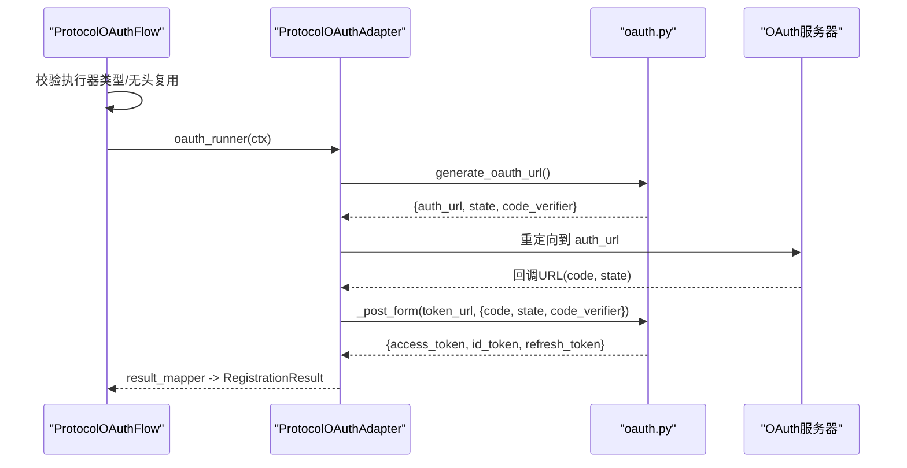
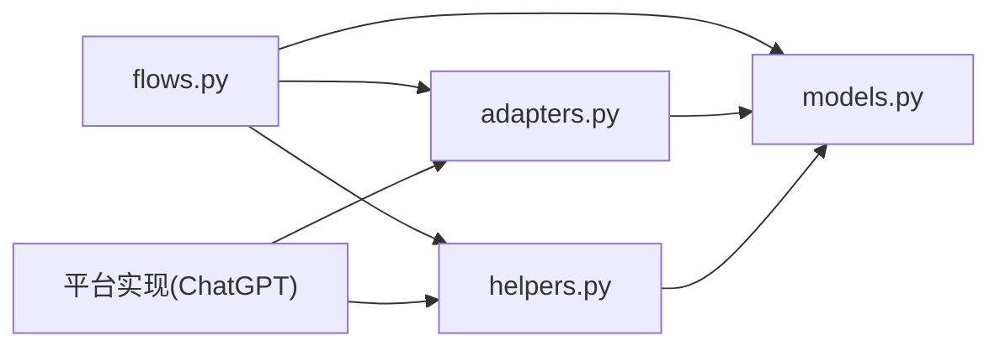
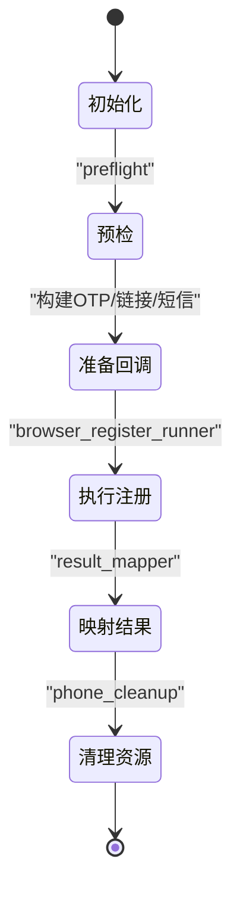
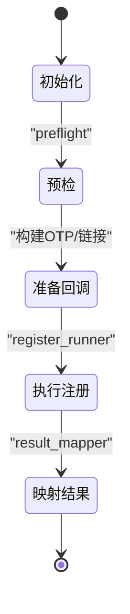
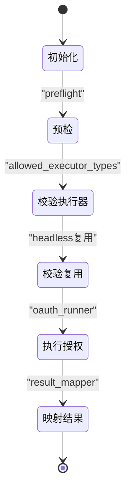

# 流程执行步骤

<cite>
**本文引用的文件**
- [flows.py](file://core/registration/flows.py)
- [adapters.py](file://core/registration/adapters.py)
- [models.py](file://core/registration/models.py)
- [helpers.py](file://core/registration/helpers.py)
- [browser_register.py](file://platforms/chatgpt/browser_register.py)
- [protocol_mailbox.py](file://platforms/chatgpt/protocol_mailbox.py)
- [plugin.py](file://platforms/chatgpt/plugin.py)
- [oauth.py](file://platforms/chatgpt/oauth.py)
- [base_captcha.py](file://core/base_captcha.py)
</cite>

## 目录
1. [简介](#简介)
2. [项目结构](#项目结构)
3. [核心组件](#核心组件)
4. [架构总览](#架构总览)
5. [详细组件分析](#详细组件分析)
6. [依赖关系分析](#依赖关系分析)
7. [性能考虑](#性能考虑)
8. [故障排查指南](#故障排查指南)
9. [结论](#结论)
10. [附录](#附录)

## 简介
本文件面向“三种注册流程”的执行步骤与实现细节，覆盖：
- BrowserRegistrationFlow：浏览器自动化注册（含验证码、OTP、链接验证、手机号校验等）
- ProtocolMailboxFlow：协议模式注册（HTTP 请求序列与响应处理）
- ProtocolOAuthFlow：OAuth 认证流程（授权码获取与令牌交换）

文档提供时序图、状态转换图、错误处理与重试机制说明，帮助读者快速理解并落地使用。

## 项目结构
围绕注册流程的核心代码集中在 core/registration 与 platforms/<平台> 下：
- flows.py：定义三大流程编排类
- adapters.py：定义适配器与规格（OTP/Link/Capability）
- models.py：上下文、工件、结果模型
- helpers.py：回调构建、前置校验、短信回调构建
- 平台实现：以 ChatGPT 为例展示浏览器注册、协议邮箱注册、OAuth 的具体实现

图表来源
- [flows.py:18-141](file://core/registration/flows.py#L18-L141)
- [adapters.py:27-59](file://core/registration/adapters.py#L27-L59)
- [models.py:7-66](file://core/registration/models.py#L7-L66)
- [helpers.py:23-177](file://core/registration/helpers.py#L23-L177)
- [browser_register.py:1-200](file://platforms/chatgpt/browser_register.py#L1-L200)
- [protocol_mailbox.py:1-66](file://platforms/chatgpt/protocol_mailbox.py#L1-L66)
- [plugin.py:189-225](file://platforms/chatgpt/plugin.py#L189-L225)
- [oauth.py:180-200](file://platforms/chatgpt/oauth.py#L180-L200)

章节来源
- [flows.py:18-141](file://core/registration/flows.py#L18-L141)
- [adapters.py:27-59](file://core/registration/adapters.py#L27-L59)
- [models.py:7-66](file://core/registration/models.py#L7-L66)
- [helpers.py:23-177](file://core/registration/helpers.py#L23-L177)

## 核心组件
- 流程编排
  - BrowserRegistrationFlow：负责浏览器自动化注册，支持 OTP、链接验证、手机验证码、可选的 OAuth 复用浏览器会话
  - ProtocolMailboxFlow：负责协议模式注册，通过 worker 驱动 HTTP 交互，支持 OTP/链接/验证码
  - ProtocolOAuthFlow：负责 OAuth 流程，校验执行器类型与无头浏览器复用要求，调用 oauth_runner
- 适配器与规格
  - BrowserRegistrationAdapter / ProtocolMailboxAdapter / ProtocolOAuthAdapter：封装具体平台的注册逻辑
  - OtpSpec / LinkSpec：描述 OTP/链接等待策略
  - RegistrationCapability：声明能力约束（如是否需要邮箱、是否允许 headless）
- 数据模型
  - RegistrationContext：运行期上下文（平台、身份、配置、日志）
  - RegistrationArtifacts：中间产物（回调、验证码求解器、执行器、原始结果）
  - RegistrationResult：最终注册结果（账号、凭据、令牌、状态等）

章节来源
- [flows.py:18-141](file://core/registration/flows.py#L18-L141)
- [adapters.py:27-59](file://core/registration/adapters.py#L27-L59)
- [models.py:7-66](file://core/registration/models.py#L7-L66)

## 架构总览
三大流程统一由 flows.py 编排，借助 adapters 注入平台特定实现，并通过 helpers 提供通用能力（OTP/链接/短信回调、前置校验）。平台侧以 ChatGPT 为例展示了三类适配器的装配与执行。

图表来源
- [flows.py:22-141](file://core/registration/flows.py#L22-L141)
- [adapters.py:27-59](file://core/registration/adapters.py#L27-L59)
- [helpers.py:46-177](file://core/registration/helpers.py#L46-L177)

## 详细组件分析

### BrowserRegistrationFlow（浏览器自动化注册）
- 关键步骤
  - 可选 preflight 检查
  - 若 identity_provider=oauth_browser：校验执行器类型与无头浏览器复用要求；若存在 oauth_runner，则直接走 OAuth 路径
  - 根据 capability 校验是否需要邮箱或邮箱账户
  - 构建 RegistrationArtifacts：
    - 验证码求解器（当 use_captcha_for_mailbox 且 identity_provider=mailbox）
    - OTP 回调（基于 mailbox.wait_for_code）
    - 链接回调（基于 mailbox.wait_for_link）
    - 手机号回调与清理函数（基于 create_phone_callbacks）
  - 构建 worker 并执行 browser_register_runner，完成后映射为 RegistrationResult
  - finally 中确保 phone_cleanup 被调用
- 验证码处理
  - 通过 base_captcha.create_captcha_solver 创建求解器，供浏览器页面在遇到 Turnstile/图片验证码时调用
- OTP 与链接验证
  - OTP：等待指定关键词邮件，按正则提取验证码
  - 链接：等待包含关键词的验证链接，返回完整 URL 或预览
- 手机号校验
  - 通过 providers/sms 获取临时号码，发送/接收验证码，失败可标记无效并重试
- 错误处理与重试
  - 未实现浏览器注册适配器：抛出运行时异常
  - 短信验证码无效：调用 phone_callback.mark_code_failed 标记后继续等待下一条
  - 多次无效或未通过：抛出异常终止

图表来源
- [flows.py:22-79](file://core/registration/flows.py#L22-L79)
- [helpers.py:46-177](file://core/registration/helpers.py#L46-L177)
- [base_captcha.py:67-98](file://core/base_captcha.py#L67-L98)
- [browser_register.py:2317-2330](file://platforms/chatgpt/browser_register.py#L2317-L2330)

章节来源
- [flows.py:22-79](file://core/registration/flows.py#L22-L79)
- [helpers.py:46-177](file://core/registration/helpers.py#L46-L177)
- [base_captcha.py:67-98](file://core/base_captcha.py#L67-L98)
- [browser_register.py:2317-2330](file://platforms/chatgpt/browser_register.py#L2317-L2330)

### ProtocolMailboxFlow（协议模式注册）
- 关键步骤
  - 可选 preflight 检查
  - 根据 capability 校验是否需要邮箱或邮箱账户
  - 构建 RegistrationArtifacts：
    - 验证码求解器（use_captcha）
    - OTP/链接回调（依据 adapter 配置）
  - 可选 executor 上下文管理（use_executor）
  - 构建 worker 并执行 register_runner，完成后映射为 RegistrationResult
- 平台示例（ChatGPT）
  - plugin.py 装配 ProtocolMailboxAdapter：
    - worker_builder 返回 ChatGPTProtocolMailboxWorker
    - register_runner 调用 worker.run(email, password)
  - protocol_mailbox.py 中的 ChatGPTProtocolMailboxWorker：
    - 内部封装 _MailboxEmailService，将 mailbox 适配为 RegistrationEngine 所需接口
    - run 设置 email/password 并调用 engine.run()
    - 失败时抛出异常，携带错误信息
- HTTP 请求序列与响应处理
  - 由 RegistrationEngine 内部完成（外部通过 worker.run 触发），包括创建邮箱、发送/接收验证码、提交表单、解析响应等
  - 成功返回结构化结果，失败返回错误消息

图表来源
- [flows.py:81-121](file://core/registration/flows.py#L81-L121)
- [plugin.py:189-225](file://platforms/chatgpt/plugin.py#L189-L225)
- [protocol_mailbox.py:9-66](file://platforms/chatgpt/protocol_mailbox.py#L9-L66)

章节来源
- [flows.py:81-121](file://core/registration/flows.py#L81-L121)
- [plugin.py:189-225](file://platforms/chatgpt/plugin.py#L189-L225)
- [protocol_mailbox.py:9-66](file://platforms/chatgpt/protocol_mailbox.py#L9-L66)

### ProtocolOAuthFlow（OAuth 认证流程）
- 关键步骤
  - 可选 preflight 检查
  - 校验执行器类型是否在允许列表内
  - 若 headless 且要求浏览器复用，则校验 chrome_user_data_dir/chrome_cdp_url
  - 调用 oauth_runner 完成授权码获取与令牌交换，再映射为 RegistrationResult
- 平台示例（ChatGPT）
  - oauth.py 提供 OAuth 工具：
    - generate_oauth_url：生成授权 URL（含 state、PKCE code_verifier）
    - _post_form：向 token 端点发起表单 POST，处理代理与错误
    - _parse_callback_url：解析回调 URL 中的 code/state/error
  - plugin.py 中通过 ProtocolOAuthAdapter 装配 oauth_runner/result_mapper
- 授权码获取与令牌交换
  - 生成授权 URL -> 用户授权 -> 回调携带 code/state -> 使用 PKCE 交换 access_token/id_token/refresh_token

图表来源
- [flows.py:124-141](file://core/registration/flows.py#L124-L141)
- [oauth.py:180-200](file://platforms/chatgpt/oauth.py#L180-L200)
- [oauth.py:125-178](file://platforms/chatgpt/oauth.py#L125-L178)

章节来源
- [flows.py:124-141](file://core/registration/flows.py#L124-L141)
- [oauth.py:125-178](file://platforms/chatgpt/oauth.py#L125-L178)
- [oauth.py:180-200](file://platforms/chatgpt/oauth.py#L180-L200)

## 依赖关系分析
- 耦合与内聚
  - flows.py 仅依赖 adapters/models/helpers，保持高内聚低耦合
  - 平台实现通过适配器注入，避免流程层感知平台差异
- 外部依赖
  - 邮箱服务：通过 helpers.build_otp_callback/build_link_callback 调用 platform.mailbox
  - 短信服务：通过 helpers.build_phone_callbacks 动态选择 provider
  - 验证码服务：通过 base_captcha.create_captcha_solver 动态选择 provider
- 潜在循环依赖
  - 当前未见循环导入；平台插件仅在需要时 import 具体 worker

图表来源
- [flows.py:1-16](file://core/registration/flows.py#L1-L16)
- [adapters.py:1-7](file://core/registration/adapters.py#L1-L7)
- [models.py:1-66](file://core/registration/models.py#L1-L66)
- [helpers.py:1-8](file://core/registration/helpers.py#L1-L8)

章节来源
- [flows.py:1-16](file://core/registration/flows.py#L1-L16)
- [adapters.py:1-7](file://core/registration/adapters.py#L1-L7)
- [models.py:1-66](file://core/registration/models.py#L1-L66)
- [helpers.py:1-8](file://core/registration/helpers.py#L1-L8)

## 性能考虑
- 回调等待超时
  - OTP/链接回调支持 timeout 参数，避免长时间阻塞
- 执行器复用
  - OAuth 在无头模式下可通过 chrome_user_data_dir/chrome_cdp_url 复用已登录浏览器，减少重复登录开销
- 网络与代理
  - OAuth 与协议注册均支持 proxy_url，降低跨区访问延迟
- 资源释放
  - 浏览器流程在 finally 中确保 phone_cleanup 执行，避免资源泄漏

[本节为通用指导，不直接分析具体文件]

## 故障排查指南
- 常见错误与定位
  - 未实现浏览器注册适配器：检查 platform 是否正确装配 BrowserRegistrationAdapter 的 browser_worker_builder 与 browser_register_runner
  - 缺少邮箱/邮箱账户：检查 identity.email 与 identity.has_mailbox 是否满足 capability 要求
  - 短信回调为空：检查 sms_provider 配置、全局默认、历史兼容字段以及 provider 的认证字段是否齐全
  - 验证码无效：查看 page_error 或 status，必要时调用 mark_code_failed 标记并继续等待下一条
  - OAuth 执行器不支持：调整 executor_type 或在 allowed_executor_types 范围内运行
  - 无头浏览器复用失败：配置 chrome_user_data_dir 或 chrome_cdp_url
- 重试机制
  - 短信验证码：循环等待新短信，标记无效后继续
  - 链接/OTP：按 timeout 重试直至收到有效内容
- 日志与调试
  - 使用 ctx.log 输出关键节点（等待验证码、收到链接、回调结果）
  - 在平台实现中打印关键状态与响应片段，便于定位问题

章节来源
- [flows.py:22-79](file://core/registration/flows.py#L22-L79)
- [helpers.py:75-147](file://core/registration/helpers.py#L75-L147)
- [browser_register.py:2317-2330](file://platforms/chatgpt/browser_register.py#L2317-L2330)

## 结论
- 三大流程通过统一的编排与适配器模式，屏蔽了平台差异，提供了可扩展的注册能力
- 浏览器流程适合复杂 UI 场景（验证码、多步表单、OTP/链接/手机校验）
- 协议邮箱流程适合稳定 API 场景（HTTP 序列清晰、易于测试与监控）
- OAuth 流程提供标准授权码+PKCE 的安全令牌交换，支持无头复用以提升效率
- 完善的错误处理与重试机制保障了注册成功率与稳定性

[本节为总结性内容，不直接分析具体文件]

## 附录
- 状态转换（浏览器注册）

图表来源
- [flows.py:22-79](file://core/registration/flows.py#L22-L79)

- 状态转换（协议邮箱注册）

图表来源
- [flows.py:81-121](file://core/registration/flows.py#L81-L121)

- 状态转换（OAuth 注册）

图表来源
- [flows.py:124-141](file://core/registration/flows.py#L124-L141)