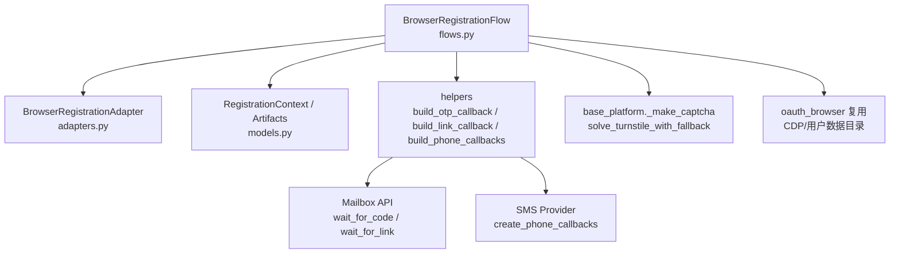
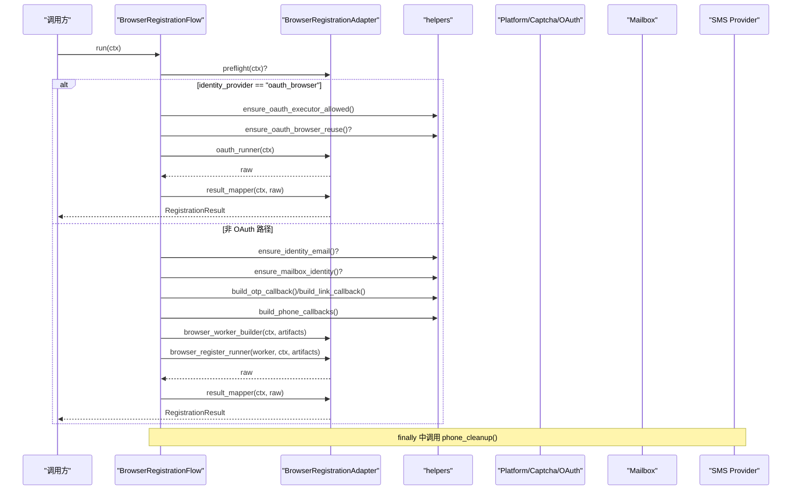
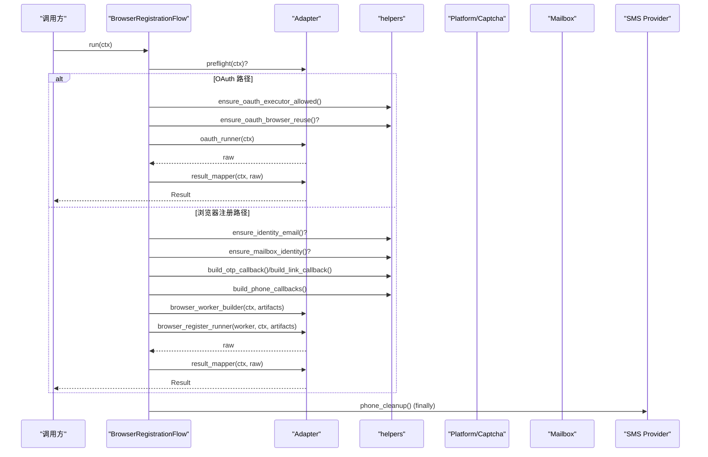
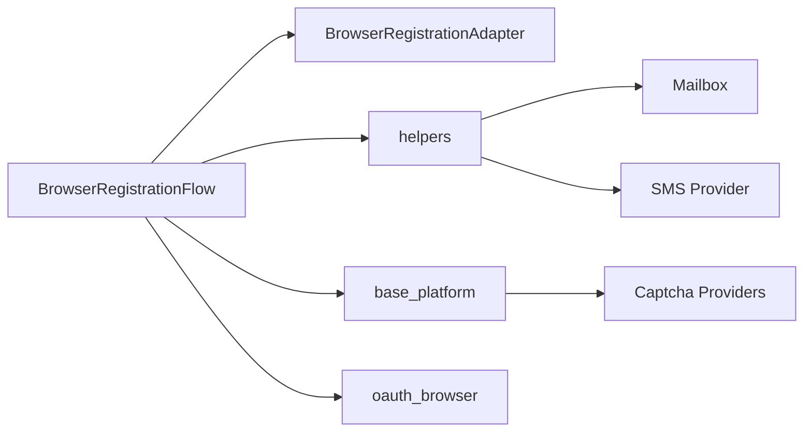

# 浏览器注册流程

<cite>
**本文引用的文件**
- [flows.py](file://core/registration/flows.py)
- [helpers.py](file://core/registration/helpers.py)
- [models.py](file://core/registration/models.py)
- [adapters.py](file://core/registration/adapters.py)
- [errors.py](file://core/registration/errors.py)
- [base_platform.py](file://core/base_platform.py)
- [oauth_browser.py](file://core/oauth_browser.py)
- [local_solver.py](file://providers/captcha/local_solver.py)
- [base_captcha.py](file://core/base_captcha.py)
- [test_registration_phone_callbacks.py](file://tests/test_registration_phone_callbacks.py)
</cite>

## 目录
1. [简介](#简介)
2. [项目结构](#项目结构)
3. [核心组件](#核心组件)
4. [架构总览](#架构总览)
5. [详细组件分析](#详细组件分析)
6. [依赖关系分析](#依赖关系分析)
7. [性能考虑](#性能考虑)
8. [故障排查指南](#故障排查指南)
9. [结论](#结论)
10. [附录：配置与示例](#附录配置与示例)

## 简介
本文面向需要理解并集成“浏览器注册流程”的开发者，系统性说明 BrowserRegistrationFlow 的完整执行过程。内容覆盖：
- 预检查阶段的功能验证与依赖检查（邮箱、mailbox 提供商、OAuth 执行器限制等）
- OAuth 认证流程处理逻辑，包括无头模式下的浏览器会话复用机制
- 验证码处理器集成方式（CAPTCHA 解决器的初始化与调用）
- OTP 验证链接回调构建（含超时处理与成功标识）
- 电话回调的构建与清理机制
- 完整的执行时序图与错误处理策略
- 具体代码片段路径与配置参数说明

## 项目结构
BrowserRegistrationFlow 位于 core/registration 模块中，围绕适配器与上下文模型组织，配合 helpers 提供统一的回调构建能力，并通过 base_platform 与 captcha/solver 体系集成验证码能力。

图表来源
- [flows.py:18-79](file://core/registration/flows.py#L18-L79)
- [adapters.py:27-38](file://core/registration/adapters.py#L27-L38)
- [models.py:17-66](file://core/registration/models.py#L17-L66)
- [helpers.py:46-177](file://core/registration/helpers.py#L46-L177)
- [base_platform.py:350-431](file://core/base_platform.py#L350-L431)
- [oauth_browser.py:192-212](file://core/oauth_browser.py#L192-L212)

章节来源
- [flows.py:18-79](file://core/registration/flows.py#L18-L79)
- [models.py:17-66](file://core/registration/models.py#L17-L66)
- [adapters.py:27-38](file://core/registration/adapters.py#L27-L38)

## 核心组件
- BrowserRegistrationFlow：编排注册主流程，负责预检查、回调构建、执行浏览器注册或 OAuth、结果映射与资源清理。
- BrowserRegistrationAdapter：平台注册的适配器契约，声明是否支持 OAuth、是否需要邮箱/mailbox、是否启用 CAPTCHA、OTP/链接等待规格等。
- RegistrationContext / RegistrationArtifacts / RegistrationResult：注册上下文、中间产物与最终结果的数据载体。
- helpers：统一构建 OTP 回调、验证链接回调、电话回调；校验身份与执行器限制；处理超时与日志。
- base_platform：验证码选择与求解、身份解析、执行器类型判断等通用能力。
- oauth_browser：在无头模式下尝试复用本机已登录浏览器会话（通过 Chrome 用户数据目录或 CDP）。

章节来源
- [flows.py:18-79](file://core/registration/flows.py#L18-L79)
- [adapters.py:27-38](file://core/registration/adapters.py#L27-L38)
- [models.py:17-66](file://core/registration/models.py#L17-L66)
- [helpers.py:11-44](file://core/registration/helpers.py#L11-L44)
- [base_platform.py:350-431](file://core/base_platform.py#L350-L431)
- [oauth_browser.py:192-212](file://core/oauth_browser.py#L192-L212)

## 架构总览
下图展示 BrowserRegistrationFlow 的主控制流与关键分支：

图表来源
- [flows.py:22-79](file://core/registration/flows.py#L22-L79)
- [helpers.py:46-177](file://core/registration/helpers.py#L46-L177)

## 详细组件分析

### 预检查阶段：功能验证与依赖检查
- 邮箱地址验证：当适配器要求浏览器邮箱注册时，会强制校验 identity.email 是否存在，否则抛出身份解析异常。
- mailbox 提供商校验：当适配器要求使用 mailbox 时，会校验 identity.has_mailbox 是否为真，否则抛出身份解析异常。
- OAuth 执行器限制：若 capability.oauth_allowed_executor_types 存在，则当前 executor_type 必须属于允许列表，否则抛出不支持异常。
- 无头模式浏览器复用：若 capability.oauth_headless_requires_browser_reuse 为真且 executor_type 为 headless，则要求 identity 中包含 chrome_user_data_dir 或 chrome_cdp_url，否则抛出浏览器复用必需异常。

章节来源
- [flows.py:26-44](file://core/registration/flows.py#L26-L44)
- [helpers.py:23-44](file://core/registration/helpers.py#L23-L44)
- [errors.py:8-25](file://core/registration/errors.py#L8-L25)

### OAuth 认证流程与无头浏览器会话复用
- 当 identity.identity_provider 为 oauth_browser 时，流程优先走 OAuth 路径：
  - 校验执行器类型是否在允许列表中。
  - 若要求无头复用，则检查是否配置了可复用的本地浏览器会话（用户数据目录或 CDP）。
  - 调用 adapter.oauth_runner(ctx) 完成 OAuth 注册，并通过 result_mapper 转换为标准结果。
- 无头复用机制：
  - 系统会尝试连接本地已运行的 Chrome（通过 CDP），或重启 Chrome 开启调试端口后连接。
  - 若未找到本地 Chrome，则回退到 Playwright Chromium 启动新实例。

章节来源
- [flows.py:26-39](file://core/registration/flows.py#L26-L39)
- [oauth_browser.py:192-212](file://core/oauth_browser.py#L192-L212)
- [helpers.py:11-13](file://core/registration/helpers.py#L11-L13)

### 验证码处理器集成：初始化与调用
- 当适配器标记 use_captcha_for_mailbox 且 identity_provider 为 mailbox 时，流程会通过 platform._make_captcha() 创建验证码解决器。
- base_platform 提供 solve_turnstile_with_fallback，自动选择可用的验证码 provider（如 local_solver、yescaptcha_api、twocaptcha_api），并依次尝试求解 Turnstile。
- local_solver 实现通过 HTTP 接口提交任务并轮询结果，失败或超时会抛出相应异常。

章节来源
- [flows.py:47-48](file://core/registration/flows.py#L47-L48)
- [base_platform.py:350-431](file://core/base_platform.py#L350-L431)
- [base_captcha.py:67-97](file://core/base_captcha.py#L67-L97)
- [local_solver.py:17-49](file://providers/captcha/local_solver.py#L17-L49)

### OTP 验证链接回调构建：超时与成功标识
- OTP 回调：
  - 若适配器提供了 otp_spec，则通过 build_otp_callback 构造回调。
  - 回调内部会记录等待消息，调用 mailbox.wait_for_code，支持 keyword、before_ids、timeout、code_pattern 等参数。
  - 若获取到验证码，记录成功日志并返回验证码。
- 验证链接回调：
  - 若适配器提供了 link_spec，则通过 build_link_callback 构造回调。
  - 回调内部记录等待消息，调用 mailbox.get_current_ids 与 wait_for_link，支持 keyword、before_ids、timeout。
  - 若获取到链接，按 preview_chars 截断显示，并记录成功日志。

章节来源
- [flows.py:49-66](file://core/registration/flows.py#L49-L66)
- [helpers.py:46-72](file://core/registration/helpers.py#L46-L72)
- [helpers.py:150-177](file://core/registration/helpers.py#L150-L177)

### 电话回调构建与清理机制
- 构建：
  - 通过 build_phone_callbacks 从任务参数或全局默认中选择 SMS provider，合并运行时设置，必要时注入代理与国家信息。
  - 若未配置有效 provider 或认证字段为空，将返回 None，并在日志中提示后续步骤可能失败。
- 清理：
  - 流程在 try/finally 中确保即使发生异常也会调用 phone_cleanup，释放短信服务资源。
- 测试验证：
  - 单元测试验证了回调被正确构建、调用以及清理事件触发。

章节来源
- [flows.py:67-78](file://core/registration/flows.py#L67-L78)
- [helpers.py:75-147](file://core/registration/helpers.py#L75-L147)
- [test_registration_phone_callbacks.py:10-40](file://tests/test_registration_phone_callbacks.py#L10-L40)

### 执行时序图（完整流程）

图表来源
- [flows.py:22-79](file://core/registration/flows.py#L22-L79)
- [helpers.py:46-177](file://core/registration/helpers.py#L46-L177)

### 错误处理策略
- 身份解析失败：当缺少邮箱或 mailbox 时抛出 IdentityResolutionError。
- 执行器不支持：当 executor_type 不在允许列表时抛出 RegistrationUnsupportedError。
- 浏览器复用必需：无头 OAuth 未配置可复用浏览器会话时抛出 BrowserReuseRequiredError。
- 验证码配置不可用：当未配置或无法创建验证码解决器时抛出 CaptchaConfigurationError。
- OTP 超时：当等待验证码或链接超过指定时间未完成时抛出 OtpTimeoutError。
- 资源清理：无论成功或失败，phone_cleanup 都会在 finally 中执行，避免资源泄漏。

章节来源
- [errors.py:4-25](file://core/registration/errors.py#L4-L25)
- [flows.py:22-79](file://core/registration/flows.py#L22-L79)
- [helpers.py:23-44](file://core/registration/helpers.py#L23-L44)

## 依赖关系分析
- BrowserRegistrationFlow 依赖：
  - BrowserRegistrationAdapter：定义平台特定的注册行为与能力。
  - helpers：提供统一的回调构建与前置校验。
  - base_platform：提供验证码求解与身份解析能力。
  - oauth_browser：在无头模式下复用本地浏览器会话。
- 外部依赖：
  - Mailbox：用于等待 OTP 与验证链接。
  - SMS Provider：用于获取电话号码与通话/短信回调。
  - Captcha Providers：local_solver、YesCaptcha、2Captcha 等。

图表来源
- [flows.py:18-79](file://core/registration/flows.py#L18-L79)
- [helpers.py:46-177](file://core/registration/helpers.py#L46-L177)
- [base_platform.py:350-431](file://core/base_platform.py#L350-L431)
- [oauth_browser.py:192-212](file://core/oauth_browser.py#L192-L212)

## 性能考虑
- 验证码求解：
  - 多 provider 顺序尝试，遇到可用立即返回，减少无效调用。
  - local_solver 轮询间隔与超时需合理配置，避免长时间阻塞。
- 浏览器复用：
  - 复用本地 Chrome 会话可减少登录开销，提高注册效率。
  - 无头模式下优先尝试 CDP 连接，失败再回退到新实例。
- 回调等待：
  - OTP/链接等待应设置合理的 timeout，避免无限期阻塞。
  - 使用 before_ids 过滤历史邮件，提升匹配效率。
- 资源管理：
  - 始终在 finally 中执行 phone_cleanup，防止资源泄漏。

[本节为通用指导，不直接分析具体文件]

## 故障排查指南
- 未配置邮箱或 mailbox：
  - 现象：抛出 IdentityResolutionError。
  - 处理：确保 identity.email 存在且 identity.has_mailbox 为真。
- 执行器类型不被支持：
  - 现象：抛出 RegistrationUnsupportedError。
  - 处理：调整 executor_type 或在 capability 中放宽允许列表。
- 无头 OAuth 无法复用浏览器：
  - 现象：抛出 BrowserReuseRequiredError。
  - 处理：配置 chrome_user_data_dir 或 chrome_cdp_url。
- 验证码 provider 未配置或未启用：
  - 现象：抛出 CaptchaConfigurationError 或无法创建 solver。
  - 处理：在设置页启用并配置至少一个验证码 provider。
- OTP/链接等待超时：
  - 现象：抛出 OtpTimeoutError。
  - 处理：增大 timeout 或检查 mailbox 配置与网络连通性。
- 短信回调未生效：
  - 现象：phone_callback=None，后续 add_phone 步骤失败。
  - 处理：检查 sms_provider、认证字段、代理与国家配置。

章节来源
- [errors.py:4-25](file://core/registration/errors.py#L4-L25)
- [helpers.py:23-44](file://core/registration/helpers.py#L23-L44)
- [helpers.py:75-147](file://core/registration/helpers.py#L75-L147)

## 结论
BrowserRegistrationFlow 以适配器为中心，结合上下文与回调构建，实现了可扩展、可配置的浏览器注册流程。其优势在于：
- 清晰的预检查与依赖校验，提前暴露配置问题。
- 灵活的 OAuth 路径与无头浏览器复用，提升自动化体验。
- 统一的 OTP/链接/电话回调构建，简化平台集成。
- 完善的错误处理与资源清理，保障稳定性。

[本节为总结，不直接分析具体文件]

## 附录：配置与示例
- 验证码 provider 配置：
  - 在设置页启用并选择默认 provider；若使用 local_solver，需确保 solver 服务可用。
  - 参考：[base_platform.py:350-431](file://core/base_platform.py#L350-L431)、[base_captcha.py:67-97](file://core/base_captcha.py#L67-L97)、[local_solver.py:17-49](file://providers/captcha/local_solver.py#L17-L49)
- OTP/链接等待配置：
  - 在适配器中设置 otp_spec/link_spec，包含 keyword、timeout、code_pattern、wait_message、success_label、preview_chars。
  - 参考：[adapters.py:9-25](file://core/registration/adapters.py#L9-L25)、[helpers.py:46-72](file://core/registration/helpers.py#L46-L72)、[helpers.py:150-177](file://core/registration/helpers.py#L150-L177)
- 无头 OAuth 浏览器复用：
  - 配置 chrome_user_data_dir 或 chrome_cdp_url，以便复用本地已登录浏览器。
  - 参考：[oauth_browser.py:192-212](file://core/oauth_browser.py#L192-L212)、[helpers.py:11-13](file://core/registration/helpers.py#L11-L13)
- 短信回调配置：
  - 通过任务参数或全局默认选择 sms_provider，并确保认证字段与代理/国家配置正确。
  - 参考：[helpers.py:75-147](file://core/registration/helpers.py#L75-L147)、[test_registration_phone_callbacks.py:10-40](file://tests/test_registration_phone_callbacks.py#L10-L40)

章节来源
- [base_platform.py:350-431](file://core/base_platform.py#L350-L431)
- [base_captcha.py:67-97](file://core/base_captcha.py#L67-L97)
- [local_solver.py:17-49](file://providers/captcha/local_solver.py#L17-L49)
- [adapters.py:9-25](file://core/registration/adapters.py#L9-L25)
- [helpers.py:46-72](file://core/registration/helpers.py#L46-L72)
- [helpers.py:150-177](file://core/registration/helpers.py#L150-L177)
- [oauth_browser.py:192-212](file://core/oauth_browser.py#L192-L212)
- [helpers.py:75-147](file://core/registration/helpers.py#L75-L147)
- [test_registration_phone_callbacks.py:10-40](file://tests/test_registration_phone_callbacks.py#L10-L40)