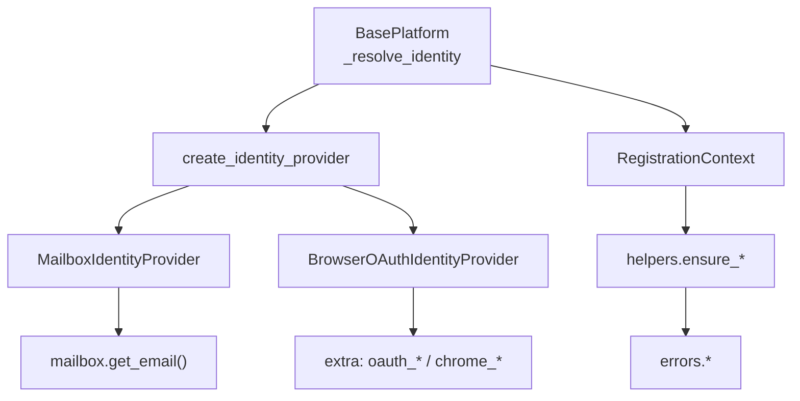
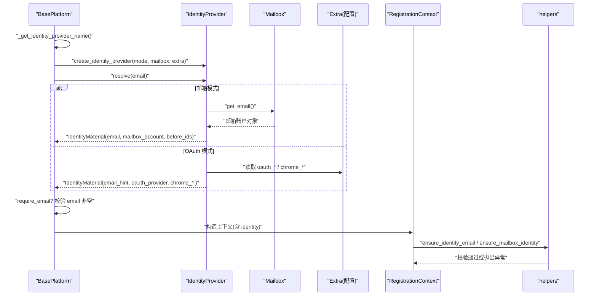
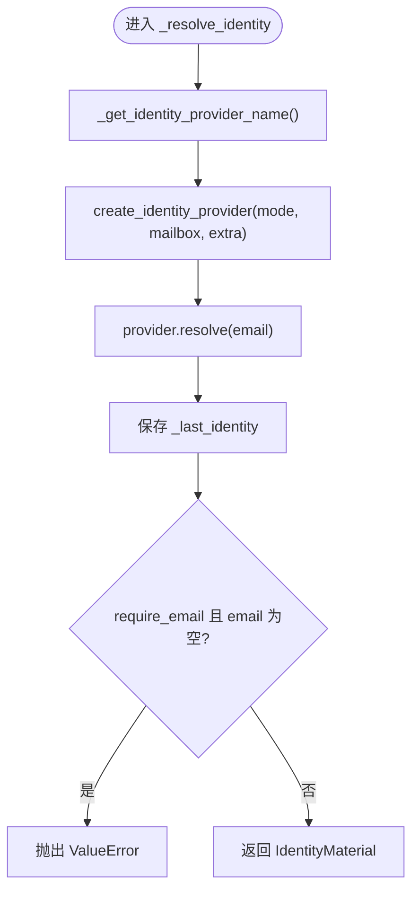
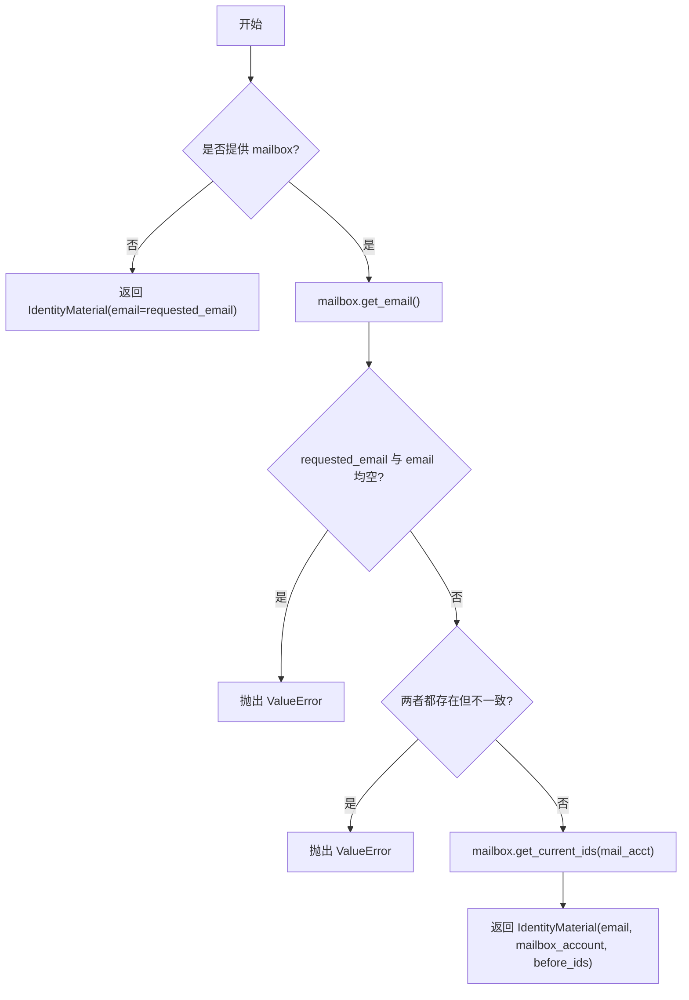
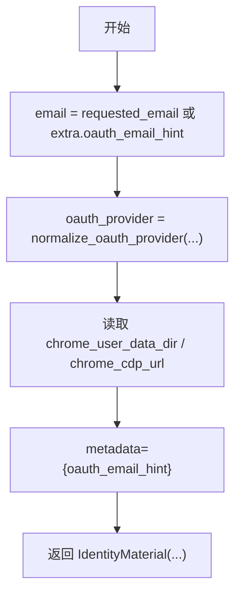
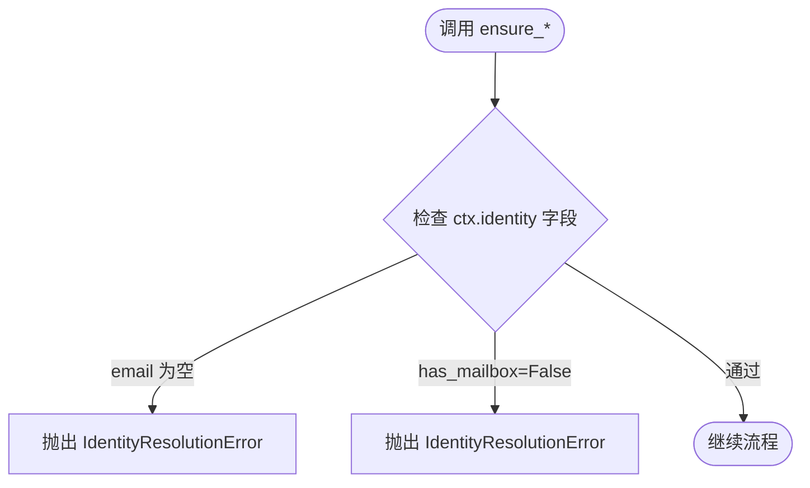
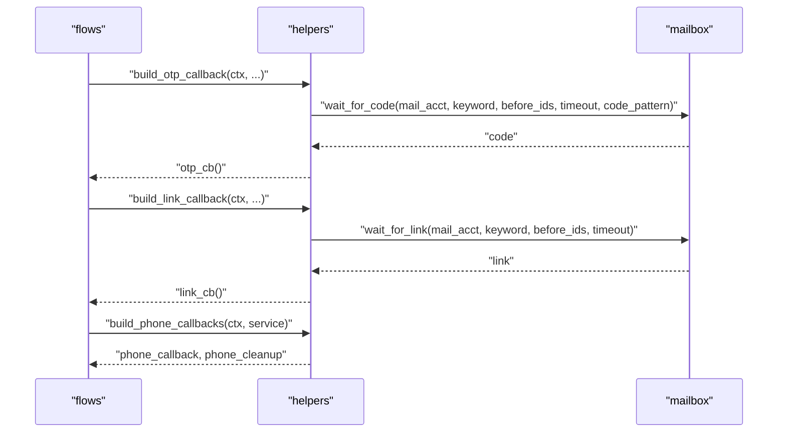
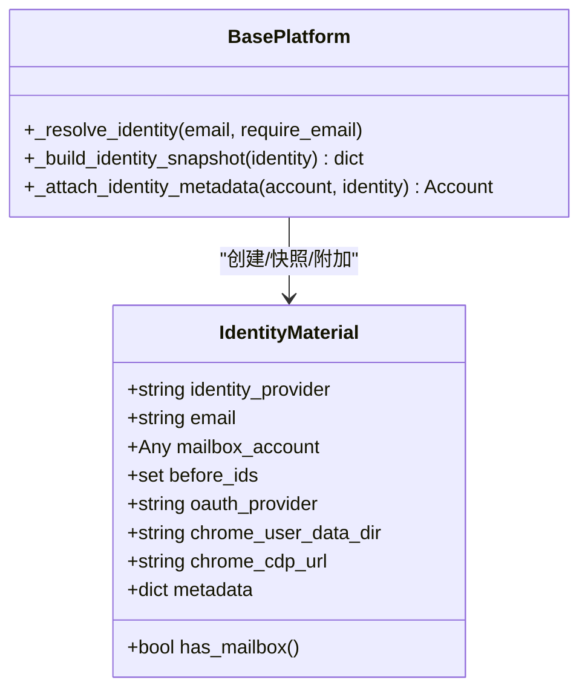
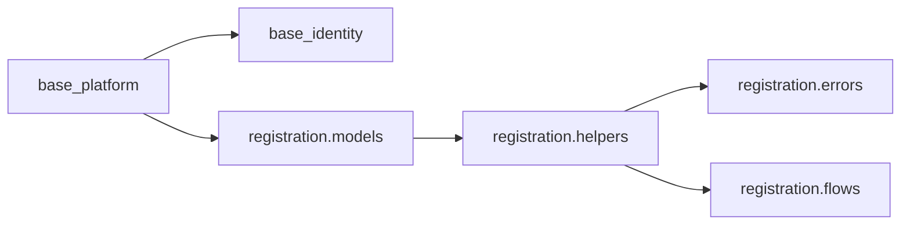

# 身份解析阶段

<cite>
**本文引用的文件**
- [core/base_identity.py](file://core/base_identity.py)
- [core/base_platform.py](file://core/base_platform.py)
- [core/registration/helpers.py](file://core/registration/helpers.py)
- [core/registration/errors.py](file://core/registration/errors.py)
- [core/registration/models.py](file://core/registration/models.py)
- [core/registration/flows.py](file://core/registration/flows.py)
</cite>

## 目录
1. [简介](#简介)
2. [项目结构](#项目结构)
3. [核心组件](#核心组件)
4. [架构总览](#架构总览)
5. [详细组件分析](#详细组件分析)
6. [依赖关系分析](#依赖关系分析)
7. [性能考量](#性能考量)
8. [故障排查指南](#故障排查指南)
9. [结论](#结论)
10. [附录](#附录)

## 简介
本章节聚焦“身份解析阶段”，深入解释平台在注册流程中如何从用户输入与配置中提取、归一化并验证身份信息，包括邮箱、手机号（通过短信回调）、OAuth 令牌等。重点说明：
- _resolve_identity 的工作原理与控制流
- ensure_identity_email、ensure_mailbox_identity 等辅助函数的作用与使用场景
- 身份信息的验证规则、格式要求与错误处理机制
- 不同身份类型的解析过程示例（以代码路径引用代替具体代码）
- 身份信息的存储结构与生命周期管理

## 项目结构
身份解析相关代码主要分布在以下模块：
- core/base_identity.py：定义身份提供者抽象、邮箱身份提供者、浏览器 OAuth 身份提供者及工厂方法
- core/base_platform.py：平台基类中的 _resolve_identity 入口，负责选择身份提供者并执行解析
- core/registration/helpers.py：注册流程中的校验与回调构建工具，包含 ensure_* 系列函数
- core/registration/errors.py：注册与身份解析相关的异常类型
- core/registration/models.py：注册上下文与结果模型
- core/registration/flows.py：注册流程编排，组装 OTP、链接、短信等回调

图表来源
- [core/base_platform.py:432-459](file://core/base_platform.py#L432-L459)
- [core/base_identity.py:39-130](file://core/base_identity.py#L39-L130)
- [core/registration/helpers.py:23-43](file://core/registration/helpers.py#L23-L43)
- [core/registration/errors.py:4-25](file://core/registration/errors.py#L4-L25)

章节来源
- [core/base_platform.py:432-505](file://core/base_platform.py#L432-L505)
- [core/base_identity.py:1-130](file://core/base_identity.py#L1-L130)
- [core/registration/helpers.py:1-177](file://core/registration/helpers.py#L1-L177)
- [core/registration/errors.py:1-27](file://core/registration/errors.py#L1-L27)
- [core/registration/models.py:18-65](file://core/registration/models.py#L18-L65)
- [core/registration/flows.py:46-67](file://core/registration/flows.py#L46-L67)

## 核心组件
- 身份提供者抽象与实现
  - BaseIdentityProvider：统一接口 resolve(requested_email) -> IdentityMaterial
  - MailboxIdentityProvider：基于邮箱提供商获取或校验邮箱，记录 before_ids
  - BrowserOAuthIdentityProvider：基于浏览器 OAuth，提取 email hint、oauth provider、chrome 会话信息
- 平台入口
  - BasePlatform._get_identity_provider_name/_get_identity_provider：根据配置选择支持的 identity_provider
  - BasePlatform._resolve_identity：调用 resolve，保存最后身份快照，必要时强制要求 email
- 注册辅助函数
  - ensure_identity_email：确保上下文中存在 email，否则抛出 IdentityResolutionError
  - ensure_mailbox_identity：确保身份带有 mailbox_account，否则抛出 IdentityResolutionError
  - build_otp_callback/build_link_callback/build_phone_callbacks：构造验证码、链接、短信回调
- 数据模型
  - IdentityMaterial：承载 identity_provider、email、mailbox_account、before_ids、oauth_provider、chrome 会话、metadata
  - RegistrationContext：封装平台、身份、配置、日志等
  - RegistrationArtifacts/RegistrationResult：注册产物与结果

章节来源
- [core/base_identity.py:48-130](file://core/base_identity.py#L48-L130)
- [core/base_platform.py:432-459](file://core/base_platform.py#L432-L459)
- [core/registration/helpers.py:23-177](file://core/registration/helpers.py#L23-L177)
- [core/registration/models.py:18-65](file://core/registration/models.py#L18-L65)

## 架构总览
身份解析阶段的整体流程如下：
- 平台在注册前调用 _resolve_identity(email, require_email=...)
- 内部通过 _get_identity_provider_name 归一化 identity_provider（支持别名映射）
- 创建对应身份提供者实例并调用 resolve(requested_email)
- 根据 identity_provider 的不同，分别走邮箱模式或浏览器 OAuth 模式
- 将返回的 IdentityMaterial 保存到 _last_identity，并在 require_email 为真时校验 email 非空
- 后续注册流程通过 helpers.ensure_* 进行更细粒度的校验，并构建 OTP/链接/短信回调

图表来源
- [core/base_platform.py:432-459](file://core/base_platform.py#L432-L459)
- [core/base_identity.py:76-117](file://core/base_identity.py#L76-L117)
- [core/registration/helpers.py:23-43](file://core/registration/helpers.py#L23-L43)

## 详细组件分析

### _resolve_identity 工作原理
- 功能：根据配置选择身份提供者，解析出 IdentityMaterial，并在需要时强制要求 email
- 关键点：
  - 通过 _get_identity_provider_name 归一化 identity_provider（支持多种别名）
  - 通过 create_identity_provider 创建具体提供者实例
  - 调用 resolve(requested_email) 完成解析
  - 保存 _last_identity，便于后续附加到账号元数据
  - 当 require_email=True 且 identity.email 为空时抛出 ValueError

图表来源
- [core/base_platform.py:432-459](file://core/base_platform.py#L432-L459)

章节来源
- [core/base_platform.py:432-459](file://core/base_platform.py#L432-L459)

### 邮箱身份解析（MailboxIdentityProvider）
- 行为：
  - 若未提供 mailbox，则直接返回仅含 requested_email 的 IdentityMaterial
  - 若有 mailbox，则调用 get_email() 获取邮箱账户对象
  - 校验：
    - 若 requested_email 与邮箱提供商返回的 email 不一致，抛出 ValueError
    - 若两者都为空，抛出 ValueError（提示检查 mailbox provider）
  - 记录 before_ids（当前邮箱 ID 集合），用于后续等待新邮件/验证码
- 输出字段：identity_provider="mailbox"、email、mailbox_account、before_ids

图表来源
- [core/base_identity.py:76-97](file://core/base_identity.py#L76-L97)

章节来源
- [core/base_identity.py:76-97](file://core/base_identity.py#L76-L97)

### 浏览器 OAuth 身份解析（BrowserOAuthIdentityProvider）
- 行为：
  - email 优先使用 requested_email，其次 fallback 到 extra.oauth_email_hint
  - oauth_provider 通过 normalize_oauth_provider 归一化（支持 google-oauth2、windowslive、builder-id 等别名）
  - 携带 chrome_user_data_dir、chrome_cdp_url 以便复用浏览器会话
  - metadata 中包含 oauth_email_hint
- 适用场景：无需显式邮箱，通过浏览器完成 OAuth 登录；可复用浏览器会话提升稳定性

图表来源
- [core/base_identity.py:100-117](file://core/base_identity.py#L100-L117)

章节来源
- [core/base_identity.py:100-117](file://core/base_identity.py#L100-L117)

### 辅助函数：ensure_identity_email 与 ensure_mailbox_identity
- ensure_identity_email(ctx, message)
  - 用途：在注册流程中确保已解析出 email，否则抛出 IdentityResolutionError
  - 典型场景：协议邮箱注册、需要明确邮箱的场景
- ensure_mailbox_identity(ctx, message)
  - 用途：确保身份包含 mailbox_account（即 has_mailbox=True），否则抛出 IdentityResolutionError
  - 典型场景：需要邮箱能力（如收验证码、链接）的流程

图表来源
- [core/registration/helpers.py:23-30](file://core/registration/helpers.py#L23-L30)
- [core/registration/errors.py:8-9](file://core/registration/errors.py#L8-L9)

章节来源
- [core/registration/helpers.py:23-30](file://core/registration/helpers.py#L23-L30)
- [core/registration/errors.py:8-9](file://core/registration/errors.py#L8-L9)

### 回调构建：OTP、链接、短信
- build_otp_callback：基于 mailbox.wait_for_code 等待验证码，使用 before_ids 过滤历史邮件
- build_link_callback：基于 mailbox.wait_for_link 等待验证链接，同样使用 before_ids
- build_phone_callbacks：根据配置与全局默认选择 SMS provider，构造 phone_callback 与 cleanup
- 这些回调在 flows.py 中被装配到 RegistrationArtifacts，供注册流程按需调用

图表来源
- [core/registration/flows.py:46-67](file://core/registration/flows.py#L46-L67)
- [core/registration/helpers.py:46-177](file://core/registration/helpers.py#L46-L177)

章节来源
- [core/registration/flows.py:46-67](file://core/registration/flows.py#L46-L67)
- [core/registration/helpers.py:46-177](file://core/registration/helpers.py#L46-L177)

### 身份信息的存储结构与生命周期
- IdentityMaterial
  - identity_provider：标识来源（mailbox 或 oauth_browser）
  - email：解析出的邮箱或邮箱提示
  - mailbox_account：邮箱账户对象（可能为 None）
  - before_ids：解析前的邮箱 ID 集合，用于后续等待新邮件
  - oauth_provider：归一化的 OAuth 提供方
  - chrome_user_data_dir/chrome_cdp_url：浏览器会话复用信息
  - metadata：扩展元数据（如 oauth_email_hint）
- 平台层快照与附加
  - _build_identity_snapshot：将 identity 关键信息序列化为字典
  - _attach_identity_metadata：将 identity 快照写入账号 extra，并附带 verification_mailbox、provider_accounts、provider_resources
- 生命周期：
  - 解析阶段生成 IdentityMaterial
  - 注册完成后通过 _attach_identity_metadata 持久化到账号元数据
  - 后续流程可通过 context.identity 访问解析结果

图表来源
- [core/base_identity.py:48-61](file://core/base_identity.py#L48-L61)
- [core/base_platform.py:461-504](file://core/base_platform.py#L461-L504)

章节来源
- [core/base_identity.py:48-61](file://core/base_identity.py#L48-L61)
- [core/base_platform.py:461-504](file://core/base_platform.py#L461-L504)

## 依赖关系分析
- BasePlatform 依赖 base_identity 提供的身份提供者工厂与实现
- registration.helpers 依赖 errors 定义的具体异常类型
- flows 依赖 helpers 构建 OTP/链接/短信回调，并依赖 platform.mailbox 能力
- IdentityMaterial 作为跨模块的数据载体，被平台层序列化并附加到账号元数据

图表来源
- [core/base_platform.py:432-459](file://core/base_platform.py#L432-L459)
- [core/registration/helpers.py:1-177](file://core/registration/helpers.py#L1-L177)
- [core/registration/flows.py:46-67](file://core/registration/flows.py#L46-L67)
- [core/registration/errors.py:1-27](file://core/registration/errors.py#L1-L27)

章节来源
- [core/base_platform.py:432-459](file://core/base_platform.py#L432-L459)
- [core/registration/helpers.py:1-177](file://core/registration/helpers.py#L1-L177)
- [core/registration/flows.py:46-67](file://core/registration/flows.py#L46-L67)
- [core/registration/errors.py:1-27](file://core/registration/errors.py#L1-L27)

## 性能考量
- 邮箱模式：避免重复查询，利用 before_ids 精准等待新邮件，减少轮询开销
- OAuth 模式：复用浏览器会话（chrome_user_data_dir/chrome_cdp_url）可降低启动成本与失败率
- 回调构建：仅在需要时构建 OTP/链接/短信回调，减少不必要的初始化
- 配置归一化：identity_provider 与 oauth_provider 的别名映射降低配置复杂度，提高兼容性

[本节为通用指导，不直接分析具体文件]

## 故障排查指南
- 未获取到可用邮箱
  - 现象：_resolve_identity 抛出 ValueError（require_email=True 且 email 为空）
  - 排查：确认传入 email 或配置 identity_provider 支持自动获取邮箱
  - 参考位置：[core/base_platform.py:451-459](file://core/base_platform.py#L451-L459)
- 邮箱提供商未返回邮箱
  - 现象：MailboxIdentityProvider 抛出 ValueError（未返回可用邮箱）
  - 排查：检查 mailbox provider 配置或服务状态
  - 参考位置：[core/base_identity.py:84-90](file://core/base_identity.py#L84-L90)
- 邮箱冲突
  - 现象：传入 email 与提供商返回 email 不一致，抛出 ValueError
  - 排查：确保请求邮箱与提供商返回一致
  - 参考位置：[core/base_identity.py:89-90](file://core/base_identity.py#L89-L90)
- 缺少邮箱或邮箱能力
  - 现象：ensure_identity_email 或 ensure_mailbox_identity 抛出 IdentityResolutionError
  - 排查：确保上下文 identity 包含 email 或 mailbox_account
  - 参考位置：[core/registration/helpers.py:23-30](file://core/registration/helpers.py#L23-L30)、[core/registration/errors.py:8-9](file://core/registration/errors.py#L8-L9)
- OAuth 浏览器复用失败
  - 现象：ensure_oauth_browser_reuse 抛出 BrowserReuseRequiredError
  - 排查：确保 identity 包含 chrome_user_data_dir 或 chrome_cdp_url
  - 参考位置：[core/registration/helpers.py:41-43](file://core/registration/helpers.py#L41-L43)

章节来源
- [core/base_platform.py:451-459](file://core/base_platform.py#L451-L459)
- [core/base_identity.py:84-90](file://core/base_identity.py#L84-L90)
- [core/registration/helpers.py:23-43](file://core/registration/helpers.py#L23-L43)
- [core/registration/errors.py:8-21](file://core/registration/errors.py#L8-L21)

## 结论
身份解析阶段通过统一的身份提供者抽象，将邮箱与 OAuth 两种主流方式整合到一致的 IdentityMaterial 结构中。平台层负责选择提供者、执行解析与必要校验，注册流程通过 ensure_* 辅助函数进行细粒度约束，并通过回调机制处理 OTP、链接与短信验证。该设计具备良好的可扩展性与容错性，同时通过 before_ids 与会话复用优化了性能与稳定性。

[本节为总结性内容，不直接分析具体文件]

## 附录
- 不同身份类型的解析过程示例（以代码路径引用）
  - 邮箱模式解析：[core/base_identity.py:76-97](file://core/base_identity.py#L76-L97)
  - OAuth 模式解析：[core/base_identity.py:100-117](file://core/base_identity.py#L100-L117)
  - 平台入口解析：[core/base_platform.py:432-459](file://core/base_platform.py#L432-L459)
  - 邮箱校验辅助：[core/registration/helpers.py:23-30](file://core/registration/helpers.py#L23-L30)
  - OTP/链接/短信回调构建：[core/registration/helpers.py:46-177](file://core/registration/helpers.py#L46-L177)
  - 注册流程装配：[core/registration/flows.py:46-67](file://core/registration/flows.py#L46-L67)
  - 身份快照与附加：[core/base_platform.py:461-504](file://core/base_platform.py#L461-L504)

[本节为索引性内容，不直接分析具体文件]