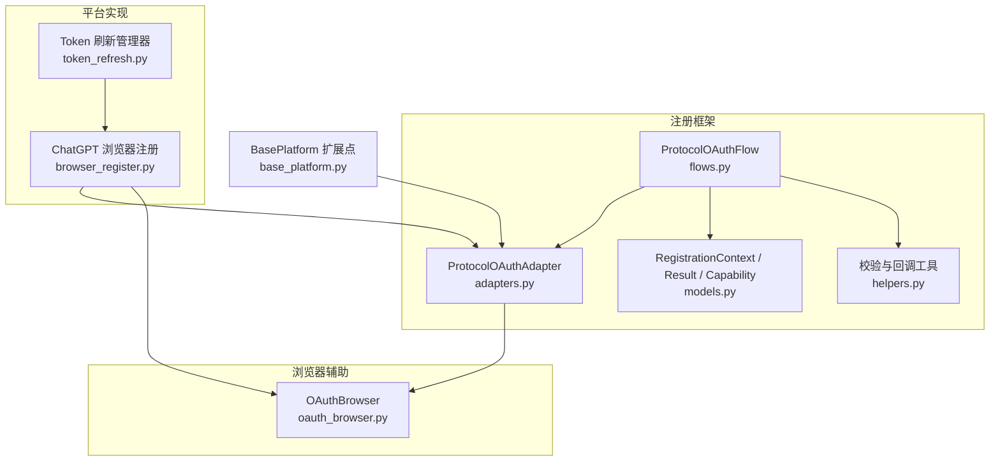
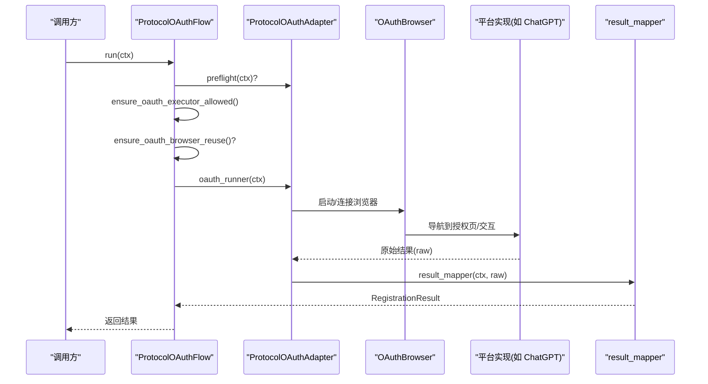
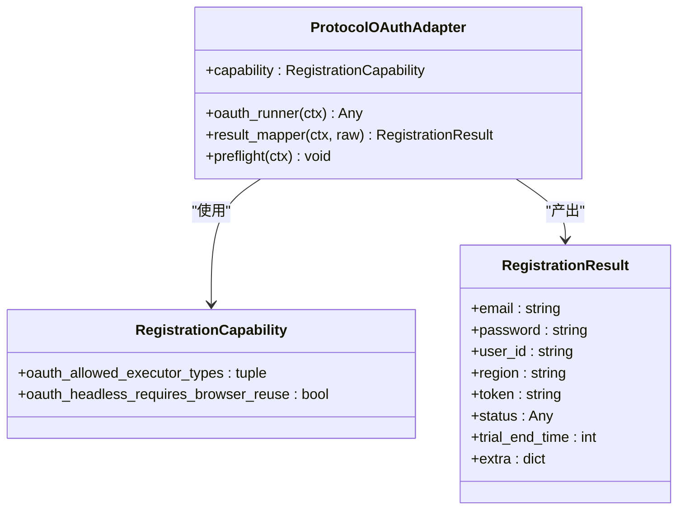
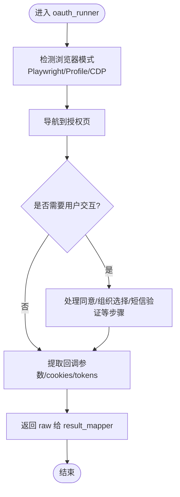
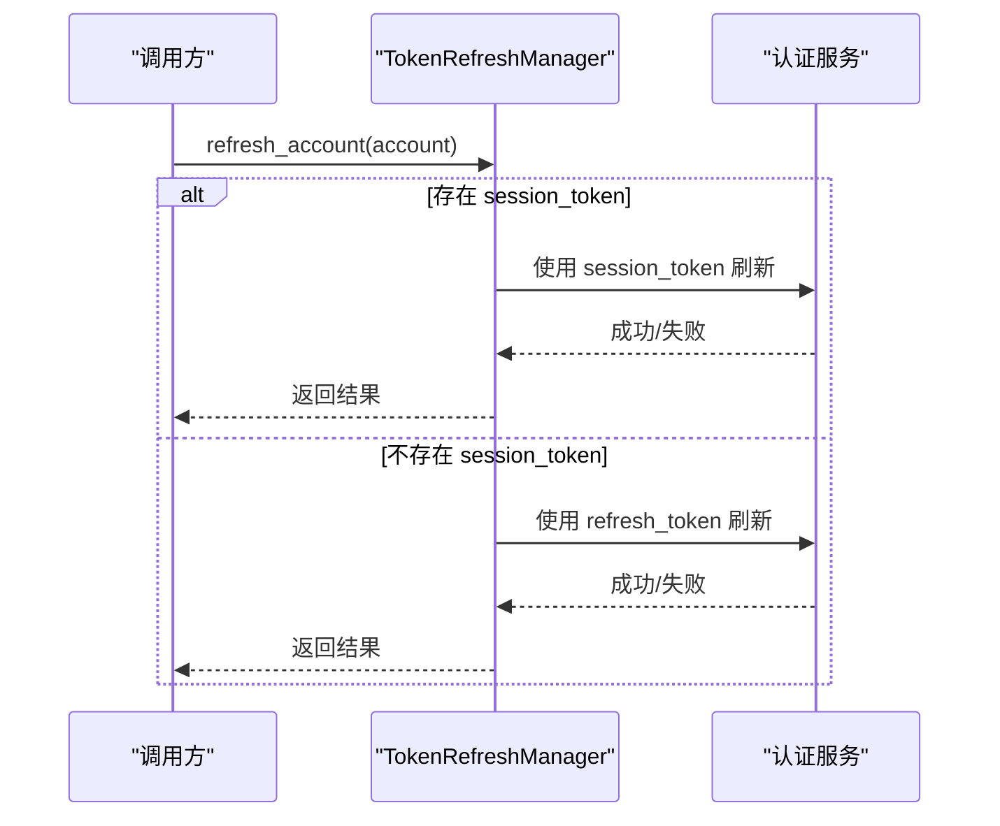
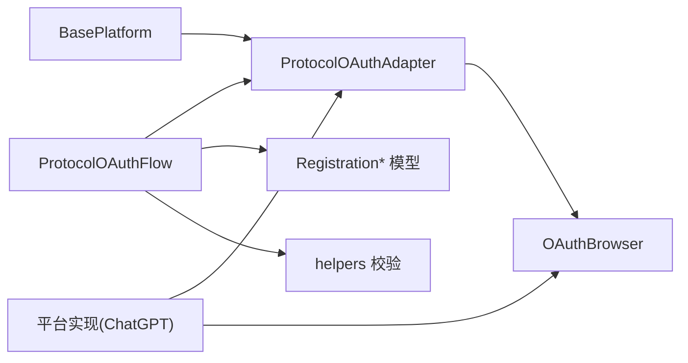

# 协议OAuth适配器

<cite>
**本文引用的文件**
- [adapters.py](file://core/registration/adapters.py)
- [flows.py](file://core/registration/flows.py)
- [models.py](file://core/registration/models.py)
- [helpers.py](file://core/registration/helpers.py)
- [oauth_browser.py](file://core/oauth_browser.py)
- [manual_oauth_browser.py](file://core/manual_oauth_browser.py)
- [browser_register.py](file://platforms/chatgpt/browser_register.py)
- [token_refresh.py](file://platforms/chatgpt/token_refresh.py)
- [base_platform.py](file://core/base_platform.py)
</cite>

## 目录
1. [简介](#简介)
2. [项目结构](#项目结构)
3. [核心组件](#核心组件)
4. [架构总览](#架构总览)
5. [详细组件分析](#详细组件分析)
6. [依赖关系分析](#依赖关系分析)
7. [性能考虑](#性能考虑)
8. [故障排查指南](#故障排查指南)
9. [结论](#结论)
10. [附录：完整构建示例与最佳实践](#附录完整构建示例与最佳实践)

## 简介
本文件面向需要实现或集成“协议级 OAuth 注册”的开发者，聚焦 ProtocolOAuthAdapter 的构建与配置、oauth_runner 的实现要求、result_mapper 在 OAuth 上下文中的作用、与第三方 OAuth 服务的集成模式，以及令牌管理、会话处理与异常处理的实践建议。文档基于代码库中的注册框架与平台实现进行系统化说明，并提供可操作的流程图与序列图帮助理解。

## 项目结构
围绕 OAuth 适配器的关键位置如下：
- 注册框架层：定义适配器、流程编排、能力声明与上下文模型
- 浏览器辅助层：提供跨平台的 OAuth 浏览器封装（Playwright/Chrome Profile/CDP）
- 平台实现层：以 ChatGPT 为例展示 oauth_runner 的具体实现与结果映射
- 令牌刷新层：提供 Session Token 与 OAuth Refresh Token 的刷新策略

**图表来源**
- [adapters.py:53-58](file://core/registration/adapters.py#L53-L58)
- [flows.py:124-141](file://core/registration/flows.py#L124-L141)
- [models.py:7-15](file://core/registration/models.py#L7-L15)
- [helpers.py:33-43](file://core/registration/helpers.py#L33-L43)
- [oauth_browser.py:139-214](file://core/oauth_browser.py#L139-L214)
- [browser_register.py:1540-1824](file://platforms/chatgpt/browser_register.py#L1540-L1824)
- [token_refresh.py:208-243](file://platforms/chatgpt/token_refresh.py#L208-L243)
- [base_platform.py:96-103](file://core/base_platform.py#L96-L103)

**章节来源**
- [adapters.py:53-58](file://core/registration/adapters.py#L53-L58)
- [flows.py:124-141](file://core/registration/flows.py#L124-L141)
- [models.py:7-15](file://core/registration/models.py#L7-L15)
- [helpers.py:33-43](file://core/registration/helpers.py#L33-L43)
- [oauth_browser.py:139-214](file://core/oauth_browser.py#L139-L214)
- [browser_register.py:1540-1824](file://platforms/chatgpt/browser_register.py#L1540-L1824)
- [token_refresh.py:208-243](file://platforms/chatgpt/token_refresh.py#L208-L243)
- [base_platform.py:96-103](file://core/base_platform.py#L96-L103)

## 核心组件
- ProtocolOAuthAdapter：协议级 OAuth 适配器数据类，包含 oauth_runner、result_mapper、capability、preflight。
- ProtocolOAuthFlow：流程编排器，负责前置检查、执行器类型校验、无头模式下的浏览器复用检查，然后调用 oauth_runner 并交由 result_mapper 产出最终结果。
- RegistrationCapability：声明 OAuth 相关能力，如允许的 executor_type、无头模式是否必须复用浏览器等。
- RegistrationContext / RegistrationResult：运行期上下文与标准化结果。
- OAuthBrowser：统一的 OAuth 浏览器封装，支持 Playwright、Chrome Profile、CDP 三种模式，提供自动选择账号、等待 URL/Cookie、Cookie 导出等能力。
- TokenRefreshManager：令牌刷新管理器，支持 Session Token 与 OAuth Refresh Token 两种刷新路径。

**章节来源**
- [adapters.py:53-58](file://core/registration/adapters.py#L53-L58)
- [flows.py:124-141](file://core/registration/flows.py#L124-L141)
- [models.py:7-15](file://core/registration/models.py#L7-L15)
- [models.py:17-41](file://core/registration/models.py#L17-L41)
- [models.py:44-66](file://core/registration/models.py#L44-L66)
- [oauth_browser.py:139-214](file://core/oauth_browser.py#L139-L214)
- [token_refresh.py:27-48](file://platforms/chatgpt/token_refresh.py#L27-L48)

## 架构总览
ProtocolOAuthFlow 作为统一入口，屏蔽了不同平台 OAuth 的差异，将“执行器类型校验”“无头模式浏览器复用校验”“实际 OAuth 流程”“结果映射”解耦为可插拔组件。平台通过实现 ProtocolOAuthAdapter 的 oauth_runner 与 result_mapper，即可接入统一流程。

**图表来源**
- [flows.py:124-141](file://core/registration/flows.py#L124-L141)
- [oauth_browser.py:139-214](file://core/oauth_browser.py#L139-L214)
- [browser_register.py:1540-1824](file://platforms/chatgpt/browser_register.py#L1540-L1824)

## 详细组件分析

### ProtocolOAuthAdapter 构建与配置
- oauth_runner：接收 RegistrationContext，完成实际的 OAuth 授权流程，返回任意中间结果（raw）。
- result_mapper：将 raw 转换为标准化的 RegistrationResult，填充 email/password/user_id/region/token/status/trial_end_time/extra 等字段。
- capability：声明 OAuth 行为约束，例如：
  - oauth_allowed_executor_types：限制允许的 executor_type（如 protocol/headless）。
  - oauth_headless_requires_browser_reuse：在无头模式下是否强制复用本地已登录浏览器会话。
- preflight：可选的前置检查钩子，用于在流程开始前做额外校验或准备。

**图表来源**
- [adapters.py:53-58](file://core/registration/adapters.py#L53-L58)
- [models.py:7-15](file://core/registration/models.py#L7-L15)
- [models.py:56-66](file://core/registration/models.py#L56-L66)

**章节来源**
- [adapters.py:53-58](file://core/registration/adapters.py#L53-L58)
- [models.py:7-15](file://core/registration/models.py#L7-L15)
- [models.py:56-66](file://core/registration/models.py#L56-L66)

### oauth_runner 实现要求
- 输入：RegistrationContext，包含平台名称、显示名、平台实例、身份对象、配置、邮箱/密码、日志函数等。
- 输出：任意 raw，由 result_mapper 进一步转换。
- 典型职责：
  - 根据 identity 决定浏览器模式（普通 Playwright / Chrome Profile / CDP），必要时复用本地已登录会话。
  - 导航至第三方 OAuth 授权页面，处理可能的多步交互（同意授权、组织/工作区选择、短信验证等）。
  - 捕获授权回调参数（如 code/state）、提取 cookies/session token/access_token/refresh_token 等。
  - 将原始信息返回给 result_mapper。

**图表来源**
- [oauth_browser.py:139-214](file://core/oauth_browser.py#L139-L214)
- [browser_register.py:1540-1824](file://platforms/chatgpt/browser_register.py#L1540-L1824)

**章节来源**
- [flows.py:124-141](file://core/registration/flows.py#L124-L141)
- [oauth_browser.py:139-214](file://core/oauth_browser.py#L139-L214)
- [browser_register.py:1540-1824](file://platforms/chatgpt/browser_register.py#L1540-L1824)

### result_mapper 在 OAuth 上下文中的作用
- 将 raw 标准化为 RegistrationResult，确保上层统一消费。
- 常见映射：
  - email：从 identity 或浏览器会话中解析。
  - password：若平台允许设置或复用，则填充；否则可为空。
  - user_id/region：从授权后信息中提取。
  - token：优先使用 access_token；若无，可使用 session_token 或 refresh_token 占位。
  - status/trial_end_time/extra：记录状态、试用截止时间及扩展字段。
- 校验：确保必要字段非空，抛出明确错误以便上游重试或提示。

**章节来源**
- [models.py:56-66](file://core/registration/models.py#L56-L66)

### 与第三方 OAuth 服务的集成模式
- 浏览器复用：
  - 优先尝试连接本机已运行的 Chrome（CDP），其次尝试加载本地 Chrome Profile（携带已登录会话），最后回退到普通 Chromium。
  - 支持代理配置，便于在不同网络环境下稳定访问授权服务。
- 自动交互：
  - 自动识别并点击 OAuth 提供商按钮（Google/GitHub/Microsoft/Apple/X 等）。
  - 自动处理 Google 账号选择器、同意授权、组织/工作区选择等常见步骤。
- 回调与令牌：
  - 监听授权回调 URL，提取 code/state 或直接获取 cookies。
  - 通过后续 API 交换 access_token/refresh_token，或直接从会话中获取 session_token。
- 平台示例：
  - ChatGPT 的浏览器注册流程展示了完整的 OAuth 交互、短信验证、会话补全与结果提取。

**章节来源**
- [oauth_browser.py:139-214](file://core/oauth_browser.py#L139-L214)
- [oauth_browser.py:245-325](file://core/oauth_browser.py#L245-L325)
- [browser_register.py:1540-1824](file://platforms/chatgpt/browser_register.py#L1540-L1824)

### 令牌管理与会话处理
- 令牌刷新策略：
  - 优先尝试 Session Token 刷新；失败则尝试 OAuth Refresh Token 刷新。
  - 若两者皆不可用，返回明确的错误信息。
- 令牌有效性校验：
  - 提供 validate_token 方法，用于判断 access_token 是否有效。
- 会话复用：
  - 通过 Chrome Profile 或 CDP 复用本地已登录会话，减少重复授权与验证码步骤。

**图表来源**
- [token_refresh.py:208-243](file://platforms/chatgpt/token_refresh.py#L208-L243)

**章节来源**
- [token_refresh.py:208-243](file://platforms/chatgpt/token_refresh.py#L208-L243)

## 依赖关系分析
- 流程层依赖适配器与模型：
  - ProtocolOAuthFlow 依赖 ProtocolOAuthAdapter、RegistrationCapability、RegistrationContext。
  - 通过 helpers 进行执行器类型与浏览器复用校验。
- 浏览器辅助层被 oauth_runner 使用：
  - OAuthBrowser 提供统一的浏览器生命周期管理与交互能力。
- 平台实现层实现具体 OAuth 流程：
  - 以 ChatGPT 为例，展示如何组合 OAuthBrowser 与平台特定逻辑。
- BasePlatform 提供扩展点：
  - build_protocol_oauth_adapter 用于平台注册 OAuth 适配器。

**图表来源**
- [flows.py:124-141](file://core/registration/flows.py#L124-L141)
- [adapters.py:53-58](file://core/registration/adapters.py#L53-L58)
- [oauth_browser.py:139-214](file://core/oauth_browser.py#L139-L214)
- [base_platform.py:96-103](file://core/base_platform.py#L96-L103)

**章节来源**
- [flows.py:124-141](file://core/registration/flows.py#L124-L141)
- [adapters.py:53-58](file://core/registration/adapters.py#L53-L58)
- [oauth_browser.py:139-214](file://core/oauth_browser.py#L139-L214)
- [base_platform.py:96-103](file://core/base_platform.py#L96-L103)

## 性能考虑
- 浏览器复用：
  - 优先复用本地 Chrome Profile 或 CDP 连接，避免重复登录与验证码，显著降低耗时。
- 无头模式限制：
  - 当 capability 要求无头模式必须复用浏览器时，需确保配置 chrome_user_data_dir 或 chrome_cdp_url，否则会抛错中断流程。
- 代理配置：
  - 合理配置代理可降低网络波动对授权流程的影响。
- 令牌刷新：
  - 优先使用 Session Token 刷新，失败再尝试 OAuth Refresh Token，提高成功率与速度。

[本节为通用指导，不直接分析具体文件]

## 故障排查指南
- 执行器类型不支持：
  - 现象：抛出“当前 OAuth 仅支持 executor_type=...”错误。
  - 原因：capability.oauth_allowed_executor_types 限制了允许的 executor_type。
  - 处理：调整任务配置或平台能力声明。
- 无头模式缺少浏览器复用：
  - 现象：抛出“无头 OAuth 需要配置 chrome_user_data_dir 或 chrome_cdp_url”错误。
  - 原因：capability.oauth_headless_requires_browser_reuse 为真但未配置复用方式。
  - 处理：配置本地 Chrome Profile 或 CDP 地址。
- 邮箱不一致或未识别：
  - 现象：finalize_oauth_email 抛出“OAuth 登录邮箱与预期不一致”或“未识别到邮箱”。
  - 原因：实际邮箱与预期不符或未传入 email/oauth_email_hint。
  - 处理：修正邮箱参数或确保流程能正确识别邮箱。
- 令牌刷新失败：
  - 现象：refresh_account 返回 success=False 且 error_message 描述问题。
  - 原因：session_token 与 refresh_token 均不可用或请求失败。
  - 处理：检查凭证与网络，必要时重新走 OAuth 流程获取新令牌。

**章节来源**
- [helpers.py:33-43](file://core/registration/helpers.py#L33-L43)
- [oauth_browser.py:48-60](file://core/oauth_browser.py#L48-L60)
- [token_refresh.py:208-243](file://platforms/chatgpt/token_refresh.py#L208-L243)

## 结论
ProtocolOAuthAdapter 通过清晰的职责划分与可扩展的流程编排，使不同平台的 OAuth 注册能够以统一方式接入系统。结合 OAuthBrowser 的浏览器复用与交互能力，以及 TokenRefreshManager 的令牌刷新策略，可以在保证稳定性的同时提升效率。建议在实现 oauth_runner 时严格遵循上下文与结果映射规范，并在 capability 中准确声明行为约束，以获得最佳的可维护性与可观测性。

[本节为总结，不直接分析具体文件]

## 附录：完整构建示例与最佳实践

### 构建 ProtocolOAuthAdapter 的步骤
- 定义 capability：
  - 设置 oauth_allowed_executor_types 限制执行器类型。
  - 若无头模式需复用浏览器，设置 oauth_headless_requires_browser_reuse 为真。
- 实现 oauth_runner：
  - 使用 OAuthBrowser 启动/连接浏览器，导航至授权页。
  - 处理可能的多步交互（同意授权、组织选择、短信验证）。
  - 提取回调参数与 cookies，必要时调用平台 API 换取 access_token/refresh_token。
  - 返回 raw。
- 实现 result_mapper：
  - 将 raw 转换为 RegistrationResult，填充 email/password/user_id/region/token/status/trial_end_time/extra。
  - 进行必要校验，确保关键字段非空。
- 可选 preflight：
  - 在流程开始前进行额外校验或准备。

**章节来源**
- [adapters.py:53-58](file://core/registration/adapters.py#L53-L58)
- [flows.py:124-141](file://core/registration/flows.py#L124-L141)
- [models.py:56-66](file://core/registration/models.py#L56-L66)

### OAuth 流程处理要点
- 执行器类型校验：
  - 通过 ensure_oauth_executor_allowed 确保当前 executor_type 符合 capability 要求。
- 无头模式浏览器复用：
  - 通过 ensure_oauth_browser_reuse 确保在无头模式下具备可用的浏览器复用配置。
- 浏览器交互：
  - 使用 try_click_provider 自动选择 OAuth 提供商。
  - 使用 wait_for_url/wait_for_cookie_value 等待授权回调或关键 Cookie。
  - 使用 cookie_dict/cookie_header 导出会话信息供后续 API 调用。

**章节来源**
- [helpers.py:33-43](file://core/registration/helpers.py#L33-L43)
- [oauth_browser.py:245-325](file://core/oauth_browser.py#L245-L325)
- [oauth_browser.py:360-393](file://core/oauth_browser.py#L360-L393)

### 令牌管理、会话处理与异常处理最佳实践
- 令牌管理：
  - 优先使用 Session Token 刷新，失败再尝试 OAuth Refresh Token。
  - 定期校验 access_token 有效性，及时刷新以避免过期。
- 会话处理：
  - 优先复用本地 Chrome Profile 或 CDP 连接，减少重复授权。
  - 合理配置代理，确保在不同网络环境下稳定访问。
- 异常处理：
  - 对执行器类型与浏览器复用进行前置校验，尽早失败并给出明确信息。
  - 对邮箱不一致或未识别的情况抛出清晰错误，便于定位问题。
  - 对令牌刷新失败记录错误信息，便于追踪与重试。

**章节来源**
- [token_refresh.py:208-243](file://platforms/chatgpt/token_refresh.py#L208-L243)
- [oauth_browser.py:48-60](file://core/oauth_browser.py#L48-L60)
- [helpers.py:33-43](file://core/registration/helpers.py#L33-L43)