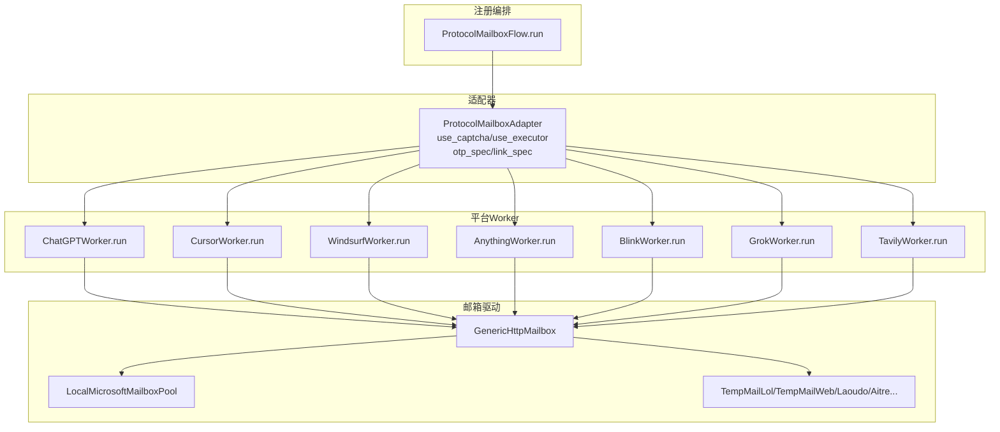
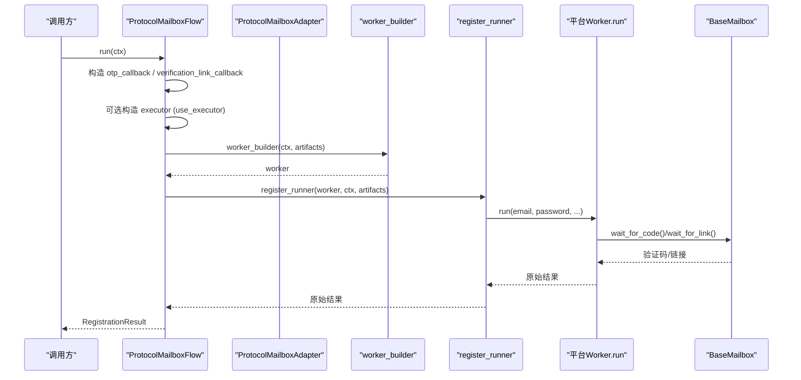
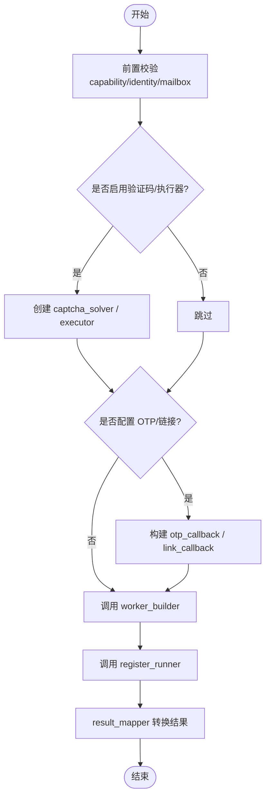
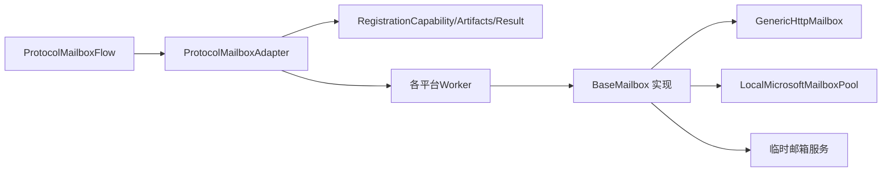

# 协议邮箱适配器

<cite>
**本文引用的文件**
- [adapters.py](file://core/registration/adapters.py)
- [flows.py](file://core/registration/flows.py)
- [models.py](file://core/registration/models.py)
- [base_mailbox.py](file://core/base_mailbox.py)
- [generic_http_mailbox.py](file://core/generic_http_mailbox.py)
- [local_ms_mailbox.py](file://core/local_ms_mailbox.py)
- [protocol_mailbox.py（ChatGPT）](file://platforms/chatgpt/protocol_mailbox.py)
- [protocol_mailbox.py（Cursor）](file://platforms/cursor/protocol_mailbox.py)
- [protocol_mailbox.py（Windsurf）](file://platforms/windsurf/protocol_mailbox.py)
- [protocol_mailbox.py（Anything）](file://platforms/anything/protocol_mailbox.py)
- [protocol_mailbox.py（Blink）](file://platforms/blink/protocol_mailbox.py)
- [protocol_mailbox.py（Grok）](file://platforms/grok/protocol_mailbox.py)
- [protocol_mailbox.py（Tavily）](file://platforms/tavily/protocol_mailbox.py)
</cite>

## 目录
1. [简介](#简介)
2. [项目结构](#项目结构)
3. [核心组件](#核心组件)
4. [架构总览](#架构总览)
5. [详细组件分析](#详细组件分析)
6. [依赖关系分析](#依赖关系分析)
7. [性能考虑](#性能考虑)
8. [故障排查指南](#故障排查指南)
9. [结论](#结论)
10. [附录：构建示例与最佳实践](#附录构建示例与最佳实践)

## 简介
本协议邮箱适配器文档聚焦于“协议邮箱注册”工作流，围绕 ProtocolMailboxAdapter 的构建与配置、worker_builder 与 register_runner 的实现要求、use_captcha 与 use_executor 参数的作用机制、与多种邮箱服务提供商的集成方式、以及验证码/链接验证流程与错误恢复进行系统化说明。读者可据此快速理解并实现新的平台协议邮箱注册适配。

## 项目结构
协议邮箱注册由“注册流程编排 + 适配器声明 + 具体平台 Worker + 邮箱驱动”四层组成：
- 注册流程编排：定义统一执行路径，负责准备上下文、构造回调、管理执行器生命周期、调用 worker_builder 与 register_runner。
- 适配器声明：ProtocolMailboxAdapter 描述能力、回调策略、是否启用验证码/执行器等元信息。
- 平台 Worker：各平台的 protocol_mailbox.py 提供 run(...) 方法，封装平台特定注册步骤。
- 邮箱驱动：BaseMailbox 及其实现（通用 HTTP、临时邮箱、本地微软池等），提供 get_email/wait_for_code/wait_for_link 等能力。

图表来源
- [flows.py:81-121](file://core/registration/flows.py#L81-L121)
- [adapters.py:40-50](file://core/registration/adapters.py#L40-L50)
- [base_mailbox.py:27-48](file://core/base_mailbox.py#L27-L48)

章节来源
- [flows.py:81-121](file://core/registration/flows.py#L81-L121)
- [adapters.py:40-50](file://core/registration/adapters.py#L40-L50)
- [base_mailbox.py:27-48](file://core/base_mailbox.py#L27-L48)

## 核心组件
- ProtocolMailboxAdapter：声明式适配器，包含 result_mapper、worker_builder、register_runner、capability、otp_spec、link_spec、use_captcha、use_executor、preflight。
- ProtocolMailboxFlow：统一执行流程，负责前置校验、构造 artifacts（验证码求解器、OTP/链接回调、执行器）、调用 worker_builder 与 register_runner，并将原始结果映射为 RegistrationResult。
- BaseMailbox 及实现：抽象邮箱接口与多种实现（通用 HTTP、本地微软池、临时邮箱服务等）。
- 平台 Worker：每个平台提供一个 Worker 类，其 run(...) 接收 email/password/name 等参数，并通过回调获取 OTP/链接。

章节来源
- [adapters.py:40-50](file://core/registration/adapters.py#L40-L50)
- [flows.py:81-121](file://core/registration/flows.py#L81-L121)
- [base_mailbox.py:27-48](file://core/base_mailbox.py#L27-L48)

## 架构总览
下图展示一次协议邮箱注册的端到端调用序列：流程层构造回调与执行器，调用适配器提供的 worker_builder 创建平台 Worker，再调用 register_runner 执行注册；期间通过回调从邮箱驱动拉取验证码或链接。

图表来源
- [flows.py:81-121](file://core/registration/flows.py#L81-L121)
- [base_mailbox.py:27-48](file://core/base_mailbox.py#L27-L48)

## 详细组件分析

### ProtocolMailboxAdapter：构建与配置
- 必需字段
  - result_mapper：将 register_runner 返回的原始结果转换为 RegistrationResult。
  - worker_builder：根据 RegistrationContext 和 RegistrationArtifacts 构造平台 Worker 实例。
  - register_runner：执行注册流程，通常调用 Worker.run(...) 并返回原始结果。
- 可选能力
  - capability：声明是否需要邮箱/邮箱 provider 等约束。
  - otp_spec/link_spec：配置验证码/链接等待行为（关键词、超时、正则、提示文案等）。
  - use_captcha：在流程中自动注入验证码求解器到 artifacts。
  - use_executor：在流程中以上下文管理器方式创建并注入执行器到 artifacts。
  - preflight：注册前预检查钩子。

章节来源
- [adapters.py:40-50](file://core/registration/adapters.py#L40-L50)
- [models.py:7-15](file://core/registration/models.py#L7-L15)

### ProtocolMailboxFlow：执行流程与回调装配
- 前置校验：依据 capability 校验 identity/email/mailbox 是否存在。
- 资源装配：
  - 若 use_captcha 为真，则从 platform 创建验证码求解器放入 artifacts。
  - 若配置了 otp_spec/link_spec，则分别构建 OTP 回调与链接回调放入 artifacts。
- 执行器管理：若 use_executor 为真，则以上下文管理器方式创建执行器并注入 artifacts。
- 调用链：调用 adapter.worker_builder 得到 worker，再调用 adapter.register_runner 执行注册，最后用 result_mapper 转换结果。

图表来源
- [flows.py:81-121](file://core/registration/flows.py#L81-L121)

章节来源
- [flows.py:81-121](file://core/registration/flows.py#L81-L121)

### worker_builder 与 register_runner 的实现要求
- worker_builder(ctx, artifacts)
  - 输入：RegistrationContext（平台名、显示名、平台对象、身份、配置、日志函数等）与 RegistrationArtifacts（可能包含验证码求解器、OTP/链接回调、执行器）。
  - 输出：平台特定的 Worker 实例（具备 run(...) 方法）。
  - 常见模式：读取 ctx.proxy/extra，使用 artifacts.captcha_solver/artifacts.executor 初始化平台客户端。
- register_runner(worker, ctx, artifacts)
  - 输入：已创建的 Worker、上下文、制品。
  - 职责：组装运行参数（email/password/name 等），调用 worker.run(...)，捕获异常并返回原始结果。
  - 注意：不应在此处做结果映射，应由 result_mapper 完成。

章节来源
- [flows.py:81-121](file://core/registration/flows.py#L81-L121)
- [adapters.py:40-50](file://core/registration/adapters.py#L40-L50)

### use_captcha 的作用机制
- 当 use_captcha=True 时，流程会在 artifacts 中注入验证码求解器，供平台 Worker 在需要人机校验的步骤中使用（如提交密码/验证码页面）。
- 未启用时，Worker 需自行处理或拒绝执行需要验证码的步骤。

章节来源
- [flows.py:93-96](file://core/registration/flows.py#L93-L96)
- [adapters.py:40-50](file://core/registration/adapters.py#L40-L50)

### use_executor 的作用机制
- 当 use_executor=True 时，流程会以上下文管理器方式创建执行器并注入 artifacts，供需要并发/异步能力的平台 Worker 使用。
- 未启用时，Worker 应在自身内部处理并发或串行逻辑。

章节来源
- [flows.py:115-118](file://core/registration/flows.py#L115-L118)
- [adapters.py:40-50](file://core/registration/adapters.py#L40-L50)

### 邮箱验证流程与错误恢复
- OTP 验证码流程
  - 流程层根据 otp_spec 构建 otp_callback，内部会调用邮箱驱动的 wait_for_code，支持 keyword/code_pattern/timeout。
  - 邮箱驱动实现（如 GenericHttpMailbox、LocalMicrosoftMailboxPool、临时邮箱服务）轮询邮件列表，提取验证码或链接。
  - 超时或未找到匹配内容时抛出 TimeoutError，上层可据此重试或降级。
- 魔法链接流程
  - 流程层根据 link_spec 构建 verification_link_callback，内部调用邮箱驱动的 wait_for_link，提取验证链接。
  - 链接提取逻辑对常见关键词与域名进行启发式匹配，提高鲁棒性。
- 错误恢复建议
  - 合理设置 timeout 与 code_pattern，避免误匹配。
  - 对网络异常采用指数退避重试（在邮箱驱动内部已内置部分重试/延迟）。
  - 结合 fallback mailbox（如 FallbackMailbox）在多 provider 间切换。

章节来源
- [flows.py:96-113](file://core/registration/flows.py#L96-L113)
- [base_mailbox.py:120-149](file://core/base_mailbox.py#L120-L149)
- [generic_http_mailbox.py:338-411](file://core/generic_http_mailbox.py#L338-L411)
- [local_ms_mailbox.py:454-501](file://core/local_ms_mailbox.py#L454-L501)

### 与各种邮箱服务提供商的集成
- 通用 HTTP 邮箱驱动（GenericHttpMailbox）
  - 通过 pipeline_config（来自 provider_definitions.metadata_json）与 settings（用户 UI 填写的 flat 字段）合并构建步骤管道。
  - 支持 auth_steps、create_email、list_emails、get_detail 等步骤，动态提取变量与 Cookie。
  - 支持多种认证类型（bearer/header/api_key_param）与请求体格式（json/form）。
- 本地微软邮箱池（LocalMicrosoftMailboxPool）
  - 支持 Microsoft Graph 与 IMAP 两种收件方式，优先 Graph；无 OAuth 时回退 IMAP。
  - 支持池化账号复用控制与状态持久化。
- 其他临时邮箱服务
  - 包括 tempmail.lol、temp-mail.org、laoudo、aitre 等，均实现 BaseMailbox 接口，提供 get_email/wait_for_code/wait_for_link。

章节来源
- [generic_http_mailbox.py:75-161](file://core/generic_http_mailbox.py#L75-L161)
- [generic_http_mailbox.py:165-257](file://core/generic_http_mailbox.py#L165-L257)
- [local_ms_mailbox.py:161-290](file://core/local_ms_mailbox.py#L161-L290)
- [base_mailbox.py:162-347](file://core/base_mailbox.py#L162-L347)

### 平台 Worker 示例与差异
- ChatGPT
  - 通过 _MailboxEmailService 桥接 BaseMailbox，调用 wait_for_code 获取验证码。
  - 适合仅需 OTP 的平台。
- Cursor
  - 直接调用平台客户端步骤，支持外部传入 otp_callback。
- Windsurf
  - 需要 otp_callback，内部解析 6 位验证码；失败时抛出明确错误。
- Anything
  - 需要 link_callback，支持解析魔法链接与跳转追踪链接。
- Blink
  - 需要 link_callback，支持 magic_token 提取与后续登录流程。
- Grok
  - 需要 otp_callback，用于 OTP 验证后设置 cookies 并返回 SSO 信息。
- Tavily
  - 需要 executor 与 captcha（由流程层注入），按步骤完成授权、验证码、API Key 获取。

章节来源
- [protocol_mailbox.py（ChatGPT）:9-66](file://platforms/chatgpt/protocol_mailbox.py#L9-L66)
- [protocol_mailbox.py（Cursor）:9-40](file://platforms/cursor/protocol_mailbox.py#L9-L40)
- [protocol_mailbox.py（Windsurf）:10-83](file://platforms/windsurf/protocol_mailbox.py#L10-L83)
- [protocol_mailbox.py（Anything）:17-134](file://platforms/anything/protocol_mailbox.py#L17-L134)
- [protocol_mailbox.py（Blink）:10-173](file://platforms/blink/protocol_mailbox.py#L10-L173)
- [protocol_mailbox.py（Grok）:9-55](file://platforms/grok/protocol_mailbox.py#L9-L55)
- [protocol_mailbox.py（Tavily）:9-33](file://platforms/tavily/protocol_mailbox.py#L9-L33)

## 依赖关系分析
- 流程层依赖适配器与模型，适配器仅声明能力与回调策略，不耦合具体平台。
- 平台 Worker 依赖各自 core 模块与邮箱驱动；邮箱驱动之间相互独立，通过统一接口被 Worker 调用。
- 通用 HTTP 邮箱驱动依赖 requests 与 TLS 工具，支持代理与多步认证。

图表来源
- [flows.py:81-121](file://core/registration/flows.py#L81-L121)
- [adapters.py:40-50](file://core/registration/adapters.py#L40-L50)
- [models.py:7-66](file://core/registration/models.py#L7-L66)
- [base_mailbox.py:27-48](file://core/base_mailbox.py#L27-L48)

章节来源
- [flows.py:81-121](file://core/registration/flows.py#L81-L121)
- [adapters.py:40-50](file://core/registration/adapters.py#L40-L50)
- [models.py:7-66](file://core/registration/models.py#L7-L66)

## 性能考虑
- 邮箱轮询间隔：默认 3-5 秒，可根据服务商限频调整；临时邮箱 Web 实现内置 429 重试与退避。
- 连接复用：通用 HTTP 驱动使用 Session 保持连接，减少握手开销。
- 并发控制：use_executor 开启时，平台可在 Worker 内并行执行多个请求；未开启时建议串行以避免限频。
- 代理与 TLS：所有 HTTP 请求支持代理；TLS 警告抑制以提升稳定性。

[本节为通用指导，无需引用具体文件]

## 故障排查指南
- 未获取到邮箱账号
  - 现象：流程抛出“注册流程依赖 mailbox provider，当前未获取到邮箱账号”。
  - 排查：确认 identity 已绑定邮箱，且 capability 允许协议邮箱模式。
- 验证码/链接超时
  - 现象：TimeoutError。
  - 排查：检查 keyword/code_pattern 是否匹配实际邮件内容；适当增大 timeout；确认邮箱 provider 可用。
- 魔法链接无法解析
  - 现象：无法提取 code/token。
  - 排查：确认 link_callback 返回的是最终跳转链接或包含必要参数的 URL；必要时先 resolve 追踪链接。
- 通用 HTTP 邮箱驱动报错
  - 现象：步骤执行失败或响应非 JSON。
  - 排查：核对 pipeline_config 的 method/path/headers/body；确认 api_url 与认证头正确；检查 response_list_path 与 id_field。
- 本地微软邮箱池不可用
  - 现象：Graph token 刷新失败或 IMAP 连接失败。
  - 排查：确认 client_id/refresh_token 有效；IMAP 主机/端口/安全策略正确；代理配置无误。

章节来源
- [flows.py:88-91](file://core/registration/flows.py#L88-L91)
- [generic_http_mailbox.py:338-411](file://core/generic_http_mailbox.py#L338-L411)
- [local_ms_mailbox.py:344-381](file://core/local_ms_mailbox.py#L344-L381)
- [base_mailbox.py:120-149](file://core/base_mailbox.py#L120-L149)

## 结论
ProtocolMailboxAdapter 以声明式方式解耦了平台注册流程与邮箱驱动，配合统一的流程编排，实现了可扩展、可复用的协议邮箱注册体系。通过 use_captcha 与 use_executor 的灵活开关，以及 otp_spec/link_spec 的细粒度配置，能够覆盖绝大多数平台的注册需求。结合通用 HTTP 邮箱驱动与多种现成邮箱服务，可快速接入新平台并保证稳定性与可维护性。

[本节为总结性内容，无需引用具体文件]

## 附录：构建示例与最佳实践
- 构建 ProtocolMailboxAdapter 的基本步骤
  - 定义 result_mapper：将平台原始结果映射为 RegistrationResult（包含 email/password/user_id 等）。
  - 实现 worker_builder：根据 ctx 与 artifacts 构造平台 Worker（例如注入 proxy、captcha_solver、executor）。
  - 实现 register_runner：调用 Worker.run(...) 并返回原始结果；捕获异常并转化为有意义的错误信息。
  - 配置 capability/otp_spec/link_spec/use_captcha/use_executor/preflight：按需启用。
- 典型平台集成要点
  - 仅需 OTP：使用 otp_spec，并在 Worker 中通过 otp_callback 获取验证码。
  - 仅需魔法链接：使用 link_spec，并在 Worker 中通过 verification_link_callback 获取链接。
  - 需要并发/浏览器执行器：设置 use_executor=True，并在 Worker 中使用 artifacts.executor。
  - 需要验证码：设置 use_captcha=True，并在 Worker 中调用验证码求解器。
- 邮箱驱动选择建议
  - 自有 API：优先使用 GenericHttpMailbox，通过 pipeline_config 零代码对接。
  - 已有微软账户池：使用 LocalMicrosoftMailboxPool，优先 Graph 提升稳定性。
  - 临时邮箱：根据目标平台限制选择合适服务（如 tempmail.lol/temp-mail.org/laoudo/aitre）。
- 最佳实践
  - 合理设置 timeout 与 code_pattern，避免误匹配与过长等待。
  - 对关键步骤增加日志与异常堆栈，便于定位问题。
  - 使用 FallbackMailbox 或多 provider 组合，提高容错率。
  - 对第三方服务限频敏感的场景，降低轮询频率或增加退避策略。

[本节为实践指导，无需引用具体文件]