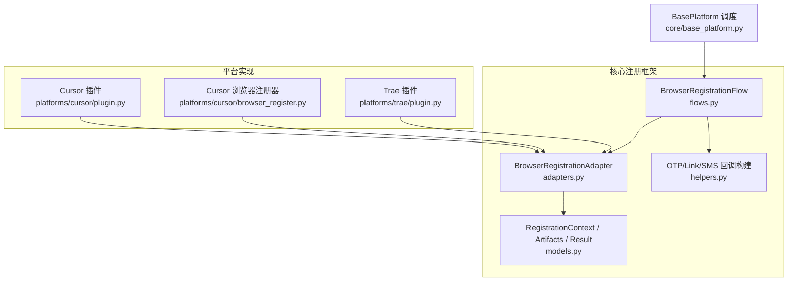
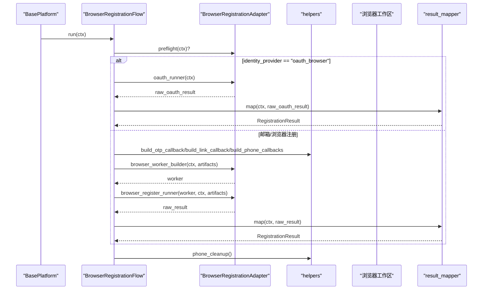
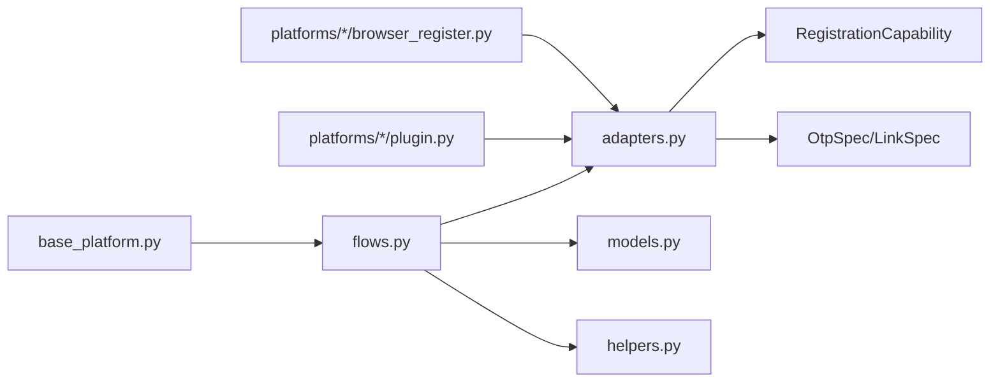

# 浏览器注册适配器

<cite>
**本文引用的文件**
- [adapters.py](file://core/registration/adapters.py)
- [models.py](file://core/registration/models.py)
- [flows.py](file://core/registration/flows.py)
- [helpers.py](file://core/registration/helpers.py)
- [base_platform.py](file://core/base_platform.py)
- [browser_register.py (Cursor)](file://platforms/cursor/browser_register.py)
- [plugin.py (Cursor)](file://platforms/cursor/plugin.py)
- [plugin.py (Trae)](file://platforms/trae/plugin.py)
</cite>

## 目录
1. [简介](#简介)
2. [项目结构](#项目结构)
3. [核心组件](#核心组件)
4. [架构总览](#架构总览)
5. [详细组件分析](#详细组件分析)
6. [依赖关系分析](#依赖关系分析)
7. [性能考虑](#性能考虑)
8. [故障排查指南](#故障排查指南)
9. [结论](#结论)
10. [附录：构建示例与最佳实践](#附录构建示例与最佳实践)

## 简介
本文件面向需要实现或集成“浏览器注册适配器”的开发者，系统性说明 BrowserRegistrationAdapter 的构建与配置方法，解释 result_mapper、browser_worker_builder、browser_register_runner、oauth_runner 等必需方法的职责与约束；阐述 OtpSpec 与 LinkSpec 的配置项与作用机制；说明 use_captcha_for_mailbox 的使用场景；并提供完整的适配器构建示例、执行时机与错误处理策略。

## 项目结构
围绕浏览器注册的核心代码位于 core/registration 与 platforms/* 下的具体平台实现中。整体流程由 flows.py 编排，adapters.py 定义适配器契约，models.py 提供上下文与产物模型，helpers.py 提供 OTP/链接/SMS 回调构建能力。平台侧通过 plugin.py 暴露 build_browser_registration_adapter 以返回适配器实例，并在 base_platform.py 中根据 executor_type 选择浏览器模式注册流程。

图表来源
- [flows.py:18-78](file://core/registration/flows.py#L18-L78)
- [adapters.py:27-38](file://core/registration/adapters.py#L27-L38)
- [models.py:17-66](file://core/registration/models.py#L17-L66)
- [helpers.py:46-177](file://core/registration/helpers.py#L46-L177)
- [base_platform.py:124-144](file://core/base_platform.py#L124-L144)

章节来源
- [flows.py:18-78](file://core/registration/flows.py#L18-L78)
- [adapters.py:27-38](file://core/registration/adapters.py#L27-L38)
- [models.py:17-66](file://core/registration/models.py#L17-L66)
- [helpers.py:46-177](file://core/registration/helpers.py#L46-L177)
- [base_platform.py:124-144](file://core/base_platform.py#L124-L144)

## 核心组件
- BrowserRegistrationAdapter：声明式描述一次浏览器注册的“可插拔”流程，包含结果映射、浏览器工作区构建、注册执行、OAuth 执行、能力开关、验证码/链接等待规格、邮箱模式是否启用验证码等。
- RegistrationContext：注册上下文，携带平台信息、身份、配置、邮箱/密码、日志函数等。
- RegistrationArtifacts：注册过程中产生的中间产物，如 OTP/链接/手机回调、验证码求解器、执行器、原始结果、元数据等。
- RegistrationResult：最终注册结果，包含账号、凭据、用户标识、区域、令牌、状态、试用结束时间、扩展字段等。
- OtpSpec/LinkSpec：用于配置等待并获取验证码或验证链接的行为（关键词、超时、正则、提示文案等）。

章节来源
- [adapters.py:27-38](file://core/registration/adapters.py#L27-L38)
- [models.py:17-66](file://core/registration/models.py#L17-L66)

## 架构总览
浏览器注册流程由 BasePlatform 在 executor_type 为 headless/headed 时进入 BrowserRegistrationFlow。流程会：
- 可选执行 preflight
- 若 identity_provider 为 oauth_browser，则校验执行器类型与复用要求，调用 oauth_runner 并映射结果
- 否则准备邮箱/短信/验证码相关回调（基于 capability 和 spec）
- 构建 worker 并执行 browser_register_runner
- 将 raw_result 映射为 RegistrationResult
- 确保 phone_cleanup 被调用

图表来源
- [flows.py:22-78](file://core/registration/flows.py#L22-L78)
- [helpers.py:46-177](file://core/registration/helpers.py#L46-L177)
- [base_platform.py:124-144](file://core/base_platform.py#L124-L144)

## 详细组件分析

### BrowserRegistrationAdapter 字段与方法要求
- result_mapper(ctx, raw_result) -> RegistrationResult
  - 必须实现。负责将浏览器/OAuth 返回的原始结果转换为统一的 RegistrationResult。
- browser_worker_builder(ctx, artifacts) -> Any | None
  - 可选。用于创建浏览器工作区对象（例如 CursorBrowserRegister），接收上下文与产物（含 OTP/链接/手机回调、验证码求解器等）。
- browser_register_runner(worker, ctx, artifacts) -> Any
  - 当存在 worker 时必须实现。驱动浏览器完成注册流程，返回原始结果。
- oauth_runner(ctx) -> Any
  - 可选。当 identity_provider 为 oauth_browser 时使用，完成 OAuth 登录并返回原始结果。
- capability: RegistrationCapability
  - 控制邮箱/协议模式的能力开关，例如是否需要邮箱、是否需要 mailbox provider、OAuth 允许的执行器类型、无头模式是否需要复用浏览器会话等。
- otp_spec: OtpSpec | None
  - 配置邮箱验证码等待行为。
- link_spec: LinkSpec | None
  - 配置验证链接等待行为。
- use_captcha_for_mailbox: bool
  - 当 identity_provider 为 mailbox 且为 True 时，会在流程中注入 captcha_solver 到 artifacts，供浏览器工作区使用。
- preflight(ctx) -> None
  - 可选。注册前预处理钩子。

章节来源
- [adapters.py:27-38](file://core/registration/adapters.py#L27-L38)
- [flows.py:22-78](file://core/registration/flows.py#L22-L78)

### OtpSpec 配置与作用机制
- keyword: str
  - 邮件关键词过滤，缩小等待范围。
- timeout: int | None
  - 等待验证码的最大时长（秒）。
- code_pattern: str | None
  - 验证码的正则表达式，用于从邮件正文中提取数字码。
- wait_message: str
  - 等待时的日志提示。
- success_label: str
  - 成功获取验证码后的日志标签。

作用机制：
- 当 adapter.otp_spec 存在时，flows.py 会调用 helpers.build_otp_callback 生成 otp_callback，并将其写入 artifacts。
- 浏览器工作区在需要验证码时调用 otp_callback 阻塞等待并返回验证码。

章节来源
- [adapters.py:9-16](file://core/registration/adapters.py#L9-L16)
- [flows.py:46-57](file://core/registration/flows.py#L46-L57)
- [helpers.py:46-72](file://core/registration/helpers.py#L46-L72)

### LinkSpec 配置与作用机制
- keyword: str
  - 邮件关键词过滤。
- timeout: int | None
  - 等待验证链接的最大时长（秒）。
- wait_message: str
  - 等待时的日志提示。
- success_label: str
  - 成功获取链接后的日志标签。
- preview_chars: int
  - 成功日志中链接预览长度。

作用机制：
- 当 adapter.link_spec 存在时，flows.py 会调用 helpers.build_link_callback 生成 verification_link_callback，并将其写入 artifacts。
- 浏览器工作区在需要点击验证链接时调用该回调获取 URL。

章节来源
- [adapters.py:18-25](file://core/registration/adapters.py#L18-L25)
- [flows.py:58-66](file://core/registration/flows.py#L58-L66)
- [helpers.py:150-177](file://core/registration/helpers.py#L150-L177)

### use_captcha_for_mailbox 使用场景
- 当 identity_provider 为 mailbox 且 use_captcha_for_mailbox=True 时，flows.py 会为 artifacts 注入 captcha_solver。
- 典型场景：邮箱注册流程中包含 Turnstile 或其他验证码，需要在浏览器内自动解题。
- 平台示例：Cursor 插件设置 use_captcha_for_mailbox=True，以便在注册过程中调用 Captcha Solver 解决 Turnstile。

章节来源
- [flows.py:46-49](file://core/registration/flows.py#L46-L49)
- [plugin.py (Cursor):72-91](file://platforms/cursor/plugin.py#L72-L91)

### 浏览器自动化流程的执行时机
- BasePlatform.register 在 executor_type 为 headless/headed 时进入浏览器注册流程。
- BrowserRegistrationFlow.run 按顺序执行：
  - preflight（可选）
  - 若为 oauth_browser，则走 OAuth 分支
  - 否则准备 OTP/链接/手机回调
  - 构建 worker 并执行注册
  - 映射结果并清理资源

章节来源
- [base_platform.py:124-144](file://core/base_platform.py#L124-L144)
- [flows.py:22-78](file://core/registration/flows.py#L22-L78)

### 错误处理策略
- 未实现浏览器注册适配器：当 worker 为空或 runner 缺失时抛出运行时异常。
- 缺少邮箱或 mailbox provider：根据 capability 校验失败并抛出 IdentityResolutionError。
- OAuth 执行器限制：当不允许当前 executor_type 时抛出 RegistrationUnsupportedError。
- 需要复用浏览器会话但未配置：当无头模式且要求复用浏览器会话时抛出 BrowserReuseRequiredError。
- 手机号回调缺失：当检测到手机号验证页但未配置 phone_callback 时抛出运行时异常。
- 验证码/链接未就绪：回调内部会记录等待日志并在超时后返回空值，工作区应据此做重试或报错。

章节来源
- [flows.py:41-78](file://core/registration/flows.py#L41-L78)
- [helpers.py:23-43](file://core/registration/helpers.py#L23-L43)
- [browser_register.py (Cursor):628-669](file://platforms/cursor/browser_register.py#L628-L669)

## 依赖关系分析
- flows.py 依赖 adapters.py 中的适配器类型与 models.py 的数据结构。
- helpers.py 依赖基础设施的 SMS provider 定义与设置仓库，动态构建 phone_callback。
- 平台插件通过 build_browser_registration_adapter 组装适配器，并将平台特定的浏览器工作区类注入到 browser_worker_builder。
- base_platform.py 统一调度注册流程，依据 executor_type 决定进入浏览器模式。

图表来源
- [base_platform.py:124-144](file://core/base_platform.py#L124-L144)
- [flows.py:18-78](file://core/registration/flows.py#L18-L78)
- [adapters.py:27-38](file://core/registration/adapters.py#L27-L38)
- [helpers.py:75-147](file://core/registration/helpers.py#L75-L147)

章节来源
- [base_platform.py:124-144](file://core/base_platform.py#L124-L144)
- [flows.py:18-78](file://core/registration/flows.py#L18-L78)
- [helpers.py:75-147](file://core/registration/helpers.py#L75-L147)

## 性能考虑
- 合理设置 OtpSpec.timeout 与 LinkSpec.timeout，避免长时间阻塞。
- 使用 keyword 精确匹配邮件，减少轮询开销。
- 在无头模式下如需复用浏览器会话，请配置 chrome_user_data_dir 或 chrome_cdp_url，避免重复登录带来的额外耗时。
- 对 Turnstile 等验证码，优先采用本地或高效 solver，减少外部 API 调用延迟。

[本节为通用指导，不直接分析具体文件]

## 故障排查指南
- 现象：运行时报错“未实现浏览器注册适配器”
  - 检查 platform 插件是否正确实现 build_browser_registration_adapter，并确保 browser_worker_builder 与 browser_register_runner 同时存在。
- 现象：邮箱模式报“需要邮箱地址”或“需要 mailbox provider”
  - 检查 identity.email 与 identity.has_mailbox 是否已正确设置。
- 现象：手机号验证页卡住
  - 确认已在 extra 中配置 sms_provider 或兼容字段，使 phone_callback 可用。
- 现象：Turnstile 无法通过
  - 确认 use_captcha_for_mailbox=True，且平台工作区实现了 _solve_turnstile 或调用 solve_turnstile_with_fallback。
- 现象：无头 OAuth 失败
  - 检查 capability.oauth_headless_requires_browser_reuse 是否为真，并配置 chrome_user_data_dir 或 chrome_cdp_url。

章节来源
- [flows.py:41-78](file://core/registration/flows.py#L41-L78)
- [helpers.py:75-147](file://core/registration/helpers.py#L75-L147)
- [base_platform.py:372-437](file://core/base_platform.py#L372-L437)

## 结论
BrowserRegistrationAdapter 提供了高度可配置的浏览器注册抽象，结合 flows.py 的统一编排与 helpers.py 的回调构建能力，平台只需关注具体的浏览器交互逻辑。通过合理配置 OtpSpec/LinkSpec/use_captcha_for_mailbox，以及实现必要的回调与映射方法，即可稳定地完成多平台的浏览器注册流程。

[本节为总结性内容，不直接分析具体文件]

## 附录：构建示例与最佳实践

### 完整适配器构建示例（参考 Cursor 平台）
- 在平台插件中实现 build_browser_registration_adapter：
  - result_mapper：根据 identity_provider 区分 OAuth 与邮箱模式的结果映射。
  - browser_worker_builder：构造平台特定的浏览器工作区（如 CursorBrowserRegister），传入 captcha、headless、proxy、otp_callback、phone_callback、log_fn。
  - browser_register_runner：调用 worker.run(email, password)。
  - oauth_runner：封装平台 OAuth 流程。
  - capability：按需设置 oauth_allowed_executor_types 或 oauth_headless_requires_browser_reuse。
  - otp_spec/link_spec：配置等待行为。
  - use_captcha_for_mailbox：在邮箱模式中启用验证码求解。

章节来源
- [plugin.py (Cursor):72-91](file://platforms/cursor/plugin.py#L72-L91)
- [plugin.py (Trae):51-67](file://platforms/trae/plugin.py#L51-L67)

### 最佳实践
- 明确 capability：
  - 若仅支持 headed 模式进行 OAuth，设置 oauth_allowed_executor_types=("headed",)。
  - 若无头模式需复用浏览器会话，设置 oauth_headless_requires_browser_reuse=True 并配置会话参数。
- 精细配置 OtpSpec/LinkSpec：
  - 使用 keyword 缩小搜索范围，提高等待效率。
  - 设置合理的 timeout，避免无限等待。
  - 使用 code_pattern 精准提取验证码。
- 启用 use_captcha_for_mailbox：
  - 当邮箱注册流程包含验证码时开启，并确保平台工作区具备解题能力。
- 健壮的错误处理：
  - 在工作区中对关键步骤增加超时与重试。
  - 对缺失回调（如 phone_callback）给出明确错误信息。
- 日志与可观测性：
  - 使用 ctx.log 输出关键步骤，便于定位问题。

章节来源
- [flows.py:22-78](file://core/registration/flows.py#L22-L78)
- [helpers.py:46-177](file://core/registration/helpers.py#L46-L177)
- [browser_register.py (Cursor):459-741](file://platforms/cursor/browser_register.py#L459-L741)