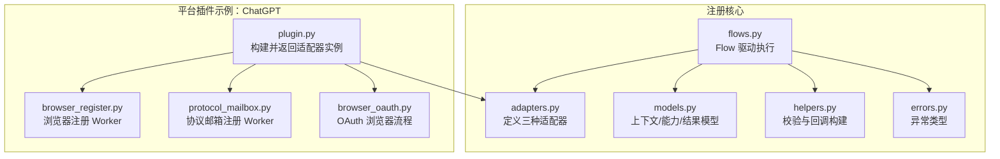
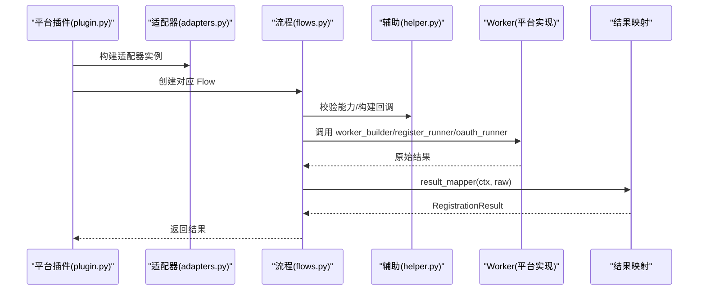
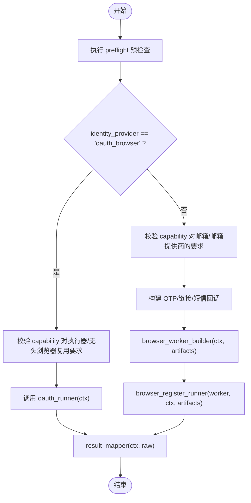
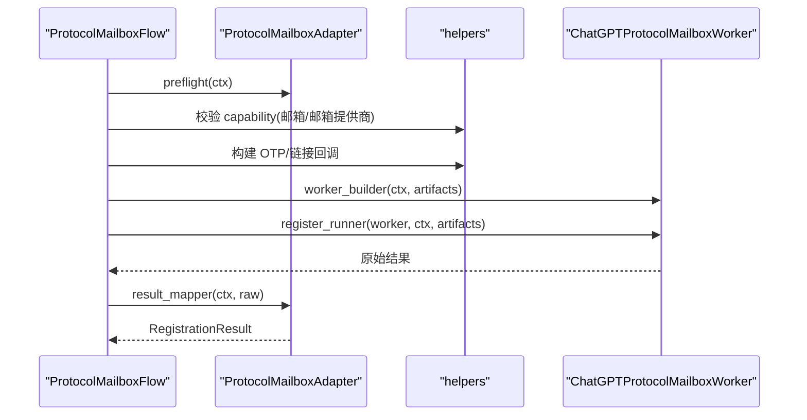
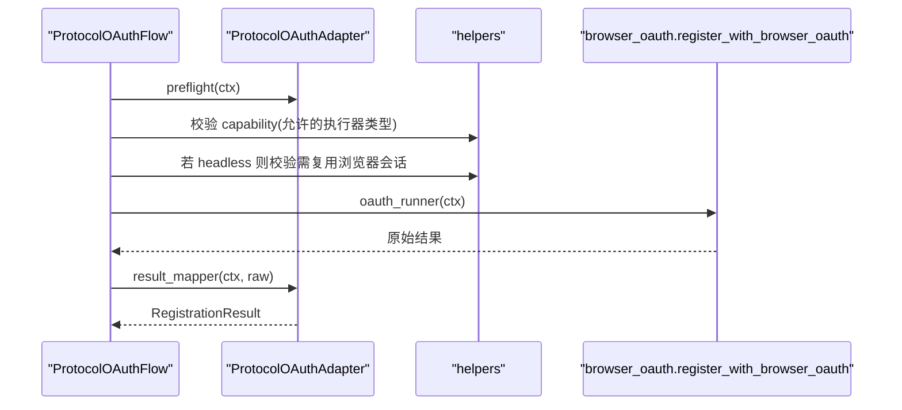
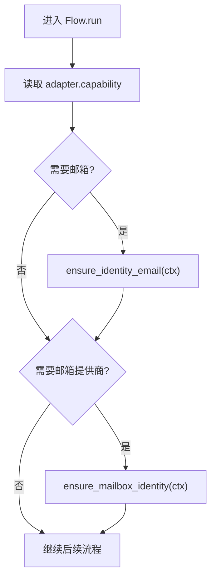
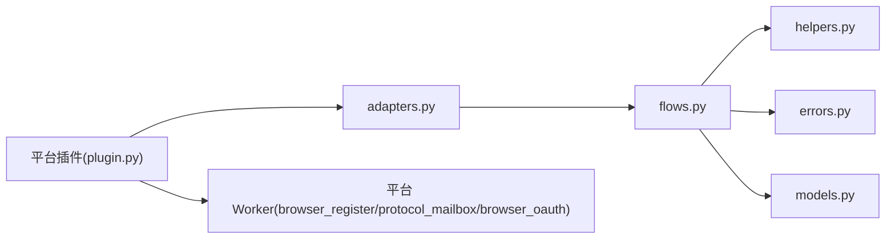
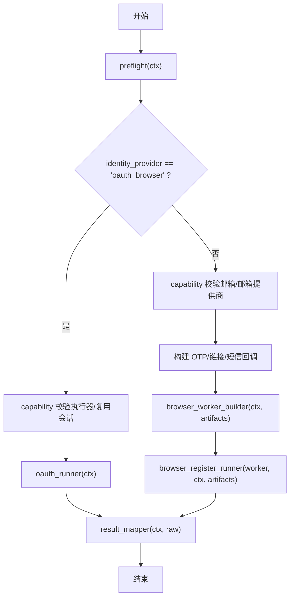
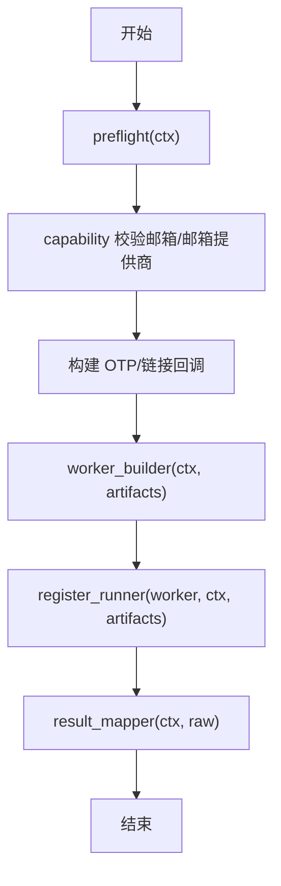
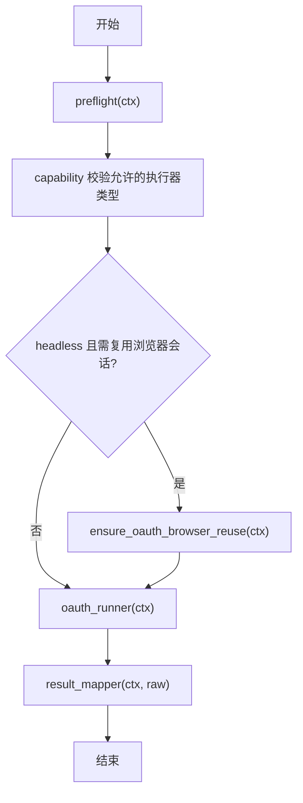

# 适配器构建过程

<cite>
**本文引用的文件**
- [adapters.py](file://core/registration/adapters.py)
- [models.py](file://core/registration/models.py)
- [flows.py](file://core/registration/flows.py)
- [helpers.py](file://core/registration/helpers.py)
- [errors.py](file://core/registration/errors.py)
- [plugin.py](file://platforms/chatgpt/plugin.py)
- [browser_register.py](file://platforms/chatgpt/browser_register.py)
- [protocol_mailbox.py](file://platforms/chatgpt/protocol_mailbox.py)
- [browser_oauth.py](file://platforms/chatgpt/browser_oauth.py)
</cite>

## 目录
1. [简介](#简介)
2. [项目结构](#项目结构)
3. [核心组件](#核心组件)
4. [架构总览](#架构总览)
5. [详细组件分析](#详细组件分析)
6. [依赖关系分析](#依赖关系分析)
7. [性能考虑](#性能考虑)
8. [故障排查指南](#故障排查指南)
9. [结论](#结论)
10. [附录：配置示例与最佳实践](#附录：配置示例与最佳实践)

## 简介
本文件面向需要实现或集成注册适配器的开发者，系统性说明 BrowserRegistrationAdapter、ProtocolMailboxAdapter、ProtocolOAuthAdapter 的构建与初始化流程，明确必需方法与可选方法的职责边界，解释 capability 配置的作用与校验机制，阐述 preflight 预检查的执行时机与作用，并提供完整的流程图、配置示例以及自定义适配器的开发指南与最佳实践。

## 项目结构
围绕注册适配器的核心代码位于 core/registration 模块，平台侧通过插件（如 platforms/chatgpt/plugin.py）将具体业务逻辑装配到通用适配器中。运行时由 flows.py 中的 Flow 类驱动执行，helpers.py 提供能力校验、回调构造等工具函数。

图表来源
- [adapters.py:28-58](file://core/registration/adapters.py#L28-L58)
- [models.py:7-66](file://core/registration/models.py#L7-L66)
- [flows.py:18-142](file://core/registration/flows.py#L18-L142)
- [helpers.py:23-44](file://core/registration/helpers.py#L23-L44)
- [errors.py:4-27](file://core/registration/errors.py#L4-L27)
- [plugin.py:160-200](file://platforms/chatgpt/plugin.py#L160-L200)

章节来源
- [adapters.py:28-58](file://core/registration/adapters.py#L28-L58)
- [models.py:7-66](file://core/registration/models.py#L7-L66)
- [flows.py:18-142](file://core/registration/flows.py#L18-L142)
- [helpers.py:23-44](file://core/registration/helpers.py#L23-L44)
- [errors.py:4-27](file://core/registration/errors.py#L4-L27)
- [plugin.py:160-200](file://platforms/chatgpt/plugin.py#L160-L200)

## 核心组件
- 适配器
  - BrowserRegistrationAdapter：封装浏览器注册流程所需的能力、回调、预检查与运行器。
  - ProtocolMailboxAdapter：封装基于协议的邮箱注册流程。
  - ProtocolOAuthAdapter：封装 OAuth 登录/注册流程。
- 模型
  - RegistrationCapability：声明各流程对执行器、邮箱、会话复用等的约束。
  - RegistrationContext：运行时上下文（平台、身份、配置、日志等）。
  - RegistrationArtifacts：流程中间产物（验证码/链接/电话回调、执行器等）。
  - RegistrationResult：最终注册结果。
- 流程
  - BrowserRegistrationFlow / ProtocolMailboxFlow / ProtocolOAuthFlow：按适配器驱动完整注册生命周期。
- 辅助
  - helpers：能力校验、超时解析、回调构建、邮箱/电话资源管理。
  - errors：统一异常体系。

章节来源
- [adapters.py:28-58](file://core/registration/adapters.py#L28-L58)
- [models.py:7-66](file://core/registration/models.py#L7-L66)
- [flows.py:18-142](file://core/registration/flows.py#L18-L142)
- [helpers.py:23-44](file://core/registration/helpers.py#L23-L44)
- [errors.py:4-27](file://core/registration/errors.py#L4-L27)

## 架构总览
下图展示从平台插件构建适配器到 Flow 驱动执行的端到端调用链。

图表来源
- [plugin.py:160-200](file://platforms/chatgpt/plugin.py#L160-L200)
- [adapters.py:28-58](file://core/registration/adapters.py#L28-L58)
- [flows.py:18-142](file://core/registration/flows.py#L18-L142)
- [helpers.py:46-177](file://core/registration/helpers.py#L46-L177)

## 详细组件分析

### BrowserRegistrationAdapter 构建与初始化
- 作用：用于“浏览器模式”注册，支持可选的 OAuth 分支；可配置 OTP/链接等待、短信回调、验证码求解、预检查等。
- 必需字段
  - result_mapper：将原始结果转换为 RegistrationResult。
- 可选字段
  - browser_worker_builder：根据上下文和 artifacts 构建浏览器 Worker。
  - browser_register_runner：执行浏览器注册。
  - oauth_runner：当 identity_provider=oauth_browser 时走 OAuth 路径。
  - capability：声明该适配器对执行器、邮箱、会话复用的要求。
  - otp_spec/link_spec：配置验证码/验证链接的等待策略。
  - use_captcha_for_mailbox：是否启用验证码求解。
  - preflight：预检查钩子，在流程开始前执行。
- 典型构建方式（以 ChatGPT 为例）
  - 在平台插件中返回 BrowserRegistrationAdapter，注入 result_mapper、worker_builder、register_runner、oauth_runner 与 capability。
  - 通过 OtpSpec 配置等待消息、超时与正则匹配等。

图表来源
- [flows.py:18-79](file://core/registration/flows.py#L18-L79)
- [adapters.py:28-38](file://core/registration/adapters.py#L28-L38)
- [helpers.py:23-44](file://core/registration/helpers.py#L23-L44)

章节来源
- [adapters.py:28-38](file://core/registration/adapters.py#L28-L38)
- [flows.py:18-79](file://core/registration/flows.py#L18-L79)
- [plugin.py:160-177](file://platforms/chatgpt/plugin.py#L160-L177)

### ProtocolMailboxAdapter 构建与初始化
- 作用：用于“协议邮箱模式”注册，直接通过协议完成注册，不依赖浏览器。
- 必需字段
  - result_mapper：结果映射。
  - worker_builder：构建协议 Worker。
  - register_runner：执行注册。
- 可选字段
  - capability：声明对邮箱/邮箱提供商的要求。
  - otp_spec/link_spec：验证码/链接等待策略。
  - use_captcha/use_executor：是否使用验证码求解/执行器上下文。
  - preflight：预检查钩子。
- 典型构建方式（以 ChatGPT 为例）
  - 在平台插件中返回 ProtocolMailboxAdapter，注入 worker_builder（返回 ChatGPTProtocolMailboxWorker）、register_runner（调用 worker.run）与 result_mapper。

图表来源
- [flows.py:81-122](file://core/registration/flows.py#L81-L122)
- [adapters.py:40-50](file://core/registration/adapters.py#L40-L50)
- [protocol_mailbox.py:36-66](file://platforms/chatgpt/protocol_mailbox.py#L36-L66)

章节来源
- [adapters.py:40-50](file://core/registration/adapters.py#L40-L50)
- [flows.py:81-122](file://core/registration/flows.py#L81-L122)
- [plugin.py:185-200](file://platforms/chatgpt/plugin.py#L185-L200)
- [protocol_mailbox.py:36-66](file://platforms/chatgpt/protocol_mailbox.py#L36-L66)

### ProtocolOAuthAdapter 构建与初始化
- 作用：用于“协议 OAuth 模式”，通过外部浏览器或已登录会话完成 OAuth 授权并获取账号信息。
- 必需字段
  - oauth_runner：执行 OAuth 流程。
  - result_mapper：结果映射。
- 可选字段
  - capability：声明允许的执行器类型、无头模式下是否需要复用浏览器会话。
  - preflight：预检查钩子。
- 典型构建方式（以 ChatGPT 为例）
  - 在平台插件中返回 ProtocolOAuthAdapter，注入 _run_protocol_oauth 作为 oauth_runner，并设置 capability 限制 headless 需复用浏览器会话。

图表来源
- [flows.py:124-142](file://core/registration/flows.py#L124-L142)
- [adapters.py:53-58](file://core/registration/adapters.py#L53-L58)
- [browser_oauth.py:44-115](file://platforms/chatgpt/browser_oauth.py#L44-L115)
- [plugin.py:179-183](file://platforms/chatgpt/plugin.py#L179-L183)

章节来源
- [adapters.py:53-58](file://core/registration/adapters.py#L53-L58)
- [flows.py:124-142](file://core/registration/flows.py#L124-L142)
- [browser_oauth.py:44-115](file://platforms/chatgpt/browser_oauth.py#L44-L115)
- [plugin.py:179-183](file://platforms/chatgpt/plugin.py#L179-L183)

### Capability 配置与验证机制
- 关键能力项
  - oauth_allowed_executor_types：限制 OAuth 可用的 executor_type（如仅允许 protocol/headless）。
  - oauth_headless_requires_browser_reuse：headless 模式下进行 OAuth 必须复用本地浏览器会话。
  - browser_mailbox_requires_email / browser_mailbox_requires_mailbox：浏览器模式是否要求提供邮箱及邮箱提供商。
  - protocol_mailbox_requires_email / protocol_mailbox_requires_mailbox：协议邮箱模式是否要求邮箱及邮箱提供商。
- 验证位置
  - flows.py 在各 Flow.run 开头依据 capability 调用 helpers.ensure_* 系列函数进行前置校验。
  - helpers.py 中 ensure_identity_email、ensure_mailbox_identity、ensure_oauth_executor_allowed、ensure_oauth_browser_reuse 负责抛出明确的异常。

图表来源
- [flows.py:22-44](file://core/registration/flows.py#L22-L44)
- [flows.py:85-91](file://core/registration/flows.py#L85-L91)
- [helpers.py:23-44](file://core/registration/helpers.py#L23-L44)

章节来源
- [models.py:7-15](file://core/registration/models.py#L7-L15)
- [flows.py:22-44](file://core/registration/flows.py#L22-L44)
- [flows.py:85-91](file://core/registration/flows.py#L85-L91)
- [helpers.py:23-44](file://core/registration/helpers.py#L23-L44)

### Preflight 预检查的执行时机与作用
- 执行时机
  - 所有 Flow.run 的第一步都会调用 adapter.preflight(ctx)（如果存在）。
- 作用
  - 在正式注册前进行环境/依赖/权限等快速检查，失败即提前中止，避免浪费资源。
  - 可用于校验外部服务可用性、凭据有效性、网络连通性等。
- 建议
  - 将耗时操作放在预检查之后，确保失败快速返回。
  - 预检查应幂等且可重试。

章节来源
- [flows.py:22-24](file://core/registration/flows.py#L22-L24)
- [flows.py:85-87](file://core/registration/flows.py#L85-L87)
- [flows.py:128-130](file://core/registration/flows.py#L128-L130)

### 回调与资源管理（OTP/链接/电话）
- OTP/链接回调
  - helpers.build_otp_callback/build_link_callback 会结合 platform.mailbox 与 identity.mailbox_account 构造回调函数，支持 keyword、timeout、code_pattern、before_ids 等参数。
- 电话回调
  - helpers.build_phone_callbacks 根据任务参数/全局默认/历史兼容字段选择 SMS provider，合并配置并生成 phone_callback/phone_cleanup。
- 资源清理
  - BrowserRegistrationFlow 在 finally 中调用 phone_cleanup，确保资源释放。

章节来源
- [helpers.py:46-177](file://core/registration/helpers.py#L46-L177)
- [flows.py:46-78](file://core/registration/flows.py#L46-L78)

## 依赖关系分析
- 适配器与流程
  - flows.py 中的三个 Flow 分别依赖对应的 Adapter，并在 run 中组合 helpers 提供的校验与回调。
- 平台插件与适配器
  - 平台插件（如 ChatGPT）负责组装具体的 worker_builder/register_runner/oauth_runner 与 result_mapper，并声明 capability。
- 外部依赖
  - helpers 依赖 infrastructure 的 ProviderDefinitionsRepository/ProviderSettingsRepository 来解析 SMS provider 配置。
  - OAuth 流程依赖 core.oauth_browser 与平台特定的 OAuthManager。

图表来源
- [plugin.py:160-200](file://platforms/chatgpt/plugin.py#L160-L200)
- [adapters.py:28-58](file://core/registration/adapters.py#L28-L58)
- [flows.py:18-142](file://core/registration/flows.py#L18-L142)
- [helpers.py:75-147](file://core/registration/helpers.py#L75-L147)

章节来源
- [plugin.py:160-200](file://platforms/chatgpt/plugin.py#L160-L200)
- [adapters.py:28-58](file://core/registration/adapters.py#L28-L58)
- [flows.py:18-142](file://core/registration/flows.py#L18-L142)
- [helpers.py:75-147](file://core/registration/helpers.py#L75-L147)

## 性能考虑
- 预检查优先：将昂贵或易失败的检查放入 preflight，尽早失败。
- 回调超时控制：为 OTP/链接回调设置合理 timeout，避免长时间阻塞。
- 执行器复用：在 headless OAuth 场景下复用浏览器会话可减少启动开销。
- 资源释放：确保 phone_cleanup 被调用，避免资源泄漏。
- 最小化 I/O：在 worker_builder/register_runner 中尽量批量化网络请求。

## 故障排查指南
- 常见错误与定位
  - IdentityResolutionError：缺少邮箱或邮箱提供商，检查 capability 与 identity 配置。
  - BrowserReuseRequiredError：headless OAuth 未配置 chrome_user_data_dir/chrome_cdp_url，需在 identity 中提供。
  - RegistrationUnsupportedError：executor_type 不在 allowed 列表中，调整 capability 或任务参数。
  - OtpTimeoutError：验证码等待超时，检查 mailbox 可用性与 timeout 配置。
- 排查步骤
  - 查看 preflight 是否成功。
  - 确认 capability 与实际执行环境一致。
  - 检查 OTP/链接回调是否成功获取到内容。
  - 核对 SMS provider 配置与认证字段是否齐全。

章节来源
- [errors.py:4-27](file://core/registration/errors.py#L4-L27)
- [helpers.py:23-44](file://core/registration/helpers.py#L23-L44)
- [flows.py:22-44](file://core/registration/flows.py#L22-L44)
- [flows.py:85-91](file://core/registration/flows.py#L85-L91)
- [flows.py:128-140](file://core/registration/flows.py#L128-L140)

## 结论
通过统一的适配器抽象与 Flow 驱动，系统实现了浏览器注册、协议邮箱注册与 OAuth 注册的解耦与可扩展。capability 提供了声明式的能力约束，preflight 提供了前置检查点，helpers 提供了通用的回调与校验能力。平台插件只需关注具体业务 Worker 的实现与结果映射，即可快速接入新的平台或流程。

## 附录：配置示例与最佳实践

### 适配器构建完整流程图（浏览器模式）

图表来源
- [flows.py:18-79](file://core/registration/flows.py#L18-L79)
- [adapters.py:28-38](file://core/registration/adapters.py#L28-L38)
- [helpers.py:46-177](file://core/registration/helpers.py#L46-L177)

### 适配器构建完整流程图（协议邮箱模式）

图表来源
- [flows.py:81-122](file://core/registration/flows.py#L81-L122)
- [adapters.py:40-50](file://core/registration/adapters.py#L40-L50)

### 适配器构建完整流程图（协议 OAuth 模式）

图表来源
- [flows.py:124-142](file://core/registration/flows.py#L124-L142)
- [adapters.py:53-58](file://core/registration/adapters.py#L53-L58)

### 配置示例（以 ChatGPT 插件为例）
- 浏览器注册适配器
  - result_mapper：将原始结果映射为 RegistrationResult。
  - browser_worker_builder：返回 ChatGPTBrowserRegister 实例。
  - browser_register_runner：调用 worker.run(email, password)。
  - oauth_runner：调用 _run_protocol_oauth。
  - capability：设置 oauth_headless_requires_browser_reuse=True。
  - otp_spec：配置 wait_message、timeout 等。
- 协议邮箱注册适配器
  - worker_builder：返回 ChatGPTProtocolMailboxWorker。
  - register_runner：调用 worker.run(email, password)。
  - result_mapper：映射结果为 RegistrationResult。
- 协议 OAuth 适配器
  - oauth_runner：调用 _run_protocol_oauth。
  - result_mapper：映射结果为 RegistrationResult。

章节来源
- [plugin.py:160-200](file://platforms/chatgpt/plugin.py#L160-L200)
- [browser_register.py:1-200](file://platforms/chatgpt/browser_register.py#L1-L200)
- [protocol_mailbox.py:36-66](file://platforms/chatgpt/protocol_mailbox.py#L36-L66)
- [browser_oauth.py:44-115](file://platforms/chatgpt/browser_oauth.py#L44-L115)

### 自定义适配器的开发指南与最佳实践
- 明确流程类型
  - 浏览器模式：实现 BrowserRegistrationAdapter，提供 worker_builder/register_runner 与可选 oauth_runner。
  - 协议邮箱模式：实现 ProtocolMailboxAdapter，提供 worker_builder/register_runner。
  - 协议 OAuth 模式：实现 ProtocolOAuthAdapter，提供 oauth_runner。
- 正确声明 capability
  - 根据实际执行环境与依赖，设置 oauth_allowed_executor_types、oauth_headless_requires_browser_reuse、邮箱/邮箱提供商要求等。
- 实现 preflight
  - 在 preflight 中进行必要的环境检查，失败快速返回，减少无效工作。
- 回调与资源
  - 使用 helpers 构建 OTP/链接回调，确保 mailbox 与 identity 配置正确。
  - 使用 build_phone_callbacks 获取 phone_callback/phone_cleanup，并确保 cleanup 被调用。
- 结果映射
  - result_mapper 应将原始结果标准化为 RegistrationResult，包含 email/password/token/extra 等关键字段。
- 错误处理
  - 遵循 errors.py 定义的异常体系，便于上层统一捕获与提示。
- 测试建议
  - 针对每种流程编写单元测试，覆盖 preflight、capability 校验、回调超时、资源清理等路径。

章节来源
- [adapters.py:28-58](file://core/registration/adapters.py#L28-L58)
- [models.py:7-66](file://core/registration/models.py#L7-L66)
- [flows.py:18-142](file://core/registration/flows.py#L18-L142)
- [helpers.py:23-44](file://core/registration/helpers.py#L23-L44)
- [errors.py:4-27](file://core/registration/errors.py#L4-L27)