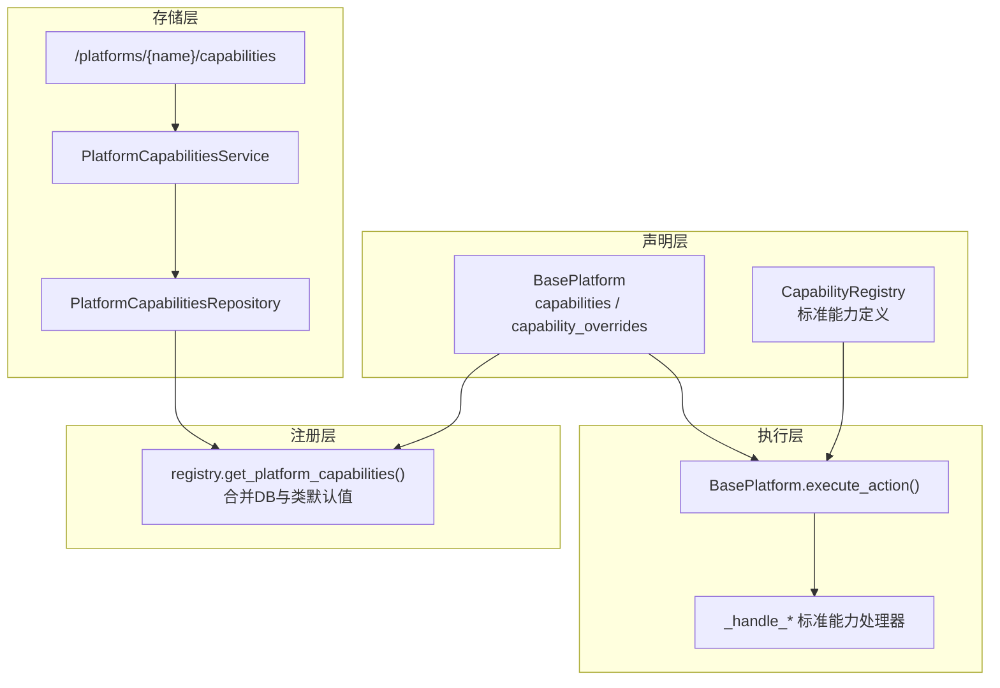
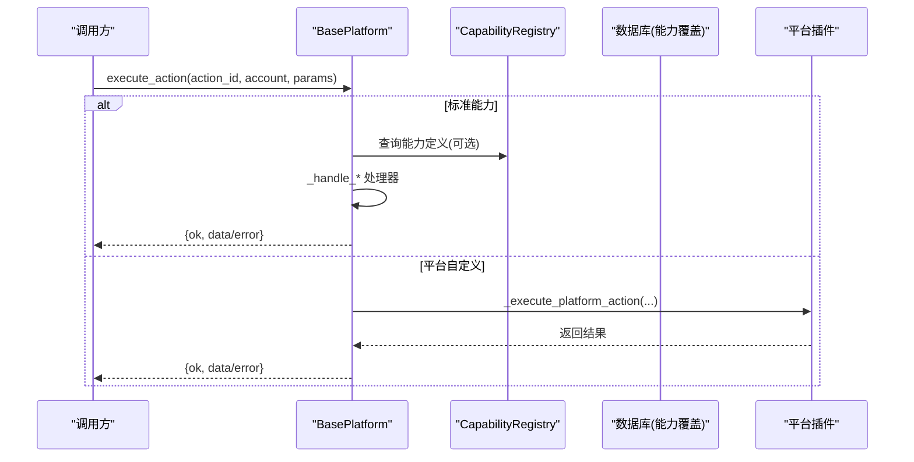
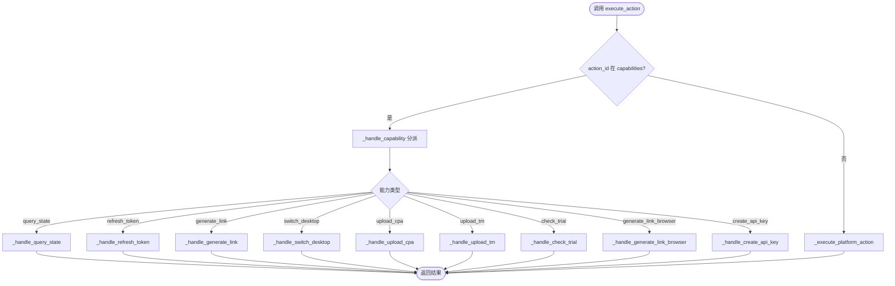
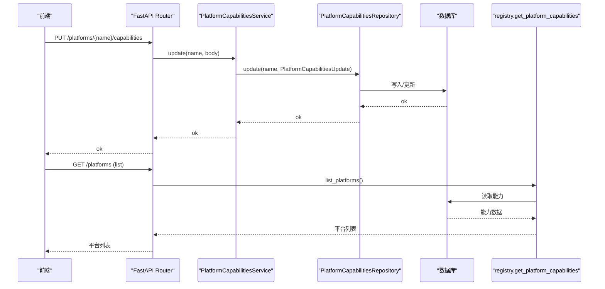
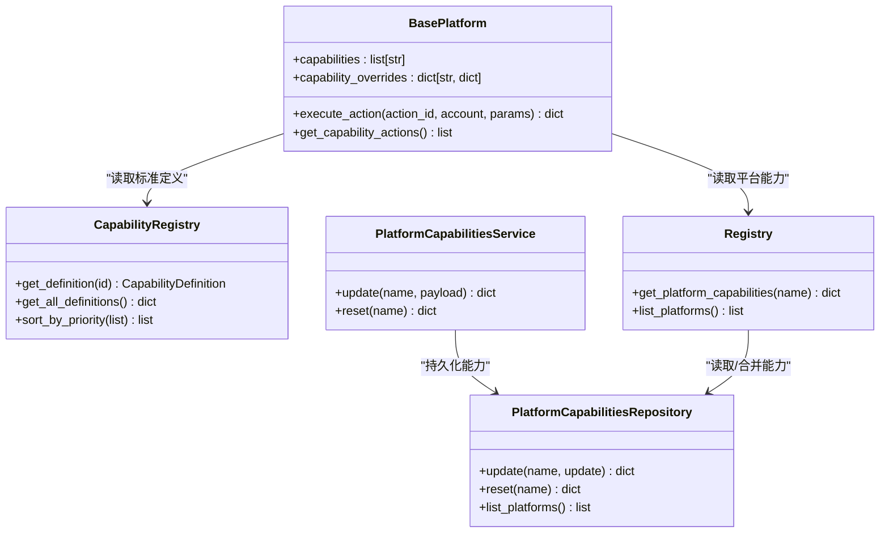

# 能力定义与声明

<cite>
**本文引用的文件**
- [core/base_platform.py](file://core/base_platform.py)
- [core/capability_registry.py](file://core/capability_registry.py)
- [core/registry.py](file://core/registry.py)
- [domain/platform_caps.py](file://domain/platform_caps.py)
- [infrastructure/platform_caps_repository.py](file://infrastructure/platform_caps_repository.py)
- [application/platform_capabilities.py](file://application/platform_capabilities.py)
- [api/platform_capabilities.py](file://api/platform_capabilities.py)
- [platforms/windsurf/plugin.py](file://platforms/windsurf/plugin.py)
- [platforms/chatgpt/plugin.py](file://platforms/chatgpt/plugin.py)
- [platforms/cursor/plugin.py](file://platforms/cursor/plugin.py)
</cite>

## 目录
1. [简介](#简介)
2. [项目结构](#项目结构)
3. [核心组件](#核心组件)
4. [架构总览](#架构总览)
5. [详细组件分析](#详细组件分析)
6. [依赖关系分析](#依赖关系分析)
7. [性能考虑](#性能考虑)
8. [故障排查指南](#故障排查指南)
9. [结论](#结论)
10. [附录：能力语法与最佳实践](#附录能力语法与最佳实践)

## 简介
本文档围绕 BasePlatform 的能力体系，系统性说明 capabilities 列表与 capability_overrides 字典的设计原理、标准能力的语义与使用场景、如何通过数组声明平台支持的功能集合、如何通过覆盖配置调整标签/参数/同步行为，以及能力声明对 API 接口的影响和向后兼容性策略。目标是让开发者在不深入源码的情况下，也能正确声明和使用平台能力。

## 项目结构
能力系统由“声明—注册—存储—执行”四层构成：
- 声明层：BasePlatform 子类通过类属性 capabilities 声明支持的标准能力；通过 capability_overrides 对特定能力的 UI 标签、参数 schema、是否同步执行进行覆盖。
- 注册层：运行时从数据库读取并合并平台能力（含默认值），供实例化时消费。
- 存储层：提供 REST 接口更新/重置平台能力，持久化到数据库。
- 执行层：execute_action 将 action_id 路由到标准能力处理器或平台自定义实现；get_capability_actions 将能力映射为动作元数据，供前端展示。

图表来源
- [core/base_platform.py:44-310](file://core/base_platform.py#L44-L310)
- [core/capability_registry.py:26-172](file://core/capability_registry.py#L26-L172)
- [core/registry.py:100-123](file://core/registry.py#L100-L123)
- [application/platform_capabilities.py:7-24](file://application/platform_capabilities.py#L7-L24)
- [infrastructure/platform_caps_repository.py:12-53](file://infrastructure/platform_caps_repository.py#L12-L53)
- [api/platform_capabilities.py:7-18](file://api/platform_capabilities.py#L7-L18)

章节来源
- [core/base_platform.py:44-310](file://core/base_platform.py#L44-L310)
- [core/capability_registry.py:26-172](file://core/capability_registry.py#L26-L172)
- [core/registry.py:100-123](file://core/registry.py#L100-L123)
- [application/platform_capabilities.py:7-24](file://application/platform_capabilities.py#L7-L24)
- [infrastructure/platform_caps_repository.py:12-53](file://infrastructure/platform_caps_repository.py#L12-L53)
- [api/platform_capabilities.py:7-18](file://api/platform_capabilities.py#L7-L18)

## 核心组件
- BasePlatform：能力声明的载体，负责将能力映射为可执行动作，并提供标准能力的默认处理逻辑。
- CapabilityRegistry：集中维护标准能力定义（id、label、描述、分类、UI 提示、参数 schema）。
- registry.get_platform_capabilities：加载并合并“数据库中的平台能力 + 类默认值”，保证新增能力默认可见且可被覆盖。
- PlatformCapabilitiesService/Repository/API：提供对外能力管理能力（增改查/重置）。
- 平台插件（如 Windsurf、ChatGPT、Cursor）：通过 capabilities 声明支持的能力集，并通过 capability_overrides 定制 UI 与行为。

章节来源
- [core/base_platform.py:44-310](file://core/base_platform.py#L44-L310)
- [core/capability_registry.py:26-172](file://core/capability_registry.py#L26-L172)
- [core/registry.py:41-107](file://core/registry.py#L41-L107)
- [application/platform_capabilities.py:7-24](file://application/platform_capabilities.py#L7-L24)
- [infrastructure/platform_caps_repository.py:12-53](file://infrastructure/platform_caps_repository.py#L12-L53)
- [platforms/windsurf/plugin.py:35-69](file://platforms/windsurf/plugin.py#L35-L69)
- [platforms/chatgpt/plugin.py:48-66](file://platforms/chatgpt/plugin.py#L48-L66)
- [platforms/cursor/plugin.py:18-32](file://platforms/cursor/plugin.py#L18-L32)

## 架构总览
能力在运行时的关键流程如下：
- 初始化阶段：BasePlatform.__init__ 调用 get_platform_capabilities 获取当前平台的能力清单（包含 DB 覆盖与类默认值的合并结果）。
- 动作分发：execute_action 优先匹配标准能力 id，进入 _handle_* 处理器；未命中则回退到平台自定义实现。
- 动作元数据：get_capability_actions 基于 CapabilityRegistry 的标准定义与 capability_overrides 生成 actions 列表，用于前端渲染。

图表来源
- [core/base_platform.py:192-233](file://core/base_platform.py#L192-L233)
- [core/capability_registry.py:138-146](file://core/capability_registry.py#L138-L146)
- [core/registry.py:100-107](file://core/registry.py#L100-L107)

## 详细组件分析

### BasePlatform 能力声明与执行
- capabilities：字符串数组，声明平台支持的标准能力集合。例如 ["query_state", "refresh_token", "generate_link", ...]。
- capability_overrides：字典，键为能力 id，值为覆盖项：
  - label：覆盖显示名称（用于 UI）。
  - params：覆盖参数 schema（用于表单校验与渲染）。
  - sync：布尔值，控制该能力是否以同步方式执行（默认 True）。
- 执行路径：
  - execute_action 首先判断 action_id 是否在 capabilities 中，若是则进入 _handle_capability 分派到具体处理器。
  - 若未实现或未声明，抛出 NotImplementedError，上层可捕获并返回错误。

图表来源
- [core/base_platform.py:192-233](file://core/base_platform.py#L192-L233)
- [core/base_platform.py:236-284](file://core/base_platform.py#L236-L284)

章节来源
- [core/base_platform.py:44-310](file://core/base_platform.py#L44-L310)

### 标准能力定义与语义
标准能力集中在 CapabilityRegistry 中，每个能力包含 id、label、description、category、icon、requires_params、param_schema、ui_hints 等元信息。常见能力语义如下：
- query_state：查询账号状态/额度。默认实现会尝试调用平台的 get_quota，否则返回基础账户信息。
- refresh_token：刷新认证令牌。需要平台实现具体刷新逻辑。
- generate_link：生成试用/支付链接。通常带套餐、国家等参数。
- generate_link_browser：通过浏览器自动化生成链接，常用于需要人机验证的场景。
- switch_desktop：切换到桌面应用（如 IDE）。
- upload_cpa / upload_tm：上传至第三方系统（CPA/Team Manager）。
- check_trial：检查试用资格。
- create_api_key：创建 API Key。

这些能力通过 get_capability_actions 转换为动作元数据，供前端统一渲染。

章节来源
- [core/capability_registry.py:26-132](file://core/capability_registry.py#L26-L132)
- [core/base_platform.py:286-310](file://core/base_platform.py#L286-L310)

### 能力覆盖机制（capability_overrides）
- 作用：在不修改标准能力定义的前提下，针对特定平台定制 UI 标签、参数 schema 和执行模式（sync）。
- 优先级：平台级 overrides > 标准定义。
- 典型用法：
  - 重写 label：使按钮文案更贴合业务（如“生成 Pro Trial 链接（自动打码）”）。
  - 重写 params：增加/减少参数，适配不同平台的输入需求。
  - 设置 sync=False：将某些耗时操作改为异步或长任务（如浏览器自动化生成链接）。

示例参考：
- Windsurf 平台对 generate_link 与 generate_link_browser 进行了标签与参数的覆盖，并将后者设为非同步。
- ChatGPT 平台声明了 refresh_token、upload_cpa、upload_tm 等能力，体现其业务特性。
- Cursor 平台声明了 switch_desktop、query_state、generate_link，聚焦桌面切换与试用链接。

章节来源
- [platforms/windsurf/plugin.py:43-69](file://platforms/windsurf/plugin.py#L43-L69)
- [platforms/chatgpt/plugin.py:58-66](file://platforms/chatgpt/plugin.py#L58-L66)
- [platforms/cursor/plugin.py:27-32](file://platforms/cursor/plugin.py#L27-L32)
- [core/base_platform.py:290-310](file://core/base_platform.py#L290-L310)

### 能力声明如何影响 API 接口
- 能力管理 API：
  - PUT /platforms/{name}/capabilities：更新平台的能力集合（supported_executors、supported_identity_modes、supported_oauth_providers、capabilities）。
  - DELETE /platforms/{name}/capabilities：重置为类默认值。
- 能力生效路径：
  - 服务层接收请求后写入 Repository，持久化到数据库。
  - 下次 BasePlatform 初始化时，通过 get_platform_capabilities 读取最新能力清单。
  - 前端通过 list_platforms 获取各平台能力，动态渲染能力面板。

图表来源
- [api/platform_capabilities.py:7-18](file://api/platform_capabilities.py#L7-L18)
- [application/platform_capabilities.py:7-24](file://application/platform_capabilities.py#L7-L24)
- [infrastructure/platform_caps_repository.py:12-53](file://infrastructure/platform_caps_repository.py#L12-L53)
- [core/registry.py:110-123](file://core/registry.py#L110-L123)

章节来源
- [api/platform_capabilities.py:7-18](file://api/platform_capabilities.py#L7-L18)
- [application/platform_capabilities.py:7-24](file://application/platform_capabilities.py#L7-L24)
- [infrastructure/platform_caps_repository.py:12-53](file://infrastructure/platform_caps_repository.py#L12-L53)
- [core/registry.py:110-123](file://core/registry.py#L110-L123)

### 向后兼容性与默认值合并
- 类默认值：BasePlatform 子类可在类上声明 capabilities 等默认值。
- 数据库覆盖：运行时通过 registry._ensure_platform_capabilities_seeded 将“数据库记录”与“类默认值”合并，确保新增能力默认可见且不被意外移除。
- 兼容策略：
  - 若数据库无记录，则完全使用类默认值。
  - 若数据库有记录，则以数据库为主，但会合并类默认值中新增的条目，避免破坏既有行为。
  - 通过 reset 接口可恢复为类默认值。

章节来源
- [core/registry.py:41-107](file://core/registry.py#L41-L107)
- [core/registry.py:110-123](file://core/registry.py#L110-L123)

## 依赖关系分析
- BasePlatform 依赖：
  - CapabilityRegistry：获取标准能力定义，用于动作元数据生成。
  - registry.get_platform_capabilities：获取当前平台的能力清单（含 DB 覆盖）。
  - 平台插件：实现具体能力处理器或自定义动作。
- 存储依赖：
  - PlatformCapabilitiesRepository 依赖 core.db 的模型与引擎，完成能力数据的读写。
  - Service 层封装 Repository，暴露简洁的更新/重置方法。
- API 依赖：
  - FastAPI Router 将 HTTP 请求转发到 Service。

图表来源
- [core/base_platform.py:44-310](file://core/base_platform.py#L44-L310)
- [core/capability_registry.py:135-172](file://core/capability_registry.py#L135-L172)
- [core/registry.py:100-123](file://core/registry.py#L100-L123)
- [application/platform_capabilities.py:7-24](file://application/platform_capabilities.py#L7-L24)
- [infrastructure/platform_caps_repository.py:12-53](file://infrastructure/platform_caps_repository.py#L12-L53)

章节来源
- [core/base_platform.py:44-310](file://core/base_platform.py#L44-L310)
- [core/capability_registry.py:135-172](file://core/capability_registry.py#L135-L172)
- [core/registry.py:100-123](file://core/registry.py#L100-L123)
- [application/platform_capabilities.py:7-24](file://application/platform_capabilities.py#L7-L24)
- [infrastructure/platform_caps_repository.py:12-53](file://infrastructure/platform_caps_repository.py#L12-L53)

## 性能考虑
- 能力清单加载：get_platform_capabilities 在每次实例化时访问数据库，建议结合缓存或批量加载以减少 IO。
- 能力动作生成：get_capability_actions 每次调用都会查询标准定义，可通过缓存能力定义提升性能。
- 同步/异步：对于耗时能力（如浏览器自动化），通过 capability_overrides.sync=False 将其标记为非同步，避免阻塞主流程。
- 参数校验：利用 param_schema 在前端进行强校验，减少无效请求到达后端。

[本节为通用指导，不直接分析具体文件]

## 故障排查指南
- 能力未生效：
  - 确认已通过 PUT /platforms/{name}/capabilities 更新能力，并调用 list_platforms 验证。
  - 检查 BasePlatform.__init__ 是否正确读取能力清单。
- 能力未实现：
  - 若 action_id 不在 capabilities 中，execute_action 会回退到平台自定义实现；若未实现则抛出异常。
  - 检查 _handle_* 是否已实现对应能力。
- 参数校验失败：
  - 核对 capability_overrides.params 与前端表单字段一致。
- 同步问题：
  - 若能力耗时较长，设置 sync=False，并在前端采用轮询或事件通知。

章节来源
- [core/base_platform.py:192-233](file://core/base_platform.py#L192-L233)
- [api/platform_capabilities.py:7-18](file://api/platform_capabilities.py#L7-L18)
- [application/platform_capabilities.py:7-24](file://application/platform_capabilities.py#L7-L24)

## 结论
BasePlatform 的能力体系通过“声明—注册—存储—执行”的分层设计，实现了平台能力的标准化与可配置化。capabilities 数组声明平台支持的能力集合，capability_overrides 提供细粒度的 UI 与行为覆盖。标准能力定义了统一的语义与参数规范，便于跨平台复用与扩展。通过 REST API 管理能力，结合数据库与默认值合并机制，既保证了灵活性又确保了向后兼容性。

[本节为总结性内容，不直接分析具体文件]

## 附录：能力语法与最佳实践

### 能力声明语法
- 在平台插件类中声明：
  - capabilities：字符串数组，列出支持的标准能力 id。
  - capability_overrides：字典，键为能力 id，值为覆盖项：
    - label：字符串，覆盖显示名称。
    - params：数组，覆盖参数 schema（key、label、type、options 等）。
    - sync：布尔值，控制是否同步执行。

示例参考路径：
- [Windsurf 平台能力声明与覆盖:43-69](file://platforms/windsurf/plugin.py#L43-L69)
- [ChatGPT 平台能力声明:58-66](file://platforms/chatgpt/plugin.py#L58-L66)
- [Cursor 平台能力声明:27-32](file://platforms/cursor/plugin.py#L27-L32)

### 标准能力语义速览
- query_state：查询状态/额度。
- refresh_token：刷新令牌。
- generate_link：生成试用/支付链接（可带套餐、国家等参数）。
- generate_link_browser：浏览器自动化生成链接。
- switch_desktop：切换到桌面应用。
- upload_cpa/upload_tm：上传至第三方系统。
- check_trial：检查试用资格。
- create_api_key：创建 API Key。

参考路径：
- [标准能力定义:26-132](file://core/capability_registry.py#L26-L132)

### 最佳实践
- 明确声明：仅在 capabilities 中声明平台实际支持的能力，避免虚假暴露。
- 合理覆盖：使用 capability_overrides 仅覆盖必要字段（label、params、sync），保持与标准定义的一致性。
- 参数校验：在 params 中定义严格的 type 与 options，配合前端校验。
- 同步策略：对耗时操作设置 sync=False，并提供异步反馈机制。
- 向后兼容：新增能力时保留类默认值，确保旧部署不受影响；必要时通过 reset 恢复默认。

[本节为通用指导，不直接分析具体文件]