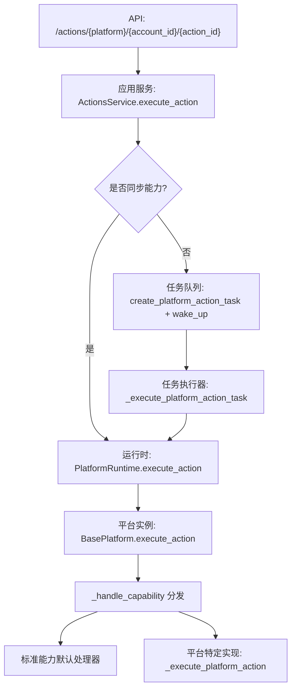
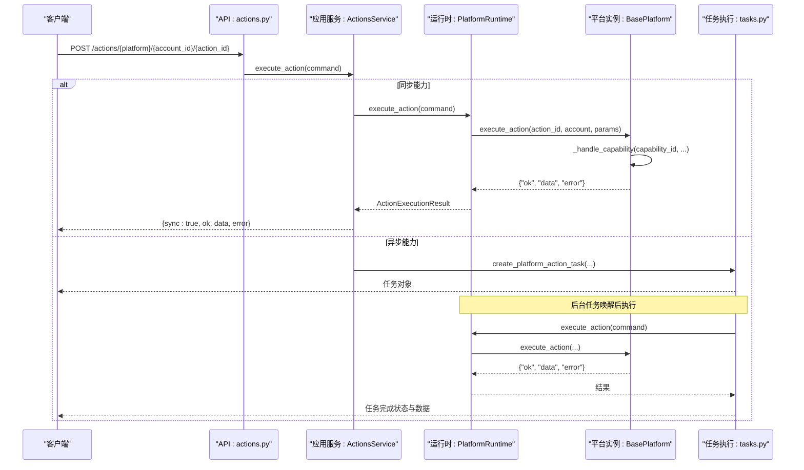
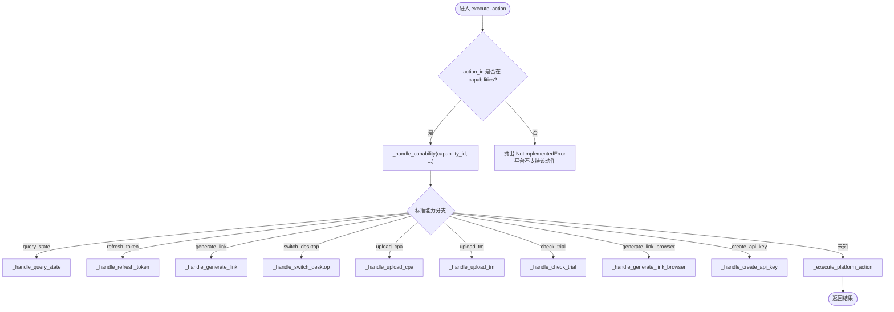
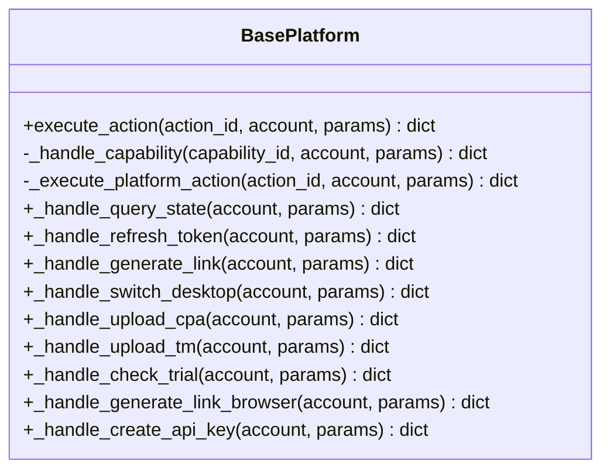
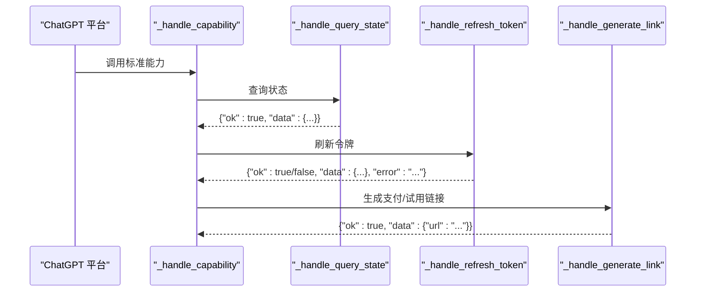
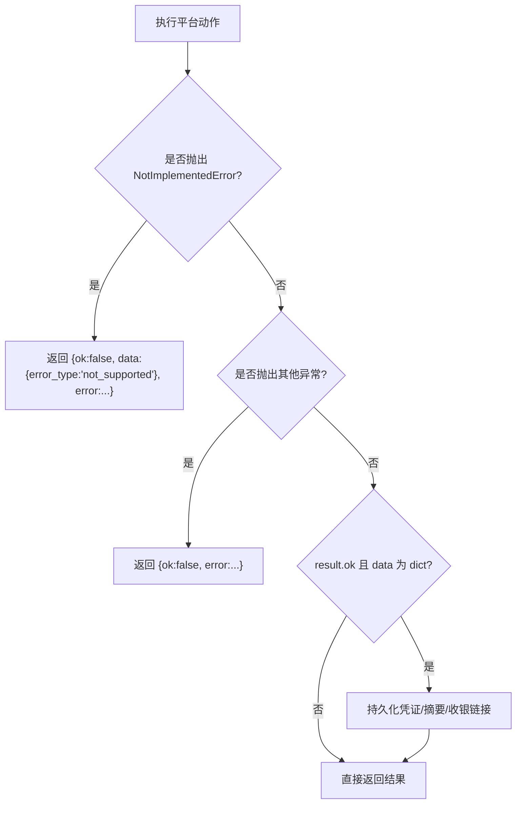
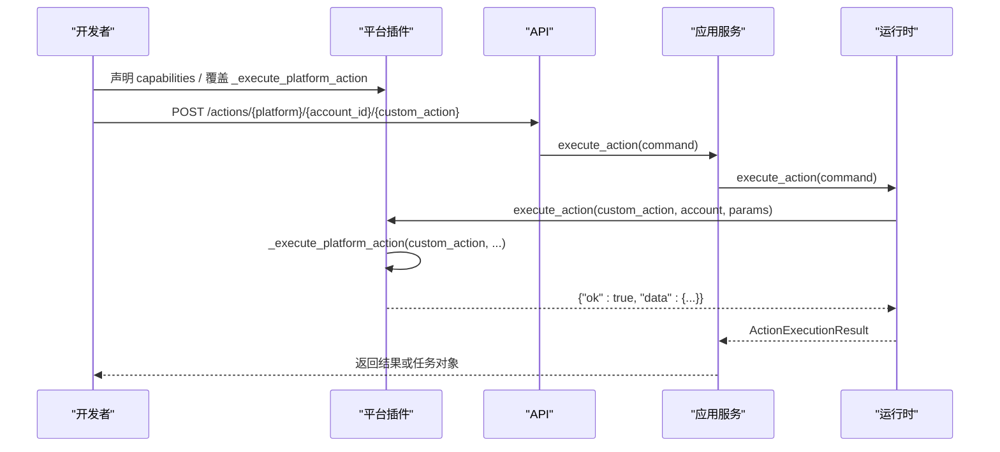
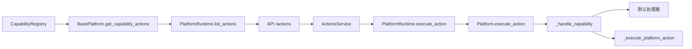

# 能力执行机制

<cite>
**本文引用的文件**
- [core/base_platform.py](file://core/base_platform.py)
- [core/capability_registry.py](file://core/capability_registry.py)
- [infrastructure/platform_runtime.py](file://infrastructure/platform_runtime.py)
- [application/actions.py](file://application/actions.py)
- [api/actions.py](file://api/actions.py)
- [application/tasks.py](file://application/tasks.py)
- [platforms/chatgpt/plugin.py](file://platforms/chatgpt/plugin.py)
- [platforms/windsurf/plugin.py](file://platforms/windsurf/plugin.py)
</cite>

## 目录
1. [简介](#简介)
2. [项目结构](#项目结构)
3. [核心组件](#核心组件)
4. [架构总览](#架构总览)
5. [详细组件分析](#详细组件分析)
6. [依赖关系分析](#依赖关系分析)
7. [性能考量](#性能考量)
8. [故障排查指南](#故障排查指南)
9. [结论](#结论)
10. [附录](#附录)

## 简介
本文面向“能力执行机制”，聚焦 execute_action() 的完整处理流程与路由逻辑，解释如何优先处理标准能力（如 query_state、refresh_token），再回退到平台特定实现；深入解析 _handle_capability() 的分发机制；说明各标准能力的默认处理器实现；阐述 NotImplementedError 异常与错误返回格式；并提供自定义能力实现的完整示例与调用模式，以及错误处理与调试技巧。

## 项目结构
围绕能力执行的关键路径由 API 层、应用服务层、运行时层、平台基类与具体平台插件组成：
- API 层接收请求并构造命令
- 应用服务层决定同步/异步执行
- 运行时层负责加载平台实例、执行动作、持久化结果
- 平台基类定义标准能力分发与默认处理器
- 具体平台可覆盖默认处理器或提供自定义动作

图表来源
- [api/actions.py:27-39](file://api/actions.py#L27-L39)
- [application/actions.py:42-55](file://application/actions.py#L42-L55)
- [infrastructure/platform_runtime.py:278-330](file://infrastructure/platform_runtime.py#L278-L330)
- [core/base_platform.py:192-233](file://core/base_platform.py#L192-L233)
- [application/tasks.py:872-897](file://application/tasks.py#L872-L897)

章节来源
- [api/actions.py:17-39](file://api/actions.py#L17-L39)
- [application/actions.py:9-55](file://application/actions.py#L9-L55)
- [infrastructure/platform_runtime.py:221-330](file://infrastructure/platform_runtime.py#L221-L330)
- [core/base_platform.py:44-310](file://core/base_platform.py#L44-L310)
- [application/tasks.py:872-897](file://application/tasks.py#L872-L897)

## 核心组件
- 能力注册表：集中定义标准能力元数据（ID、标签、参数 schema、UI 提示等）
- 平台基类：统一入口 execute_action()，_handle_capability() 分发标准能力，默认处理器提供通用行为
- 运行时：加载平台实例、执行动作、捕获异常、持久化凭证与摘要信息
- 应用服务：判断同步/异步执行，封装返回格式
- 具体平台：声明 capabilities、可选 capability_overrides，覆盖默认处理器或实现自定义动作

章节来源
- [core/capability_registry.py:7-172](file://core/capability_registry.py#L7-L172)
- [core/base_platform.py:192-310](file://core/base_platform.py#L192-L310)
- [infrastructure/platform_runtime.py:278-330](file://infrastructure/platform_runtime.py#L278-L330)
- [application/actions.py:9-55](file://application/actions.py#L9-L55)

## 架构总览
能力执行从 API 进入，经应用服务选择同步或异步路径，最终落到平台实例的能力分发与处理器。

图表来源
- [api/actions.py:27-39](file://api/actions.py#L27-L39)
- [application/actions.py:42-55](file://application/actions.py#L42-L55)
- [infrastructure/platform_runtime.py:278-330](file://infrastructure/platform_runtime.py#L278-L330)
- [application/tasks.py:872-897](file://application/tasks.py#L872-L897)

## 详细组件分析

### execute_action() 路由逻辑
- API 层将请求转换为命令并交给应用服务
- 应用服务根据 action 是否标记为同步来决定直接执行还是创建任务
- 运行时加载平台实例并调用平台 execute_action()
- 平台基类先尝试按标准能力 ID 匹配，再回退到平台特定实现

图表来源
- [core/base_platform.py:192-233](file://core/base_platform.py#L192-L233)

章节来源
- [core/base_platform.py:192-233](file://core/base_platform.py#L192-L233)
- [application/actions.py:42-55](file://application/actions.py#L42-L55)
- [infrastructure/platform_runtime.py:278-330](file://infrastructure/platform_runtime.py#L278-L330)

### _handle_capability() 能力分发机制
- 以 capability_id 为键进行分支调度
- 对每个标准能力调用对应默认处理器
- 若未实现或平台未覆盖，则回退到 _execute_platform_action()
- 捕获 NotImplementedError 并返回统一的错误格式

图表来源
- [core/base_platform.py:192-284](file://core/base_platform.py#L192-L284)

章节来源
- [core/base_platform.py:203-284](file://core/base_platform.py#L203-L284)

### 标准能力默认处理器内部逻辑
- query_state：优先调用 get_quota()，若无配额数据则返回账号基础状态
- refresh_token：默认抛出 NotImplementedError，要求平台覆盖
- generate_link：调用 get_trial_url()，若存在则返回链接
- switch_desktop、upload_cpa、upload_tm、check_trial、generate_link_browser、create_api_key：默认均抛出 NotImplementedError，需平台覆盖

章节来源
- [core/base_platform.py:236-284](file://core/base_platform.py#L236-L284)

### 平台特定实现与覆盖
- ChatGPT 平台覆盖了 query_state、refresh_token、generate_link，并在 _execute_platform_action 中处理平台特有动作
- Windsurf 平台声明了 capabilities 和 capability_overrides，覆盖 switch_desktop、generate_link_browser 等

图表来源
- [platforms/chatgpt/plugin.py:338-420](file://platforms/chatgpt/plugin.py#L338-L420)

章节来源
- [platforms/chatgpt/plugin.py:50-249](file://platforms/chatgpt/plugin.py#L50-L249)
- [platforms/chatgpt/plugin.py:338-420](file://platforms/chatgpt/plugin.py#L338-L420)
- [platforms/windsurf/plugin.py:40-239](file://platforms/windsurf/plugin.py#L40-L239)

### 错误处理与返回格式
- 平台 execute_action() 返回统一格式：{"ok": bool, "data": any, "error": str}
- 运行时捕获 NotImplementedError，返回带 error_type 的错误结果
- 其他异常被捕获并转为错误字符串
- 成功且包含敏感字段时，自动持久化到账户图并更新摘要

图表来源
- [infrastructure/platform_runtime.py:278-330](file://infrastructure/platform_runtime.py#L278-L330)

章节来源
- [infrastructure/platform_runtime.py:278-330](file://infrastructure/platform_runtime.py#L278-L330)

### 自定义能力实现与调用模式
- 在平台类中声明 capabilities 列表，并通过 capability_overrides 定制 label、param_schema、sync 标志
- 如需自定义动作，覆盖 _execute_platform_action() 并实现相应 action_id 的处理逻辑
- 调用方式：通过 API 发送 POST /actions/{platform}/{account_id}/{action_id}，携带 params

图表来源
- [platforms/windsurf/plugin.py:40-69](file://platforms/windsurf/plugin.py#L40-L69)
- [platforms/windsurf/plugin.py:178-239](file://platforms/windsurf/plugin.py#L178-L239)
- [api/actions.py:27-39](file://api/actions.py#L27-L39)
- [application/actions.py:42-55](file://application/actions.py#L42-L55)
- [infrastructure/platform_runtime.py:278-330](file://infrastructure/platform_runtime.py#L278-L330)

章节来源
- [platforms/windsurf/plugin.py:40-239](file://platforms/windsurf/plugin.py#L40-L239)
- [api/actions.py:27-39](file://api/actions.py#L27-L39)
- [application/actions.py:42-55](file://application/actions.py#L42-L55)
- [infrastructure/platform_runtime.py:278-330](file://infrastructure/platform_runtime.py#L278-L330)

## 依赖关系分析
- 能力注册表提供标准能力定义，供平台映射为动作列表
- 平台基类依赖注册表生成能力动作，支持 per-capability 覆盖
- 运行时依赖数据库会话持久化凭证与摘要
- 应用服务依赖运行时与任务系统，决定同步/异步执行

图表来源
- [core/capability_registry.py:135-172](file://core/capability_registry.py#L135-L172)
- [core/base_platform.py:290-310](file://core/base_platform.py#L290-L310)
- [infrastructure/platform_runtime.py:240-270](file://infrastructure/platform_runtime.py#L240-L270)
- [api/actions.py:17-39](file://api/actions.py#L17-L39)
- [application/actions.py:13-55](file://application/actions.py#L13-L55)

章节来源
- [core/capability_registry.py:135-172](file://core/capability_registry.py#L135-L172)
- [core/base_platform.py:290-310](file://core/base_platform.py#L290-L310)
- [infrastructure/platform_runtime.py:240-270](file://infrastructure/platform_runtime.py#L240-L270)
- [api/actions.py:17-39](file://api/actions.py#L17-L39)
- [application/actions.py:13-55](file://application/actions.py#L13-L55)

## 性能考量
- 同步能力适合快速操作（如查询状态、刷新令牌），避免任务队列开销
- 异步能力适合耗时操作（如浏览器自动化），通过任务队列提升吞吐
- 运行时在成功结果中识别敏感字段并持久化，减少重复认证成本
- 平台可通过 capability_overrides 将某些能力标记为非同步，优化用户体验

[本节为一般性指导，不直接分析具体文件]

## 故障排查指南
- 检查 action_id 是否在平台 capabilities 列表中
- 确认平台是否覆盖了对应的默认处理器（如 refresh_token）
- 查看运行时日志中的错误类型：not_supported 表示未实现；其他异常为运行时错误
- 对于浏览器相关能力，确认 executor_type 与 headless/headed 配置正确
- 使用任务事件记录定位问题：查看任务状态、错误信息与进度

章节来源
- [infrastructure/platform_runtime.py:278-330](file://infrastructure/platform_runtime.py#L278-L330)
- [application/tasks.py:872-897](file://application/tasks.py#L872-L897)

## 结论
能力执行机制通过统一的路由与分发，实现了标准能力与平台特定实现的解耦。execute_action() 优先处理标准能力，确保一致性与可维护性；当平台未实现时，回退到平台特定逻辑，保持扩展性。结合运行时持久化与任务系统，既保证了性能又提升了可靠性。平台可通过声明式能力与覆盖机制，灵活定制行为与 UI。

[本节为总结，不直接分析具体文件]

## 附录
- 标准能力清单与元数据参见能力注册表
- 平台能力声明与覆盖参见具体平台插件
- 调用模式参见 API 与服务层

[本节为补充信息，不直接分析具体文件]