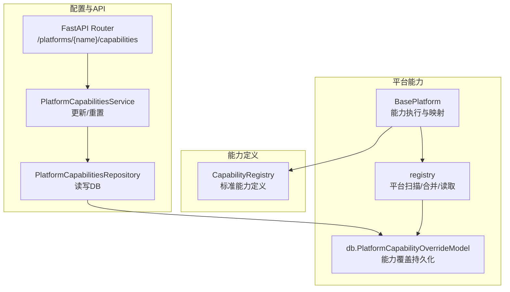
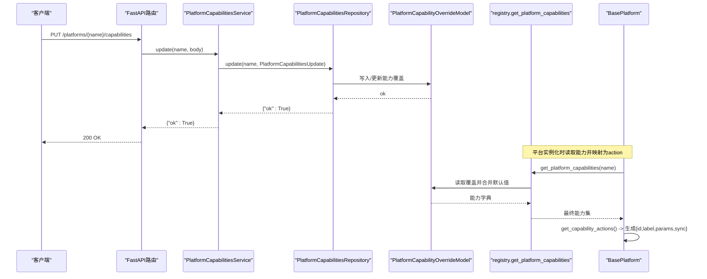
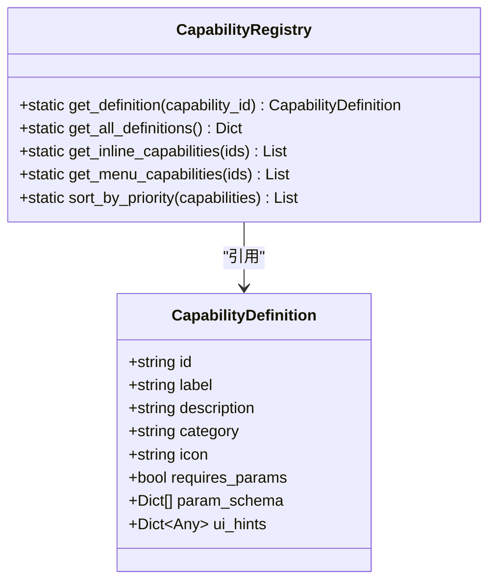
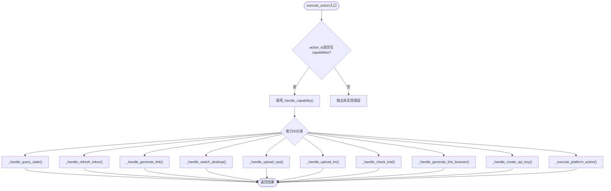
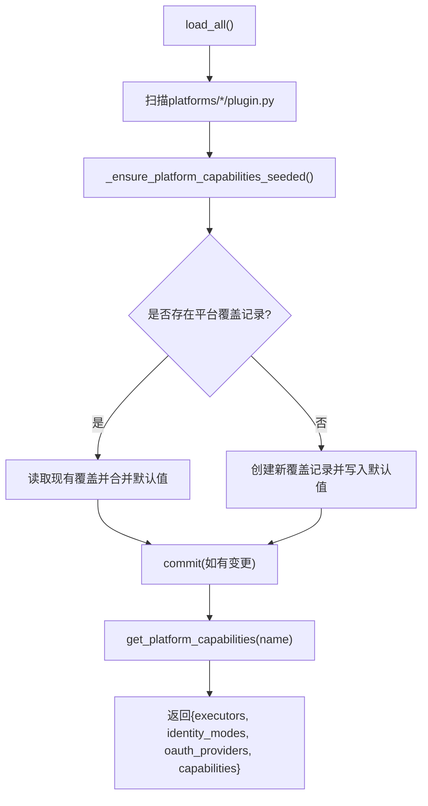
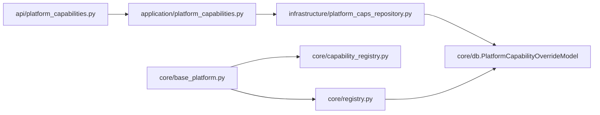

# 能力注册表系统

<cite>
**本文引用的文件**
- [core/capability_registry.py](file://core/capability_registry.py)
- [core/base_platform.py](file://core/base_platform.py)
- [core/registry.py](file://core/registry.py)
- [core/db.py](file://core/db.py)
- [domain/platform_caps.py](file://domain/platform_caps.py)
- [infrastructure/platform_caps_repository.py](file://infrastructure/platform_caps_repository.py)
- [application/platform_capabilities.py](file://application/platform_capabilities.py)
- [api/platform_capabilities.py](file://api/platform_capabilities.py)
</cite>

## 目录
1. [简介](#简介)
2. [项目结构](#项目结构)
3. [核心组件](#核心组件)
4. [架构总览](#架构总览)
5. [详细组件分析](#详细组件分析)
6. [依赖关系分析](#依赖关系分析)
7. [性能考虑](#性能考虑)
8. [故障排查指南](#故障排查指南)
9. [结论](#结论)
10. [附录](#附录)

## 简介
本文件系统性说明“能力注册表系统”的工作原理与数据结构，重点覆盖：
- CapabilityRegistry 如何管理标准能力定义与查询接口
- 能力定义的存储格式、字段含义（label、param_schema、sync 等）
- get_definition() 获取能力元数据的流程
- 能力注册表的初始化过程与数据来源（类默认值 + 数据库覆盖）
- 能力定义与平台配置的关联关系
- 扩展方法与自定义能力注册示例
- 能力版本管理与向后兼容性处理机制

## 项目结构
围绕能力注册表的关键代码分布在以下模块：
- 能力定义与注册表：core/capability_registry.py
- 平台基类与能力执行：core/base_platform.py
- 平台插件扫描与能力持久化：core/registry.py, core/db.py
- 领域模型与仓储：domain/platform_caps.py, infrastructure/platform_caps_repository.py
- 应用服务与API层：application/platform_capabilities.py, api/platform_capabilities.py

图表来源
- [core/capability_registry.py:7-172](file://core/capability_registry.py#L7-L172)
- [core/base_platform.py:286-310](file://core/base_platform.py#L286-L310)
- [core/registry.py:25-123](file://core/registry.py#L25-L123)
- [core/db.py:210-236](file://core/db.py#L210-L236)
- [application/platform_capabilities.py:7-25](file://application/platform_capabilities.py#L7-L25)
- [api/platform_capabilities.py:1-19](file://api/platform_capabilities.py#L1-L19)

章节来源
- [core/capability_registry.py:7-172](file://core/capability_registry.py#L7-L172)
- [core/base_platform.py:286-310](file://core/base_platform.py#L286-L310)
- [core/registry.py:25-123](file://core/registry.py#L25-L123)
- [core/db.py:210-236](file://core/db.py#L210-L236)
- [application/platform_capabilities.py:7-25](file://application/platform_capabilities.py#L7-L25)
- [api/platform_capabilities.py:1-19](file://api/platform_capabilities.py#L1-L19)

## 核心组件
- 能力定义与注册表
  - CapabilityDefinition：描述一个标准能力的元数据（id、label、description、category、icon、requires_params、param_schema、ui_hints）。
  - STANDARD_CAPABILITIES：内置的标准能力集合。
  - CapabilityRegistry：提供按ID查询、全部列出、按UI提示筛选、优先级排序等静态方法。
- 平台能力与执行
  - BasePlatform：声明 capabilities 列表与 capability_overrides；将能力映射为 action（包含 id、label、params、sync），并实现标准能力的默认处理器。
  - registry：自动扫描 platforms/* 下的插件，维护平台能力在数据库中的覆盖记录，并提供 get_platform_capabilities 读取最终生效的能力集。
- 配置与API
  - PlatformCapabilitiesRepository：对平台能力进行更新与重置（仅允许白名单键）。
  - PlatformCapabilitiesService：应用层封装，接收请求体并转换为领域对象。
  - FastAPI Router：暴露 PUT/DELETE 接口用于更新或重置平台能力。

章节来源
- [core/capability_registry.py:7-172](file://core/capability_registry.py#L7-L172)
- [core/base_platform.py:44-58](file://core/base_platform.py#L44-L58)
- [core/base_platform.py:286-310](file://core/base_platform.py#L286-L310)
- [core/registry.py:25-123](file://core/registry.py#L25-L123)
- [infrastructure/platform_caps_repository.py:12-54](file://infrastructure/platform_caps_repository.py#L12-L54)
- [application/platform_capabilities.py:7-25](file://application/platform_capabilities.py#L7-L25)
- [api/platform_capabilities.py:1-19](file://api/platform_capabilities.py#L1-L19)

## 架构总览
能力注册表系统由“标准能力定义 + 平台能力声明 + 数据库覆盖 + 运行时解析”四层组成：
- 标准能力定义：集中定义通用能力（如查询状态、刷新令牌、生成链接等）。
- 平台能力声明：每个平台通过 capabilities 声明自身支持的能力集合。
- 数据库覆盖：通过 PlatformCapabilityOverrideModel 持久化平台级能力覆盖（包括 executor、identity、oauth、capabilities）。
- 运行时解析：BasePlatform 在构造时读取平台能力，并将能力映射为 action 供调用方使用。

图表来源
- [api/platform_capabilities.py:11-18](file://api/platform_capabilities.py#L11-L18)
- [application/platform_capabilities.py:14-24](file://application/platform_capabilities.py#L14-L24)
- [infrastructure/platform_caps_repository.py:22-42](file://infrastructure/platform_caps_repository.py#L22-L42)
- [core/registry.py:100-107](file://core/registry.py#L100-L107)
- [core/base_platform.py:286-310](file://core/base_platform.py#L286-L310)

## 详细组件分析

### 能力定义与查询：CapabilityRegistry
- 数据结构
  - CapabilityDefinition：包含 id、label、description、category、icon、requires_params、param_schema、ui_hints。
  - STANDARD_CAPABILITIES：预置的多种标准能力（如 query_state、refresh_token、generate_link 等）。
- 查询接口
  - get_definition(capability_id)：按ID返回能力定义。
  - get_all_definitions()：返回所有标准能力定义副本。
  - get_inline_capabilities()/get_menu_capabilities()：根据 ui_hints.inline 筛选展示方式。
  - sort_by_priority()：按 ui_hints.priority 排序。
- 典型用法
  - BasePlatform.get_capability_actions() 中通过 CapabilityRegistry.get_definition() 将能力ID映射为 action（id、label、params、sync）。

图表来源
- [core/capability_registry.py:7-172](file://core/capability_registry.py#L7-L172)

章节来源
- [core/capability_registry.py:7-172](file://core/capability_registry.py#L7-L172)

### 平台能力与执行：BasePlatform
- 能力声明
  - capabilities：平台声明支持的能力ID列表。
  - capability_overrides：针对具体能力的标签、参数、同步行为等覆盖。
- 能力到动作的映射
  - get_capability_actions()：遍历 capabilities，查找对应 CapabilityDefinition，结合 overrides 生成 action 列表，包含 id、label、params、sync。
- 能力执行
  - execute_action(action_id, account, params)：优先作为标准能力处理，否则回退到平台自定义实现。
  - 标准能力默认处理器：query_state、refresh_token、generate_link、switch_desktop、upload_cpa、upload_tm、check_trial、generate_link_browser、create_api_key。

图表来源
- [core/base_platform.py:192-233](file://core/base_platform.py#L192-L233)
- [core/base_platform.py:235-284](file://core/base_platform.py#L235-L284)

章节来源
- [core/base_platform.py:44-58](file://core/base_platform.py#L44-L58)
- [core/base_platform.py:192-233](file://core/base_platform.py#L192-L233)
- [core/base_platform.py:235-284](file://core/base_platform.py#L235-L284)
- [core/base_platform.py:286-310](file://core/base_platform.py#L286-L310)

### 平台能力初始化与数据来源：registry
- 自动加载插件
  - load_all()：扫描 platforms/* 并导入各平台的 plugin 模块以触发注册。
- 默认值与归一化
  - _class_defaults(cls)：从类属性提取 supported_executors、supported_identity_modes、supported_oauth_providers、capabilities 的默认值。
  - _normalize_platform_capabilities(data, cls)：将DB中的能力数据归一化为字符串列表，缺失项回退到类默认值。
- 能力种子与合并
  - _ensure_platform_capabilities_seeded(session)：确保每个已注册平台在数据库中存在覆盖记录；若新增能力或缺失项，则合并并写回。
- 读取能力
  - get_platform_capabilities(name)：读取某平台最终生效的能力集（DB覆盖 + 类默认值）。
  - list_platforms()：列出所有平台及其能力信息（含 name、display_name、version 及能力列表）。

图表来源
- [core/registry.py:25-33](file://core/registry.py#L25-L33)
- [core/registry.py:41-61](file://core/registry.py#L41-L61)
- [core/registry.py:64-97](file://core/registry.py#L64-L97)
- [core/registry.py:100-123](file://core/registry.py#L100-L123)

章节来源
- [core/registry.py:25-33](file://core/registry.py#L25-L33)
- [core/registry.py:41-61](file://core/registry.py#L41-L61)
- [core/registry.py:64-97](file://core/registry.py#L64-L97)
- [core/registry.py:100-123](file://core/registry.py#L100-L123)

### 能力定义与平台配置的关联
- 平台声明能力：BasePlatform.capabilities 声明该平台的可用能力ID集合。
- 能力元数据：CapabilityRegistry 提供标准能力定义（label、param_schema、ui_hints 等）。
- 平台覆盖：capability_overrides 可覆盖 label、params、sync 等显示与行为。
- 运行时组装：BasePlatform.get_capability_actions() 将能力ID与定义合并，输出统一 action 结构（id、label、params、sync）。

章节来源
- [core/base_platform.py:44-58](file://core/base_platform.py#L44-L58)
- [core/base_platform.py:286-310](file://core/base_platform.py#L286-L310)
- [core/capability_registry.py:27-132](file://core/capability_registry.py#L27-L132)

### 能力注册表的扩展方法与自定义能力注册示例
- 扩展标准能力
  - 在 STANDARD_CAPABILITIES 中添加新的 CapabilityDefinition，定义 label、param_schema、ui_hints 等。
  - 在 BasePlatform 中实现对应的 _handle_xxx 方法，并在 execute_action 中分发。
- 自定义平台能力
  - 在平台类中设置 capabilities = ["your_custom_cap"]。
  - 如需覆盖显示或行为，设置 capability_overrides = {"your_custom_cap": {"label": "...", "params": [...], "sync": true/false}}。
  - 实现 _execute_platform_action 以处理自定义能力逻辑。
- 示例路径参考
  - 标准能力定义：[core/capability_registry.py:27-132](file://core/capability_registry.py#L27-L132)
  - 能力到动作映射：[core/base_platform.py:286-310](file://core/base_platform.py#L286-L310)
  - 能力执行分发：[core/base_platform.py:192-233](file://core/base_platform.py#L192-L233)

章节来源
- [core/capability_registry.py:27-132](file://core/capability_registry.py#L27-L132)
- [core/base_platform.py:192-233](file://core/base_platform.py#L192-L233)
- [core/base_platform.py:286-310](file://core/base_platform.py#L286-L310)

### 能力版本管理与向后兼容性处理机制
- 版本信息
  - BasePlatform.version 表示平台版本，list_platforms() 会将其纳入平台列表返回。
- 向后兼容
  - get_platform_actions() 在存在 capabilities 时使用能力系统；否则回退为空列表，保证旧平台不报错。
  - execute_action() 先尝试标准能力，再回退到平台自定义实现，未实现时抛出明确错误。
- 能力合并与迁移
  - _ensure_platform_capabilities_seeded() 在启动时将类默认能力与数据库覆盖合并，确保新增能力自动注入到已有平台记录中，避免遗漏。

章节来源
- [core/registry.py:110-123](file://core/registry.py#L110-L123)
- [core/base_platform.py:171-184](file://core/base_platform.py#L171-L184)
- [core/base_platform.py:192-233](file://core/base_platform.py#L192-L233)
- [core/registry.py:64-97](file://core/registry.py#L64-L97)

## 依赖关系分析
- 组件耦合
  - BasePlatform 依赖 CapabilityRegistry 获取标准能力定义，依赖 registry 读取平台能力。
  - registry 依赖 db 的 PlatformCapabilityOverrideModel 进行能力覆盖的持久化。
  - application 与 infrastructure 层通过 Repository 抽象操作数据库，API 层仅暴露 REST 接口。
- 外部依赖
  - SQLModel/SQLAlchemy 用于数据库模型与会话管理。
  - FastAPI 用于路由与服务装配。

图表来源
- [api/platform_capabilities.py:1-19](file://api/platform_capabilities.py#L1-L19)
- [application/platform_capabilities.py:7-25](file://application/platform_capabilities.py#L7-L25)
- [infrastructure/platform_caps_repository.py:12-54](file://infrastructure/platform_caps_repository.py#L12-L54)
- [core/db.py:210-236](file://core/db.py#L210-L236)
- [core/base_platform.py:286-310](file://core/base_platform.py#L286-L310)
- [core/registry.py:100-123](file://core/registry.py#L100-L123)

章节来源
- [api/platform_capabilities.py:1-19](file://api/platform_capabilities.py#L1-L19)
- [application/platform_capabilities.py:7-25](file://application/platform_capabilities.py#L7-L25)
- [infrastructure/platform_caps_repository.py:12-54](file://infrastructure/platform_caps_repository.py#L12-L54)
- [core/db.py:210-236](file://core/db.py#L210-L236)
- [core/base_platform.py:286-310](file://core/base_platform.py#L286-L310)
- [core/registry.py:100-123](file://core/registry.py#L100-L123)

## 性能考虑
- 能力读取缓存
  - 平台能力在 registry 中通过 Session 读取并合并默认值，建议在高并发场景下对 list_platforms/get_platform_capabilities 的结果做短期缓存（例如内存缓存），减少频繁数据库访问。
- 能力合并开销
  - _ensure_platform_capabilities_seeded() 会在每次访问时检查并可能写回合并结果，建议在启动阶段完成一次全量合并，后续只读。
- UI渲染优化
  - 前端可通过能力定义中的 ui_hints.inline/priority 控制按钮展示与排序，减少不必要的渲染与交互复杂度。

## 故障排查指南
- 平台未注册
  - 现象：调用 get(name) 抛出 KeyError。
  - 排查：确认 platforms/* 下的 plugin.py 是否被正确导入；检查 load_all() 是否执行。
- 能力未实现
  - 现象：execute_action() 抛出 NotImplementedError。
  - 排查：确认平台 capabilities 是否包含该能力ID；如需自定义实现，请实现 _execute_platform_action 或对应 _handle_xxx。
- 能力覆盖未生效
  - 现象：PUT /platforms/{name}/capabilities 后仍使用默认能力。
  - 排查：检查 repository.update() 是否成功提交；确认 ALLOWED_KEYS 包含目标字段；重启或重新读取能力以触发合并。
- 数据库连接问题
  - 现象：Session 操作失败。
  - 排查：检查 DATABASE_URL 环境变量与 SQLite 文件路径；确认 engine 初始化正常。

章节来源
- [core/registry.py:35-38](file://core/registry.py#L35-L38)
- [core/base_platform.py:192-233](file://core/base_platform.py#L192-L233)
- [infrastructure/platform_caps_repository.py:22-42](file://infrastructure/platform_caps_repository.py#L22-L42)
- [core/db.py:16-22](file://core/db.py#L16-L22)

## 结论
能力注册表系统通过“标准能力定义 + 平台能力声明 + 数据库覆盖 + 运行时解析”实现了灵活且可扩展的平台能力管理。其核心优势在于：
- 标准化：统一的能力元数据与查询接口，便于前后端协作。
- 可配置：通过数据库覆盖与平台覆盖，动态调整能力行为与展示。
- 可演进：版本信息与合并机制保障向后兼容与平滑升级。
- 易扩展：新增能力只需添加定义与处理器，即可被平台复用。

## 附录
- 关键API
  - PUT /platforms/{name}/capabilities：更新平台能力覆盖。
  - DELETE /platforms/{name}/capabilities：重置平台能力覆盖至默认。
- 数据模型
  - PlatformCapabilityOverrideModel：存储平台能力覆盖（executors、identity_modes、oauth_providers、capabilities）。
- 常用字段说明
  - label：能力显示名称。
  - param_schema：能力参数定义（key、label、type、options 等）。
  - sync：是否同步执行（true/false）。
  - ui_hints.inline/priority：控制UI展示方式与顺序。