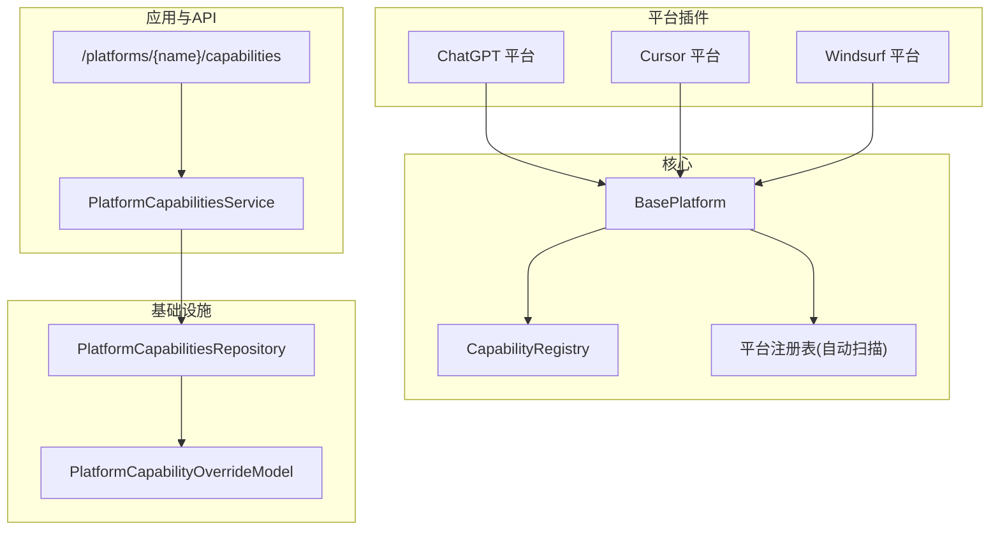
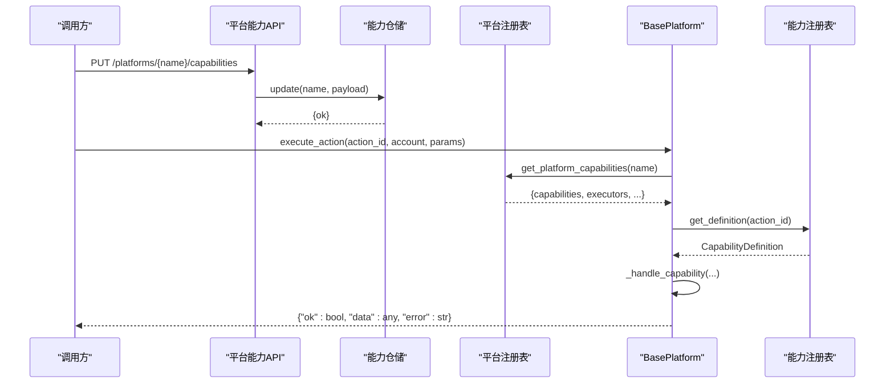
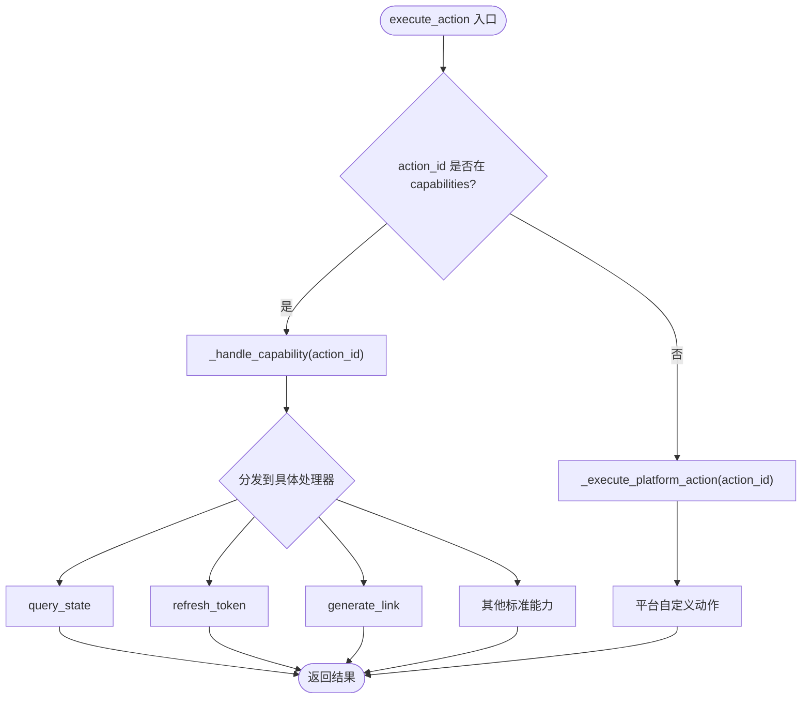
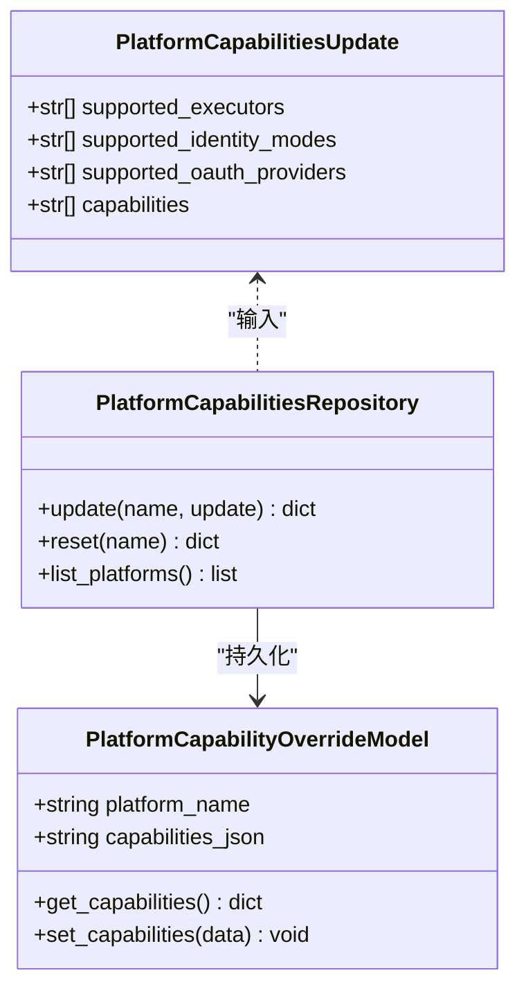
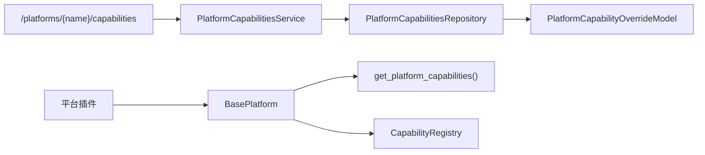

# 能力系统架构

<cite>
**本文引用的文件**
- [core/base_platform.py](file://core/base_platform.py)
- [core/capability_registry.py](file://core/capability_registry.py)
- [core/registry.py](file://core/registry.py)
- [domain/platform_caps.py](file://domain/platform_caps.py)
- [infrastructure/platform_caps_repository.py](file://infrastructure/platform_caps_repository.py)
- [api/platform_capabilities.py](file://api/platform_capabilities.py)
- [application/platform_capabilities.py](file://application/platform_capabilities.py)
- [core/db.py](file://core/db.py)
- [platforms/chatgpt/plugin.py](file://platforms/chatgpt/plugin.py)
- [platforms/cursor/plugin.py](file://platforms/cursor/plugin.py)
- [platforms/windsurf/plugin.py](file://platforms/windsurf/plugin.py)
</cite>

## 目录
1. [简介](#简介)
2. [项目结构](#项目结构)
3. [核心组件](#核心组件)
4. [架构总览](#架构总览)
5. [详细组件分析](#详细组件分析)
6. [依赖关系分析](#依赖关系分析)
7. [性能考虑](#性能考虑)
8. [故障排查指南](#故障排查指南)
9. [结论](#结论)
10. [附录：使用示例与最佳实践](#附录使用示例与最佳实践)

## 简介
本文件系统性阐述 BasePlatform 中的“能力（capabilities）”与“能力覆盖（capability_overrides）”的设计理念、实现机制与使用方式。重点包括：
- 标准能力的定义与统一注册表
- 平台通过 capabilities 列表声明支持的能力
- capability_overrides 如何覆盖默认标签、参数与同步行为
- execute_action() 的调用路由与默认处理器
- 能力注册表的查询与展示
- 自定义能力的开发指南与最佳实践
- 完整的使用示例与集成模式

## 项目结构
能力系统横跨领域模型、基础设施、API 层以及各平台插件，形成“声明式能力 + 运行时解析 + 持久化覆盖”的分层设计：
- 领域模型：定义能力更新的数据结构
- 基础设施：提供能力配置的读写仓库
- API/应用层：暴露配置接口与服务编排
- 核心基类：BasePlatform 负责能力加载、执行与默认处理
- 能力注册表：集中维护标准能力元数据
- 平台插件：声明自身能力并实现具体逻辑

图表来源
- [core/base_platform.py:44-310](file://core/base_platform.py#L44-L310)
- [core/capability_registry.py:27-173](file://core/capability_registry.py#L27-L173)
- [core/registry.py:25-124](file://core/registry.py#L25-L124)
- [application/platform_capabilities.py:7-25](file://application/platform_capabilities.py#L7-L25)
- [api/platform_capabilities.py:1-19](file://api/platform_capabilities.py#L1-L19)
- [infrastructure/platform_caps_repository.py:12-54](file://infrastructure/platform_caps_repository.py#L12-L54)
- [core/db.py:210-227](file://core/db.py#L210-L227)

章节来源
- [core/base_platform.py:44-310](file://core/base_platform.py#L44-L310)
- [core/capability_registry.py:27-173](file://core/capability_registry.py#L27-L173)
- [core/registry.py:25-124](file://core/registry.py#L25-L124)
- [application/platform_capabilities.py:7-25](file://application/platform_capabilities.py#L7-L25)
- [api/platform_capabilities.py:1-19](file://api/platform_capabilities.py#L1-L19)
- [infrastructure/platform_caps_repository.py:12-54](file://infrastructure/platform_caps_repository.py#L12-L54)
- [core/db.py:210-227](file://core/db.py#L210-L227)

## 核心组件
- BasePlatform：平台抽象基类，承载能力声明、能力执行路由、默认处理器与平台特定扩展点。
- CapabilityRegistry：标准能力定义与查询中心，提供按 ID 获取定义、内联/菜单能力筛选、优先级排序等工具。
- 平台注册表：自动扫描 platforms/ 下插件，合并代码默认值与数据库覆盖，提供 get_platform_capabilities() 查询。
- 能力配置仓储：持久化每个平台的 supported_executors、supported_identity_modes、supported_oauth_providers、capabilities。
- API/服务：提供更新与重置平台能力配置的 REST 接口。

章节来源
- [core/base_platform.py:44-310](file://core/base_platform.py#L44-L310)
- [core/capability_registry.py:27-173](file://core/capability_registry.py#L27-L173)
- [core/registry.py:41-107](file://core/registry.py#L41-L107)
- [infrastructure/platform_caps_repository.py:12-54](file://infrastructure/platform_caps_repository.py#L12-L54)
- [application/platform_capabilities.py:7-25](file://application/platform_capabilities.py#L7-L25)
- [api/platform_capabilities.py:1-19](file://api/platform_capabilities.py#L1-L19)

## 架构总览
能力系统在运行时的关键流程如下：
- 启动时自动扫描平台插件，将每个平台的能力默认值写入或合并到数据库记录中。
- 实例化平台时，从注册表读取最终能力集（DB 覆盖优先），用于后续能力展示与执行。
- 调用 execute_action() 时，若 action_id 匹配已声明的能力，则进入标准能力处理器；否则走平台自定义动作。
- 能力元数据（标签、参数、是否内联显示、优先级）来自 CapabilityRegistry，并可被 capability_overrides 覆盖。

图表来源
- [api/platform_capabilities.py:11-18](file://api/platform_capabilities.py#L11-L18)
- [application/platform_capabilities.py:14-21](file://application/platform_capabilities.py#L14-L21)
- [infrastructure/platform_caps_repository.py:22-42](file://infrastructure/platform_caps_repository.py#L22-L42)
- [core/registry.py:100-107](file://core/registry.py#L100-L107)
- [core/base_platform.py:192-233](file://core/base_platform.py#L192-L233)
- [core/capability_registry.py:138-173](file://core/capability_registry.py#L138-L173)

## 详细组件分析

### BasePlatform 能力机制
- 能力声明：子类通过 class 属性 capabilities 声明支持的标准能力集合。
- 能力覆盖：capability_overrides 可针对某能力覆盖 label、params、sync 等元信息。
- 能力加载：构造时通过 get_platform_capabilities() 读取 DB 覆盖后的最终能力集。
- 能力执行：execute_action() 先判断是否为标准能力，再路由到对应处理器；未实现则抛错或返回错误。
- 默认处理器：query_state、refresh_token、generate_link 等提供默认实现，平台可覆写以定制行为。
- 向后兼容：get_platform_actions() 会基于能力系统生成动作列表，便于旧前端继续使用。

图表来源
- [core/base_platform.py:192-233](file://core/base_platform.py#L192-L233)
- [core/base_platform.py:235-284](file://core/base_platform.py#L235-L284)
- [core/base_platform.py:286-310](file://core/base_platform.py#L286-L310)

章节来源
- [core/base_platform.py:44-310](file://core/base_platform.py#L44-L310)

### 能力注册表 CapabilityRegistry
- 标准能力定义：集中维护 id、label、description、category、icon、requires_params、param_schema、ui_hints 等元数据。
- 查询工具：
  - get_definition(id)：按 ID 获取定义
  - get_all_definitions()：获取全部定义副本
  - get_inline_capabilities(ids)：筛选应以内联按钮展示的能力
  - get_menu_capabilities(ids)：筛选应在下拉菜单展示的能力
  - sort_by_priority(caps)：按 ui_hints.priority 排序

章节来源
- [core/capability_registry.py:7-173](file://core/capability_registry.py#L7-L173)

### 平台能力持久化与覆盖
- 领域模型：PlatformCapabilitiesUpdate 描述要更新的字段集合。
- 仓储：PlatformCapabilitiesRepository.update() 仅允许更新白名单键，并将 JSON 存储到 PlatformCapabilityOverrideModel。
- 注册表合并：_ensure_platform_capabilities_seeded() 在首次访问时将代码默认值合并进数据库，保证新增能力自动生效。
- 查询：get_platform_capabilities(name) 返回规范化后的能力集（DB 覆盖优先）。

图表来源
- [domain/platform_caps.py:6-12](file://domain/platform_caps.py#L6-L12)
- [infrastructure/platform_caps_repository.py:12-54](file://infrastructure/platform_caps_repository.py#L12-L54)
- [core/db.py:210-227](file://core/db.py#L210-L227)

章节来源
- [domain/platform_caps.py:6-12](file://domain/platform_caps.py#L6-L12)
- [infrastructure/platform_caps_repository.py:12-54](file://infrastructure/platform_caps_repository.py#L12-L54)
- [core/db.py:210-227](file://core/db.py#L210-L227)
- [core/registry.py:64-107](file://core/registry.py#L64-L107)

### 标准能力定义与使用
- query_state：查询账号状态/额度。默认实现优先调用 get_quota(account)，否则返回基础账户信息。
- refresh_token：刷新认证令牌。默认抛出未实现，平台需覆写。
- generate_link：生成试用/支付链接。默认调用 get_trial_url(account)。
- generate_link_browser：浏览器自动化生成链接。
- switch_desktop：切换到桌面应用。
- upload_cpa/upload_tm：上传至第三方系统。
- check_trial：检查试用资格。
- create_api_key：创建 API Key。

章节来源
- [core/capability_registry.py:27-132](file://core/capability_registry.py#L27-L132)
- [core/base_platform.py:235-284](file://core/base_platform.py#L235-L284)

### 平台实现示例
- ChatGPT：声明 capabilities，覆写 query_state、refresh_token、generate_link，并通过 _execute_platform_action 处理平台专属动作。
- Cursor：声明 capabilities，并在 execute_action 中直接实现平台动作（如切换桌面、生成试用链接、查询状态）。
- Windsurf：声明 capabilities 并使用 capability_overrides 覆盖 generate_link、generate_link_browser、switch_desktop 的标签与参数；覆写 _handle_* 方法实现具体逻辑。

章节来源
- [platforms/chatgpt/plugin.py:48-66](file://platforms/chatgpt/plugin.py#L48-L66)
- [platforms/chatgpt/plugin.py:227-335](file://platforms/chatgpt/plugin.py#L227-L335)
- [platforms/chatgpt/plugin.py:338-420](file://platforms/chatgpt/plugin.py#L338-L420)
- [platforms/cursor/plugin.py:18-32](file://platforms/cursor/plugin.py#L18-L32)
- [platforms/cursor/plugin.py:129-264](file://platforms/cursor/plugin.py#L129-L264)
- [platforms/windsurf/plugin.py:35-69](file://platforms/windsurf/plugin.py#L35-L69)
- [platforms/windsurf/plugin.py:178-384](file://platforms/windsurf/plugin.py#L178-L384)

### 能力注册与查询
- 自动加载：load_all() 扫描 platforms/ 子模块并导入 plugin，触发 @register 装饰器完成注册。
- 能力合并：_ensure_platform_capabilities_seeded() 将代码默认值合并入数据库，确保新增能力无需手动初始化。
- 查询接口：get_platform_capabilities(name) 返回最终能力集；list_platforms() 返回所有平台及其能力。

章节来源
- [core/registry.py:25-33](file://core/registry.py#L25-L33)
- [core/registry.py:64-107](file://core/registry.py#L64-L107)
- [core/registry.py:110-124](file://core/registry.py#L110-L124)

## 依赖关系分析
- BasePlatform 依赖：
  - core.registry.get_platform_capabilities() 获取最终能力集
  - core.capability_registry.CapabilityRegistry 获取能力元数据
  - 平台插件覆写 _handle_* 或 _execute_platform_action 实现具体逻辑
- API/服务依赖：
  - application.platform_capabilities.PlatformCapabilitiesService 编排仓储操作
  - infrastructure.platform_caps_repository.PlatformCapabilitiesRepository 持久化能力配置
  - core.db.PlatformCapabilityOverrideModel 作为数据模型

图表来源
- [api/platform_capabilities.py:11-18](file://api/platform_capabilities.py#L11-L18)
- [application/platform_capabilities.py:7-25](file://application/platform_capabilities.py#L7-L25)
- [infrastructure/platform_caps_repository.py:12-54](file://infrastructure/platform_caps_repository.py#L12-L54)
- [core/db.py:210-227](file://core/db.py#L210-L227)
- [core/base_platform.py:60-75](file://core/base_platform.py#L60-L75)
- [core/base_platform.py:290-310](file://core/base_platform.py#L290-L310)

章节来源
- [api/platform_capabilities.py:11-18](file://api/platform_capabilities.py#L11-L18)
- [application/platform_capabilities.py:7-25](file://application/platform_capabilities.py#L7-L25)
- [infrastructure/platform_caps_repository.py:12-54](file://infrastructure/platform_caps_repository.py#L12-L54)
- [core/db.py:210-227](file://core/db.py#L210-L227)
- [core/base_platform.py:60-75](file://core/base_platform.py#L60-L75)
- [core/base_platform.py:290-310](file://core/base_platform.py#L290-L310)

## 性能考虑
- 能力加载仅在平台实例化与首次访问时进行，避免重复 IO。
- 能力元数据查询为内存字典查找，复杂度 O(1)。
- 能力配置更新通过仓储原子写入，减少并发冲突。
- 建议：
  - 合理拆分大动作（如 generate_link_browser）为异步任务，避免阻塞请求。
  - 对频繁查询的状态能力（如 query_state）增加缓存策略（例如短 TTL）。
  - 控制能力列表规模，避免 UI 渲染过多项导致卡顿。

[本节为通用指导，不直接分析具体文件]

## 故障排查指南
- 能力未生效：
  - 确认平台已正确声明 capabilities，且已通过注册表合并到数据库。
  - 检查 get_platform_capabilities(name) 返回值是否包含目标能力。
- 能力执行失败：
  - 检查 execute_action() 是否正确路由到 _handle_capability()。
  - 查看平台是否实现了对应的 _handle_* 方法，或未实现时是否返回了合理的错误信息。
- 能力覆盖无效：
  - 确认 capability_overrides 的键名与能力 ID 一致，且字段合法（label、params、sync）。
  - 通过 API 更新后，重新实例化平台以加载最新配置。
- 验证码/浏览器相关能力异常：
  - 检查 solve_turnstile_with_fallback() 候选 provider 是否配置可用。
  - 确认 executor_type 与能力要求是否匹配（如 headless/headed）。

章节来源
- [core/base_platform.py:60-75](file://core/base_platform.py#L60-L75)
- [core/base_platform.py:192-233](file://core/base_platform.py#L192-L233)
- [core/base_platform.py:330-430](file://core/base_platform.py#L330-L430)
- [core/registry.py:64-107](file://core/registry.py#L64-L107)

## 结论
能力系统通过“声明式能力 + 注册表 + 持久化覆盖”的设计，实现了跨平台的一致能力模型与灵活的运行时行为定制。BasePlatform 提供统一的执行入口与默认处理器，平台插件仅需声明能力并实现必要的方法即可接入。能力覆盖机制使得同一能力在不同平台拥有不同的标签、参数与同步行为，满足多样化业务需求。

[本节为总结性内容，不直接分析具体文件]

## 附录：使用示例与最佳实践

### 如何在平台中声明能力
- 在平台类上定义 capabilities 列表，列出所需的标准能力 ID。
- 如需调整 UI 展示或参数，使用 capability_overrides 覆盖 label、params、sync。

章节来源
- [platforms/windsurf/plugin.py:35-69](file://platforms/windsurf/plugin.py#L35-L69)
- [platforms/chatgpt/plugin.py:48-66](file://platforms/chatgpt/plugin.py#L48-L66)
- [platforms/cursor/plugin.py:18-32](file://platforms/cursor/plugin.py#L18-L32)

### 如何覆写标准能力处理器
- 覆写 _handle_query_state、_handle_refresh_token、_handle_generate_link 等方法以实现平台特定逻辑。
- 保持返回格式一致：{"ok": bool, "data": any, "error": str}。

章节来源
- [platforms/chatgpt/plugin.py:338-420](file://platforms/chatgpt/plugin.py#L338-L420)
- [platforms/windsurf/plugin.py:248-384](file://platforms/windsurf/plugin.py#L248-L384)
- [core/base_platform.py:235-284](file://core/base_platform.py#L235-L284)

### 如何通过 API 更新能力配置
- 调用 PUT /platforms/{name}/capabilities 传入支持的 executors、identity modes、oauth providers、capabilities。
- 调用 DELETE /platforms/{name}/capabilities 重置为代码默认值。

章节来源
- [api/platform_capabilities.py:11-18](file://api/platform_capabilities.py#L11-L18)
- [application/platform_capabilities.py:14-21](file://application/platform_capabilities.py#L14-L21)
- [infrastructure/platform_caps_repository.py:22-42](file://infrastructure/platform_caps_repository.py#L22-L42)

### 如何查询能力与动作列表
- 使用 get_platform_capabilities(name) 获取最终能力集。
- 使用 get_capability_actions() 获取向后兼容的动作列表（基于能力元数据生成）。
- 使用 CapabilityRegistry 的工具方法筛选内联/菜单能力并按优先级排序。

章节来源
- [core/registry.py:100-107](file://core/registry.py#L100-L107)
- [core/base_platform.py:290-310](file://core/base_platform.py#L290-L310)
- [core/capability_registry.py:148-173](file://core/capability_registry.py#L148-L173)

### 自定义能力开发指南
- 在 CapabilityRegistry 中添加新的标准能力定义（id、label、description、category、param_schema、ui_hints）。
- 在 BasePlatform._handle_capability() 中增加分支，调用新处理器。
- 平台覆写对应 _handle_* 方法实现具体逻辑。
- 通过 capability_overrides 调整该能力在不同平台的展示与行为。

章节来源
- [core/capability_registry.py:27-132](file://core/capability_registry.py#L27-L132)
- [core/base_platform.py:203-233](file://core/base_platform.py#L203-L233)

### 集成模式与最佳实践
- 统一返回格式：所有能力处理器返回 {"ok", "data", "error"}，便于上层统一处理。
- 参数校验：在处理器中对 params 做最小校验，缺失必填参数时返回明确错误。
- 安全与幂等：涉及敏感操作（如刷新 token、生成支付链接）应做好鉴权与重试保护。
- 日志与可观测性：在关键路径记录日志，便于问题定位。
- 渐进迁移：旧平台可通过 get_platform_actions() 继续工作，逐步迁移到能力系统。

[本节为通用指导，不直接分析具体文件]